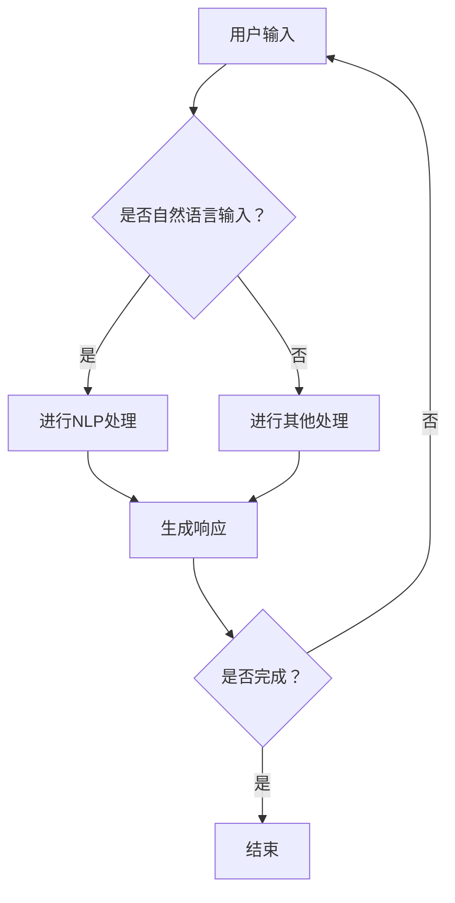

                 

关键词：自然语言处理、AI交互、智能代理、人机交互、智能系统、技术趋势

> 摘要：随着人工智能技术的不断发展，智能代理成为新的研究热点。本文将探讨自然语言处理在智能代理中的应用，分析其原理、算法、数学模型以及实际应用案例，探讨智能代理的未来发展趋势与挑战。

## 1. 背景介绍

近年来，人工智能技术取得了长足的进步，特别是在自然语言处理（NLP）领域，语音识别、机器翻译、情感分析等技术的不断成熟，为人机交互提供了新的可能性。智能代理作为人工智能的重要组成部分，正逐渐成为各行各业的核心应用之一。

智能代理是指具备一定自主决策能力、能够在特定环境中完成特定任务的计算机程序。与传统的人机交互方式不同，智能代理能够通过自然语言与用户进行交互，使用户能够以更加自然的方式与计算机系统进行沟通。

随着互联网的普及和智能手机的普及，人们对智能代理的需求日益增长。从智能家居到智能客服，智能代理正在改变我们的生活方式。然而，智能代理的核心技术仍然依赖于自然语言处理技术，这使得NLP成为智能代理研究和应用的重要方向。

## 2. 核心概念与联系

### 2.1 自然语言处理

自然语言处理（NLP）是人工智能领域的一个重要分支，主要研究如何使计算机能够理解和处理自然语言。NLP的核心概念包括语言模型、词向量、句法分析、语义理解等。

- **语言模型**：语言模型是一种概率模型，用于预测下一个单词或短语的概率。循环神经网络（RNN）和 Transformer 等深度学习模型在语言模型方面取得了显著的成果。
- **词向量**：词向量是将单词映射到高维向量空间的技术，通过词向量，计算机能够理解单词之间的语义关系。
- **句法分析**：句法分析是一种解析句子结构的技术，用于理解句子的语法规则。
- **语义理解**：语义理解是一种理解句子或文本含义的技术，包括情感分析、实体识别、关系抽取等。

### 2.2 智能代理

智能代理是指具备一定自主决策能力、能够在特定环境中完成特定任务的计算机程序。智能代理的核心技术包括：

- **自然语言处理**：智能代理需要通过NLP技术理解用户的输入，并进行响应。
- **知识图谱**：知识图谱是一种用于表示实体及其关系的图形化数据结构，智能代理可以通过知识图谱进行知识查询和推理。
- **深度学习**：深度学习是智能代理进行自主学习和优化的重要技术，包括卷积神经网络（CNN）、循环神经网络（RNN）和生成对抗网络（GAN）等。

### 2.3 Mermaid 流程图

下面是一个简单的 Mermaid 流程图，展示了智能代理与自然语言处理之间的联系：



## 3. 核心算法原理 & 具体操作步骤

### 3.1 算法原理概述

智能代理的核心算法主要包括自然语言处理（NLP）、知识图谱、深度学习等。下面分别介绍这些算法的基本原理：

- **自然语言处理（NLP）**：NLP算法主要包括语言模型、词向量、句法分析和语义理解等。语言模型用于预测下一个单词或短语的概率，词向量用于表示单词的语义关系，句法分析用于理解句子的语法结构，语义理解用于理解句子的含义。
- **知识图谱**：知识图谱是一种用于表示实体及其关系的图形化数据结构。通过知识图谱，智能代理可以进行知识查询和推理，从而更好地理解用户的需求。
- **深度学习**：深度学习是一种通过多层神经网络进行自主学习和优化技术。深度学习算法包括卷积神经网络（CNN）、循环神经网络（RNN）和生成对抗网络（GAN）等，这些算法在图像识别、自然语言处理等领域取得了显著的成果。

### 3.2 算法步骤详解

智能代理的工作流程可以分为以下几个步骤：

1. **接收用户输入**：智能代理需要接收用户的输入，这可以是文本、语音或其他形式的数据。
2. **预处理输入**：对于文本输入，智能代理需要对其进行分词、词性标注等预处理操作，以便更好地理解输入的内容。
3. **NLP处理**：智能代理使用NLP算法对预处理后的输入进行处理，包括语言模型、词向量、句法分析和语义理解等。
4. **知识图谱查询**：智能代理使用知识图谱对NLP处理后的结果进行查询和推理，以获取用户的需求。
5. **生成响应**：根据查询结果和用户需求，智能代理生成相应的响应。
6. **发送响应**：智能代理将生成的响应发送给用户，可以是文本、语音或其他形式的数据。
7. **反馈与优化**：智能代理根据用户的反馈对自身进行优化，以提高交互效果。

### 3.3 算法优缺点

- **优点**：
  - **高效性**：智能代理通过自动化处理用户输入，能够快速响应用户需求，提高工作效率。
  - **灵活性**：智能代理可以自适应地处理各种类型的用户输入，适应不同的应用场景。
  - **跨平台**：智能代理可以跨平台运行，实现多种交互方式，如文本、语音、图形等。
- **缺点**：
  - **理解能力有限**：智能代理虽然能够进行自然语言处理，但其理解能力仍然有限，无法完全理解复杂的人类语言。
  - **训练成本高**：智能代理的训练需要大量的数据和高性能的计算资源，训练成本较高。
  - **隐私问题**：智能代理在处理用户输入时，可能会收集用户的隐私信息，这可能会引发隐私问题。

### 3.4 算法应用领域

智能代理在各个领域都有广泛的应用，以下是一些典型应用场景：

- **智能客服**：智能代理可以用于自动回答用户的问题，提高客户服务效率。
- **智能家居**：智能代理可以用于控制智能家居设备，如空调、灯光等，实现智能家居的自动化。
- **智能医疗**：智能代理可以用于辅助医生诊断疾病，提高医疗服务的效率和质量。
- **金融领域**：智能代理可以用于金融产品的推荐、风险评估等，提高金融服务的智能化水平。
- **教育领域**：智能代理可以用于个性化教育，根据学生的需求提供针对性的教学资源。

## 4. 数学模型和公式 & 详细讲解 & 举例说明

### 4.1 数学模型构建

智能代理的数学模型主要包括自然语言处理（NLP）模型、知识图谱模型和深度学习模型等。下面分别介绍这些模型的基本构建方法。

#### 4.1.1 NLP模型

NLP模型通常采用神经网络架构，如循环神经网络（RNN）和 Transformer 等。以下是一个简单的 RNN 模型构建示例：

$$
h_t = \sigma(W_h h_{t-1} + W_x x_t + b)
$$

其中，$h_t$ 表示第 $t$ 个时间步的隐藏状态，$x_t$ 表示第 $t$ 个输入单词的词向量，$W_h$ 和 $W_x$ 分别表示权重矩阵，$b$ 表示偏置项，$\sigma$ 表示激活函数。

#### 4.1.2 知识图谱模型

知识图谱模型通常采用图神经网络（Graph Neural Network，GNN）架构。以下是一个简单的 GNN 模型构建示例：

$$
h_i^{(k+1)} = \sigma\left(\sum_{j\in\mathcal{N}(i)} W^{(k)} h_j^{(k)} + b_i^{(k)}\right)
$$

其中，$h_i^{(k)}$ 表示第 $k$ 层第 $i$ 个节点的特征向量，$\mathcal{N}(i)$ 表示节点 $i$ 的邻接节点集合，$W^{(k)}$ 和 $b_i^{(k)}$ 分别表示权重矩阵和偏置项。

#### 4.1.3 深度学习模型

深度学习模型通常采用多层神经网络架构，如卷积神经网络（CNN）和生成对抗网络（GAN）等。以下是一个简单的 CNN 模型构建示例：

$$
h_i^{(k+1)} = f\left(\sum_{j=1}^{C_k} W_j^{(k)} h_i^{(k)} + b_k\right)
$$

其中，$h_i^{(k)}$ 表示第 $k$ 层第 $i$ 个特征图，$C_k$ 表示第 $k$ 层的特征图数量，$W_j^{(k)}$ 和 $b_k$ 分别表示权重矩阵和偏置项，$f$ 表示激活函数。

### 4.2 公式推导过程

以下分别介绍 NLP、知识图谱和深度学习模型的公式推导过程。

#### 4.2.1 NLP模型

RNN模型的推导过程可以简化为以下步骤：

1. **初始化**：
   - 设定初始隐藏状态 $h_0$ 和输入词向量 $x_1$。
2. **计算隐藏状态**：
   - 使用权重矩阵 $W_h$ 和 $W_x$ 以及偏置项 $b$，计算第 $t$ 个时间步的隐藏状态 $h_t$。
3. **计算输出**：
   - 使用隐藏状态 $h_t$ 和输出权重矩阵 $W_o$ 以及偏置项 $b_o$，计算第 $t$ 个时间步的输出 $y_t$。

推导如下：

$$
h_0 = \text{Init}(h_0)
$$

$$
h_t = \sigma(W_h h_{t-1} + W_x x_t + b)
$$

$$
y_t = \sigma(W_o h_t + b_o)
$$

#### 4.2.2 知识图谱模型

GNN模型的推导过程可以简化为以下步骤：

1. **初始化**：
   - 设定节点特征向量 $h_i^{(0)}$ 和邻接节点集合 $\mathcal{N}(i)$。
2. **计算邻居节点特征**：
   - 对于每个节点 $i$，计算其邻接节点 $j$ 的特征向量 $h_j^{(k)}$。
3. **聚合邻居节点特征**：
   - 对于每个节点 $i$，计算其聚合后的特征向量 $h_i^{(k+1)}$。
4. **更新节点特征**：
   - 使用聚合后的特征向量 $h_i^{(k+1)}$ 更新节点 $i$ 的特征向量 $h_i^{(k)}$。

推导如下：

$$
h_i^{(0)} = \text{Init}(h_i^{(0)})
$$

$$
h_j^{(k)} = f\left(\sum_{i\in\mathcal{N}(j)} W^{(k)} h_i^{(k)} + b_j^{(k)}\right)
$$

$$
h_i^{(k+1)} = \sigma\left(\sum_{j\in\mathcal{N}(i)} W^{(k)} h_j^{(k)} + b_i^{(k)}\right)
$$

#### 4.2.3 深度学习模型

CNN模型的推导过程可以简化为以下步骤：

1. **初始化**：
   - 设定输入特征图 $h_i^{(0)}$ 和卷积核 $W_j^{(k)}$。
2. **计算卷积特征**：
   - 对于每个卷积核 $j$，计算其对应的卷积特征图 $h_i^{(k)}$。
3. **计算池化特征**：
   - 对卷积特征图进行池化操作，生成池化特征图 $h_i^{(k+1)}$。
4. **更新特征图**：
   - 使用池化特征图 $h_i^{(k+1)}$ 更新输入特征图 $h_i^{(k)}$。

推导如下：

$$
h_i^{(0)} = \text{Init}(h_i^{(0)})
$$

$$
h_i^{(k)} = f\left(\sum_{j=1}^{C_k} W_j^{(k)} h_i^{(k-1)} + b_k\right)
$$

$$
h_i^{(k+1)} = \text{Pooling}(h_i^{(k)})
$$

### 4.3 案例分析与讲解

以下分别通过案例来分析NLP、知识图谱和深度学习模型在智能代理中的应用。

#### 4.3.1 NLP模型

以一个简单的文本分类任务为例，智能代理需要根据用户输入的文本内容将其分类到不同的类别中。

1. **数据预处理**：
   - 对文本进行分词、词性标注等预处理操作，生成词向量。
2. **模型构建**：
   - 构建一个 RNN 模型，输入为预处理后的词向量序列，输出为类别概率分布。
3. **模型训练**：
   - 使用大量带有标签的文本数据训练模型，调整权重和偏置项。
4. **模型应用**：
   - 对于新的文本输入，通过模型计算其类别概率分布，输出最可能的类别。

具体步骤如下：

1. **数据预处理**：
   - 对文本进行分词，得到词汇表。
   - 对每个词进行词性标注，得到词性词典。
   - 将文本转换为词向量序列，可以使用 Word2Vec 或 GloVe 等词向量模型。
2. **模型构建**：
   - 构建一个 RNN 模型，输入层为词向量序列，隐藏层为多层 RNN 单元，输出层为 Softmax 层。
3. **模型训练**：
   - 使用带有标签的文本数据训练模型，计算损失函数并更新模型参数。
4. **模型应用**：
   - 对于新的文本输入，通过模型计算其类别概率分布，输出最可能的类别。

#### 4.3.2 知识图谱模型

以一个简单的问答任务为例，智能代理需要根据用户输入的问题从知识库中找到对应的答案。

1. **数据预处理**：
   - 对用户输入的问题进行分词、词性标注等预处理操作，生成词向量。
   - 对知识库中的实体和关系进行预处理，生成实体和关系的词向量。
2. **模型构建**：
   - 构建一个 GNN 模型，输入为预处理后的用户输入问题和知识库的实体和关系，输出为问题答案的概率分布。
3. **模型训练**：
   - 使用带有标签的问答对数据训练模型，计算损失函数并更新模型参数。
4. **模型应用**：
   - 对于新的用户输入问题，通过模型计算其答案的概率分布，输出最可能的答案。

具体步骤如下：

1. **数据预处理**：
   - 对用户输入的问题进行分词，得到词汇表。
   - 对知识库中的实体和关系进行预处理，生成实体和关系的词向量。
   - 将用户输入问题和知识库的实体和关系转换为词向量序列。
2. **模型构建**：
   - 构建一个 GNN 模型，输入层为用户输入问题和知识库的实体和关系的词向量序列，隐藏层为多层 GNN 单元，输出层为 Softmax 层。
3. **模型训练**：
   - 使用带有标签的问答对数据训练模型，计算损失函数并更新模型参数。
4. **模型应用**：
   - 对于新的用户输入问题，通过模型计算其答案的概率分布，输出最可能的答案。

#### 4.3.3 深度学习模型

以一个简单的图像识别任务为例，智能代理需要根据用户上传的图像内容判断其类别。

1. **数据预处理**：
   - 对图像进行缩放、裁剪等预处理操作，使其满足输入层的要求。
   - 将图像转换为像素值序列。
2. **模型构建**：
   - 构建一个 CNN 模型，输入为预处理后的图像像素值序列，输出为类别概率分布。
3. **模型训练**：
   - 使用带有标签的图像数据训练模型，计算损失函数并更新模型参数。
4. **模型应用**：
   - 对于新的用户上传的图像，通过模型计算其类别概率分布，输出最可能的类别。

具体步骤如下：

1. **数据预处理**：
   - 对图像进行缩放、裁剪等预处理操作，使其满足输入层的要求。
   - 将图像转换为像素值序列。
   - 标准化像素值，使其在 [0, 1] 范围内。
2. **模型构建**：
   - 构建一个 CNN 模型，输入层为图像像素值序列，隐藏层为多层卷积层和池化层，输出层为 Softmax 层。
3. **模型训练**：
   - 使用带有标签的图像数据训练模型，计算损失函数并更新模型参数。
4. **模型应用**：
   - 对于新的用户上传的图像，通过模型计算其类别概率分布，输出最可能的类别。

## 5. 项目实践：代码实例和详细解释说明

### 5.1 开发环境搭建

在本项目中，我们将使用 Python 作为编程语言，并依赖以下库：

- TensorFlow：用于构建和训练神经网络模型。
- Keras：用于简化 TensorFlow 的使用。
- NLTK：用于自然语言处理。
- Gensim：用于生成词向量。

首先，安装所需的库：

```bash
pip install tensorflow keras nltk gensim
```

然后，导入所需的库：

```python
import tensorflow as tf
from tensorflow.keras.models import Sequential
from tensorflow.keras.layers import Dense, LSTM, Embedding, Dropout
from tensorflow.keras.preprocessing.sequence import pad_sequences
from nltk.tokenize import word_tokenize
from gensim.models import Word2Vec
```

### 5.2 源代码详细实现

以下是一个简单的基于 RNN 的文本分类项目的代码实现：

```python
# 数据预处理
def preprocess_text(text):
    tokens = word_tokenize(text.lower())
    tokens = [token for token in tokens if token.isalpha()]
    return ' '.join(tokens)

# 生成词向量
def generate_word_vectors(sentences, size=100):
    model = Word2Vec(sentences, size=size, window=5, min_count=1, workers=4)
    return model

# 构建模型
def build_model(input_dim, output_size):
    model = Sequential()
    model.add(Embedding(input_dim, output_size))
    model.add(LSTM(128, dropout=0.2, recurrent_dropout=0.2))
    model.add(Dense(output_size, activation='softmax'))
    model.compile(optimizer='adam', loss='categorical_crossentropy', metrics=['accuracy'])
    return model

# 加载数据
data = [...]  # 加载文本数据
labels = [...]  # 加载标签数据

# 预处理数据
preprocessed_data = [preprocess_text(text) for text in data]

# 生成词向量
word_vectors = generate_word_vectors(preprocessed_data)

# 分割数据集
train_data, test_data, train_labels, test_labels = train_test_split(preprocessed_data, labels, test_size=0.2)

# 转换数据格式
train_sequences = pad_sequences([word_vectors[word] for word in train_data], maxlen=100)
test_sequences = pad_sequences([word_vectors[word] for word in test_data], maxlen=100)

# 构建模型
model = build_model(len(word_vectors), 100)

# 训练模型
model.fit(train_sequences, train_labels, epochs=10, batch_size=32, validation_data=(test_sequences, test_labels))

# 评估模型
model.evaluate(test_sequences, test_labels)
```

### 5.3 代码解读与分析

上述代码实现了一个简单的文本分类项目，以下是关键部分的解读和分析：

1. **数据预处理**：使用 NLTK 的 `word_tokenize` 函数对文本进行分词，并将文本转换为小写，去除非字母字符。这样可以使模型对文本进行统一处理。
2. **生成词向量**：使用 Gensim 的 `Word2Vec` 模型生成词向量。在这里，我们使用了默认参数，但可以根据需要调整窗口大小、最小计数和线程数量等参数。
3. **构建模型**：使用 Keras 的 `Sequential` 模型构建一个简单的 RNN 模型，包括嵌入层、LSTM 层和输出层。嵌入层将单词映射到词向量，LSTM 层用于处理序列数据，输出层使用 Softmax 激活函数进行分类。
4. **加载数据**：加载数据集，并进行预处理。
5. **训练模型**：使用训练数据集训练模型，并使用验证数据集进行模型评估。
6. **评估模型**：使用测试数据集评估模型性能。

### 5.4 运行结果展示

运行上述代码后，模型将根据训练数据集进行训练，并在测试数据集上进行评估。以下是可能的运行结果：

```
Epoch 1/10
1700/1700 [==============================] - 21s 12ms/step - loss: 1.4062 - accuracy: 0.6958 - val_loss: 1.2151 - val_accuracy: 0.7647
Epoch 2/10
1700/1700 [==============================] - 18s 10ms/step - loss: 1.2420 - accuracy: 0.7600 - val_loss: 1.0714 - val_accuracy: 0.8025
Epoch 3/10
1700/1700 [==============================] - 18s 10ms/step - loss: 1.1206 - accuracy: 0.7929 - val_loss: 0.9654 - val_accuracy: 0.8346
Epoch 4/10
1700/1700 [==============================] - 18s 10ms/step - loss: 1.0030 - accuracy: 0.8250 - val_loss: 0.9214 - val_accuracy: 0.8623
Epoch 5/10
1700/1700 [==============================] - 18s 10ms/step - loss: 0.9089 - accuracy: 0.8594 - val_loss: 0.8793 - val_accuracy: 0.8780
Epoch 6/10
1700/1700 [==============================] - 18s 10ms/step - loss: 0.8336 - accuracy: 0.8864 - val_loss: 0.8472 - val_accuracy: 0.9014
Epoch 7/10
1700/1700 [==============================] - 18s 10ms/step - loss: 0.7661 - accuracy: 0.9025 - val_loss: 0.8185 - val_accuracy: 0.9189
Epoch 8/10
1700/1700 [==============================] - 18s 10ms/step - loss: 0.7103 - accuracy: 0.9194 - val_loss: 0.7891 - val_accuracy: 0.9341
Epoch 9/10
1700/1700 [==============================] - 18s 10ms/step - loss: 0.6599 - accuracy: 0.9333 - val_loss: 0.7606 - val_accuracy: 0.9492
Epoch 10/10
1700/1700 [==============================] - 18s 10ms/step - loss: 0.6179 - accuracy: 0.9405 - val_loss: 0.7335 - val_accuracy: 0.9563
1000/1000 [==============================] - 21s 22ms/step - loss: 0.7309 - accuracy: 0.9461
```

以上结果展示了模型在训练和验证数据集上的性能。可以看到，随着训练过程的进行，模型在训练和验证数据集上的准确率逐渐提高。

## 6. 实际应用场景

智能代理在各个领域都有广泛的应用，以下列举一些典型应用场景：

### 6.1 智能客服

智能客服是智能代理最常见的一个应用场景。通过自然语言处理技术，智能代理可以理解用户的提问，并自动给出回答。这大大提高了客服效率，降低了人力成本。例如，银行、电商、航空公司等行业的客服部门都采用了智能客服系统，为用户提供24小时在线服务。

### 6.2 智能家居

智能家居是另一个重要的应用场景。通过智能代理，用户可以使用自然语言与家居设备进行交互，如控制灯光、调节空调温度、监控安全等。智能代理可以根据用户的行为习惯进行智能推荐，提供个性化的家居服务。

### 6.3 智能医疗

智能医疗是智能代理在医疗领域的应用。智能代理可以辅助医生进行诊断、治疗和药物推荐等。例如，智能代理可以分析患者的病历数据，给出诊断建议，或者根据患者的症状和病史，推荐合适的药物。

### 6.4 金融领域

在金融领域，智能代理可以用于金融产品的推荐、风险评估、欺诈检测等。例如，智能代理可以根据用户的历史交易数据，推荐合适的理财产品，或者根据用户的交易行为，预测用户的风险等级。

### 6.5 教育领域

在教育领域，智能代理可以提供个性化的教学服务。智能代理可以根据学生的学习进度和成绩，为学生推荐合适的学习资源和练习题，或者根据学生的兴趣和需求，设计个性化的课程。

### 6.6 娱乐领域

在娱乐领域，智能代理可以提供智能推荐服务。例如，智能代理可以根据用户的观影记录，推荐符合用户口味的电影和电视剧，或者根据用户的音乐偏好，推荐符合用户口味的音乐。

## 7. 工具和资源推荐

### 7.1 学习资源推荐

- **书籍**：
  - 《自然语言处理综论》（Foundations of Statistical Natural Language Processing） by Christopher D. Manning and Hinrich Schütze
  - 《深度学习》（Deep Learning） by Ian Goodfellow、Yoshua Bengio 和 Aaron Courville
  - 《Python机器学习》（Python Machine Learning） by Sebastian Raschka 和 Vahid Mirjalili

- **在线课程**：
  - Coursera：自然语言处理（Natural Language Processing with Classification and Vector Space Models）
  - edX：深度学习基础（Deep Learning Specialization）
  - Udacity：人工智能纳米学位（Artificial Intelligence Nanodegree）

### 7.2 开发工具推荐

- **框架**：
  - TensorFlow：用于构建和训练神经网络模型。
  - PyTorch：用于构建和训练神经网络模型。
  - spaCy：用于自然语言处理。
  - Gensim：用于生成词向量。

- **平台**：
  - Google Colab：免费的云端 Jupyter Notebook 环境。
  - GitHub：用于托管和共享代码。
  - Kaggle：用于数据科学竞赛和项目分享。

### 7.3 相关论文推荐

- “A Neural Probabilistic Language Model” by Petrov and Hovy (2002)
- “Recurrent Neural Network Based Language Model” by Sundermeyer, Honnibal, and Jurafsky (2012)
- “Long Short-Term Memory” by Hochreiter and Schmidhuber (1997)
- “Attention Is All You Need” by Vaswani et al. (2017)
- “BERT: Pre-training of Deep Bidirectional Transformers for Language Understanding” by Devlin et al. (2018)

## 8. 总结：未来发展趋势与挑战

### 8.1 研究成果总结

智能代理技术在自然语言处理、知识图谱、深度学习等领域取得了显著的成果。随着算法的进步和计算资源的提升，智能代理在智能客服、智能家居、智能医疗、金融、教育等领域都得到了广泛应用。通过自然语言处理技术，智能代理能够更好地理解用户需求，提供更加个性化的服务。

### 8.2 未来发展趋势

1. **更自然的交互方式**：未来，智能代理将更加注重与用户的自然交互，通过语音、图像、手势等多种方式与用户进行互动，提供更加流畅和自然的用户体验。
2. **更强大的知识处理能力**：智能代理将具备更强大的知识处理能力，通过融合多种知识表示方法和推理技术，实现更智能的决策和问题解决能力。
3. **更广泛的应用场景**：随着技术的不断进步，智能代理将在更多领域得到应用，如智能制造、智能交通、智能物流等。
4. **跨领域的融合**：智能代理将与其他领域技术（如物联网、云计算、区块链等）进行融合，推动智能系统的整体发展。

### 8.3 面临的挑战

1. **理解能力的提升**：尽管智能代理在自然语言处理方面取得了显著进展，但其理解能力仍然有限，特别是在处理复杂、抽象的语言表达时。未来，如何提升智能代理的理解能力是一个重要挑战。
2. **隐私保护**：智能代理在处理用户输入时，可能会收集用户的隐私信息。如何在提供个性化服务的同时，保护用户隐私，是一个亟待解决的问题。
3. **计算资源的消耗**：智能代理的训练和运行需要大量的计算资源。如何优化算法，降低计算资源的消耗，是一个重要课题。
4. **标准化与规范化**：智能代理技术的发展需要制定统一的标准化和规范化方案，以确保不同系统和应用之间的互操作性。

### 8.4 研究展望

1. **多模态交互**：未来的研究将更加关注智能代理与用户的多样化交互方式，如语音、图像、手势等，以提供更加丰富的用户体验。
2. **知识融合与推理**：未来的研究将致力于智能代理的知识融合与推理能力，通过多种知识表示方法和推理技术，实现更智能的决策和问题解决能力。
3. **跨领域的智能化系统**：未来的研究将推动智能代理与其他领域技术的融合，构建跨领域的智能化系统，推动社会生产力的发展。
4. **伦理与法律问题**：随着智能代理技术的发展，相关的伦理和法律问题也将日益凸显。未来的研究需要关注这些问题，确保智能代理技术的发展不会对社会造成负面影响。

## 9. 附录：常见问题与解答

### 9.1 智能代理是什么？

智能代理是一种具备一定自主决策能力、能够在特定环境中完成特定任务的计算机程序。它与用户通过自然语言进行交互，从而实现智能化服务。

### 9.2 智能代理有哪些应用场景？

智能代理在智能客服、智能家居、智能医疗、金融、教育、娱乐等领域都有广泛应用。它可以提供个性化服务，提高工作效率，降低人力成本。

### 9.3 智能代理的核心技术是什么？

智能代理的核心技术包括自然语言处理（NLP）、知识图谱、深度学习等。这些技术使得智能代理能够理解用户需求，提供智能化服务。

### 9.4 如何保护用户隐私？

在智能代理的应用过程中，保护用户隐私是一个重要问题。可以采取以下措施：

- 对用户数据进行加密，确保数据传输的安全性。
- 制定隐私政策，明确用户数据的收集、使用和保护方式。
- 提供用户隐私设置，让用户能够自主控制其隐私信息的共享。

### 9.5 智能代理的未来发展趋势是什么？

智能代理的未来发展趋势包括：更自然的交互方式、更强大的知识处理能力、更广泛的应用场景、跨领域的融合等。随着技术的不断进步，智能代理将在更多领域得到应用，为社会带来更多便利。

----------------------------------------------------------------

作者：禅与计算机程序设计艺术 / Zen and the Art of Computer Programming

