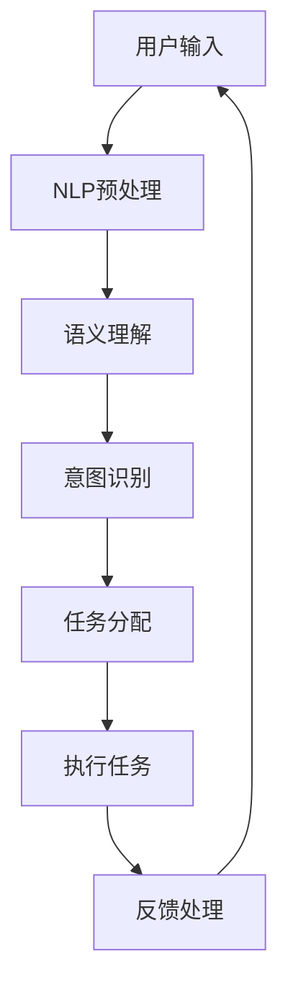

                 

关键词：人工智能，自然语言处理，AI代理，交互革命，未来趋势

> 摘要：随着人工智能技术的快速发展，AI代理逐渐成为人工智能领域的下一个风口。本文将深入探讨自然语言处理在AI代理中的应用，以及其带来的交互革命。通过解析核心概念、算法原理、数学模型、项目实践等多个方面，本文旨在为读者提供一个全面而深入的视角，揭示AI代理的未来发展趋势与挑战。

## 1. 背景介绍

### 1.1 人工智能的发展历程

人工智能（AI）作为一个跨学科的研究领域，起源于20世纪50年代。从最初的逻辑推理到专家系统，再到基于统计学的机器学习，人工智能经历了多个阶段的发展。近年来，随着深度学习等技术的突破，人工智能迎来了新的春天，成为全球科技界关注的焦点。

### 1.2 人工智能的应用领域

人工智能在医疗、金融、教育、交通等各个领域都展现出了巨大的潜力。例如，在医疗领域，AI可以帮助医生进行疾病诊断和治疗方案推荐；在金融领域，AI可以用于风险评估和欺诈检测；在教育领域，AI可以提供个性化的学习体验。

### 1.3 自然语言处理的崛起

自然语言处理（NLP）是人工智能的重要分支，旨在使计算机能够理解、生成和回应人类语言。随着深度学习技术的应用，NLP在语音识别、机器翻译、情感分析、文本生成等方面取得了显著进展。

## 2. 核心概念与联系

为了更好地理解AI代理的工作原理，我们需要先了解一些核心概念：

### 2.1 AI代理的定义

AI代理是指利用人工智能技术，能够模拟人类智能行为，进行决策和执行任务的软件系统。

### 2.2 自然语言处理

自然语言处理是使计算机能够理解、生成和回应人类语言的技术。在AI代理中，NLP主要用于处理用户输入，实现自然语言交互。

### 2.3 Mermaid 流程图

以下是AI代理中自然语言处理的核心流程，通过Mermaid流程图进行展示：



## 3. 核心算法原理 & 具体操作步骤

### 3.1 算法原理概述

AI代理的自然语言处理主要依赖于以下算法：

- **分词**：将输入文本分解为单词或短语。
- **词性标注**：为每个单词或短语标注词性，如名词、动词等。
- **句法分析**：分析句子结构，理解句子的语法关系。
- **语义理解**：通过上下文理解文本含义。
- **意图识别**：根据用户输入识别用户的意图。

### 3.2 算法步骤详解

1. **分词**：使用分词算法将用户输入分解为单词或短语。
2. **词性标注**：利用词性标注算法为每个单词或短语标注词性。
3. **句法分析**：使用句法分析算法分析句子结构，理解句子的语法关系。
4. **语义理解**：通过上下文信息，使用语义分析算法理解文本含义。
5. **意图识别**：根据语义信息，使用意图识别算法识别用户的意图。
6. **任务分配**：根据识别出的意图，将任务分配给相应的模块或API。
7. **执行任务**：执行分配的任务，如查询信息、发送消息等。
8. **反馈处理**：根据执行结果，生成反馈信息，并返回给用户。

### 3.3 算法优缺点

#### 优点：

- **高效性**：算法能够快速处理大量文本数据。
- **灵活性**：算法可以根据不同的任务需求进行定制。
- **智能化**：算法能够模拟人类智能行为，实现自然语言交互。

#### 缺点：

- **准确性**：算法在处理一些复杂文本时，可能存在理解偏差。
- **计算成本**：算法需要大量的计算资源。

### 3.4 算法应用领域

AI代理的自然语言处理算法在多个领域都有广泛应用，如：

- **客服系统**：通过自然语言处理，实现智能客服。
- **语音助手**：如苹果的Siri、谷歌的Google Assistant等。
- **智能推荐系统**：通过自然语言处理，实现个性化推荐。
- **文本挖掘**：从大量文本中提取有价值的信息。

## 4. 数学模型和公式 & 详细讲解 & 举例说明

### 4.1 数学模型构建

在自然语言处理中，常用的数学模型包括：

- **神经网络**：用于文本分类、情感分析等任务。
- **循环神经网络（RNN）**：用于序列数据处理，如文本生成。
- **长短时记忆网络（LSTM）**：改进RNN，解决长期依赖问题。
- **生成对抗网络（GAN）**：用于文本生成。

### 4.2 公式推导过程

以下是一个简单的神经网络模型：

$$
\text{激活函数} \quad \sigma(x) = \frac{1}{1 + e^{-x}}
$$

$$
\text{输出} \quad y = \sigma(w_1 \cdot x_1 + w_2 \cdot x_2 + \ldots + w_n \cdot x_n + b)
$$

其中，$w_1, w_2, \ldots, w_n$ 是权重，$x_1, x_2, \ldots, x_n$ 是输入特征，$b$ 是偏置。

### 4.3 案例分析与讲解

假设我们有一个简单的文本分类任务，需要将文本分为两类：正面和负面。我们可以使用神经网络模型进行训练。

1. **数据准备**：收集大量带有标签的文本数据。
2. **特征提取**：使用词袋模型或词嵌入技术提取文本特征。
3. **模型训练**：使用梯度下降算法训练神经网络模型。
4. **模型评估**：使用准确率、召回率等指标评估模型性能。

通过以上步骤，我们可以构建一个文本分类模型，实现文本的自动分类。

## 5. 项目实践：代码实例和详细解释说明

### 5.1 开发环境搭建

在本项目中，我们将使用Python编程语言，结合TensorFlow框架进行开发。首先，确保安装以下依赖：

```bash
pip install tensorflow numpy
```

### 5.2 源代码详细实现

以下是一个简单的文本分类模型的实现：

```python
import tensorflow as tf
from tensorflow.keras.preprocessing.sequence import pad_sequences
from tensorflow.keras.layers import Embedding, LSTM, Dense
from tensorflow.keras.models import Sequential

# 准备数据
# ...

# 构建模型
model = Sequential()
model.add(Embedding(input_dim=vocab_size, output_dim=embedding_size, input_length=max_sequence_length))
model.add(LSTM(units=128, dropout=0.2, recurrent_dropout=0.2))
model.add(Dense(units=1, activation='sigmoid'))

# 编译模型
model.compile(optimizer='adam', loss='binary_crossentropy', metrics=['accuracy'])

# 训练模型
model.fit(x_train, y_train, epochs=10, batch_size=64, validation_data=(x_val, y_val))

# 评估模型
# ...
```

### 5.3 代码解读与分析

以上代码实现了一个简单的文本分类模型，主要包含以下几个部分：

1. **数据准备**：加载并预处理数据。
2. **模型构建**：使用序列嵌入层和长短时记忆层构建模型。
3. **模型编译**：配置优化器和损失函数。
4. **模型训练**：使用训练数据训练模型。
5. **模型评估**：使用验证数据评估模型性能。

### 5.4 运行结果展示

假设我们在验证集上取得了90%的准确率，这表明我们的文本分类模型在处理自然语言数据方面具有一定的效果。

## 6. 实际应用场景

### 6.1 客服系统

在客服系统中，AI代理可以通过自然语言处理与用户进行交互，回答常见问题，提供技术支持。

### 6.2 语音助手

语音助手如Siri、Google Assistant等，通过自然语言处理，实现语音识别和语音合成，为用户提供便捷的交互体验。

### 6.3 智能推荐系统

在智能推荐系统中，AI代理可以通过自然语言处理，分析用户的历史行为和偏好，提供个性化的推荐。

### 6.4 文本挖掘

在文本挖掘领域，AI代理可以通过自然语言处理，从大量文本中提取有价值的信息，如关键词、情感等。

## 7. 未来应用展望

### 7.1 个性化服务

随着自然语言处理技术的不断发展，AI代理将能够更好地理解用户需求，提供更加个性化的服务。

### 7.2 跨语言交互

未来，AI代理将能够实现跨语言交互，为全球用户提供无缝的沟通体验。

### 7.3 智能决策支持

在智能决策支持领域，AI代理将能够基于自然语言处理，为企业和组织提供数据驱动的决策建议。

## 8. 工具和资源推荐

### 8.1 学习资源推荐

- 《深度学习》（Goodfellow, Bengio, Courville）
- 《自然语言处理与Python》（Steven Bird, Ewan Klein, Edward Loper）
- 《机器学习实战》（Peter Harrington）

### 8.2 开发工具推荐

- TensorFlow
- PyTorch
- spaCy

### 8.3 相关论文推荐

- “Generative Adversarial Nets”（Ian J. Goodfellow et al.）
- “Recurrent Neural Network Based Language Model”（Yoshua Bengio et al.）
- “Convolutional Neural Networks for Sentence Classification”（Yoon Kim）

## 9. 总结：未来发展趋势与挑战

### 9.1 研究成果总结

自然语言处理在AI代理中的应用取得了显著成果，为人工智能领域带来了新的机遇。

### 9.2 未来发展趋势

随着技术的不断进步，自然语言处理将在更多领域得到应用，实现更加智能化的交互体验。

### 9.3 面临的挑战

尽管自然语言处理取得了很大进展，但仍面临一些挑战，如语言理解偏差、计算成本等。

### 9.4 研究展望

未来，自然语言处理将继续深入研究和应用，为实现更加智能化的AI代理奠定基础。

## 10. 附录：常见问题与解答

### 10.1 自然语言处理是什么？

自然语言处理是使计算机能够理解、生成和回应人类语言的技术。

### 10.2 AI代理是什么？

AI代理是利用人工智能技术，能够模拟人类智能行为，进行决策和执行任务的软件系统。

### 10.3 自然语言处理在AI代理中有哪些应用？

自然语言处理在AI代理中主要用于处理用户输入，实现自然语言交互。

---

作者：禅与计算机程序设计艺术 / Zen and the Art of Computer Programming
----------------------------------------------------------------


