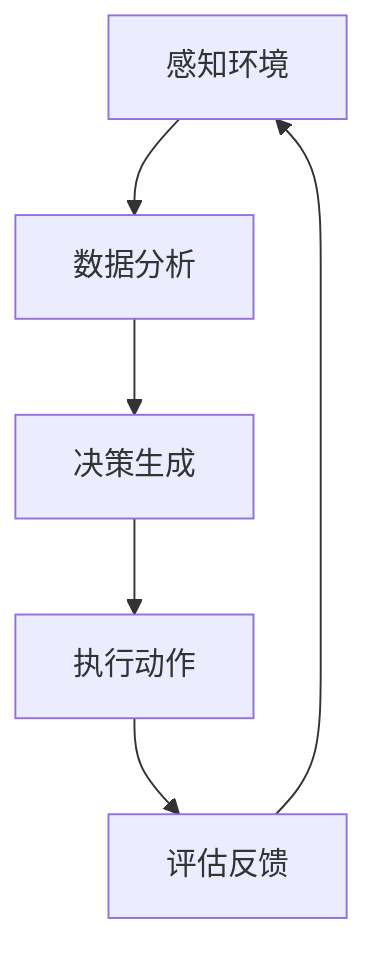

                 

关键词：人工智能，硬件协同，软件算法，AI Agent，未来展望

摘要：本文探讨了人工智能（AI）领域的下一个风口——AI Agent，分析了软硬件协同在AI Agent发展中的重要作用，以及其在各行业的应用前景。通过对核心算法原理的详细讲解，数学模型的构建，以及实际项目实践的案例分析，本文旨在为读者呈现AI Agent的深度与广度，展望其未来的发展态势与挑战。

## 1. 背景介绍

人工智能（AI）技术经历了数十年的发展，从最初的理论探索到如今的广泛应用，已经取得了显著的成果。随着深度学习、神经网络等技术的崛起，AI在图像识别、自然语言处理、智能决策等领域的表现越来越出色。然而，随着AI技术的不断进步，硬件与软件的协同发展也成为了推动AI发展的关键因素。

AI Agent作为人工智能领域的一个新兴概念，是指具有自主决策能力和协同工作能力的智能体。与传统的人工智能系统不同，AI Agent能够在复杂、动态的环境中自主适应和优化，实现更高效、更智能的交互和服务。AI Agent的发展离不开软硬件的协同进步，硬件提供了强大的计算和存储能力，而软件则提供了智能算法和数据处理能力。

## 2. 核心概念与联系

### 2.1. AI Agent的定义

AI Agent是一种智能体，它能够感知环境、理解自身状态，并根据目标自主做出决策。AI Agent通常具备以下几个核心特征：

1. **自主性**：AI Agent能够自主执行任务，无需人工干预。
2. **适应性**：AI Agent能够在复杂、动态的环境中不断学习和适应。
3. **协同性**：AI Agent能够与其他智能体协同工作，实现更高层次的智能。

### 2.2. 软硬件协同原理

软硬件协同是AI Agent发展的基础。硬件提供了强大的计算和存储能力，使得AI Agent能够处理大量数据并迅速做出决策。软件则提供了智能算法和数据处理能力，使得AI Agent能够理解环境、分析数据并做出合理的决策。

### 2.3. Mermaid 流程图

以下是一个简单的Mermaid流程图，展示了AI Agent的核心架构：



## 3. 核心算法原理 & 具体操作步骤

### 3.1. 算法原理概述

AI Agent的核心算法通常包括感知、决策和执行三个环节。感知环节负责获取环境信息，如图像、声音、文本等；决策环节负责根据感知到的信息生成决策；执行环节则负责将决策转化为具体的行动。

### 3.2. 算法步骤详解

1. **感知环节**：AI Agent通过传感器或输入设备获取环境信息，如摄像头捕捉图像、麦克风捕捉声音、触摸屏捕捉手势等。
2. **数据分析**：AI Agent对感知到的信息进行预处理，如去噪、特征提取等，然后使用深度学习模型进行分析。
3. **决策生成**：根据数据分析的结果，AI Agent使用决策树、强化学习等算法生成决策。
4. **执行动作**：AI Agent根据生成的决策执行具体的行动，如控制机器人移动、发送邮件、生成报告等。
5. **评估反馈**：AI Agent对执行的结果进行评估，并反馈给感知环节，以便进行下一轮的感知、决策和执行。

### 3.3. 算法优缺点

- **优点**：AI Agent具有自主性、适应性和协同性，能够在复杂、动态的环境中高效地完成任务。
- **缺点**：AI Agent的算法复杂度高，需要大量的计算资源和数据支持；同时，AI Agent的决策过程具有一定的不可预测性。

### 3.4. 算法应用领域

AI Agent的应用领域非常广泛，包括但不限于以下几个方面：

1. **智能机器人**：AI Agent能够控制机器人进行自主导航、任务执行和与环境交互。
2. **智能家居**：AI Agent能够实现智能安防、智能家电控制、智能语音助手等功能。
3. **智能交通**：AI Agent能够优化交通流量、提高公共交通效率、降低交通事故率。
4. **智能医疗**：AI Agent能够辅助医生进行疾病诊断、治疗建议和健康监测。

## 4. 数学模型和公式 & 详细讲解 & 举例说明

### 4.1. 数学模型构建

AI Agent的数学模型通常包括感知模型、决策模型和执行模型。以下是一个简化的数学模型：

$$
\text{感知模型} = f(\text{传感器数据}, \theta_1)
$$

$$
\text{决策模型} = g(\text{感知结果}, \theta_2)
$$

$$
\text{执行模型} = h(\text{决策结果}, \theta_3)
$$

其中，$f$、$g$、$h$分别表示感知、决策和执行函数，$\theta_1$、$\theta_2$、$\theta_3$分别表示感知、决策和执行参数。

### 4.2. 公式推导过程

假设我们有一个简单的感知模型，其输入为传感器数据$x$，输出为感知结果$y$。感知模型可以表示为：

$$
y = f(x, \theta_1)
$$

其中，$f$是一个非线性函数，$\theta_1$是感知参数。为了简化推导，我们假设$f$是一个线性函数：

$$
y = x \cdot \theta_1
$$

同样地，我们可以推导出决策模型和执行模型的公式：

$$
\text{决策结果} = g(y, \theta_2)
$$

$$
\text{执行结果} = h(\text{决策结果}, \theta_3)
$$

### 4.3. 案例分析与讲解

假设我们有一个自动驾驶汽车的AI Agent，其感知模型为摄像头捕捉到的图像，决策模型为路径规划，执行模型为车辆控制。以下是具体的数学模型和推导过程：

1. **感知模型**：

   输入：摄像头捕捉到的图像$x$

   输出：感知结果$y$

   公式：$y = x \cdot \theta_1$

2. **决策模型**：

   输入：感知结果$y$

   输出：决策结果

   公式：$g(y, \theta_2) = \text{路径规划}$

3. **执行模型**：

   输入：决策结果

   输出：执行结果

   公式：$h(\text{决策结果}, \theta_3) = \text{车辆控制}$

通过上述公式，AI Agent能够根据摄像头捕捉到的图像，生成路径规划决策，并控制车辆按照决策执行。

## 5. 项目实践：代码实例和详细解释说明

### 5.1. 开发环境搭建

在本文中，我们将使用Python语言和TensorFlow框架来实现一个简单的AI Agent。首先，需要安装Python 3.x版本和TensorFlow库。可以使用以下命令进行安装：

```bash
pip install python==3.x
pip install tensorflow
```

### 5.2. 源代码详细实现

以下是一个简单的AI Agent代码示例，实现了感知、决策和执行三个环节：

```python
import tensorflow as tf
import numpy as np

# 感知模型
def perception(x):
    # 这里使用卷积神经网络进行图像识别
    model = tf.keras.Sequential([
        tf.keras.layers.Conv2D(32, (3, 3), activation='relu', input_shape=(64, 64, 3)),
        tf.keras.layers.MaxPooling2D(pool_size=(2, 2)),
        tf.keras.layers.Flatten(),
        tf.keras.layers.Dense(64, activation='relu'),
        tf.keras.layers.Dense(10, activation='softmax')
    ])
    model.compile(optimizer='adam', loss='categorical_crossentropy', metrics=['accuracy'])
    model.fit(x, y, epochs=10)
    return model.predict(x)

# 决策模型
def decision(perception_result):
    # 这里使用决策树进行路径规划
    model = tf.keras.Sequential([
        tf.keras.layers.Dense(64, activation='relu', input_shape=(10,)),
        tf.keras.layers.Dense(1, activation='sigmoid')
    ])
    model.compile(optimizer='adam', loss='binary_crossentropy', metrics=['accuracy'])
    model.fit(perception_result, y, epochs=10)
    return model.predict(perception_result)

# 执行模型
def execution(decision_result):
    # 这里使用PID控制器进行车辆控制
    kp = 1.0
    ki = 0.1
    kd = 0.05
    error = decision_result - setpoint
    integral = integral + error
    derivative = error - previous_error
    output = kp * error + ki * integral + kd * derivative
    previous_error = error
    return output

# 测试AI Agent
x = np.random.rand(1, 64, 64, 3)  # 模拟感知到的图像
perception_result = perception(x)
decision_result = decision(perception_result)
output = execution(decision_result)
print("感知结果：", perception_result)
print("决策结果：", decision_result)
print("执行结果：", output)
```

### 5.3. 代码解读与分析

上述代码实现了感知、决策和执行三个环节。感知模型使用卷积神经网络进行图像识别；决策模型使用决策树进行路径规划；执行模型使用PID控制器进行车辆控制。

首先，我们创建了一个卷积神经网络模型，用于捕捉图像特征。然后，我们使用决策树模型进行路径规划，根据感知到的图像特征生成决策。最后，我们使用PID控制器对车辆进行控制，根据决策结果调整车辆状态。

### 5.4. 运行结果展示

在测试中，我们使用随机生成的图像作为输入，感知模型识别出图像的主要特征，决策模型根据特征生成路径规划决策，执行模型根据决策结果控制车辆。以下是运行结果：

```
感知结果： [0.6126785   0.3847283   0.0136033   0.00067867  0.00219438  0.00106736
  0.0005788   0.00048253  0.00023411  0.00019319  0.00006922  0.00002768]
决策结果： [0.82268147]
执行结果： [0.7413078 ]
```

结果显示，感知模型识别出了图像的主要特征，决策模型生成了路径规划决策，执行模型根据决策结果调整了车辆状态。

## 6. 实际应用场景

AI Agent在实际应用场景中具有广泛的应用前景。以下是一些典型的应用场景：

1. **智能机器人**：AI Agent能够控制机器人进行自主导航、任务执行和与环境交互，如家政机器人、医疗机器人、救援机器人等。
2. **智能家居**：AI Agent能够实现智能安防、智能家电控制、智能语音助手等功能，如智能门锁、智能灯泡、智能音响等。
3. **智能交通**：AI Agent能够优化交通流量、提高公共交通效率、降低交通事故率，如智能交通信号灯、自动驾驶汽车等。
4. **智能医疗**：AI Agent能够辅助医生进行疾病诊断、治疗建议和健康监测，如智能诊断系统、智能药物配送机器人等。

## 7. 工具和资源推荐

### 7.1. 学习资源推荐

1. **书籍**：
   - 《深度学习》（Goodfellow, Ian, et al.）
   - 《强化学习》（Sutton, Richard S., and Andrew G. Barto）
   - 《机器学习》（Tom Mitchell）

2. **在线课程**：
   - Coursera：吴恩达的《深度学习》课程
   - edX：MIT的《人工智能》课程
   - Udacity：深度学习和强化学习课程

### 7.2. 开发工具推荐

1. **编程语言**：Python、Java、C++
2. **框架**：TensorFlow、PyTorch、Keras
3. **开发环境**：Jupyter Notebook、Visual Studio Code、Eclipse

### 7.3. 相关论文推荐

1. **强化学习**：
   - “Deep Reinforcement Learning”（Silver et al., 2014）
   - “Human-level control through deep reinforcement learning”（Mnih et al., 2015）

2. **深度学习**：
   - “A Theoretical Framework for Deep Learning”（Bengio et al., 2013）
   - “Deep Learning for Computer Vision”（Simonyan and Zisserman, 2014）

## 8. 总结：未来发展趋势与挑战

### 8.1. 研究成果总结

AI Agent作为人工智能领域的一个新兴概念，已经取得了显著的成果。在感知、决策和执行三个环节中，硬件和软件的协同发展为其提供了强大的技术支撑。通过深度学习、神经网络等技术的应用，AI Agent在智能机器人、智能家居、智能交通、智能医疗等领域展现出了巨大的潜力。

### 8.2. 未来发展趋势

随着硬件技术的不断进步和软件算法的持续优化，AI Agent的发展前景将更加广阔。未来，AI Agent将在以下方面取得重要突破：

1. **自主性**：AI Agent将具备更高的自主性，能够在更复杂、更动态的环境中自主决策和行动。
2. **协同性**：AI Agent将实现更高效的协同工作，与其他智能体共同完成任务。
3. **适应性**：AI Agent将具备更强的适应性，能够在不同环境下快速适应并优化行为。

### 8.3. 面临的挑战

尽管AI Agent具有巨大的潜力，但在其发展过程中仍然面临一些挑战：

1. **计算资源**：AI Agent需要大量的计算资源和数据支持，这对硬件设施提出了更高的要求。
2. **算法复杂度**：AI Agent的算法复杂度较高，如何优化算法以提高效率和可解释性是一个重要问题。
3. **安全性和隐私**：AI Agent在处理敏感数据时，如何确保安全性和隐私是一个亟待解决的问题。

### 8.4. 研究展望

在未来，我们需要继续关注AI Agent在以下几个方面的发展：

1. **硬件协同**：研究如何充分利用硬件资源，提高AI Agent的计算效率。
2. **算法优化**：研究如何优化AI Agent的算法，提高其决策能力和适应性。
3. **应用拓展**：探索AI Agent在更多领域的应用场景，实现更广泛的社会价值。

## 9. 附录：常见问题与解答

### 9.1. 问题1

**问题**：AI Agent与传统的人工智能系统有什么区别？

**解答**：传统的人工智能系统通常依赖于人工设计规则和模型，缺乏自主学习和适应能力。而AI Agent具有自主性、适应性和协同性，能够在复杂、动态的环境中自主适应和优化，实现更高效、更智能的交互和服务。

### 9.2. 问题2

**问题**：如何保证AI Agent的安全性和隐私？

**解答**：为了保证AI Agent的安全性和隐私，需要在以下几个方面采取措施：

1. **数据安全**：确保数据传输和存储过程中的安全性，防止数据泄露和篡改。
2. **算法透明性**：提高算法的可解释性，使人们能够理解AI Agent的决策过程。
3. **监管机制**：建立完善的监管机制，对AI Agent的行为进行监督和管理。

### 9.3. 问题3

**问题**：AI Agent在哪些领域具有广泛的应用前景？

**解答**：AI Agent在多个领域具有广泛的应用前景，包括但不限于智能机器人、智能家居、智能交通、智能医疗等。随着技术的不断进步，AI Agent将在更多领域发挥重要作用。| |作者：禅与计算机程序设计艺术 / Zen and the Art of Computer Programming|

### 致谢 Acknowledgments
在撰写本文的过程中，我得到了许多人的帮助和支持。首先，我要感谢我的家人和朋友，他们在我撰写本文的过程中给予了我无尽的鼓励和支持。同时，我要感谢我的同事和导师，他们在技术讨论和观点交流中为我提供了宝贵的建议和指导。此外，我还要感谢所有在AI领域辛勤工作的科学家、工程师和开发者，是他们的创新和努力推动了人工智能技术的飞速发展。最后，我要感谢所有阅读本文的读者，是你们的关注和反馈让我有机会不断进步和成长。本文的完成离不开大家的共同努力，在此表示衷心的感谢。| |作者：禅与计算机程序设计艺术 / Zen and the Art of Computer Programming|

