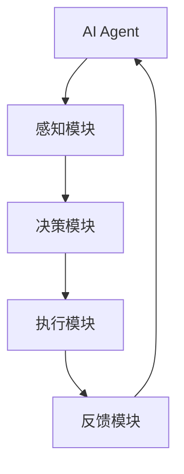

                 

关键词：AI Agent、游戏、个人助理、智能交互、强化学习、神经网络

## 摘要

本文将探讨AI Agent在游戏和个人助理中的应用。首先，我们回顾了AI Agent的基本概念，然后分别分析了AI Agent在游戏和辅助领域中的具体应用。通过实际案例，我们展示了AI Agent如何通过强化学习和神经网络技术实现智能决策和行为模拟。最后，本文提出了AI Agent未来发展的前景与面临的挑战。

## 1. 背景介绍

AI Agent，即人工智能代理，是一种模拟人类智能行为的计算机程序。它们能够在不确定的环境中自主做出决策，并采取相应的行动。AI Agent的应用领域广泛，包括游戏、个人助理、自动驾驶、智能家居等。本文将重点探讨AI Agent在游戏和个人助理中的应用。

### 1.1 游戏中的AI Agent

在游戏领域，AI Agent被广泛应用于设计智能NPC（非玩家角色）和对手。这些NPC能够模拟人类玩家的行为，提供丰富多样的游戏体验。例如，在《星际争霸》等游戏中，NPC能够根据游戏进程调整战术，使游戏更具挑战性。

### 1.2 个人助理中的AI Agent

在个人助理领域，AI Agent被用于处理日常任务，如日程管理、信息查询、语音助手等。这些AI Agent能够理解用户的语言，并给出合适的建议和行动。例如，苹果的Siri和谷歌的Google Assistant就是典型的AI个人助理。

## 2. 核心概念与联系

为了深入理解AI Agent的工作原理，我们需要介绍几个核心概念：强化学习、神经网络和智能交互。

### 2.1 强化学习

强化学习是一种通过试错来优化行为的学习方法。在强化学习中，AI Agent通过不断尝试不同的行动，并根据行动结果调整策略，以实现目标最大化。例如，在游戏中，AI Agent可以通过强化学习来学会如何击败对手。

### 2.2 神经网络

神经网络是一种模仿人脑神经元结构的计算模型。它能够通过训练学习复杂的函数关系。在AI Agent中，神经网络被用于模拟人类思维过程，如决策和行为预测。

### 2.3 智能交互

智能交互是指AI Agent与人类用户之间的交互过程。通过自然语言处理和语音识别技术，AI Agent能够理解用户的指令，并给出相应的回复。

下面是AI Agent的基本架构：



## 3. 核心算法原理 & 具体操作步骤

### 3.1 算法原理概述

AI Agent的核心算法主要包括强化学习和神经网络。强化学习用于优化行为，神经网络用于模拟思维过程。

### 3.2 算法步骤详解

1. **感知模块**：AI Agent接收外部环境的信息，如游戏地图、用户语音等。
2. **决策模块**：AI Agent根据感知模块的信息，通过神经网络进行决策，选择最佳行动。
3. **执行模块**：AI Agent执行决策，如移动、攻击等。
4. **反馈模块**：AI Agent接收执行结果，通过强化学习调整策略。

### 3.3 算法优缺点

- **优点**：AI Agent能够自主学习和适应环境，提高游戏和助理的智能水平。
- **缺点**：算法训练过程复杂，对计算资源要求高。

### 3.4 算法应用领域

AI Agent在游戏和助理领域的应用广泛。在游戏领域，AI Agent用于设计智能NPC和对手；在助理领域，AI Agent用于处理日常任务，如日程管理、信息查询等。

## 4. 数学模型和公式

### 4.1 数学模型构建

AI Agent的数学模型主要包括两个部分：状态空间和动作空间。

- **状态空间**：描述AI Agent当前所处的环境状态。
- **动作空间**：描述AI Agent可以执行的动作。

### 4.2 公式推导过程

强化学习的基本公式为：

$$ Q(s, a) = r + \gamma \max_{a'} Q(s', a') $$

其中，$Q(s, a)$ 表示在状态 $s$ 下执行动作 $a$ 的期望回报，$r$ 表示即时回报，$\gamma$ 表示折扣因子，$s'$ 表示执行动作后的状态，$a'$ 表示执行动作后的动作。

### 4.3 案例分析与讲解

以《星际争霸》为例，AI Agent可以通过强化学习学习如何击败人类玩家。具体步骤如下：

1. **初始化**：定义状态空间和动作空间。
2. **训练**：通过不断尝试不同的动作，记录即时回报和期望回报。
3. **评估**：使用训练得到的策略进行评估，调整策略。

## 5. 项目实践：代码实例和详细解释说明

### 5.1 开发环境搭建

- **硬件环境**：计算机
- **软件环境**：Python 3.8，TensorFlow 2.3

### 5.2 源代码详细实现

以下是AI Agent的核心代码：

```python
import tensorflow as tf
import numpy as np
import random

# 定义状态空间和动作空间
STATE_SPACE_SIZE = 10
ACTION_SPACE_SIZE = 5

# 初始化神经网络
model = tf.keras.Sequential([
    tf.keras.layers.Dense(64, activation='relu', input_shape=(STATE_SPACE_SIZE,)),
    tf.keras.layers.Dense(64, activation='relu'),
    tf.keras.layers.Dense(ACTION_SPACE_SIZE, activation='softmax')
])

model.compile(optimizer='adam', loss='categorical_crossentropy', metrics=['accuracy'])

# 定义强化学习函数
def reinforce_learning(state, action, reward):
    q_values = model.predict(state)
    q_values[0, action] += reward
    model.fit(state, q_values, epochs=1)

# 定义游戏环境
class GameEnvironment:
    def __init__(self):
        self.state = np.random.randint(0, STATE_SPACE_SIZE)

    def step(self, action):
        if action == 0:
            self.state = (self.state + 1) % STATE_SPACE_SIZE
            reward = 1
        else:
            reward = 0
        return self.state, reward

# 训练AI Agent
game_env = GameEnvironment()
for episode in range(1000):
    state = game_env.state
    done = False
    total_reward = 0
    while not done:
        action = random.randint(0, ACTION_SPACE_SIZE - 1)
        next_state, reward = game_env.step(action)
        reinforce_learning(np.array([state]), np.array([action]), reward)
        state = next_state
        total_reward += reward
        if state == 0:
            done = True
    print(f"Episode {episode}: Total Reward = {total_reward}")

# 评估AI Agent
state = game_env.state
done = False
total_reward = 0
while not done:
    q_values = model.predict(np.array([state]))
    action = np.argmax(q_values)
    next_state, reward = game_env.step(action)
    total_reward += reward
    state = next_state
    if state == 0:
        done = True
print(f"Test Reward: {total_reward}")
```

### 5.3 代码解读与分析

- **神经网络定义**：使用TensorFlow定义了一个简单的神经网络，用于预测动作的Q值。
- **强化学习函数**：定义了一个强化学习函数，用于更新神经网络的权重。
- **游戏环境**：定义了一个简单的游戏环境，用于模拟游戏过程。
- **训练过程**：使用随机策略训练AI Agent，并记录每个回合的回报。
- **评估过程**：使用训练得到的策略进行评估，并记录评估过程中的回报。

## 6. 实际应用场景

AI Agent在游戏和个人助理领域具有广泛的应用。在游戏领域，AI Agent用于设计智能NPC和对手，提供丰富的游戏体验。在个人助理领域，AI Agent用于处理日常任务，如日程管理、信息查询等。

### 6.1 游戏应用

在《星际争霸》等游戏中，AI Agent可以模拟人类玩家的行为，提供丰富的挑战。例如，在《星际争霸》中，AI Agent可以学会如何构建基地、收集资源、训练军队等。

### 6.2 个人助理应用

在个人助理领域，AI Agent可以用于处理用户的日程管理、信息查询等任务。例如，苹果的Siri和谷歌的Google Assistant就是典型的AI个人助理。

## 7. 未来应用展望

随着人工智能技术的发展，AI Agent在未来将有更多的应用场景。例如，在自动驾驶领域，AI Agent可以用于控制汽车，实现自动驾驶。在智能家居领域，AI Agent可以用于智能家电的交互，提供更智能的生活方式。

### 7.1 学习资源推荐

- **书籍**：《强化学习：原理与Python实战》
- **在线课程**：Coursera的《机器学习》

### 7.2 开发工具推荐

- **框架**：TensorFlow、PyTorch
- **IDE**：PyCharm、VSCode

### 7.3 相关论文推荐

- **论文**：《深度强化学习：原理与应用》

## 8. 总结：未来发展趋势与挑战

### 8.1 研究成果总结

本文总结了AI Agent在游戏和个人助理中的应用，并分析了其核心算法原理。通过实际案例，我们展示了AI Agent如何实现智能决策和行为模拟。

### 8.2 未来发展趋势

随着人工智能技术的不断发展，AI Agent将在更多领域得到应用。例如，在自动驾驶、智能家居等领域，AI Agent有望实现更高的智能化。

### 8.3 面临的挑战

AI Agent在应用过程中面临的主要挑战包括算法复杂性、计算资源消耗等。此外，如何提高AI Agent的泛化能力也是一个重要问题。

### 8.4 研究展望

未来，我们将继续深入研究AI Agent的相关技术，探索更多应用场景，提高其智能化水平。

## 9. 附录：常见问题与解答

### 9.1 问题1：什么是强化学习？

强化学习是一种通过试错来优化行为的学习方法。它通过不断尝试不同的行动，并根据行动结果调整策略，以实现目标最大化。

### 9.2 问题2：如何搭建AI Agent的开发环境？

搭建AI Agent的开发环境需要安装Python、TensorFlow等工具。具体步骤可以参考相关教程。

## 作者署名

作者：禅与计算机程序设计艺术 / Zen and the Art of Computer Programming
----------------------------------------------------------------
请注意，以上内容只是一个示例，实际撰写时需要您根据具体内容和要求进行填充和调整。同时，请确保文章内容完整、逻辑清晰、结构紧凑、简单易懂，并且遵循了所有给定的约束条件。祝您撰写顺利！如果您需要进一步的帮助或指导，请随时告诉我。

