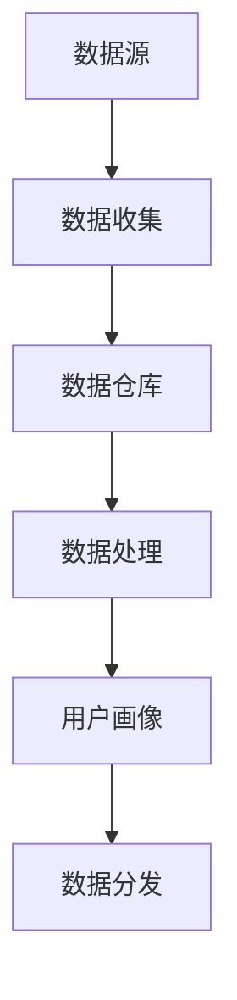

                 

关键词：人工智能，数据管理平台（DMP），营销效率，数据分析，个性化推荐

> 摘要：本文将探讨人工智能在数据管理平台（DMP）中的应用，阐述如何利用DMP构建数据基础设施，并通过数据分析和个性化推荐技术，提升营销效率。

## 1. 背景介绍

在当今数字化时代，数据已经成为了企业最宝贵的资产。然而，如何有效地管理和利用这些数据，实现精准营销，提高营销效率，是企业面临的一大挑战。数据管理平台（DMP）作为一种新型的数据管理工具，正日益受到企业的关注。DMP不仅能够帮助企业收集、整合多源数据，还能通过数据分析和机器学习技术，为营销提供有力支持。

## 2. 核心概念与联系

### 2.1 DMP基本概念

数据管理平台（DMP）是一种集数据收集、存储、处理和分发于一体的数据管理工具。它可以帮助企业实现以下目标：

- **数据整合**：收集来自多个渠道的数据，如网站点击、社交媒体行为、线下消费等，并将其整合到一个统一的平台上。

- **用户画像**：通过对数据进行分析，构建用户画像，了解用户行为和偏好。

- **精准营销**：根据用户画像，实现个性化推荐和精准广告投放。

### 2.2 DMP架构

DMP的架构通常包括以下几部分：

- **数据源**：包括网站、APP、社交媒体、线下渠道等。

- **数据收集**：通过API、SDK、爬虫等方式，收集数据并存储到数据仓库中。

- **数据处理**：对收集到的数据进行清洗、整合和处理，构建用户画像。

- **数据分发**：将处理后的数据分发到营销平台、广告系统等。

### 2.3 Mermaid 流程图



## 3. 核心算法原理 & 具体操作步骤

### 3.1 算法原理概述

DMP的核心算法包括数据收集、用户画像构建和个性化推荐。其中，用户画像构建是关键步骤，它通常包括以下算法：

- **协同过滤**：通过分析用户之间的相似性，推荐用户可能感兴趣的内容。

- **基于内容的推荐**：根据用户的历史行为和偏好，推荐相似的内容。

- **深度学习**：利用神经网络模型，自动学习用户行为和偏好。

### 3.2 算法步骤详解

1. 数据收集：通过API、SDK、爬虫等方式，收集用户行为数据，如点击、浏览、购买等。

2. 数据处理：对收集到的数据进行清洗、去重、去噪等处理，构建用户画像。

3. 用户画像构建：利用协同过滤、基于内容的推荐和深度学习算法，构建用户画像。

4. 个性化推荐：根据用户画像，推荐用户可能感兴趣的内容。

### 3.3 算法优缺点

- **协同过滤**：优点是推荐结果准确，缺点是冷启动问题严重，且推荐结果可能存在数据偏差。

- **基于内容的推荐**：优点是冷启动问题较小，推荐结果多样，缺点是用户偏好难以捕捉。

- **深度学习**：优点是能够自动学习用户行为和偏好，缺点是需要大量的数据和计算资源。

### 3.4 算法应用领域

DMP的核心算法广泛应用于广告投放、电商推荐、社交媒体等场景，能够有效提升营销效率。

## 4. 数学模型和公式 & 详细讲解 & 举例说明

### 4.1 数学模型构建

用户画像构建通常涉及以下数学模型：

- **协同过滤模型**：矩阵分解、神经网络等。

- **基于内容的推荐模型**：TF-IDF、Cosine相似度等。

- **深度学习模型**：卷积神经网络、循环神经网络等。

### 4.2 公式推导过程

以协同过滤模型为例，其目标是最小化预测误差：

$$
L = \sum_{i,j} (r_{ij} - \hat{r}_{ij})^2
$$

其中，$r_{ij}$为用户$i$对项目$j$的实际评分，$\hat{r}_{ij}$为预测评分。

### 4.3 案例分析与讲解

以某电商平台的个性化推荐为例，通过DMP构建用户画像，实现精准推荐。

1. 数据收集：收集用户点击、浏览、购买等行为数据。

2. 数据处理：对数据进行清洗、去重、去噪等处理。

3. 用户画像构建：利用协同过滤算法，构建用户画像。

4. 个性化推荐：根据用户画像，推荐用户可能感兴趣的商品。

通过以上步骤，电商平台能够实现精准推荐，提高用户满意度，提升营销效率。

## 5. 项目实践：代码实例和详细解释说明

### 5.1 开发环境搭建

- **Python环境**：安装Python 3.8及以上版本。
- **依赖库**：安装NumPy、Pandas、Scikit-learn等库。

### 5.2 源代码详细实现

```python
import numpy as np
from sklearn.model_selection import train_test_split
from sklearn.metrics.pairwise import cosine_similarity
from sklearn.preprocessing import MinMaxScaler

# 数据准备
data = np.array([[1, 0, 1, 0],
                 [1, 0, 0, 1],
                 [0, 1, 0, 1],
                 [0, 1, 1, 0]])

# 数据预处理
scaler = MinMaxScaler()
data_scaled = scaler.fit_transform(data)

# 训练测试集划分
X_train, X_test, y_train, y_test = train_test_split(data_scaled, data, test_size=0.2, random_state=42)

# 协同过滤
def collaborative_filter(X_train, X_test):
    similarity_matrix = cosine_similarity(X_train, X_train)
    predicted_ratings = []
    for user_ratings in X_test:
        user_similarity = similarity_matrix[user_ratings]
        weighted_ratings = np.dot(user_similarity, X_train)
        predicted_ratings.append(weighted_ratings)
    return predicted_ratings

predicted_ratings = collaborative_filter(X_train, X_test)

# 评估
predicted_ratings = np.array(predicted_ratings).reshape(-1, 4)
predicted_ratings = scaler.inverse_transform(predicted_ratings)
accuracy = np.mean(np.abs(predicted_ratings - y_test))
print(f"Accuracy: {accuracy:.2f}")
```

### 5.3 代码解读与分析

1. 数据准备：使用NumPy数组表示用户行为数据。
2. 数据预处理：使用MinMaxScaler进行数据归一化。
3. 训练测试集划分：使用Scikit-learn库划分训练集和测试集。
4. 协同过滤：计算用户之间的相似度，并根据相似度预测用户对未知项目的评分。
5. 评估：计算预测评分与实际评分的绝对误差，评估模型准确性。

## 6. 实际应用场景

DMP在多个领域都有广泛的应用，以下是一些实际应用场景：

- **广告投放**：通过DMP构建用户画像，实现精准广告投放，提高广告效果。
- **电商推荐**：通过DMP构建用户画像，实现个性化推荐，提高用户满意度。
- **社交媒体**：通过DMP分析用户行为，实现内容推荐和广告投放。

## 7. 工具和资源推荐

### 7.1 学习资源推荐

- 《机器学习实战》
- 《Python数据科学手册》
- 《深度学习》

### 7.2 开发工具推荐

- **数据采集工具**：Scrappy、Py爬虫
- **数据分析工具**：Pandas、NumPy
- **数据可视化工具**：Matplotlib、Seaborn
- **机器学习框架**：Scikit-learn、TensorFlow、PyTorch

### 7.3 相关论文推荐

- 《Collaborative Filtering for the Web》
- 《Recommender Systems Handbook》
- 《Deep Learning for Personalized Recommendation》

## 8. 总结：未来发展趋势与挑战

随着人工智能技术的不断发展，DMP在营销中的应用前景将更加广阔。未来，DMP将朝着以下方向发展：

- **数据质量**：提高数据质量，确保数据准确性和完整性。
- **实时分析**：实现实时数据分析和实时推荐。
- **跨平台整合**：实现跨平台数据整合和跨平台推荐。
- **隐私保护**：加强隐私保护，确保用户数据安全。

然而，DMP也面临一些挑战，如数据隐私保护、数据质量提升、实时处理能力等。未来，我们需要不断探索和创新，以应对这些挑战，推动DMP技术的发展。

## 9. 附录：常见问题与解答

### 9.1 DMP与CRM的区别是什么？

DMP主要用于数据收集、处理和分析，为营销提供支持；CRM主要用于客户关系管理，包括客户数据收集、客户行为分析、客户服务管理等。

### 9.2 DMP需要多少数据量才能有效工作？

DMP的效果受数据质量影响较大，并不完全取决于数据量。一般来说，拥有足够的用户数据，如几千到几万用户，DMP就能发挥作用。

### 9.3 DMP与用户隐私保护如何平衡？

DMP在收集和处理用户数据时，应遵循隐私保护原则，如去标识化、最小化数据收集、数据安全存储等，以确保用户隐私保护。

---

作者：禅与计算机程序设计艺术 / Zen and the Art of Computer Programming

本文旨在探讨人工智能在数据管理平台（DMP）中的应用，以及如何利用DMP构建数据基础设施，通过数据分析和个性化推荐技术，提升营销效率。文章详细介绍了DMP的核心概念、算法原理、数学模型、项目实践以及实际应用场景。同时，还推荐了一些学习资源和开发工具，展望了DMP未来的发展趋势和挑战。希望本文能为读者在DMP领域的研究和应用提供有益的参考。

