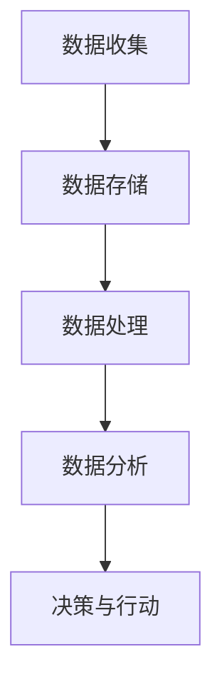

                 

关键词：AI DMP，数据分析，数据基建，机器学习，数据挖掘，商业智能，数据治理

> 摘要：本文将深入探讨AI驱动的数据管理平台（DMP）的构建与优化，从数据分析与洞察的角度出发，详细解析其核心概念、算法原理、数学模型以及实际应用场景。通过结合案例和实践，旨在为读者提供全面、系统的理解和应用指南。

## 1. 背景介绍

随着大数据时代的到来，数据已经成为企业竞争的重要资源。如何有效地管理和利用这些数据，成为了众多企业亟待解决的问题。数据管理平台（Data Management Platform，简称DMP）作为一种集数据收集、存储、处理和分析于一体的系统，正逐渐成为数据管理的重要工具。而AI技术的引入，为DMP的智能化和效率提升带来了新的机遇和挑战。

DMP的作用在于帮助企业实现精准的用户画像、行为分析和市场细分，从而优化市场营销策略，提高客户转化率和满意度。然而，要实现这一目标，DMP的数据分析能力和洞察力是至关重要的。本文将围绕这一核心主题，探讨AI DMP在数据分析与洞察方面的应用与实践。

## 2. 核心概念与联系

### 2.1 DMP的基本概念

数据管理平台（DMP）是一种用于集中管理和分析用户数据的系统，它可以收集来自各种渠道的数据，包括网站、应用程序、社交媒体等，然后将这些数据进行整合、处理和分析，以生成有价值的市场洞察。

### 2.2 AI在DMP中的应用

AI技术在DMP中有着广泛的应用，主要包括以下几个方面：

1. **用户行为分析**：通过分析用户在网站、应用程序等平台上的行为，如点击、浏览、购买等，AI可以帮助企业了解用户喜好和行为模式。
2. **用户画像**：基于用户行为数据，AI可以生成详细的用户画像，包括用户的兴趣、需求、行为习惯等，帮助企业实现精准营销。
3. **市场细分**：通过分析用户数据，AI可以帮助企业识别潜在客户群体，实现市场细分，从而制定更有针对性的营销策略。
4. **预测分析**：AI可以通过历史数据预测未来行为，如用户流失率、转化率等，帮助企业提前做好准备。

### 2.3 数据流程与架构

DMP的基本架构包括数据收集、数据存储、数据处理和数据分析四个主要环节。以下是一个简化的Mermaid流程图：



在这个流程中，数据从各个渠道收集到DMP中，经过存储和初步处理，然后通过AI算法进行深入分析，最后生成洞察和决策，指导企业的营销活动。

## 3. 核心算法原理 & 具体操作步骤

### 3.1 算法原理概述

在DMP中，常用的核心算法包括机器学习算法、聚类算法、关联规则算法等。这些算法的基本原理如下：

1. **机器学习算法**：通过训练数据集，机器学习算法可以自动识别数据中的模式和规律，从而对新的数据进行预测和分类。
2. **聚类算法**：通过将相似的数据点归为一类，聚类算法可以帮助企业识别具有相同特征的用户群体。
3. **关联规则算法**：通过分析数据之间的关联性，关联规则算法可以帮助企业发现用户行为中的规律，从而制定更有针对性的营销策略。

### 3.2 算法步骤详解

1. **数据预处理**：包括数据清洗、缺失值处理、异常值检测等，以确保数据的质量和一致性。
2. **特征工程**：通过选择和构造合适的特征，提高模型的预测能力和解释性。
3. **模型选择**：根据问题的类型和数据的特点，选择合适的机器学习算法。
4. **模型训练**：使用历史数据对模型进行训练，调整模型参数，以优化模型的性能。
5. **模型评估**：通过交叉验证、A/B测试等方法评估模型的性能。
6. **模型部署**：将训练好的模型部署到生产环境，对新的数据进行预测和分类。

### 3.3 算法优缺点

- **机器学习算法**：
  - 优点：自动识别数据中的模式和规律，预测能力强。
  - 缺点：对数据质量要求高，训练过程复杂，解释性较差。
- **聚类算法**：
  - 优点：能够发现数据中的隐含结构和模式。
  - 缺点：聚类结果受初始选择的影响较大，解释性较差。
- **关联规则算法**：
  - 优点：能够发现数据中的关联性，有助于制定营销策略。
  - 缺点：规则数量庞大，难以管理。

### 3.4 算法应用领域

- **用户行为分析**：通过机器学习和聚类算法，帮助企业了解用户的行为模式和兴趣。
- **市场细分**：通过聚类算法和机器学习，帮助企业识别潜在客户群体。
- **预测分析**：通过机器学习和预测算法，帮助企业预测用户流失、转化等关键指标。

## 4. 数学模型和公式 & 详细讲解 & 举例说明

### 4.1 数学模型构建

在DMP中，常用的数学模型包括：

1. **逻辑回归模型**：用于预测用户是否会发生某行为。
2. **K-均值聚类模型**：用于将用户分为不同的群体。
3. **Apriori算法**：用于发现数据中的关联规则。

### 4.2 公式推导过程

- **逻辑回归模型**：

  $$ P(y=1|X) = \frac{1}{1 + e^{-(\beta_0 + \beta_1 x_1 + \beta_2 x_2 + \ldots + \beta_n x_n)}} $$

  其中，$y$ 表示用户是否发生行为，$X$ 表示用户特征向量，$\beta_0$ 至 $\beta_n$ 为模型参数。

- **K-均值聚类模型**：

  $$ c_j = \frac{1}{N_j} \sum_{i=1}^{N} x_i $$

  其中，$c_j$ 表示第 $j$ 个聚类的中心，$N_j$ 表示属于第 $j$ 个聚类的数据点数量，$x_i$ 表示第 $i$ 个数据点的特征向量。

- **Apriori算法**：

  $$ support(A \rightarrow B) = \frac{count(A \cup B)}{count(U)} $$

  其中，$A$ 和 $B$ 表示两个事件，$count(A \cup B)$ 表示同时发生 $A$ 和 $B$ 的事件数量，$count(U)$ 表示总事件数量。

### 4.3 案例分析与讲解

以一个电商平台的用户行为分析为例，假设我们要预测用户是否会购买某个商品。我们可以使用逻辑回归模型来构建预测模型。

1. **数据收集**：收集用户的浏览历史、购买记录、行为时间等信息。
2. **特征工程**：选取与购买行为相关的特征，如浏览时间、购买频率、商品类型等。
3. **模型训练**：使用历史数据训练逻辑回归模型，调整模型参数。
4. **模型评估**：使用交叉验证评估模型的预测能力。
5. **模型部署**：将训练好的模型部署到生产环境，对新用户的行为进行预测。

## 5. 项目实践：代码实例和详细解释说明

### 5.1 开发环境搭建

- **工具**：Python、Jupyter Notebook、Scikit-learn、Pandas等。
- **环境**：Python 3.8及以上版本。

### 5.2 源代码详细实现

以下是一个简单的逻辑回归模型的实现：

```python
import pandas as pd
from sklearn.linear_model import LogisticRegression
from sklearn.model_selection import train_test_split
from sklearn.metrics import accuracy_score

# 读取数据
data = pd.read_csv('data.csv')
X = data.drop('target', axis=1)
y = data['target']

# 数据划分
X_train, X_test, y_train, y_test = train_test_split(X, y, test_size=0.2, random_state=42)

# 模型训练
model = LogisticRegression()
model.fit(X_train, y_train)

# 模型评估
y_pred = model.predict(X_test)
accuracy = accuracy_score(y_test, y_pred)
print(f'Accuracy: {accuracy:.2f}')
```

### 5.3 代码解读与分析

- **数据读取**：使用Pandas读取CSV格式的数据。
- **特征划分**：将数据集划分为特征集和标签集。
- **数据划分**：使用train_test_split函数将数据集划分为训练集和测试集。
- **模型训练**：使用LogisticRegression类训练模型。
- **模型评估**：使用预测结果和真实结果计算准确率。

## 6. 实际应用场景

### 6.1 社交媒体广告

DMP可以帮助广告平台根据用户画像和行为分析，实现精准的广告投放，提高广告效果。

### 6.2 零售电商

DMP可以帮助零售电商平台进行用户行为分析和市场细分，优化营销策略，提高销售额。

### 6.3 金融行业

DMP可以帮助金融行业分析用户行为和交易数据，实现风险控制和客户服务优化。

### 6.4 未来应用展望

随着AI技术的不断发展，DMP的应用场景将会更加广泛，如智能医疗、智能交通、智慧城市等。

## 7. 工具和资源推荐

### 7.1 学习资源推荐

- 《Python数据分析基础教程》
- 《机器学习实战》
- 《数据挖掘：实用工具与技术》

### 7.2 开发工具推荐

- Jupyter Notebook
- Python
- Scikit-learn

### 7.3 相关论文推荐

- "User Behavior Analysis in Social Media using Data Mining Techniques"
- "The Impact of AI on Data Management Platforms"
- "Enhancing Marketing Strategies with AI-driven Data Management Platforms"

## 8. 总结：未来发展趋势与挑战

### 8.1 研究成果总结

本文系统地介绍了AI DMP在数据分析与洞察方面的应用，从核心概念、算法原理、数学模型到实际应用场景，全面探讨了DMP的发展趋势和应用价值。

### 8.2 未来发展趋势

- **智能化**：随着AI技术的进步，DMP将更加智能化，实现自动化的数据分析和决策。
- **多样化**：DMP的应用场景将更加多样化，涵盖更多行业和领域。
- **生态化**：DMP将与更多技术和服务相结合，形成完整的生态体系。

### 8.3 面临的挑战

- **数据质量**：数据质量是DMP有效运行的关键，如何保证数据的质量和一致性是一个重要挑战。
- **算法解释性**：随着算法的复杂度增加，如何保证算法的解释性，让企业理解和信任模型结果是一个重要问题。
- **隐私保护**：随着数据隐私问题日益突出，如何在保护用户隐私的前提下，实现数据的有效利用是一个重要挑战。

### 8.4 研究展望

未来，DMP的研究将更加注重智能化、生态化和隐私保护，通过技术创新和跨学科合作，推动DMP的发展和应用。

## 9. 附录：常见问题与解答

### Q: DMP与CRM有何区别？

A: DMP（数据管理平台）专注于用户数据的收集、存储和处理，侧重于用户画像和行为分析；而CRM（客户关系管理）则侧重于企业与客户之间的互动和关系管理。

### Q: DMP中的算法如何保证模型的解释性？

A: 可以通过调整算法参数、使用可解释的模型（如决策树）或结合数据可视化工具，提高模型的解释性。

### Q: DMP在数据隐私保护方面有何措施？

A: DMP可以采取匿名化处理、数据加密、访问控制等措施，确保用户数据的隐私和安全。

### 作者署名

作者：禅与计算机程序设计艺术 / Zen and the Art of Computer Programming

以上是《AI DMP 数据基建：数据分析与洞察》的完整内容。希望本文能为您在DMP领域的研究和应用提供有价值的参考。----------------------------------------------------------------

