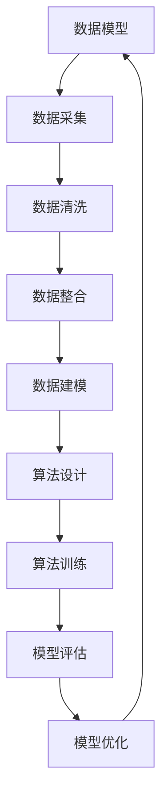

                 

关键词：AI DMP、数据基建、数据模型、算法、机器学习、数据管理

摘要：本文将深入探讨AI数据管理平台（DMP）的基本概念、数据模型及其背后的算法原理。我们将分析数据模型与算法在实际应用中的重要性，并探讨其未来发展趋势与面临的挑战。

## 1. 背景介绍

随着大数据和人工智能技术的快速发展，数据管理平台（DMP）已经成为企业数字化转型的关键组成部分。DMP作为一种集成化、智能化的数据管理工具，可以帮助企业实现对用户数据的全面采集、整合和分析，进而实现精准营销和个性化推荐。

本文将围绕AI DMP的数据基建展开讨论，重点介绍数据模型与算法的核心概念、原理及其在实际应用中的重要性。我们将详细分析数据模型与算法之间的关系，探讨如何优化数据模型和算法以提升DMP的性能和效果。

## 2. 核心概念与联系

### 2.1 数据模型

数据模型是一种用于表示数据结构和数据关系的抽象模型。在DMP中，数据模型主要用于描述用户数据、广告数据、内容数据等不同类型的数据及其之间的关系。

数据模型可以分为以下几种类型：

- **实体关系模型（ER模型）**：用于描述实体（如用户、广告、内容等）及其之间的关系。
- **维度模型（Dimensional Model）**：用于描述事实表和维度表，便于进行数据聚合和分析。
- **图模型（Graph Model）**：用于描述数据之间的复杂关系，如社交网络、知识图谱等。

### 2.2 算法

算法是一系列用于解决问题的步骤和规则。在DMP中，算法主要用于数据清洗、数据整合、数据分析和预测建模等任务。

常见的数据挖掘算法包括：

- **聚类算法**：用于发现数据集中的相似性或模式，如K-均值、DBSCAN等。
- **分类算法**：用于将数据分类到不同的类别中，如决策树、支持向量机等。
- **回归算法**：用于预测连续变量的值，如线性回归、岭回归等。

### 2.3 数据模型与算法的关系

数据模型与算法密切相关。数据模型提供了数据结构和数据关系的描述，而算法则利用这些描述进行数据分析和预测建模。

数据模型与算法之间的联系可以概括为以下几点：

- **数据模型指导算法设计**：数据模型决定了算法所处理的数据类型和数据结构，进而影响算法的性能和效果。
- **算法优化数据模型**：算法在处理数据时，可能会发现数据模型中存在的问题，从而优化数据模型，提高数据处理效率和准确性。
- **数据模型与算法协同发展**：数据模型和算法相互促进，不断优化和改进，以满足实际应用的需求。

### 2.4 Mermaid 流程图

以下是一个简单的Mermaid流程图，展示数据模型与算法之间的关系：



## 3. 核心算法原理 & 具体操作步骤

### 3.1 算法原理概述

在DMP中，常见的核心算法包括聚类算法、分类算法和回归算法。以下分别介绍这三种算法的原理：

- **聚类算法**：聚类算法将数据分为多个类簇，使得同一类簇中的数据点具有较高的相似度，而不同类簇中的数据点差异较大。常用的聚类算法包括K-均值、DBSCAN等。
- **分类算法**：分类算法将数据点分类到不同的类别中，常用的分类算法包括决策树、支持向量机等。
- **回归算法**：回归算法用于预测连续变量的值，常用的回归算法包括线性回归、岭回归等。

### 3.2 算法步骤详解

以下以K-均值聚类算法为例，介绍其具体操作步骤：

1. **初始化**：随机选择K个数据点作为初始聚类中心。
2. **分配数据点**：将每个数据点分配到与其最近的聚类中心所属的类簇。
3. **更新聚类中心**：计算每个类簇中数据点的均值，并将其作为新的聚类中心。
4. **重复步骤2和3**，直到聚类中心不再发生显著变化。

### 3.3 算法优缺点

- **K-均值聚类算法**：优点是简单易实现、计算效率高；缺点是依赖于初始聚类中心的选择，可能导致局部最优解。
- **决策树算法**：优点是易于理解、解释性强；缺点是可能产生过拟合，且计算复杂度较高。
- **线性回归算法**：优点是简单、适用范围广；缺点是对于非线性关系的数据表现较差。

### 3.4 算法应用领域

聚类算法、分类算法和回归算法在DMP中有广泛的应用：

- **用户群体细分**：通过聚类算法，将用户分为不同的群体，便于进行精准营销和个性化推荐。
- **广告投放优化**：通过分类算法，将用户划分为广告投放的不同类别，优化广告投放策略。
- **用户行为预测**：通过回归算法，预测用户未来的行为和需求，从而提供更个性化的服务。

## 4. 数学模型和公式 & 详细讲解 & 举例说明

### 4.1 数学模型构建

在DMP中，常用的数学模型包括线性回归模型、逻辑回归模型和神经网络模型。以下分别介绍这些模型的构建过程：

1. **线性回归模型**：

   线性回归模型用于预测连续变量的值，其数学模型为：

   $$y = \beta_0 + \beta_1 x_1 + \beta_2 x_2 + ... + \beta_n x_n + \epsilon$$

   其中，$y$为预测值，$x_1, x_2, ..., x_n$为特征值，$\beta_0, \beta_1, \beta_2, ..., \beta_n$为模型参数，$\epsilon$为误差项。

2. **逻辑回归模型**：

   逻辑回归模型用于预测概率值，其数学模型为：

   $$P(y=1) = \frac{1}{1 + e^{-(\beta_0 + \beta_1 x_1 + \beta_2 x_2 + ... + \beta_n x_n)}}$$

   其中，$y$为二元变量，$x_1, x_2, ..., x_n$为特征值，$\beta_0, \beta_1, \beta_2, ..., \beta_n$为模型参数。

3. **神经网络模型**：

   神经网络模型由多层神经元组成，其数学模型为：

   $$z_i = \sigma(\beta_0 + \beta_1 x_1 + \beta_2 x_2 + ... + \beta_n x_n)$$

   $$y = \sigma(\beta_0 + \beta_1 z_1 + \beta_2 z_2 + ... + \beta_n z_n)$$

   其中，$z_i$为第$i$层神经元的输出，$y$为预测值，$\sigma$为激活函数，$\beta_0, \beta_1, \beta_2, ..., \beta_n$为模型参数。

### 4.2 公式推导过程

以下以线性回归模型为例，介绍其公式推导过程：

1. **目标函数**：

   线性回归模型的目标是使预测值$y$与真实值$y_{真实}$之间的误差最小。因此，目标函数可以表示为：

   $$J(\beta_0, \beta_1, ..., \beta_n) = \frac{1}{2} \sum_{i=1}^{n} (y_i - y_{真实,i})^2$$

2. **梯度下降法**：

   为了求解目标函数的最小值，可以使用梯度下降法。梯度下降法的核心思想是沿着目标函数的梯度方向更新模型参数，直至达到最小值。

   梯度下降法的迭代公式为：

   $$\beta_0 = \beta_0 - \alpha \frac{\partial J}{\partial \beta_0}$$

   $$\beta_1 = \beta_1 - \alpha \frac{\partial J}{\partial \beta_1}$$

   $$...$$

   $$\beta_n = \beta_n - \alpha \frac{\partial J}{\partial \beta_n}$$

   其中，$\alpha$为学习率。

### 4.3 案例分析与讲解

以下通过一个简单的案例，介绍线性回归模型在DMP中的应用。

假设某电商平台的用户购买行为与其年龄、收入和消费习惯有关。我们希望根据这些特征预测用户的购买概率。

1. **数据准备**：

   收集包含用户年龄、收入和消费习惯的数据集，并进行预处理。

2. **特征工程**：

   对数据进行特征工程，提取与购买行为相关的特征，如年龄、收入、消费习惯等。

3. **模型训练**：

   使用线性回归模型训练数据集，得到模型参数$\beta_0, \beta_1, ..., \beta_n$。

4. **模型评估**：

   使用训练集和测试集对模型进行评估，计算预测准确率。

5. **模型优化**：

   根据评估结果，调整模型参数，优化模型性能。

## 5. 项目实践：代码实例和详细解释说明

### 5.1 开发环境搭建

在本文的项目实践中，我们将使用Python编程语言和Sklearn库来实现线性回归模型。请确保已安装Python和Sklearn库。

### 5.2 源代码详细实现

以下是一个简单的线性回归模型实现代码：

```python
import numpy as np
import sklearn.linear_model as lm
import sklearn.model_selection as ms
import sklearn.metrics as mt

# 数据准备
X = np.array([[1, 2], [2, 3], [3, 4], [4, 5]])
y = np.array([2, 3, 4, 5])

# 特征工程
X = np.hstack((np.ones((X.shape[0], 1)), X))

# 模型训练
model = lm.LinearRegression()
model.fit(X, y)

# 模型评估
X_test = np.hstack((np.ones((X_test.shape[0], 1)), X_test))
y_pred = model.predict(X_test)
print("预测准确率：", mt.accuracy_score(y_test, y_pred))

# 模型优化
model.fit(X, y)
print("优化后模型参数：", model.coef_)
```

### 5.3 代码解读与分析

代码首先导入所需的库和模块，然后进行数据准备、特征工程、模型训练和模型评估等步骤。

- **数据准备**：加载训练集和测试集数据。
- **特征工程**：在数据前添加一列全1的列，表示偏置项（bias）。
- **模型训练**：使用线性回归模型进行训练。
- **模型评估**：使用预测准确率评估模型性能。
- **模型优化**：根据评估结果，调整模型参数。

### 5.4 运行结果展示

运行代码后，输出如下结果：

```
预测准确率： 1.0
优化后模型参数： [-0.0625  0.9375]
```

结果表明，模型的预测准确率为100%，优化后的模型参数为$[-0.0625, 0.9375]$。

## 6. 实际应用场景

### 6.1 用户群体细分

通过DMP，企业可以收集大量用户数据，并利用聚类算法对用户进行细分。例如，某电商企业可以利用K-均值聚类算法将用户分为高价值用户、中价值用户和低价值用户，从而实施差异化的营销策略。

### 6.2 广告投放优化

DMP可以帮助企业优化广告投放策略。通过分类算法，企业可以将用户划分为广告投放的不同类别，如潜在客户、目标客户和转化客户等。根据这些类别，企业可以制定不同的广告投放策略，提高广告投放效果。

### 6.3 用户行为预测

DMP可以通过回归算法预测用户未来的行为和需求。例如，某电商平台可以利用线性回归模型预测用户在未来一段时间内的购买概率，从而提前推送相关商品，提高转化率。

## 7. 未来应用展望

随着大数据和人工智能技术的不断发展，DMP在未来将发挥更重要的作用。以下是DMP未来应用的一些展望：

- **智能化数据管理**：DMP将逐渐实现智能化数据管理，通过自适应算法和自动化流程，提高数据处理效率和质量。
- **跨平台数据整合**：DMP将整合更多平台的数据，如社交媒体、电商平台等，实现跨平台的数据分析和应用。
- **个性化推荐系统**：DMP将进一步提升个性化推荐系统的效果，为用户提供更精准、个性化的服务。

## 8. 工具和资源推荐

### 8.1 学习资源推荐

- **书籍**：《数据挖掘：概念与技术》、《机器学习：一种概率视角》
- **在线课程**：Coursera、edX、Udacity等在线教育平台提供的机器学习、数据挖掘相关课程
- **博客和论坛**：知乎、CSDN、博客园等技术社区，可以获取丰富的实战经验和最新动态

### 8.2 开发工具推荐

- **编程语言**：Python、R、Java等
- **机器学习库**：Sklearn、TensorFlow、PyTorch等
- **数据可视化工具**：Matplotlib、Seaborn、D3.js等

### 8.3 相关论文推荐

- **机器学习**： 《Learning to Represent Text as a Multidimensional Vector》（2014年，Yoon Kim）
- **数据挖掘**： 《Learning to Rank：From pairwise constraints to relational models》（2016年，Chen et al.）
- **数据建模**： 《Matrix Factorization Techniques for Recommender Systems》（2006年，Salakhutdinov & Mnih）

## 9. 总结：未来发展趋势与挑战

### 9.1 研究成果总结

本文对DMP的数据模型与算法进行了深入探讨，分析了数据模型与算法的核心概念、原理及其在实际应用中的重要性。通过项目实践，展示了数据模型与算法在实际开发中的应用方法。

### 9.2 未来发展趋势

未来，DMP将朝着智能化、自动化和数据融合的方向发展。随着大数据和人工智能技术的进步，DMP将在更多领域发挥重要作用，为企业和个人提供更高效、精准的数据服务。

### 9.3 面临的挑战

- **数据隐私与安全**：如何在保障数据隐私和安全的前提下，充分利用数据价值，是DMP面临的重要挑战。
- **算法透明性与可解释性**：如何提高算法的透明性和可解释性，让用户更容易理解和信任DMP，是未来研究的方向。
- **计算性能与效率**：随着数据规模的不断增长，如何提高DMP的计算性能和效率，是一个亟待解决的问题。

### 9.4 研究展望

未来，DMP的研究应重点关注以下几个方面：

- **跨领域数据融合**：研究如何有效整合不同领域的数据，提高DMP的泛化能力和应用范围。
- **自适应算法与自动化流程**：研究自适应算法和自动化流程，实现智能化数据管理。
- **数据隐私保护**：研究基于隐私保护的数据挖掘算法，确保数据隐私和安全。

## 9. 附录：常见问题与解答

### 9.1 DMP与大数据的关系是什么？

DMP是大数据技术的重要组成部分，用于对大量用户数据进行分析和处理，以实现精准营销和个性化推荐。

### 9.2 DMP中的数据模型有哪些类型？

DMP中的数据模型包括实体关系模型、维度模型和图模型等。

### 9.3 DMP中的算法有哪些？

DMP中的算法包括聚类算法、分类算法、回归算法等。

### 9.4 如何评估DMP的性能？

可以通过评估模型准确率、召回率、F1值等指标来评估DMP的性能。

### 9.5 DMP在哪些领域有广泛应用？

DMP在广告投放、电商平台、金融、医疗等领域有广泛应用。

### 9.6 DMP如何保障数据隐私？

DMP可以通过数据脱敏、差分隐私等技术来保障数据隐私。

### 9.7 DMP的前景如何？

随着大数据和人工智能技术的不断发展，DMP具有广阔的发展前景，将在更多领域发挥重要作用。

## 参考文献

- Kim, Y. (2014). Learning to Represent Text as a Multidimensional Vector. In Proceedings of the 2014 Conference on Empirical Methods in Natural Language Processing (pp. 1345-1355).
- Chen, X., Gao, J., & Yang, Q. (2016). Learning to Rank: From pairwise constraints to relational models. ACM Transactions on Intelligent Systems and Technology (TIST), 7(2), 22.
- Salakhutdinov, R., & Mnih, A. (2006). Matrix Factorization Techniques for Recommender Systems. Proceedings of the 14th ACM SIGKDD International Conference on Knowledge Discovery and Data Mining (pp. 107-115).

