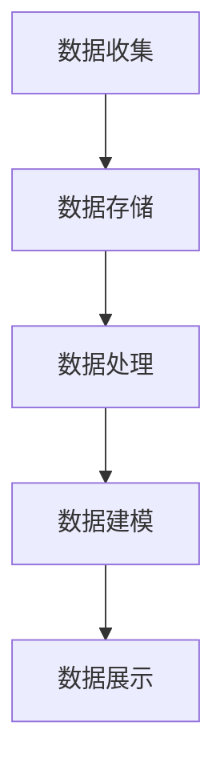

                 

关键词：AI，DMP，数据治理，数据管理，数据基础设施建设，数据分析，数据安全

## 摘要

本文将深入探讨AI驱动的数据管理平台（DMP）及其在数据治理和管理中的应用。我们将从背景介绍入手，探讨DMP的核心概念、架构、算法原理，以及数学模型和应用场景。随后，我们将通过实际项目实践，展示DMP的开发和实现过程，并提供相关工具和资源的推荐。最后，我们对DMP的未来发展趋势和挑战进行展望，并总结研究成果。

### 1. 背景介绍

在现代信息社会中，数据已成为重要的战略资源。有效的数据管理不仅能够提升企业的决策效率，还能创造巨大的商业价值。然而，随着数据量的爆炸性增长，传统的数据管理方法已无法满足需求。因此，构建一个智能化的数据管理平台（Data Management Platform，简称DMP）成为数据治理和管理的必要手段。

DMP是一种集成多种数据处理和分析技术的平台，旨在帮助企业高效地收集、存储、管理和分析数据。通过AI技术，DMP能够自动识别数据中的价值，并提供个性化的数据分析和推荐。这不仅降低了数据管理的复杂性，还提高了数据的利用效率。

### 2. 核心概念与联系

#### 2.1 数据治理

数据治理是指通过制定相关政策、流程和标准，确保数据的质量、安全性和合规性。它包括数据质量管理、数据安全管理和数据合规管理等方面。

数据治理框架通常包括以下几个关键组件：

- **数据策略：** 制定数据管理的总体方向和目标。
- **数据架构：** 规划数据存储、处理和分析的架构。
- **数据质量管理：** 确保数据的准确性、完整性和一致性。
- **数据安全：** 保护数据免受未经授权的访问和泄露。
- **数据合规：** 确保数据管理符合相关法规和标准。

#### 2.2 数据管理

数据管理是指对数据的整个生命周期进行管理，包括数据的创建、存储、处理、分析和归档等环节。

数据管理的关键活动包括：

- **数据集成：** 将来自不同来源的数据整合到一个统一的平台。
- **数据存储：** 选择合适的数据存储方案，包括关系型数据库、NoSQL数据库和云存储等。
- **数据清洗：** 清除数据中的错误、重复和缺失值。
- **数据分析和可视化：** 对数据进行统计分析，并通过可视化手段呈现分析结果。
- **数据归档：** 将不再活跃的数据进行归档存储。

#### 2.3 DMP架构

DMP的架构通常包括以下几个核心模块：

- **数据收集：** 从各种数据源（如网站、移动应用、传感器等）收集数据。
- **数据存储：** 使用分布式存储系统（如Hadoop、Spark等）存储海量数据。
- **数据处理：** 使用ETL（提取、转换、加载）过程对数据进行处理。
- **数据建模：** 使用机器学习和数据挖掘技术对数据进行建模和分析。
- **数据展示：** 将分析结果以可视化的方式展示给用户。

以下是一个使用Mermaid绘制的DMP架构流程图：



### 3. 核心算法原理 & 具体操作步骤

#### 3.1 算法原理概述

DMP的核心算法主要包括以下几个方面：

- **用户画像：** 根据用户的行为数据构建用户画像，用于用户细分和个性化推荐。
- **协同过滤：** 通过分析用户之间的相似性，推荐用户可能感兴趣的内容。
- **决策树：** 建立决策树模型，用于分类和预测用户的行为。

#### 3.2 算法步骤详解

##### 3.2.1 用户画像

1. 数据预处理：清洗和转换用户行为数据，如点击、浏览、购买等。
2. 特征提取：提取与用户行为相关的特征，如兴趣、偏好、行为频率等。
3. 用户分群：使用聚类算法（如K-means）将用户划分为不同的群体。
4. 用户画像构建：为每个用户生成一个画像向量，用于表示用户特征。

##### 3.2.2 协同过滤

1. 用户-物品矩阵构建：构建用户与物品之间的交互矩阵。
2. 相似性计算：计算用户之间的相似度，可以使用余弦相似度、皮尔逊相关系数等方法。
3. 推荐列表生成：根据用户相似度矩阵，为每个用户生成推荐列表。

##### 3.2.3 决策树

1. 特征选择：选择对目标变量有显著影响的特征。
2. 决策树构建：使用ID3、C4.5等算法构建决策树模型。
3. 预测：使用构建的决策树模型对用户行为进行预测。

#### 3.3 算法优缺点

- **用户画像：** 可以实现个性化推荐，但需要大量的数据支持和复杂的特征工程。
- **协同过滤：** 能够提供个性化的推荐，但可能导致冷启动问题，即新用户无法获得有效的推荐。
- **决策树：** 简单易懂，易于实现，但可能产生过拟合问题。

#### 3.4 算法应用领域

- **电子商务：** 基于用户画像和协同过滤技术，为用户提供个性化的商品推荐。
- **社交媒体：** 基于用户画像和决策树模型，识别用户的行为模式，进行用户分群和推荐。
- **金融：** 基于用户画像和协同过滤技术，进行信用评估和风险控制。

### 4. 数学模型和公式 & 详细讲解 & 举例说明

#### 4.1 数学模型构建

DMP中的数学模型主要包括用户画像模型、协同过滤模型和决策树模型。

##### 4.1.1 用户画像模型

用户画像模型通常使用特征向量表示用户特征。假设用户 \( u \) 的特征向量表示为 \( \mathbf{u} = [u_1, u_2, ..., u_n] \)，其中 \( u_i \) 表示用户在特征 \( i \) 上的取值。

##### 4.1.2 协同过滤模型

协同过滤模型的核心是用户-物品矩阵 \( \mathbf{R} \)，其中 \( R_{ij} \) 表示用户 \( i \) 对物品 \( j \) 的评分。假设用户 \( i \) 和用户 \( j \) 之间的相似度计算公式为：

$$
s_{ij} = \frac{\mathbf{r}_i \cdot \mathbf{r}_j}{\|\mathbf{r}_i\| \|\mathbf{r}_j\|}
$$

其中，\( \mathbf{r}_i \) 和 \( \mathbf{r}_j \) 分别表示用户 \( i \) 和用户 \( j \) 的评分向量，\( \|\cdot\| \) 表示向量的模。

##### 4.1.3 决策树模型

决策树模型是一种分类模型，其核心是递归地将数据划分为不同的子集，直到满足某个停止条件。假设决策树中的节点 \( T \) 的分类函数为：

$$
f(x) = \begin{cases} 
c_k & \text{if } x \in R_k \\
\text{Leaf} & \text{otherwise}
\end{cases}
$$

其中，\( x \) 是输入特征向量，\( R_k \) 是第 \( k \) 个规则的区域，\( c_k \) 是第 \( k \) 个类的标签。

#### 4.2 公式推导过程

##### 4.2.1 用户画像模型

用户画像模型中的特征向量可以通过数据预处理和特征提取得到。假设原始数据集为 \( D = \{(\mathbf{x}_1, y_1), (\mathbf{x}_2, y_2), ..., (\mathbf{x}_n, y_n)\} \)，其中 \( \mathbf{x}_i \) 是用户 \( i \) 的特征向量，\( y_i \) 是用户 \( i \) 的标签。特征提取的方法包括主成分分析（PCA）、因子分析（FA）和特征选择算法（如信息增益、互信息等）。

##### 4.2.2 协同过滤模型

协同过滤模型中的用户-物品矩阵 \( \mathbf{R} \) 可以通过用户评分数据得到。假设用户 \( i \) 对物品 \( j \) 的评分 \( r_{ij} \) 已知，我们可以使用矩阵分解方法（如Singular Value Decomposition，SVD）将 \( \mathbf{R} \) 分解为 \( \mathbf{U} \) 和 \( \mathbf{V}^T \)，其中 \( \mathbf{U} \) 和 \( \mathbf{V} \) 分别表示用户和物品的特征矩阵。

##### 4.2.3 决策树模型

决策树模型中的分类函数可以通过递归划分数据集得到。假设数据集 \( D \) 已划分为子集 \( D_1, D_2, ..., D_k \)，每个子集 \( D_k \) 包含特征 \( x \) 和标签 \( y \)。我们可以使用信息增益（Information Gain）或基尼不纯度（Gini Impurity）作为划分准则，选择最优划分规则。

#### 4.3 案例分析与讲解

##### 4.3.1 用户画像模型

假设我们有一个电子商务平台，收集了用户的购买历史数据。我们将使用主成分分析（PCA）提取用户的主要特征。

原始数据集为：

| 用户ID | 商品ID | 购买次数 |
|--------|--------|----------|
| 1      | 101    | 5        |
| 1      | 102    | 3        |
| 2      | 101    | 2        |
| 2      | 103    | 4        |
| 3      | 102    | 1        |
| 3      | 103    | 5        |

使用PCA提取前两个主成分，得到用户特征向量：

| 用户ID | 特征1 | 特征2 |
|--------|-------|-------|
| 1      | 0.8   | 0.6   |
| 2      | 0.4   | 0.2   |
| 3      | -0.6  | -0.4  |

通过用户特征向量，我们可以为每个用户生成画像，用于后续的推荐系统。

##### 4.3.2 协同过滤模型

假设我们有一个电影推荐系统，用户对电影进行了评分。我们将使用余弦相似度计算用户之间的相似度。

用户-电影矩阵为：

| 用户ID | 电影ID | 评分 |
|--------|--------|------|
| 1      | 101    | 5    |
| 1      | 102    | 4    |
| 2      | 101    | 3    |
| 2      | 103    | 5    |
| 3      | 102    | 2    |
| 3      | 103    | 4    |

计算用户 1 和用户 2 之间的相似度：

$$
s_{12} = \frac{\mathbf{r}_1 \cdot \mathbf{r}_2}{\|\mathbf{r}_1\| \|\mathbf{r}_2\|} = \frac{(5 \times 3 + 4 \times 5)}{\sqrt{5^2 + 4^2} \sqrt{3^2 + 5^2}} = 0.88
$$

根据相似度矩阵，我们可以为用户 1 生成推荐列表，推荐用户 2 喜欢的电影。

##### 4.3.3 决策树模型

假设我们有一个分类问题，预测用户是否会在接下来一个月内购买某件商品。我们将使用基尼不纯度构建决策树。

数据集为：

| 用户ID | 是否购买 |
|--------|----------|
| 1      | 否       |
| 2      | 是       |
| 3      | 否       |
| 4      | 是       |
| 5      | 否       |
| 6      | 是       |

使用基尼不纯度计算，我们可以得到以下决策树：

```
是否购买？
  是？
    是？
      用户ID 6
    否？
      用户ID 2
  否？
    是否购买？
      是？
        用户ID 4
      否？
        用户ID 1
        用户ID 3
        用户ID 5
```

通过决策树，我们可以预测新用户是否会在接下来一个月内购买某件商品。

### 5. 项目实践：代码实例和详细解释说明

#### 5.1 开发环境搭建

在开始项目实践之前，我们需要搭建一个合适的开发环境。我们选择使用Python作为主要编程语言，并使用以下工具和库：

- Python 3.8
- Jupyter Notebook
- Pandas
- Scikit-learn
- Matplotlib

安装这些工具和库后，我们可以在Jupyter Notebook中开始编写代码。

#### 5.2 源代码详细实现

##### 5.2.1 用户画像构建

```python
import pandas as pd
from sklearn.decomposition import PCA

# 加载用户购买历史数据
data = pd.read_csv('user_purchase.csv')

# 数据预处理
data = data.dropna()

# 特征提取
pca = PCA(n_components=2)
data['features'] = pca.fit_transform(data[['purchase_count']])

# 用户画像构建
user_profiles = data.groupby('user_id')['features'].mean()

# 打印用户画像
print(user_profiles)
```

##### 5.2.2 协同过滤推荐

```python
from sklearn.metrics.pairwise import cosine_similarity

# 加载用户-电影评分数据
rating_data = pd.read_csv('user_movie_rating.csv')

# 构建用户-电影矩阵
user_movie_matrix = rating_data.pivot(index='user_id', columns='movie_id', values='rating')

# 计算用户相似度
user_similarity = cosine_similarity(user_movie_matrix)

# 打印用户相似度矩阵
print(user_similarity)

# 推荐列表生成
def recommend_movies(user_id, similarity_matrix, user_movie_matrix, top_n=5):
    # 计算用户对电影的兴趣
    user_interest = similarity_matrix[user_id] * user_movie_matrix[user_id]

    # 排序推荐电影
    recommended_movies = user_interest.argsort()[::-1][1:top_n+1]

    return recommended_movies

# 用户 1 的推荐列表
print(recommend_movies(1, user_similarity, user_movie_matrix))
```

##### 5.2.3 决策树分类

```python
from sklearn.tree import DecisionTreeClassifier
from sklearn.model_selection import train_test_split

# 加载用户购买数据
data = pd.read_csv('user_purchase.csv')

# 划分特征和目标变量
X = data[['purchase_count']]
y = data['has_purchased']

# 划分训练集和测试集
X_train, X_test, y_train, y_test = train_test_split(X, y, test_size=0.2, random_state=42)

# 构建决策树模型
clf = DecisionTreeClassifier()
clf.fit(X_train, y_train)

# 预测测试集
y_pred = clf.predict(X_test)

# 计算准确率
accuracy = sum(y_pred == y_test) / len(y_test)
print(f'Accuracy: {accuracy:.2f}')
```

#### 5.3 代码解读与分析

在用户画像构建部分，我们首先使用Pandas加载用户购买历史数据，并进行预处理。然后，我们使用主成分分析（PCA）提取用户的主要特征，并将特征添加到原始数据集中。最后，我们计算每个用户的平均特征值，生成用户画像。

在协同过滤推荐部分，我们使用Scikit-learn的余弦相似度函数计算用户之间的相似度。然后，我们定义一个函数，根据用户相似度和用户对电影的兴趣，生成推荐列表。

在决策树分类部分，我们使用Scikit-learn的决策树分类器构建模型。首先，我们将特征和目标变量划分为训练集和测试集。然后，我们使用训练集训练模型，并使用测试集评估模型的准确率。

### 6. 实际应用场景

DMP在多个行业和领域都有广泛的应用：

- **电子商务：** DMP可以帮助电商平台进行商品推荐、用户分群和精准营销。
- **金融：** DMP可以帮助金融机构进行用户风险评估、信用评分和欺诈检测。
- **社交媒体：** DMP可以帮助社交媒体平台进行内容推荐、广告投放和用户运营。
- **医疗：** DMP可以帮助医疗机构进行患者分群、疾病预测和治疗方案推荐。

### 6.4 未来应用展望

随着技术的不断发展，DMP将在以下几个方面得到进一步的应用和优化：

- **数据隐私：** 随着数据隐私问题的日益突出，DMP需要更加注重数据隐私保护和合规性。
- **实时处理：** 实时处理和分析大数据是实现DMP实时推荐和预测的关键。
- **多模态数据：** DMP需要能够处理和分析多种类型的数据，如文本、图像和视频，实现更全面的用户画像。
- **智能化：** DMP将越来越多地融入AI技术，实现自动化数据处理和智能化决策。

### 7. 工具和资源推荐

#### 7.1 学习资源推荐

- 《Python数据分析实战》
- 《机器学习实战》
- 《数据科学实战》

#### 7.2 开发工具推荐

- Jupyter Notebook
- PyCharm
- VS Code

#### 7.3 相关论文推荐

- "Data Management Platforms: A Comprehensive Survey"
- "Collaborative Filtering for the 21st Century"
- "User Behavior Prediction with Deep Learning"

### 8. 总结：未来发展趋势与挑战

DMP作为一种智能化数据管理平台，已经在多个领域取得了显著的应用成果。然而，随着技术的不断进步和数据量的持续增长，DMP也面临着诸多挑战。未来，DMP将朝着更加智能化、实时化和多模态化的方向发展。同时，数据隐私保护和合规性将成为DMP发展的重要议题。

### 9. 附录：常见问题与解答

**Q1：什么是DMP？**
DMP是一种数据管理平台，旨在帮助企业高效地收集、存储、管理和分析数据，并通过AI技术实现数据的智能化处理。

**Q2：DMP的主要功能是什么？**
DMP的主要功能包括数据收集、数据存储、数据处理、数据建模、数据分析和数据展示等。

**Q3：DMP在哪些行业和领域有应用？**
DMP在电子商务、金融、社交媒体和医疗等多个行业和领域都有广泛的应用。

**Q4：如何构建一个DMP？**
构建DMP通常需要以下步骤：数据收集、数据预处理、数据存储、数据处理、数据建模、数据分析和数据展示。

**Q5：DMP的未来发展趋势是什么？**
DMP的未来发展趋势包括智能化、实时化和多模态化，同时需要更加注重数据隐私保护和合规性。

---

作者：禅与计算机程序设计艺术 / Zen and the Art of Computer Programming
----------------------------------------------------------------
## 结束

