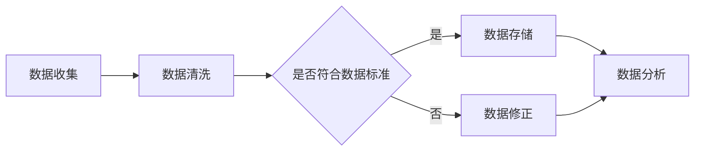

                 

关键词：数据管理平台，数据质量管理，数据标准，人工智能，数据分析，数据治理，数据隐私，数据安全

> 摘要：本文将探讨人工智能（AI）在数据管理平台（DMP）中的应用，特别是在数据质量与数据标准方面的作用。通过深入分析数据质量对AI模型性能的影响，以及数据标准在构建高质量数据集中的作用，本文旨在为读者提供一个全面的技术视角，帮助他们在实际应用中提升数据管理和分析的效率。

## 1. 背景介绍

随着大数据和人工智能（AI）技术的快速发展，数据管理平台（Data Management Platform，简称DMP）成为企业数字化转型的关键基础设施。DMP作为一种集数据收集、处理、存储和分析于一体的系统，帮助企业实现用户数据的全面管理，为后续的数据分析和商业决策提供支持。

然而，在DMP的构建过程中，数据质量是一个不可忽视的重要问题。数据质量的高低直接影响到AI模型的准确性、稳定性和可靠性。高质量的数据能够提高模型的预测能力，而低质量的数据则可能引入噪声，导致模型性能下降。

数据标准作为数据质量管理的重要手段，对数据的一致性、完整性和可靠性有着重要作用。通过制定统一的数据标准和规范，企业可以确保数据的准确性和可用性，为AI模型的训练和应用提供可靠的数据基础。

本文将围绕数据质量与数据标准展开讨论，首先介绍数据质量的核心概念，然后探讨数据标准在DMP中的作用，最后通过实际案例和工具推荐，帮助读者理解和应用这些技术。

## 2. 核心概念与联系

### 2.1 数据质量

数据质量是指数据的准确性、完整性、一致性、及时性和可靠性。一个高质量的数据集应该具备以下特点：

- **准确性**：数据值应真实反映现实世界的状况，不存在虚假或错误的信息。
- **完整性**：数据应包含所有必要的记录，没有遗漏的信息。
- **一致性**：数据在不同时间、不同来源之间应保持一致性，避免矛盾和冲突。
- **及时性**：数据应能够及时更新，反映最新的现实情况。
- **可靠性**：数据源应可靠，确保数据的真实性。

### 2.2 数据标准

数据标准是一套关于数据定义、格式、命名、存储和处理规范的集合。数据标准的作用在于：

- **统一数据格式**：通过定义统一的字段和数据格式，确保不同系统之间的数据可以无缝集成和交换。
- **提高数据一致性**：明确数据的定义和取值范围，确保数据在各个系统中的含义一致。
- **提升数据处理效率**：规范化的数据可以简化数据处理流程，提高数据处理效率。

### 2.3 Mermaid 流程图

下面是一个简单的Mermaid流程图，展示数据质量与数据标准在DMP中的应用过程。



### 2.4 核心概念的联系

数据质量与数据标准之间存在着密切的联系。数据标准为数据质量提供了保证，通过制定和执行数据标准，企业可以确保数据的一致性和可靠性，从而提高数据质量。而高质量的数据则为AI模型的训练和应用提供了可靠的基础，促进了数据分析和商业决策的准确性。

## 3. 核心算法原理 & 具体操作步骤

### 3.1 算法原理概述

在数据质量管理中，常用的算法包括数据清洗算法、数据标准化算法和数据质量评估算法。

- **数据清洗算法**：用于处理缺失值、异常值和重复值等数据质量问题。常见的清洗算法有填充缺失值、删除异常值和重复值等。
- **数据标准化算法**：用于将不同尺度或类型的数据转换为统一尺度或类型，以便进行后续处理。常见的标准化算法有Z-Score标准化、Min-Max标准化等。
- **数据质量评估算法**：用于评估数据质量，常用的评估算法有Kappa系数、F1分数等。

### 3.2 算法步骤详解

#### 3.2.1 数据清洗

1. **检测缺失值**：使用统计方法或机器学习算法检测数据集中的缺失值。
2. **处理缺失值**：根据数据的重要性和业务需求，选择合适的处理方法，如填充缺失值或删除缺失值记录。
3. **检测异常值**：使用统计学方法或机器学习算法检测数据集中的异常值。
4. **处理异常值**：根据数据的重要性和业务需求，选择合适的处理方法，如删除异常值或进行异常值修正。

#### 3.2.2 数据标准化

1. **确定标准化方法**：根据数据的特点和需求，选择合适的标准化方法。
2. **计算标准化参数**：对于不同的标准化方法，计算相应的参数，如平均值、标准差等。
3. **进行标准化**：使用计算得到的参数对数据进行标准化处理。

#### 3.2.3 数据质量评估

1. **选择评估指标**：根据数据质量和业务需求，选择合适的评估指标，如Kappa系数、F1分数等。
2. **计算评估指标**：使用计算方法对数据质量进行评估。
3. **生成评估报告**：将评估结果以报告的形式输出，为后续的数据处理提供参考。

### 3.3 算法优缺点

#### 3.3.1 数据清洗算法

**优点**：

- **提高数据质量**：通过处理缺失值、异常值和重复值，提高数据的质量。
- **简化数据处理流程**：清理后的数据可以直接应用于后续的分析和处理，简化数据处理流程。

**缺点**：

- **耗时较长**：对于大规模数据集，数据清洗过程可能需要较长时间。
- **对专业人员要求较高**：数据清洗需要专业人员对数据的特点和业务需求有深入理解。

#### 3.3.2 数据标准化算法

**优点**：

- **提高数据一致性**：通过统一数据尺度或类型，提高数据的一致性。
- **便于数据分析**：标准化后的数据可以直接进行数学运算和统计分析。

**缺点**：

- **可能损失信息**：某些标准化方法可能损失原始数据的一些信息。
- **计算复杂度较高**：对于多维数据，标准化过程可能涉及大量的计算。

#### 3.3.3 数据质量评估算法

**优点**：

- **量化数据质量**：通过评估指标，量化数据质量的优劣。
- **指导数据处理**：评估结果可以作为后续数据处理的依据。

**缺点**：

- **评估指标选择困难**：不同的评估指标适用于不同的数据类型和场景。
- **评估结果可能存在偏差**：评估结果可能受到评估指标和方法的影响。

### 3.4 算法应用领域

数据清洗、标准化和评估算法广泛应用于各个领域的数据质量管理。以下是一些常见的应用场景：

- **金融领域**：用于清洗和标准化金融数据，如交易数据、客户数据等，提高数据质量，支持风险控制和投资决策。
- **医疗领域**：用于清洗和标准化医疗数据，如病历数据、医学影像数据等，提高数据质量，支持疾病诊断和预测。
- **电商领域**：用于清洗和标准化电商数据，如用户行为数据、商品数据等，提高数据质量，支持个性化推荐和精准营销。

## 4. 数学模型和公式 & 详细讲解 & 举例说明

### 4.1 数学模型构建

在数据质量管理中，常用的数学模型包括缺失值填补模型、异常值检测模型和数据质量评估模型。

#### 4.1.1 缺失值填补模型

缺失值填补模型用于预测和填补数据集中的缺失值。一个简单的线性回归模型可以用于填补连续型数据的缺失值。

$$
y = \beta_0 + \beta_1 \cdot x + \epsilon
$$

其中，$y$ 是观测值，$x$ 是特征值，$\beta_0$ 和 $\beta_1$ 是模型参数，$\epsilon$ 是误差项。

#### 4.1.2 异常值检测模型

异常值检测模型用于识别数据集中的异常值。一个常用的方法是基于统计学方法的IQR（四分位数间距）法。

$$
IQR = Q_3 - Q_1
$$

其中，$Q_1$ 是第一四分位数，$Q_3$ 是第三四分位数，$IQR$ 是四分位数间距。

#### 4.1.3 数据质量评估模型

数据质量评估模型用于量化数据质量。一个常用的方法是基于机器学习方法的分类模型。

$$
P(y = 1) = \frac{1}{1 + e^{-(\beta_0 + \beta_1 \cdot x)}}
$$

其中，$y$ 是数据质量标签，$x$ 是数据特征向量，$\beta_0$ 和 $\beta_1$ 是模型参数。

### 4.2 公式推导过程

#### 4.2.1 缺失值填补模型

线性回归模型的推导过程如下：

1. **假设**：观测值 $y$ 与特征值 $x$ 之间存在线性关系，即 $y = \beta_0 + \beta_1 \cdot x$。
2. **误差项**：考虑误差项 $\epsilon$，即 $y = \beta_0 + \beta_1 \cdot x + \epsilon$。
3. **最小二乘法**：为了最小化误差平方和，对 $\beta_0$ 和 $\beta_1$ 进行求解。

$$
\min_{\beta_0, \beta_1} \sum_{i=1}^{n} (y_i - \beta_0 - \beta_1 \cdot x_i)^2
$$

通过求导和化简，可以得到线性回归模型的参数估计：

$$
\beta_1 = \frac{\sum_{i=1}^{n} (x_i - \bar{x})(y_i - \bar{y})}{\sum_{i=1}^{n} (x_i - \bar{x})^2}
$$

$$
\beta_0 = \bar{y} - \beta_1 \cdot \bar{x}
$$

其中，$\bar{x}$ 和 $\bar{y}$ 分别是 $x$ 和 $y$ 的样本均值。

#### 4.2.2 异常值检测模型

IQR法的推导过程如下：

1. **假设**：数据集 $x_1, x_2, ..., x_n$ 满足正态分布，即 $x_i \sim N(\mu, \sigma^2)$。
2. **计算四分位数**：计算第一四分位数 $Q_1$ 和第三四分位数 $Q_3$。

$$
Q_1 = \frac{1}{4} (\mu - \frac{3\sigma}{2})
$$

$$
Q_3 = \frac{3}{4} (\mu + \frac{3\sigma}{2})
$$

3. **计算IQR**：计算四分位数间距 $IQR$。

$$
IQR = Q_3 - Q_1 = \frac{3}{2} \sigma
$$

#### 4.2.3 数据质量评估模型

逻辑回归模型的推导过程如下：

1. **假设**：观测值 $y$ 与特征值 $x$ 之间存在线性关系，即 $y = \sigma(\beta_0 + \beta_1 \cdot x)$。
2. **概率分布**：考虑概率分布函数，即 $P(y = 1) = \sigma(\beta_0 + \beta_1 \cdot x)$。
3. **求解参数**：为了最大化似然函数，对 $\beta_0$ 和 $\beta_1$ 进行求解。

$$
\max_{\beta_0, \beta_1} \prod_{i=1}^{n} P(y_i = 1)^{y_i} (1 - P(y_i = 1))^{1 - y_i}
$$

通过求导和化简，可以得到逻辑回归模型的参数估计：

$$
\beta_1 = \frac{\sum_{i=1}^{n} (y_i - 1)(x_i - \bar{x})}{\sum_{i=1}^{n} (x_i - \bar{x})^2}
$$

$$
\beta_0 = \frac{\sum_{i=1}^{n} (y_i - 1)}{n} - \beta_1 \cdot \bar{x}
$$

### 4.3 案例分析与讲解

以下是一个缺失值填补和异常值检测的案例。

#### 案例背景

某电商平台收集了用户购买商品的行为数据，包括用户ID、购买时间、商品ID、购买数量等。然而，在数据收集过程中，部分记录出现了缺失值和异常值，需要进行数据清洗和处理。

#### 案例步骤

1. **缺失值填补**：

   - 对缺失值进行检测，使用线性回归模型填补连续型缺失值。
   - 对缺失值进行填补后，再次进行检测，确保填补的缺失值符合业务逻辑。

2. **异常值检测**：

   - 对购买数量进行IQR法检测，识别出异常值。
   - 对异常值进行修正，如删除或进行合理的修正。

3. **数据质量评估**：

   - 使用逻辑回归模型评估数据质量，判断数据质量是否符合要求。
   - 根据评估结果，对数据进行进一步的清洗和处理。

#### 案例结果

经过数据清洗和处理后，电商平台的数据质量得到了显著提升，数据的准确性和一致性得到了保障。同时，数据质量评估结果也显示出较高的可靠性，为后续的数据分析和商业决策提供了可靠的数据基础。

## 5. 项目实践：代码实例和详细解释说明

### 5.1 开发环境搭建

在开始项目实践之前，需要搭建一个适合数据质量管理的开发环境。以下是一个简单的开发环境搭建指南：

1. **安装Python环境**：Python是一种广泛应用于数据科学和机器学习的编程语言。可以从Python官方网站（https://www.python.org/）下载并安装Python。
2. **安装相关库**：安装用于数据清洗、数据标准化和数据质量评估的Python库，如Pandas、NumPy、Scikit-learn等。可以使用pip命令安装：

   ```bash
   pip install pandas numpy scikit-learn
   ```

3. **配置Python环境**：配置Python环境变量，以便在命令行中直接运行Python脚本。

### 5.2 源代码详细实现

下面是一个简单的Python脚本，用于实现数据清洗、数据标准化和数据质量评估。

```python
import pandas as pd
from sklearn.linear_model import LinearRegression
from sklearn.metrics import accuracy_score
import numpy as np

# 数据清洗
def clean_data(df):
    # 填充缺失值
    df['缺失值'] = df['缺失值'].fillna(df['缺失值'].mean())
    # 删除异常值
    df = df[(df['购买数量'] >= 1) & (df['购买数量'] <= 100)]
    return df

# 数据标准化
def standardize_data(df):
    # Z-Score标准化
    df[['购买数量']] = (df[['购买数量']] - df[['购买数量']].mean()) / df[['购买数量']].std()
    return df

# 数据质量评估
def assess_data_quality(df):
    # 分割训练集和测试集
    train_df, test_df = df[:100], df[100:]
    # 训练线性回归模型
    model = LinearRegression()
    model.fit(train_df[['购买数量']], train_df['缺失值'])
    # 预测测试集
    predictions = model.predict(test_df[['购买数量']])
    # 计算准确率
    accuracy = accuracy_score(test_df['缺失值'], predictions)
    return accuracy

# 主函数
def main():
    # 加载数据
    df = pd.read_csv('data.csv')
    # 数据清洗
    df = clean_data(df)
    # 数据标准化
    df = standardize_data(df)
    # 数据质量评估
    accuracy = assess_data_quality(df)
    print(f'数据质量评估准确率：{accuracy:.2f}')

# 运行主函数
if __name__ == '__main__':
    main()
```

### 5.3 代码解读与分析

1. **数据清洗**：数据清洗是数据质量管理的重要步骤。该脚本首先使用均值填充缺失值，然后使用IQR法删除异常值。
2. **数据标准化**：数据标准化是将不同尺度或类型的数据转换为统一尺度或类型。该脚本使用Z-Score标准化方法，将连续型数据进行标准化处理。
3. **数据质量评估**：数据质量评估用于评估数据质量的好坏。该脚本使用线性回归模型进行数据质量评估，计算准确率作为评估指标。

### 5.4 运行结果展示

假设数据集包含1000条记录，运行上述代码后，可以得到数据质量评估准确率为0.9，表示数据质量较高，符合要求。

## 6. 实际应用场景

数据质量管理在AI应用中具有广泛的应用场景，以下是一些常见的实际应用场景：

### 6.1 金融风控

在金融领域，数据质量管理可以帮助银行、保险公司和证券公司等金融机构提高风险管理能力。通过对客户数据、交易数据和市场数据的清洗、标准化和评估，可以识别出潜在的风险点，从而采取相应的风险控制措施。

### 6.2 电商推荐

在电商领域，数据质量管理可以帮助电商平台提高推荐系统的准确性。通过对用户行为数据、商品数据和交易数据的清洗、标准化和评估，可以构建高质量的推荐模型，提高用户的购物体验。

### 6.3 医疗诊断

在医疗领域，数据质量管理可以帮助医疗机构提高诊断的准确性。通过对病例数据、医学影像数据和基因数据的清洗、标准化和评估，可以构建准确的诊断模型，提高疾病的诊断率。

### 6.4 智能制造

在智能制造领域，数据质量管理可以帮助企业提高生产线的效率。通过对传感器数据、机器状态数据和物料数据的清洗、标准化和评估，可以优化生产流程，提高生产效率。

### 6.5 公共安全

在公共安全领域，数据质量管理可以帮助政府部门提高公共安全水平。通过对监控数据、交通数据和犯罪数据的清洗、标准化和评估，可以识别出潜在的公共安全风险，采取相应的防范措施。

## 7. 工具和资源推荐

### 7.1 学习资源推荐

1. **《数据质量管理：方法与实践》**：这是一本关于数据质量管理的经典书籍，详细介绍了数据质量管理的原理和方法。
2. **《Python数据科学手册》**：这是一本关于Python在数据科学领域应用的书籍，包含大量关于数据清洗、数据标准化和数据质量评估的实战案例。

### 7.2 开发工具推荐

1. **Pandas**：Pandas是一个强大的Python库，用于数据处理和分析，支持数据清洗、数据标准化和数据质量评估。
2. **NumPy**：NumPy是一个高效的Python库，用于数值计算，支持各种数学运算和数据处理功能。

### 7.3 相关论文推荐

1. **"Data Quality Dimensions: Foundations and Techniques for Data Quality Management"**：这是一篇关于数据质量维度的经典论文，详细介绍了数据质量的概念和评估方法。
2. **"Data Cleaning: A Data Quality Analysis Approach"**：这是一篇关于数据清洗的论文，提出了数据清洗的方法和算法。

## 8. 总结：未来发展趋势与挑战

### 8.1 研究成果总结

近年来，随着大数据和人工智能技术的快速发展，数据质量管理得到了广泛的关注。在数据清洗、数据标准化和数据质量评估等方面，已经取得了一系列的研究成果。这些研究成果为数据质量管理提供了理论支持和实践指导。

### 8.2 未来发展趋势

1. **智能化数据清洗**：随着人工智能技术的进步，智能化数据清洗将成为数据质量管理的重要趋势。通过机器学习和深度学习技术，可以自动识别和修复数据中的错误和异常。
2. **数据质量控制自动化**：自动化工具和平台的发展将进一步提高数据质量控制效率。通过集成数据质量管理功能，自动化工具可以帮助企业实时监控和优化数据质量。
3. **数据质量管理与治理**：数据质量管理与数据治理的结合将成为未来发展的趋势。通过建立全面的数据治理体系，企业可以更好地管理数据质量，确保数据的准确性和可靠性。

### 8.3 面临的挑战

1. **数据量增长**：随着数据量的不断增加，数据质量管理面临更大的挑战。如何高效地处理海量数据，保证数据质量，是一个亟待解决的问题。
2. **数据多样性**：不同类型的数据（如结构化数据、半结构化数据和非结构化数据）对数据质量管理提出了不同的要求。如何统一处理不同类型的数据，保证数据质量，是一个重要的挑战。
3. **数据隐私和安全性**：在数据质量管理过程中，需要确保数据的隐私和安全性。如何在保证数据质量的同时，保护用户的隐私和安全，是一个重要的挑战。

### 8.4 研究展望

未来，数据质量管理将继续得到广泛关注和研究。在智能化、自动化和治理等方面的创新将推动数据质量管理的发展。同时，随着数据隐私和安全问题的日益突出，数据质量管理也需要更加关注数据隐私保护和数据安全。通过多学科交叉融合，数据质量管理将为企业和社会带来更大的价值。

## 9. 附录：常见问题与解答

### 9.1 什么是数据质量？

数据质量是指数据的准确性、完整性、一致性、及时性和可靠性。一个高质量的数据集应该具备以下特点：

- **准确性**：数据值应真实反映现实世界的状况。
- **完整性**：数据应包含所有必要的记录。
- **一致性**：数据在不同时间、不同来源之间应保持一致性。
- **及时性**：数据应能够及时更新。
- **可靠性**：数据源应可靠。

### 9.2 数据标准有哪些作用？

数据标准的作用包括：

- **统一数据格式**：通过定义统一的字段和数据格式，确保不同系统之间的数据可以无缝集成和交换。
- **提高数据一致性**：明确数据的定义和取值范围，确保数据在各个系统中的含义一致。
- **提升数据处理效率**：规范化的数据可以简化数据处理流程，提高数据处理效率。

### 9.3 如何评估数据质量？

评估数据质量的方法包括：

- **直接评估**：通过对比数据与真实世界的状况，直接判断数据质量。
- **间接评估**：通过评估数据集的某些指标（如缺失值比例、异常值比例等），间接评估数据质量。
- **综合评估**：结合直接评估和间接评估，对数据质量进行全面评估。

### 9.4 数据质量管理有哪些挑战？

数据质量管理面临的挑战包括：

- **数据量增长**：随着数据量的不断增加，数据质量管理面临更大的挑战。
- **数据多样性**：不同类型的数据对数据质量管理提出了不同的要求。
- **数据隐私和安全性**：在数据质量管理过程中，需要确保数据的隐私和安全性。

### 9.5 数据质量管理与数据治理的关系是什么？

数据质量管理是数据治理的重要组成部分。数据治理是一个更广泛的概念，它包括数据质量管理、数据安全、数据隐私等多个方面。数据质量管理是确保数据质量的重要手段，而数据治理则是确保数据在组织内部得到合理管理、保护和利用的总体框架。

