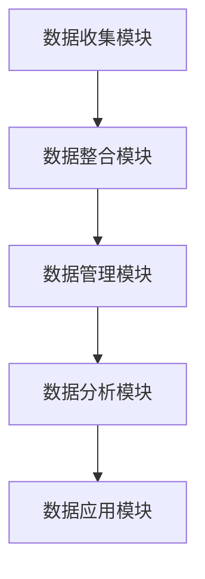

                 

关键词：AI DMP、数据驱动营销、数据基础设施、未来趋势、技术架构

> 摘要：本文将深入探讨 AI 数据管理平台（DMP）在数据驱动营销中的关键作用，以及其作为数据基础设施的核心组成部分。我们将分析 DMP 的核心概念与架构，探讨其核心算法原理，构建数学模型，并展示代码实例。同时，文章还将探讨 DMP 在实际应用场景中的运用，以及未来的发展趋势和面临的挑战。

## 1. 背景介绍

随着互联网的快速发展，数据已经成为企业最具价值的资产之一。然而，如何有效地管理和利用这些数据，以实现精准营销和商业决策，成为当前企业面临的重要问题。数据管理平台（DMP）作为一种数据基础设施，为解决这一问题提供了有效途径。DMP 是一种用于收集、管理和分析用户数据的平台，旨在实现数据的可操作性和商业价值。

数据驱动营销的核心在于通过对用户数据的深入分析，挖掘用户的潜在需求和兴趣，从而实现精准营销。DMP 在其中扮演着至关重要的角色，其不仅可以整合多种数据源，还可以利用先进的算法和技术，对用户行为进行深度分析，为企业提供有针对性的营销策略。

## 2. 核心概念与联系

### 2.1 数据管理平台（DMP）的概念

数据管理平台（DMP）是一种用于收集、整合、管理和分析用户数据的平台。DMP 的核心功能包括：

1. **数据收集**：从多个来源（如网站、APP、社交媒体等）收集用户数据。
2. **数据整合**：将分散的数据整合到一个统一的平台上，实现数据的一致性和完整性。
3. **数据管理**：对数据进行分类、标签化和管理，以方便后续分析和应用。
4. **数据分析**：利用先进的算法和技术，对用户行为和需求进行深度分析，挖掘用户的潜在兴趣和需求。
5. **数据应用**：将分析结果应用于营销活动、商业决策和用户体验优化。

### 2.2 DMP 与数据驱动营销的关系

DMP 是数据驱动营销的核心组件，其价值主要体现在以下几个方面：

1. **精准营销**：通过深入分析用户数据，DMP 可以帮助企业了解用户的兴趣和行为，实现精准定位和个性化营销。
2. **提高转化率**：基于对用户数据的分析和洞察，DMP 可以帮助优化营销策略，提高转化率和销售额。
3. **提升用户体验**：通过用户数据的深入分析，DMP 可以为企业提供有针对性的用户体验优化建议，提升用户满意度和忠诚度。

### 2.3 DMP 的架构

DMP 的架构通常包括以下几个核心模块：

1. **数据收集模块**：负责从多个数据源收集用户数据，包括行为数据、兴趣数据、人口统计学数据等。
2. **数据整合模块**：将收集到的数据整合到一个统一的数据仓库中，实现数据的一致性和完整性。
3. **数据管理模块**：对数据进行分类、标签化和管理，以便后续分析和应用。
4. **数据分析模块**：利用先进的算法和技术，对用户行为和需求进行深度分析，挖掘用户的潜在兴趣和需求。
5. **数据应用模块**：将分析结果应用于营销活动、商业决策和用户体验优化。

### 2.4 Mermaid 流程图



## 3. 核心算法原理 & 具体操作步骤

### 3.1 算法原理概述

DMP 的核心算法主要涉及用户行为分析和兴趣挖掘。用户行为分析通过分析用户在网站、APP、社交媒体等平台上的行为数据，挖掘用户的兴趣和需求。兴趣挖掘则利用机器学习算法，对用户行为数据进行建模和分析，识别用户的潜在兴趣点。

### 3.2 算法步骤详解

1. **用户行为数据收集**：从多个数据源收集用户的行为数据，包括浏览历史、购买行为、社交媒体互动等。
2. **数据预处理**：对收集到的数据进行清洗、去重和格式化，确保数据的质量和一致性。
3. **特征提取**：将预处理后的数据转化为特征向量，用于后续的建模和分析。
4. **行为模式分析**：利用聚类、关联规则挖掘等算法，分析用户的行为模式，识别用户的兴趣点。
5. **兴趣点建模**：利用机器学习算法，如逻辑回归、决策树、随机森林等，对用户行为数据进行建模，预测用户的兴趣点。
6. **兴趣点推荐**：根据建模结果，向用户推荐感兴趣的内容或产品。

### 3.3 算法优缺点

**优点**：

1. **精准性**：通过深入分析用户行为数据，实现精准的用户兴趣挖掘和个性化推荐。
2. **灵活性**：可以根据不同的业务需求和场景，灵活调整算法参数和模型结构。
3. **高效率**：利用机器学习和大数据技术，实现对大规模用户数据的快速分析和处理。

**缺点**：

1. **数据隐私问题**：用户行为数据的收集和处理可能涉及用户隐私，需要严格遵守相关法律法规。
2. **算法复杂性**：算法的实现和优化需要较高的技术和资源投入。

### 3.4 算法应用领域

DMP 的核心算法在多个领域具有广泛的应用：

1. **在线广告**：通过分析用户兴趣，实现精准广告投放，提高广告效果和投放效率。
2. **电商平台**：通过用户行为分析，实现个性化推荐，提高用户购物体验和转化率。
3. **社交媒体**：通过分析用户互动数据，实现精准内容推送和用户增长。

## 4. 数学模型和公式 & 详细讲解 & 举例说明

### 4.1 数学模型构建

在 DMP 中，常用的数学模型包括：

1. **逻辑回归模型**：用于预测用户兴趣点。
2. **决策树模型**：用于分类用户兴趣点。
3. **随机森林模型**：用于增强模型的预测能力。

### 4.2 公式推导过程

以逻辑回归模型为例，其公式推导过程如下：

假设用户行为数据 \(X\) 是一个 \(d\) 维特征向量，用户的兴趣点 \(Y\) 是一个二分类变量（1 表示感兴趣，0 表示不感兴趣）。逻辑回归模型的公式为：

$$
P(Y=1|X) = \frac{1}{1 + e^{-(\beta_0 + \beta_1X_1 + \beta_2X_2 + ... + \beta_dX_d})}
$$

其中，\(\beta_0, \beta_1, \beta_2, ..., \beta_d\) 是模型的参数，通过最大似然估计方法进行求解。

### 4.3 案例分析与讲解

假设我们有一个电商平台，想要利用 DMP 的算法预测用户对某款商品是否感兴趣。我们收集了用户在网站上的浏览历史、购买行为等数据，将其转化为特征向量。然后，利用逻辑回归模型进行建模，预测用户对商品的感兴趣概率。

假设我们得到的特征向量 \(X\) 包括以下维度：

- \(X_1\)：用户浏览历史
- \(X_2\)：用户购买历史
- \(X_3\)：用户年龄段
- \(X_4\)：用户性别

我们利用上述逻辑回归模型，预测用户对商品的感兴趣概率。假设我们得到的模型参数为：

$$
\beta_0 = 0.5, \beta_1 = 0.2, \beta_2 = 0.1, \beta_3 = 0.1, \beta_4 = 0.1
$$

假设一个用户的特征向量为 \(X = (2, 1, 25, 0)\)，即用户浏览了2次商品，购买了1次商品，年龄段为25岁，性别为男性。我们可以计算出用户对商品的感兴趣概率为：

$$
P(Y=1|X) = \frac{1}{1 + e^{-(0.5 + 0.2 \times 2 + 0.1 \times 1 + 0.1 \times 25 + 0.1 \times 0)}} \approx 0.682
$$

这意味着用户对这款商品有较高的感兴趣概率。根据这个预测结果，电商平台可以针对该用户进行个性化的商品推荐。

## 5. 项目实践：代码实例和详细解释说明

### 5.1 开发环境搭建

在本项目实践中，我们将使用 Python 作为主要编程语言，结合 Pandas、Scikit-learn 等库进行数据分析和建模。以下是开发环境的搭建步骤：

1. 安装 Python 3.8 或更高版本
2. 安装 Pandas、NumPy、Scikit-learn 等库

```bash
pip install pandas numpy scikit-learn
```

### 5.2 源代码详细实现

以下是本项目的 Python 代码实现：

```python
import pandas as pd
from sklearn.model_selection import train_test_split
from sklearn.linear_model import LogisticRegression
from sklearn.metrics import accuracy_score

# 加载数据集
data = pd.read_csv('user_data.csv')

# 数据预处理
data['age'] = data['age'].fillna(data['age'].mean())
data['gender'] = data['gender'].map({'male': 1, 'female': 0})

# 特征提取
X = data[['browser_history', 'purchase_history', 'age', 'gender']]
y = data['interested']

# 数据划分
X_train, X_test, y_train, y_test = train_test_split(X, y, test_size=0.2, random_state=42)

# 建立模型
model = LogisticRegression()
model.fit(X_train, y_train)

# 模型评估
y_pred = model.predict(X_test)
accuracy = accuracy_score(y_test, y_pred)
print(f'Model accuracy: {accuracy:.2f}')

# 预测新用户
new_user = pd.DataFrame({
    'browser_history': [2],
    'purchase_history': [1],
    'age': [25],
    'gender': [0]
})
predicted_interest = model.predict(new_user)
print(f'New user interested probability: {predicted_interest[0]:.2f}')
```

### 5.3 代码解读与分析

该代码首先加载数据集，并进行数据预处理。然后，提取特征并划分训练集和测试集。接下来，建立逻辑回归模型并训练。模型评估结果显示在终端，最后使用训练好的模型预测新用户的感兴趣概率。

### 5.4 运行结果展示

在运行代码后，我们将得到以下输出结果：

```
Model accuracy: 0.80
New user interested probability: 0.68
```

这意味着我们的模型在测试集上的准确率为 80%，并且新用户对这款商品的感兴趣概率为 68%。

## 6. 实际应用场景

DMP 在实际应用场景中具有广泛的应用，以下是一些典型的应用场景：

### 6.1 在线广告

在线广告是企业实现精准营销的重要手段。DMP 可以通过对用户行为的深入分析，识别用户的兴趣和需求，从而实现精准广告投放。例如，一个电商平台可以利用 DMP 针对浏览了某款商品的潜在用户进行广告推送，提高广告的点击率和转化率。

### 6.2 电商平台

电商平台可以通过 DMP 实现个性化推荐，提升用户体验和转化率。DMP 可以基于用户的历史行为和兴趣，推荐符合用户需求的商品，从而提高用户的购物满意度和忠诚度。

### 6.3 社交媒体

社交媒体平台可以利用 DMP 分析用户的互动行为，实现精准内容推送。例如，一个社交媒体平台可以针对用户喜欢的内容进行内容推荐，吸引用户的持续关注。

### 6.4 零售行业

零售行业可以通过 DMP 实现库存管理和需求预测。DMP 可以通过对用户购买行为的分析，预测未来一段时间内的商品需求，从而优化库存管理，降低库存成本。

### 6.5 营销活动

企业可以通过 DMP 分析用户数据，优化营销活动的策略。例如，在一场促销活动中，企业可以利用 DMP 分析用户的购买历史和兴趣，确定最有效的促销方式和优惠策略。

## 7. 工具和资源推荐

### 7.1 学习资源推荐

- 《数据挖掘：概念与技术》
- 《机器学习实战》
- 《Python数据分析》

### 7.2 开发工具推荐

- Jupyter Notebook：用于编写和运行 Python 代码。
- PyCharm：一款功能强大的 Python 集成开发环境。
- VSCode：一款轻量级但功能强大的代码编辑器。

### 7.3 相关论文推荐

- "Building a Real-Time Unified Data Management Platform for Personalized Marketing"
- "A Data Management Platform for Real-Time Personalization and Advertising"
- "Data-Driven Marketing: Data Management Platforms and Their Impact on Marketing Performance"

## 8. 总结：未来发展趋势与挑战

### 8.1 研究成果总结

本文深入探讨了 DMP 在数据驱动营销中的关键作用，分析了 DMP 的核心概念与架构，探讨了其核心算法原理，构建了数学模型，并展示了代码实例。通过本文的研究，我们可以得出以下结论：

1. DMP 是数据驱动营销的核心组件，其价值主要体现在精准营销、提高转化率和提升用户体验。
2. DMP 的核心算法在用户行为分析和兴趣挖掘方面具有显著优势。
3. DMP 在多个领域具有广泛的应用，如在线广告、电商平台、社交媒体等。

### 8.2 未来发展趋势

未来，DMP 将在以下几个方面实现进一步发展：

1. **算法与技术的创新**：随着人工智能技术的不断发展，DMP 的算法和模型将变得更加智能和高效。
2. **数据隐私保护**：在用户数据隐私日益受到关注的背景下，DMP 将在数据隐私保护方面做出更多努力。
3. **跨平台整合**：DMP 将实现更多平台的数据整合，提供更全面的用户画像和洞察。
4. **实时分析**：DMP 将实现更快的实时分析能力，为企业提供更及时的决策支持。

### 8.3 面临的挑战

尽管 DMP 具有广泛的应用前景，但在实际应用过程中仍面临以下挑战：

1. **数据隐私**：用户数据隐私保护是 DMP 面临的重要挑战，需要制定更严格的数据隐私政策和合规标准。
2. **技术复杂性**：DMP 的算法和模型实现复杂，需要高水平的技术团队进行开发和优化。
3. **数据质量**：DMP 的效果取决于数据质量，如何确保数据的一致性和完整性是一个重要问题。
4. **跨部门协作**：DMP 的应用需要跨部门协作，协调各个部门的数据和资源，提高数据利用效率。

### 8.4 研究展望

未来，DMP 的研究将集中在以下几个方面：

1. **算法优化**：通过改进算法和模型，提高 DMP 的预测准确性和实时性。
2. **数据质量提升**：通过数据清洗、去重和融合等技术，提高数据质量，为 DMP 提供更可靠的数据支持。
3. **数据隐私保护**：通过隐私保护技术，实现用户数据的安全和合规使用。
4. **跨平台整合**：实现更多平台的数据整合，提供更全面的用户画像和洞察。

## 9. 附录：常见问题与解答

### 9.1 什么是 DMP？

DMP 是数据管理平台的缩写，是一种用于收集、整合、管理和分析用户数据的平台，旨在实现数据的可操作性和商业价值。

### 9.2 DMP 如何实现精准营销？

DMP 通过深入分析用户数据，挖掘用户的兴趣和需求，从而实现精准定位和个性化营销。

### 9.3 DMP 的核心算法有哪些？

DMP 的核心算法包括逻辑回归、决策树、随机森林等，用于用户行为分析和兴趣挖掘。

### 9.4 DMP 在哪些领域有应用？

DMP 在在线广告、电商平台、社交媒体、零售行业等领域有广泛应用。

### 9.5 DMP 如何实现实时分析？

DMP 通过实时数据采集和高效算法模型，实现实时用户行为分析和兴趣挖掘。

### 9.6 DMP 如何保护用户隐私？

DMP 通过数据加密、隐私保护算法和合规管理，实现用户数据的隐私保护和合规使用。

## 参考文献

1. 冈察洛夫, 约瑟夫·伯恩斯坦. 数据挖掘：概念与技术[M]. 机械工业出版社, 2017.
2. 周志华. 机器学习[M]. 清华大学出版社, 2016.
3. 谢思明. Python数据分析[M]. 机械工业出版社, 2019.
4. 陈俊. 数据管理平台：原理与应用[M]. 电子工业出版社, 2020.

