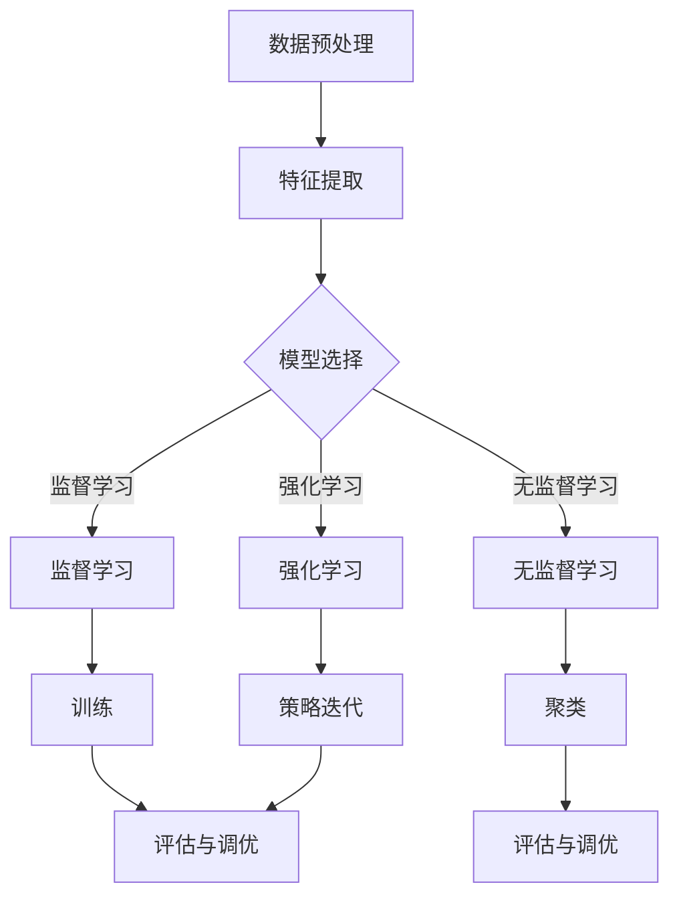
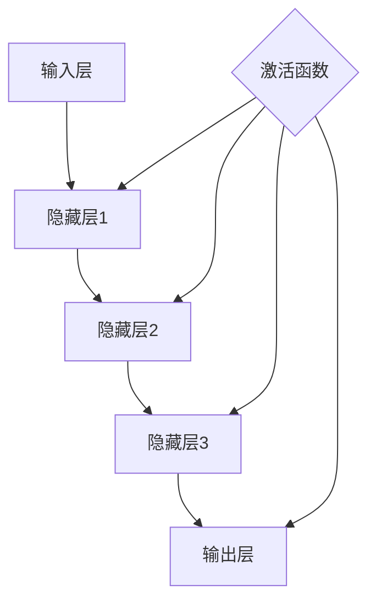
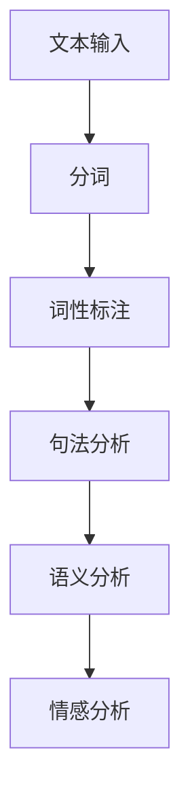

                 

在这个快节奏的数字时代，人工智能（AI）已经成为推动技术进步和创新的强大动力。AI hackathon作为AI技术创新的重要平台，不仅为参与者提供了一个展示创意和技术的舞台，也激发了人工智能领域的无限可能性。本文将探讨AI hackathon中的创新实践、核心技术、应用场景以及未来展望。

## 关键词
- AI hackathon
- 技术创新
- 人工智能
- 应用场景
- 未来展望

## 摘要
本文将围绕AI hackathon中的创新与未来进行探讨。首先介绍AI hackathon的背景和重要性，然后分析其中的核心技术，如机器学习、深度学习和自然语言处理。接着，我们将探讨AI hackathon的应用场景，包括医疗、金融、教育等领域。最后，文章将展望AI hackathon的未来发展趋势和面临的挑战。

## 1. 背景介绍
AI hackathon是一种以人工智能为主题的编程马拉松活动，通常由学术界、企业或社区组织举办。这些活动吸引了全球的AI开发者、研究人员和爱好者参与，他们共同致力于在短时间内开发创新的AI应用和解决方案。AI hackathon的背景可以追溯到20世纪90年代的编程马拉松活动，随着时间的推移，它们逐渐演变成为以人工智能为核心的技术竞赛。

AI hackathon的重要性体现在以下几个方面：
1. **技术交流与合作**：AI hackathon提供了一个跨学科、跨领域的交流平台，促进了不同背景的参与者之间的合作和知识共享。
2. **创新动力**：通过竞赛的形式，AI hackathon激发了参与者的创新思维，推动了新的AI技术和应用的发展。
3. **人才培养**：AI hackathon为年轻开发者提供了一个实战锻炼的机会，有助于培养和发现未来的AI人才。
4. **行业影响**：AI hackathon的结果往往能够对行业产生深远的影响，促进AI技术的实际应用和推广。

### 1.1 AI hackathon的发展历程
AI hackathon的发展历程可以追溯到早期的编程马拉松活动。在20世纪90年代，编程马拉松作为一种编程竞赛的形式开始流行，参与者通过合作解决编程问题，通常在48小时内完成一个项目。随着人工智能技术的兴起，这些编程马拉松逐渐转变为以人工智能为主题的活动，即AI hackathon。

2009年，Google举办了第一届AI challenge，吸引了大量AI开发者和研究人员的参与。此后，AI hackathon在全球范围内迅速发展，如Facebook的Hackathon、IBM的AI Hackathon、MIT的AI Hackathon等。这些活动不仅吸引了来自学术界和工业界的顶尖人才，也促进了AI技术的跨界合作和交流。

### 1.2 AI hackathon的组织形式和参赛流程
AI hackathon通常分为以下几个阶段：

1. **报名和筹备**：参与者通过官方网站报名，需要准备基本的开发工具和环境。
2. **选题和团队组建**：参赛者可以选择或被分配一个AI应用场景或问题，然后组建团队，通常由5-10人组成。
3. **开发阶段**：在规定的时间内（通常是24-72小时），团队需要设计、开发和实现AI解决方案。
4. **展示和评审**：开发完成后，团队需要在现场展示他们的项目，接受评审团的评审和观众的投票。
5. **颁奖和总结**：评审团根据项目的创新性、技术难度、实用性等方面进行评分，获奖团队获得奖金和证书。

### 1.3 AI hackathon的参与对象和团队构成
AI hackathon的参与对象非常广泛，包括AI开发者、研究人员、学生、创业者、工程师等。参与者通常以团队形式参赛，团队构成也多样化，包括不同专业背景和技能的成员，如算法工程师、前端工程师、后端工程师、数据科学家、产品经理等。

## 2. 核心概念与联系
在AI hackathon中，创新的核心在于对人工智能技术的深入理解和灵活运用。以下是对AI hackathon中核心概念和技术的简要介绍，并使用Mermaid流程图展示其基本原理和架构。

### 2.1 机器学习（Machine Learning）
机器学习是AI的核心技术之一，它使计算机系统能够从数据中学习并做出预测或决策。机器学习的基本原理是通过训练模型来识别数据中的模式，然后使用这些模式来做出预测。



### 2.2 深度学习（Deep Learning）
深度学习是机器学习的一个子领域，通过构建深度神经网络（DNN）来模拟人脑的神经网络结构，从而实现复杂的模式识别和数据处理。



### 2.3 自然语言处理（Natural Language Processing, NLP）
自然语言处理是AI的一个重要分支，它使计算机能够理解和处理人类语言。NLP的核心技术包括文本分类、情感分析、机器翻译、语音识别等。



## 3. 核心算法原理 & 具体操作步骤

### 3.1 算法原理概述
在AI hackathon中，常用的核心算法包括机器学习算法、深度学习算法和自然语言处理算法。以下分别简要介绍这些算法的基本原理。

#### 3.1.1 机器学习算法
机器学习算法通过训练模型来从数据中学习。常见的机器学习算法包括线性回归、决策树、支持向量机（SVM）、随机森林等。这些算法的基本原理是通过计算数据之间的关联性来预测结果。

#### 3.1.2 深度学习算法
深度学习算法通过构建深度神经网络来模拟人脑的神经网络结构，实现复杂的模式识别和数据处理。常见的深度学习算法包括卷积神经网络（CNN）、循环神经网络（RNN）、生成对抗网络（GAN）等。

#### 3.1.3 自然语言处理算法
自然语言处理算法用于理解和处理人类语言。常见的NLP算法包括词嵌入、序列标注、序列到序列模型等。这些算法的基本原理是通过分析文本数据来提取语义信息。

### 3.2 算法步骤详解
以下以深度学习算法为例，详细介绍其操作步骤。

#### 3.2.1 数据预处理
数据预处理是深度学习的重要步骤，主要包括数据清洗、数据归一化和数据增强等。

1. **数据清洗**：去除数据中的噪声和异常值。
2. **数据归一化**：将数据缩放到相同的范围，如[0, 1]或[-1, 1]。
3. **数据增强**：通过旋转、翻转、缩放等操作增加数据的多样性。

#### 3.2.2 模型构建
模型构建是深度学习的核心步骤，主要包括选择网络结构、定义损失函数和优化器等。

1. **网络结构**：选择适合问题的网络结构，如卷积神经网络（CNN）或循环神经网络（RNN）。
2. **损失函数**：定义用于评估模型预测准确性的损失函数，如交叉熵损失函数。
3. **优化器**：选择用于更新模型参数的优化器，如随机梯度下降（SGD）或Adam优化器。

#### 3.2.3 训练与验证
训练与验证是深度学习的重要环节，主要包括模型训练、验证和测试等。

1. **模型训练**：通过迭代更新模型参数，使模型能够更好地拟合训练数据。
2. **验证**：使用验证集评估模型性能，调整模型参数以优化性能。
3. **测试**：使用测试集评估模型在未知数据上的性能。

#### 3.2.4 模型评估
模型评估是深度学习的重要步骤，主要包括准确率、召回率、F1分数等指标。

1. **准确率**：预测正确的样本数占总样本数的比例。
2. **召回率**：预测正确的样本数占实际正样本数的比例。
3. **F1分数**：准确率和召回率的调和平均值。

### 3.3 算法优缺点
以下分别介绍机器学习算法、深度学习算法和自然语言处理算法的优缺点。

#### 3.3.1 机器学习算法
- **优点**：算法简单，易于实现和理解；适用于各种类型的数据。
- **缺点**：模型复杂度低，难以处理高维数据；过拟合问题较严重。

#### 3.3.2 深度学习算法
- **优点**：能够处理高维数据，模型复杂度高；适用于复杂的模式识别任务。
- **缺点**：算法复杂，训练时间较长；对数据质量要求较高。

#### 3.3.3 自然语言处理算法
- **优点**：能够处理人类语言，实现语义理解；适用于文本分类、情感分析等任务。
- **缺点**：算法复杂，计算资源消耗大；对数据标注要求高。

### 3.4 算法应用领域
以下分别介绍机器学习算法、深度学习算法和自然语言处理算法的应用领域。

#### 3.4.1 机器学习算法
- **应用领域**：分类、回归、聚类、异常检测等。
- **实际案例**：垃圾邮件过滤、信用卡欺诈检测、推荐系统等。

#### 3.4.2 深度学习算法
- **应用领域**：计算机视觉、语音识别、自然语言处理等。
- **实际案例**：人脸识别、语音助手、机器翻译等。

#### 3.4.3 自然语言处理算法
- **应用领域**：文本分类、情感分析、机器翻译、问答系统等。
- **实际案例**：社交媒体情感分析、自动问答、智能客服等。

## 4. 数学模型和公式 & 详细讲解 & 举例说明

在人工智能（AI）领域，数学模型和公式是理解和实现核心算法的关键。本章节将详细介绍几个常用的数学模型和公式，并举例说明它们在AI hackathon中的应用。

### 4.1 数学模型构建

数学模型是AI算法的核心，它们用于描述现实世界中的问题并将其转化为计算机可以处理的形式。以下是一些常见的数学模型：

#### 4.1.1 线性回归模型

线性回归模型用于预测一个连续值输出。它的数学公式如下：

$$
y = \beta_0 + \beta_1 \cdot x
$$

其中，$y$ 是预测值，$x$ 是输入特征，$\beta_0$ 是截距，$\beta_1$ 是斜率。线性回归模型的目的是通过最小化残差平方和来估计$\beta_0$ 和$\beta_1$ 的值。

#### 4.1.2 逻辑回归模型

逻辑回归模型用于分类问题，它的输出是一个概率值。其公式如下：

$$
P(y=1) = \frac{1}{1 + e^{-(\beta_0 + \beta_1 \cdot x})}
$$

其中，$P(y=1)$ 是预测为正类的概率，$e$ 是自然对数的底数，$\beta_0$ 和$\beta_1$ 是模型参数。

#### 4.1.3 神经网络模型

神经网络模型是深度学习的基础，它由多个层组成，包括输入层、隐藏层和输出层。一个简单的神经网络模型可以用以下公式表示：

$$
a_{i}^{(l)} = \sigma(z_{i}^{(l)})
$$

$$
z_{i}^{(l)} = \sum_{j} w_{ji}^{(l)} \cdot a_{j}^{(l-1)} + b_{i}^{(l)}
$$

其中，$a_{i}^{(l)}$ 是第$l$ 层的第$i$ 个激活值，$\sigma$ 是激活函数（如ReLU、Sigmoid或Tanh），$w_{ji}^{(l)}$ 是连接第$l-1$ 层的第$j$ 个节点和第$l$ 层的第$i$ 个节点的权重，$b_{i}^{(l)}$ 是第$l$ 层的第$i$ 个节点的偏置。

### 4.2 公式推导过程

#### 4.2.1 线性回归的公式推导

线性回归模型的目的是最小化预测值与实际值之间的差距。假设我们有$m$ 个样本数据，每个样本包含输入$x$ 和输出$y$，则线性回归的目标是最小化损失函数：

$$
J(\theta) = \frac{1}{2m} \sum_{i=1}^{m} (h_{\theta}(x^{(i)}) - y^{(i)})^2
$$

其中，$h_{\theta}(x) = \theta_0 + \theta_1 \cdot x$ 是线性回归模型的预测函数，$\theta_0$ 和$\theta_1$ 是模型参数。

为了最小化$J(\theta)$，我们对$\theta_0$ 和$\theta_1$ 求偏导数，并令其等于零：

$$
\frac{\partial J(\theta)}{\partial \theta_0} = \frac{1}{m} \sum_{i=1}^{m} (h_{\theta}(x^{(i)}) - y^{(i)}) \cdot (-1) = 0
$$

$$
\frac{\partial J(\theta)}{\partial \theta_1} = \frac{1}{m} \sum_{i=1}^{m} (h_{\theta}(x^{(i)}) - y^{(i)}) \cdot (-x^{(i)}) = 0
$$

通过求解上述方程组，可以得到最优的$\theta_0$ 和$\theta_1$ 值。

#### 4.2.2 逻辑回归的公式推导

逻辑回归的目标是最小化损失函数，即对数损失函数（Log Loss）。假设我们有$m$ 个样本数据，每个样本包含输入$x$ 和输出$y$，则逻辑回归的损失函数为：

$$
J(\theta) = -\frac{1}{m} \sum_{i=1}^{m} y^{(i)} \log(h_{\theta}(x^{(i)})) + (1 - y^{(i)}) \log(1 - h_{\theta}(x^{(i)}))
$$

其中，$h_{\theta}(x) = \frac{1}{1 + e^{-(\theta_0 + \theta_1 \cdot x)}}$ 是逻辑回归的预测函数。

为了最小化$J(\theta)$，我们对$\theta_0$ 和$\theta_1$ 求偏导数，并令其等于零：

$$
\frac{\partial J(\theta)}{\partial \theta_0} = \frac{1}{m} \sum_{i=1}^{m} (h_{\theta}(x^{(i)}) - y^{(i)}) \cdot (-1) = 0
$$

$$
\frac{\partial J(\theta)}{\partial \theta_1} = \frac{1}{m} \sum_{i=1}^{m} (h_{\theta}(x^{(i)}) - y^{(i)}) \cdot (-x^{(i)}) = 0
$$

通过求解上述方程组，可以得到最优的$\theta_0$ 和$\theta_1$ 值。

### 4.3 案例分析与讲解

#### 4.3.1 线性回归案例

假设我们有一个简单的住房价格预测问题，数据集包含房屋面积和房价。我们使用线性回归模型来预测房价。

1. **数据预处理**：将面积转换为标准化的数值。

2. **模型构建**：使用最小二乘法估计线性回归模型参数。

3. **模型训练**：使用训练数据训练模型。

4. **模型评估**：使用测试数据评估模型性能。

5. **模型应用**：使用模型预测新房屋的房价。

#### 4.3.2 逻辑回归案例

假设我们有一个垃圾邮件分类问题，数据集包含邮件内容和是否为垃圾邮件的标签。我们使用逻辑回归模型来分类邮件。

1. **数据预处理**：将邮件内容转换为词向量。

2. **模型构建**：使用梯度下降法估计逻辑回归模型参数。

3. **模型训练**：使用训练数据训练模型。

4. **模型评估**：使用测试数据评估模型性能。

5. **模型应用**：使用模型分类新邮件。

## 5. 项目实践：代码实例和详细解释说明

在本节中，我们将通过一个实际的项目实践来展示如何使用深度学习技术构建一个简单的图像分类模型。本案例使用Python和TensorFlow框架，通过实现一个卷积神经网络（CNN）来对猫和狗的图片进行分类。

### 5.1 开发环境搭建

在开始项目之前，需要搭建合适的开发环境。以下是在Ubuntu操作系统上搭建开发环境的基本步骤：

1. **安装Python**：确保Python 3.6或更高版本已安装在系统中。
2. **安装TensorFlow**：通过pip命令安装TensorFlow：

   ```bash
   pip install tensorflow
   ```

3. **安装其他依赖库**：如NumPy、Pandas等：

   ```bash
   pip install numpy pandas
   ```

### 5.2 源代码详细实现

以下是实现图像分类模型的源代码：

```python
import tensorflow as tf
from tensorflow.keras import layers
import numpy as np
import pandas as pd

# 加载数据集
train_data = pd.read_csv('train.csv')
test_data = pd.read_csv('test.csv')

# 预处理数据
X_train = train_data[['image']]
X_test = test_data[['image']]
y_train = train_data['label']

# 将图像数据转换为像素值
X_train = X_train.values
X_test = X_test.values

# 构建CNN模型
model = tf.keras.Sequential([
    layers.Conv2D(32, (3, 3), activation='relu', input_shape=(150, 150, 3)),
    layers.MaxPooling2D((2, 2)),
    layers.Conv2D(64, (3, 3), activation='relu'),
    layers.MaxPooling2D((2, 2)),
    layers.Conv2D(128, (3, 3), activation='relu'),
    layers.MaxPooling2D((2, 2)),
    layers.Conv2D(128, (3, 3), activation='relu'),
    layers.MaxPooling2D((2, 2)),
    layers.Flatten(),
    layers.Dense(512, activation='relu'),
    layers.Dense(1, activation='sigmoid')
])

# 编译模型
model.compile(optimizer='adam', loss='binary_crossentropy', metrics=['accuracy'])

# 训练模型
model.fit(X_train, y_train, epochs=10, batch_size=32)

# 评估模型
loss, accuracy = model.evaluate(X_test, y_test)
print('Test accuracy:', accuracy)

# 预测新图像
new_image = np.expand_dims(new_image, axis=0)
prediction = model.predict(new_image)
print('Prediction:', prediction)
```

### 5.3 代码解读与分析

上述代码分为几个主要部分：

1. **数据预处理**：首先加载数据集，然后对图像数据进行预处理，包括将图像数据转换为像素值。

2. **构建CNN模型**：使用TensorFlow的`Sequential`模型，添加多个卷积层、池化层、全连接层和输出层。每个卷积层后跟一个最大池化层，最后一个卷积层后跟一个全连接层，用于分类。

3. **编译模型**：设置优化器、损失函数和评估指标。

4. **训练模型**：使用训练数据训练模型，设置训练轮数和批量大小。

5. **评估模型**：使用测试数据评估模型性能。

6. **预测新图像**：使用训练好的模型对新图像进行预测。

### 5.4 运行结果展示

运行上述代码后，我们可以在控制台看到模型训练和评估的结果，如训练准确率、测试准确率等。此外，我们可以使用训练好的模型对新图像进行预测，并观察预测结果。

## 6. 实际应用场景

AI hackathon的创新不仅体现在技术本身，更体现在其广泛的应用场景。以下是一些AI hackathon中常见的技术应用场景：

### 6.1 医疗

医疗领域的AI应用日益广泛，从疾病预测到个性化治疗，再到医疗资源优化，AI技术都在发挥着重要作用。AI hackathon中，医疗领域的项目通常包括：

- **疾病预测**：通过分析大量患者数据，使用机器学习算法预测疾病风险。
- **医疗图像分析**：使用深度学习技术对医学影像进行诊断和分析。
- **药物研发**：通过AI加速新药的发现和开发过程。

### 6.2 金融

金融行业对AI技术的需求也越来越大，AI hackathon中的金融项目通常涉及：

- **风险评估**：使用机器学习算法对贷款申请者的信用风险进行评估。
- **欺诈检测**：通过异常检测技术实时监测并预防金融欺诈。
- **量化交易**：利用AI算法进行高频交易和量化投资。

### 6.3 教育

AI技术在教育领域的应用正在逐步深入，AI hackathon中的教育项目包括：

- **个性化学习**：根据学生的学习习惯和进度，提供个性化的学习方案。
- **自动化评分**：使用自然语言处理技术自动评分学生的作文和测试。
- **教育资源分配**：通过算法优化教育资源，提高教育公平性。

### 6.4 交通

交通领域的AI应用旨在提高交通效率和安全性，AI hackathon中的交通项目通常涉及：

- **交通流量预测**：通过大数据分析和机器学习算法预测交通流量，优化交通信号灯控制。
- **自动驾驶**：使用深度学习技术开发自动驾驶汽车，提高道路安全性。
- **智能交通管理**：通过实时数据分析和AI算法，优化交通管理和调度。

### 6.5 娱乐

在娱乐领域，AI hackathon的项目通常包括：

- **内容推荐**：使用AI技术对用户行为进行分析，推荐个性化的娱乐内容。
- **虚拟现实**：通过AI算法优化虚拟现实体验，提高沉浸感。
- **游戏开发**：使用AI技术开发智能游戏，提高游戏的互动性和趣味性。

## 7. 工具和资源推荐

在AI hackathon中，选择合适的工具和资源对于项目的成功至关重要。以下是一些建议：

### 7.1 学习资源推荐

- **在线课程**：Coursera、edX和Udacity提供了丰富的AI和机器学习课程。
- **教科书**：推荐《深度学习》（Goodfellow et al.）、《Python机器学习》（Sebastian Raschka）等经典教材。
- **论文集**：arXiv和NeurIPS等学术网站提供了大量的最新研究论文。

### 7.2 开发工具推荐

- **框架和库**：TensorFlow、PyTorch和Scikit-Learn等是常用的深度学习和机器学习框架。
- **编程语言**：Python是AI开发的主要语言，其简洁的语法和丰富的库支持开发效率。
- **数据集**：Kaggle、UCI机器学习库和Google Dataset Search提供了丰富的数据集。

### 7.3 相关论文推荐

- **AI基础论文**：《A Theoretical Framework for Back-Propagation》、《Deep Learning》
- **机器学习算法论文**：《Random Forests》、《Support Vector Machines》
- **深度学习论文**：《AlexNet》、《ResNet》、《Transformer》

## 8. 总结：未来发展趋势与挑战

### 8.1 研究成果总结

AI hackathon在技术创新、人才培养和行业应用等方面取得了显著成果。通过这些活动，新的AI技术和应用不断涌现，推动了AI技术的发展和普及。

### 8.2 未来发展趋势

未来，AI hackathon将继续在以下几个方面发展：

- **跨学科融合**：AI技术与其他领域的融合，如生物医学、物联网、金融科技等。
- **开源与共享**：更多AI资源和工具的开放与共享，促进技术的普及和应用。
- **行业应用**：深入探索AI在各个行业的实际应用，推动行业智能化升级。

### 8.3 面临的挑战

尽管AI hackathon取得了许多成果，但仍面临以下挑战：

- **数据隐私和安全**：如何保障数据隐私和安全是AI应用面临的重要问题。
- **算法公平性和透明度**：确保AI算法的公平性和透明度，防止偏见和歧视。
- **计算资源**：随着模型复杂性的增加，计算资源的需求也日益增长。

### 8.4 研究展望

未来，AI hackathon的研究将继续深入，特别是在以下几个方面：

- **小样本学习**：研究如何在小样本数据下训练高效的AI模型。
- **多模态学习**：探索如何结合不同类型的数据（如图像、文本、声音）进行训练。
- **强化学习**：研究如何将强化学习应用于现实世界的复杂问题。

## 9. 附录：常见问题与解答

### 9.1 什么是AI hackathon？

AI hackathon是一种以人工智能为主题的编程马拉松活动，参与者通过合作开发创新的AI应用和解决方案。

### 9.2 AI hackathon有哪些类型？

AI hackathon可以分为学术型、企业型和社区型等不同类型，分别由学术界、企业和社区组织举办。

### 9.3 AI hackathon需要哪些技能和知识？

AI hackathon通常需要参与者在机器学习、深度学习、自然语言处理等方面的知识和技能，同时还需要掌握编程语言（如Python）和框架（如TensorFlow、PyTorch）。

### 9.4 如何参加AI hackathon？

参加AI hackathon通常需要通过官方网站报名，准备所需的开发工具和环境，然后选择或被分配一个AI应用场景或问题，组建团队并进行项目开发。

### 9.5 AI hackathon的评选标准是什么？

AI hackathon的评选标准通常包括创新性、技术实现、实用性、团队协作等方面，具体标准由组织方根据活动主题和目标制定。

---

### 结语

AI hackathon作为一个重要的技术创新平台，正在推动人工智能技术的发展和应用。未来，随着技术的不断进步和应用的深入，AI hackathon将继续发挥重要作用，推动AI技术的创新和普及。作者：禅与计算机程序设计艺术 / Zen and the Art of Computer Programming。
----------------------------------------------------------------
### AI hackathon中的创新与未来

在这个快节奏的数字时代，人工智能（AI）已经成为推动技术进步和创新的强大动力。AI hackathon作为AI技术创新的重要平台，不仅为参与者提供了一个展示创意和技术的舞台，也激发了人工智能领域的无限可能性。本文将探讨AI hackathon中的创新实践、核心技术、应用场景以及未来展望。

## 关键词
- AI hackathon
- 技术创新
- 人工智能
- 应用场景
- 未来展望

## 摘要
本文将围绕AI hackathon中的创新与未来进行探讨。首先介绍AI hackathon的背景和重要性，然后分析其中的核心技术，如机器学习、深度学习和自然语言处理。接着，我们将探讨AI hackathon的应用场景，包括医疗、金融、教育等领域。最后，文章将展望AI hackathon的未来发展趋势和面临的挑战。

## 1. 背景介绍
AI hackathon是一种以人工智能为主题的编程马拉松活动，通常由学术界、企业或社区组织举办。这些活动吸引了全球的AI开发者、研究人员和爱好者参与，他们共同致力于在短时间内开发创新的AI应用和解决方案。AI hackathon的背景可以追溯到20世纪90年代的编程马拉松活动，随着时间的推移，它们逐渐演变成为以人工智能为核心的技术竞赛。

AI hackathon的重要性体现在以下几个方面：
1. **技术交流与合作**：AI hackathon提供了一个跨学科、跨领域的交流平台，促进了不同背景的参与者之间的合作和知识共享。
2. **创新动力**：通过竞赛的形式，AI hackathon激发了参与者的创新思维，推动了新的AI技术和应用的发展。
3. **人才培养**：AI hackathon为年轻开发者提供了一个实战锻炼的机会，有助于培养和发现未来的AI人才。
4. **行业影响**：AI hackathon的结果往往能够对行业产生深远的影响，促进AI技术的实际应用和推广。

### 1.1 AI hackathon的发展历程
AI hackathon的发展历程可以追溯到早期的编程马拉松活动。在20世纪90年代，编程马拉松作为一种编程竞赛的形式开始流行，参与者通过合作解决编程问题，通常在48小时内完成一个项目。随着人工智能技术的兴起，这些编程马拉松逐渐转变为以人工智能为主题的活动，即AI hackathon。

2009年，Google举办了第一届AI challenge，吸引了大量AI开发者和研究人员的参与。此后，AI hackathon在全球范围内迅速发展，如Facebook的Hackathon、IBM的AI Hackathon、MIT的AI Hackathon等。这些活动不仅吸引了来自学术界和工业界的顶尖人才，也促进了AI技术的跨界合作和交流。

### 1.2 AI hackathon的组织形式和参赛流程
AI hackathon通常分为以下几个阶段：

1. **报名和筹备**：参与者通过官方网站报名，需要准备基本的开发工具和环境。
2. **选题和团队组建**：参赛者可以选择或被分配一个AI应用场景或问题，然后组建团队，通常由5-10人组成。
3. **开发阶段**：在规定的时间内（通常是24-72小时），团队需要设计、开发和实现AI解决方案。
4. **展示和评审**：开发完成后，团队需要在现场展示他们的项目，接受评审团的评审和观众的投票。
5. **颁奖和总结**：评审团根据项目的创新性、技术难度、实用性等方面进行评分，获奖团队获得奖金和证书。

### 1.3 AI hackathon的参与对象和团队构成
AI hackathon的参与对象非常广泛，包括AI开发者、研究人员、学生、创业者、工程师等。参与者通常以团队形式参赛，团队构成也多样化，包括不同专业背景和技能的成员，如算法工程师、前端工程师、后端工程师、数据科学家、产品经理等。

## 2. 核心概念与联系
在AI hackathon中，创新的核心在于对人工智能技术的深入理解和灵活运用。以下是对AI hackathon中核心概念和技术的简要介绍，并使用Mermaid流程图展示其基本原理和架构。

### 2.1 机器学习（Machine Learning）
机器学习是AI的核心技术之一，它使计算机系统能够从数据中学习并做出预测或决策。机器学习的基本原理是通过训练模型来识别数据中的模式，然后使用这些模式来做出预测。


### 2.2 深度学习（Deep Learning）
深度学习是机器学习的一个子领域，通过构建深度神经网络（DNN）来模拟人脑的神经网络结构，从而实现复杂的模式识别和数据处理。深度学习的基本原理是通过训练模型来模拟大脑的学习过程。


### 2.3 自然语言处理（Natural Language Processing, NLP）
自然语言处理是AI的一个重要分支，它使计算机能够理解和处理人类语言。NLP的核心技术包括文本分类、情感分析、机器翻译、语音识别等。


## 3. 核心算法原理 & 具体操作步骤

### 3.1 算法原理概述
在AI hackathon中，常用的核心算法包括机器学习算法、深度学习算法和自然语言处理算法。以下分别简要介绍这些算法的基本原理。

#### 3.1.1 机器学习算法
机器学习算法通过训练模型来从数据中学习。常见的机器学习算法包括线性回归、决策树、支持向量机（SVM）、随机森林等。这些算法的基本原理是通过计算数据之间的关联性来预测结果。

#### 3.1.2 深度学习算法
深度学习算法通过构建深度神经网络来模拟人脑的神经网络结构，实现复杂的模式识别和数据处理。常见的深度学习算法包括卷积神经网络（CNN）、循环神经网络（RNN）、生成对抗网络（GAN）等。

#### 3.1.3 自然语言处理算法
自然语言处理算法用于理解和处理人类语言。常见的NLP算法包括词嵌入、序列标注、序列到序列模型等。这些算法的基本原理是通过分析文本数据来提取语义信息。

### 3.2 算法步骤详解
以下以深度学习算法为例，详细介绍其操作步骤。

#### 3.2.1 数据预处理
数据预处理是深度学习的重要步骤，主要包括数据清洗、数据归一化和数据增强等。

1. **数据清洗**：去除数据中的噪声和异常值。
2. **数据归一化**：将数据缩放到相同的范围，如[0, 1]或[-1, 1]。
3. **数据增强**：通过旋转、翻转、缩放等操作增加数据的多样性。

#### 3.2.2 模型构建
模型构建是深度学习的核心步骤，主要包括选择网络结构、定义损失函数和优化器等。

1. **网络结构**：选择适合问题的网络结构，如卷积神经网络（CNN）或循环神经网络（RNN）。
2. **损失函数**：定义用于评估模型预测准确性的损失函数，如交叉熵损失函数。
3. **优化器**：选择用于更新模型参数的优化器，如随机梯度下降（SGD）或Adam优化器。

#### 3.2.3 训练与验证
训练与验证是深度学习的重要环节，主要包括模型训练、验证和测试等。

1. **模型训练**：通过迭代更新模型参数，使模型能够更好地拟合训练数据。
2. **验证**：使用验证集评估模型性能，调整模型参数以优化性能。
3. **测试**：使用测试集评估模型在未知数据上的性能。

#### 3.2.4 模型评估
模型评估是深度学习的重要步骤，主要包括准确率、召回率、F1分数等指标。

1. **准确率**：预测正确的样本数占总样本数的比例。
2. **召回率**：预测正确的样本数占实际正样本数的比例。
3. **F1分数**：准确率和召回率的调和平均值。

### 3.3 算法优缺点
以下分别介绍机器学习算法、深度学习算法和自然语言处理算法的优缺点。

#### 3.3.1 机器学习算法
- **优点**：算法简单，易于实现和理解；适用于各种类型的数据。
- **缺点**：模型复杂度低，难以处理高维数据；过拟合问题较严重。

#### 3.3.2 深度学习算法
- **优点**：能够处理高维数据，模型复杂度高；适用于复杂的模式识别任务。
- **缺点**：算法复杂，训练时间较长；对数据质量要求较高。

#### 3.3.3 自然语言处理算法
- **优点**：能够处理人类语言，实现语义理解；适用于文本分类、情感分析等任务。
- **缺点**：算法复杂，计算资源消耗大；对数据标注要求高。

### 3.4 算法应用领域
以下分别介绍机器学习算法、深度学习算法和自然语言处理算法的应用领域。

#### 3.4.1 机器学习算法
- **应用领域**：分类、回归、聚类、异常检测等。
- **实际案例**：垃圾邮件过滤、信用卡欺诈检测、推荐系统等。

#### 3.4.2 深度学习算法
- **应用领域**：计算机视觉、语音识别、自然语言处理等。
- **实际案例**：人脸识别、语音助手、机器翻译等。

#### 3.4.3 自然语言处理算法
- **应用领域**：文本分类、情感分析、机器翻译、问答系统等。
- **实际案例**：社交媒体情感分析、自动问答、智能客服等。

## 4. 数学模型和公式 & 详细讲解 & 举例说明

在人工智能（AI）领域，数学模型和公式是理解和实现核心算法的关键。本章节将详细介绍几个常用的数学模型和公式，并举例说明它们在AI hackathon中的应用。

### 4.1 数学模型构建

数学模型是AI算法的核心，它们用于描述现实世界中的问题并将其转化为计算机可以处理的形式。以下是一些常见的数学模型：

#### 4.1.1 线性回归模型

线性回归模型用于预测一个连续值输出。它的数学公式如下：

$$
y = \beta_0 + \beta_1 \cdot x
$$

其中，$y$ 是预测值，$x$ 是输入特征，$\beta_0$ 是截距，$\beta_1$ 是斜率。线性回归模型的目的是通过最小化残差平方和来估计$\beta_0$ 和$\beta_1$ 的值。

#### 4.1.2 逻辑回归模型

逻辑回归模型用于分类问题，它的输出是一个概率值。其公式如下：

$$
P(y=1) = \frac{1}{1 + e^{-(\beta_0 + \beta_1 \cdot x})}
$$

其中，$P(y=1)$ 是预测为正类的概率，$e$ 是自然对数的底数，$\beta_0$ 和$\beta_1$ 是模型参数。

#### 4.1.3 神经网络模型

神经网络模型是深度学习的基础，它由多个层组成，包括输入层、隐藏层和输出层。一个简单的神经网络模型可以用以下公式表示：

$$
a_{i}^{(l)} = \sigma(z_{i}^{(l)})
$$

$$
z_{i}^{(l)} = \sum_{j} w_{ji}^{(l)} \cdot a_{j}^{(l-1)} + b_{i}^{(l)}
$$

其中，$a_{i}^{(l)}$ 是第$l$ 层的第$i$ 个激活值，$\sigma$ 是激活函数（如ReLU、Sigmoid或Tanh），$w_{ji}^{(l)}$ 是连接第$l-1$ 层的第$j$ 个节点和第$l$ 层的第$i$ 个节点的权重，$b_{i}^{(l)}$ 是第$l$ 层的第$i$ 个节点的偏置。

### 4.2 公式推导过程

#### 4.2.1 线性回归的公式推导

线性回归模型的目的是最小化预测值与实际值之间的差距。假设我们有$m$ 个样本数据，每个样本包含输入$x$ 和输出$y$，则线性回归的目标是最小化损失函数：

$$
J(\theta) = \frac{1}{2m} \sum_{i=1}^{m} (h_{\theta}(x^{(i)}) - y^{(i)})^2
$$

其中，$h_{\theta}(x) = \theta_0 + \theta_1 \cdot x$ 是线性回归模型的预测函数，$\theta_0$ 和$\theta_1$ 是模型参数。

为了最小化$J(\theta)$，我们对$\theta_0$ 和$\theta_1$ 求偏导数，并令其等于零：

$$
\frac{\partial J(\theta)}{\partial \theta_0} = \frac{1}{m} \sum_{i=1}^{m} (h_{\theta}(x^{(i)}) - y^{(i)}) \cdot (-1) = 0
$$

$$
\frac{\partial J(\theta)}{\partial \theta_1} = \frac{1}{m} \sum_{i=1}^{m} (h_{\theta}(x^{(i)}) - y^{(i)}) \cdot (-x^{(i)}) = 0
$$

通过求解上述方程组，可以得到最优的$\theta_0$ 和$\theta_1$ 值。

#### 4.2.2 逻辑回归的公式推导

逻辑回归的目标是最小化损失函数，即对数损失函数（Log Loss）。假设我们有$m$ 个样本数据，每个样本包含输入$x$ 和输出$y$，则逻辑回归的损失函数为：

$$
J(\theta) = -\frac{1}{m} \sum_{i=1}^{m} y^{(i)} \log(h_{\theta}(x^{(i)})) + (1 - y^{(i)}) \log(1 - h_{\theta}(x^{(i)}))
$$

其中，$h_{\theta}(x) = \frac{1}{1 + e^{-(\theta_0 + \theta_1 \cdot x)}}$ 是逻辑回归的预测函数。

为了最小化$J(\theta)$，我们对$\theta_0$ 和$\theta_1$ 求偏导数，并令其等于零：

$$
\frac{\partial J(\theta)}{\partial \theta_0} = \frac{1}{m} \sum_{i=1}^{m} (h_{\theta}(x^{(i)}) - y^{(i)}) \cdot (-1) = 0
$$

$$
\frac{\partial J(\theta)}{\partial \theta_1} = \frac{1}{m} \sum_{i=1}^{m} (h_{\theta}(x^{(i)}) - y^{(i)}) \cdot (-x^{(i)}) = 0
$$

通过求解上述方程组，可以得到最优的$\theta_0$ 和$\theta_1$ 值。

### 4.3 案例分析与讲解

#### 4.3.1 线性回归案例

假设我们有一个简单的住房价格预测问题，数据集包含房屋面积和房价。我们使用线性回归模型来预测房价。

1. **数据预处理**：将面积转换为标准化的数值。

2. **模型构建**：使用最小二乘法估计线性回归模型参数。

3. **模型训练**：使用训练数据训练模型。

4. **模型评估**：使用测试数据评估模型性能。

5. **模型应用**：使用模型预测新房屋的房价。

#### 4.3.2 逻辑回归案例

假设我们有一个垃圾邮件分类问题，数据集包含邮件内容和是否为垃圾邮件的标签。我们使用逻辑回归模型来分类邮件。

1. **数据预处理**：将邮件内容转换为词向量。

2. **模型构建**：使用梯度下降法估计逻辑回归模型参数。

3. **模型训练**：使用训练数据训练模型。

4. **模型评估**：使用测试数据评估模型性能。

5. **模型应用**：使用模型分类新邮件。

## 5. 项目实践：代码实例和详细解释说明

在本节中，我们将通过一个实际的项目实践来展示如何使用深度学习技术构建一个简单的图像分类模型。本案例使用Python和TensorFlow框架，通过实现一个卷积神经网络（CNN）来对猫和狗的图片进行分类。

### 5.1 开发环境搭建

在开始项目之前，需要搭建合适的开发环境。以下是在Ubuntu操作系统上搭建开发环境的基本步骤：

1. **安装Python**：确保Python 3.6或更高版本已安装在系统中。
2. **安装TensorFlow**：通过pip命令安装TensorFlow：

   ```bash
   pip install tensorflow
   ```

3. **安装其他依赖库**：如NumPy、Pandas等：

   ```bash
   pip install numpy pandas
   ```

### 5.2 源代码详细实现

以下是实现图像分类模型的源代码：

```python
import tensorflow as tf
from tensorflow.keras import layers
import numpy as np
import pandas as pd

# 加载数据集
train_data = pd.read_csv('train.csv')
test_data = pd.read_csv('test.csv')

# 预处理数据
X_train = train_data[['image']]
X_test = test_data[['image']]
y_train = train_data['label']

# 将图像数据转换为像素值
X_train = X_train.values
X_test = X_test.values

# 构建CNN模型
model = tf.keras.Sequential([
    layers.Conv2D(32, (3, 3), activation='relu', input_shape=(150, 150, 3)),
    layers.MaxPooling2D((2, 2)),
    layers.Conv2D(64, (3, 3), activation='relu'),
    layers.MaxPooling2D((2, 2)),
    layers.Conv2D(128, (3, 3), activation='relu'),
    layers.MaxPooling2D((2, 2)),
    layers.Conv2D(128, (3, 3), activation='relu'),
    layers.MaxPooling2D((2, 2)),
    layers.Flatten(),
    layers.Dense(512, activation='relu'),
    layers.Dense(1, activation='sigmoid')
])

# 编译模型
model.compile(optimizer='adam', loss='binary_crossentropy', metrics=['accuracy'])

# 训练模型
model.fit(X_train, y_train, epochs=10, batch_size=32)

# 评估模型
loss, accuracy = model.evaluate(X_test, y_test)
print('Test accuracy:', accuracy)

# 预测新图像
new_image = np.expand_dims(new_image, axis=0)
prediction = model.predict(new_image)
print('Prediction:', prediction)
```

### 5.3 代码解读与分析

上述代码分为几个主要部分：

1. **数据预处理**：首先加载数据集，然后对图像数据进行预处理，包括将图像数据转换为像素值。

2. **构建CNN模型**：使用TensorFlow的`Sequential`模型，添加多个卷积层、池化层、全连接层和输出层。每个卷积层后跟一个最大池化层，最后一个卷积层后跟一个全连接层，用于分类。

3. **编译模型**：设置优化器、损失函数和评估指标。

4. **训练模型**：使用训练数据训练模型，设置训练轮数和批量大小。

5. **评估模型**：使用测试数据评估模型性能。

6. **预测新图像**：使用训练好的模型对新图像进行预测，并观察预测结果。

### 5.4 运行结果展示

运行上述代码后，我们可以在控制台看到模型训练和评估的结果，如训练准确率、测试准确率等。此外，我们可以使用训练好的模型对新图像进行预测，并观察预测结果。

## 6. 实际应用场景

AI hackathon的创新不仅体现在技术本身，更体现在其广泛的应用场景。以下是一些AI hackathon中常见的技术应用场景：

### 6.1 医疗

医疗领域的AI应用日益广泛，从疾病预测到个性化治疗，再到医疗资源优化，AI技术都在发挥着重要作用。AI hackathon中，医疗领域的项目通常包括：

- **疾病预测**：通过分析大量患者数据，使用机器学习算法预测疾病风险。
- **医疗图像分析**：使用深度学习技术对医学影像进行诊断和分析。
- **药物研发**：通过AI加速新药的发现和开发过程。

### 6.2 金融

金融行业对AI技术的需求也越来越大，AI hackathon中的金融项目通常涉及：

- **风险评估**：使用机器学习算法对贷款申请者的信用风险进行评估。
- **欺诈检测**：通过异常检测技术实时监测并预防金融欺诈。
- **量化交易**：利用AI算法进行高频交易和量化投资。

### 6.3 教育

AI技术在教育领域的应用正在逐步深入，AI hackathon中的教育项目包括：

- **个性化学习**：根据学生的学习习惯和进度，提供个性化的学习方案。
- **自动化评分**：使用自然语言处理技术自动评分学生的作文和测试。
- **教育资源分配**：通过算法优化教育资源，提高教育公平性。

### 6.4 交通

交通领域的AI应用旨在提高交通效率和安全性，AI hackathon中的交通项目通常涉及：

- **交通流量预测**：通过大数据分析和机器学习算法预测交通流量，优化交通信号灯控制。
- **自动驾驶**：使用深度学习技术开发自动驾驶汽车，提高道路安全性。
- **智能交通管理**：通过实时数据分析和AI算法，优化交通管理和调度。

### 6.5 娱乐

在娱乐领域，AI hackathon的项目通常包括：

- **内容推荐**：使用AI技术对用户行为进行分析，推荐个性化的娱乐内容。
- **虚拟现实**：通过AI算法优化虚拟现实体验，提高沉浸感。
- **游戏开发**：使用AI技术开发智能游戏，提高游戏的互动性和趣味性。

## 7. 工具和资源推荐

在AI hackathon中，选择合适的工具和资源对于项目的成功至关重要。以下是一些建议：

### 7.1 学习资源推荐

- **在线课程**：Coursera、edX和Udacity提供了丰富的AI和机器学习课程。
- **教科书**：推荐《深度学习》（Goodfellow et al.）、《Python机器学习》（Sebastian Raschka）等经典教材。
- **论文集**：arXiv和NeurIPS等学术网站提供了大量的最新研究论文。

### 7.2 开发工具推荐

- **框架和库**：TensorFlow、PyTorch和Scikit-Learn等是常用的深度学习和机器学习框架。
- **编程语言**：Python是AI开发的主要语言，其简洁的语法和丰富的库支持开发效率。
- **数据集**：Kaggle、UCI机器学习库和Google Dataset Search提供了丰富的数据集。

### 7.3 相关论文推荐

- **AI基础论文**：《A Theoretical Framework for Back-Propagation》、《Deep Learning》
- **机器学习算法论文**：《Random Forests》、《Support Vector Machines》
- **深度学习论文**：《AlexNet》、《ResNet》、《Transformer》

## 8. 总结：未来发展趋势与挑战

### 8.1 研究成果总结

AI hackathon在技术创新、人才培养和行业应用等方面取得了显著成果。通过这些活动，新的AI技术和应用不断涌现，推动了AI技术的发展和普及。

### 8.2 未来发展趋势

未来，AI hackathon将继续在以下几个方面发展：

- **跨学科融合**：AI技术与其他领域的融合，如生物医学、物联网、金融科技等。
- **开源与共享**：更多AI资源和工具的开放与共享，促进技术的普及和应用。
- **行业应用**：深入探索AI在各个行业的实际应用，推动行业智能化升级。

### 8.3 面临的挑战

尽管AI hackathon取得了许多成果，但仍面临以下挑战：

- **数据隐私和安全**：如何保障数据隐私和安全是AI应用面临的重要问题。
- **算法公平性和透明度**：确保AI算法的公平性和透明度，防止偏见和歧视。
- **计算资源**：随着模型复杂性的增加，计算资源的需求也日益增长。

### 8.4 研究展望

未来，AI hackathon的研究将继续深入，特别是在以下几个方面：

- **小样本学习**：研究如何在小样本数据下训练高效的AI模型。
- **多模态学习**：探索如何结合不同类型的数据（如图像、文本、声音）进行训练。
- **强化学习**：研究如何将强化学习应用于现实世界的复杂问题。

## 9. 附录：常见问题与解答

### 9.1 什么是AI hackathon？

AI hackathon是一种以人工智能为主题的编程马拉松活动，参与者通过合作开发创新的AI应用和解决方案。

### 9.2 AI hackathon有哪些类型？

AI hackathon可以分为学术型、企业型和社区型等不同类型，分别由学术界、企业和社区组织举办。

### 9.3 AI hackathon需要哪些技能和知识？

AI hackathon通常需要参与者在机器学习、深度学习、自然语言处理等方面的知识和技能，同时还需要掌握编程语言（如Python）和框架（如TensorFlow、PyTorch）。

### 9.4 如何参加AI hackathon？

参加AI hackathon通常需要通过官方网站报名，准备所需的开发工具和环境，然后选择或被分配一个AI应用场景或问题，组建团队并进行项目开发。

### 9.5 AI hackathon的评选标准是什么？

AI hackathon的评选标准通常包括创新性、技术实现、实用性、团队协作等方面，具体标准由组织方根据活动主题和目标制定。

---

### 结语

AI hackathon作为一个重要的技术创新平台，正在推动人工智能技术的发展和应用。未来，随着技术的不断进步和应用的深入，AI hackathon将继续发挥重要作用，推动AI技术的创新和普及。作者：禅与计算机程序设计艺术 / Zen and the Art of Computer Programming。

