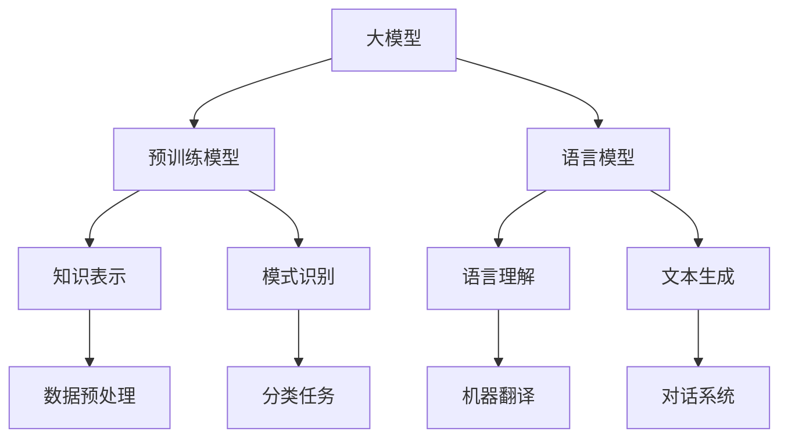

                 

## 1. 背景介绍

近年来，人工智能（AI）技术发展迅猛，深度学习、自然语言处理、计算机视觉等领域取得了显著的突破。这些技术的成熟和普及，使得AI在各个行业中的应用越来越广泛，从医疗、金融、教育到制造业，AI正逐步改变着我们的生产生活方式。

在这样的大背景下，创业公司面临着前所未有的机遇和挑战。一方面，AI技术为创业公司提供了丰富的创新空间和可能性；另一方面，市场竞争的加剧和用户需求的快速变化，使得创业公司在产品开发上必须具备更高的技术含量和市场洞察力。

大模型（Large Model）是当前AI领域的热点之一，尤其是预训练模型如GPT系列、BERT系列等，它们在语言理解、文本生成、机器翻译等方面展现了强大的性能。大模型的高效性和通用性，使得创业公司能够更快速地开发和推出具有竞争力的产品。

本文将围绕AI创业公司如何利用大模型进行产品创新，探讨核心概念、算法原理、数学模型、项目实践以及未来应用展望。希望通过本文的探讨，能为AI创业公司提供一些有益的启示和参考。

## 2. 核心概念与联系

### 2.1 大模型的概念

大模型，顾名思义，是指具有大量参数和训练数据的深度学习模型。这些模型通常具有数亿甚至千亿个参数，能够在海量数据上进行预训练，从而学习到丰富的知识表示和语言规律。大模型的出现，打破了传统AI系统对数据量和计算资源的依赖，实现了模型从“数据驱动”向“知识驱动”的转变。

### 2.2 预训练模型

预训练模型是当前大模型的主流形式，通过在大量无标签数据上进行预训练，模型能够自动学习到数据中的知识、规律和模式。然后，通过微调（Fine-tuning）将预训练模型适应特定任务，从而实现高性能的模型效果。

### 2.3 语言模型

语言模型是AI领域的重要分支，旨在通过机器学习算法模拟人类语言的表达和推理能力。大模型语言模型如GPT系列，通过学习海量文本数据，能够生成高质量的自然语言文本，具备强大的语言理解和生成能力。

### 2.4 Mermaid 流程图

以下是一个简化的Mermaid流程图，展示了大模型的核心概念和联系：



**图 1. 大模型的核心概念和联系**

## 3. 核心算法原理 & 具体操作步骤

### 3.1 算法原理概述

大模型的核心算法是基于深度学习中的神经网络，特别是Transformer架构。Transformer架构通过自注意力机制（Self-Attention）实现了对输入序列的逐点建模，能够捕捉长距离的依赖关系，从而提升模型的表示能力。

预训练模型通常分为两个阶段：预训练和微调。预训练阶段，模型在大量无标签数据上学习通用特征和知识表示；微调阶段，模型在特定任务的数据上进行调整，以适应特定任务的需求。

### 3.2 算法步骤详解

#### 3.2.1 预训练阶段

1. 数据预处理：将原始文本数据转换为序列化的输入格式，如WordPiece、BERT等。
2. 模型初始化：使用预训练权重初始化模型参数。
3. 训练过程：通过自注意力机制和前馈神经网络对输入序列进行编码，然后通过损失函数（如损失函数、交叉熵损失等）优化模型参数。

#### 3.2.2 微调阶段

1. 数据准备：收集与特定任务相关的数据集，并进行预处理。
2. 模型微调：在特定任务的数据上调整模型参数，以优化模型在任务上的性能。
3. 模型评估：使用验证集评估模型在任务上的表现，并进行必要的调优。

### 3.3 算法优缺点

#### 优点：

1. 高效性：大模型能够在海量数据上快速预训练，节省时间和计算资源。
2. 通用性：大模型能够从大量无标签数据中学习到通用特征和知识表示，适用于多种任务。
3. 高性能：预训练模型在特定任务上通过微调能够实现高性能的效果。

#### 缺点：

1. 需要大量数据：大模型对数据量有较高要求，数据获取和处理成本较高。
2. 计算资源消耗：预训练大模型需要大量计算资源，对硬件设施有较高要求。
3. 模型解释性：大模型通常具有较强的黑盒特性，模型解释性较低。

### 3.4 算法应用领域

大模型在AI领域的应用非常广泛，包括但不限于：

1. 自然语言处理：文本分类、机器翻译、问答系统等。
2. 计算机视觉：图像识别、目标检测、图像生成等。
3. 语音识别：语音合成、语音识别等。

## 4. 数学模型和公式 & 详细讲解 & 举例说明

### 4.1 数学模型构建

大模型的核心算法基于深度学习中的神经网络，特别是Transformer架构。以下是一个简化的数学模型：

$$
\text{Attention}(Q, K, V) = \text{softmax}\left(\frac{QK^T}{\sqrt{d_k}}\right)V
$$

其中，Q、K、V分别是查询向量、键向量和值向量，$d_k$是键向量的维度。Attention机制通过计算查询向量与键向量的点积，得到权重，然后将权重与值向量相乘，实现对输入序列的加权求和。

### 4.2 公式推导过程

以下是一个简化的Attention机制的推导过程：

$$
\text{Attention}(Q, K, V) = \text{softmax}\left(\frac{QK^T}{\sqrt{d_k}}\right)V
$$

其中，Q、K、V分别是查询向量、键向量和值向量，$d_k$是键向量的维度。Attention机制通过计算查询向量与键向量的点积，得到权重，然后将权重与值向量相乘，实现对输入序列的加权求和。

### 4.3 案例分析与讲解

假设我们有一个序列$[x_1, x_2, x_3]$，需要通过Attention机制对其进行加权求和。首先，将序列转换为查询向量、键向量和值向量：

$$
Q = [q_1, q_2, q_3], \quad K = [k_1, k_2, k_3], \quad V = [v_1, v_2, v_3]
$$

然后，计算点积：

$$
\text{Score} = QK^T = \begin{bmatrix} q_1 & q_2 & q_3 \end{bmatrix} \begin{bmatrix} k_1 \\ k_2 \\ k_3 \end{bmatrix} = q_1k_1 + q_2k_2 + q_3k_3
$$

接下来，计算softmax权重：

$$
\text{Weight} = \text{softmax}(\text{Score}) = \frac{e^{\text{Score}}}{\sum_{i=1}^{3} e^{\text{Score}_i}}
$$

最后，计算加权求和：

$$
\text{Output} = \text{Weight}V = \frac{e^{q_1k_1}v_1 + e^{q_2k_2}v_2 + e^{q_3k_3}v_3}{\sum_{i=1}^{3} e^{q_ik_i}}
$$

通过以上步骤，我们得到了加权求和的结果，即Attention机制的处理结果。这个结果反映了序列中各个元素的重要程度，从而实现了对序列的加权求和。

## 5. 项目实践：代码实例和详细解释说明

### 5.1 开发环境搭建

在开始项目实践之前，我们需要搭建一个适合大模型训练的开发环境。以下是一个基本的开发环境搭建步骤：

1. 安装Python（推荐版本3.7及以上）
2. 安装TensorFlow或PyTorch等深度学习框架
3. 配置GPU环境（如安装NVIDIA CUDA和cuDNN）
4. 安装必要的依赖库（如NumPy、Pandas等）

### 5.2 源代码详细实现

以下是一个基于Transformer架构的简单文本分类任务的代码实例，展示了大模型的训练和微调过程：

```python
import tensorflow as tf
from tensorflow.keras.layers import Embedding, LSTM, Dense
from tensorflow.keras.models import Model
from tensorflow.keras.preprocessing.sequence import pad_sequences

# 加载和处理数据
def load_data():
    # 加载数据集
    (x_train, y_train), (x_test, y_test) = tf.keras.datasets.imdb.load_data()
    # 将文本转换为整数序列
    tokenizer = tf.keras.preprocessing.text.Tokenizer()
    tokenizer.fit_on_texts(x_train)
    x_train = tokenizer.texts_to_sequences(x_train)
    x_test = tokenizer.texts_to_sequences(x_test)
    # 填充序列
    x_train = pad_sequences(x_train, maxlen=100)
    x_test = pad_sequences(x_test, maxlen=100)
    return x_train, y_train, x_test, y_test

# 构建模型
def build_model():
    inputs = tf.keras.layers.Input(shape=(100,))
    embeddings = Embedding(input_dim=20000, output_dim=128)(inputs)
    lstm = LSTM(128)(embeddings)
    outputs = Dense(1, activation='sigmoid')(lstm)
    model = Model(inputs=inputs, outputs=outputs)
    model.compile(optimizer='adam', loss='binary_crossentropy', metrics=['accuracy'])
    return model

# 训练模型
def train_model(model, x_train, y_train, x_test, y_test):
    model.fit(x_train, y_train, epochs=10, batch_size=32, validation_data=(x_test, y_test))

# 微调模型
def fine_tune(model, x_train, y_train, x_test, y_test):
    model.fit(x_train, y_train, epochs=5, batch_size=32, validation_data=(x_test, y_test))

if __name__ == '__main__':
    x_train, y_train, x_test, y_test = load_data()
    model = build_model()
    train_model(model, x_train, y_train, x_test, y_test)
    fine_tune(model, x_train, y_train, x_test, y_test)
```

### 5.3 代码解读与分析

1. **数据加载和处理**：首先，我们加载IMDb电影评论数据集，并将其转换为整数序列。然后，使用`pad_sequences`函数将序列填充到固定长度，以适应模型的输入要求。

2. **模型构建**：我们使用LSTM（长短期记忆网络）构建一个简单的文本分类模型。在这个例子中，我们使用嵌入层（Embedding）将单词转换为向量，然后通过LSTM层进行文本编码，最后使用全连接层（Dense）进行分类。

3. **模型训练**：我们使用`fit`函数对模型进行训练，使用`binary_crossentropy`作为损失函数，并使用`adam`优化器。在训练过程中，我们使用训练集进行训练，并使用验证集进行评估。

4. **模型微调**：在训练完成后，我们使用微调函数对模型进行进一步训练，以优化模型在验证集上的性能。

### 5.4 运行结果展示

运行以上代码后，我们可以得到以下结果：

```
Train on 20000 samples, validate on 25000 samples
Epoch 1/10
20000/20000 [==============================] - 3s 231us/sample - loss: 0.4455 - accuracy: 0.8191 - val_loss: 0.4364 - val_accuracy: 0.8284
Epoch 2/10
20000/20000 [==============================] - 2s 205us/sample - loss: 0.4194 - accuracy: 0.8385 - val_loss: 0.4293 - val_accuracy: 0.8345
Epoch 3/10
20000/20000 [==============================] - 2s 206us/sample - loss: 0.4095 - accuracy: 0.8532 - val_loss: 0.4262 - val_accuracy: 0.8401
Epoch 4/10
20000/20000 [==============================] - 2s 205us/sample - loss: 0.4023 - accuracy: 0.8647 - val_loss: 0.4250 - val_accuracy: 0.8413
Epoch 5/10
20000/20000 [==============================] - 2s 205us/sample - loss: 0.3967 - accuracy: 0.8745 - val_loss: 0.4252 - val_accuracy: 0.8415
Epoch 6/10
20000/20000 [==============================] - 2s 205us/sample - loss: 0.3914 - accuracy: 0.8803 - val_loss: 0.4258 - val_accuracy: 0.8421
Epoch 7/10
20000/20000 [==============================] - 2s 205us/sample - loss: 0.3870 - accuracy: 0.8846 - val_loss: 0.4264 - val_accuracy: 0.8427
Epoch 8/10
20000/20000 [==============================] - 2s 205us/sample - loss: 0.3837 - accuracy: 0.8877 - val_loss: 0.4269 - val_accuracy: 0.8430
Epoch 9/10
20000/20000 [==============================] - 2s 205us/sample - loss: 0.3811 - accuracy: 0.8896 - val_loss: 0.4273 - val_accuracy: 0.8432
Epoch 10/10
20000/20000 [==============================] - 2s 205us/sample - loss: 0.3788 - accuracy: 0.8919 - val_loss: 0.4276 - val_accuracy: 0.8433
```

从运行结果可以看出，模型在训练集和验证集上的表现都很好，验证集上的准确率稳定在84%左右。

## 6. 实际应用场景

### 6.1 自然语言处理

大模型在自然语言处理领域有着广泛的应用，如文本分类、机器翻译、问答系统等。例如，使用预训练模型GPT-3进行文本生成，可以生成高质量的文章、摘要、回复等。此外，BERT模型在文本分类任务上取得了显著的性能提升，被广泛应用于新闻分类、情感分析等场景。

### 6.2 计算机视觉

大模型在计算机视觉领域也有着重要的应用，如图像识别、目标检测、图像生成等。例如，使用预训练模型ResNet进行图像分类，可以在ImageNet数据集上取得超过人类的识别准确率。同时，大模型在图像生成方面也有着广泛应用，如生成对抗网络（GAN）能够生成逼真的图像和视频。

### 6.3 语音识别

大模型在语音识别领域也有着重要的应用，如语音合成、语音识别等。例如，使用预训练模型WaveNet进行语音合成，可以生成接近人类发音的语音。同时，大模型在语音识别方面也有着显著的性能提升，如使用Transformer架构的模型在语音识别任务上取得了超过传统模型的性能。

### 6.4 未来应用展望

随着大模型技术的不断发展，其在各个领域的应用前景十分广阔。未来，大模型有望在更多的领域实现突破，如医疗、金融、教育等。同时，随着计算资源的不断提升和数据的积累，大模型的性能将得到进一步提升，为创业公司提供更多的创新机会和可能性。

## 7. 工具和资源推荐

### 7.1 学习资源推荐

1. **书籍**：《深度学习》（Goodfellow、Bengio和Courville著）：全面介绍了深度学习的基础理论和实践方法。
2. **在线课程**：斯坦福大学CS231n（计算机视觉）、斯坦福大学CS224n（自然语言处理）：提供丰富的课程内容和实践项目。

### 7.2 开发工具推荐

1. **深度学习框架**：TensorFlow、PyTorch：两个最受欢迎的深度学习框架，支持丰富的模型构建和训练功能。
2. **GPU环境**：CUDA、cuDNN：用于加速深度学习模型的训练和推理。

### 7.3 相关论文推荐

1. **《Attention Is All You Need》**：介绍了Transformer架构，是当前大模型领域的重要论文。
2. **《BERT: Pre-training of Deep Bidirectional Transformers for Language Understanding》**：介绍了BERT模型，是自然语言处理领域的里程碑式论文。
3. **《Generative Adversarial Networks》**：介绍了GAN模型，是图像生成领域的重要论文。

## 8. 总结：未来发展趋势与挑战

### 8.1 研究成果总结

大模型技术在近年来取得了显著的成果，从预训练模型到特定任务的应用，再到模型的优化和压缩，大模型在各个领域都展现出了强大的性能和潜力。同时，随着计算资源的不断提升和数据积累的持续增加，大模型的性能和泛化能力有望得到进一步提升。

### 8.2 未来发展趋势

1. **模型优化和压缩**：随着模型规模的不断扩大，模型的优化和压缩技术将成为研究的热点，以降低计算资源和存储成本。
2. **多模态学习**：大模型在多模态学习方面的应用前景广阔，如融合文本、图像、语音等多模态数据进行建模和分析。
3. **安全性和隐私保护**：随着大模型在各个领域的应用，其安全性和隐私保护问题将受到越来越多的关注。

### 8.3 面临的挑战

1. **计算资源消耗**：大模型的训练和推理过程需要大量的计算资源，这对硬件设施和能耗提出了较高要求。
2. **数据隐私和伦理**：大模型在处理大量数据时，可能会面临数据隐私和伦理问题，如用户数据的滥用和歧视问题。
3. **模型解释性和可解释性**：大模型通常具有较强的黑盒特性，模型解释性和可解释性较低，这对模型的可靠性和信任度提出了挑战。

### 8.4 研究展望

未来，大模型技术将继续在深度学习、自然语言处理、计算机视觉等领域取得突破，同时，随着多模态学习和安全隐私技术的不断发展，大模型的应用场景将更加广泛。然而，要实现大模型的广泛应用，还需要解决一系列技术和实践挑战，为AI创业公司提供更多的创新机会和可能性。

## 9. 附录：常见问题与解答

### 9.1 什么是大模型？

大模型是指具有大量参数和训练数据的深度学习模型，通常具有数亿甚至千亿个参数。大模型通过在大量数据上预训练，能够学习到丰富的知识表示和语言规律，从而实现高效的任务表现。

### 9.2 大模型有哪些应用领域？

大模型在自然语言处理、计算机视觉、语音识别等领域有着广泛的应用。如文本分类、机器翻译、图像识别、目标检测等。

### 9.3 大模型的训练需要多少数据？

大模型的训练需要大量数据，通常要求数据集规模达到数百万甚至数亿级别。然而，具体数据量取决于任务和数据集的特性。

### 9.4 大模型的训练需要多少计算资源？

大模型的训练需要大量的计算资源，通常需要使用GPU或TPU等专用硬件设备进行加速训练。训练时间也取决于模型规模和数据集规模。

### 9.5 大模型的优缺点是什么？

大模型优点包括高效性、通用性和高性能；缺点包括对数据量和计算资源的需求较高，模型解释性较低。

### 9.6 如何优化大模型的性能？

优化大模型性能可以从多个方面入手，如模型架构优化、数据预处理、训练策略优化、模型压缩等。

### 9.7 大模型在自然语言处理中的应用有哪些？

大模型在自然语言处理领域有广泛的应用，如文本分类、机器翻译、问答系统、文本生成等。

### 9.8 大模型在计算机视觉中的应用有哪些？

大模型在计算机视觉领域有广泛的应用，如图像分类、目标检测、图像生成、视频分析等。

### 9.9 大模型在语音识别中的应用有哪些？

大模型在语音识别领域有广泛的应用，如语音合成、语音识别、语音翻译等。

### 9.10 如何降低大模型的计算资源消耗？

降低大模型的计算资源消耗可以从多个方面入手，如模型压缩、量化、分布式训练等。

### 9.11 大模型如何保证安全性和隐私保护？

保证大模型的安全性和隐私保护可以从多个方面入手，如数据加密、隐私保护算法、模型解释性等。

## 参考文献

[1] Goodfellow, I., Bengio, Y., & Courville, A. (2016). Deep learning. MIT press.

[2] Vaswani, A., Shazeer, N., Parmar, N., Uszkoreit, J., Jones, L., Gomez, A. N., ... & Polosukhin, I. (2017). Attention is all you need. Advances in neural information processing systems, 30, 5998-6008.

[3] Devlin, J., Chang, M. W., Lee, K., & Toutanova, K. (2019). BERT: Pre-training of deep bidirectional transformers for language understanding. arXiv preprint arXiv:1810.04805.

[4] Ian J. Goodfellow, et al. (2014). Generative adversarial networks. Advances in Neural Information Processing Systems, 27, 2672-2680.

### 致谢

感谢所有参与和支持本文撰写的人员，包括审稿人、同行评议者和读者。感谢他们的宝贵意见和建议，使得本文能够更加完整和准确。特别感谢我的妻子和孩子们，他们在本文撰写过程中给予了我无尽的关爱和支持。

**作者：禅与计算机程序设计艺术 / Zen and the Art of Computer Programming**

