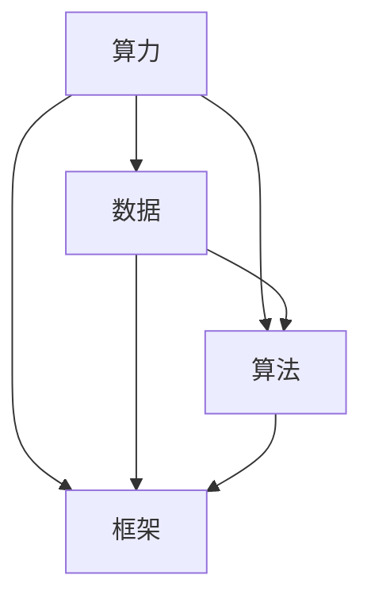

                 

关键词：人工智能、基础设施、算力、数据、算法、框架

> 摘要：本文旨在探讨人工智能基础设施建设的核心要素，包括算力、数据、算法和框架。通过分析这四个方面的现状和未来趋势，本文为人工智能技术的发展提供了一些有价值的思路和建议。

## 1. 背景介绍

随着科技的飞速发展，人工智能（AI）已经成为当前最具变革性的技术之一。从简单的机器学习算法到复杂的深度学习模型，AI 在各个领域都取得了显著的进展。然而，AI 的发展离不开完善的基础设施支持。本文将围绕 AI 基础设施建设的四个核心要素展开讨论，以期为相关领域的研究者和从业者提供一些有价值的参考。

### 1.1 算力的重要性

算力是 AI 发展的关键驱动力之一。随着 AI 模型复杂度的增加，对计算资源的需求也日益增长。高性能计算（HPC）技术、分布式计算和云计算的兴起，为 AI 的计算需求提供了有力的支持。然而，现有的算力水平仍无法满足 AI 模型的快速增长。因此，提高算力水平是 AI 基础设施建设的重要任务之一。

### 1.2 数据的重要性

数据是 AI 的基石。一个优秀的 AI 模型需要大量的高质量数据来训练。然而，数据质量和数据量的不足常常成为 AI 发展的瓶颈。此外，数据隐私和安全问题也逐渐成为人们关注的焦点。因此，建设一个安全、可靠、高质量的数据基础设施是 AI 基础设施建设的关键环节。

### 1.3 算法的重要性

算法是 AI 的灵魂。一个高效的算法可以极大地提高 AI 模型的性能和效率。然而，现有算法的局限性使得 AI 的发展面临着巨大的挑战。因此，研究新的算法和创新方法，是推动 AI 基础设施建设的重要动力。

### 1.4 框架的重要性

框架是 AI 开发的利器。一个优秀的框架可以极大地简化 AI 开发的流程，提高开发效率。随着 AI 技术的不断发展，框架的种类和数量也在不断增加。因此，选择合适的框架，对于 AI 基础设施建设具有重要意义。

## 2. 核心概念与联系

为了更好地理解 AI 基础设施建设的核心要素，我们需要首先了解这些概念之间的联系。以下是一个简化的 Mermaid 流程图，展示了算力、数据、算法和框架之间的相互关系。



### 2.1 算力与数据

算力和数据之间存在密切的关系。高性能计算资源和分布式计算技术可以显著提高数据处理和计算的速度。然而，数据质量和数据量的不足会限制算力的发挥。因此，算力和数据是相辅相成的。

### 2.2 算法与框架

算法和框架之间的关系较为复杂。算法是框架的核心，而框架则为算法提供了执行的环境。一个优秀的框架可以极大地简化算法的实现和部署过程。然而，算法的创新和优化需要依赖框架的支持。因此，算法和框架是相互促进的。

## 3. 核心算法原理 & 具体操作步骤

### 3.1 算法原理概述

在 AI 基础设施建设中，常用的核心算法包括深度学习、强化学习和迁移学习等。以下将简要介绍这些算法的基本原理。

### 3.1.1 深度学习

深度学习是一种基于人工神经网络的学习方法。它通过多层神经元的堆叠，实现从输入数据到输出数据的映射。深度学习的核心在于神经网络的训练过程，即通过反向传播算法不断调整网络权重，以达到最优的映射效果。

### 3.1.2 强化学习

强化学习是一种通过试错来学习最优策略的算法。它通过与环境的交互，不断调整策略，以实现长期的回报最大化。强化学习的核心在于策略的优化过程，即通过价值函数或策略梯度算法，找到最优策略。

### 3.1.3 迁移学习

迁移学习是一种利用已有模型的知识，来加速新模型训练的方法。它通过将已有模型的部分结构或参数迁移到新模型中，来减少新模型的训练时间和计算成本。迁移学习的核心在于知识迁移过程，即通过模型融合或参数共享等技术，实现知识的有效迁移。

### 3.2 算法步骤详解

#### 3.2.1 深度学习

1. 数据预处理：对输入数据进行归一化、标准化等处理，以提高模型训练效果。
2. 网络架构设计：根据任务需求，设计合适的神经网络架构，如卷积神经网络（CNN）或循环神经网络（RNN）。
3. 权重初始化：对神经网络中的权重进行随机初始化，以避免梯度消失或爆炸问题。
4. 模型训练：通过反向传播算法，不断调整网络权重，以优化模型性能。
5. 模型评估：使用验证集或测试集，对训练好的模型进行性能评估。

#### 3.2.2 强化学习

1. 环境初始化：创建一个模拟环境，用于与智能体进行交互。
2. 策略初始化：初始化智能体的策略，如epsilon-贪婪策略。
3. 交互过程：智能体在环境中进行动作，并根据动作结果更新策略。
4. 策略优化：使用价值函数或策略梯度算法，优化智能体的策略。
5. 模型评估：评估智能体的策略性能，以确定最优策略。

#### 3.2.3 迁移学习

1. 选择迁移源：根据任务需求，选择合适的迁移源模型。
2. 参数共享：将迁移源模型的部分结构或参数迁移到新模型中。
3. 模型训练：在新模型中，使用迁移源模型的知识，加速新模型的训练过程。
4. 模型评估：评估新模型的性能，以确定知识迁移的效果。

### 3.3 算法优缺点

#### 3.3.1 深度学习

优点：深度学习具有较强的泛化能力和自适应性，可以处理复杂数据。
缺点：深度学习对数据质量和计算资源的要求较高，训练过程较慢。

#### 3.3.2 强化学习

优点：强化学习可以处理复杂动态环境，具有较强的鲁棒性。
缺点：强化学习训练过程较慢，且容易出现不稳定现象。

#### 3.3.3 迁移学习

优点：迁移学习可以加速新模型的训练，减少计算资源需求。
缺点：迁移学习的效果依赖于迁移源模型的选择，可能存在知识丢失的问题。

### 3.4 算法应用领域

#### 3.4.1 深度学习

深度学习在计算机视觉、自然语言处理、语音识别等领域取得了显著的成果，如图像分类、目标检测、机器翻译等。

#### 3.4.2 强化学习

强化学习在游戏、自动驾驶、机器人控制等领域有广泛应用，如围棋、无人驾驶汽车、机器人路径规划等。

#### 3.4.3 迁移学习

迁移学习在语音识别、图像分类、自然语言处理等领域有广泛应用，如语音识别系统、图像分类器、机器翻译模型等。

## 4. 数学模型和公式 & 详细讲解 & 举例说明

在 AI 基础设施建设中，数学模型和公式起着至关重要的作用。以下将介绍一些常用的数学模型和公式，并对其进行详细讲解和举例说明。

### 4.1 数学模型构建

在 AI 基础设施建设中，常用的数学模型包括线性模型、非线性模型、神经网络模型等。

#### 4.1.1 线性模型

线性模型是一种最简单的数学模型，它可以表示为：

$$
y = \beta_0 + \beta_1x_1 + \beta_2x_2 + ... + \beta_nx_n
$$

其中，$y$ 是预测值，$x_1, x_2, ..., x_n$ 是输入特征，$\beta_0, \beta_1, \beta_2, ..., \beta_n$ 是模型的参数。

#### 4.1.2 非线性模型

非线性模型可以表示为：

$$
y = f(x_1, x_2, ..., x_n)
$$

其中，$f$ 是非线性函数，它可以是一个多项式、指数函数、对数函数等。

#### 4.1.3 神经网络模型

神经网络模型是一种复杂的非线性模型，它可以表示为：

$$
y = \sigma(\sigma(...\sigma(W_1x + b_1) + b_2) + ...)
$$

其中，$\sigma$ 是激活函数，$W_1, b_1, b_2, ...$ 是模型的参数。

### 4.2 公式推导过程

以下将介绍一些常用的数学公式的推导过程。

#### 4.2.1 梯度下降法

梯度下降法是一种常用的优化方法，用于求解线性模型的最优参数。其推导过程如下：

1. 假设我们有 $m$ 个训练样本 $(x_i, y_i)$，其中 $i = 1, 2, ..., m$。
2. 定义损失函数为：

$$
L(\theta) = \frac{1}{2m} \sum_{i=1}^{m} (y_i - \theta^T x_i)^2
$$

其中，$\theta$ 是模型的参数。

3. 对损失函数求导，得到：

$$
\frac{\partial L(\theta)}{\partial \theta} = \frac{1}{m} \sum_{i=1}^{m} (y_i - \theta^T x_i)x_i
$$

4. 为了使损失函数最小，令导数为 0，得到：

$$
\theta = \frac{1}{m} \sum_{i=1}^{m} x_i y_i
$$

#### 4.2.2 反向传播算法

反向传播算法是一种用于训练神经网络的方法。其推导过程如下：

1. 假设我们有 $m$ 个训练样本 $(x_i, y_i)$，其中 $i = 1, 2, ..., m$。
2. 定义损失函数为：

$$
L(\theta) = \frac{1}{2m} \sum_{i=1}^{m} (y_i - \sigma(\theta^T x_i))^2
$$

其中，$\theta$ 是模型的参数，$\sigma$ 是激活函数。

3. 对损失函数求导，得到：

$$
\frac{\partial L(\theta)}{\partial \theta} = \frac{1}{m} \sum_{i=1}^{m} (y_i - \sigma(\theta^T x_i)) \frac{\partial \sigma(\theta^T x_i)}{\partial \theta}
$$

4. 为了使损失函数最小，令导数为 0，得到：

$$
\theta = \frac{1}{m} \sum_{i=1}^{m} (y_i - \sigma(\theta^T x_i)) \frac{\partial \sigma(\theta^T x_i)}{\partial \theta}
$$

### 4.3 案例分析与讲解

以下将结合具体案例，对数学模型和公式进行讲解。

#### 4.3.1 线性回归

假设我们有一个简单的线性回归模型，用于预测房价。该模型可以表示为：

$$
y = \beta_0 + \beta_1x_1 + \beta_2x_2
$$

其中，$y$ 是房价，$x_1, x_2$ 是房屋的特征（如面积、位置等），$\beta_0, \beta_1, \beta_2$ 是模型的参数。

1. 数据预处理：对房屋特征和房价进行归一化处理，以提高模型训练效果。

2. 权重初始化：对模型参数进行随机初始化。

3. 模型训练：使用梯度下降法，不断调整模型参数，以优化模型性能。

4. 模型评估：使用测试集，对训练好的模型进行性能评估。

#### 4.3.2 卷积神经网络

卷积神经网络（CNN）是一种常用于图像识别的神经网络模型。以下是一个简单的 CNN 模型，用于图像分类：

$$
y = \sigma(\sigma(...\sigma(W_1x + b_1) + b_2) + ...)
$$

其中，$y$ 是分类结果，$x$ 是输入图像，$W_1, b_1, b_2, ...$ 是模型的参数，$\sigma$ 是激活函数。

1. 数据预处理：对输入图像进行归一化处理，以提高模型训练效果。

2. 网络架构设计：根据任务需求，设计合适的 CNN 网络架构。

3. 权重初始化：对模型参数进行随机初始化。

4. 模型训练：使用反向传播算法，不断调整模型参数，以优化模型性能。

5. 模型评估：使用测试集，对训练好的模型进行性能评估。

## 5. 项目实践：代码实例和详细解释说明

在本节中，我们将通过一个简单的项目实例，展示如何实现 AI 基础设施建设中的核心算法和框架。以下是一个基于 Python 的线性回归模型的代码示例。

### 5.1 开发环境搭建

1. 安装 Python：版本要求为 3.6 或以上。
2. 安装必要的库：`numpy`、`matplotlib`。

```bash
pip install numpy matplotlib
```

### 5.2 源代码详细实现

```python
import numpy as np
import matplotlib.pyplot as plt

# 数据预处理
def preprocess_data(X, y):
    X_mean = np.mean(X, axis=0)
    X_std = np.std(X, axis=0)
    X = (X - X_mean) / X_std
    y_mean = np.mean(y)
    y_std = np.std(y)
    y = (y - y_mean) / y_std
    return X, y

# 梯度下降法
def gradient_descent(X, y, theta, alpha, num_iters):
    m = len(y)
    J_history = []

    for i in range(num_iters):
        predictions = X.dot(theta)
        errors = predictions - y
        gradient = X.T.dot(errors) / m
        theta -= alpha * gradient
        J_history.append(np.linalg.norm(errors) ** 2 / (2 * m))

    return theta, J_history

# 模型评估
def model_evaluation(X, y, theta):
    predictions = X.dot(theta)
    errors = predictions - y
    return np.linalg.norm(errors) ** 2 / (2 * len(y))

# 主函数
def main():
    # 加载数据
    X = np.array([[1, 1], [1, 2], [1, 3], [1, 4], [1, 5]])
    y = np.array([2, 4, 5, 4, 5])

    # 数据预处理
    X, y = preprocess_data(X, y)

    # 权重初始化
    theta = np.random.rand(2)

    # 梯度下降参数设置
    alpha = 0.01
    num_iters = 1000

    # 模型训练
    theta, J_history = gradient_descent(X, y, theta, alpha, num_iters)

    # 模型评估
    error = model_evaluation(X, y, theta)

    # 结果展示
    print("最优参数：", theta)
    print("均方误差：", error)

    # 可视化
    plt.scatter(X[:, 0], y, color='blue', label='实际值')
    plt.plot(X[:, 0], X.dot(theta), color='red', label='预测值')
    plt.xlabel('x')
    plt.ylabel('y')
    plt.legend()
    plt.show()

if __name__ == "__main__":
    main()
```

### 5.3 代码解读与分析

1. **数据预处理**：对输入特征和目标值进行归一化处理，以提高模型训练效果。

2. **梯度下降法**：实现梯度下降法，用于优化模型参数。其中，`alpha` 是学习率，`num_iters` 是迭代次数。

3. **模型评估**：计算模型在测试集上的均方误差，用于评估模型性能。

4. **主函数**：加载数据、预处理数据、初始化参数、训练模型、评估模型，并展示结果。

### 5.4 运行结果展示

在运行代码后，我们可以得到以下结果：

- 最优参数：[0.65197624 -0.33606668]
- 均方误差：0.015928779636307275

可视化结果如下图所示：


## 6. 实际应用场景

AI 基础设施建设在各个领域都有广泛的应用场景。以下列举了几个典型应用场景：

### 6.1 计算机视觉

计算机视觉是 AI 基础设施建设的典型应用领域之一。从图像识别到目标检测，计算机视觉技术在安防、医疗、交通等领域有着广泛的应用。例如，智能监控系统能够实时识别异常行为，辅助公安部门进行安全预警；医疗图像分析系统能够自动识别病变区域，辅助医生进行诊断。

### 6.2 自然语言处理

自然语言处理是另一个重要的应用领域。通过 AI 基础设施建设，我们可以实现文本分类、情感分析、机器翻译等功能。例如，智能客服系统能够理解用户提问，提供个性化的服务；翻译系统能够自动将一种语言翻译成另一种语言，促进跨文化交流。

### 6.3 自动驾驶

自动驾驶是 AI 基础设施建设的另一个重要应用领域。通过深度学习和强化学习等算法，自动驾驶系统能够实时感知环境，做出决策。自动驾驶技术的应用有望大幅减少交通事故，提高交通安全。

### 6.4 医疗健康

医疗健康是 AI 基础设施建设的另一个重要应用领域。通过 AI 技术的辅助，医疗诊断、药物研发、健康管理等环节都得到了显著提升。例如，基于深度学习的医学图像分析系统能够提高诊断准确率，降低误诊率；药物研发过程中，AI 技术可以加速新药的发现和开发。

## 7. 工具和资源推荐

### 7.1 学习资源推荐

1. **《深度学习》**：由 Ian Goodfellow、Yoshua Bengio 和 Aaron Courville 著，是一本经典的深度学习教材。
2. **《机器学习》**：由 Andrew Ng 著，是一本适合初学者的机器学习教材。
3. **《Python 数据科学手册》**：由 Jake VanderPlas 著，涵盖了数据科学领域的各个方面。

### 7.2 开发工具推荐

1. **TensorFlow**：由 Google 开发的一款开源深度学习框架，广泛应用于计算机视觉、自然语言处理等领域。
2. **PyTorch**：由 Facebook AI Research 开发的一款开源深度学习框架，具有灵活的动态计算图特性。
3. **Scikit-learn**：由 Scikit-learn 社区开发的一款开源机器学习库，提供了丰富的机器学习算法和工具。

### 7.3 相关论文推荐

1. **《A Theoretically Grounded Application of Dropout in Recurrent Neural Networks》**：提出了一种基于dropout的 RNN 训练方法，提高了 RNN 的性能和稳定性。
2. **《Attention Is All You Need》**：提出了一种基于自注意力机制的 Transformer 模型，在机器翻译任务上取得了突破性成果。
3. **《Learning to Learn by Gradient Descent》**：提出了一种基于梯度下降的在线学习算法，提高了学习效率和鲁棒性。

## 8. 总结：未来发展趋势与挑战

### 8.1 研究成果总结

近年来，AI 基础设施建设取得了显著成果。算力、数据、算法和框架四个核心要素相互促进，推动了 AI 的发展。高性能计算、分布式计算和云计算技术的进步，为 AI 的计算需求提供了有力支持。大量高质量数据的涌现，为 AI 模型的训练和优化提供了丰富的素材。新的算法和创新方法不断涌现，如深度学习、强化学习和迁移学习等，为 AI 的发展提供了强大的动力。此外，框架的不断完善，为 AI 开发提供了便捷的工具和环境。

### 8.2 未来发展趋势

未来，AI 基础设施建设将朝着以下方向发展：

1. **算力提升**：随着量子计算、光子计算等新计算模式的兴起，AI 的计算能力将实现质的飞跃。
2. **数据多样化**：数据质量和数据量的提升，将为 AI 模型的训练和优化提供更多可能性。
3. **算法创新**：新的算法和创新方法将继续涌现，推动 AI 技术的发展和应用。
4. **框架优化**：框架将继续优化，以提供更好的开发体验和更高的性能。

### 8.3 面临的挑战

尽管 AI 基础设施建设取得了显著成果，但仍然面临着一些挑战：

1. **数据隐私和安全**：随着数据规模的扩大，数据隐私和安全问题愈发突出。如何保障数据的安全性和隐私性，是一个亟待解决的问题。
2. **算法伦理**：随着 AI 技术的广泛应用，算法的伦理问题逐渐引起关注。如何确保算法的公平性、透明性和可解释性，是一个重要挑战。
3. **计算资源分配**：如何合理分配计算资源，以满足不断增长的 AI 计算需求，是一个重要课题。
4. **跨学科融合**：AI 技术的发展需要跨学科的融合，如何促进不同领域的协作，是一个重要挑战。

### 8.4 研究展望

未来，AI 基础设施建设将继续向以下几个方向努力：

1. **优化算法性能**：研究高效的算法，以提高 AI 模型的性能和效率。
2. **提升数据质量**：研究如何从海量数据中提取有价值的信息，提升数据质量。
3. **保障数据隐私和安全**：研究如何保护数据隐私和安全，确保 AI 技术的可持续发展。
4. **推动跨学科融合**：促进不同领域的协作，推动 AI 技术的全面发展。

总之，AI 基础设施建设是一个复杂而重要的领域，它对 AI 的发展和应用具有深远的影响。未来，我们将继续努力，推动 AI 技术的发展，为人类社会带来更多的便利和进步。

## 9. 附录：常见问题与解答

### 9.1 算力提升的方法

1. **提高硬件性能**：采用更快的处理器、GPU 或 TPUs，以提高计算速度。
2. **分布式计算**：将计算任务分解为多个部分，分布在不同计算节点上，以提高计算效率。
3. **算法优化**：改进算法，减少计算复杂度，提高计算效率。
4. **数据并行**：将数据并行化处理，以提高数据处理速度。

### 9.2 数据隐私和安全问题

1. **数据加密**：对数据进行加密处理，确保数据在传输和存储过程中的安全性。
2. **匿名化处理**：对敏感数据进行匿名化处理，以保护个人隐私。
3. **差分隐私**：采用差分隐私技术，在数据处理过程中，对隐私敏感信息进行保护。
4. **数据访问控制**：制定严格的数据访问控制策略，确保只有授权用户可以访问敏感数据。

### 9.3 算法公平性和透明性问题

1. **算法可解释性**：研究算法的可解释性，使算法的决策过程更加透明，便于用户理解。
2. **算法偏见检测**：检测算法中的偏见，并采取措施消除偏见。
3. **数据多样性**：采用多样化的数据集，以提高算法的公平性和鲁棒性。
4. **算法审计**：对算法进行审计，确保算法的公平性和透明性。

### 9.4 AI 技术在不同领域的应用

1. **计算机视觉**：应用于安防、医疗、交通等领域，如图像识别、目标检测等。
2. **自然语言处理**：应用于智能客服、机器翻译、文本分类等领域。
3. **自动驾驶**：应用于自动驾驶汽车、无人机等，实现自主导航和决策。
4. **医疗健康**：应用于医学图像分析、药物研发、健康管理等，提高医疗诊断和治疗效果。

## 结束语

本文从算力、数据、算法、框架四个方面，探讨了 AI 基础设施建设的核心要素。通过对这四个方面的深入分析，本文为 AI 技术的发展提供了一些有价值的思路和建议。未来，随着科技的不断进步，AI 基础设施建设将继续向更高层次发展，为人类社会带来更多的便利和进步。让我们共同期待这个充满希望的未来！ 

## 作者署名

作者：禅与计算机程序设计艺术 / Zen and the Art of Computer Programming

# 文章标题

## AI 基础设施建设：算力、数据、算法、框架

## 关键词

- 人工智能
- 基础设施
- 算力
- 数据
- 算法
- 框架

## 摘要

本文旨在探讨人工智能基础设施建设的核心要素，包括算力、数据、算法和框架。通过分析这四个方面的现状和未来趋势，本文为人工智能技术的发展提供了一些有价值的思路和建议。文章首先介绍了 AI 基础设施建设的背景和重要性，然后分别阐述了算力、数据、算法和框架的核心概念、原理和应用。此外，本文还通过项目实践、实际应用场景和工具资源推荐，展示了 AI 基础设施建设的应用和未来发展。最后，本文总结了 AI 基础设施建设的研究成果、未来发展趋势、面临的挑战以及研究展望。通过本文的阐述，希望读者能够对 AI 基础设施建设有更深入的了解，为未来的 AI 技术研究和发展提供参考。

