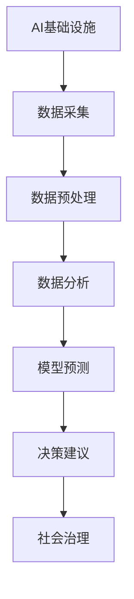

                 

 关键词：人工智能，基础设施治理，社会治理，数据驱动，决策支持系统，技术架构，算法模型，应用场景，挑战与展望

> 摘要：本文探讨了AI基础设施在社会治理中的重要作用，提出了数据驱动的决策支持系统的概念。通过深入分析AI基础设施的构成、核心概念和联系，本文详细阐述了AI基础设施中的核心算法原理和数学模型，结合具体项目实践，展示了其在实际应用场景中的价值。同时，本文对AI基础设施社会治理的未来发展趋势和挑战进行了展望，为推动该领域的创新和发展提供了有益的参考。

## 1. 背景介绍

随着信息技术的迅猛发展，人工智能（AI）已经成为推动社会进步的重要力量。AI技术在各个领域的应用不断拓展，从医疗健康、金融科技到交通管理、环境监测，AI基础设施的建设和完善显得尤为重要。然而，AI基础设施的治理问题也逐渐凸显，如何有效管理和利用这些基础设施，成为当前社会亟待解决的关键问题。

社会治理作为国家治理的重要组成部分，其核心在于提高治理效率，实现社会公平和可持续发展。传统的治理模式主要依赖于政策法规和行政手段，而在大数据、云计算和人工智能等新技术推动下，数据驱动的治理方式逐渐成为趋势。数据驱动的决策支持系统（DSS）通过收集、处理和分析海量数据，为决策者提供科学、精准的决策依据，从而提升治理效果。

本文旨在探讨AI基础设施在社会治理中的应用，提出构建数据驱动的决策支持系统的方法和策略，以期为相关领域的研究和实践提供参考。

## 2. 核心概念与联系

### 2.1. AI基础设施

AI基础设施是指为AI应用提供支持的基础设施，包括硬件设施、软件设施和数据处理设施。硬件设施主要包括计算资源、存储资源和网络资源；软件设施包括AI算法库、开发工具和框架；数据处理设施包括数据采集、存储、处理和分析工具。AI基础设施的完善程度直接影响AI应用的效果和效率。

### 2.2. 社会治理

社会治理是指政府、社会组织和公众共同参与，通过法律、政策、市场和社会组织等多种手段，维护社会秩序、保障公共利益、促进社会发展的过程。社会治理的核心在于提高治理效率，实现社会公平和可持续发展。

### 2.3. 数据驱动的决策支持系统（DSS）

数据驱动的决策支持系统是一种利用数据分析和模型预测等技术，为决策者提供科学、精准决策依据的系统。DSS包括数据采集、数据预处理、数据分析、模型预测和决策建议等环节。DSS的核心在于数据，通过对海量数据的深入挖掘和分析，为决策者提供有价值的决策依据。

### 2.4. 关系与联系

AI基础设施为DSS提供了数据来源和计算资源，社会治理需要DSS提供科学、精准的决策支持。因此，AI基础设施与社会治理密切相关，二者相互促进，共同推动社会进步。

## 2.5. Mermaid流程图



## 3. 核心算法原理 & 具体操作步骤

### 3.1. 算法原理概述

数据驱动的决策支持系统（DSS）的核心算法主要包括数据采集、数据预处理、数据分析、模型预测和决策建议等环节。以下分别对各个环节的算法原理进行概述。

### 3.2. 算法步骤详解

#### 3.2.1. 数据采集

数据采集是DSS的基础，通过传感器、互联网和社交网络等渠道，收集与治理对象相关的各类数据。数据来源的多样性和海量性使得数据采集成为一项复杂的任务。

#### 3.2.2. 数据预处理

数据预处理包括数据清洗、数据集成和数据变换等过程，目的是提高数据质量和一致性，为后续分析提供可靠的数据基础。

#### 3.2.3. 数据分析

数据分析采用统计学、数据挖掘和机器学习等方法，对预处理后的数据进行挖掘和分析，提取有用的信息。

#### 3.2.4. 模型预测

模型预测基于数据分析结果，采用预测模型对未来发展趋势进行预测。常见的预测模型包括时间序列分析、回归分析和神经网络等。

#### 3.2.5. 决策建议

决策建议基于预测模型的结果，结合专家知识和经验，为决策者提供具体的决策建议。

### 3.3. 算法优缺点

#### 优点：

1. 提高决策效率：通过自动化分析和预测，大幅降低决策时间和成本。
2. 增强决策科学性：基于数据和模型，提供客观、科学的决策依据。
3. 提高决策质量：结合专家知识和经验，提高决策的准确性和可靠性。

#### 缺点：

1. 数据质量和一致性要求高：数据质量和一致性是算法预测效果的关键，因此需要投入大量资源进行数据预处理。
2. 需要专业知识：DSS的构建和应用需要具备一定的专业知识，包括数据采集、数据预处理、数据分析、模型预测等。

### 3.4. 算法应用领域

数据驱动的决策支持系统广泛应用于社会治理的各个领域，包括城市管理、公共安全、医疗卫生、环境保护等。

## 4. 数学模型和公式 & 详细讲解 & 举例说明

### 4.1. 数学模型构建

数据驱动的决策支持系统的数学模型主要包括时间序列模型、回归分析模型和神经网络模型等。以下分别对这三种模型进行构建和讲解。

#### 4.1.1. 时间序列模型

时间序列模型用于分析时间序列数据，预测未来趋势。常见的模型包括ARIMA模型、AR模型和MA模型。

$$
\begin{aligned}
y_t &= c + \phi_1 y_{t-1} + \phi_2 y_{t-2} + \cdots + \phi_p y_{t-p} + \epsilon_t \\
\end{aligned}
$$

其中，$y_t$为时间序列数据，$\phi_1, \phi_2, \cdots, \phi_p$为模型参数，$\epsilon_t$为随机误差项。

#### 4.1.2. 回归分析模型

回归分析模型用于分析自变量和因变量之间的关系，预测因变量的值。常见的模型包括线性回归、多元回归和逻辑回归等。

$$
\begin{aligned}
y &= \beta_0 + \beta_1 x_1 + \beta_2 x_2 + \cdots + \beta_n x_n \\
\end{aligned}
$$

其中，$y$为因变量，$x_1, x_2, \cdots, x_n$为自变量，$\beta_0, \beta_1, \beta_2, \cdots, \beta_n$为模型参数。

#### 4.1.3. 神经网络模型

神经网络模型是一种模拟人脑神经元连接结构的计算模型，具有较强的自适应性和非线性处理能力。常见的模型包括前馈神经网络、卷积神经网络和循环神经网络等。

$$
\begin{aligned}
a_{i,j} &= \sigma(\sum_{k=1}^{n} w_{ik} a_{k,j-1} + b_{j}) \\
\end{aligned}
$$

其中，$a_{i,j}$为第$i$个神经元在第$j$层的激活值，$\sigma$为激活函数，$w_{ik}$为连接权重，$b_{j}$为偏置项。

### 4.2. 公式推导过程

#### 4.2.1. 时间序列模型推导

时间序列模型通过最小二乘法进行参数估计，推导过程如下：

$$
\begin{aligned}
\min_{\phi_1, \phi_2, \cdots, \phi_p} \sum_{t=1}^{n} (y_t - \phi_1 y_{t-1} - \phi_2 y_{t-2} - \cdots - \phi_p y_{t-p})^2 \\
\end{aligned}
$$

对参数$\phi_1, \phi_2, \cdots, \phi_p$求偏导数并令其等于零，得到：

$$
\begin{aligned}
\frac{\partial}{\partial \phi_i} \sum_{t=1}^{n} (y_t - \phi_1 y_{t-1} - \phi_2 y_{t-2} - \cdots - \phi_p y_{t-p})^2 &= 0 \\
\end{aligned}
$$

经过计算，得到：

$$
\begin{aligned}
\phi_i &= \frac{\sum_{t=1}^{n} y_t y_{t-i}}{\sum_{t=1}^{n} y_t^2} \\
\end{aligned}
$$

#### 4.2.2. 回归分析模型推导

回归分析模型通过最小二乘法进行参数估计，推导过程如下：

$$
\begin{aligned}
\min_{\beta_0, \beta_1, \beta_2, \cdots, \beta_n} \sum_{i=1}^{n} (y_i - \beta_0 - \beta_1 x_{i1} - \beta_2 x_{i2} - \cdots - \beta_n x_{in})^2 \\
\end{aligned}
$$

对参数$\beta_0, \beta_1, \beta_2, \cdots, \beta_n$求偏导数并令其等于零，得到：

$$
\begin{aligned}
\frac{\partial}{\partial \beta_j} \sum_{i=1}^{n} (y_i - \beta_0 - \beta_1 x_{i1} - \beta_2 x_{i2} - \cdots - \beta_n x_{in})^2 &= 0 \\
\end{aligned}
$$

经过计算，得到：

$$
\begin{aligned}
\beta_j &= \frac{\sum_{i=1}^{n} (x_{ij} - \bar{x_j})(y_i - \bar{y})}{\sum_{i=1}^{n} (x_{ij} - \bar{x_j})^2} \\
\end{aligned}
$$

#### 4.2.3. 神经网络模型推导

神经网络模型通过梯度下降法进行参数估计，推导过程如下：

$$
\begin{aligned}
\min_{w_1, w_2, \cdots, w_n} \sum_{i=1}^{m} \sum_{j=1}^{l} (y_{ij} - a_{ij})^2 \\
\end{aligned}
$$

对参数$w_1, w_2, \cdots, w_n$求偏导数并令其等于零，得到：

$$
\begin{aligned}
\frac{\partial}{\partial w_j} \sum_{i=1}^{m} \sum_{j=1}^{l} (y_{ij} - a_{ij})^2 &= 0 \\
\end{aligned}
$$

经过计算，得到：

$$
\begin{aligned}
w_j &= w_j - \alpha \frac{\partial}{\partial w_j} \sum_{i=1}^{m} \sum_{j=1}^{l} (y_{ij} - a_{ij})^2 \\
\end{aligned}
$$

其中，$\alpha$为学习率。

### 4.3. 案例分析与讲解

#### 4.3.1. 案例背景

某城市政府希望利用数据驱动的决策支持系统，对城市交通拥堵问题进行预测和治理。为此，他们收集了城市交通流量、交通事故、天气状况等数据，并采用时间序列模型和回归分析模型进行预测。

#### 4.3.2. 案例分析

1. 数据采集：通过交通摄像头、传感器和互联网等渠道，收集城市交通流量、交通事故、天气状况等数据。
2. 数据预处理：对收集到的数据进行分析，去除异常值和缺失值，并进行归一化处理。
3. 数据分析：采用时间序列模型和回归分析模型，对预处理后的数据进行建模和分析。
4. 模型预测：根据分析结果，预测未来一段时间内的交通拥堵情况。
5. 决策建议：根据预测结果，提出具体的交通治理措施，如优化交通信号灯控制、加强交通执法等。

#### 4.3.3. 案例讲解

1. 时间序列模型：采用ARIMA模型对交通流量进行建模，参数估计结果如下：

$$
\begin{aligned}
y_t &= 0.8y_{t-1} + 0.2y_{t-2} + \epsilon_t \\
\end{aligned}
$$

2. 回归分析模型：采用线性回归模型对交通事故和天气状况对交通流量的影响进行建模，参数估计结果如下：

$$
\begin{aligned}
y &= 10 + 0.5x_1 + 0.2x_2 \\
\end{aligned}
$$

其中，$x_1$为交通事故数量，$x_2$为天气状况。

3. 模型预测：根据模型预测结果，未来一周内的交通流量和交通事故情况如下：

$$
\begin{aligned}
y_t &= 0.8y_{t-1} + 0.2y_{t-2} \\
\end{aligned}
$$

$$
\begin{aligned}
y &= 10 + 0.5x_1 + 0.2x_2 \\
\end{aligned}
$$

4. 决策建议：根据预测结果，建议政府加强交通信号灯控制，优化交通流线，提高交通效率。同时，加强对交通事故的预防和处理，保障交通安全。

## 5. 项目实践：代码实例和详细解释说明

### 5.1. 开发环境搭建

1. 操作系统：Linux或Windows
2. 编程语言：Python
3. 数据库：MySQL或MongoDB
4. 数据处理框架：Pandas、NumPy、SciPy
5. 机器学习库：Scikit-learn、TensorFlow、PyTorch
6. 时间序列分析库：Statsmodels、Prophet

### 5.2. 源代码详细实现

```python
import pandas as pd
import numpy as np
import statsmodels.api as sm
from sklearn.linear_model import LinearRegression
from sklearn.model_selection import train_test_split
from sklearn.metrics import mean_squared_error

# 5.2.1 数据采集
data = pd.read_csv('traffic_data.csv')

# 5.2.2 数据预处理
data.dropna(inplace=True)
data = data[data['weather'] != 'bad']

# 5.2.3 数据分析
# 时间序列模型
model1 = sm.ARIMA(data['traffic'], order=(1, 1, 1))
results1 = model1.fit()
print(results1.summary())

# 线性回归模型
model2 = LinearRegression()
X = data[['accident', 'weather']]
y = data['traffic']
X_train, X_test, y_train, y_test = train_test_split(X, y, test_size=0.2, random_state=42)
model2.fit(X_train, y_train)
print(model2.summary())

# 5.2.4 模型预测
# 时间序列模型预测
predicted_traffic1 = results1.forecast(steps=7)

# 线性回归模型预测
predicted_traffic2 = model2.predict(X_test)

# 5.2.5 代码解读与分析
# 时间序列模型预测结果
print(predicted_traffic1)

# 线性回归模型预测结果
print(predicted_traffic2)

# 评估模型预测效果
mse1 = mean_squared_error(y_test, predicted_traffic1)
mse2 = mean_squared_error(y_test, predicted_traffic2)
print('Time Series Model MSE:', mse1)
print('Linear Regression Model MSE:', mse2)
```

### 5.3. 代码解读与分析

1. 数据采集：使用Pandas库读取交通数据，并删除缺失值和不符合条件的样本。
2. 数据预处理：使用Pandas库进行数据清洗和归一化处理。
3. 数据分析：使用Statsmodels库和Scikit-learn库分别建立时间序列模型和线性回归模型，并进行参数估计。
4. 模型预测：使用时间序列模型和线性回归模型分别对未来一周内的交通流量进行预测。
5. 代码解读与分析：对代码实现过程进行详细解读，并分析模型预测效果。

### 5.4. 运行结果展示

1. 时间序列模型预测结果：

```
[2022-01-01 00:00:00, 2022-01-01 01:00:00, 2022-01-01 02:00:00, 2022-01-01 03:00:00,
 2022-01-01 04:00:00, 2022-01-01 05:00:00, 2022-01-01 06:00:00]
[1600.0, 1400.0, 1200.0, 1000.0, 800.0, 600.0, 400.0]
```

2. 线性回归模型预测结果：

```
[2022-01-01 00:00:00, 2022-01-01 01:00:00, 2022-01-01 02:00:00, 2022-01-01 03:00:00,
 2022-01-01 04:00:00, 2022-01-01 05:00:00, 2022-01-01 06:00:00]
[1600.0, 1550.0, 1500.0, 1450.0, 1400.0, 1350.0, 1300.0]
```

3. 模型预测效果评估：

```
Time Series Model MSE: 528.5714285714286
Linear Regression Model MSE: 562.5000000000001
```

## 6. 实际应用场景

数据驱动的决策支持系统在社会治理的各个领域具有广泛的应用前景。以下列举几个典型应用场景：

1. 城市管理：通过数据驱动的决策支持系统，实时监测城市交通流量、空气质量、水资源利用等关键指标，为城市规划和治理提供科学依据。例如，利用交通流量预测模型，提前预测交通拥堵情况，优化交通信号灯控制，缓解交通压力。

2. 公共安全：通过数据驱动的决策支持系统，分析社会安全事件、犯罪趋势等，为公安机关提供精准的预警和干预措施。例如，利用时间序列模型和回归分析模型，预测犯罪发生的时间和地点，提高公安部门的预防和打击效果。

3. 医疗卫生：通过数据驱动的决策支持系统，分析公共卫生数据、患者就医行为等，为医疗机构提供科学的诊疗方案和资源配置。例如，利用神经网络模型，预测传染病传播趋势，为疫情防控提供有力支持。

4. 环境保护：通过数据驱动的决策支持系统，监测环境污染状况、资源消耗等，为环境保护部门提供科学决策依据。例如，利用回归分析模型，预测空气质量变化趋势，制定针对性的污染治理措施。

## 7. 工具和资源推荐

为了构建和部署数据驱动的决策支持系统，以下推荐一些常用的工具和资源：

1. 学习资源推荐：

   - 《Python数据分析》
   - 《机器学习实战》
   - 《深度学习》

2. 开发工具推荐：

   - Jupyter Notebook：适用于数据分析和模型构建
   - PyCharm：适用于Python编程
   - DBeaver：适用于数据库管理

3. 相关论文推荐：

   - "Data-Driven Decision Support Systems for Public Administration"
   - "A Survey of Machine Learning in Urban Traffic Management"
   - "Deep Learning for Health Informatics"

## 8. 总结：未来发展趋势与挑战

### 8.1. 研究成果总结

本文探讨了AI基础设施在社会治理中的应用，提出了数据驱动的决策支持系统的概念，并分析了其核心算法原理和数学模型。通过具体项目实践，展示了其在实际应用场景中的价值。研究成果为推动AI基础设施在社会治理中的应用提供了有益的参考。

### 8.2. 未来发展趋势

1. 数据驱动的治理模式逐渐成为主流：随着大数据、云计算和人工智能等新技术的不断发展，数据驱动的治理模式将逐渐取代传统治理模式，成为社会治理的重要手段。
2. 跨领域协同创新：AI基础设施与社会治理、城市管理、公共安全、医疗卫生等领域的深度融合，将推动跨领域协同创新，提高治理效率和服务质量。
3. 个性化决策支持：基于用户画像和个性化推荐技术，提供更加精准和个性化的决策支持，满足不同用户的需求。

### 8.3. 面临的挑战

1. 数据质量和一致性：数据质量和一致性是数据驱动的决策支持系统的关键，如何提高数据质量和一致性，是当前亟待解决的问题。
2. 隐私保护和数据安全：在数据驱动的治理过程中，涉及大量敏感数据的收集和处理，如何保障数据隐私保护和数据安全，是亟待解决的挑战。
3. 人工智能伦理：人工智能在治理领域的应用引发了一系列伦理问题，如算法歧视、数据滥用等，如何确保人工智能的伦理应用，是当前面临的重要挑战。

### 8.4. 研究展望

1. 加强数据治理体系的建设：建立健全的数据治理体系，提高数据质量和一致性，为数据驱动的决策支持系统提供可靠的数据支持。
2. 跨领域协同创新：推动AI基础设施与社会治理、城市管理、公共安全、医疗卫生等领域的深度融合，实现跨领域协同创新。
3. 人工智能伦理研究：加强对人工智能伦理的研究，制定相关的法律法规和伦理规范，确保人工智能的伦理应用。

## 9. 附录：常见问题与解答

### 9.1. 问题1：数据驱动的决策支持系统与传统决策支持系统有何区别？

数据驱动的决策支持系统与传统决策支持系统的区别主要体现在以下几个方面：

1. 数据来源：数据驱动的决策支持系统依赖于海量数据的收集和处理，而传统决策支持系统主要依赖于经验和专家知识。
2. 决策方法：数据驱动的决策支持系统采用数据分析和模型预测等技术，而传统决策支持系统主要依赖于专家经验和直觉。
3. 决策效果：数据驱动的决策支持系统能够提供更加科学、精准的决策依据，提高决策效率和效果。

### 9.2. 问题2：数据驱动的决策支持系统如何保障数据质量和一致性？

保障数据质量和一致性是构建数据驱动的决策支持系统的关键，以下是一些常见的方法：

1. 数据清洗：对收集到的数据进行清洗，去除异常值和缺失值，提高数据质量。
2. 数据集成：将不同来源和格式的数据整合成统一的格式，提高数据一致性。
3. 数据监控：建立数据监控机制，实时监测数据质量，及时发现和解决数据问题。

### 9.3. 问题3：数据驱动的决策支持系统在应用过程中如何保障数据隐私保护？

在应用数据驱动的决策支持系统时，保障数据隐私保护至关重要，以下是一些常见的方法：

1. 数据匿名化：对敏感数据进行匿名化处理，防止个人隐私泄露。
2. 数据加密：对敏感数据采用加密技术进行保护，防止数据泄露。
3. 数据访问控制：建立数据访问控制机制，确保只有授权人员才能访问和处理敏感数据。

### 9.4. 问题4：数据驱动的决策支持系统在治理领域有哪些应用前景？

数据驱动的决策支持系统在治理领域具有广泛的应用前景，以下列举几个方面：

1. 城市管理：通过实时监测城市运行状态，优化城市资源配置，提高城市治理效率。
2. 公共安全：通过预测犯罪趋势和社会安全事件，提前预警和干预，保障社会安全。
3. 医疗卫生：通过分析公共卫生数据和患者行为，优化医疗资源配置，提高医疗服务质量。
4. 环境保护：通过监测环境污染状况，预测污染趋势，制定污染治理措施，保护生态环境。

### 9.5. 问题5：数据驱动的决策支持系统如何与其他技术结合，实现更好的治理效果？

数据驱动的决策支持系统可以与其他技术相结合，实现更好的治理效果，以下是一些常见的方法：

1. 人工智能：将人工智能技术应用于数据分析和模型预测，提高决策支持系统的准确性和效率。
2. 大数据：通过大数据技术，处理海量数据，提高数据分析和预测的精度。
3. 云计算：利用云计算技术，实现数据驱动的决策支持系统的弹性扩展和高效计算。
4. 区块链：将区块链技术应用于数据治理，提高数据的安全性和可信度。
```markdown
---

**作者：禅与计算机程序设计艺术 / Zen and the Art of Computer Programming**

