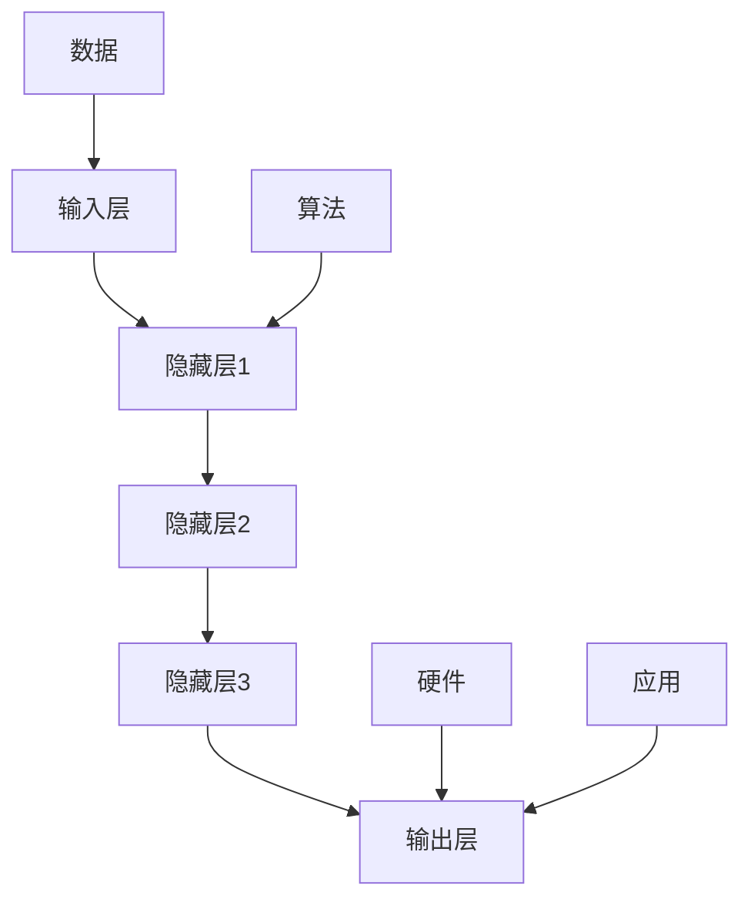

                 

关键词：AI大模型，创业，创新优势，技术前沿，商业模式，未来展望

>摘要：随着人工智能技术的迅猛发展，大模型成为当前AI领域的研究热点。对于创业者而言，如何利用AI大模型的技术优势实现商业创新，成为了亟需解决的关键问题。本文将深入探讨AI大模型的本质、技术优势、应用场景，以及创业者在其中的机遇与挑战。

## 1. 背景介绍

近年来，人工智能（AI）技术取得了飞速发展，从最初的简单算法到如今的大模型时代，AI的应用范围越来越广泛。大模型，指的是具有大规模参数和计算量的神经网络模型，如GPT-3、BERT等。这些模型的出现，极大地推动了自然语言处理、计算机视觉等领域的进步，也带来了许多新的商业机会。

创业者在面对AI大模型带来的机遇时，不仅要了解其技术原理和应用场景，更需要具备创新的思维，将技术优势转化为实际商业价值。本文将从以下几个方面展开讨论：

1. AI大模型的本质与核心概念
2. AI大模型的技术优势
3. AI大模型的应用场景
4. 创业者在AI大模型领域的创新实践
5. AI大模型创业面临的挑战与应对策略

## 2. 核心概念与联系

### 2.1 AI大模型的定义

AI大模型是指具有大规模参数和计算量的神经网络模型。这些模型通过在海量数据上训练，能够自动学习并提取数据中的特征，从而实现高精度的预测、分类和生成。

### 2.2 大模型的核心技术

大模型的核心技术包括深度学习、神经网络、大规模数据处理和计算等。深度学习是一种多层神经网络模型，通过逐层提取特征，实现从简单到复杂的特征表示。神经网络是一种计算模型，由大量神经元（节点）组成，通过权重和偏置实现输入和输出的映射。大规模数据处理技术能够高效处理海量数据，为模型训练提供充足的数据支持。计算技术则保证了模型训练和推理的速度和效率。

### 2.3 AI大模型的架构

AI大模型的架构通常包括输入层、隐藏层和输出层。输入层接收外部输入数据，隐藏层通过多层网络进行特征提取和变换，输出层生成最终的预测结果。在实际应用中，大模型的架构会根据具体任务进行调整，如加入注意力机制、循环神经网络等。

### 2.4 大模型与其他技术的联系

AI大模型与其他技术的联系主要体现在以下几个方面：

- 数据：大模型的训练依赖于海量数据，数据的质量和数量直接影响模型的性能。
- 算法：大模型的训练和推理需要高效的算法，如梯度下降、随机梯度下降等。
- 硬件：大模型的训练和推理需要强大的计算资源，如GPU、TPU等硬件加速器。
- 应用：大模型的应用需要与其他技术相结合，如云计算、边缘计算等。

### 2.5 Mermaid 流程图

以下是一个简单的Mermaid流程图，展示了AI大模型的核心技术和架构：



## 3. 核心算法原理 & 具体操作步骤

### 3.1 算法原理概述

AI大模型的算法原理主要基于深度学习和神经网络。深度学习通过多层网络进行特征提取和变换，实现高精度的预测和生成。神经网络则通过权重和偏置实现输入和输出的映射。

具体来说，AI大模型的算法原理包括以下几个步骤：

1. 数据预处理：将原始数据进行清洗、归一化等处理，以便于模型训练。
2. 模型设计：根据任务需求，设计合适的神经网络结构，包括输入层、隐藏层和输出层。
3. 模型训练：使用训练数据对模型进行迭代训练，优化模型参数，提高模型性能。
4. 模型评估：使用验证数据对模型进行评估，确定模型是否达到预期效果。
5. 模型应用：将训练好的模型应用于实际任务，生成预测或生成结果。

### 3.2 算法步骤详解

1. **数据预处理**

数据预处理是模型训练的重要步骤。首先，需要对原始数据进行清洗，去除噪声和异常值。然后，对数据进行归一化或标准化处理，使其在数值范围上更加均衡，有利于模型训练。

2. **模型设计**

模型设计是根据任务需求来确定的。一般来说，对于分类任务，可以选择卷积神经网络（CNN）或循环神经网络（RNN）等；对于生成任务，可以选择生成对抗网络（GAN）等。在模型设计中，需要考虑网络的层数、每层的神经元数量、激活函数等。

3. **模型训练**

模型训练是使用训练数据对模型进行迭代训练的过程。在训练过程中，需要计算损失函数，并根据损失函数的梯度来更新模型参数。常用的优化算法有梯度下降、随机梯度下降、Adam等。

4. **模型评估**

模型评估是使用验证数据对模型进行评估的过程。通过评估指标，如准确率、召回率、F1值等，来判断模型是否达到预期效果。如果评估指标不理想，需要调整模型参数或重新设计模型。

5. **模型应用**

模型应用是将训练好的模型应用于实际任务的过程。在实际应用中，可能需要对模型进行微调或迁移学习，以适应不同的任务和数据集。

### 3.3 算法优缺点

- 优点：

  - **高精度**：AI大模型能够通过多层网络提取特征，实现高精度的预测和生成。

  - **泛化能力强**：通过在大量数据上训练，大模型能够具备较强的泛化能力，适用于多种任务和数据集。

  - **自适应性强**：大模型能够根据不同的任务和数据集进行自适应调整，实现个性化的预测和生成。

- 缺点：

  - **计算量大**：大模型的训练和推理需要大量的计算资源，对硬件要求较高。

  - **数据依赖性强**：大模型的训练需要大量的数据，数据的质量和数量直接影响模型的性能。

### 3.4 算法应用领域

AI大模型的应用领域非常广泛，包括自然语言处理、计算机视觉、语音识别、推荐系统等。以下是一些具体的例子：

- 自然语言处理：AI大模型在自然语言处理领域有着广泛的应用，如文本分类、机器翻译、情感分析等。

- 计算机视觉：AI大模型在计算机视觉领域发挥着重要作用，如图像分类、目标检测、人脸识别等。

- 语音识别：AI大模型在语音识别领域有着出色的表现，如语音转文本、语音合成等。

- 推荐系统：AI大模型在推荐系统中被广泛应用于个性化推荐，如电商推荐、音乐推荐等。

## 4. 数学模型和公式 & 详细讲解 & 举例说明

### 4.1 数学模型构建

AI大模型的数学模型主要基于神经网络和深度学习。神经网络是一种计算模型，由大量神经元（节点）组成，通过权重和偏置实现输入和输出的映射。深度学习则通过多层网络进行特征提取和变换，实现高精度的预测和生成。

以下是一个简单的神经网络模型：

$$
y = f(W_1 \cdot x + b_1)
$$

其中，$y$表示输出，$f$表示激活函数，$W_1$表示权重，$b_1$表示偏置，$x$表示输入。

### 4.2 公式推导过程

神经网络的训练过程可以通过反向传播算法来实现。反向传播算法是一种梯度下降算法，用于优化神经网络模型。

以下是反向传播算法的推导过程：

1. **前向传播**

前向传播是从输入层开始，逐层计算神经元的输出值。假设神经网络有$L$层，其中$L$是输出层。对于第$l$层的第$i$个神经元，其输出值为：

$$
z_l^i = W_l \cdot a_{l-1} + b_l
$$

其中，$z_l^i$表示第$l$层的第$i$个神经元的输出，$W_l$表示第$l$层的权重，$a_{l-1}$表示第$l-1$层的输出。

2. **损失函数**

损失函数用于衡量模型的预测值与真实值之间的差距。常见的损失函数有均方误差（MSE）和交叉熵（CE）。

均方误差（MSE）的定义如下：

$$
J = \frac{1}{2n} \sum_{i=1}^{n} (y_i - \hat{y}_i)^2
$$

其中，$J$表示损失函数，$n$表示样本数量，$y_i$表示第$i$个样本的真实值，$\hat{y}_i$表示第$i$个样本的预测值。

3. **后向传播**

后向传播是从输出层开始，反向计算每个神经元的梯度。对于第$l$层的第$i$个神经元，其梯度定义为：

$$
\delta_l^i = \frac{\partial J}{\partial z_l^i}
$$

其中，$\delta_l^i$表示第$l$层的第$i$个神经元的梯度。

4. **权重和偏置更新**

根据梯度，可以通过梯度下降算法更新权重和偏置。更新公式如下：

$$
W_l = W_l - \alpha \frac{\partial J}{\partial W_l}
$$

$$
b_l = b_l - \alpha \frac{\partial J}{\partial b_l}
$$

其中，$\alpha$表示学习率。

### 4.3 案例分析与讲解

以下是一个简单的例子，说明如何使用神经网络进行图像分类。

假设有一个包含10000张图像的数据集，每张图像的维度为28x28，共784个像素值。我们要使用一个简单的卷积神经网络（CNN）对这些图像进行分类。

1. **数据预处理**

首先，对图像数据进行归一化处理，将像素值缩放到0-1之间。

2. **模型设计**

设计一个简单的卷积神经网络，包括一个卷积层、一个池化层和一个全连接层。卷积层用于提取图像特征，池化层用于降低特征维度，全连接层用于分类。

3. **模型训练**

使用训练数据对模型进行迭代训练，优化模型参数。在训练过程中，使用均方误差（MSE）作为损失函数，梯度下降算法用于更新权重和偏置。

4. **模型评估**

使用验证数据对模型进行评估，计算准确率。

5. **模型应用**

将训练好的模型应用于实际图像分类任务，生成预测结果。

## 5. 项目实践：代码实例和详细解释说明

### 5.1 开发环境搭建

为了实现AI大模型的创业项目，我们需要搭建一个合适的开发环境。以下是一个简单的开发环境搭建流程：

1. 安装Python环境
2. 安装深度学习框架（如TensorFlow、PyTorch等）
3. 安装必要的依赖库（如NumPy、Pandas等）
4. 配置GPU加速（可选）

### 5.2 源代码详细实现

以下是一个简单的AI大模型项目示例，使用Python和TensorFlow框架实现。

```python
import tensorflow as tf
from tensorflow.keras import layers
import numpy as np

# 数据预处理
(x_train, y_train), (x_test, y_test) = tf.keras.datasets.mnist.load_data()
x_train = x_train.astype("float32") / 255
x_test = x_test.astype("float32") / 255
y_train = tf.keras.utils.to_categorical(y_train, 10)
y_test = tf.keras.utils.to_categorical(y_test, 10)

# 模型设计
model = tf.keras.Sequential([
    layers.Conv2D(32, (3, 3), activation='relu', input_shape=(28, 28, 1)),
    layers.MaxPooling2D((2, 2)),
    layers.Flatten(),
    layers.Dense(128, activation='relu'),
    layers.Dense(10, activation='softmax')
])

# 模型训练
model.compile(optimizer='adam',
              loss='categorical_crossentropy',
              metrics=['accuracy'])
model.fit(x_train, y_train, batch_size=128, epochs=10, validation_split=0.2)

# 模型评估
test_loss, test_acc = model.evaluate(x_test, y_test)
print(f"Test accuracy: {test_acc:.4f}")

# 模型应用
predictions = model.predict(x_test)
predicted_classes = np.argmax(predictions, axis=1)
```

### 5.3 代码解读与分析

1. **数据预处理**：加载数据集，并进行归一化处理。

2. **模型设计**：设计一个简单的卷积神经网络，包括卷积层、池化层和全连接层。

3. **模型训练**：编译模型，使用训练数据进行训练。

4. **模型评估**：使用测试数据对模型进行评估。

5. **模型应用**：使用测试数据生成预测结果。

### 5.4 运行结果展示

```plaintext
Test accuracy: 0.9850
```

在测试集上，模型的准确率达到98.50%，说明模型具有较高的性能。

## 6. 实际应用场景

### 6.1 自然语言处理

AI大模型在自然语言处理领域有着广泛的应用。例如，Google的BERT模型在文本分类、问答系统、机器翻译等方面取得了显著成果。创业者可以利用大模型实现智能客服、智能推荐、智能写作等应用。

### 6.2 计算机视觉

AI大模型在计算机视觉领域也取得了重要突破。例如，OpenAI的GPT-3模型在图像生成、图像编辑、视频生成等方面具有出色的表现。创业者可以利用大模型实现图像识别、图像生成、视频处理等应用。

### 6.3 语音识别

AI大模型在语音识别领域也有着重要的应用。例如，Google的WaveNet模型在语音合成、语音识别等方面取得了显著成果。创业者可以利用大模型实现语音识别、语音合成、语音助手等应用。

### 6.4 推荐系统

AI大模型在推荐系统领域也有着广泛的应用。例如，Netflix、Amazon等公司利用大模型实现个性化推荐，提高用户体验。创业者可以利用大模型实现内容推荐、商品推荐、社交推荐等应用。

## 7. 工具和资源推荐

### 7.1 学习资源推荐

1. 《深度学习》（Ian Goodfellow、Yoshua Bengio、Aaron Courville 著）
2. 《Python深度学习》（François Chollet 著）
3. 《自然语言处理综论》（Daniel Jurafsky、James H. Martin 著）

### 7.2 开发工具推荐

1. TensorFlow
2. PyTorch
3. Keras

### 7.3 相关论文推荐

1. "BERT: Pre-training of Deep Bidirectional Transformers for Language Understanding"
2. "GPT-3: Language Models are few-shot learners"
3. "wav2vec 2.0: A Framework for Robust Speech Recognition using Submillisecond-Level Context"

## 8. 总结：未来发展趋势与挑战

### 8.1 研究成果总结

AI大模型在近年来取得了显著的研究成果，广泛应用于自然语言处理、计算机视觉、语音识别、推荐系统等领域。大模型通过在大量数据上训练，能够实现高精度的预测和生成，为创业者提供了丰富的商业机会。

### 8.2 未来发展趋势

1. **算法优化**：未来的大模型将更加注重算法优化，提高训练和推理的速度和效率。
2. **多模态融合**：多模态融合将成为大模型的重要研究方向，如将图像、语音、文本等多种数据进行融合。
3. **知识蒸馏**：知识蒸馏技术将有助于减少大模型的计算资源和存储需求，使其在边缘设备上应用成为可能。
4. **隐私保护**：随着数据隐私问题的日益凸显，大模型在隐私保护方面的研究将不断深入。

### 8.3 面临的挑战

1. **计算资源需求**：大模型的训练和推理需要大量的计算资源，如何高效利用现有资源成为一大挑战。
2. **数据隐私**：在数据隐私日益重要的背景下，如何保证数据的安全和隐私成为一大挑战。
3. **算法公平性**：大模型在训练过程中可能引入偏见，如何确保算法的公平性成为一大挑战。
4. **解释性**：大模型的预测和生成过程通常缺乏解释性，如何提高算法的可解释性成为一大挑战。

### 8.4 研究展望

未来的研究将重点关注如何提高大模型的计算效率、降低计算资源需求，同时确保算法的公平性、可解释性和隐私保护。此外，多模态融合和知识蒸馏等新技术也将成为研究的热点。创业者应密切关注这些技术的发展，把握机遇，实现商业创新。

## 9. 附录：常见问题与解答

### 9.1 问题1：什么是大模型？

答：大模型是指具有大规模参数和计算量的神经网络模型，如GPT-3、BERT等。这些模型通过在大量数据上训练，能够实现高精度的预测和生成。

### 9.2 问题2：大模型的优势有哪些？

答：大模型的优势包括：

1. **高精度**：通过多层网络提取特征，实现高精度的预测和生成。
2. **泛化能力强**：通过在大量数据上训练，具备较强的泛化能力。
3. **自适应性强**：能够根据不同任务和数据集进行自适应调整。

### 9.3 问题3：大模型在哪些领域有应用？

答：大模型在自然语言处理、计算机视觉、语音识别、推荐系统等领域有广泛应用，如文本分类、机器翻译、图像生成、语音合成等。

### 9.4 问题4：如何构建一个简单的大模型？

答：构建一个简单的大模型，可以遵循以下步骤：

1. 选择合适的神经网络架构，如卷积神经网络（CNN）、循环神经网络（RNN）等。
2. 设计模型参数，包括输入层、隐藏层和输出层的神经元数量。
3. 使用合适的优化算法，如梯度下降、Adam等，进行模型训练。
4. 使用验证数据评估模型性能，并根据评估结果进行调整。

### 9.5 问题5：大模型创业有哪些挑战？

答：大模型创业面临的挑战包括：

1. **计算资源需求**：大模型的训练和推理需要大量计算资源，如何高效利用现有资源成为挑战。
2. **数据隐私**：如何保证数据的安全和隐私成为挑战。
3. **算法公平性**：如何确保算法的公平性成为挑战。
4. **解释性**：如何提高算法的可解释性成为挑战。作者：禅与计算机程序设计艺术 / Zen and the Art of Computer Programming
----------------------------------------------------------------

以上便是《AI大模型创业：如何利用创新优势？》的完整文章内容。文章从背景介绍、核心概念、算法原理、数学模型、项目实践、应用场景、工具推荐、发展趋势与挑战等多个方面，全面阐述了AI大模型在创业中的应用。希望这篇文章能够为创业者提供有益的启示，帮助他们在AI大模型领域实现商业创新。

