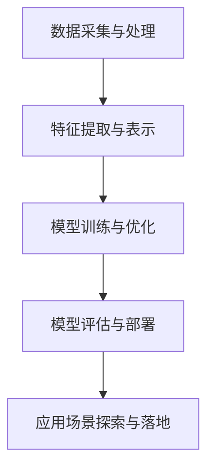

                 

关键词：AI大模型、创业、创新优势、技术策略、商业实践

摘要：本文旨在探讨AI大模型创业者在创新优势方面的关键策略和实践。通过分析AI大模型的发展背景、核心概念、算法原理、数学模型及实际应用，本文为AI大模型创业者提供了一套完整的创业指导框架，帮助他们在激烈的市场竞争中脱颖而出。

## 1. 背景介绍

人工智能（AI）作为一门交叉学科，正日益渗透到各个行业领域。近年来，随着深度学习、大数据和计算能力的飞速发展，AI大模型逐渐成为科技领域的研究热点。这些大模型通过模拟和拓展人类认知能力，为各行各业提供了前所未有的智能化解决方案。

然而，AI大模型创业面临诸多挑战。一方面，技术门槛高，需要掌握深度学习、自然语言处理等复杂算法；另一方面，市场竞争激烈，创新优势成为企业生存和发展的关键。如何利用创新优势在AI大模型创业中脱颖而出，成为创业者们亟待解决的问题。

## 2. 核心概念与联系

在AI大模型创业中，了解核心概念和架构是至关重要的。以下是一个简化的Mermaid流程图，展示了AI大模型的核心概念和联系：



### 2.1 数据采集与处理

数据是AI大模型的基石。创业者需要确保数据的质量和多样性，以支持模型的训练和优化。数据采集可以从多个来源获取，如公开数据集、企业内部数据、第三方数据平台等。数据处理包括数据清洗、归一化、去噪声等步骤，以提高数据质量。

### 2.2 特征提取与表示

特征提取是将原始数据转换为适合模型处理的形式。创业者需要选择合适的特征提取方法，如深度学习、特征工程等。特征表示是将特征映射到高维空间，以便模型能够更好地理解和学习。

### 2.3 模型训练与优化

模型训练是AI大模型的核心环节。创业者需要选择合适的模型架构、训练算法和优化策略，以提高模型的性能。常见的训练算法包括梯度下降、随机梯度下降、Adam等。优化策略包括学习率调整、批量大小选择、正则化等。

### 2.4 模型评估与部署

模型评估是判断模型性能的重要手段。创业者需要设计合适的评估指标，如准确率、召回率、F1值等。模型部署是将训练好的模型应用于实际场景，如自然语言处理、图像识别等。

### 2.5 应用场景探索与落地

创业者需要根据市场需求和行业特点，探索适合AI大模型的应用场景。通过不断迭代和优化，实现模型的落地应用。

## 3. 核心算法原理 & 具体操作步骤

### 3.1 算法原理概述

AI大模型的核心算法包括深度学习、神经网络、生成对抗网络等。以下是一个简单的算法原理概述：

- **深度学习**：通过多层神经网络对数据进行建模和预测。
- **神经网络**：由多个神经元组成，通过学习输入和输出之间的映射关系。
- **生成对抗网络**：由生成器和判别器组成，通过对抗训练生成逼真的数据。

### 3.2 算法步骤详解

以下是AI大模型算法的具体操作步骤：

1. **数据采集与处理**：收集并处理原始数据，确保数据质量。
2. **特征提取与表示**：选择特征提取方法，将原始数据转换为适合模型处理的形式。
3. **模型架构设计**：根据应用场景选择合适的模型架构，如卷积神经网络、循环神经网络等。
4. **模型训练与优化**：使用训练算法和优化策略对模型进行训练，提高模型性能。
5. **模型评估与部署**：评估模型性能，部署模型到实际应用场景。

### 3.3 算法优缺点

- **优点**：高精度、强泛化能力、自动特征提取。
- **缺点**：计算资源消耗大、训练时间较长、对数据依赖强。

### 3.4 算法应用领域

AI大模型在多个领域具有广泛的应用，如自然语言处理、图像识别、推荐系统、金融风控等。

## 4. 数学模型和公式 & 详细讲解 & 举例说明

### 4.1 数学模型构建

AI大模型的数学模型主要基于概率统计和优化理论。以下是一个简单的数学模型构建示例：

$$
\begin{aligned}
P(Y|X) &= \frac{f(X)}{1 + e^{-f(X)}} \\
L &= -\frac{1}{m} \sum_{i=1}^{m} \left[ y_i \ln(f(x_i)) + (1 - y_i) \ln(1 - f(x_i)) \right]
\end{aligned}
$$

### 4.2 公式推导过程

以下是公式的推导过程：

1. **逻辑回归**：假设输入特征向量为 $X$，输出概率为 $P(Y=1|X)$。
2. **损失函数**：采用对数似然损失函数 $L$，衡量模型预测与真实标签之间的差距。

### 4.3 案例分析与讲解

以自然语言处理中的文本分类任务为例，介绍AI大模型的应用。

1. **数据采集与处理**：收集并处理文本数据，包括文本清洗、分词、去停用词等步骤。
2. **特征提取与表示**：使用词嵌入技术将文本转换为向量表示。
3. **模型训练与优化**：使用逻辑回归模型进行训练，优化模型参数。
4. **模型评估与部署**：评估模型性能，部署模型到实际应用场景，如新闻分类、情感分析等。

## 5. 项目实践：代码实例和详细解释说明

### 5.1 开发环境搭建

在Python环境中，搭建AI大模型开发环境，包括安装TensorFlow、Keras等库。

```bash
pip install tensorflow
pip install keras
```

### 5.2 源代码详细实现

以下是一个简单的文本分类任务实现：

```python
from keras.models import Sequential
from keras.layers import Dense, Embedding, LSTM
from keras.preprocessing.sequence import pad_sequences

# 数据预处理
max_sequence_len = 100
data = pad_sequences(data, maxlen=max_sequence_len)

# 构建模型
model = Sequential()
model.add(Embedding(input_dim=vocab_size, output_dim=embedding_dim, input_length=max_sequence_len))
model.add(LSTM(units=128, dropout=0.2, recurrent_dropout=0.2))
model.add(Dense(units=1, activation='sigmoid'))

# 编译模型
model.compile(optimizer='adam', loss='binary_crossentropy', metrics=['accuracy'])

# 训练模型
model.fit(data, labels, epochs=10, batch_size=32, validation_split=0.1)
```

### 5.3 代码解读与分析

- **数据预处理**：将文本数据转换为序列，并填充为固定长度。
- **模型构建**：使用嵌入层和LSTM层构建模型。
- **编译模型**：设置优化器、损失函数和评价指标。
- **训练模型**：训练模型，并在验证集上评估性能。

### 5.4 运行结果展示

```python
# 评估模型
loss, accuracy = model.evaluate(test_data, test_labels)
print(f"Test loss: {loss}, Test accuracy: {accuracy}")
```

## 6. 实际应用场景

AI大模型在多个领域具有广泛的应用，如自然语言处理、图像识别、推荐系统、金融风控等。以下是一些实际应用场景：

- **自然语言处理**：文本分类、情感分析、机器翻译等。
- **图像识别**：物体检测、图像分类、图像生成等。
- **推荐系统**：基于内容的推荐、协同过滤等。
- **金融风控**：信用评分、欺诈检测、风险控制等。

## 7. 工具和资源推荐

### 7.1 学习资源推荐

- **书籍**：《深度学习》（Goodfellow、Bengio、Courville著）、《自然语言处理综论》（Jurafsky、Martin著）
- **在线课程**：Coursera上的《深度学习专项课程》、Udacity上的《自然语言处理纳米学位》

### 7.2 开发工具推荐

- **框架**：TensorFlow、PyTorch、Keras等。
- **数据处理**：NumPy、Pandas、Scikit-learn等。

### 7.3 相关论文推荐

- **深度学习**：《深度学习：卷积神经网络》（Convolutional Neural Networks）、《长短期记忆网络》（Long Short-Term Memory Networks）
- **自然语言处理**：《词嵌入技术》（Word Embeddings）、《注意力机制》（Attention Mechanism）

## 8. 总结：未来发展趋势与挑战

### 8.1 研究成果总结

AI大模型在各个领域取得了显著的成果，如自然语言处理、图像识别、推荐系统等。然而，AI大模型仍面临诸多挑战，如计算资源消耗、训练时间、数据依赖等。

### 8.2 未来发展趋势

- **计算能力提升**：随着硬件技术的不断发展，计算能力将得到大幅提升，为AI大模型的应用提供更好的支持。
- **跨领域融合**：AI大模型将在更多领域实现跨领域融合，如医疗、金融、教育等。
- **可解释性**：提高模型的可解释性，使其在更多实际场景中得到应用。

### 8.3 面临的挑战

- **数据隐私**：在保证数据隐私的前提下，充分利用数据资源。
- **模型泛化**：提高模型的泛化能力，降低对特定数据的依赖。
- **伦理道德**：关注AI大模型在伦理道德方面的挑战，确保其合法合规。

### 8.4 研究展望

未来，AI大模型将在更多领域发挥重要作用，推动社会进步。同时，创业者需要不断探索和创新，利用AI大模型的优势，在激烈的市场竞争中脱颖而出。

## 9. 附录：常见问题与解答

### 9.1 如何处理海量数据？

处理海量数据通常采用分布式计算和并行处理技术，如MapReduce、Spark等。此外，可以使用数据抽样、特征工程等方法降低数据量。

### 9.2 如何提高模型性能？

提高模型性能可以通过以下方法：增加训练数据、改进模型架构、调整优化策略、使用迁移学习等。

### 9.3 如何处理数据不平衡问题？

处理数据不平衡问题可以通过以下方法：数据重采样、类别加权、生成对抗网络等。

---

作者：禅与计算机程序设计艺术 / Zen and the Art of Computer Programming

