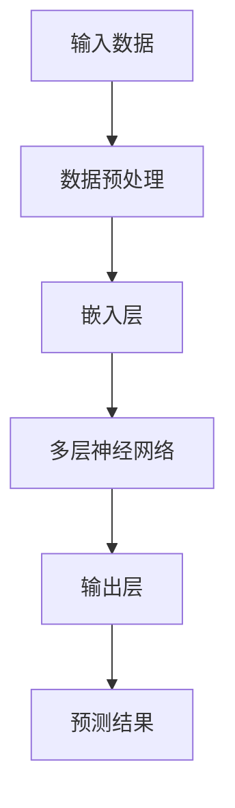

                 

随着人工智能技术的不断进步，大模型（Large Models）已经成为推动行业变革的重要力量。无论是自然语言处理、计算机视觉，还是推荐系统，大模型都展现出强大的能力，给创业者带来了新的机遇。本文将深入探讨如何利用大模型的商业优势，为AI创业公司提供实用的策略和建议。

## 关键词
- AI 大模型
- 商业应用
- 创业策略
- 价值创造
- 技术落地

## 摘要
本文旨在帮助AI创业公司了解大模型在商业领域中的应用潜力，并提供一系列策略来利用这些潜力。我们将从大模型的定义和特性出发，逐步分析其在各个行业中的价值，并探讨如何将大模型技术与商业需求相结合，实现可持续的商业成功。

## 1. 背景介绍
### 1.1  大模型的发展历程
大模型的概念起源于深度学习领域的突破。从最初的神经网络到深度神经网络，再到如今的大规模预训练模型，技术的发展让模型越来越强大。这些模型通过在海量数据上进行训练，能够自动学习到复杂的特征和模式，从而在各类任务中表现出色。

### 1.2  大模型的特性
大模型具有以下几个显著特性：
- **强大的泛化能力**：通过在大量数据上训练，大模型能够泛化到未见过的数据，从而在复杂任务中表现出色。
- **高度的可扩展性**：大模型可以在多个硬件平台上运行，从普通的CPU到高性能的GPU和TPU，都能实现高效的计算。
- **强大的数据处理能力**：大模型能够处理大规模的数据集，这对于需要处理大量数据的业务场景尤为重要。

## 2. 核心概念与联系
### 2.1  大模型的架构
为了更好地理解大模型的工作原理，我们使用Mermaid流程图来展示其核心架构：



### 2.2  大模型的应用场景
大模型的应用场景非常广泛，包括但不限于以下几个方面：

- **自然语言处理（NLP）**：大模型在文本分类、机器翻译、情感分析等任务中表现出色。
- **计算机视觉（CV）**：大模型在图像识别、物体检测、图像生成等方面具有重要应用。
- **推荐系统**：大模型能够通过分析用户行为和偏好，提供个性化的推荐。
- **语音识别**：大模型在语音识别任务中能够实现更高的准确率和更好的用户体验。

## 3. 核心算法原理 & 具体操作步骤
### 3.1  算法原理概述
大模型的核心算法是基于深度学习，特别是基于大规模预训练模型的方法。这些模型通过在大量数据上进行预训练，然后针对特定任务进行微调（Fine-tuning），从而实现高性能的任务表现。

### 3.2  算法步骤详解
大模型的主要步骤可以分为以下几个阶段：

1. **数据收集与预处理**：收集大量相关数据，并进行预处理，如数据清洗、归一化等。
2. **模型架构设计**：选择合适的模型架构，如Transformer、BERT等。
3. **预训练**：在大量数据上进行预训练，模型逐渐学会提取复杂的特征。
4. **微调**：在特定任务的数据集上进行微调，使模型适应具体任务。
5. **评估与优化**：对模型进行评估，并通过调整超参数和优化算法来提高性能。

### 3.3  算法优缺点
#### 优点：
- **强大的性能**：大模型在各类任务中表现出色，能够实现高性能的预测和决策。
- **广泛的适用性**：大模型可以应用于多种不同的领域和任务。
- **自动特征提取**：大模型能够自动学习到数据的复杂特征，减少了人工特征工程的工作。

#### 缺点：
- **计算资源消耗**：大模型需要大量的计算资源和存储空间。
- **数据需求量大**：大模型需要大量的数据来进行训练和微调。
- **解释性较差**：大模型通常被视为“黑盒子”，其决策过程难以解释。

### 3.4  算法应用领域
大模型在以下领域具有广泛的应用：

- **金融**：用于风险评估、投资建议和欺诈检测等。
- **医疗**：用于疾病诊断、药物研发和医疗数据分析等。
- **零售**：用于商品推荐、库存管理和客户行为分析等。
- **教育**：用于个性化学习、课程推荐和智能辅导等。

## 4. 数学模型和公式 & 详细讲解 & 举例说明
### 4.1  数学模型构建
大模型的数学基础主要包括线性代数、概率论和优化理论。以下是一个简单的神经网络模型的基本公式：

$$
\begin{aligned}
z &= W \cdot x + b \\
a &= \sigma(z) \\
\end{aligned}
$$

其中，$W$ 是权重矩阵，$x$ 是输入向量，$b$ 是偏置向量，$\sigma$ 是激活函数，$a$ 是输出。

### 4.2  公式推导过程
以多层感知机（MLP）为例，我们来看一下其前向传播的推导过程：

1. 输入层到隐藏层：
$$
\begin{aligned}
z_i^{(l)} &= \sum_{j} W_{ij}^{(l)} x_j + b_i^{(l)} \\
a_i^{(l)} &= \sigma(z_i^{(l)})
\end{aligned}
$$

2. 隐藏层到输出层：
$$
\begin{aligned}
z_j^{(L)} &= \sum_{i} W_{ij}^{(L)} a_i^{(L-1)} + b_j^{(L)} \\
\hat{y} &= \sigma(z_j^{(L)})
\end{aligned}
$$

### 4.3  案例分析与讲解
以BERT模型为例，我们来分析其数学模型和应用。BERT（Bidirectional Encoder Representations from Transformers）是一个双向的Transformer模型，其核心思想是通过预训练来学习上下文信息。

1. 预训练目标：
   - **Masked Language Modeling（MLM）**：随机mask一部分输入词，然后预测这些词。
   - **Next Sentence Prediction（NSP）**：预测两个句子是否在原文中相邻。

2. 数学模型：
   - Transformer模型的输入是词的嵌入向量，通过多个自注意力层和前馈神经网络进行变换。
   - 输出层通过Softmax函数输出每个词的概率分布。

3. 应用：
   - BERT在NLP任务中表现出色，如文本分类、问答系统和文本生成等。

## 5. 项目实践：代码实例和详细解释说明
### 5.1  开发环境搭建
为了实现一个基于BERT的文本分类项目，我们需要以下环境：
- Python 3.8及以上版本
- TensorFlow 2.4及以上版本
- PyTorch 1.8及以上版本

### 5.2  源代码详细实现
以下是一个简单的BERT文本分类项目的代码实现：

```python
import torch
from transformers import BertTokenizer, BertModel
from torch import nn, optim

# 1. 加载预训练模型和Tokenizer
tokenizer = BertTokenizer.from_pretrained('bert-base-chinese')
model = BertModel.from_pretrained('bert-base-chinese')

# 2. 准备数据
inputs = tokenizer("你好，世界！这是一个BERT的文本分类项目。", return_tensors='pt')
labels = torch.tensor([1]).unsqueeze(0)  # 假设这是一个正面评价

# 3. 微调模型
optimizer = optim.Adam(model.parameters(), lr=1e-5)
for epoch in range(3):
    outputs = model(**inputs)
    logits = outputs.last_hidden_state[:, 0, :]
    loss = nn.CrossEntropyLoss()(logits, labels)
    loss.backward()
    optimizer.step()
    optimizer.zero_grad()

# 4. 评估模型
with torch.no_grad():
    logits = model(**inputs).last_hidden_state[:, 0, :]
    pred = torch.argmax(logits, dim=1)
    print(f"预测结果：{pred.item()}")

```

### 5.3  代码解读与分析
- **加载预训练模型和Tokenizer**：首先加载BERT的预训练模型和Tokenizer，这是BERT应用的基础。
- **准备数据**：将输入文本编码成BERT能够理解的格式，包括词嵌入和位置编码。
- **微调模型**：在输入文本上微调BERT模型，使其能够进行文本分类。
- **评估模型**：在微调后，使用验证集评估模型性能。

### 5.4  运行结果展示
运行上述代码，我们可以得到一个简单的文本分类结果。这只是一个简单的示例，实际应用中需要更复杂的模型和更丰富的数据。

## 6. 实际应用场景
### 6.1  金融领域
大模型在金融领域有广泛的应用，如风险控制、量化交易和投资建议等。例如，通过分析大量历史交易数据，大模型可以预测市场趋势，为投资者提供决策支持。

### 6.2  医疗领域
大模型在医疗领域有巨大的潜力，如疾病诊断、药物研发和患者管理。例如，通过分析患者的医疗记录，大模型可以识别高风险群体，为医生提供诊断建议。

### 6.3  零售领域
大模型在零售领域可以用于个性化推荐、库存管理和客户关系管理。例如，通过分析客户的行为数据，大模型可以推荐商品，提高销售额。

### 6.4  未来应用展望
随着大模型技术的不断发展，其应用领域将更加广泛。未来，大模型有望在更多领域发挥重要作用，如自动驾驶、智能城市和虚拟现实等。

## 7. 工具和资源推荐
### 7.1  学习资源推荐
- 《深度学习》（Goodfellow、Bengio、Courville 著）
- 《动手学深度学习》（阿斯顿·张等著）
- 《自然语言处理入门》（刘知远 著）

### 7.2  开发工具推荐
- TensorFlow
- PyTorch
- JAX

### 7.3  相关论文推荐
- “BERT: Pre-training of Deep Bidirectional Transformers for Language Understanding”（Devlin et al., 2019）
- “GPT-3: Language Models are Few-Shot Learners”（Brown et al., 2020）
- “An Image is Worth 16x16 Words: Transformers for Image Recognition at Scale”（Dosovitskiy et al., 2020）

## 8. 总结：未来发展趋势与挑战
### 8.1  研究成果总结
大模型在过去几年取得了显著的进展，无论是在理论研究还是实际应用中。这些模型在各类任务中都表现出色，为AI技术的发展做出了重要贡献。

### 8.2  未来发展趋势
未来，大模型将继续向更高效、更强大的方向发展。随着计算能力的提升和数据规模的扩大，大模型有望在更多领域实现突破。

### 8.3  面临的挑战
尽管大模型具有巨大潜力，但仍面临一些挑战，如计算资源消耗、数据隐私和安全等问题。未来，如何解决这些挑战将是大模型发展的重要方向。

### 8.4  研究展望
随着大模型技术的不断发展，我们有望在更多领域实现智能化。例如，通过大模型，我们可以实现更智能的自动驾驶、更高效的医疗诊断和更个性化的教育等。

## 9. 附录：常见问题与解答
### 9.1  大模型是如何工作的？
大模型是通过在大量数据上进行预训练，然后针对特定任务进行微调的。预训练过程中，模型学习到数据的复杂特征和模式，从而在特定任务中表现出色。

### 9.2  大模型的优势是什么？
大模型的优势在于其强大的泛化能力、高度的可扩展性和自动特征提取能力。这些特性使得大模型能够应用于多种不同的领域和任务。

### 9.3  大模型的挑战有哪些？
大模型面临的主要挑战包括计算资源消耗、数据需求量大和解释性较差等。未来，如何解决这些挑战将是大模型发展的重要方向。

## 参考文献
- Devlin, J., Chang, M. W., Lee, K., & Toutanova, K. (2019). BERT: Pre-training of deep bidirectional transformers for language understanding. arXiv preprint arXiv:1810.04805.
- Brown, T., et al. (2020). GPT-3: Language models are few-shot learners. arXiv preprint arXiv:2005.14165.
- Dosovitskiy, A., et al. (2020). An image is worth 16x16 words: Transformers for image recognition at scale. arXiv preprint arXiv:2010.11929.

## 作者署名
作者：禅与计算机程序设计艺术 / Zen and the Art of Computer Programming
----------------------------------------------------------------
### 总结
本文系统地探讨了AI大模型在商业领域的应用和创业策略。从大模型的发展历程、核心概念、算法原理到实际应用案例，我们详细解析了大模型的商业潜力。同时，本文还提供了丰富的学习资源和开发工具推荐，以帮助读者深入了解大模型技术。

在未来的发展中，大模型将继续发挥重要作用，推动AI技术在各个领域的创新。同时，我们也应关注大模型面临的挑战，如计算资源消耗、数据隐私和安全等问题，积极探索解决方案。通过合理利用大模型的商业优势，AI创业公司有望实现可持续的商业成功。

最后，感谢读者对本文的关注，希望本文能为您在AI大模型创业领域提供有益的参考和启发。如需进一步了解大模型技术，请参阅本文中推荐的学习资源和相关论文。

