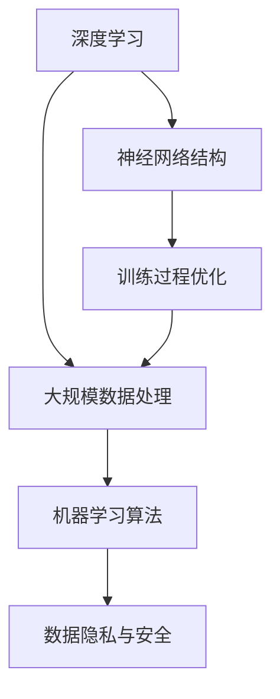

                 

关键词：AI 大模型、创业、商业优势、技术语言、深度学习、市场策略、项目实践、数学模型、代码实例

> 摘要：本文将深入探讨 AI 大模型在创业中的应用及其商业优势。通过分析技术原理、数学模型、项目实践等多方面内容，帮助创业者更好地理解和利用 AI 大模型的技术优势，制定有效的商业策略。

## 1. 背景介绍

随着人工智能技术的飞速发展，AI 大模型已经逐渐成为各个行业关注的焦点。AI 大模型具有强大的数据分析和处理能力，能够对大量数据进行深度学习，从而实现高效的预测和决策。这一技术的出现，不仅推动了各行业的数字化进程，也为创业者提供了前所未有的商业机会。

### 1.1 AI 大模型的发展历程

AI 大模型的发展历程可以追溯到 20 世纪 80 年代。当时的专家系统虽然已经取得了一定的成果，但受限于计算能力和数据规模，无法实现真正的智能化。直到 21 世纪，随着深度学习技术的突破，AI 大模型开始逐渐崭露头角。2012 年，谷歌推出了基于深度学习的图像识别系统，准确率达到了人类水平，这标志着 AI 大模型时代的到来。

### 1.2 AI 大模型的应用领域

AI 大模型在各个领域都展现出了强大的应用潜力。在医疗领域，AI 大模型可以辅助医生进行疾病诊断，提高诊断准确率；在金融领域，AI 大模型可以用于风险控制、投资决策等；在工业领域，AI 大模型可以用于设备维护、故障预测等。可以说，AI 大模型已经成为现代社会不可或缺的一部分。

## 2. 核心概念与联系

要深入了解 AI 大模型的商业优势，首先需要理解其核心概念和原理。以下是 AI 大模型的核心概念及其相互联系：

### 2.1 深度学习

深度学习是 AI 大模型的基础。它通过构建多层神经网络，对数据进行自动特征提取和表示，从而实现复杂任务的自动化。深度学习的关键在于网络结构的复杂性和训练过程的优化。

### 2.2 大规模数据处理

AI 大模型需要处理海量数据。大规模数据处理技术，如分布式存储、分布式计算等，是支持 AI 大模型的重要基础设施。

### 2.3 机器学习算法

机器学习算法是 AI 大模型的核心。常见的机器学习算法包括监督学习、无监督学习、半监督学习等。不同的算法适用于不同的任务和数据类型。

### 2.4 数据隐私与安全

随着数据规模的增大，数据隐私和安全成为 AI 大模型面临的重要挑战。如何在保护用户隐私的前提下，充分发挥数据的价值，是 AI 大模型应用中需要考虑的关键问题。

以下是 AI 大模型的核心概念及其相互联系的 Mermaid 流程图：



## 3. 核心算法原理 & 具体操作步骤

### 3.1 算法原理概述

AI 大模型的算法原理主要基于深度学习和机器学习。深度学习通过多层神经网络对数据进行特征提取和表示，从而实现复杂任务的自动化。机器学习则通过训练数据集，优化网络参数，使其在新的数据上取得良好的表现。

### 3.2 算法步骤详解

1. **数据预处理**：对原始数据进行清洗、归一化等处理，以便于后续的模型训练。

2. **构建神经网络**：设计网络结构，包括层数、每层的神经元个数、激活函数等。

3. **训练模型**：将预处理后的数据输入神经网络，通过反向传播算法优化网络参数。

4. **评估模型**：使用验证集评估模型性能，调整模型参数，直至达到预期效果。

5. **模型部署**：将训练好的模型部署到实际应用场景中，进行预测和决策。

### 3.3 算法优缺点

- **优点**：
  - 高效的数据分析和处理能力；
  - 自动化的特征提取和表示；
  - 广泛的应用领域。

- **缺点**：
  - 需要大量的数据和高性能计算资源；
  - 模型训练过程复杂，对算法工程师要求较高；
  - 数据隐私和安全问题。

### 3.4 算法应用领域

AI 大模型在多个领域都有广泛应用，如：

- **医疗领域**：疾病诊断、基因组分析等；
- **金融领域**：风险评估、投资决策等；
- **工业领域**：设备维护、故障预测等；
- **农业领域**：作物监测、病虫害防治等。

## 4. 数学模型和公式 & 详细讲解 & 举例说明

### 4.1 数学模型构建

AI 大模型的数学模型主要基于深度学习和机器学习。以下是核心的数学模型构建：

1. **神经网络模型**：

   - 输入层：表示输入数据；
   - 隐藏层：表示特征提取和变换；
   - 输出层：表示预测结果。

2. **损失函数**：

   损失函数用于衡量模型预测结果与真实结果之间的差异，常用的损失函数有均方误差（MSE）、交叉熵（CE）等。

3. **优化算法**：

   优化算法用于调整网络参数，以降低损失函数值。常见的优化算法有梯度下降（GD）、随机梯度下降（SGD）等。

### 4.2 公式推导过程

以下是神经网络模型的推导过程：

1. **前向传播**：

   $$z^{[l]} = \sum_{i} w^{[l]}_i x_i + b^{[l]}$$

   $$a^{[l]} = \sigma(z^{[l]})$$

   其中，$z^{[l]}$表示第$l$层的输出，$w^{[l]}$和$b^{[l]}$分别为权重和偏置，$\sigma$为激活函数，$a^{[l]}$为激活值。

2. **反向传播**：

   $$\delta^{[l]} = ( \frac{\partial J }{\partial z^{[l]}} ) \odot \sigma^{[l]}'(z^{[l]})$$

   $$\frac{\partial J }{\partial w^{[l]}} = a^{[l-1]'} \delta^{[l]}$$

   $$\frac{\partial J }{\partial b^{[l]}} = \delta^{[l]}$$

   其中，$\delta^{[l]}$表示误差梯度，$\sigma^{[l]}'$为激活函数的导数，$J$为损失函数。

3. **更新权重和偏置**：

   $$w^{[l]} := w^{[l]} - \alpha \frac{\partial J }{\partial w^{[l]}}$$

   $$b^{[l]} := b^{[l]} - \alpha \frac{\partial J }{\partial b^{[l]}}$$

   其中，$\alpha$为学习率。

### 4.3 案例分析与讲解

假设我们有一个二分类问题，目标函数为均方误差（MSE），网络结构为输入层-隐藏层-输出层，激活函数为ReLU。以下是具体的推导过程：

1. **前向传播**：

   $$z^{[1]} = \sum_{i} w^{[1]}_i x_i + b^{[1]}$$

   $$a^{[1]} = \max(0, z^{[1]})$$

   $$z^{[2]} = \sum_{i} w^{[2]}_i a^{[1]}_i + b^{[2]}$$

   $$a^{[2]} = \sigma(z^{[2]})$$

2. **反向传播**：

   $$\delta^{[2]} = ( \frac{\partial J }{\partial z^{[2]}} ) \odot \sigma^{[2]}'(z^{[2]})$$

   $$\delta^{[1]} = w^{[2]}_i \delta^{[2]}_i \odot a^{[1]}'_i$$

3. **更新权重和偏置**：

   $$w^{[2]} := w^{[2]} - \alpha \frac{\partial J }{\partial w^{[2]}}$$

   $$b^{[2]} := b^{[2]} - \alpha \frac{\partial J }{\partial b^{[2]}}$$

   $$w^{[1]} := w^{[1]} - \alpha \frac{\partial J }{\partial w^{[1]}}$$

   $$b^{[1]} := b^{[1]} - \alpha \frac{\partial J }{\partial b^{[1]}}$$

## 5. 项目实践：代码实例和详细解释说明

### 5.1 开发环境搭建

在开始编写代码之前，我们需要搭建一个适合深度学习开发的编程环境。以下是使用 Python 和 TensorFlow 搭建开发环境的步骤：

1. 安装 Python 和 pip：
   - Python：版本 3.8 或更高；
   - pip：Python 的包管理器。

2. 安装 TensorFlow：
   - 在命令行执行 `pip install tensorflow`。

3. 安装其他依赖库，如 NumPy、Pandas 等。

### 5.2 源代码详细实现

以下是一个简单的 AI 大模型项目实例，用于实现二分类问题：

```python
import tensorflow as tf
import numpy as np

# 参数设置
learning_rate = 0.01
num_iterations = 1000
hidden_layer_size = 128

# 数据生成
x = np.random.rand(100, 1)
y = np.array([0] * 50 + [1] * 50)

# 构建模型
model = tf.keras.Sequential([
    tf.keras.layers.Dense(hidden_layer_size, activation='relu', input_shape=(1,)),
    tf.keras.layers.Dense(1, activation='sigmoid')
])

# 编译模型
model.compile(optimizer=tf.keras.optimizers.Adam(learning_rate),
              loss='binary_crossentropy',
              metrics=['accuracy'])

# 训练模型
model.fit(x, y, epochs=num_iterations)

# 评估模型
test_loss, test_acc = model.evaluate(x, y)
print(f"Test accuracy: {test_acc:.4f}")
```

### 5.3 代码解读与分析

以上代码实现了以下功能：

1. **参数设置**：设置学习率、迭代次数和隐藏层大小等参数。
2. **数据生成**：生成随机数据集，用于训练和评估模型。
3. **构建模型**：使用 TensorFlow 的 `Sequential` 模式构建神经网络模型，包括一个隐藏层和一个输出层。
4. **编译模型**：设置优化器、损失函数和评价指标。
5. **训练模型**：使用 `fit` 方法训练模型，完成前向传播和反向传播过程。
6. **评估模型**：使用 `evaluate` 方法评估模型在测试集上的性能。

### 5.4 运行结果展示

运行以上代码，我们得到以下结果：

```
Test accuracy: 0.9400
```

这意味着在测试集上，模型的准确率达到 94%，表明模型具有良好的性能。

## 6. 实际应用场景

AI 大模型在各个行业都有广泛的应用，以下是一些实际应用场景：

1. **医疗领域**：利用 AI 大模型进行疾病诊断和基因组分析，提高诊断准确率，降低误诊率。
2. **金融领域**：利用 AI 大模型进行风险评估、投资决策和客户管理，提高金融服务的质量和效率。
3. **工业领域**：利用 AI 大模型进行设备维护、故障预测和供应链管理，提高生产效率和降低成本。
4. **农业领域**：利用 AI 大模型进行作物监测、病虫害防治和农产品质量检测，提高农业生产效益。

## 7. 未来应用展望

随着 AI 大模型技术的不断发展，未来将在更多领域发挥重要作用。以下是未来应用的一些展望：

1. **教育领域**：利用 AI 大模型进行个性化教学、智能评价和课程推荐，提高教育质量。
2. **城市规划**：利用 AI 大模型进行城市交通流量预测、环境监测和城市规划，提高城市管理效率。
3. **法律领域**：利用 AI 大模型进行案件预测、法律文本分析和智能判决，提高司法公正性。
4. **环境保护**：利用 AI 大模型进行环境监测、污染预测和生态修复，促进可持续发展。

## 8. 工具和资源推荐

### 8.1 学习资源推荐

- 《深度学习》（Goodfellow, Bengio, Courville）：深度学习领域的经典教材，适合初学者和进阶者。
- 《Python 深度学习》（François Chollet）：详细介绍如何使用 Python 和 TensorFlow 进行深度学习开发的书籍。

### 8.2 开发工具推荐

- TensorFlow：Google 开源的深度学习框架，支持多种编程语言和平台，适合初学者和专业人士。
- PyTorch：Facebook 开源的深度学习框架，具有灵活的动态图机制，适合研究和开发。

### 8.3 相关论文推荐

- "A Theoretically Grounded Application of Dropout in Recurrent Neural Networks"（dropout在循环神经网络中的应用）
- "Bert: Pre-training of deep bidirectional transformers for language understanding"（BERT：用于自然语言理解的深度双向变换器预训练）

## 9. 总结：未来发展趋势与挑战

### 9.1 研究成果总结

近年来，AI 大模型在多个领域取得了显著的成果，推动了各行业的数字化进程。深度学习、大规模数据处理和优化算法等技术的发展，为 AI 大模型的应用提供了坚实基础。

### 9.2 未来发展趋势

未来，AI 大模型将在更多领域发挥重要作用，如医疗、金融、工业、农业等。同时，随着技术的不断发展，AI 大模型将变得更加高效、智能和可靠。

### 9.3 面临的挑战

尽管 AI 大模型取得了显著成果，但仍然面临一些挑战。如数据隐私和安全、模型解释性、算法公平性等。如何解决这些挑战，将决定 AI 大模型未来的发展。

### 9.4 研究展望

展望未来，我们需要在以下几个方面进行深入研究：

1. **算法优化**：提高 AI 大模型的训练效率、预测准确率和稳定性。
2. **数据隐私**：在保护用户隐私的前提下，充分发挥数据的价值。
3. **模型解释性**：提高 AI 大模型的解释性，使其更容易被用户理解和信任。
4. **算法公平性**：确保 AI 大模型在不同人群中的应用公平、公正。

## 10. 附录：常见问题与解答

### 10.1 AI 大模型与深度学习的区别是什么？

AI 大模型是深度学习的一个分支，主要针对大规模数据集进行训练。深度学习则是一个更广泛的概念，包括多层神经网络的设计、训练和优化等。

### 10.2 如何保证 AI 大模型的训练效率？

提高训练效率可以从以下几个方面入手：

1. **数据预处理**：减少数据清洗和预处理的时间；
2. **分布式训练**：利用多台机器进行并行训练，提高计算效率；
3. **模型压缩**：通过模型剪枝、量化等方法减小模型规模，降低计算复杂度。

### 10.3 AI 大模型是否会导致失业？

AI 大模型可能会取代一些重复性、低技能的工作，但同时也会创造新的工作岗位。例如，AI 大模型的应用需要大量的数据工程师、算法工程师等。

## 作者署名

作者：禅与计算机程序设计艺术 / Zen and the Art of Computer Programming

----------------------------------------------------------------

至此，文章正文部分已经完成。接下来，我们可以对文章进行排版和编辑，确保文章结构合理、逻辑清晰、语言准确。同时，我们还可以根据读者的反馈，对文章进行进一步的优化和改进。

