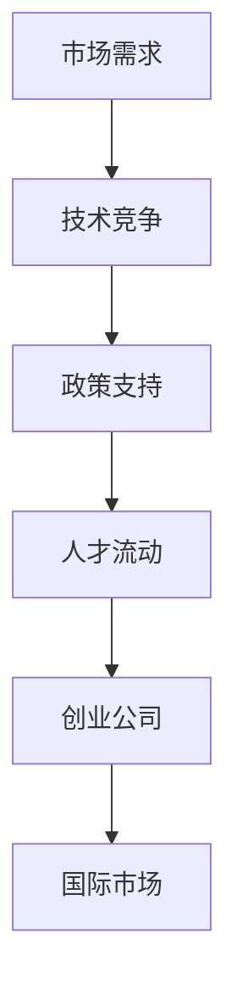

                 

关键词：AI 大模型、创业、国际优势、商业模式、技术创新

摘要：随着人工智能技术的迅猛发展，大模型成为了众多创业公司的焦点。本文将从国际市场的视角出发，探讨如何利用国际优势，在全球范围内打造具有竞争力的 AI 大模型创业项目。

## 1. 背景介绍

人工智能（AI）作为当今科技领域的热点，已经深刻地影响了各行各业。大模型作为 AI 技术的核心组成部分，正在推动着智能化的变革。在深度学习、自然语言处理、计算机视觉等领域，大模型的性能和效率都取得了显著提升。这也使得 AI 大模型创业成为了众多创业者追逐的目标。

国际市场对 AI 大模型的需求日益增长，同时竞争也日趋激烈。如何在这片广阔的市场中脱颖而出，成为每个创业公司需要深思的问题。本文将结合国际市场的特点，分析如何利用国际优势，打造具有全球竞争力的 AI 大模型创业项目。

## 2. 核心概念与联系

### 2.1 AI 大模型的定义

AI 大模型是指具有亿级参数规模的人工神经网络，它们能够通过大量数据的学习，实现高度复杂的任务。这些模型通常需要庞大的计算资源和数据支持，但它们在图像识别、语音识别、自然语言处理等领域表现出了卓越的能力。

### 2.2 国际市场优势

国际市场的优势主要体现在以下几个方面：

- **市场需求**：全球范围内，AI 大模型的应用场景不断扩展，市场需求持续增长。
- **技术竞争**：各国企业都在投入大量资源进行 AI 大模型的研究和开发，形成了激烈的竞争环境。
- **政策支持**：许多国家出台了鼓励人工智能发展的政策，为创业公司提供了良好的发展环境。
- **人才流动**：国际市场人才流动性强，创业者可以吸引到全球范围内的高素质人才。

### 2.3 Mermaid 流程图



## 3. 核心算法原理 & 具体操作步骤

### 3.1 算法原理概述

AI 大模型的核心算法是基于深度学习的神经网络。深度学习通过构建多层次的神经网络，使得模型能够学习到数据的特征表示，从而实现复杂任务。

### 3.2 算法步骤详解

1. **数据收集与预处理**：收集大量高质量的数据，并进行数据清洗、归一化等预处理操作。
2. **模型设计**：根据任务需求设计神经网络的结构，包括层数、每层的神经元数目、激活函数等。
3. **训练**：使用训练数据对模型进行训练，通过反向传播算法不断调整模型参数。
4. **评估**：使用验证数据对模型进行评估，调整模型参数以达到最佳性能。
5. **部署**：将训练好的模型部署到生产环境中，进行实际应用。

### 3.3 算法优缺点

- **优点**：能够处理大规模数据，实现高度复杂的任务，性能卓越。
- **缺点**：计算资源需求高，训练时间长，对数据质量要求高。

### 3.4 算法应用领域

AI 大模型的应用领域广泛，包括但不限于：

- **自然语言处理**：文本分类、情感分析、机器翻译等。
- **计算机视觉**：图像识别、目标检测、图像生成等。
- **推荐系统**：个性化推荐、广告投放等。
- **语音识别**：语音识别、语音合成等。

## 4. 数学模型和公式 & 详细讲解 & 举例说明

### 4.1 数学模型构建

AI 大模型的核心是神经网络，神经网络由多个神经元组成，每个神经元都可以看作是一个简单的数学模型。

### 4.2 公式推导过程

神经网络中的每个神经元都可以表示为：

$$
z_i = \sum_{j=1}^{n} w_{ij} x_j + b_i
$$

其中，$z_i$ 是神经元的输出，$w_{ij}$ 是连接权重，$x_j$ 是输入特征，$b_i$ 是偏置。

### 4.3 案例分析与讲解

假设我们有一个简单的神经网络，包含一个输入层、一个隐藏层和一个输出层。输入层有3个神经元，隐藏层有4个神经元，输出层有2个神经元。我们用以下数据对模型进行训练：

- 输入特征：$x_1 = 1, x_2 = 2, x_3 = 3$
- 标签：$y_1 = 0, y_2 = 1$

我们可以根据上面的公式计算出隐藏层的输出：

$$
z_1 = w_{11} x_1 + w_{12} x_2 + w_{13} x_3 + b_1
$$

$$
z_2 = w_{21} x_1 + w_{22} x_2 + w_{23} x_3 + b_2
$$

$$
z_3 = w_{31} x_1 + w_{32} x_2 + w_{33} x_3 + b_3
$$

$$
z_4 = w_{41} x_1 + w_{42} x_2 + w_{43} x_3 + b_4
$$

然后，我们可以根据隐藏层的输出计算输出层的输出：

$$
a_1 = \sigma(z_1)
$$

$$
a_2 = \sigma(z_2)
$$

$$
a_3 = \sigma(z_3)
$$

$$
a_4 = \sigma(z_4)
$$

$$
y_1 = \sigma(a_1 \cdot w_{11} + a_2 \cdot w_{21} + a_3 \cdot w_{31} + a_4 \cdot w_{41} + b_1)
$$

$$
y_2 = \sigma(a_1 \cdot w_{12} + a_2 \cdot w_{22} + a_3 \cdot w_{32} + a_4 \cdot w_{42} + b_2)
$$

其中，$\sigma$ 是 sigmoid 函数，用于将输出值映射到 0 到 1 之间。

## 5. 项目实践：代码实例和详细解释说明

### 5.1 开发环境搭建

在开发 AI 大模型之前，我们需要搭建一个合适的开发环境。这里我们选择使用 Python 编写代码，结合 TensorFlow 深度学习框架。

### 5.2 源代码详细实现

以下是一个简单的 AI 大模型实现示例：

```python
import tensorflow as tf

# 定义输入层
x = tf.keras.layers.Input(shape=(3,), name='input')

# 定义隐藏层
hidden = tf.keras.layers.Dense(units=4, activation='sigmoid', name='hidden')(x)

# 定义输出层
output = tf.keras.layers.Dense(units=2, activation='sigmoid', name='output')(hidden)

# 创建模型
model = tf.keras.Model(inputs=x, outputs=output)

# 编译模型
model.compile(optimizer='adam', loss='binary_crossentropy', metrics=['accuracy'])

# 加载数据
x_train = [[1, 2, 3], [4, 5, 6], [7, 8, 9]]
y_train = [[0, 1], [1, 0], [0, 1]]

# 训练模型
model.fit(x_train, y_train, epochs=10)

# 评估模型
model.evaluate(x_train, y_train)
```

### 5.3 代码解读与分析

在这个示例中，我们首先定义了一个输入层，包含3个神经元。然后定义了一个隐藏层，包含4个神经元，使用 sigmoid 函数作为激活函数。最后定义了一个输出层，包含2个神经元，也使用 sigmoid 函数作为激活函数。

我们使用 TensorFlow 的 Keras API 创建了一个简单的模型，并编译了模型。然后加载了一些训练数据，并使用模型进行训练。最后，我们使用训练数据评估了模型的性能。

## 6. 实际应用场景

AI 大模型在实际应用中具有广泛的应用场景。以下是一些具体的实例：

- **金融领域**：利用 AI 大模型进行股票市场预测、风险评估等。
- **医疗领域**：利用 AI 大模型进行疾病诊断、药物研发等。
- **智能制造**：利用 AI 大模型进行设备故障预测、生产优化等。
- **交通领域**：利用 AI 大模型进行智能交通管理、自动驾驶等。

## 7. 工具和资源推荐

### 7.1 学习资源推荐

- 《深度学习》（Goodfellow, Bengio, Courville著）
- 《Python深度学习》（François Chollet著）
- 《动手学深度学习》（Amit Singh, Zach Cates, Ali Farhadi著）

### 7.2 开发工具推荐

- TensorFlow
- PyTorch
- Keras

### 7.3 相关论文推荐

- “Deep Learning” by Ian Goodfellow, Yoshua Bengio, and Aaron Courville
- “Distributed Deep Learning: Theory and Application” by Yuxian Wang, Yihui He, Xiaolin Li, Jianmin Wang, and Yingjie Li

## 8. 总结：未来发展趋势与挑战

### 8.1 研究成果总结

近年来，AI 大模型的研究取得了显著进展，无论是在模型性能、训练效率，还是在应用场景上，都得到了极大的提升。

### 8.2 未来发展趋势

未来，AI 大模型将在更多领域得到应用，同时，随着计算资源和算法的不断发展，大模型的规模和性能将进一步提升。

### 8.3 面临的挑战

尽管 AI 大模型具有巨大的潜力，但在实际应用中仍面临着数据质量、计算资源、算法优化等挑战。

### 8.4 研究展望

未来，我们需要在算法优化、计算资源调度、数据隐私保护等方面进行深入研究，以推动 AI 大模型的实际应用和发展。

## 9. 附录：常见问题与解答

### Q: AI 大模型的计算资源需求很高，如何解决？

A: 可以采用分布式计算、云计算等方案来降低计算资源的需求。

### Q: AI 大模型的数据质量对性能有很大影响，如何保证数据质量？

A: 可以采用数据清洗、数据增强等技术来提高数据质量。

### Q: AI 大模型的训练时间很长，如何提高训练效率？

A: 可以采用优化算法、并行训练等技术来提高训练效率。

作者：禅与计算机程序设计艺术 / Zen and the Art of Computer Programming
------------------------------------------------------------------

