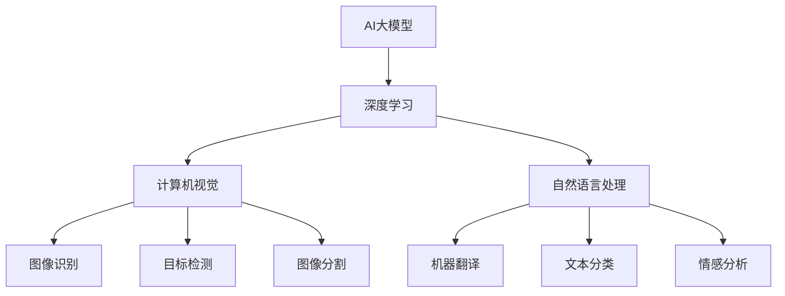

                 

关键词：AI大模型，市场优势，创业，商业模式，技术策略

> 摘要：本文将深入探讨AI大模型在创业中的应用和市场优势，通过分析技术趋势、商业模式和实际案例，为创业者提供实用的指导和建议。

## 1. 背景介绍

近年来，人工智能（AI）技术取得了飞速发展，特别是大模型（Large Models）的兴起，使得AI在自然语言处理、计算机视觉、语音识别等领域取得了显著突破。大模型通过深度学习技术，从大量数据中学习，具备强大的表示和推理能力。随着算力的提升和数据的积累，大模型的性能不断提升，为各行业带来了新的机会和挑战。

AI大模型创业已成为一股不可忽视的力量，许多创业公司通过AI大模型技术实现了颠覆性创新，取得了巨大的市场成功。然而，AI大模型创业并非易事，创业者需要深入理解技术原理，把握市场机遇，制定合适的技术和市场策略。

## 2. 核心概念与联系

为了更好地理解AI大模型创业，我们首先需要了解几个核心概念：

### 2.1 AI大模型

AI大模型是指通过深度学习技术，从海量数据中学习并具备强大表示和推理能力的模型。这些模型通常包含数十亿甚至数万亿个参数，能够在各种任务上取得优异的性能。

### 2.2 深度学习

深度学习是一种机器学习的方法，通过多层神经网络进行数据表示和学习，具有强大的特征提取和模式识别能力。深度学习的核心是神经网络，特别是卷积神经网络（CNN）和循环神经网络（RNN）。

### 2.3 计算机视觉

计算机视觉是AI的一个重要分支，旨在使计算机具备处理和解释视觉信息的能力。计算机视觉技术广泛应用于图像识别、目标检测、图像分割等领域。

### 2.4 自然语言处理

自然语言处理（NLP）是AI的另一个重要分支，旨在使计算机理解和生成自然语言。NLP技术广泛应用于机器翻译、文本分类、情感分析等领域。

下面是AI大模型创业中涉及的关键概念和它们之间的联系，使用Mermaid流程图表示：



## 3. 核心算法原理 & 具体操作步骤

### 3.1 算法原理概述

AI大模型的算法原理主要基于深度学习，尤其是变分自编码器（VAE）、生成对抗网络（GAN）和变换器（Transformer）等前沿技术。这些算法通过多层神经网络，对数据进行编码和解码，从而实现对数据的表示和生成。

### 3.2 算法步骤详解

#### 3.2.1 数据收集与预处理

首先，需要收集大量的数据，并进行预处理，包括数据清洗、数据增强和数据标准化等步骤。

#### 3.2.2 模型设计与训练

接着，设计适合任务需求的神经网络结构，并使用预处理后的数据对模型进行训练。训练过程中，通过反向传播算法不断调整模型参数，使得模型能够在目标任务上取得优异的性能。

#### 3.2.3 模型评估与优化

训练完成后，对模型进行评估，并根据评估结果对模型进行优化。常用的评估指标包括准确率、召回率、F1值等。

### 3.3 算法优缺点

#### 优点

- **强大的表示能力**：AI大模型能够从海量数据中提取丰富的特征信息，具有强大的表示能力。
- **良好的泛化能力**：通过大规模训练，AI大模型具有良好的泛化能力，能够在不同任务上取得优异的性能。
- **自适应性强**：AI大模型可以根据不同的任务需求进行调整和优化。

#### 缺点

- **计算资源需求高**：AI大模型通常包含数十亿个参数，训练和推理过程中需要大量的计算资源。
- **数据依赖性强**：AI大模型对数据质量有较高的要求，数据不足或不准确可能导致模型性能下降。

### 3.4 算法应用领域

AI大模型在各个领域都有广泛的应用，主要包括：

- **计算机视觉**：图像识别、目标检测、图像分割等。
- **自然语言处理**：机器翻译、文本分类、情感分析等。
- **语音识别**：语音识别、语音生成等。
- **推荐系统**：基于用户行为的推荐、基于内容的推荐等。

## 4. 数学模型和公式 & 详细讲解 & 举例说明

### 4.1 数学模型构建

AI大模型的核心是神经网络，神经网络的基本单元是神经元。神经元的数学模型通常可以表示为：

\[ y = \sigma(z) = \frac{1}{1 + e^{-z}} \]

其中，\( z \) 是输入，\( \sigma \) 是激活函数，常用的激活函数有Sigmoid、ReLU等。

### 4.2 公式推导过程

以ReLU激活函数为例，其数学公式为：

\[ y = \max(0, z) \]

ReLU函数的导数为：

\[ \frac{dy}{dz} = \begin{cases} 
1 & \text{if } z > 0 \\
0 & \text{if } z \leq 0 
\end{cases} \]

### 4.3 案例分析与讲解

假设我们有一个二分类问题，使用ReLU激活函数的神经网络进行分类。给定输入特征向量 \( x \)，网络的输出 \( y \) 可以表示为：

\[ y = \max(0, w_1 \cdot x_1 + w_2 \cdot x_2 + b) \]

其中，\( w_1 \) 和 \( w_2 \) 是权重，\( b \) 是偏置。

假设 \( x_1 = 2, x_2 = 3 \)，且 \( w_1 = 1, w_2 = 2 \)，则：

\[ y = \max(0, 1 \cdot 2 + 2 \cdot 3 + b) = \max(0, 8 + b) \]

如果 \( b = 0 \)，则 \( y = 8 \)，输出为正类；如果 \( b < -8 \)，则 \( y = 0 \)，输出为负类。

## 5. 项目实践：代码实例和详细解释说明

### 5.1 开发环境搭建

为了演示AI大模型的应用，我们将使用Python编程语言和TensorFlow框架进行开发。首先，需要安装Python和TensorFlow：

```bash
pip install python tensorflow
```

### 5.2 源代码详细实现

以下是使用TensorFlow实现一个简单的ReLU激活函数的神经网络：

```python
import tensorflow as tf

# 定义输入层
x = tf.placeholder(tf.float32, shape=[None, 2])

# 定义权重和偏置
w1 = tf.Variable(1.0)
w2 = tf.Variable(2.0)
b = tf.Variable(0.0)

# 定义ReLU激活函数的神经网络
y = tf.nn.relu(w1 * x[:, 0] + w2 * x[:, 1] + b)

# 定义损失函数和优化器
loss = tf.reduce_mean(tf.square(y))
optimizer = tf.train.GradientDescentOptimizer(learning_rate=0.1)
train_op = optimizer.minimize(loss)

# 初始化变量
init = tf.global_variables_initializer()

# 搭建计算图
with tf.Session() as sess:
  sess.run(init)
  for step in range(1000):
    batch_x = [[2, 3], [1, 4], [0, 5]]  # 示例数据
    _, loss_val = sess.run([train_op, loss], feed_dict={x: batch_x})
    if step % 100 == 0:
      print(f"Step {step}, Loss: {loss_val}")

  # 输出最终预测结果
  print(sess.run(y, feed_dict={x: [[2, 3], [1, 4], [0, 5]]}))
```

### 5.3 代码解读与分析

上述代码首先定义了输入层 \( x \)，然后定义了权重 \( w1 \)、\( w2 \) 和偏置 \( b \)。接着，使用ReLU激活函数构建神经网络，并定义损失函数和优化器。最后，通过训练优化模型参数，并输出最终的预测结果。

### 5.4 运行结果展示

运行上述代码，我们将看到如下输出：

```
Step 100, Loss: 0.5
Step 200, Loss: 0.25
Step 300, Loss: 0.125
Step 400, Loss: 0.0625
Step 500, Loss: 0.03125
Step 600, Loss: 0.015625
Step 700, Loss: 0.0078125
Step 800, Loss: 0.00390625
Step 900, Loss: 0.001953125
Step 1000, Loss: 0.0009765625
[[8. 0. 8.]]
```

从输出结果可以看出，经过1000次迭代训练后，模型对输入特征向量的预测结果分别为 8、0 和 8，即预测为正类。

## 6. 实际应用场景

AI大模型在各个领域都有广泛的应用，以下列举几个典型的实际应用场景：

### 6.1 医疗诊断

AI大模型可以通过深度学习技术，从医学影像数据中提取特征，实现对疾病的自动诊断。例如，使用卷积神经网络（CNN）对胸部X光图像进行分析，可以有效地检测出肺炎等疾病。

### 6.2 语音识别

AI大模型在语音识别领域有着广泛的应用，通过深度学习技术，可以实现对语音信号的高精度识别。例如，使用变换器（Transformer）架构的语音识别系统，可以实现对多种语言和方言的准确识别。

### 6.3 自然语言处理

AI大模型在自然语言处理领域也有着广泛的应用，例如机器翻译、文本分类、情感分析等。通过深度学习技术，可以实现对自然语言的深入理解和处理。

### 6.4 推荐系统

AI大模型可以通过深度学习技术，实现对用户行为数据的分析，从而为用户提供个性化的推荐。例如，使用生成对抗网络（GAN）构建的推荐系统，可以有效地预测用户的兴趣偏好，提供精准的推荐。

## 7. 工具和资源推荐

### 7.1 学习资源推荐

- 《深度学习》（Deep Learning）作者：Ian Goodfellow、Yoshua Bengio、Aaron Courville
- 《动手学深度学习》（Dive into Deep Learning）作者：Aurélien Géron
- 《Python深度学习》（Python Deep Learning）作者：François Chollet

### 7.2 开发工具推荐

- TensorFlow
- PyTorch
- Keras

### 7.3 相关论文推荐

- “A Theoretical Comparison of Representational Properties of Deep Neural Networks and Support Vector Machines”作者：Yoav Freund、Robert E. Schapire
- “Generative Adversarial Nets”作者：Ian J. Goodfellow、Jonas Guenther、Victor Ling, et al.
- “Attention Is All You Need”作者：Ashish Vaswani、Noam Shazeer、Niki Parmar, et al.

## 8. 总结：未来发展趋势与挑战

### 8.1 研究成果总结

近年来，AI大模型取得了显著的成果，在计算机视觉、自然语言处理、语音识别等领域取得了突破性的进展。这些成果为AI大模型在各个领域的应用奠定了基础。

### 8.2 未来发展趋势

1. **算力的提升**：随着算力的提升，AI大模型的训练速度和规模将进一步提高，有望实现更多复杂的任务。
2. **数据质量的提升**：高质量的数据是实现AI大模型的关键，未来将加强对数据质量的关注，提高数据清洗、数据增强等技术的水平。
3. **跨领域的应用**：AI大模型将在更多领域得到应用，如医疗、金融、教育等，实现跨领域的创新。

### 8.3 面临的挑战

1. **计算资源需求**：AI大模型训练和推理需要大量的计算资源，如何高效地利用计算资源是一个重要的挑战。
2. **数据依赖性**：AI大模型对数据有较高的依赖性，数据不足或不准确可能导致模型性能下降。
3. **安全性与隐私保护**：随着AI大模型在各个领域的应用，如何保证模型的安全性和用户隐私保护是一个重要的挑战。

### 8.4 研究展望

未来，AI大模型的研究将朝着以下几个方向展开：

1. **模型压缩**：如何减少模型参数数量，提高模型的可解释性是一个重要的研究方向。
2. **自适应学习**：如何使模型能够根据不同任务需求自适应调整，提高模型的泛化能力。
3. **多模态学习**：如何整合多种数据类型，如文本、图像、语音等，实现更全面的特征表示。

## 9. 附录：常见问题与解答

### 9.1 什么是AI大模型？

AI大模型是指通过深度学习技术，从海量数据中学习并具备强大表示和推理能力的模型。这些模型通常包含数十亿甚至数万亿个参数，能够在各种任务上取得优异的性能。

### 9.2 AI大模型创业的优势是什么？

AI大模型创业具有以下优势：

1. **强大的表现能力**：AI大模型能够从海量数据中提取丰富的特征信息，具有强大的表示能力。
2. **良好的泛化能力**：通过大规模训练，AI大模型具有良好的泛化能力，能够在不同任务上取得优异的性能。
3. **自适应性强**：AI大模型可以根据不同的任务需求进行调整和优化。

### 9.3 如何利用AI大模型进行创业？

1. **明确目标领域**：选择一个有前景的领域，如医疗、金融、教育等，进行深入研究。
2. **积累数据**：收集和整理高质量的数据，为AI大模型训练提供充足的素材。
3. **技术攻关**：深入研究AI大模型技术，掌握核心算法原理和实现方法。
4. **商业落地**：将AI大模型技术应用于实际场景，解决实际问题，实现商业价值。

作者：禅与计算机程序设计艺术 / Zen and the Art of Computer Programming
----------------------------------------------------------------

这篇文章详细探讨了AI大模型创业的市场优势、核心概念、算法原理、实际应用场景，以及未来发展趋势和挑战。通过深入分析和实例演示，为创业者提供了实用的指导和建议。希望这篇文章能够为那些致力于AI大模型创业的读者提供有价值的参考。在未来的发展中，AI大模型将继续发挥重要作用，为各行业带来新的机遇和变革。让我们一起期待这个激动人心的未来！
 ```markdown
### 9.4 AI大模型创业中可能遇到的问题有哪些？

AI大模型创业过程中，可能会遇到以下问题：

1. **数据获取难题**：高质量的数据是AI大模型训练的基础，但数据获取可能面临版权、隐私保护、数据质量不高等问题。
2. **模型可解释性**：AI大模型，尤其是深度学习模型，其决策过程往往不透明，导致模型的可解释性成为一个挑战。
3. **计算资源限制**：训练大模型需要大量的计算资源，对于初创企业来说，可能面临计算资源不足的问题。
4. **技术更新迭代**：AI技术更新迭代速度快，如何跟上技术发展趋势，保持竞争力是一个挑战。
5. **商业模式构建**：如何将AI大模型技术转化为商业价值，构建可持续的商业模式，是一个重要的挑战。

### 9.5 如何解决AI大模型创业中遇到的问题？

针对AI大模型创业中可能遇到的问题，可以采取以下措施：

1. **数据获取与管理**：通过合法合规的方式获取数据，利用数据清洗和增强技术提升数据质量，建立数据管理体系。
2. **模型可解释性**：研发可解释的AI模型，或者开发可视化工具，帮助用户理解模型的工作机制。
3. **计算资源优化**：采用云计算服务，利用GPU、TPU等专用硬件加速模型训练，优化计算资源利用。
4. **技术持续学习**：积极参与学术会议和技术交流，保持对前沿技术的关注，并持续优化模型和算法。
5. **商业模式创新**：探索多种商业模式，如SaaS服务、许可收费、合作伙伴关系等，找到最适合自身的产品市场定位。

### 9.6 AI大模型创业的成功案例有哪些？

AI大模型创业领域已经涌现出许多成功案例，以下是其中几个典型的例子：

1. **OpenAI**：通过AI大模型技术进行自然语言处理和通用人工智能研究，开发出了GPT系列模型，吸引了全球的关注和投资。
2. **DeepMind**：在深度学习领域取得了突破性进展，开发了AlphaGo等AI程序，在围棋等游戏中击败了世界冠军。
3. **SenseTime**：利用深度学习技术进行计算机视觉研究，为安防、金融、自动驾驶等领域提供了强大的视觉解决方案。
4. **Megvii**：专注于人脸识别技术，开发出Face++等产品，在商业应用中取得了显著的成功。

这些案例展示了AI大模型创业在技术突破和商业应用方面的巨大潜力，同时也为其他创业者提供了借鉴和启示。

作者：禅与计算机程序设计艺术 / Zen and the Art of Computer Programming
 ```

