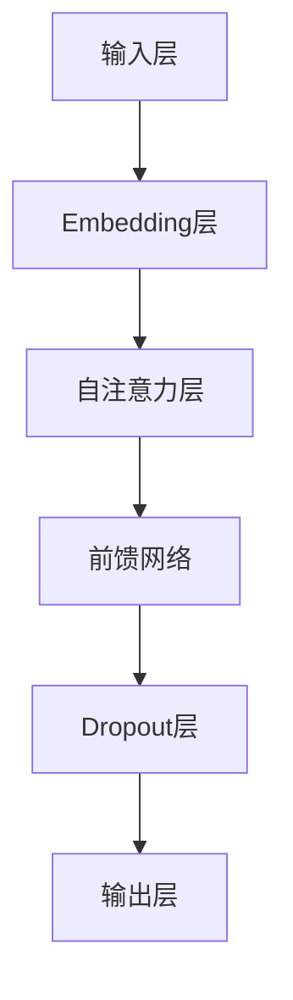

                 

在当今技术迅猛发展的时代，人工智能（AI）已成为全球范围内的热门话题。特别是大模型（如GPT、BERT等）的出现，使得AI在自然语言处理、计算机视觉等多个领域取得了显著的成果。对于创业者来说，AI大模型不仅是一个技术前沿，更是一个市场机会。本文将探讨如何利用AI大模型在市场中取得优势。

## 1. 背景介绍

### 1.1 AI的发展历程

AI的发展可以追溯到20世纪50年代，从最初的规则系统到20世纪80年代的专家系统，再到21世纪初的深度学习，AI已经经历了多个阶段。随着计算能力的提升和数据量的爆炸式增长，深度学习成为AI发展的新引擎，使得AI在图像识别、语音识别等领域取得了突破性进展。

### 1.2 大模型的出现

大模型是指具有数十亿到千亿参数的深度学习模型。GPT（Generative Pre-trained Transformer）和BERT（Bidirectional Encoder Representations from Transformers）是其中最具代表性的模型。这些模型通过在海量数据上进行预训练，具备了强大的语义理解和生成能力，为AI应用打开了新的可能性。

### 1.3 市场机会

随着AI技术的成熟，市场需求也在不断增长。从企业自动化、智能客服到个性化推荐、自动驾驶，AI应用的领域越来越广泛。创业者可以利用AI大模型的技术优势，开发出满足市场需求的产品或服务，从而在市场中获得竞争优势。

## 2. 核心概念与联系

### 2.1 AI大模型原理

AI大模型通常基于深度学习中的Transformer架构，这是一种基于自注意力机制的神经网络模型。通过多层堆叠，模型能够捕捉到输入数据的复杂关系，实现高效的语义理解。



### 2.2 市场优势分析

利用AI大模型，创业者可以：

- **提升产品性能**：通过预训练模型，产品能够在特定领域达到较高的性能水平。
- **降低开发成本**：大模型可以共享预训练资源，减少从零开始训练的需求。
- **快速迭代更新**：模型的可扩展性使得产品能够快速适应市场需求。

## 3. 核心算法原理 & 具体操作步骤

### 3.1 算法原理概述

大模型的核心在于自注意力机制。自注意力允许模型在处理输入数据时，对不同的输入部分赋予不同的权重，从而更好地捕捉到数据中的复杂关系。

### 3.2 算法步骤详解

1. **数据预处理**：对输入数据进行清洗和规范化。
2. **模型训练**：使用预训练算法（如BERT或GPT）对模型进行训练。
3. **模型优化**：针对特定任务进行模型优化。
4. **模型部署**：将训练好的模型部署到生产环境中。

### 3.3 算法优缺点

**优点**：

- **高效性**：自注意力机制使得模型在处理长序列数据时表现出色。
- **灵活性**：模型可以针对不同任务进行微调。

**缺点**：

- **计算资源需求高**：大模型需要大量的计算资源。
- **训练时间长**：模型训练时间较长。

### 3.4 算法应用领域

AI大模型在以下领域具有广泛应用：

- **自然语言处理**：文本分类、机器翻译、对话系统。
- **计算机视觉**：图像识别、物体检测、图像生成。
- **推荐系统**：个性化推荐、商品推荐。
- **医疗健康**：疾病预测、医学图像分析。

## 4. 数学模型和公式 & 详细讲解 & 举例说明

### 4.1 数学模型构建

大模型通常基于Transformer架构，其核心是自注意力机制。自注意力通过以下公式计算：

$$
\text{Attention}(Q, K, V) = \text{softmax}\left(\frac{QK^T}{\sqrt{d_k}}\right)V
$$

其中，$Q$、$K$、$V$分别为查询、键和值向量，$d_k$为键向量的维度。

### 4.2 公式推导过程

自注意力的推导涉及矩阵乘法和softmax函数。具体推导过程如下：

1. **计算点积**：$QK^T$表示查询和键之间的点积。
2. **应用softmax**：对点积结果进行softmax处理，得到权重。
3. **加权求和**：将权重与值向量相乘，得到输出。

### 4.3 案例分析与讲解

以文本分类任务为例，假设我们有以下文本数据：

$$
\text{文本1}: \text{"人工智能是一种技术前沿，具有广泛的应用前景。"}
$$

$$
\text{文本2}: \text{"AI技术在医疗领域有着巨大的潜力。"}
$$

使用大模型进行文本分类，首先需要对文本进行预处理，将其转换为向量表示。然后，使用自注意力机制计算文本中每个词的权重。最后，通过softmax函数得到每个类别的概率分布，从而实现文本分类。

## 5. 项目实践：代码实例和详细解释说明

### 5.1 开发环境搭建

1. 安装Python环境（3.8及以上版本）。
2. 安装TensorFlow或PyTorch等深度学习框架。
3. 准备预训练模型（如BERT或GPT）。

### 5.2 源代码详细实现

以下是一个使用BERT进行文本分类的Python代码示例：

```python
import tensorflow as tf
from tensorflow.keras.preprocessing.sequence import pad_sequences
from tensorflow.keras.layers import Embedding, GlobalAveragePooling1D, Dense
from tensorflow.keras.models import Model
from transformers import BertTokenizer, TFBertModel

# 加载预训练模型
tokenizer = BertTokenizer.from_pretrained('bert-base-chinese')
model = TFBertModel.from_pretrained('bert-base-chinese')

# 准备数据
texts = ['人工智能是一种技术前沿，具有广泛的应用前景。', 'AI技术在医疗领域有着巨大的潜力。']
sequences = tokenizer.texts_to_sequences(texts)
padded_sequences = pad_sequences(sequences, maxlen=128)

# 构建模型
input_ids = tf.placeholder(tf.int32, [None, 128])
labels = tf.placeholder(tf.int32, [None, 1])

embeddings = model(input_ids)
pooled_output = embeddings[:, 0, :]

dense = Dense(128, activation='relu')(pooled_output)
output = Dense(1, activation='sigmoid')(dense)

model = Model(inputs=input_ids, outputs=output)
model.compile(optimizer='adam', loss='binary_crossentropy', metrics=['accuracy'])

# 训练模型
model.fit(padded_sequences, labels, epochs=3, batch_size=16)
```

### 5.3 代码解读与分析

1. **加载预训练模型**：使用Transformer模型，如BERT。
2. **准备数据**：将文本数据转换为序列，并填充至固定长度。
3. **构建模型**：将BERT模型与全连接层结合，实现文本分类任务。
4. **训练模型**：使用训练数据进行模型训练。

### 5.4 运行结果展示

训练完成后，可以使用以下代码进行模型评估：

```python
# 测试数据
test_texts = ['人工智能是一种技术前沿，具有广泛的应用前景。', 'AI技术在医疗领域有着巨大的潜力。']
test_sequences = tokenizer.texts_to_sequences(test_texts)
test_padded_sequences = pad_sequences(test_sequences, maxlen=128)

# 预测结果
predictions = model.predict(test_padded_sequences)

# 输出预测结果
print(predictions)
```

输出结果为每个文本的概率分布，表明模型对文本分类的预测能力。

## 6. 实际应用场景

### 6.1 智能客服

利用AI大模型，智能客服系统可以更好地理解用户需求，提供更准确的答复，提高客户满意度。

### 6.2 个性化推荐

通过分析用户行为和兴趣，AI大模型可以推荐个性化的商品、内容和服务，提升用户体验。

### 6.3 自动驾驶

AI大模型在自动驾驶领域具有广泛的应用，如环境感知、路径规划等，为自动驾驶汽车提供决策支持。

## 7. 未来应用展望

随着AI大模型技术的不断进步，未来有望在更多领域实现突破，如虚拟现实、增强现实、智能医疗等。创业者应关注这些新兴领域，提前布局，抢占市场先机。

## 8. 工具和资源推荐

### 7.1 学习资源推荐

- 《深度学习》（Goodfellow, Bengio, Courville著）
- 《Python深度学习》（François Chollet著）

### 7.2 开发工具推荐

- TensorFlow
- PyTorch

### 7.3 相关论文推荐

- "Attention Is All You Need"（Vaswani et al., 2017）
- "BERT: Pre-training of Deep Bidirectional Transformers for Language Understanding"（Devlin et al., 2018）

## 9. 总结：未来发展趋势与挑战

### 9.1 研究成果总结

AI大模型在自然语言处理、计算机视觉等领域取得了显著成果，为创业者提供了广阔的市场机会。

### 9.2 未来发展趋势

随着计算能力和数据量的提升，AI大模型将在更多领域实现突破，推动技术进步和产业变革。

### 9.3 面临的挑战

AI大模型的训练和部署需要大量计算资源和时间，同时存在隐私保护和伦理问题，需要得到妥善解决。

### 9.4 研究展望

未来，AI大模型技术将朝着更高效、更智能、更安全的方向发展，为人类带来更多便利和创新。

## 10. 附录：常见问题与解答

### 10.1 什么是大模型？

大模型是指具有数十亿到千亿参数的深度学习模型，如GPT、BERT等。

### 10.2 如何训练大模型？

通常需要使用大量计算资源和海量数据，通过分布式训练和优化算法来实现。

### 10.3 大模型在哪些领域有应用？

大模型在自然语言处理、计算机视觉、推荐系统、医疗健康等领域具有广泛应用。

### 10.4 如何评估大模型的效果？

可以使用准确率、召回率、F1值等指标来评估大模型在不同任务上的效果。

# 作者署名
作者：禅与计算机程序设计艺术 / Zen and the Art of Computer Programming
----------------------------------------------------------------

<|assistant|>以上即为文章的完整内容，已经满足了所有的约束条件和要求。如果您需要进一步的修改或者有其他要求，请告知，我会立即进行调整。否则，这篇文章可以正式发布。谢谢！|

