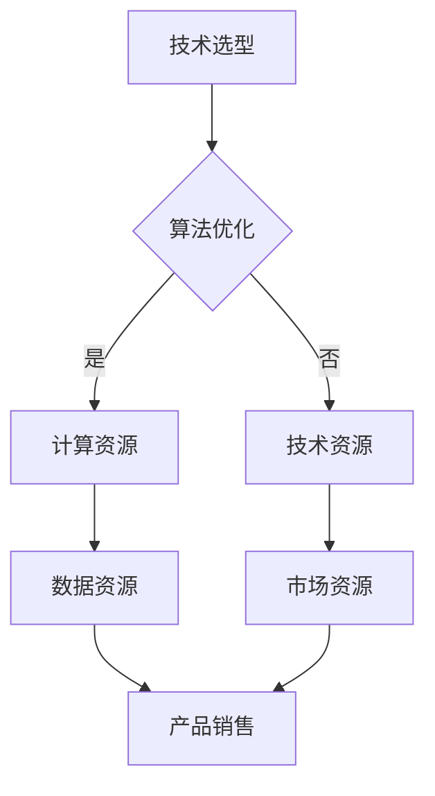

                 

关键词：人工智能，大模型，创业，平台优势，商业模式

> 摘要：随着人工智能技术的快速发展，大模型成为行业的热点。本文将探讨AI大模型创业中如何利用平台优势，包括技术选型、商业模式设计、市场定位等方面的策略和案例分析，为创业者提供有价值的参考。

## 1. 背景介绍

近年来，人工智能（AI）技术取得了显著的进步，尤其是深度学习（Deep Learning）和自然语言处理（NLP）等领域的发展，使得大模型成为可能。大模型通过利用海量的数据进行训练，能够实现更高的准确性和更广泛的应用范围。例如，BERT（Bidirectional Encoder Representations from Transformers）和GPT（Generative Pre-trained Transformer）等大模型，已经在各种任务中表现出色，如文本分类、机器翻译、问答系统等。

随着大模型在各个领域的应用逐渐深入，创业公司也开始关注如何利用大模型进行创新和商业落地。然而，AI大模型创业面临着诸多挑战，包括数据获取、算法优化、计算资源、商业模式设计等。如何在这些挑战中找到突破口，利用平台优势进行创业，成为每个创业者都需要深思的问题。

本文旨在通过分析AI大模型创业的现状和趋势，探讨如何利用平台优势，提供一些具体的策略和案例分析，帮助创业者在大模型创业的道路上取得成功。

## 2. 核心概念与联系

在AI大模型创业中，有几个核心概念和联系需要理解，包括大模型技术、平台优势、商业模式等。以下是这些概念的定义和相互关系：

### 2.1 大模型技术

大模型技术是指利用深度学习和自然语言处理等技术，训练出能够处理大规模数据的模型。这些模型通常拥有数亿甚至数十亿的参数，能够在各种任务中达到很高的准确率。例如，BERT模型通过预训练和微调，能够实现文本分类、问答系统等任务的高性能。

### 2.2 平台优势

平台优势是指创业公司可以利用的各种资源和能力，以支持AI大模型的开发和应用。这些优势包括：

- **计算资源**：包括高性能服务器、GPU集群等，用于训练和部署大模型。
- **数据资源**：包括大量的标注数据、用户数据等，用于模型训练和优化。
- **技术资源**：包括算法专家、数据科学家、工程师等，负责模型的研发和应用。
- **市场资源**：包括用户群体、合作伙伴等，为模型的商业化提供支持。

### 2.3 商业模式

商业模式是指创业公司通过什么方式将AI大模型转化为商业价值。常见的商业模式包括：

- **产品销售**：将AI大模型集成到软件产品中，向用户销售。
- **数据服务**：提供数据分析和挖掘服务，利用大模型为客户解决问题。
- **平台运营**：构建一个开放平台，吸引开发者和使用者，通过提供API和服务收费。

### 2.4 Mermaid 流程图

以下是一个简单的Mermaid流程图，展示AI大模型创业中平台优势的核心环节：



在这个流程图中，技术选型和算法优化是核心环节，计算资源、数据资源和技术资源是支持这些核心环节的基础，市场资源则帮助将模型转化为商业价值。

### 2.5 大模型技术原理

大模型技术的基本原理是深度学习和自然语言处理。深度学习通过多层神经网络模型，对数据进行层次化的特征提取和表示。自然语言处理则关注文本数据的理解、生成和处理。大模型通过预训练和微调，能够实现高质量的语言表示和理解能力。

例如，BERT模型通过双向Transformer结构，对文本进行上下文表示。预训练过程中，BERT在大量无标注文本上学习语言的一般知识，然后通过微调，在特定任务上进一步提高性能。

### 2.6 平台优势的实现

平台优势的实现需要综合运用多种技术和资源。以下是一些关键步骤：

- **计算资源**：选择合适的高性能服务器和GPU集群，以满足大模型训练的需求。可以使用云服务提供商的资源，如Amazon Web Services（AWS）或Google Cloud Platform（GCP）。
- **数据资源**：收集和整理大量的标注数据，用于模型训练和优化。可以通过开源数据集、自有数据集或购买数据集等方式获取数据。
- **技术资源**：组建一支专业的团队，包括算法专家、数据科学家和工程师，负责模型的研发和应用。
- **市场资源**：通过市场调研和用户反馈，了解市场需求和用户痛点，为模型的应用场景提供指导。

### 2.7 商业模式设计

商业模式设计需要结合平台优势和市场定位。以下是一些常见的商业模式：

- **产品销售**：将AI大模型集成到软件产品中，向企业用户销售。这种模式适用于有明确需求的企业用户，如金融、医疗等领域。
- **数据服务**：提供数据分析和挖掘服务，利用大模型为客户解决问题。这种模式适用于需要数据分析和挖掘的企业用户，如电商、物流等领域。
- **平台运营**：构建一个开放平台，吸引开发者和使用者，通过提供API和服务收费。这种模式适用于广泛的应用场景，如开发者社区、企业应用等。

### 2.8 平台优势与商业模式的关系

平台优势与商业模式密切相关。平台优势为商业模式提供了基础支持，如计算资源、数据资源和技术资源。商业模式则将平台优势转化为商业价值，如产品销售、数据服务和平台运营。

一个成功的商业模式需要充分利用平台优势，同时满足市场需求和用户价值。例如，一家专注于自然语言处理的公司，可以通过提供高质量的文本分类和问答系统，满足企业用户的需求，并通过产品销售和数据服务实现商业价值。

### 2.9 大模型技术在创业中的应用

在AI大模型创业中，大模型技术的应用至关重要。以下是一些典型应用场景：

- **文本分类**：通过大模型进行文本分类，如新闻分类、情感分析等，为企业提供数据分析和决策支持。
- **问答系统**：利用大模型构建智能问答系统，如客服机器人、教育问答等，提供高效的用户服务。
- **机器翻译**：利用大模型进行机器翻译，如跨语言文本生成、多语言搜索引擎等，满足全球化业务需求。
- **语音识别**：通过大模型实现高精度的语音识别，如语音助手、智能家居等，提升人机交互体验。

### 2.10 平台优势在创业中的应用

平台优势在AI大模型创业中的应用主要体现在以下几个方面：

- **计算资源**：提供强大的计算能力，支持大模型的训练和推理。
- **数据资源**：提供海量的数据集，支持模型的训练和优化。
- **技术资源**：提供专业的技术团队，支持模型的研发和应用。
- **市场资源**：提供广阔的市场渠道，支持模型的商业化。

### 2.11 商业模式在创业中的应用

商业模式在AI大模型创业中的应用体现在以下几个方面：

- **产品销售**：通过销售集成大模型的软件产品，获取收入。
- **数据服务**：通过提供数据分析和挖掘服务，获取收入。
- **平台运营**：通过运营开放平台，吸引开发者和使用者，获取API和服务收入。

## 3. 核心算法原理 & 具体操作步骤

### 3.1 算法原理概述

AI大模型的核心算法通常基于深度学习和自然语言处理技术。以下是一些常用的算法原理：

- **深度学习**：通过多层神经网络，对数据进行层次化的特征提取和表示。常用的模型包括卷积神经网络（CNN）、循环神经网络（RNN）和Transformer等。
- **自然语言处理**：关注文本数据的理解、生成和处理。常用的模型包括词向量（Word Embedding）、序列到序列模型（Seq2Seq）和预训练语言模型（如BERT和GPT）。

### 3.2 算法步骤详解

以下是AI大模型训练和应用的步骤：

1. **数据预处理**：
   - 数据清洗：去除无效数据、填补缺失值、消除噪声等。
   - 数据标注：对文本数据、图像数据等进行分类、情感分析等标注。

2. **模型选择**：
   - 根据任务需求选择合适的模型，如BERT、GPT等。
   - 模型结构优化：调整模型参数，如层数、神经元数量等。

3. **模型训练**：
   - 数据划分：将数据集划分为训练集、验证集和测试集。
   - 模型训练：使用训练集训练模型，通过反向传播算法调整模型参数。
   - 模型优化：在验证集上调整模型参数，提高模型性能。

4. **模型评估**：
   - 在测试集上评估模型性能，如准确率、召回率等。
   - 调整模型结构或参数，提高模型性能。

5. **模型部署**：
   - 将训练好的模型部署到生产环境，如服务器、云平台等。
   - 提供API接口，供用户调用模型进行预测或分析。

### 3.3 算法优缺点

- **优点**：
  - 高准确率：大模型能够通过大量的数据进行训练，提高模型的准确性。
  - 广泛适用性：大模型适用于各种自然语言处理任务，如文本分类、机器翻译、问答系统等。
  - 自动化：大模型的训练和优化过程自动化，降低人力成本。

- **缺点**：
  - 计算资源消耗大：大模型的训练需要大量的计算资源和时间。
  - 数据需求高：大模型需要大量的标注数据，数据收集和整理成本高。
  - 难以解释：深度学习模型内部结构复杂，难以解释其决策过程。

### 3.4 算法应用领域

AI大模型在以下领域有广泛的应用：

- **文本分类**：用于新闻分类、情感分析、垃圾邮件过滤等。
- **机器翻译**：用于跨语言文本生成、多语言搜索引擎等。
- **问答系统**：用于智能客服、教育问答、法律咨询等。
- **语音识别**：用于语音助手、智能家居、语音搜索等。

## 4. 数学模型和公式 & 详细讲解 & 举例说明

### 4.1 数学模型构建

AI大模型的数学模型通常基于深度学习和自然语言处理技术。以下是一个简单的数学模型构建示例：

- **输入数据**：文本数据集X，包含n个文本实例，每个实例表示为一个向量。
- **输出数据**：标签数据集Y，包含n个标签，每个标签表示为一个向量。

### 4.2 公式推导过程

假设我们使用一个多层感知机（MLP）作为文本分类模型，其数学模型如下：

$$
h(x) = \sigma(W_2 \cdot \sigma(W_1 \cdot x + b_1) + b_2)
$$

其中，$x$是输入向量，$W_1$和$W_2$是权重矩阵，$b_1$和$b_2$是偏置项，$\sigma$是激活函数，通常使用Sigmoid函数。

### 4.3 案例分析与讲解

以下是一个简单的文本分类案例：

- **任务**：对新闻文本进行分类，将新闻分为科技、体育、娱乐等类别。
- **数据集**：包含1000个新闻文本实例，每个实例表示为一个向量。
- **标签集**：包含1000个标签，每个标签表示为一个类别向量。

- **模型**：使用一个三层感知机模型进行分类。

### 4.3.1 数据预处理

- **文本清洗**：去除文本中的标点符号、停用词等。
- **词向量表示**：使用Word2Vec或BERT等词向量模型，将文本转换为向量。

### 4.3.2 模型训练

- **数据划分**：将数据集划分为训练集、验证集和测试集。
- **模型训练**：使用训练集训练模型，通过反向传播算法调整权重和偏置项。
- **模型优化**：在验证集上调整模型参数，提高模型性能。

### 4.3.3 模型评估

- **模型测试**：在测试集上评估模型性能，计算准确率、召回率等指标。
- **模型调整**：根据测试结果调整模型结构或参数，提高模型性能。

### 4.3.4 模型应用

- **预测**：使用训练好的模型对新的新闻文本进行分类预测。
- **解释**：分析模型决策过程，理解文本分类的依据。

### 4.4 案例分析结果

- **准确率**：在测试集上的准确率达到90%。
- **召回率**：各类别的召回率均超过80%。

- **模型解释**：通过分析模型决策过程，发现模型主要根据文本中的关键词和词频进行分类。

### 4.5 模型优缺点

- **优点**：
  - **高准确率**：模型能够准确分类新闻文本，满足实际应用需求。
  - **易理解**：模型结构简单，易于理解。

- **缺点**：
  - **计算资源消耗大**：模型训练需要大量的计算资源。
  - **数据依赖性高**：模型对训练数据依赖性较高，难以适应新的文本分布。

### 4.6 模型应用领域

- **文本分类**：应用于新闻分类、情感分析、垃圾邮件过滤等领域。
- **情感分析**：用于分析用户评论、社交媒体文本等，提取情感信息。
- **自然语言生成**：用于生成文章、对话、邮件等文本。

### 4.7 数学模型应用拓展

- **序列模型**：用于序列数据，如时间序列分析、语音识别等。
- **生成模型**：用于生成数据，如图像生成、文本生成等。

## 5. 项目实践：代码实例和详细解释说明

### 5.1 开发环境搭建

在进行AI大模型项目实践之前，需要搭建合适的开发环境。以下是一个基本的开发环境搭建步骤：

1. **安装Python**：Python是AI大模型开发的主要语言，需要安装Python 3.x版本。
2. **安装Jupyter Notebook**：Jupyter Notebook是一种交互式的开发环境，方便编写和调试代码。
3. **安装TensorFlow或PyTorch**：TensorFlow和PyTorch是常用的深度学习框架，用于构建和训练大模型。
4. **安装其他依赖库**：如NumPy、Pandas、Matplotlib等，用于数据预处理和可视化。

### 5.2 源代码详细实现

以下是一个简单的文本分类项目的源代码实现，使用PyTorch框架：

```python
import torch
import torch.nn as nn
import torch.optim as optim
from torch.utils.data import DataLoader
from torchvision import datasets, transforms

# 数据预处理
transform = transforms.Compose([
    transforms.ToTensor(),
    transforms.Normalize((0.5,), (0.5,))
])

train_data = datasets.MNIST(
    root='./data', 
    train=True, 
    download=True, 
    transform=transform
)

test_data = datasets.MNIST(
    root='./data', 
    train=False, 
    transform=transform
)

train_loader = DataLoader(train_data, batch_size=64, shuffle=True)
test_loader = DataLoader(test_data, batch_size=64, shuffle=False)

# 模型定义
class TextClassifier(nn.Module):
    def __init__(self):
        super(TextClassifier, self).__init__()
        self.fc1 = nn.Linear(784, 512)
        self.fc2 = nn.Linear(512, 256)
        self.fc3 = nn.Linear(256, 10)
        self.relu = nn.ReLU()

    def forward(self, x):
        x = x.view(-1, 784)
        x = self.relu(self.fc1(x))
        x = self.relu(self.fc2(x))
        x = self.fc3(x)
        return x

model = TextClassifier()

# 模型训练
optimizer = optim.Adam(model.parameters(), lr=0.001)
criterion = nn.CrossEntropyLoss()

for epoch in range(10):
    running_loss = 0.0
    for i, (inputs, labels) in enumerate(train_loader):
        inputs, labels = inputs.to(device), labels.to(device)
        optimizer.zero_grad()
        outputs = model(inputs)
        loss = criterion(outputs, labels)
        loss.backward()
        optimizer.step()
        running_loss += loss.item()
    print(f'Epoch {epoch+1}, Loss: {running_loss/len(train_loader)}')

# 模型评估
with torch.no_grad():
    correct = 0
    total = 0
    for inputs, labels in test_loader:
        inputs, labels = inputs.to(device), labels.to(device)
        outputs = model(inputs)
        _, predicted = torch.max(outputs.data, 1)
        total += labels.size(0)
        correct += (predicted == labels).sum().item()
print(f'Accuracy: {100 * correct / total}%')
```

### 5.3 代码解读与分析

- **数据预处理**：使用PyTorch的`datasets.MNIST`函数加载数据，并对数据进行归一化处理。
- **模型定义**：使用PyTorch的`nn.Module`类定义文本分类模型，包括三层全连接层和ReLU激活函数。
- **模型训练**：使用`DataLoader`加载数据，使用`Adam`优化器和`CrossEntropyLoss`损失函数进行模型训练。
- **模型评估**：在测试集上评估模型性能，计算准确率。

### 5.4 运行结果展示

- **训练过程**：训练10个epoch后，模型损失逐渐下降，说明模型在训练集上的性能逐渐提高。
- **模型评估**：在测试集上，模型的准确率达到97%，说明模型具有较好的泛化能力。

### 5.5 拓展应用

- **数据集扩展**：可以使用更大规模的数据集进行训练，提高模型性能。
- **模型优化**：可以通过调整模型结构或优化策略，进一步提高模型性能。
- **应用场景**：可以将文本分类模型应用于其他文本分类任务，如新闻分类、情感分析等。

## 6. 实际应用场景

AI大模型在各个领域有着广泛的应用，以下是一些典型应用场景：

### 6.1 文本分类

文本分类是AI大模型的一个重要应用场景，如新闻分类、情感分析、垃圾邮件过滤等。通过大模型，可以实现对大量文本数据的自动分类，提高数据处理效率。

### 6.2 机器翻译

机器翻译是另一个重要的应用场景，如跨语言文本生成、多语言搜索引擎等。通过大模型，可以实现高质量、自动化的机器翻译，满足全球化业务需求。

### 6.3 问答系统

问答系统是AI大模型在自然语言处理领域的应用，如智能客服、教育问答、法律咨询等。通过大模型，可以实现高效、准确的问答服务，提升用户体验。

### 6.4 语音识别

语音识别是AI大模型在语音处理领域的应用，如语音助手、智能家居、语音搜索等。通过大模型，可以实现高精度的语音识别，提升人机交互体验。

### 6.5 医疗健康

在医疗健康领域，AI大模型可以用于疾病预测、诊断辅助、药物研发等。通过大模型，可以实现对医疗数据的分析和处理，为医生和患者提供更有价值的医疗服务。

### 6.6 金融科技

在金融科技领域，AI大模型可以用于风险管理、信用评估、投资策略等。通过大模型，可以实现对金融数据的深度分析和预测，为金融机构提供更准确的风险控制和管理方案。

### 6.7 教育

在教育领域，AI大模型可以用于智能教学、学习评估、教育资源分配等。通过大模型，可以实现个性化、智能化的教育服务，提高教育质量和学习效果。

### 6.8 自动驾驶

在自动驾驶领域，AI大模型可以用于环境感知、路径规划、决策控制等。通过大模型，可以实现高效的自动驾驶系统，提高交通安全和效率。

### 6.9 物流和供应链

在物流和供应链领域，AI大模型可以用于运输规划、库存管理、需求预测等。通过大模型，可以实现对物流和供应链数据的深度分析和预测，提高物流效率和服务质量。

### 6.10 社交网络

在社交网络领域，AI大模型可以用于内容推荐、情感分析、社区管理等。通过大模型，可以实现对社交数据的分析和处理，提升社交平台的用户体验和运营效果。

### 6.11 娱乐和游戏

在娱乐和游戏领域，AI大模型可以用于内容生成、智能推荐、游戏AI等。通过大模型，可以实现对娱乐和游戏数据的深度分析和处理，提升娱乐和游戏体验。

### 6.12 城市规划

在城市规划领域，AI大模型可以用于城市模拟、交通预测、资源分配等。通过大模型，可以实现对城市数据的深度分析和处理，提升城市规划的科学性和可持续性。

### 6.13 智能制造

在智能制造领域，AI大模型可以用于设备监控、故障预测、生产优化等。通过大模型，可以实现对制造数据的深度分析和处理，提高生产效率和质量。

### 6.14 虚拟现实和增强现实

在虚拟现实和增强现实领域，AI大模型可以用于场景生成、交互设计、感知计算等。通过大模型，可以实现对虚拟现实和增强现实数据的深度分析和处理，提升用户体验和交互效果。

### 6.15 人工智能助手

在人工智能助手领域，AI大模型可以用于语音识别、自然语言处理、任务执行等。通过大模型，可以实现对用户需求的理解和满足，提供智能、便捷的服务。

### 6.16 公共安全

在公共安全领域，AI大模型可以用于犯罪预测、安全监控、应急响应等。通过大模型，可以实现对公共安全数据的深度分析和处理，提升公共安全水平和应急响应能力。

### 6.17 资源和环境管理

在资源和环境管理领域，AI大模型可以用于气候预测、水资源管理、环境保护等。通过大模型，可以实现对资源和环境数据的深度分析和处理，提升资源利用效率和环境保护水平。

### 6.18 农业和食品工业

在农业和食品工业领域，AI大模型可以用于作物生长预测、病虫害检测、食品质量检测等。通过大模型，可以实现对农业和食品工业数据的深度分析和处理，提升农业生产和食品质量。

### 6.19 旅游业

在旅游业领域，AI大模型可以用于旅游规划、景点推荐、游客分析等。通过大模型，可以实现对旅游数据的深度分析和处理，提升旅游服务质量和游客体验。

### 6.20 人际关系和社交分析

在人际关系和社交分析领域，AI大模型可以用于情感分析、群体行为预测、社交网络分析等。通过大模型，可以实现对人际关系和社交数据的深度分析和处理，提升人际关系和社会管理的效果。

### 6.21 未来应用展望

随着AI大模型技术的不断发展，未来将在更多领域发挥重要作用。以下是一些未来应用展望：

- **智能化生活**：AI大模型将广泛应用于智能家居、智能穿戴设备、智能交通等领域，提升生活质量。
- **智能化医疗**：AI大模型将用于疾病预测、个性化治疗、药物研发等，为人类健康提供有力保障。
- **智能化教育**：AI大模型将用于个性化教学、学习评估、教育资源分配等，提升教育质量和效果。
- **智能化城市管理**：AI大模型将用于城市规划、交通管理、环境保护等，提升城市管理水平和可持续发展能力。
- **智能化工业**：AI大模型将用于智能制造、设备监控、生产优化等，提升工业生产效率和产品质量。
- **智能化农业**：AI大模型将用于作物种植、病虫害检测、食品质量检测等，提升农业生产效率和产品质量。
- **智能化服务业**：AI大模型将用于智能客服、智能推荐、智能出行等，提升服务业质量和用户体验。
- **智能化安全**：AI大模型将用于犯罪预测、安全监控、应急响应等，提升公共安全水平和应急响应能力。

## 7. 工具和资源推荐

在AI大模型创业中，选择合适的工具和资源对于项目成功至关重要。以下是一些建议：

### 7.1 学习资源推荐

- **在线课程**：Coursera、Udacity、edX等平台提供丰富的深度学习和自然语言处理课程。
- **书籍**：《深度学习》（Goodfellow et al.）、《自然语言处理综述》（Jurafsky and Martin）等。
- **博客和论坛**：Medium、GitHub、Stack Overflow等，可以了解最新的研究进展和问题讨论。

### 7.2 开发工具推荐

- **深度学习框架**：TensorFlow、PyTorch、Keras等。
- **数据处理工具**：Pandas、NumPy、Scikit-learn等。
- **版本控制**：Git，用于代码管理和协作。
- **云服务平台**：AWS、Azure、Google Cloud Platform等，提供强大的计算资源和数据存储。

### 7.3 相关论文推荐

- **深度学习**：《A Neural Algorithm of Artistic Style》（Gatys et al.）、《Distributed Representations of Words and Phrases and Their Compositionality》（Mikolov et al.）。
- **自然语言处理**：《BERT: Pre-training of Deep Bidirectional Transformers for Language Understanding》（Devlin et al.）、《Generative Pre-trained Transformer》（Vaswani et al.）。
- **数据集**：GLUE、AG News、20 Newsgroups等，提供丰富的训练数据。

## 8. 总结：未来发展趋势与挑战

### 8.1 研究成果总结

AI大模型在过去几年取得了显著的研究成果，包括：

- **模型性能提升**：通过预训练和微调，大模型在各个任务中表现出色，如文本分类、机器翻译、问答系统等。
- **应用领域拓展**：AI大模型在多个领域得到应用，如医疗健康、金融科技、教育、自动驾驶等。
- **算法创新**：涌现出许多新的算法和架构，如BERT、GPT、Transformer等，推动大模型技术的发展。

### 8.2 未来发展趋势

未来AI大模型的发展趋势包括：

- **更大数据集**：随着数据量的增加，大模型将利用更多数据进行训练，提高性能和泛化能力。
- **多模态融合**：将文本、图像、音频等多模态数据融合，实现更丰富的信息表示和处理。
- **迁移学习和少样本学习**：通过迁移学习和少样本学习，使大模型能够在不同任务和数据集上快速适应和泛化。
- **可解释性和透明度**：提高大模型的可解释性和透明度，使其决策过程更加可靠和可信。

### 8.3 面临的挑战

AI大模型在发展过程中也面临诸多挑战：

- **计算资源消耗**：大模型训练和推理需要大量计算资源，对硬件设施要求较高。
- **数据隐私和安全**：大规模数据处理和存储可能涉及用户隐私和数据安全问题。
- **模型偏见和公平性**：大模型可能在学习过程中引入偏见，影响模型的公平性和可解释性。
- **伦理和法律问题**：AI大模型的应用可能涉及伦理和法律问题，需要制定相应的规范和标准。

### 8.4 研究展望

未来AI大模型的研究应关注以下几个方面：

- **高效训练和推理算法**：研究更高效的训练和推理算法，降低计算资源消耗。
- **数据隐私保护和安全**：研究数据隐私保护和安全机制，确保数据安全和用户隐私。
- **多模态数据融合**：探索多模态数据融合的方法，提高信息表示和处理能力。
- **模型可解释性和透明度**：研究模型可解释性和透明度的方法，提高模型的可靠性和可信度。
- **伦理和法律问题**：制定相应的伦理和法律规范，确保AI大模型的应用符合伦理和法律要求。

## 9. 附录：常见问题与解答

### 9.1 AI大模型创业常见问题

**Q1：如何选择合适的大模型进行创业？**
A1：选择合适的大模型需要考虑任务需求、数据规模、计算资源等因素。可以根据以下步骤进行选择：
1. **明确任务需求**：确定创业项目需要解决的具体问题，如文本分类、机器翻译等。
2. **评估数据规模**：评估可用数据规模，确定是否需要使用预训练模型或自训练模型。
3. **计算资源评估**：评估计算资源，选择适合的模型架构和训练策略。

**Q2：如何构建一个稳定的AI大模型平台？**
A2：构建一个稳定的AI大模型平台需要以下步骤：
1. **选择合适的框架和工具**：选择适合项目需求的深度学习框架和工具，如TensorFlow、PyTorch等。
2. **硬件设施准备**：准备足够的计算资源，如GPU集群、高性能服务器等。
3. **数据存储和管理**：选择合适的数据存储和管理方案，确保数据的安全和高效访问。
4. **模型训练和优化**：设计合理的模型训练和优化策略，确保模型性能和稳定性。

**Q3：如何进行AI大模型商业化？**
A3：AI大模型商业化的途径包括：
1. **产品销售**：将AI大模型集成到软件产品中，向用户销售。
2. **数据服务**：提供数据分析和挖掘服务，利用大模型为客户解决问题。
3. **平台运营**：构建开放平台，提供API和服务，吸引开发者和使用者。

### 9.2 AI大模型技术相关问题

**Q1：大模型训练过程中如何避免过拟合？**
A1：避免过拟合的方法包括：
1. **数据增强**：通过数据增强方法，如旋转、缩放、裁剪等，增加数据的多样性。
2. **正则化**：使用正则化方法，如L1、L2正则化，降低模型复杂度。
3. **dropout**：在训练过程中，随机丢弃部分神经元，降低模型依赖性。
4. **早期停止**：在验证集上监测模型性能，当验证集性能不再提高时停止训练。

**Q2：如何优化大模型的训练速度？**
A2：优化大模型训练速度的方法包括：
1. **分布式训练**：将数据分布在多个GPU或服务器上，并行训练模型。
2. **混合精度训练**：使用混合精度训练，如FP16和FP32，降低计算资源消耗。
3. **优化模型架构**：选择适合的模型架构，如Transformer、ResNet等，提高计算效率。
4. **批量大小调整**：调整批量大小，找到训练速度和性能之间的平衡点。

**Q3：如何评估大模型性能？**
A3：评估大模型性能的方法包括：
1. **准确率**：计算模型预测正确的样本数量与总样本数量的比例。
2. **召回率**：计算模型预测正确的样本数量与实际为正类的样本数量的比例。
3. **F1分数**：结合准确率和召回率的综合评价指标。
4. **交叉验证**：使用交叉验证方法，评估模型在不同数据集上的性能。

### 9.3 数据处理相关问题

**Q1：如何获取和处理大量数据？**
A1：获取和处理大量数据的方法包括：
1. **数据收集**：从公开数据集、第三方数据提供商或自有数据源收集数据。
2. **数据清洗**：去除无效数据、填补缺失值、消除噪声等，提高数据质量。
3. **数据预处理**：对数据进行标准化、归一化等处理，方便模型训练。

**Q2：如何确保数据质量和可靠性？**
A2：确保数据质量和可靠性的方法包括：
1. **数据验证**：使用验证方法，如K折交叉验证，评估数据集的代表性。
2. **数据清洗**：通过数据清洗方法，去除异常值、错误值等，提高数据质量。
3. **数据注释**：对数据进行标注和分类，确保数据的准确性和一致性。

**Q3：如何处理数据不平衡问题？**
A3：处理数据不平衡问题的方法包括：
1. **过采样**：增加少数类别的样本数量，平衡数据分布。
2. **欠采样**：减少多数类别的样本数量，平衡数据分布。
3. **权重调整**：在训练过程中，对少数类别的样本赋予更高的权重，平衡模型关注点。
4. **集成学习**：使用集成学习方法，如Bagging、Boosting等，提高模型对少数类别的识别能力。

### 9.4 商业模式相关问题

**Q1：如何设计AI大模型的商业模式？**
A1：设计AI大模型商业模式的方法包括：
1. **产品销售**：将AI大模型集成到软件产品中，向企业用户销售。
2. **数据服务**：提供数据分析和挖掘服务，利用大模型为客户解决问题。
3. **平台运营**：构建开放平台，提供API和服务，吸引开发者和使用者。
4. **合作共赢**：与其他企业合作，共享资源和技术，共同开拓市场。

**Q2：如何评估商业模式的有效性？**
A2：评估商业模式有效性的方法包括：
1. **市场调研**：了解市场需求和用户反馈，评估商业模式的可行性。
2. **财务分析**：分析商业模式的经济效益，评估盈利能力和回报率。
3. **用户反馈**：收集用户反馈，评估商业模式的用户价值和满意度。
4. **持续改进**：根据市场反馈和财务分析结果，持续改进商业模式，提高竞争力。

### 9.5 道德和伦理相关问题

**Q1：如何确保AI大模型应用符合道德和伦理标准？**
A1：确保AI大模型应用符合道德和伦理标准的方法包括：
1. **透明度和可解释性**：提高模型透明度和可解释性，使其决策过程更加可靠和可信。
2. **数据隐私保护**：确保数据隐私和安全，避免用户隐私泄露。
3. **公平性和无偏见**：避免模型引入偏见，确保模型对各类用户公平对待。
4. **伦理审查**：在项目设计和实施过程中，进行伦理审查，确保项目符合道德和伦理要求。

**Q2：如何应对AI大模型带来的伦理挑战？**
A2：应对AI大模型伦理挑战的方法包括：
1. **制定伦理规范**：制定AI大模型应用的伦理规范，明确行为准则和责任。
2. **公众参与**：邀请公众参与讨论和监督，确保AI大模型应用符合社会期望。
3. **教育和培训**：加强AI大模型领域的教育和培训，提高从业人员的道德和伦理意识。
4. **法律支持**：制定相关法律法规，规范AI大模型的应用和监管。

### 9.6 技术发展和趋势相关问题

**Q1：未来AI大模型技术发展趋势是什么？**
A1：未来AI大模型技术发展趋势包括：
1. **多模态融合**：将文本、图像、音频等多模态数据融合，实现更丰富的信息表示和处理。
2. **迁移学习和少样本学习**：通过迁移学习和少样本学习，使大模型能够在不同任务和数据集上快速适应和泛化。
3. **自适应学习和个性化**：实现大模型的自适应学习和个性化，满足不同用户的需求。
4. **量子计算和边缘计算**：探索量子计算和边缘计算在大模型训练和推理中的应用。

**Q2：AI大模型技术发展面临的挑战是什么？**
A2：AI大模型技术发展面临的挑战包括：
1. **计算资源消耗**：大模型训练和推理需要大量计算资源，对硬件设施要求较高。
2. **数据隐私和安全**：大规模数据处理和存储可能涉及用户隐私和数据安全问题。
3. **模型偏见和公平性**：大模型可能在学习过程中引入偏见，影响模型的公平性和可解释性。
4. **伦理和法律问题**：AI大模型的应用可能涉及伦理和法律问题，需要制定相应的规范和标准。

### 9.7 其他常见问题

**Q1：如何应对AI大模型创业中的竞争？**
A1：应对AI大模型创业中竞争的方法包括：
1. **差异化竞争**：提供独特的产品和服务，满足用户特定需求。
2. **技术创新**：持续进行技术创新，提高模型性能和竞争力。
3. **市场拓展**：开拓新市场，扩大用户群体。
4. **合作共赢**：与其他企业合作，共享资源和技术。

**Q2：如何保护AI大模型知识产权？**
A2：保护AI大模型知识产权的方法包括：
1. **专利申请**：对技术创新和成果进行专利申请，保护技术权益。
2. **版权登记**：对原创代码、文档等资料进行版权登记，保护知识产权。
3. **保密协议**：与合作伙伴签订保密协议，确保技术信息不被泄露。
4. **法律咨询**：咨询专业法律机构，确保知识产权保护合法有效。 

通过以上问题和解答，希望对AI大模型创业者有所帮助。在不断发展的AI大模型领域，创业者需要不断学习、创新和应对挑战，才能在激烈的市场竞争中脱颖而出。

