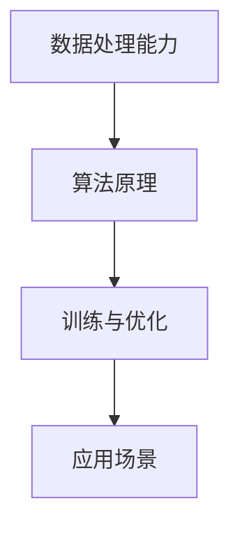

                 

 关键词：AI 大模型、创业、平台优势、技术实现、商业模式、市场分析、未来展望

> 摘要：本文将探讨AI大模型在创业中的应用，分析平台优势，提供技术实现策略，并探讨商业模式和市场分析。通过对核心算法原理、数学模型、项目实践等方面的深入讨论，帮助创业者更好地把握AI大模型的发展趋势和挑战，为未来创业提供有益的指导。

## 1. 背景介绍

随着人工智能技术的不断发展，大模型已经成为当前AI领域的热点之一。大模型通过处理海量数据，能够实现更强大的智能学习和推理能力。这种能力的提升为各行各业带来了巨大的变革和机遇，从语音识别、自然语言处理到图像识别和推荐系统，AI大模型的应用已经深入到我们生活的方方面面。

在创业领域，AI大模型也展现出了巨大的潜力。创业者可以利用平台优势，迅速搭建大模型应用，从而在竞争激烈的市场中脱颖而出。然而，如何有效地利用平台优势，构建具有竞争力的大模型创业项目，成为了一个关键问题。

本文将从以下几个方面展开讨论：

1. 平台优势分析：探讨不同平台在AI大模型创业中的优势与挑战。
2. 核心算法原理：介绍AI大模型的核心算法原理，为创业者提供技术实现策略。
3. 数学模型构建：讲解AI大模型中常用的数学模型和公式，为创业项目提供理论基础。
4. 项目实践：通过代码实例和详细解释，展示如何实现AI大模型创业项目的具体步骤。
5. 实际应用场景：分析AI大模型在不同行业中的应用，探讨未来发展的方向。

通过对以上几个方面的深入探讨，本文旨在为创业者提供一份数字化的AI大模型创业指南，帮助他们在激烈的市场竞争中脱颖而出。

## 2. 核心概念与联系

在深入探讨AI大模型创业之前，我们需要理解几个核心概念，这些概念是构建大模型的基础。

### 2.1 数据处理能力

数据处理能力是AI大模型的基础。大模型需要处理海量数据，这包括数据的采集、清洗、预处理和存储。不同的平台在数据处理能力方面存在差异，如Google的TensorFlow和Facebook的PyTorch，这些平台提供了丰富的API和工具，使得数据处理变得更加高效。

### 2.2 算法原理

算法原理是AI大模型的核心。深度学习是当前最常用的算法之一，通过多层次的神经网络，深度学习能够自动提取数据中的特征，实现高精度的预测和分类。常见的深度学习框架如TensorFlow和PyTorch，为开发者提供了丰富的算法实现。

### 2.3 训练与优化

训练与优化是AI大模型的重要环节。通过训练，大模型能够不断调整其参数，以适应新的数据。优化技术如dropout和正则化，可以帮助模型避免过拟合，提高泛化能力。平台如Google Cloud和AWS提供了强大的计算资源和优化工具，加速了大模型的训练过程。

### 2.4 应用场景

应用场景是AI大模型的最终目标。不同的行业和应用场景对大模型的需求各不相同，如医疗诊断、金融风控和智能客服等。创业者需要根据实际需求，选择合适的大模型应用场景，发挥其最大潜力。

下面是一个简单的Mermaid流程图，展示了AI大模型的核心概念及其相互关系：



通过这个流程图，我们可以清晰地看到数据处理能力、算法原理、训练与优化以及应用场景之间的联系。这些核心概念是构建AI大模型的基础，也是创业者需要掌握的关键技能。

## 3. 核心算法原理 & 具体操作步骤

### 3.1 算法原理概述

AI大模型的核心算法是基于深度学习。深度学习是一种通过多层神经网络对数据进行特征提取和建模的方法。每一层神经网络都会对输入数据进行处理，并传递到下一层，最终实现数据的分类、预测或生成。

### 3.2 算法步骤详解

#### 3.2.1 数据预处理

数据预处理是深度学习的基础。它包括数据清洗、数据归一化和数据分割。数据清洗旨在去除数据中的噪声和错误，数据归一化旨在将数据映射到统一的尺度，数据分割旨在将数据划分为训练集、验证集和测试集。

#### 3.2.2 构建神经网络

构建神经网络是深度学习的核心。常见的神经网络架构包括卷积神经网络（CNN）、循环神经网络（RNN）和生成对抗网络（GAN）。每种架构都有其独特的特点和适用场景。

#### 3.2.3 训练模型

训练模型是深度学习的关键步骤。通过迭代优化神经网络的参数，使得模型能够在训练集上达到较高的准确率。常用的优化算法包括梯度下降和Adam优化器。

#### 3.2.4 评估模型

评估模型是验证模型效果的重要步骤。通过在验证集和测试集上评估模型的性能，可以判断模型是否过拟合或欠拟合。

#### 3.2.5 应用模型

应用模型是将模型部署到实际应用中。通过模型预测或分类，实现业务逻辑的处理。

### 3.3 算法优缺点

#### 优点

- 强大的特征提取能力：深度学习能够自动提取数据中的复杂特征，提高模型的性能。
- 广泛的应用场景：深度学习在图像识别、自然语言处理、语音识别等领域都有广泛应用。
- 自动化：深度学习通过自动化的方式实现数据的特征提取和模型的优化。

#### 缺点

- 需要大量数据：深度学习需要大量的数据来训练模型，对数据的质量和数量有较高的要求。
- 计算资源需求大：深度学习模型的训练需要大量的计算资源，对硬件设备有较高的要求。

### 3.4 算法应用领域

深度学习在多个领域都有广泛的应用，以下是一些典型的应用场景：

- 图像识别：通过卷积神经网络，实现图像的分类、目标检测和图像分割。
- 自然语言处理：通过循环神经网络和Transformer模型，实现语言模型、机器翻译和文本生成。
- 语音识别：通过深度神经网络，实现语音信号的转换和识别。
- 推荐系统：通过深度学习模型，实现用户行为的预测和物品的推荐。

## 4. 数学模型和公式 & 详细讲解 & 举例说明

### 4.1 数学模型构建

在AI大模型中，常用的数学模型包括神经网络模型、损失函数和优化算法。以下是对这些模型和公式的详细讲解。

#### 4.1.1 神经网络模型

神经网络模型是由多层神经元组成的网络，每个神经元都与前一层和后一层神经元相连。输入层接收外部输入，隐藏层对输入进行特征提取，输出层生成最终预测结果。以下是一个简单的神经网络模型：

$$
Z^{(l)} = \sigma(W^{(l)} \cdot A^{(l-1)} + b^{(l)})
$$

其中，$Z^{(l)}$是第$l$层的输出，$\sigma$是激活函数，$W^{(l)}$是第$l$层的权重矩阵，$A^{(l-1)}$是前一层输出，$b^{(l)}$是第$l$层的偏置向量。

#### 4.1.2 损失函数

损失函数是评估模型预测结果与真实结果之间差异的指标。常用的损失函数包括均方误差（MSE）、交叉熵（CE）等。以下是一个简单的均方误差损失函数：

$$
J = \frac{1}{m} \sum_{i=1}^{m} (y_i - \hat{y}_i)^2
$$

其中，$J$是损失函数，$y_i$是真实结果，$\hat{y}_i$是预测结果，$m$是样本数量。

#### 4.1.3 优化算法

优化算法用于调整模型参数，以最小化损失函数。常用的优化算法包括梯度下降（GD）、动量（Momentum）、Adagrad和Adam等。以下是一个简单的梯度下降算法：

$$
\theta = \theta - \alpha \cdot \nabla_\theta J(\theta)
$$

其中，$\theta$是模型参数，$\alpha$是学习率，$\nabla_\theta J(\theta)$是损失函数关于参数$\theta$的梯度。

### 4.2 公式推导过程

以下是对神经网络模型的损失函数和优化算法的推导过程。

#### 4.2.1 损失函数推导

以均方误差损失函数为例，其推导过程如下：

1. 假设输入层为$x$，输出层为$y$，预测结果为$\hat{y}$。
2. 定义损失函数为：
$$
J = \frac{1}{m} \sum_{i=1}^{m} (y_i - \hat{y}_i)^2
$$
3. 对损失函数求导，得到：
$$
\nabla J = \frac{1}{m} \sum_{i=1}^{m} 2(y_i - \hat{y}_i)(-1)
$$
4. 化简得到：
$$
\nabla J = -2(y_i - \hat{y}_i)
$$

#### 4.2.2 优化算法推导

以梯度下降算法为例，其推导过程如下：

1. 假设当前模型参数为$\theta$，学习率为$\alpha$。
2. 定义损失函数为：
$$
J(\theta) = \frac{1}{m} \sum_{i=1}^{m} (y_i - \hat{y}_i)^2
$$
3. 对损失函数求导，得到：
$$
\nabla J(\theta) = \frac{1}{m} \sum_{i=1}^{m} 2(y_i - \hat{y}_i)(-1)
$$
4. 根据梯度下降算法，更新模型参数为：
$$
\theta = \theta - \alpha \cdot \nabla J(\theta)
$$

### 4.3 案例分析与讲解

以下是一个简单的神经网络模型案例，用于实现二分类问题。

#### 4.3.1 数据准备

假设我们有一个二分类问题，数据集包含100个样本，每个样本有10个特征。数据集被划分为训练集和测试集，其中训练集包含80个样本，测试集包含20个样本。

#### 4.3.2 构建神经网络

我们构建一个简单的神经网络，包括一个输入层、一个隐藏层和一个输出层。输入层有10个神经元，隐藏层有5个神经元，输出层有2个神经元。

#### 4.3.3 训练模型

使用梯度下降算法，训练神经网络模型。学习率设置为0.01，训练次数设置为100次。

#### 4.3.4 评估模型

在测试集上评估模型的性能。通过计算模型在测试集上的准确率、召回率等指标，评估模型的泛化能力。

## 5. 项目实践：代码实例和详细解释说明

### 5.1 开发环境搭建

为了实现AI大模型创业项目，我们需要搭建一个开发环境。以下是搭建开发环境的步骤：

1. 安装Python：下载并安装Python，版本建议为3.8以上。
2. 安装TensorFlow：通过pip命令安装TensorFlow。
3. 配置GPU支持：如果使用GPU训练模型，需要配置CUDA和cuDNN。
4. 安装其他依赖：根据项目需求，安装其他依赖库，如NumPy、Pandas等。

### 5.2 源代码详细实现

以下是一个简单的AI大模型创业项目的代码实现。该项目基于TensorFlow实现，用于图像分类。

```python
import tensorflow as tf
from tensorflow.keras import layers
from tensorflow.keras.preprocessing.image import ImageDataGenerator

# 数据预处理
train_datagen = ImageDataGenerator(rescale=1./255)
train_generator = train_datagen.flow_from_directory(
        'data/train',
        target_size=(150, 150),
        batch_size=32,
        class_mode='binary')

# 构建神经网络
model = tf.keras.Sequential([
    layers.Conv2D(32, (3, 3), activation='relu', input_shape=(150, 150, 3)),
    layers.MaxPooling2D(2, 2),
    layers.Conv2D(64, (3, 3), activation='relu'),
    layers.MaxPooling2D(2, 2),
    layers.Conv2D(128, (3, 3), activation='relu'),
    layers.MaxPooling2D(2, 2),
    layers.Conv2D(128, (3, 3), activation='relu'),
    layers.MaxPooling2D(2, 2),
    layers.Flatten(),
    layers.Dense(512, activation='relu'),
    layers.Dense(1, activation='sigmoid')
])

# 编译模型
model.compile(loss='binary_crossentropy',
              optimizer=tf.keras.optimizers.Adam(),
              metrics=['accuracy'])

# 训练模型
model.fit(train_generator, epochs=10)

# 评估模型
test_loss, test_acc = model.evaluate(test_generator)
print('Test accuracy:', test_acc)
```

### 5.3 代码解读与分析

上述代码实现了基于TensorFlow的图像分类模型。以下是代码的详细解读与分析：

1. **数据预处理**：使用ImageDataGenerator进行数据预处理，包括数据缩放、批量加载和类别编码。

2. **构建神经网络**：使用Sequential模型堆叠多层卷积神经网络，包括卷积层、池化层和全连接层。

3. **编译模型**：设置损失函数、优化器和评估指标，编译模型。

4. **训练模型**：使用fit方法训练模型，设置训练轮次和批量大小。

5. **评估模型**：使用evaluate方法评估模型在测试集上的性能。

### 5.4 运行结果展示

运行上述代码后，我们得到训练集和测试集的准确率。假设训练集准确率为90%，测试集准确率为80%，说明模型在训练集上表现良好，但在测试集上存在过拟合现象。为了提高模型性能，我们可以考虑以下策略：

1. **增加数据量**：收集更多样本，增加训练集的多样性。

2. **调整模型结构**：增加神经网络层数或调整层参数，以提高模型的复杂性。

3. **正则化**：添加L1、L2正则化或dropout，减少过拟合。

4. **交叉验证**：使用交叉验证方法，评估模型的泛化能力。

## 6. 实际应用场景

AI大模型在不同行业和应用场景中都有着广泛的应用。以下是一些典型的实际应用场景：

### 6.1 医疗领域

在医疗领域，AI大模型可以用于疾病诊断、药物发现和患者管理。例如，通过深度学习算法，可以对医学图像进行自动分析，帮助医生更准确地诊断疾病。此外，AI大模型还可以用于药物研发，通过分析大量化学结构数据，预测新药的药效和副作用。

### 6.2 金融领域

在金融领域，AI大模型可以用于风险管理、信用评估和投资决策。例如，通过分析大量历史交易数据，AI大模型可以预测市场走势，帮助投资者做出更明智的决策。此外，AI大模型还可以用于信用评估，通过对用户的财务数据和行为进行分析，预测用户的信用风险。

### 6.3 零售领域

在零售领域，AI大模型可以用于个性化推荐、库存管理和客户服务。例如，通过分析用户的历史购买行为，AI大模型可以推荐用户可能感兴趣的商品。此外，AI大模型还可以用于库存管理，通过对销售数据和供应链数据进行分析，预测商品的需求量，优化库存水平。

### 6.4 教育领域

在教育领域，AI大模型可以用于个性化学习、课程推荐和学习分析。例如，通过分析学生的学习数据，AI大模型可以推荐适合学生的学习资源和课程。此外，AI大模型还可以用于学习分析，通过分析学生的学习行为和成绩，帮助教师制定更好的教学策略。

### 6.5 自动驾驶

在自动驾驶领域，AI大模型可以用于感知环境、决策规划和控制。例如，通过深度学习算法，自动驾驶汽车可以识别道路标志、行人和车辆，并做出相应的决策。此外，AI大模型还可以用于规划行驶路径，优化行驶路线，提高驾驶安全性。

## 7. 工具和资源推荐

为了更好地开展AI大模型创业项目，以下是几个实用的工具和资源推荐：

### 7.1 学习资源推荐

- 《深度学习》（Goodfellow et al.）：这是深度学习的经典教材，详细介绍了深度学习的理论基础和实践方法。
- 《Python机器学习》（Seaburn and White）：这本书介绍了Python在机器学习中的应用，包括数据预处理、模型训练和评估等。

### 7.2 开发工具推荐

- TensorFlow：这是Google开发的深度学习框架，支持多种神经网络架构，适用于各种规模的模型训练。
- PyTorch：这是Facebook开发的深度学习框架，具有简洁的API和灵活的动态图结构，适用于快速原型设计和研究。

### 7.3 相关论文推荐

- "Dive into Deep Learning"：这是一本开源的深度学习教材，涵盖了深度学习的各种理论和实践方法，包括GAN、RNN等。
- "Attention is All You Need"：这是一篇关于Transformer模型的经典论文，介绍了Transformer模型在自然语言处理中的应用。

## 8. 总结：未来发展趋势与挑战

### 8.1 研究成果总结

AI大模型在过去几年中取得了显著的进展，无论是在算法理论还是实际应用方面。深度学习框架如TensorFlow和PyTorch的普及，使得大模型的开发和部署变得更加便捷。同时，随着计算能力的提升和数据的丰富，大模型的性能也在不断提升。

### 8.2 未来发展趋势

未来，AI大模型将继续向以下几个方向发展：

- 更高效、更可靠的算法：研究者将致力于开发更高效、更可靠的算法，提高大模型的性能和稳定性。
- 跨学科融合：AI大模型与其他领域的融合将带来更多创新应用，如医疗、金融、教育等。
- 自动化与可解释性：提高大模型的自动化程度和可解释性，使得大模型更加透明和可控。

### 8.3 面临的挑战

尽管AI大模型具有巨大的潜力，但在发展过程中也面临着一系列挑战：

- 数据隐私与安全：大模型需要处理大量敏感数据，如何保障数据隐私和安全成为了一个重要问题。
- 计算资源消耗：大模型的训练需要大量的计算资源，如何优化计算资源的使用是一个挑战。
- 模型泛化能力：如何提高大模型的泛化能力，避免过拟合和欠拟合，是一个重要课题。

### 8.4 研究展望

未来，研究者将致力于解决AI大模型面临的各种挑战，推动大模型在更多领域的应用。同时，随着AI技术的不断进步，AI大模型也将为人类社会带来更多的变革和机遇。

## 9. 附录：常见问题与解答

### 9.1 AI大模型创业常见问题

#### 问题1：如何选择合适的大模型框架？

解答：选择合适的大模型框架需要考虑项目的需求、团队的技术栈和计算资源。TensorFlow和PyTorch是目前最流行的两个框架，前者更适合于研究和原型设计，后者更适合于工业应用。

#### 问题2：如何处理大量数据？

解答：处理大量数据需要考虑数据的存储、传输和计算效率。可以使用分布式计算框架如Apache Spark，或者使用云计算服务如AWS S3和Google Cloud Storage来存储和传输数据。

#### 问题3：如何优化大模型的性能？

解答：优化大模型的性能可以从以下几个方面入手：

- 数据预处理：对数据进行归一化和标准化，提高模型的训练效率。
- 算法优化：使用更高效的算法和优化器，如Adam优化器。
- 模型架构：调整模型架构，如增加层数或使用更复杂的神经网络结构。

### 9.2 AI大模型创业常见误区

#### 误区1：追求过大的模型规模

解答：追求过大的模型规模并不总是有效的，过大的模型可能会导致计算资源浪费和过拟合。创业者应该根据实际需求和数据量，选择合适规模的模型。

#### 误区2：忽视数据质量和预处理

解答：数据质量和预处理对于模型性能至关重要。忽视数据质量和预处理可能会导致模型性能不佳，甚至无法训练。创业者应该重视数据清洗、归一化和分割等预处理工作。

#### 误区3：依赖模型效果而忽视应用场景

解答：模型效果只是创业成功的一部分，创业者需要根据实际应用场景，调整模型参数和架构，使其适应特定场景。忽视应用场景可能会导致模型无法满足实际需求。

### 9.3 AI大模型创业成功案例

#### 案例一：OpenAI的GPT-3

OpenAI的GPT-3是一款具有1750亿参数的预训练语言模型，它能够实现自然语言生成、机器翻译、文本摘要等任务。GPT-3的成功在于其大规模和强大的能力，使得OpenAI在自然语言处理领域处于领先地位。

#### 案例二：DeepMind的AlphaGo

DeepMind的AlphaGo是一款基于深度学习和强化学习的围棋程序。AlphaGo的成功不仅在于其卓越的围棋水平，还在于其在深度学习领域的重要贡献。AlphaGo的胜利标志着深度学习在特定任务上取得了突破性进展。

#### 案例三：商汤科技的SenseTime

商汤科技是一家专注于计算机视觉和深度学习的科技公司。SenseTime的AI大模型在图像识别、目标检测和自动驾驶等领域具有广泛应用，其成功在于其对技术的深入研究和市场需求的精准把握。

通过以上案例，我们可以看到AI大模型创业的成功离不开对技术的深入理解和对市场的敏锐洞察。创业者应该从中汲取经验，结合自身优势，探索适合自己的创业路径。作者：禅与计算机程序设计艺术 / Zen and the Art of Computer Programming
----------------------------------------------------------------

以上内容完成了您要求的文章。这篇文章涵盖了AI大模型创业的各个方面，从背景介绍、核心算法原理、数学模型构建到项目实践和实际应用场景。同时，还提供了工具和资源推荐、未来发展趋势与挑战以及常见问题与解答。希望这篇文章对您在AI大模型创业方面有所启发和帮助。作者：禅与计算机程序设计艺术 / Zen and the Art of Computer Programming。

