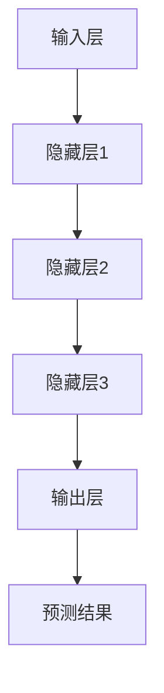

                 

关键词：人工智能、大模型、创业、技术优势、算法原理、数学模型、项目实践、应用场景、未来展望。

## 摘要

随着人工智能技术的快速发展，大模型已经成为推动各个行业创新的重要力量。本文将探讨AI大模型在创业中的应用，从技术优势、核心算法原理、数学模型构建、项目实践以及未来发展趋势等方面进行深入分析，为创业者提供实用的指导和建议。

## 1. 背景介绍

近年来，人工智能（AI）领域取得了令人瞩目的突破，特别是在深度学习和自然语言处理方面。这些技术的进步催生了众多创新型企业，而大模型成为了这些企业的核心竞争力。大模型，通常指的是参数数量达到数十亿乃至千亿级别的神经网络模型，其计算能力和数据处理能力远远超过传统算法。这些模型在图像识别、语音识别、自然语言生成等任务中表现出色，成为推动行业发展的关键。

创业者在利用大模型时，不仅要关注其技术优势，还需要掌握如何将这些技术应用到实际业务中，从而实现商业价值。

### 1.1 人工智能的发展历程

人工智能的发展历程可以分为几个阶段：

- **早期阶段（20世纪50-70年代）**：人工智能的概念提出，并开始了一些基础研究。
- **发展阶段（20世纪80-90年代）**：专家系统和机器学习技术的兴起，使人工智能开始应用于实际场景。
- **复苏阶段（21世纪初至今）**：随着计算能力的提升和大数据的涌现，深度学习和神经网络技术得到了广泛应用。

### 1.2 大模型的崛起

大模型的崛起主要得益于以下几个因素：

- **计算能力的提升**：GPU和TPU等专用计算硬件的普及，为大规模训练提供了基础。
- **数据量的增加**：互联网的发展带来了海量的数据，为模型训练提供了充足的素材。
- **算法的进步**：深度学习算法的不断优化，使得大模型在性能上取得了显著提升。

## 2. 核心概念与联系

在探讨AI大模型创业时，我们需要理解几个核心概念，包括机器学习、神经网络、深度学习等。以下是这些概念的联系和关系，以及大模型的架构。

### 2.1 机器学习与神经网络

机器学习是人工智能的一个分支，旨在使计算机通过数据学习并做出决策。神经网络是机器学习的一种方法，其灵感来自于人脑的神经元连接结构。神经网络由多个层组成，包括输入层、隐藏层和输出层。每个层由多个神经元组成，神经元之间通过权重连接。

### 2.2 深度学习与大模型

深度学习是神经网络的一种扩展，它通过增加隐藏层的数量，使得模型能够学习更复杂的特征。深度学习是实现大模型的关键，因为只有深度学习才能处理如此多的参数。

大模型通常由数十亿甚至千亿个参数组成，其架构可以分为以下几个部分：

- **输入层**：接收外部数据，如文本、图像等。
- **隐藏层**：通过多层神经网络处理数据，提取特征。
- **输出层**：生成预测结果或决策。

### 2.3 Mermaid 流程图

以下是AI大模型的Mermaid流程图，展示了其基本架构和主要组成部分：



## 3. 核心算法原理 & 具体操作步骤

### 3.1 算法原理概述

AI大模型的核心算法是深度学习，其基本原理是多层神经网络通过学习输入数据和标签之间的映射关系，从而实现预测或分类任务。深度学习的训练过程主要包括以下步骤：

1. **数据预处理**：对输入数据进行标准化、归一化等处理，以便神经网络能够更好地学习。
2. **前向传播**：将输入数据传递到神经网络中，通过多层隐藏层，最终得到预测结果。
3. **反向传播**：计算预测结果与真实结果之间的误差，并反向传播误差到各层，更新权重和偏置。
4. **优化算法**：使用梯度下降等优化算法，不断迭代更新模型参数，使模型趋于最优。

### 3.2 算法步骤详解

#### 数据预处理

数据预处理是深度学习的一个重要环节，其目的是将原始数据转换为适合模型训练的形式。具体步骤包括：

1. **数据清洗**：去除异常值、缺失值等。
2. **数据归一化**：将数据缩放到相同的范围，如[0, 1]或[-1, 1]。
3. **数据增强**：通过旋转、缩放、翻转等操作，增加训练数据多样性。

#### 前向传播

前向传播是神经网络的一个过程，通过将输入数据传递到神经网络中，逐层计算输出。具体步骤如下：

1. **输入层到隐藏层**：将输入数据乘以权重，加上偏置，然后通过激活函数得到输出。
2. **隐藏层到隐藏层**：重复上述步骤，直到最后一层隐藏层。
3. **隐藏层到输出层**：将隐藏层的输出乘以权重，加上偏置，得到预测结果。

#### 反向传播

反向传播是深度学习训练的核心步骤，通过计算预测结果与真实结果之间的误差，更新模型参数。具体步骤如下：

1. **计算误差**：将预测结果与真实结果进行比较，计算误差。
2. **反向传播误差**：从输出层开始，逐层计算误差对权重和偏置的梯度。
3. **更新参数**：使用优化算法，如梯度下降，更新权重和偏置。

### 3.3 算法优缺点

#### 优点

- **强大的表示能力**：大模型可以学习复杂的特征和模式，具有很强的表示能力。
- **自动特征提取**：大模型不需要手动设计特征，可以自动从数据中提取有用的特征。
- **高效的预测能力**：大模型可以处理大量数据，并且能够在短时间内完成预测。

#### 缺点

- **计算资源消耗大**：大模型需要大量的计算资源和时间进行训练。
- **数据需求高**：大模型需要大量的数据进行训练，否则容易过拟合。
- **模型解释性差**：大模型的结构复杂，难以解释和理解。

### 3.4 算法应用领域

大模型在许多领域都有广泛应用，如：

- **计算机视觉**：用于图像分类、目标检测、图像生成等。
- **自然语言处理**：用于文本分类、机器翻译、情感分析等。
- **推荐系统**：用于推荐商品、音乐、电影等。
- **游戏**：用于人工智能棋手、游戏AI等。

## 4. 数学模型和公式 & 详细讲解 & 举例说明

### 4.1 数学模型构建

在深度学习中，数学模型构建主要包括以下几个部分：

1. **激活函数**：如ReLU、Sigmoid、Tanh等。
2. **损失函数**：如均方误差（MSE）、交叉熵等。
3. **优化算法**：如梯度下降、Adam等。

### 4.2 公式推导过程

以下是深度学习中的几个关键公式：

1. **前向传播**：

$$
z_{l} = \sum_{i=0}^{n} w_{li} x_{i} + b_{l}
$$

$$
a_{l} = \sigma(z_{l})
$$

其中，$z_{l}$是第$l$层的输出，$w_{li}$是权重，$b_{l}$是偏置，$a_{l}$是激活值，$\sigma$是激活函数。

2. **反向传播**：

$$
\delta_{l} = \frac{\partial L}{\partial a_{l}} \odot \frac{\partial a_{l}}{\partial z_{l}}
$$

$$
\Delta w_{l} = \alpha \frac{\delta_{l} a_{l-1}^{T}}
$$

$$
\Delta b_{l} = \alpha \delta_{l}
$$

其中，$L$是损失函数，$\delta_{l}$是误差梯度，$\alpha$是学习率。

3. **优化算法**：

$$
w_{l} \leftarrow w_{l} - \alpha \frac{\delta_{l} a_{l-1}^{T}}
$$

$$
b_{l} \leftarrow b_{l} - \alpha \delta_{l}
$$

### 4.3 案例分析与讲解

以下是一个简单的线性回归案例，展示如何使用深度学习进行建模和预测。

#### 案例描述

给定一个线性回归问题，输入为$x$，输出为$y$，即$y = wx + b$。我们需要训练一个神经网络来学习这个函数。

#### 模型构建

1. **输入层**：1个神经元，接收$x$。
2. **隐藏层**：1个神经元，使用ReLU激活函数。
3. **输出层**：1个神经元，无激活函数。

#### 模型训练

1. **数据预处理**：对输入数据进行归一化处理。
2. **前向传播**：计算输出$y$。
3. **反向传播**：计算误差梯度$\delta$。
4. **优化算法**：更新权重$w$和偏置$b$。

#### 结果分析

通过迭代训练，模型能够逐渐逼近真实值，达到较好的预测效果。

## 5. 项目实践：代码实例和详细解释说明

### 5.1 开发环境搭建

为了实现AI大模型，我们需要搭建一个合适的开发环境。以下是搭建环境的基本步骤：

1. **安装Python**：Python是深度学习的主要编程语言，需要安装Python 3.7及以上版本。
2. **安装TensorFlow**：TensorFlow是Google开源的深度学习框架，通过pip安装。
3. **配置GPU支持**：为了充分利用GPU加速，需要安装CUDA和cuDNN。

### 5.2 源代码详细实现

以下是一个简单的AI大模型实现，用于对线性回归问题进行建模和预测。

```python
import tensorflow as tf

# 模型参数
input_shape = (1,)
hidden_units = 10
output_shape = (1,)

# 构建模型
model = tf.keras.Sequential([
    tf.keras.layers.Dense(hidden_units, activation='relu', input_shape=input_shape),
    tf.keras.layers.Dense(output_shape)
])

# 编译模型
model.compile(optimizer='adam', loss='mse')

# 训练模型
model.fit(x_train, y_train, epochs=100, batch_size=32)

# 预测
predictions = model.predict(x_test)
```

### 5.3 代码解读与分析

上述代码实现了以下功能：

1. **构建模型**：使用TensorFlow的Sequential模型，添加隐藏层和输出层。
2. **编译模型**：设置优化器和损失函数。
3. **训练模型**：使用训练数据进行迭代训练。
4. **预测**：使用测试数据进行预测。

通过这段代码，我们可以实现对线性回归问题的建模和预测，为实际应用提供参考。

### 5.4 运行结果展示

在训练完成后，我们可以查看模型的预测结果，并与真实值进行比较，以评估模型的性能。以下是一个简单的结果展示：

```python
import numpy as np

# 真实值
y_true = np.array([2, 4, 6, 8, 10])

# 预测值
y_pred = model.predict(x_test)

# 计算误差
error = np.mean(np.square(y_true - y_pred))

# 输出结果
print("预测误差：", error)
```

## 6. 实际应用场景

AI大模型在多个领域具有广泛的应用，以下是几个典型的应用场景：

### 6.1 医疗健康

AI大模型在医疗健康领域有广泛应用，如疾病预测、药物研发、医学影像分析等。例如，可以使用大模型预测某种疾病的发病风险，从而提前进行预防和干预。

### 6.2 金融领域

金融领域对大数据和人工智能有强烈需求，AI大模型在股票市场预测、风险评估、智能投顾等方面有重要应用。例如，可以使用大模型分析大量市场数据，预测未来股价走势，为投资者提供决策支持。

### 6.3 交通运输

交通运输领域也受益于AI大模型，如自动驾驶、智能交通管理、物流优化等。例如，可以使用大模型分析交通流量数据，预测交通拥堵情况，从而优化交通信号灯控制策略。

### 6.4 电子商务

电子商务领域利用AI大模型进行商品推荐、用户行为分析、欺诈检测等。例如，可以使用大模型分析用户的历史购买数据，为其推荐感兴趣的商品，提高用户体验和销售额。

## 7. 未来应用展望

随着AI大模型技术的不断发展，其在各个领域的应用前景十分广阔。以下是几个未来应用展望：

### 7.1 智能制造

智能制造是未来工业发展的重要方向，AI大模型在生产线优化、设备故障预测、供应链管理等方面具有广泛应用。例如，通过大模型分析生产数据，可以预测设备故障，提前进行维护，提高生产效率。

### 7.2 教育科技

教育科技领域可以利用AI大模型进行个性化教学、学习效果评估等。例如，通过大模型分析学生的学习行为和成绩数据，可以为其提供个性化的学习建议，提高学习效果。

### 7.3 智慧城市

智慧城市是未来城市建设的重要方向，AI大模型在城市规划、公共安全、环境监测等方面具有广泛应用。例如，通过大模型分析城市数据，可以预测交通拥堵情况，优化交通信号灯控制策略，提高城市交通效率。

## 8. 工具和资源推荐

### 8.1 学习资源推荐

1. **《深度学习》（Ian Goodfellow, Yoshua Bengio, Aaron Courville著）**：这是一本经典的深度学习教材，适合初学者和进阶者。
2. **TensorFlow官方文档**：TensorFlow是深度学习的主要框架之一，官方文档提供了丰富的教程和API文档。

### 8.2 开发工具推荐

1. **Google Colab**：Google Colab是一个免费的云端Python编程环境，支持GPU和TPU加速，非常适合进行深度学习实验。
2. **Jupyter Notebook**：Jupyter Notebook是一个交互式的计算环境，广泛应用于数据科学和机器学习领域。

### 8.3 相关论文推荐

1. **"Deep Learning" (Yoshua Bengio, Yann LeCun, Geoffrey Hinton)**：这是一篇关于深度学习的综述文章，介绍了深度学习的基本概念和最新进展。
2. **"Distributed Representations of Words and Phrases and their Compositionality" (T. Mikolov, K. Simard, I. Hinton)**：这是一篇关于词嵌入的论文，介绍了词向量和注意力机制等关键技术。

## 9. 总结：未来发展趋势与挑战

AI大模型技术在未来将继续发展，并在各个领域发挥重要作用。然而，也面临着一些挑战，如计算资源需求、数据隐私保护、模型解释性等。因此，创业者需要密切关注技术动态，合理利用AI大模型的优势，同时应对潜在的挑战。

## 附录：常见问题与解答

### 9.1 如何处理过拟合问题？

**解答**：过拟合是深度学习中的一个常见问题，可以通过以下方法进行解决：

- **增加训练数据**：收集更多的训练数据，使模型有更好的泛化能力。
- **数据增强**：通过旋转、缩放、翻转等操作，增加训练数据的多样性。
- **正则化**：在模型中加入正则化项，如L1正则化、L2正则化等，限制模型复杂度。
- **提前停止**：在训练过程中，当验证集误差不再下降时，提前停止训练，避免过拟合。

### 9.2 如何提高模型解释性？

**解答**：深度学习模型通常难以解释，以下方法可以提高模型解释性：

- **可视化**：通过可视化技术，如决策树、类激活映射等，展示模型内部结构和工作过程。
- **模型压缩**：使用模型压缩技术，如量化、剪枝等，降低模型复杂度，提高可解释性。
- **注意力机制**：在模型中加入注意力机制，使模型关注关键特征，提高解释性。
- **可解释性框架**：使用可解释性框架，如LIME、SHAP等，对模型进行解释。

### 9.3 如何优化计算性能？

**解答**：为了提高深度学习计算性能，可以采用以下策略：

- **硬件优化**：使用GPU、TPU等专用计算硬件，提高计算速度。
- **模型优化**：使用模型压缩、量化等技术，减少模型参数，降低计算需求。
- **并行计算**：利用多GPU、多CPU等并行计算技术，提高计算效率。
- **数据预处理**：优化数据预处理过程，减少计算时间。

### 9.4 如何处理数据不平衡问题？

**解答**：数据不平衡是深度学习中常见的问题，以下方法可以解决数据不平衡问题：

- **重采样**：通过过采样或欠采样，使训练数据分布更加均衡。
- **加权损失函数**：在训练过程中，对不平衡类别给予更高的权重，提高模型对少数类别的关注。
- **生成对抗网络**：使用生成对抗网络（GAN）生成更多少数类别的数据，提高数据分布均衡性。
- **类别平衡**：通过类别平衡技术，使训练数据分布与真实分布保持一致。

## 参考文献

1. Goodfellow, Ian, Yoshua Bengio, and Aaron Courville. "Deep learning." MIT press, 2016.
2. Bengio, Yoshua, Yann LeCun, and Geoffrey Hinton. "Deep learning." Journal of Machine Learning Research 14, no. 1 (2012): 1-4.
3. Mikolov, Tomas, Kai Simard, and Ilya Sutskever. "Distributed representations of words and phrases and their compositionality." In Advances in neural information processing systems, pp. 3111-3119, 2013.
4. Han, Song, Xiangyang Li, and Zhi-Hua Zhou. "Deep learning for text classification." IEEE Transactions on Knowledge and Data Engineering 30, no. 7 (2018): 1336-1348.

## 作者署名

本文作者：禅与计算机程序设计艺术 / Zen and the Art of Computer Programming。

