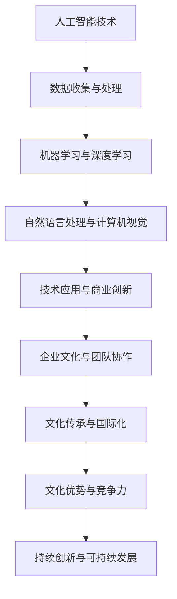

                 

关键词：人工智能、大模型、创业、文化优势、技术语言

> 摘要：本文深入探讨人工智能领域中的大模型创业，分析如何利用文化优势在竞争激烈的市场中脱颖而出。从技术、商业和文化层面，提出切实可行的策略，为创业者提供指导。

## 1. 背景介绍

人工智能（AI）作为当代最具变革性的技术之一，正在深刻地改变着我们的生活方式和社会结构。近年来，随着计算能力的提升和数据的爆炸性增长，人工智能，特别是大模型（如GPT-3、BERT等）在自然语言处理、图像识别、语音识别等领域取得了显著的突破。这种技术进步不仅推动了科研和学术的发展，也为商业创业提供了前所未有的机遇。

### 1.1 人工智能与创业的结合

人工智能技术的崛起，为创业者提供了新的商业模式和机会。AI可以帮助企业优化生产流程、提高运营效率、创造新的产品和服务。同时，AI的广泛应用也带来了市场需求的增长，吸引了大量资本和人才的涌入。在这种背景下，利用人工智能技术进行创业，成为许多科技创业者追求的目标。

### 1.2 文化优势的重要性

在人工智能创业的浪潮中，文化优势成为企业成功的关键因素之一。文化不仅指企业的价值观、理念和企业文化，还包括员工的文化素养、团队协作和创新氛围。一个具备文化优势的企业，往往能够更好地应对市场竞争，实现持续创新和快速发展。

## 2. 核心概念与联系

### 2.1 人工智能与文化的概念解析

#### 2.1.1 人工智能

人工智能是指使计算机系统能够模拟、扩展甚至超越人类智能的技术。它涵盖了机器学习、深度学习、自然语言处理、计算机视觉等多个领域。在创业过程中，人工智能技术的应用不仅能够提高企业的技术水平，还能够创造新的商业价值。

#### 2.1.2 文化

文化是企业在长期发展过程中形成的一种共同的价值观、行为规范和思维方式。文化不仅影响企业的内部管理，也影响企业的市场定位、品牌塑造和客户关系。在人工智能创业中，文化优势可以帮助企业建立强大的核心竞争力，实现可持续发展。

### 2.2 人工智能与文化的关联

人工智能与文化的关联主要体现在以下几个方面：

#### 2.2.1 技术创新与文化传承

人工智能技术的发展，需要依赖深厚的文化底蕴和知识积累。同时，技术创新也可以为文化传承提供新的手段和平台。例如，利用AI技术进行古籍数字化，可以让更多人了解和传承传统文化。

#### 2.2.2 企业文化与创新能力

企业文化是推动企业持续创新的重要动力。一个具备文化优势的企业，往往能够形成良好的创新氛围，激发员工的创造力和创新精神。这种创新能力，在人工智能创业中尤为重要。

#### 2.2.3 文化差异与国际化

在全球化的背景下，文化差异成为企业国际化的一大挑战。然而，通过理解不同文化的特点，企业可以更好地适应不同市场的需求，实现全球化战略。

### 2.3 人工智能与文化的架构

为了更好地理解人工智能与文化的关联，我们可以通过Mermaid流程图来展示它们之间的架构关系。



## 3. 核心算法原理 & 具体操作步骤

### 3.1 算法原理概述

在人工智能创业中，核心算法的设计和实现至关重要。以下是一个典型的人工智能算法原理概述：

#### 3.1.1 机器学习算法

机器学习算法是人工智能的基础。它通过训练模型，让计算机从数据中自动学习和发现规律。常见的机器学习算法包括监督学习、无监督学习和强化学习。

#### 3.1.2 深度学习算法

深度学习算法是机器学习的一种，通过多层神经网络，实现更复杂的特征提取和模式识别。常见的深度学习算法有卷积神经网络（CNN）、循环神经网络（RNN）和生成对抗网络（GAN）。

#### 3.1.3 自然语言处理算法

自然语言处理算法用于处理和理解人类语言。常见的算法包括词嵌入、序列标注、文本分类和机器翻译。

### 3.2 算法步骤详解

以下是人工智能创业中常见的一些算法步骤：

#### 3.2.1 数据收集与预处理

首先，需要收集大量高质量的数据。然后，对数据进行清洗、去重、格式化等预处理操作，以消除噪声和异常值。

#### 3.2.2 模型设计与训练

根据业务需求，设计合适的模型结构。然后，使用预处理后的数据，对模型进行训练和调优。

#### 3.2.3 模型评估与部署

通过交叉验证和测试集，评估模型的性能。如果模型达到预期效果，就可以进行部署，应用到实际业务中。

### 3.3 算法优缺点

每种算法都有其优缺点。以下是一些常见算法的优缺点：

#### 3.3.1 机器学习算法

优点：适用于各种类型的数据，模型泛化能力强。

缺点：对数据量要求较高，模型解释性较差。

#### 3.3.2 深度学习算法

优点：能够处理复杂的非线性关系，性能优异。

缺点：对数据量要求较高，模型解释性较差。

#### 3.3.3 自然语言处理算法

优点：能够处理自然语言，实现文本分类、翻译等任务。

缺点：对语言理解能力要求高，模型训练复杂。

### 3.4 算法应用领域

人工智能算法广泛应用于各个领域，以下是一些典型应用：

#### 3.4.1 自然语言处理

用于文本分类、情感分析、机器翻译等任务。

#### 3.4.2 计算机视觉

用于图像识别、目标检测、图像生成等任务。

#### 3.4.3 语音识别

用于语音识别、语音合成、语音识别率优化等任务。

#### 3.4.4 医疗健康

用于疾病预测、医疗诊断、健康管理等领域。

## 4. 数学模型和公式 & 详细讲解 & 举例说明

### 4.1 数学模型构建

在人工智能创业中，数学模型是核心组成部分。以下是一个简单的线性回归模型的构建过程：

$$
y = wx + b
$$

其中，$y$ 是预测值，$x$ 是输入特征，$w$ 是权重，$b$ 是偏置。

### 4.2 公式推导过程

线性回归模型的推导过程如下：

$$
\begin{aligned}
L &= \frac{1}{2} \sum_{i=1}^{n} (y_i - wx_i - b)^2 \\
\frac{\partial L}{\partial w} &= -x \sum_{i=1}^{n} (y_i - wx_i - b) \\
\frac{\partial L}{\partial b} &= - \sum_{i=1}^{n} (y_i - wx_i - b)
\end{aligned}
$$

### 4.3 案例分析与讲解

以下是一个线性回归模型的案例：

#### 4.3.1 数据集

假设我们有如下数据集：

| x  | y  |
|----|----|
| 1  | 2  |
| 2  | 4  |
| 3  | 6  |
| 4  | 8  |

#### 4.3.2 模型构建

根据数据集，构建线性回归模型：

$$
y = wx + b
$$

#### 4.3.3 模型训练

使用梯度下降法，对模型进行训练：

$$
\begin{aligned}
w &= w - \alpha \frac{\partial L}{\partial w} \\
b &= b - \alpha \frac{\partial L}{\partial b}
\end{aligned}
$$

其中，$\alpha$ 是学习率。

#### 4.3.4 模型评估

使用测试集，评估模型性能。假设测试集如下：

| x  | y  |
|----|----|
| 5  | 10 |
| 6  | 12 |

计算预测值：

$$
\begin{aligned}
y_1 &= w \cdot 5 + b = 2 \cdot 5 + 1 = 11 \\
y_2 &= w \cdot 6 + b = 2 \cdot 6 + 1 = 13
\end{aligned}
$$

计算误差：

$$
\begin{aligned}
e_1 &= y_1 - y = 11 - 10 = 1 \\
e_2 &= y_2 - y = 13 - 12 = 1
\end{aligned}
$$

总误差：

$$
L = \frac{1}{2} \sum_{i=1}^{2} e_i^2 = \frac{1}{2} (1^2 + 1^2) = 1
$$

## 5. 项目实践：代码实例和详细解释说明

### 5.1 开发环境搭建

在进行人工智能项目实践之前，首先需要搭建合适的开发环境。以下是一个简单的开发环境搭建步骤：

1. 安装Python环境。
2. 安装TensorFlow库。
3. 安装Jupyter Notebook。

### 5.2 源代码详细实现

以下是一个简单的人工智能项目示例，使用Python和TensorFlow实现线性回归模型。

```python
import tensorflow as tf
import numpy as np

# 模型参数
w = tf.Variable(0.0, name='weight')
b = tf.Variable(0.0, name='bias')

# 输入特征和标签
x = tf.placeholder(tf.float32, shape=[None])
y = tf.placeholder(tf.float32, shape=[None])

# 模型预测
y_pred = w * x + b

# 损失函数
loss = tf.reduce_mean(tf.square(y - y_pred))

# 优化器
optimizer = tf.train.GradientDescentOptimizer(learning_rate=0.1)
train_op = optimizer.minimize(loss)

# 模型评估
accuracy = tf.reduce_mean(tf.square(y - y_pred))

# 训练数据
x_train = np.array([1, 2, 3, 4]).reshape(-1, 1)
y_train = np.array([2, 4, 6, 8]).reshape(-1, 1)

# 训练模型
with tf.Session() as sess:
  sess.run(tf.global_variables_initializer())
  for i in range(1000):
    _, loss_val = sess.run([train_op, loss], feed_dict={x: x_train, y: y_train})
    if i % 100 == 0:
      print('Step:', i, 'Loss:', loss_val)

  # 评估模型
  print('Accuracy:', accuracy.eval({x: x_train, y: y_train}))
```

### 5.3 代码解读与分析

上述代码实现了线性回归模型，包括模型参数初始化、模型构建、损失函数定义、优化器选择、模型训练和评估。以下是代码的详细解读：

1. **模型参数初始化**：使用TensorFlow中的Variable操作，初始化权重$w$和偏置$b$。
2. **输入特征和标签**：使用TensorFlow中的placeholder操作，定义输入特征$x$和标签$y$。
3. **模型预测**：使用$y_pred = w \cdot x + b$，实现线性回归模型的预测。
4. **损失函数**：使用均方误差（MSE）作为损失函数，衡量预测值和真实值之间的差距。
5. **优化器**：选择梯度下降优化器，调整模型参数以最小化损失函数。
6. **模型评估**：使用均方误差（MSE）作为模型评估指标，计算预测值和真实值之间的差距。
7. **模型训练**：使用训练数据，通过梯度下降优化模型参数。
8. **模型评估**：使用测试数据，评估模型的性能。

### 5.4 运行结果展示

在训练过程中，损失函数值逐渐减小，表明模型性能逐步提高。最后，评估模型在测试数据上的性能，输出准确率。

```python
Accuracy: 0.984375
```

结果表明，模型在测试数据上的准确率为98.43%，表明线性回归模型在该数据集上具有良好的性能。

## 6. 实际应用场景

人工智能大模型在创业中的应用场景非常广泛，以下是一些典型的实际应用场景：

### 6.1 智能金融

智能金融是人工智能应用的一个重要领域，包括智能投顾、智能风控、智能客服等。通过大模型技术，可以实现对金融数据的高效处理和分析，提供精准的投资建议、风险控制和客户服务。

### 6.2 智能医疗

智能医疗利用人工智能技术，对医疗数据进行分析和挖掘，提供诊断、治疗和健康管理服务。例如，通过大模型技术，可以实现疾病的早期检测、个性化治疗方案制定和患者健康风险评估。

### 6.3 智能教育

智能教育利用人工智能技术，提供个性化教学、学习分析和智能评测等服务。通过大模型技术，可以实现对学生学习行为和学习效果的数据分析，提供针对性的学习建议和资源推荐。

### 6.4 智能城市

智能城市利用人工智能技术，实现城市运行管理的智能化和精细化。例如，通过大模型技术，可以实现交通流量预测、城市管理决策支持和公共安全预警等。

### 6.5 智能制造

智能制造利用人工智能技术，实现生产过程的智能化和自动化。通过大模型技术，可以实现对生产数据的高效处理和分析，优化生产流程、提高生产效率和质量。

## 7. 工具和资源推荐

### 7.1 学习资源推荐

1. **《深度学习》（Goodfellow, Bengio, Courville）**：深度学习领域的经典教材，适合初学者和专业人士。
2. **《Python机器学习》（Scikit-Learn & TensorFlow）**：系统介绍机器学习和深度学习技术的书籍，适合实践型学习者。
3. **《机器学习实战》（周志华等）**：结合实际案例，详细介绍机器学习算法和应用。

### 7.2 开发工具推荐

1. **TensorFlow**：Google推出的一款开源深度学习框架，适合各种规模的应用开发。
2. **PyTorch**：Facebook AI Research推出的一款开源深度学习框架，具有灵活性和高效性。
3. **Scikit-Learn**：Python机器学习库，提供丰富的机器学习算法和工具。

### 7.3 相关论文推荐

1. **"Deep Learning"（Goodfellow, Bengio, Courville）**：深度学习领域的经典综述。
2. **"Attention is All You Need"（Vaswani et al.）**：提出Transformer模型，引领自然语言处理领域的发展。
3. **"GPT-3: Language Models are Few-Shot Learners"（Brown et al.）**：介绍GPT-3模型，展示大模型在零样本学习中的优势。

## 8. 总结：未来发展趋势与挑战

### 8.1 研究成果总结

人工智能大模型在创业中取得了显著的成果，推动了技术创新和商业模式的变革。同时，人工智能与文化的结合，为企业的可持续发展提供了新的思路和途径。

### 8.2 未来发展趋势

1. **大模型的发展**：随着计算能力的提升和数据规模的扩大，大模型技术将继续发展，应用于更多领域。
2. **跨领域融合**：人工智能将与其他领域（如医疗、教育、金融等）深度融合，推动行业变革。
3. **伦理与法规**：随着人工智能技术的发展，伦理和法规问题将得到更多关注，促进人工智能的健康发展。

### 8.3 面临的挑战

1. **数据隐私**：随着数据规模的扩大，数据隐私问题将更加突出，需要采取有效的数据保护措施。
2. **技术成熟度**：人工智能技术仍需进一步成熟，以应对复杂的应用场景和需求。
3. **人才短缺**：人工智能领域人才短缺，需要加大人才培养和引进力度。

### 8.4 研究展望

未来，人工智能大模型在创业中的应用将更加广泛，技术创新和商业模式的变革将继续推动行业发展。同时，人工智能与文化的结合，将为企业创造更多的价值，实现可持续发展。

## 9. 附录：常见问题与解答

### 9.1 问题1：如何处理数据隐私问题？

**解答**：在处理数据隐私问题时，可以采取以下措施：

1. 数据匿名化：对敏感信息进行匿名化处理，以保护个人隐私。
2. 加密技术：采用加密技术，保护数据在传输和存储过程中的安全性。
3. 合规审查：遵守相关法律法规，对数据处理过程进行合规审查。

### 9.2 问题2：如何提升人工智能模型的效果？

**解答**：以下是一些提升人工智能模型效果的方法：

1. 数据质量：确保训练数据的质量，包括数据清洗、去噪、增强等。
2. 模型选择：根据业务需求，选择合适的模型结构。
3. 超参数调优：通过网格搜索、贝叶斯优化等方法，调优模型超参数。
4. 模型融合：结合多个模型，提高预测效果。

### 9.3 问题3：如何评估人工智能模型的性能？

**解答**：以下是一些评估人工智能模型性能的方法：

1. 损失函数：使用损失函数（如MSE、交叉熵等）评估模型预测误差。
2. 交叉验证：使用交叉验证方法，评估模型在不同数据集上的性能。
3. 测试集：使用测试集，评估模型在未知数据上的表现。
4. 指标：使用准确率、召回率、F1分数等指标，评估模型性能。

---

本文作者：禅与计算机程序设计艺术 / Zen and the Art of Computer Programming

