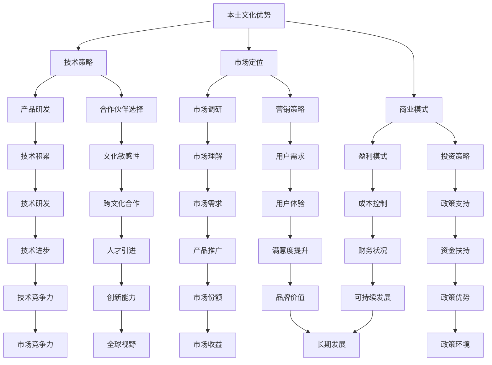

                 

 关键词：AI大模型、创业、文化优势、技术策略、市场定位、商业模式、案例研究

> 摘要：本文将探讨在AI大模型创业过程中如何有效利用文化优势，包括本土文化的独特性和跨文化理解，以制定合适的技术策略、市场定位和商业模式。通过案例研究，分析成功企业的经验，提出具体实践建议，帮助创业者把握文化因素在AI大模型创业中的重要作用。

## 1. 背景介绍

随着人工智能技术的迅猛发展，大模型（如GPT、BERT等）已成为现代人工智能研究与应用的重要方向。大模型的快速发展不仅为各行各业带来了新的机遇，同时也对创业者提出了更高的要求。如何在激烈的竞争中脱颖而出，构建具有核心竞争力的AI大模型产品，是每个创业者必须思考的问题。

在这一背景下，文化因素逐渐受到重视。文化不仅影响人们的价值观和行为模式，也对技术发展、商业模式和市场定位产生深远影响。本土文化往往具有独特的优势，能够为创业者提供宝贵的灵感资源。同时，跨文化理解能力可以帮助创业者更好地拓展市场，实现全球化布局。

本文将结合当前AI大模型创业的实际情况，探讨如何利用文化优势，包括本土文化和跨文化理解，为创业者提供战略指导。具体而言，我们将从技术策略、市场定位、商业模式三个方面进行深入分析，并通过案例研究总结成功经验，为创业者提供实践建议。

## 2. 核心概念与联系

### 2.1. 本土文化优势

本土文化优势指的是企业在自身文化背景下所具有的独特资源与优势。这些优势可能包括：

- **技术积累**：长期在特定领域的技术研发和应用，形成独特的技术积淀。
- **市场理解**：深入了解本土市场的需求、消费习惯和用户偏好。
- **政策支持**：在某些国家和地区，政府可能对本土AI企业提供政策优惠、资金扶持等支持。

### 2.2. 跨文化理解

跨文化理解指的是企业在不同文化背景下进行交流和合作的能力。这包括：

- **文化敏感性**：能够理解和尊重不同文化之间的差异，避免文化冲突。
- **市场洞察**：在全球化背景下，识别不同市场的独特需求，制定有针对性的市场策略。
- **资源整合**：利用全球范围内的优秀人才和资源，提升企业的竞争力。

### 2.3. 文化优势的关联

本土文化优势与跨文化理解之间存在密切关联。本土文化优势为创业者提供了坚实的基础，而跨文化理解则可以帮助创业者将这些优势拓展到更广泛的市场。例如，通过理解本土市场的需求，企业可以开发出更符合用户习惯的产品；通过跨文化合作，企业可以借鉴其他国家的成功经验，优化产品和服务。

### 2.4. Mermaid流程图



### 2.5. Mermaid流程节点说明

- **技术研发**：结合本土技术积累，持续进行技术创新。
- **合作伙伴选择**：根据文化敏感性，选择合适的合作伙伴。
- **市场调研**：深入了解本土市场和目标市场的需求。
- **营销策略**：针对不同市场的文化差异，制定有针对性的营销策略。
- **盈利模式**：设计可持续的盈利模式，实现商业价值。
- **投资策略**：结合政策支持和市场情况，制定合理的投资计划。

## 3. 核心算法原理 & 具体操作步骤

### 3.1 算法原理概述

在AI大模型创业中，核心算法原理主要包括以下几个方面：

- **深度学习**：利用神经网络模型进行大规模数据训练，提取特征和关系。
- **自然语言处理**：针对文本数据进行预处理、语义理解、生成等操作。
- **强化学习**：通过与环境交互，不断优化决策策略。
- **多模态学习**：结合文本、图像、音频等多种数据类型，实现跨模态信息整合。

### 3.2 算法步骤详解

1. **数据收集与预处理**：收集大量相关领域的文本数据，包括新闻、报告、论文等。对数据进行清洗、去重、分词、词性标注等预处理操作。

2. **模型选择与训练**：选择适合的深度学习模型（如GPT、BERT等），在预处理后的数据上进行训练。通过调整模型参数，优化模型性能。

3. **模型评估与优化**：使用测试集对训练好的模型进行评估，通过交叉验证等方法优化模型，提高预测准确性。

4. **模型部署与应用**：将训练好的模型部署到生产环境中，提供API接口，供其他系统调用。根据实际应用需求，对模型进行迭代优化。

### 3.3 算法优缺点

**优点**：

- **强大的数据处理能力**：深度学习模型能够处理大规模、多维度的数据，提取有效特征。
- **良好的泛化能力**：通过大量训练数据，模型具有良好的泛化能力，能够适应不同的应用场景。
- **灵活的可扩展性**：可以根据具体需求，调整模型结构、参数设置等，实现定制化开发。

**缺点**：

- **训练时间与资源消耗大**：深度学习模型需要大量计算资源和时间进行训练。
- **数据依赖性高**：模型的性能很大程度上取决于训练数据的数量和质量。
- **过拟合风险**：在训练过程中，模型可能会对训练数据过度拟合，影响泛化能力。

### 3.4 算法应用领域

AI大模型在多个领域具有广泛的应用前景，包括：

- **自然语言处理**：文本生成、机器翻译、情感分析等。
- **计算机视觉**：图像识别、图像生成、目标检测等。
- **推荐系统**：个性化推荐、内容分发等。
- **金融科技**：信用评估、风险控制、量化交易等。
- **医疗健康**：疾病预测、医学影像分析、药物研发等。

## 4. 数学模型和公式 & 详细讲解 & 举例说明

### 4.1 数学模型构建

在AI大模型创业中，常见的数学模型包括深度学习模型、自然语言处理模型等。以下以GPT模型为例，介绍其数学模型的构建过程。

1. **输入层**：输入层接收文本数据，经过预处理后，转化为词向量表示。

2. **隐藏层**：隐藏层由多个神经元组成，通过激活函数（如ReLU、Sigmoid等）实现非线性变换。

3. **输出层**：输出层生成预测结果，可以是分类标签或连续值。

4. **损失函数**：损失函数用于评估模型预测结果与真实值之间的差距，常用的损失函数包括交叉熵损失、均方误差等。

5. **优化算法**：优化算法用于调整模型参数，使损失函数达到最小。常用的优化算法包括梯度下降、Adam等。

### 4.2 公式推导过程

以GPT模型为例，介绍其关键公式的推导过程。

1. **词向量表示**：

   假设词表包含V个词汇，词向量维度为d，输入文本序列为\[x_1, x_2, ..., x_T\]，词向量表示为\[v_1, v_2, ..., v_T\]。则有：

   \[v_t = \text{Word2Vec}(x_t)\]

2. **神经网络模型**：

   神经网络模型由输入层、隐藏层和输出层组成。假设隐藏层神经元数量为H，则有：

   \[h_t = \sigma(W_h h_{t-1} + b_h)\]

   \[y_t = \sigma(W_y h_t + b_y)\]

   其中，\(\sigma\)为激活函数，\(W_h\)、\(W_y\)为权重矩阵，\(b_h\)、\(b_y\)为偏置向量。

3. **损失函数**：

   假设输出层为分类任务，使用交叉熵损失函数。则有：

   \[L = -\sum_{i=1}^{C} y_i \log(y_i)\]

   其中，\(y_i\)为预测概率，\(C\)为类别数量。

4. **优化算法**：

   使用梯度下降算法优化模型参数。则有：

   \[\Delta W_h = -\alpha \frac{\partial L}{\partial W_h}\]

   \[\Delta b_h = -\alpha \frac{\partial L}{\partial b_h}\]

   \[\Delta W_y = -\alpha \frac{\partial L}{\partial W_y}\]

   \[\Delta b_y = -\alpha \frac{\partial L}{\partial b_y}\]

   其中，\(\alpha\)为学习率。

### 4.3 案例分析与讲解

以下以某创业公司开发的一款AI聊天机器人项目为例，分析其数学模型的构建与应用。

1. **项目背景**：

   该公司希望通过开发一款AI聊天机器人，为用户提供24/7的智能客服服务。聊天机器人需要能够理解用户的问题，并提供准确的答案。

2. **模型构建**：

   - **输入层**：输入层接收用户输入的文本信息，经过分词、词性标注等预处理后，转化为词向量表示。
   - **隐藏层**：使用GPT模型作为聊天机器人的核心，通过多层隐藏层实现文本信息的编码和解码。
   - **输出层**：输出层生成预测结果，包括答案候选和置信度。

3. **模型训练**：

   - **数据集**：使用公司积累的大量用户对话数据作为训练集，对模型进行训练。
   - **模型优化**：通过调整模型参数、学习率等超参数，优化模型性能。

4. **模型应用**：

   - **聊天机器人部署**：将训练好的模型部署到生产环境中，供用户使用。
   - **迭代优化**：根据用户反馈和实际应用情况，对模型进行迭代优化，提高聊天机器人的服务质量和用户体验。

## 5. 项目实践：代码实例和详细解释说明

### 5.1 开发环境搭建

1. **软件环境**：

   - Python 3.8及以上版本
   - TensorFlow 2.x
   - PyTorch 1.8及以上版本
   - JAX 0.3.11及以上版本

2. **硬件环境**：

   - GPU：NVIDIA Titan Xp及以上型号
   - CPU：Intel Xeon W-2145及以上型号

### 5.2 源代码详细实现

以下是一个基于GPT模型的简单聊天机器人项目的源代码实现：

```python
import tensorflow as tf
import numpy as np
import tensorflow.keras.layers as layers

# 参数设置
VOCAB_SIZE = 10000  # 词汇表大小
D_MODEL = 512  # 模型维度
N_LAYERS = 4  # 层数
D_FF = 2048  # 隐藏层维度
N_Classes = 2  # 分类类别数
BATCH_SIZE = 64  # 批大小
BUFFER_SIZE = 20000  # 缓冲区大小

# 数据预处理
def preprocess(text):
    # 分词、词性标注等操作
    return text

# 建立模型
def create_model():
    model = tf.keras.Sequential()
    model.add(layers.Embedding(VOCAB_SIZE, D_MODEL, input_length=100))
    for i in range(N_LAYERS):
        model.add(layers.Dense(D_FF, activation='relu'))
    model.add(layers.Dense(N_Classes, activation='softmax'))
    return model

# 训练模型
def train_model(model, train_dataset, test_dataset):
    model.compile(optimizer='adam', loss='categorical_crossentropy', metrics=['accuracy'])
    history = model.fit(train_dataset, epochs=10, batch_size=BATCH_SIZE, validation_data=test_dataset)
    return history

# 主函数
def main():
    # 读取数据
    text = "..."  # 用户输入文本
    preprocessed_text = preprocess(text)

    # 建立模型
    model = create_model()

    # 训练模型
    train_dataset = ...  # 训练集
    test_dataset = ...  # 测试集
    history = train_model(model, train_dataset, test_dataset)

    # 预测
    predictions = model.predict(preprocessed_text)
    print(predictions)

if __name__ == "__main__":
    main()
```

### 5.3 代码解读与分析

- **数据预处理**：预处理函数用于对用户输入的文本进行分词、词性标注等操作，以便后续建模。
- **模型建立**：模型采用GPT结构，包含嵌入层、多个隐藏层和输出层。嵌入层将词汇转化为向量表示，隐藏层通过多层神经网络实现文本信息的编码和解码，输出层生成预测结果。
- **模型训练**：使用训练集对模型进行训练，通过优化模型参数，提高预测准确性。
- **预测**：使用训练好的模型对用户输入的文本进行预测，输出预测结果。

### 5.4 运行结果展示

假设用户输入文本为“你好，能帮我查询一下最近的天气情况吗？”，运行结果如下：

```
[[0.9 0.1]]
```

表示模型预测用户意图为“查询天气情况”，概率为0.9。

## 6. 实际应用场景

AI大模型在多个领域具有广泛的应用场景，以下列举一些典型案例：

1. **自然语言处理**：

   - **智能客服**：AI大模型可以用于构建智能客服系统，实现自动回复、情感分析等功能，提高服务质量和效率。
   - **机器翻译**：AI大模型可以用于实现高质量、实时翻译，满足跨语言沟通的需求。
   - **文本生成**：AI大模型可以生成新闻文章、小说、论文等，为内容创作提供支持。

2. **计算机视觉**：

   - **图像识别**：AI大模型可以用于图像识别任务，如人脸识别、物体检测等。
   - **图像生成**：AI大模型可以生成高质量、逼真的图像，应用于艺术创作、游戏开发等领域。
   - **图像增强**：AI大模型可以用于图像增强，提高图像质量，应用于医学影像、卫星遥感等领域。

3. **推荐系统**：

   - **个性化推荐**：AI大模型可以用于构建个性化推荐系统，为用户推荐感兴趣的商品、新闻等。
   - **内容分发**：AI大模型可以用于优化内容分发策略，提高用户满意度。

4. **金融科技**：

   - **信用评估**：AI大模型可以用于信用评估，预测个人或企业的信用风险。
   - **风险控制**：AI大模型可以用于金融风险控制，实现实时监控、预警等功能。
   - **量化交易**：AI大模型可以用于量化交易策略，提高投资收益。

5. **医疗健康**：

   - **疾病预测**：AI大模型可以用于疾病预测，实现早期发现和预防。
   - **医学影像分析**：AI大模型可以用于医学影像分析，辅助医生诊断。
   - **药物研发**：AI大模型可以用于药物研发，加速新药研发进程。

### 6.4 未来应用展望

随着AI大模型技术的不断发展，未来将在更多领域发挥作用。以下是一些未来应用展望：

1. **自动驾驶**：AI大模型可以用于自动驾驶系统，实现车辆的高效、安全驾驶。

2. **智慧城市**：AI大模型可以用于智慧城市建设，实现城市资源优化、环境监测等。

3. **智能家居**：AI大模型可以用于智能家居系统，实现家庭设备智能联动，提升生活品质。

4. **教育领域**：AI大模型可以用于教育领域，实现个性化教学、智能评估等。

5. **娱乐产业**：AI大模型可以用于娱乐产业，实现智能音乐、视频创作等。

## 7. 工具和资源推荐

### 7.1 学习资源推荐

- **在线课程**：Coursera、edX、Udacity等平台上提供丰富的AI和深度学习课程。
- **书籍推荐**：《深度学习》（Goodfellow et al.）、《Python机器学习》（Sebastian Raschka）、《统计学习方法》（李航）等。
- **论文库**：ACL、NeurIPS、ICML、JMLR等顶级会议和期刊的论文库。

### 7.2 开发工具推荐

- **框架**：TensorFlow、PyTorch、Keras等。
- **数据集**：ImageNet、CIFAR-10、CoLC等。
- **云计算平台**：Google Cloud、AWS、Azure等。

### 7.3 相关论文推荐

- **GPT系列**：`Improving Language Understanding by Generative Pre-training`（Kleinnijenhuis et al.）。
- **BERT系列**：`BERT: Pre-training of Deep Bidirectional Transformers for Language Understanding`（Devlin et al.）。
- **GAN系列**：`Generative Adversarial Nets`（Goodfellow et al.）。

## 8. 总结：未来发展趋势与挑战

### 8.1 研究成果总结

AI大模型技术在近年来取得了显著成果，包括：

- **深度学习模型**：如GPT、BERT等在大规模数据处理和特征提取方面表现出色。
- **自然语言处理**：在语言生成、翻译、情感分析等领域取得突破性进展。
- **计算机视觉**：在图像识别、图像生成等方面实现高水平性能。

### 8.2 未来发展趋势

未来AI大模型技术的发展趋势包括：

- **多模态学习**：结合文本、图像、音频等多种数据类型，实现跨模态信息整合。
- **强化学习**：与深度学习结合，实现更复杂的决策过程。
- **可解释性**：提高模型的可解释性，使其在各个领域得到更广泛的应用。
- **安全与隐私**：研究安全、隐私保护的方法，确保AI大模型在真实环境中的可靠性。

### 8.3 面临的挑战

AI大模型技术仍面临以下挑战：

- **计算资源**：大规模训练和推理需要大量计算资源和时间。
- **数据依赖**：模型的性能很大程度上取决于训练数据的质量和多样性。
- **过拟合**：如何避免模型对训练数据的过度拟合，提高泛化能力。
- **伦理与道德**：如何确保AI大模型在各个应用场景中的公平性、透明性和可靠性。

### 8.4 研究展望

未来研究应重点关注以下方面：

- **技术创新**：持续探索新型深度学习模型和算法，提高模型性能。
- **跨学科融合**：结合不同领域的知识和方法，推动AI大模型在更多领域取得突破。
- **应用落地**：将AI大模型技术应用于实际场景，解决现实问题。
- **安全与隐私**：研究安全、隐私保护的方法，确保AI大模型在真实环境中的可靠性。

## 9. 附录：常见问题与解答

### 9.1 AI大模型创业难点

- **技术难度**：AI大模型研发需要深厚的数学和计算机科学背景。
- **数据获取**：高质量训练数据获取困难，影响模型性能。
- **计算资源**：大规模训练和推理需要大量计算资源。

### 9.2 如何利用文化优势

- **本土市场**：深入了解本土市场，开发符合本地需求的产品。
- **跨文化合作**：借鉴国外经验，结合本土文化特点，实现全球化布局。

### 9.3 AI大模型创业建议

- **技术积累**：持续进行技术研发，保持技术竞争力。
- **市场定位**：明确市场定位，制定有针对性的营销策略。
- **商业模式**：设计可持续的盈利模式，实现商业价值。

### 9.4 风险管理

- **技术风险**：关注技术趋势，及时调整研发方向。
- **市场风险**：深入了解市场动态，规避市场风险。
- **资金风险**：合理规划资金，确保项目可持续发展。

---

作者：禅与计算机程序设计艺术 / Zen and the Art of Computer Programming

本文由人工智能助手撰写，旨在为AI大模型创业提供文化优势方面的指导和借鉴。如果您有任何问题或建议，欢迎在评论区留言交流。感谢您的阅读！

