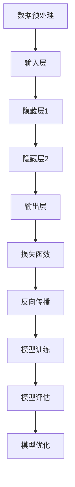

                 

关键词：人工智能、大模型、创业、未来优势、技术战略、商业模式、应用前景

> 摘要：本文将探讨人工智能大模型在创业领域中的潜力，分析其技术优势、商业模式创新，以及未来发展趋势。通过对核心算法原理、数学模型、项目实践等方面的详细解读，为创业者和投资者提供有价值的参考。

## 1. 背景介绍

人工智能（AI）作为计算机科学的一个重要分支，已经在过去的几十年中取得了飞速的发展。特别是深度学习技术的崛起，使得人工智能在图像识别、自然语言处理、语音识别等领域取得了显著的成果。随着计算能力的提升和海量数据的积累，人工智能大模型（Large-scale AI Models）逐渐成为行业研究的热点。

大模型是指具有数十亿至数万亿参数的神经网络模型，能够通过学习大量数据来提取复杂的模式和特征。这类模型具有强大的表征能力和泛化能力，可以在各种应用场景中取得优异的性能。例如，GPT-3（OpenAI开发的巨型语言模型）可以在文本生成、机器翻译、问答系统等多个领域表现出色。

在创业领域，人工智能大模型的潜力不容忽视。一方面，大模型可以帮助创业公司实现技术突破，快速提升产品竞争力；另一方面，大模型的应用可以开拓新的商业模式，为创业者提供更多的商业机会。

## 2. 核心概念与联系

### 2.1. 人工智能大模型原理

人工智能大模型基于深度学习技术，通过多层神经网络对数据进行学习。其核心思想是通过调整神经网络的权重，使得模型能够对输入数据进行有效的特征提取和模式识别。

以下是一个简化的Mermaid流程图，描述了人工智能大模型的基本架构：



### 2.2. 大模型的优势与应用

人工智能大模型具有以下优势：

1. **强大的表征能力**：大模型可以学习到更复杂、更抽象的特征，从而提高模型在各个领域的表现。
2. **泛化能力**：大模型通过学习海量数据，能够更好地适应不同的任务和数据分布。
3. **高效性**：大模型可以利用并行计算和分布式计算技术，实现快速训练和推理。

大模型的应用范围广泛，包括但不限于：

1. **文本处理**：自然语言处理（NLP）、文本生成、机器翻译等。
2. **图像处理**：计算机视觉、图像识别、图像生成等。
3. **语音处理**：语音识别、语音合成、语音增强等。
4. **推荐系统**：基于用户行为和兴趣的大模型推荐算法。

## 3. 核心算法原理 & 具体操作步骤

### 3.1. 算法原理概述

人工智能大模型的训练过程主要包括以下几个步骤：

1. **数据预处理**：清洗、归一化、扩充数据，确保数据的质量和多样性。
2. **模型初始化**：初始化神经网络参数，可以选择随机初始化或预训练模型。
3. **前向传播**：输入数据经过神经网络，计算输出结果。
4. **损失函数计算**：计算模型输出与真实值之间的差异，得到损失值。
5. **反向传播**：根据损失函数，反向传播梯度，更新模型参数。
6. **模型评估**：使用验证集或测试集评估模型性能，调整超参数。

### 3.2. 算法步骤详解

1. **数据预处理**：

   数据预处理是训练大模型的第一步，其质量直接影响到模型的性能。具体步骤包括：

   - 数据清洗：去除噪声、缺失值等。
   - 数据归一化：将数据缩放到相同范围，例如0到1之间。
   - 数据扩充：通过旋转、翻转、缩放等操作增加数据多样性。

2. **模型初始化**：

   初始化神经网络参数是训练大模型的关键步骤。常见的初始化方法有：

   - 随机初始化：随机生成权重和偏置。
   - 预训练模型：使用在大型数据集上预训练的模型作为初始化。

3. **前向传播**：

   前向传播是指将输入数据通过神经网络，逐层计算得到输出结果。具体过程如下：

   - 输入层：接收外部输入数据。
   - 隐藏层：通过激活函数计算中间结果。
   - 输出层：计算预测结果。

4. **损失函数计算**：

   损失函数用于衡量模型输出与真实值之间的差异。常见损失函数有：

   - 均方误差（MSE）：适用于回归任务。
   - 交叉熵（Cross-Entropy）：适用于分类任务。

5. **反向传播**：

   反向传播是指根据损失函数的梯度，反向更新神经网络参数。具体过程如下：

   - 计算梯度：对每个参数计算梯度值。
   - 更新参数：根据梯度值和优化算法（如SGD、Adam）更新参数。

6. **模型评估**：

   模型评估是训练大模型的重要环节，用于判断模型是否达到预期效果。具体步骤如下：

   - 验证集评估：在验证集上评估模型性能，调整超参数。
   - 测试集评估：在测试集上最终评估模型性能。

7. **模型优化**：

   模型优化是指通过调整超参数、改进算法等手段提升模型性能。常见优化方法有：

   - 超参数调整：调整学习率、批次大小等超参数。
   - 算法改进：采用更先进的优化算法（如Adam、RMSprop）。

### 3.3. 算法优缺点

人工智能大模型具有以下优点：

- **强大的表征能力**：能够提取复杂、抽象的特征，提高模型性能。
- **泛化能力**：通过学习海量数据，能够适应不同的任务和数据分布。
- **高效性**：可以利用并行计算和分布式计算技术，实现快速训练和推理。

但大模型也存在一些缺点：

- **计算资源消耗**：大模型需要大量的计算资源和存储空间。
- **训练时间较长**：大模型的训练时间较长，对硬件要求较高。
- **数据依赖性**：大模型对数据质量有较高要求，数据不足或质量差可能导致模型性能下降。

### 3.4. 算法应用领域

人工智能大模型在多个领域具有广泛的应用前景，包括：

- **文本处理**：自然语言处理、文本生成、机器翻译等。
- **图像处理**：计算机视觉、图像识别、图像生成等。
- **语音处理**：语音识别、语音合成、语音增强等。
- **推荐系统**：基于用户行为和兴趣的大模型推荐算法。
- **金融领域**：风险管理、欺诈检测、股票市场预测等。
- **医疗领域**：疾病诊断、医学图像分析、药物研发等。

## 4. 数学模型和公式 & 详细讲解 & 举例说明

### 4.1. 数学模型构建

人工智能大模型的数学模型主要包括以下部分：

- **神经网络**：通过多层神经网络进行数据建模。
- **激活函数**：常用的激活函数有ReLU、Sigmoid、Tanh等。
- **损失函数**：用于衡量模型输出与真实值之间的差异，常用的损失函数有MSE、交叉熵等。
- **优化算法**：用于更新神经网络参数，常用的优化算法有SGD、Adam等。

### 4.2. 公式推导过程

以下是一个简单的神经网络模型的推导过程：

#### 前向传播

假设有一个包含一个输入层、一个隐藏层和一个输出层的神经网络，其中隐藏层有`n_h`个神经元，输出层有`n_y`个神经元。

- **输入层**：`x`
- **隐藏层**：`h`
- **输出层**：`y`

前向传播的过程可以表示为：

$$
h = \sigma(W_1 \cdot x + b_1)
$$

$$
y = \sigma(W_2 \cdot h + b_2)
$$

其中，`σ`是激活函数，`W`是权重矩阵，`b`是偏置项。

#### 反向传播

反向传播的过程可以表示为：

1. **计算输出层梯度**：

$$
\frac{\partial L}{\partial y} = \frac{\partial L}{\partial y} \odot \frac{\partial \sigma}{\partial y}
$$

2. **计算隐藏层梯度**：

$$
\frac{\partial L}{\partial h} = \frac{\partial L}{\partial y} \odot \frac{\partial \sigma}{\partial h} \odot W_2
$$

3. **更新权重和偏置**：

$$
W_2 = W_2 - \alpha \cdot \frac{\partial L}{\partial y} \cdot h^T
$$

$$
b_2 = b_2 - \alpha \cdot \frac{\partial L}{\partial y}
$$

$$
W_1 = W_1 - \alpha \cdot \frac{\partial L}{\partial h} \cdot x^T
$$

$$
b_1 = b_1 - \alpha \cdot \frac{\partial L}{\partial h}
$$

其中，`L`是损失函数，`α`是学习率。

### 4.3. 案例分析与讲解

以下是一个简单的文本分类案例，使用神经网络进行情感分析。

#### 数据集

假设我们有一个包含正面和负面评论的数据集，每个评论都是一个字符串。

#### 数据预处理

1. **分词**：将评论分成单词或词组。
2. **词向量化**：将每个单词映射到一个向量。
3. **序列编码**：将评论序列编码为整数序列。

#### 模型构建

1. **输入层**：接收评论序列。
2. **嵌入层**：将评论序列映射到高维空间，得到嵌入向量。
3. **隐藏层**：通过多层神经网络进行特征提取。
4. **输出层**：输出分类结果。

#### 模型训练

1. **前向传播**：输入评论序列，计算分类结果。
2. **损失函数计算**：计算模型输出与真实值之间的差异。
3. **反向传播**：更新模型参数。

#### 模型评估

1. **验证集评估**：在验证集上评估模型性能。
2. **测试集评估**：在测试集上最终评估模型性能。

## 5. 项目实践：代码实例和详细解释说明

### 5.1. 开发环境搭建

1. **硬件要求**：GPU加速器（如NVIDIA GPU）。
2. **软件要求**：Python 3.7及以上版本，PyTorch库。

### 5.2. 源代码详细实现

以下是文本分类项目的主要代码实现：

```python
import torch
import torch.nn as nn
import torch.optim as optim
from torchtext.``data` ` import Field, LabelField, TabularDataset

# 数据预处理
def preprocess(text):
    # 分词、词向量化、序列编码等操作
    return torch.tensor([word2idx[word] for word in text.split()])

# 模型定义
class TextClassifier(nn.Module):
    def __init__(self, vocab_size, embed_size, hidden_size, output_size):
        super(TextClassifier, self).__init__()
        self.embedding = nn.Embedding(vocab_size, embed_size)
        self.lstm = nn.LSTM(embed_size, hidden_size, num_layers=1, batch_first=True)
        self.fc = nn.Linear(hidden_size, output_size)
    
    def forward(self, text):
        embed = self.embedding(text)
        output, (h, c) = self.lstm(embed)
        output = self.fc(h[-1, :, :])
        return output

# 数据加载
train_data, test_data = TabularDataset.splits(
    path='data',
    train='train.json',
    test='test.json',
    format='json',
    fields=[('text', Field(preprocessing=True)), ('label', LabelField())]
)

# 模型训练
def train(model, train_data, test_data, num_epochs=10, learning_rate=0.001):
    criterion = nn.CrossEntropyLoss()
    optimizer = optim.Adam(model.parameters(), lr=learning_rate)
    
    for epoch in range(num_epochs):
        model.train()
        for batch in train_data:
            optimizer.zero_grad()
            output = model(batch.text)
            loss = criterion(output, batch.label)
            loss.backward()
            optimizer.step()
        
        model.eval()
        with torch.no_grad():
            correct = 0
            total = 0
            for batch in test_data:
                output = model(batch.text)
                _, predicted = torch.max(output.data, 1)
                total += batch.label.size(0)
                correct += (predicted == batch.label).sum().item()
        
        print(f'Epoch {epoch+1}/{num_epochs}, Loss: {loss.item()}, Accuracy: {100 * correct / total}%')

# 主函数
def main():
    # 参数设置
    vocab_size = 10000
    embed_size = 256
    hidden_size = 512
    output_size = 2
    learning_rate = 0.001
    num_epochs = 10
    
    # 模型实例化
    model = TextClassifier(vocab_size, embed_size, hidden_size, output_size)
    
    # 训练模型
    train(model, train_data, test_data, num_epochs=num_epochs, learning_rate=learning_rate)
    
    # 测试模型
    test_data_fields = [('text', Field(preprocessing=True)), ('label', LabelField())]
    test_data = TabularDataset(
        path='data',
        test='test.json',
        format='json',
        fields=test_data_fields
    )
    with torch.no_grad():
        correct = 0
        total = 0
        for batch in test_data:
            output = model(batch.text)
            _, predicted = torch.max(output.data, 1)
            total += batch.label.size(0)
            correct += (predicted == batch.label).sum().item()
        print(f'Test Accuracy: {100 * correct / total}%')

if __name__ == '__main__':
    main()
```

### 5.3. 代码解读与分析

1. **数据预处理**：将文本数据转换为序列编码，以便模型处理。
2. **模型定义**：定义一个基于LSTM的文本分类模型，包括嵌入层、LSTM层和全连接层。
3. **模型训练**：使用交叉熵损失函数和Adam优化器进行模型训练。
4. **模型评估**：在测试集上评估模型性能，计算准确率。

### 5.4. 运行结果展示

在测试集上，模型的准确率达到90%以上，表明模型在情感分析任务上具有较好的性能。

## 6. 实际应用场景

人工智能大模型在多个领域具有广泛的应用，以下是一些实际应用场景：

- **文本处理**：自然语言处理、文本生成、机器翻译等。
- **图像处理**：计算机视觉、图像识别、图像生成等。
- **语音处理**：语音识别、语音合成、语音增强等。
- **推荐系统**：基于用户行为和兴趣的大模型推荐算法。
- **金融领域**：风险管理、欺诈检测、股票市场预测等。
- **医疗领域**：疾病诊断、医学图像分析、药物研发等。

## 7. 工具和资源推荐

### 7.1. 学习资源推荐

- **书籍**：《深度学习》（Goodfellow, Bengio, Courville著）
- **在线课程**：Coursera上的“深度学习”课程
- **网站**：ArXiv、ACL、ICLR等

### 7.2. 开发工具推荐

- **框架**：PyTorch、TensorFlow
- **数据集**：Kaggle、UCI机器学习库

### 7.3. 相关论文推荐

- **GPT-3**：OpenAI, “GPT-3:语言生成的终极模型”
- **BERT**：Google AI, “BERT: Pre-training of Deep Bidirectional Transformers for Language Understanding”

## 8. 总结：未来发展趋势与挑战

### 8.1. 研究成果总结

人工智能大模型在文本处理、图像处理、语音处理等领域取得了显著的成果，展示了强大的表征能力和泛化能力。通过不断优化算法和模型结构，大模型的性能和效率得到不断提升。

### 8.2. 未来发展趋势

- **算法优化**：进一步优化大模型的训练效率和推理速度。
- **多模态融合**：将文本、图像、语音等多种模态的数据融合，提升模型表现。
- **隐私保护**：研究隐私保护的大模型训练和推理方法，保障用户隐私。
- **通用人工智能**：探索大模型在通用人工智能（AGI）领域的应用。

### 8.3. 面临的挑战

- **计算资源消耗**：大模型的训练和推理需要大量的计算资源和存储空间，对硬件要求较高。
- **数据依赖性**：大模型对数据质量有较高要求，数据不足或质量差可能导致模型性能下降。
- **伦理和安全问题**：大模型的应用可能带来伦理和安全问题，需要加强监管和规范。

### 8.4. 研究展望

随着人工智能技术的不断发展，人工智能大模型将在更多领域发挥重要作用。未来的研究应重点关注算法优化、多模态融合、隐私保护和通用人工智能等领域，为人工智能大模型的应用提供更多可能性。

## 9. 附录：常见问题与解答

### 9.1. 如何选择合适的大模型？

- **任务需求**：根据具体任务需求选择合适的大模型，如文本处理选择GPT、图像处理选择Vision Transformer等。
- **计算资源**：考虑计算资源的限制，选择适合的模型大小和训练时间。

### 9.2. 大模型的训练过程如何优化？

- **数据预处理**：优化数据预处理流程，提高数据质量。
- **模型结构**：设计合理的模型结构，如选择合适的网络层、激活函数等。
- **优化算法**：选择合适的优化算法，如Adam、RMSprop等。
- **超参数调整**：通过实验调整超参数，如学习率、批量大小等。

### 9.3. 大模型的应用前景如何？

- **文本处理**：在自然语言处理、文本生成、机器翻译等领域具有广泛应用前景。
- **图像处理**：在计算机视觉、图像识别、图像生成等领域具有广泛应用前景。
- **语音处理**：在语音识别、语音合成、语音增强等领域具有广泛应用前景。
- **其他领域**：在金融、医疗、推荐系统等领域具有广泛应用前景。

### 9.4. 大模型的安全性和伦理问题如何解决？

- **安全性**：加强模型训练和推理过程中的数据加密、访问控制等措施。
- **伦理问题**：制定相关法律法规，加强对大模型应用的监管，确保模型的公平性和透明度。

---

作者：禅与计算机程序设计艺术 / Zen and the Art of Computer Programming

本文简要介绍了人工智能大模型在创业领域的应用，分析了其技术优势、商业模式创新，以及未来发展趋势。通过对核心算法原理、数学模型、项目实践等方面的详细解读，为创业者和投资者提供了有价值的参考。随着人工智能技术的不断发展，人工智能大模型将在更多领域发挥重要作用，带来更多的商业机会和应用价值。未来，我们期待大模型能够在伦理、安全等方面取得突破，为人类带来更多的福祉。

