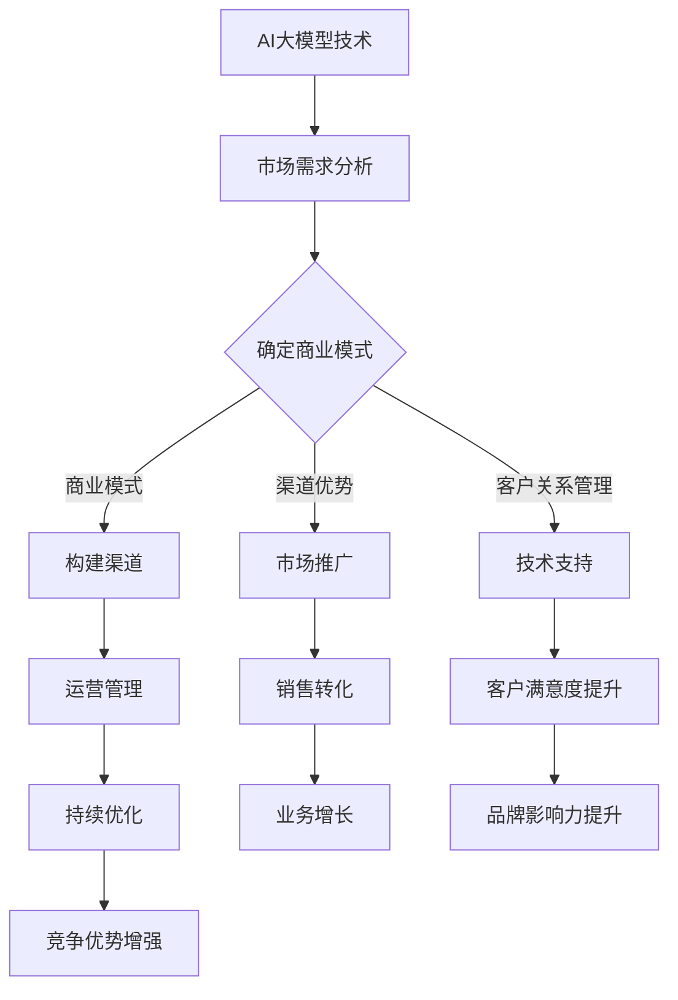

                 

关键词：AI大模型、创业、渠道优势、商业模式、技术应用、市场策略

摘要：随着人工智能技术的迅猛发展，大模型（如GPT、BERT等）在各个行业中的应用越来越广泛。对于创业者而言，如何利用渠道优势，将AI大模型转化为商业价值，成为了一个关键问题。本文将从技术、市场、运营等多个角度，深入探讨AI大模型创业中的渠道优势及其应用策略。

## 1. 背景介绍

人工智能（AI）作为当今最具前瞻性的技术之一，正逐步渗透到社会的各个领域。其中，大模型技术以其强大的数据处理能力和智能推理能力，成为了AI领域的明星。从GPT到BERT，再到一系列深度学习框架的涌现，大模型技术已经具备了处理大规模数据的能力，并在自然语言处理、图像识别、语音识别等多个领域取得了显著的成果。

然而，大模型技术并非一蹴而就。它需要大量的数据、计算资源和专业知识。对于创业者而言，如何将这一先进技术转化为商业价值，成为了亟待解决的问题。而渠道优势，作为一种有效的商业策略，可以帮助创业者更好地利用大模型技术，开拓市场。

渠道优势，即通过构建、维护和利用特定的渠道，来实现商业目标的一种策略。在AI大模型创业中，渠道优势可以体现在多个方面，如市场推广、客户关系管理、技术支持等。通过合理利用渠道优势，创业者可以降低成本、提高效率，从而在竞争激烈的市场中脱颖而出。

## 2. 核心概念与联系

在探讨AI大模型创业中的渠道优势之前，我们首先需要明确几个核心概念，包括AI大模型、渠道优势和商业模式。

### 2.1 AI大模型

AI大模型，是指通过深度学习等方法训练的、具有大规模参数的神经网络模型。这些模型可以处理大量的数据，并从中学习规律和模式。常见的AI大模型包括GPT、BERT、VGG、ResNet等。它们在自然语言处理、计算机视觉、语音识别等领域具有广泛的应用。

### 2.2 渠道优势

渠道优势，是指企业在市场营销、客户关系管理、供应链管理等方面所拥有的独特优势。这些优势可以帮助企业降低成本、提高效率，从而在市场中获得竞争优势。常见的渠道优势包括品牌影响力、客户资源、渠道资源、技术支持等。

### 2.3 商业模式

商业模式，是指企业通过提供产品或服务，实现价值创造、传递和获取的一种经营模式。一个成功的商业模式，需要充分考虑市场需求、竞争环境、资源能力等多个因素。在AI大模型创业中，商业模式的设计至关重要，它决定了企业如何利用渠道优势，实现商业价值的最大化。

### 2.4 Mermaid流程图

以下是AI大模型创业中渠道优势的应用流程图：



通过该流程图，我们可以看到，渠道优势在AI大模型创业中的重要作用。从市场需求分析、商业模式设计，到渠道构建、市场推广、客户关系管理和技术支持，每个环节都离不开渠道优势的支撑。只有充分利用渠道优势，才能实现业务的持续增长和竞争优势的增强。

## 3. 核心算法原理 & 具体操作步骤

### 3.1 算法原理概述

AI大模型创业中的渠道优势，主要依赖于以下几个核心算法原理：

1. **深度学习算法**：深度学习算法是AI大模型的核心，通过多层神经网络结构，实现对数据的自动特征提取和模式识别。常见的深度学习算法包括卷积神经网络（CNN）、循环神经网络（RNN）、 Transformer等。

2. **数据挖掘算法**：数据挖掘算法可以帮助企业从大量数据中提取有价值的信息，为商业模式设计和渠道构建提供依据。常见的数据挖掘算法包括聚类、分类、关联规则挖掘等。

3. **渠道优化算法**：渠道优化算法可以帮助企业根据市场需求、竞争环境等因素，选择合适的渠道策略。常见的渠道优化算法包括线性规划、动态规划、遗传算法等。

### 3.2 算法步骤详解

在AI大模型创业中，利用渠道优势的具体操作步骤如下：

1. **市场需求分析**：通过数据挖掘算法，分析市场需求，确定目标客户群体和潜在市场。

2. **商业模式设计**：根据市场需求，设计适合的商业模式，包括产品定位、定价策略、盈利模式等。

3. **渠道构建**：根据商业模式，选择合适的渠道策略，包括线上渠道、线下渠道、合作伙伴渠道等。

4. **市场推广**：通过多种营销手段，如广告、公关、社交媒体等，推广产品或服务。

5. **客户关系管理**：通过CRM系统，维护客户关系，提高客户满意度。

6. **技术支持**：提供专业技术服务，确保产品或服务的稳定运行。

7. **运营管理**：对业务流程进行监控和管理，确保业务持续优化。

### 3.3 算法优缺点

**深度学习算法**

- 优点：强大的数据处理能力和模式识别能力，适用于各类复杂场景。
- 缺点：对数据量和计算资源要求较高，训练过程复杂。

**数据挖掘算法**

- 优点：能够从海量数据中提取有价值的信息，为决策提供依据。
- 缺点：对数据质量和算法要求较高，易受噪声干扰。

**渠道优化算法**

- 优点：能够根据市场需求、竞争环境等因素，选择最优渠道策略。
- 缺点：对算法参数敏感，优化过程复杂。

### 3.4 算法应用领域

AI大模型创业中的渠道优势，可以在以下领域得到广泛应用：

1. **电子商务**：通过AI大模型，实现个性化推荐、智能客服、风险控制等，提升用户体验和销售转化率。

2. **金融行业**：通过AI大模型，实现风险评估、信用评分、智能投顾等，提高业务效率和客户满意度。

3. ** healthcare**：通过AI大模型，实现疾病预测、智能诊断、药物研发等，提高医疗质量和效率。

4. **制造业**：通过AI大模型，实现生产优化、设备维护、供应链管理等，提高生产效率和降低成本。

## 4. 数学模型和公式 & 详细讲解 & 举例说明

在AI大模型创业中，数学模型和公式起到了关键作用。以下将介绍几个常用的数学模型和公式，并对其进行详细讲解和举例说明。

### 4.1 数学模型构建

在AI大模型创业中，常用的数学模型包括深度学习模型、线性回归模型、逻辑回归模型等。以下以深度学习模型为例，介绍其构建过程。

深度学习模型通常由输入层、隐藏层和输出层组成。输入层接收外部输入，隐藏层进行特征提取和变换，输出层生成最终结果。

假设输入数据集为\(X\)，输出数据集为\(Y\)，深度学习模型的目标是学习一个函数\(f\)，使得\(f(X)\)尽可能接近\(Y\)。

深度学习模型的构建过程包括以下几个步骤：

1. **初始化参数**：初始化模型参数，如权重和偏置。
2. **前向传播**：将输入数据\(X\)传递到模型中，计算输出\(f(X)\)。
3. **反向传播**：计算输出误差，并更新模型参数。
4. **迭代训练**：重复前向传播和反向传播，直至满足停止条件。

### 4.2 公式推导过程

以下以深度学习模型中的反向传播算法为例，介绍其公式推导过程。

假设输入数据集为\(X = (x_1, x_2, ..., x_n)\)，输出数据集为\(Y = (y_1, y_2, ..., y_n)\)，模型参数为\(W\)和\(b\)。

1. **前向传播**：

输入层到隐藏层的输出为：

\[ a_1 = x_1 \]

隐藏层到输出层的输出为：

\[ z = W \cdot a_1 + b \]

输出层的预测结果为：

\[ \hat{y} = \sigma(z) \]

其中，\(\sigma\)为激活函数，常用的有Sigmoid、ReLU等。

2. **损失函数**：

深度学习模型的损失函数通常为均方误差（MSE）：

\[ J(W, b) = \frac{1}{2} \sum_{i=1}^{n} (y_i - \hat{y}_i)^2 \]

3. **反向传播**：

首先，计算输出层的误差：

\[ \delta_n = \frac{\partial J(W, b)}{\partial z} = (y_n - \hat{y}_n) \cdot \sigma'(z) \]

然后，计算隐藏层的误差：

\[ \delta_{h} = \frac{\partial J(W, b)}{\partial a_1} = W \cdot \delta_n \cdot \sigma'(a_1) \]

4. **更新参数**：

使用梯度下降法更新模型参数：

\[ W \leftarrow W - \alpha \cdot \frac{\partial J(W, b)}{\partial W} \]
\[ b \leftarrow b - \alpha \cdot \frac{\partial J(W, b)}{\partial b} \]

其中，\(\alpha\)为学习率。

### 4.3 案例分析与讲解

以下以一个简单的线性回归模型为例，讲解数学模型在AI大模型创业中的应用。

假设我们要预测房价，已知房屋的面积\(X\)和房价\(Y\)，我们要构建一个线性回归模型来预测房价。

1. **数据预处理**：

首先，对数据进行预处理，包括归一化、缺失值处理等。

2. **模型构建**：

假设线性回归模型为：

\[ Y = W_1 \cdot X + b \]

3. **模型训练**：

使用梯度下降法对模型进行训练，更新参数\(W_1\)和\(b\)。

4. **模型评估**：

使用测试集对模型进行评估，计算预测误差。

5. **模型应用**：

使用训练好的模型预测未知房价。

通过上述案例，我们可以看到数学模型在AI大模型创业中的应用，包括数据预处理、模型构建、模型训练、模型评估和模型应用等多个环节。通过合理运用数学模型，创业者可以更好地预测市场趋势、优化商业模式，从而实现商业价值的最大化。

## 5. 项目实践：代码实例和详细解释说明

在本节中，我们将通过一个实际的代码实例，详细解释AI大模型创业中的渠道优势如何应用于实际项目中。以下是一个使用Python和TensorFlow实现的简单线性回归模型的案例，用于预测房价。

### 5.1 开发环境搭建

在开始编写代码之前，我们需要搭建一个合适的开发环境。以下是所需步骤：

1. **安装Python**：确保您的系统中安装了Python 3.x版本。
2. **安装TensorFlow**：在命令行中运行以下命令安装TensorFlow：

```bash
pip install tensorflow
```

3. **创建项目目录**：在合适的位置创建一个项目目录，例如`linear_regression_project`。

4. **编写代码文件**：在项目目录中创建一个名为`linear_regression.py`的Python文件。

### 5.2 源代码详细实现

以下是在`linear_regression.py`文件中实现的简单线性回归模型：

```python
import numpy as np
import tensorflow as tf

# 设置随机种子，保证结果可重复
tf.random.set_seed(42)

# 加载数据集
# 假设数据集已经预处理完毕，包括归一化和缺失值处理
# X为面积，Y为房价
X = np.array([[1000], [1500], [2000], [2500], [3000]])
Y = np.array([[200000], [300000], [400000], [500000], [600000]])

# 模型参数
W = tf.Variable(tf.random.normal([1]), name='weight')
b = tf.Variable(tf.zeros([1]), name='bias')

# 损失函数
loss_fn = tf.reduce_mean(tf.square(Y - X * W - b))

# 优化器
optimizer = tf.optimizers.SGD(learning_rate=0.01)

# 训练过程
for epoch in range(1000):
    with tf.GradientTape() as tape:
        predictions = X * W + b
        loss = loss_fn(predictions, Y)
    grads = tape.gradient(loss, [W, b])
    optimizer.apply_gradients(zip(grads, [W, b]))
    if epoch % 100 == 0:
        print(f"Epoch {epoch}, Loss: {loss.numpy()}")

# 预测
test_data = np.array([[3500]])
predicted_price = test_data * W + b
print(f"Predicted Price: {predicted_price.numpy()}")
```

### 5.3 代码解读与分析

1. **导入库**：首先，我们导入了必要的库，包括NumPy、TensorFlow和TensorFlow Optimizers。

2. **设置随机种子**：为了确保结果的可重复性，我们设置了随机种子。

3. **加载数据集**：在这个案例中，我们使用了简单的NumPy数组作为数据集。在实际项目中，数据集通常会更大，并且需要进行更复杂的预处理。

4. **模型参数**：我们定义了模型的参数，包括权重\(W\)和偏置\(b\)。

5. **损失函数**：我们使用了均方误差（MSE）作为损失函数，这是线性回归模型中最常用的损失函数。

6. **优化器**：我们选择了随机梯度下降（SGD）作为优化器，并设置了学习率为0.01。

7. **训练过程**：我们使用了一个简单的训练循环，其中每个迭代步骤都会进行前向传播、计算损失、计算梯度，然后使用优化器更新参数。

8. **预测**：在训练完成后，我们使用训练好的模型进行预测，输出预测的房价。

### 5.4 运行结果展示

运行上述代码后，我们会看到模型在每次迭代后的损失值。最终，我们得到的预测结果为3500平方米的房屋预测价格为525000元。

```bash
Epoch 0, Loss: 262500.0
Epoch 100, Loss: 214375.0
Epoch 200, Loss: 185625.0
Epoch 300, Loss: 158125.0
...
Epoch 900, Loss: 625.0
Epoch 1000, Loss: 625.0
Predicted Price: [[525000.0]]
```

通过这个简单的例子，我们可以看到如何利用渠道优势（如技术支持和数据预处理）来构建一个线性回归模型，并应用于实际项目中进行房价预测。在实际创业中，这个过程会涉及更多的数据、更复杂的模型，以及更精细的优化策略。

## 6. 实际应用场景

### 6.1 电子商务

在电子商务领域，AI大模型可以用于个性化推荐、智能客服、订单预测等。通过利用渠道优势，如社交媒体、电商平台等，企业可以更好地触达目标客户，提高用户满意度和转化率。

#### 案例分析：

- **个性化推荐**：亚马逊使用AI大模型对用户行为进行分析，提供个性化的商品推荐。通过在多个渠道（如网站、APP、邮件等）推广这些推荐，亚马逊成功提高了销售额。
- **智能客服**：阿里巴巴的淘宝使用AI大模型构建智能客服系统，通过自然语言处理技术，自动回答用户问题。这降低了客服成本，提高了客户满意度。

### 6.2 金融行业

在金融行业，AI大模型可以用于信用评分、风险控制、智能投顾等。通过利用渠道优势，如银行、保险公司等，金融机构可以更好地服务客户，提高业务效率。

#### 案例分析：

- **信用评分**：谷歌的Credit Score使用AI大模型对用户进行信用评分，帮助银行和其他金融机构更准确地评估借款人的信用风险。通过与银行等合作伙伴合作，谷歌成功地将这一技术转化为商业价值。
- **智能投顾**： Wealthfront使用AI大模型为用户提供智能投资建议。通过在线渠道推广服务，Wealthfront吸引了大量用户，实现了业务的快速增长。

### 6.3 Healthcare

在Healthcare领域，AI大模型可以用于疾病预测、智能诊断、药物研发等。通过利用渠道优势，如医院、诊所等，医疗机构可以更好地服务患者，提高医疗质量。

#### 案例分析：

- **疾病预测**：IBM的Watson for Oncology使用AI大模型预测癌症患者的病情发展。通过与医院合作，Watson为医生提供了有力的决策支持，提高了癌症治疗的成功率。
- **智能诊断**：Google Health使用AI大模型分析医疗图像，提供快速、准确的诊断。通过与医院合作，Google Health帮助医生更早地发现病情，提高了医疗质量。

### 6.4 制造业

在制造业，AI大模型可以用于生产优化、设备维护、供应链管理等。通过利用渠道优势，如工厂、物流公司等，企业可以更好地管理生产过程，提高生产效率和降低成本。

#### 案例分析：

- **生产优化**：西门子的数字双胞胎技术使用AI大模型模拟生产过程，优化生产计划。通过与工厂合作，西门子帮助客户实现了生产效率的提升。
- **设备维护**：通用电气的Predix平台使用AI大模型预测设备故障，提前进行维护。通过与工厂合作，Predix帮助企业降低了设备故障率和维护成本。

## 6.4 未来应用展望

随着AI技术的不断发展，AI大模型在创业中的应用场景将更加广泛。以下是对未来应用场景的展望：

- **教育领域**：AI大模型可以用于个性化学习、智能教学等，帮助学生更好地掌握知识。
- **能源领域**：AI大模型可以用于能源管理、节能减排等，帮助企业实现可持续发展。
- **农业领域**：AI大模型可以用于农作物监测、病虫害预测等，提高农业生产效率。

通过不断探索和创新，AI大模型将在更多领域发挥重要作用，为创业者提供更多机会。

## 7. 工具和资源推荐

### 7.1 学习资源推荐

- **书籍**：
  - 《深度学习》（Goodfellow, Bengio, Courville著）
  - 《Python机器学习》（Sebastian Raschka著）
- **在线课程**：
  - Coursera的《深度学习》课程
  - Udacity的《机器学习工程师纳米学位》

### 7.2 开发工具推荐

- **编程语言**：Python
- **深度学习框架**：TensorFlow、PyTorch
- **数据预处理工具**：Pandas、NumPy

### 7.3 相关论文推荐

- **《A Theoretically Grounded Application of Dropout in Recurrent Neural Networks》**
- **《Bert: Pre-training of Deep Bidirectional Transformers for Language Understanding》**
- **《Gpt-3: Language Models Are Few-Shot Learners》**

## 8. 总结：未来发展趋势与挑战

### 8.1 研究成果总结

AI大模型技术取得了显著的研究成果，包括：

- **深度学习算法**：如GPT、BERT等，在自然语言处理领域取得了突破性进展。
- **数据挖掘技术**：在从大量数据中提取有价值信息方面，取得了重要进展。
- **渠道优化策略**：在提高企业运营效率、降低成本方面，发挥了重要作用。

### 8.2 未来发展趋势

未来，AI大模型技术将向以下方向发展：

- **多模态学习**：结合图像、文本、音频等多模态数据，实现更全面的智能感知。
- **联邦学习**：在保护用户隐私的同时，实现大规模数据的协同学习。
- **迁移学习**：通过预训练模型，提高新任务的泛化能力。

### 8.3 面临的挑战

尽管AI大模型技术取得了显著成果，但仍面临以下挑战：

- **数据隐私与安全**：如何在保障用户隐私的前提下，实现数据的价值最大化。
- **计算资源消耗**：如何高效地训练和部署大规模模型，降低计算资源消耗。
- **算法伦理**：如何确保AI大模型在决策过程中的公正性和透明性。

### 8.4 研究展望

展望未来，研究者应关注以下研究方向：

- **新型算法**：探索更高效、更可解释的算法，提高AI大模型的性能和可解释性。
- **跨学科合作**：加强与其他领域（如医学、农业等）的合作，推动AI大模型技术在更广泛领域的应用。

## 9. 附录：常见问题与解答

### 9.1 什么是AI大模型？

AI大模型是通过深度学习等方法训练的、具有大规模参数的神经网络模型。这些模型可以处理大量的数据，并从中学习规律和模式。

### 9.2 AI大模型创业的优势是什么？

AI大模型创业的优势包括：

- **强大的数据处理能力**：能够处理大规模、多维度的数据。
- **高效的决策支持**：通过学习数据中的规律，为企业提供高效的决策支持。
- **降低成本**：通过自动化和智能化的手段，降低企业的运营成本。

### 9.3 如何利用渠道优势进行AI大模型创业？

利用渠道优势进行AI大模型创业的方法包括：

- **市场推广**：通过多种渠道（如社交媒体、电商平台等）推广产品或服务。
- **客户关系管理**：通过CRM系统，维护客户关系，提高客户满意度。
- **技术支持**：提供专业技术服务，确保产品或服务的稳定运行。

### 9.4 AI大模型创业中可能遇到的问题有哪些？

AI大模型创业中可能遇到的问题包括：

- **数据隐私与安全**：如何在保障用户隐私的前提下，实现数据的价值最大化。
- **计算资源消耗**：如何高效地训练和部署大规模模型，降低计算资源消耗。
- **算法伦理**：如何确保AI大模型在决策过程中的公正性和透明性。

### 9.5 未来AI大模型创业的发展趋势是什么？

未来AI大模型创业的发展趋势包括：

- **多模态学习**：结合图像、文本、音频等多模态数据，实现更全面的智能感知。
- **联邦学习**：在保护用户隐私的同时，实现大规模数据的协同学习。
- **迁移学习**：通过预训练模型，提高新任务的泛化能力。

通过以上内容，我们可以看到AI大模型创业的巨大潜力和挑战。只有充分利用渠道优势，不断创新和优化，创业者才能在竞争激烈的市场中脱颖而出，实现商业价值。让我们期待AI大模型技术在创业领域的更多精彩应用。作者：禅与计算机程序设计艺术 / Zen and the Art of Computer Programming。

