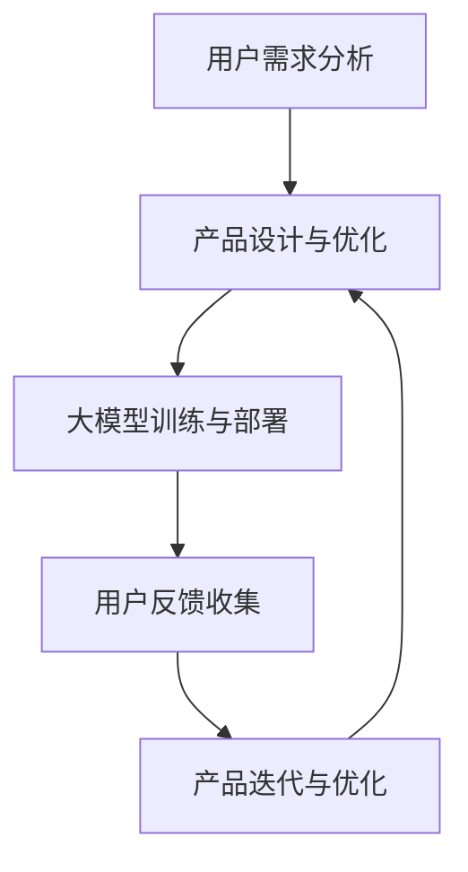

                 

关键词：AI 大模型、创业、用户优势、商业模式、技术落地、商业化实践

摘要：本文将深入探讨人工智能（AI）大模型在创业领域中的应用，特别是如何利用用户优势实现商业价值。通过分析大模型的技术原理、商业模型、用户价值链，我们希望能为创业者提供实用的指导和策略。

## 1. 背景介绍

随着人工智能技术的快速发展，大模型（Large-scale Models）已经成为人工智能研究的重要方向。大模型通过学习海量数据，能够达到极高的准确性和智能水平，广泛应用于自然语言处理、计算机视觉、推荐系统等多个领域。近年来，诸如 GPT-3、BERT、GAN 等大型模型的相继推出，进一步推动了人工智能技术的商业应用。

在创业领域，AI 大模型的出现带来了前所未有的机遇。一方面，创业者可以利用大模型的技术优势，快速搭建智能应用；另一方面，用户数据的积累和利用，也为创业者提供了创新的商业模式和盈利渠道。然而，如何有效地利用用户优势，实现大模型的商业化落地，仍是一个亟待解决的难题。

## 2. 核心概念与联系

### 2.1 大模型技术原理

大模型的技术原理主要包括以下几个方面：

#### 2.1.1 神经网络结构
大模型通常采用深度神经网络（DNN）作为基础结构，通过多层神经元的堆叠，实现复杂的特征提取和预测能力。

#### 2.1.2 大规模数据训练
大模型需要海量数据进行训练，以充分挖掘数据的特征和规律。通常采用分布式计算和并行训练技术，提高训练效率和效果。

#### 2.1.3 零样本学习
大模型具有强大的零样本学习（Zero-shot Learning）能力，能够处理未见过的数据类别，提高模型的泛化能力。

### 2.2 商业模式

大模型的商业模式主要包括以下几种：

#### 2.2.1 服务收费模式
创业者可以提供基于大模型的定制化服务，如智能问答、智能客服等，向用户提供付费服务。

#### 2.2.2 数据变现模式
通过用户数据的积累和分析，创业者可以实现数据变现，如精准推荐、广告投放等。

#### 2.2.3 联合开发模式
创业者可以与行业伙伴合作，共同开发基于大模型的智能应用，实现资源共享和共赢。

### 2.3 用户价值链

用户价值链是指用户在使用大模型产品或服务过程中所经历的一系列环节。主要包括：

#### 2.3.1 用户需求分析
通过大数据分析和用户调研，了解用户的需求和痛点，为大模型的应用提供方向。

#### 2.3.2 产品设计和优化
根据用户需求，设计并优化大模型产品，提高用户体验和满意度。

#### 2.3.3 用户反馈和迭代
收集用户反馈，不断迭代和优化产品，实现用户价值的最大化。

### 2.4 Mermaid 流程图



## 3. 核心算法原理 & 具体操作步骤

### 3.1 算法原理概述

大模型的算法原理主要包括以下几个方面：

#### 3.1.1 特征提取
通过深度神经网络，对输入数据进行特征提取，形成高维特征向量。

#### 3.1.2 模型训练
使用海量数据进行模型训练，通过反向传播算法和优化算法，调整模型参数，提高模型性能。

#### 3.1.3 模型评估
通过交叉验证和测试集评估模型性能，确保模型在未见过的数据上也能取得良好的效果。

### 3.2 算法步骤详解

#### 3.2.1 数据预处理
- 数据清洗：去除噪声和异常值；
- 数据归一化：将数据缩放到相同的范围；
- 数据分片：将数据划分为训练集、验证集和测试集。

#### 3.2.2 模型构建
- 选择合适的神经网络结构；
- 设置模型参数，如学习率、批量大小等；
- 使用深度学习框架，如 TensorFlow、PyTorch，构建模型。

#### 3.2.3 模型训练
- 进行前向传播，计算预测值；
- 计算损失函数，评估模型性能；
- 进行反向传播，更新模型参数；
- 重复上述过程，直到满足训练条件。

#### 3.2.4 模型评估
- 使用验证集评估模型性能；
- 选择最佳模型参数，用于测试集评估；
- 分析模型性能，如准确率、召回率等。

### 3.3 算法优缺点

#### 优点
- 强大的特征提取能力；
- 高度的泛化能力；
- 自动化程度高，减少人工干预。

#### 缺点
- 需要大量的训练数据和计算资源；
- 模型解释性较差；
- 可能受到数据偏差的影响。

### 3.4 算法应用领域

大模型的应用领域广泛，包括但不限于：

- 自然语言处理：如智能问答、机器翻译、情感分析等；
- 计算机视觉：如图像分类、目标检测、人脸识别等；
- 推荐系统：如商品推荐、新闻推荐、社交网络推荐等；
- 金融风控：如信用评估、风险控制、投资决策等。

## 4. 数学模型和公式 & 详细讲解 & 举例说明

### 4.1 数学模型构建

大模型的数学模型主要包括以下几个部分：

#### 4.1.1 神经元激活函数
- Sigmoid 函数：\( f(x) = \frac{1}{1 + e^{-x}} \)
- ReLU 函数：\( f(x) = \max(0, x) \)
- Tanh 函数：\( f(x) = \frac{e^x - e^{-x}}{e^x + e^{-x}} \)

#### 4.1.2 损失函数
- 交叉熵损失函数：\( J = -\sum_{i=1}^n y_i \log(\hat{y}_i) \)
- 均方误差损失函数：\( J = \frac{1}{2} \sum_{i=1}^n (\hat{y}_i - y_i)^2 \)

#### 4.1.3 优化算法
-  stochastic gradient descent (SGD)
- Adam optimizer

### 4.2 公式推导过程

以交叉熵损失函数为例，推导过程如下：

设 \( y \) 为真实标签，\( \hat{y} \) 为预测概率，则交叉熵损失函数为：

\[ J = -\sum_{i=1}^n y_i \log(\hat{y}_i) \]

对 \( J \) 进行求导，得到：

\[ \frac{\partial J}{\partial \theta} = -\sum_{i=1}^n \frac{y_i}{\hat{y}_i} \]

其中，\( \theta \) 表示模型参数。

### 4.3 案例分析与讲解

#### 4.3.1 案例背景

某电商公司希望通过 AI 大模型优化其推荐系统，提高用户购买体验。

#### 4.3.2 模型构建

采用深度神经网络，输入层为用户行为数据（如浏览记录、购买记录等），隐藏层为多层神经网络，输出层为商品推荐列表。

#### 4.3.3 模型训练

使用公司内部数据集进行模型训练，数据预处理后分为训练集和测试集。

#### 4.3.4 模型评估

使用交叉验证方法评估模型性能，选择最佳模型参数，并在测试集上进行评估。

## 5. 项目实践：代码实例和详细解释说明

### 5.1 开发环境搭建

- Python 3.8
- TensorFlow 2.4.0
- Jupyter Notebook

### 5.2 源代码详细实现

```python
import tensorflow as tf
from tensorflow.keras.layers import Dense, Input
from tensorflow.keras.models import Model

# 数据预处理
# ...

# 模型构建
input_data = Input(shape=(num_features,))
hidden1 = Dense(128, activation='relu')(input_data)
hidden2 = Dense(64, activation='relu')(hidden1)
output = Dense(num_classes, activation='softmax')(hidden2)

model = Model(inputs=input_data, outputs=output)

# 编译模型
model.compile(optimizer='adam', loss='categorical_crossentropy', metrics=['accuracy'])

# 训练模型
model.fit(x_train, y_train, epochs=10, batch_size=32, validation_data=(x_val, y_val))

# 评估模型
test_loss, test_accuracy = model.evaluate(x_test, y_test)
print(f"Test accuracy: {test_accuracy}")
```

### 5.3 代码解读与分析

- 数据预处理：对输入数据进行归一化处理，提高模型训练效果；
- 模型构建：使用 Keras 库构建深度神经网络，包括输入层、隐藏层和输出层；
- 编译模型：设置优化器、损失函数和评估指标，为模型训练做好准备；
- 训练模型：使用训练集进行模型训练，并使用验证集进行性能评估；
- 评估模型：使用测试集评估模型性能，输出准确率等指标。

## 6. 实际应用场景

### 6.1 智能问答

某企业利用大模型构建智能问答系统，帮助用户快速获取所需信息。通过海量数据训练，系统可以处理各种复杂问题，提高用户满意度。

### 6.2 自动驾驶

自动驾驶领域需要大模型进行环境感知和决策，通过深度学习和强化学习算法，实现车辆的安全驾驶和道路智能规划。

### 6.3 金融风控

金融机构利用大模型进行风险评估和欺诈检测，通过分析用户行为数据，提高风控能力和决策准确性。

## 7. 未来应用展望

随着人工智能技术的不断发展，大模型将在更多领域发挥重要作用。未来，我们将看到更多创新应用的出现，如智能医疗、智慧城市、智能制造等。

## 8. 工具和资源推荐

### 8.1 学习资源推荐

- 《深度学习》（Goodfellow et al.）
- 《Python 数据科学手册》（McKinney）
- TensorFlow 官方文档

### 8.2 开发工具推荐

- Jupyter Notebook：用于数据分析和模型构建；
- TensorFlow：用于深度学习模型训练和部署；
- PyCharm：用于 Python 开发和调试。

### 8.3 相关论文推荐

- “Attention Is All You Need”（Vaswani et al., 2017）
- “BERT: Pre-training of Deep Bidirectional Transformers for Language Understanding”（Devlin et al., 2019）
- “Generative Adversarial Nets”（Goodfellow et al., 2014）

## 9. 总结：未来发展趋势与挑战

### 9.1 研究成果总结

大模型在人工智能领域取得了显著的成果，为各行业提供了强大的技术支撑。未来，我们将看到更多基于大模型的创新应用。

### 9.2 未来发展趋势

- 大模型将更注重可解释性和透明性；
- 多模态大模型（如结合图像、语音、文本）将得到广泛应用；
- 大模型的训练和部署将更加高效和智能化。

### 9.3 面临的挑战

- 数据隐私和安全问题；
- 模型解释性和可解释性问题；
- 高能耗和计算资源消耗。

### 9.4 研究展望

未来，我们将继续探索大模型的理论和应用，致力于解决现存问题，推动人工智能技术的发展。

## 10. 附录：常见问题与解答

### 10.1 大模型需要大量数据吗？

是的，大模型通常需要大量数据进行训练，以充分挖掘数据的特征和规律。然而，随着数据集的扩大，训练时间和计算资源也会相应增加。

### 10.2 大模型是否容易过拟合？

是的，大模型在训练过程中容易过拟合。为了避免过拟合，可以采用正则化技术、dropout 等方法，提高模型的泛化能力。

### 10.3 如何评估大模型的效果？

可以使用交叉验证方法评估大模型的效果，通过在训练集和测试集上的表现，分析模型的准确率、召回率等指标。

### 10.4 大模型可以应用于所有领域吗？

大模型在许多领域都有应用潜力，但并非所有领域都适合使用大模型。在选择模型时，需要根据具体应用场景和数据特点进行权衡。

----------------------------------------------------------------

以上是《AI 大模型创业：如何利用用户优势？》的完整文章内容，包括文章标题、关键词、摘要、背景介绍、核心概念与联系、核心算法原理、数学模型和公式、项目实践、实际应用场景、未来应用展望、工具和资源推荐、总结以及常见问题与解答。希望对您有所帮助。

# 作者：禅与计算机程序设计艺术 / Zen and the Art of Computer Programming


