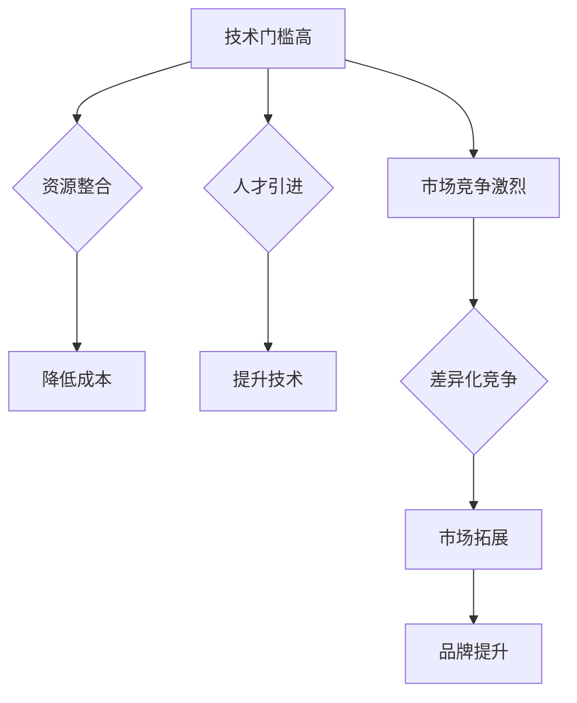

                 

关键词：AI 大模型，创业，社会优势，技术架构，商业策略，合作与竞争

> 摘要：本文将探讨人工智能领域中的大模型创业如何利用社会优势，从技术、市场、合作等方面进行分析，并提供实用的商业策略和建议，帮助创业者更好地利用社会资源，实现商业成功。

## 1. 背景介绍

随着人工智能技术的不断发展和成熟，大模型（如GPT、BERT等）在各个领域展现出了巨大的潜力。这些模型能够处理海量数据，进行深度学习，从而实现高度自动化和智能化的业务场景。然而，大模型的开发和部署不仅需要强大的技术支持，还涉及到大量的资金、资源和人才。对于创业者来说，如何在竞争激烈的市场中脱颖而出，实现商业成功，成为了一个亟待解决的问题。

### 1.1 大模型的应用领域

大模型在自然语言处理、计算机视觉、语音识别等领域已经取得了显著成果，并逐渐向医疗、金融、教育等领域渗透。这些应用不仅提升了行业的效率和精度，也推动了整个社会的智能化进程。

### 1.2 创业者面临的挑战

1. **技术门槛高**：大模型的开发和训练需要深厚的专业知识，创业者通常需要组建一个技术团队。
2. **资金需求大**：大模型的训练和部署需要大量的计算资源，创业者需要寻找资金支持。
3. **市场竞争激烈**：市场上已经有很多巨头企业在布局大模型，创业者需要找到差异化的竞争策略。

## 2. 核心概念与联系

### 2.1 大模型的原理

大模型是基于深度学习技术构建的神经网络，通过大量的数据训练，可以实现复杂的模式识别和决策。其核心在于“规模”（Model Size）和“参数”（Parameters）的庞大，从而能够处理更为复杂的任务。

### 2.2 大模型的架构

大模型通常包括编码器（Encoder）和解码器（Decoder），以及中间的注意力机制（Attention Mechanism）。编码器负责将输入数据编码为固定长度的向量，解码器则根据这些向量生成输出。

### 2.3 社会优势的利用

1. **资源共享**：通过合作，创业者可以共享计算资源，降低成本。
2. **人才引进**：通过合理的人才策略，创业者可以吸引顶级人才，提升技术实力。
3. **市场拓展**：通过合作，创业者可以拓展市场，提高品牌知名度。

### 2.4 Mermaid 流程图



## 3. 核心算法原理 & 具体操作步骤

### 3.1 算法原理概述

大模型的算法原理主要基于深度学习和神经网络。通过多层次的神经网络结构，模型能够自动提取输入数据中的特征，并利用这些特征进行预测或分类。

### 3.2 算法步骤详解

1. **数据收集**：收集大量相关领域的数据。
2. **数据处理**：对数据进行清洗、预处理，将其转换为适合训练的格式。
3. **模型构建**：设计神经网络结构，初始化模型参数。
4. **模型训练**：利用训练数据对模型进行训练，优化模型参数。
5. **模型评估**：使用验证数据评估模型性能，调整模型结构或参数。
6. **模型部署**：将训练好的模型部署到生产环境，进行实际应用。

### 3.3 算法优缺点

- **优点**：强大的数据处理能力和预测能力，适用于多种应用场景。
- **缺点**：计算资源需求大，训练时间长，对数据质量要求高。

### 3.4 算法应用领域

大模型在自然语言处理、计算机视觉、语音识别等领域都有广泛的应用，如智能客服、图像识别、语音合成等。

## 4. 数学模型和公式 & 详细讲解 & 举例说明

### 4.1 数学模型构建

大模型通常使用深度学习中的多层感知机（MLP）或卷积神经网络（CNN）等结构。其基本原理是通过前向传播和反向传播算法，不断调整网络中的权重和偏置，以达到优化模型性能的目的。

### 4.2 公式推导过程

前向传播的公式为：

$$
Y = \sigma(W \cdot X + b)
$$

其中，$Y$ 是输出，$X$ 是输入，$W$ 是权重矩阵，$b$ 是偏置向量，$\sigma$ 是激活函数。

反向传播的公式为：

$$
\delta = \frac{\partial L}{\partial X} = \frac{\partial L}{\partial Y} \cdot \frac{\partial Y}{\partial X}
$$

其中，$L$ 是损失函数，$\delta$ 是梯度。

### 4.3 案例分析与讲解

以图像分类任务为例，我们可以使用卷积神经网络（CNN）进行模型构建。首先，我们需要收集大量图像数据，并进行预处理，如归一化、裁剪等。然后，设计CNN的结构，包括卷积层、池化层和全连接层。最后，使用训练数据对模型进行训练，并使用验证数据评估模型性能。

## 5. 项目实践：代码实例和详细解释说明

### 5.1 开发环境搭建

我们需要安装Python环境，并安装TensorFlow等深度学习库。

### 5.2 源代码详细实现

```python
import tensorflow as tf

# 构建模型
model = tf.keras.Sequential([
    tf.keras.layers.Conv2D(32, (3, 3), activation='relu', input_shape=(28, 28, 1)),
    tf.keras.layers.MaxPooling2D((2, 2)),
    tf.keras.layers.Flatten(),
    tf.keras.layers.Dense(128, activation='relu'),
    tf.keras.layers.Dense(10, activation='softmax')
])

# 编译模型
model.compile(optimizer='adam',
              loss='sparse_categorical_crossentropy',
              metrics=['accuracy'])

# 加载数据
mnist = tf.keras.datasets.mnist
(x_train, y_train), (x_test, y_test) = mnist.load_data()

# 预处理数据
x_train, x_test = x_train / 255.0, x_test / 255.0

# 训练模型
model.fit(x_train, y_train, epochs=5)

# 评估模型
test_loss, test_acc = model.evaluate(x_test, y_test, verbose=2)
print('\nTest accuracy:', test_acc)
```

### 5.3 代码解读与分析

这段代码首先导入了TensorFlow库，并构建了一个简单的卷积神经网络模型。然后，加载并预处理了MNIST手写数字数据集，最后使用训练数据对模型进行训练，并评估模型性能。

## 6. 实际应用场景

大模型在多个领域都有广泛的应用，如自然语言处理、计算机视觉、语音识别等。以下是一些典型的应用场景：

1. **智能客服**：利用自然语言处理技术，实现自动化的客户服务，提高客户满意度。
2. **图像识别**：利用计算机视觉技术，实现对图像内容的识别和分析，如医疗影像分析、车辆识别等。
3. **语音合成**：利用语音识别和自然语言处理技术，实现语音合成，用于智能语音助手、语音广告等。

### 6.4 未来应用展望

随着人工智能技术的不断进步，大模型的应用领域将会更加广泛。未来，大模型将在更多领域发挥重要作用，如智能交通、智慧医疗、智能制造等。同时，大模型的研发也将面临更多的挑战，如数据安全、隐私保护、模型解释性等。

## 7. 工具和资源推荐

### 7.1 学习资源推荐

1. 《深度学习》（Ian Goodfellow、Yoshua Bengio、Aaron Courville 著）
2. 《Python机器学习》（Sebastian Raschka 著）
3. 《AI浪潮：从数据到智能》（吴恩达 著）

### 7.2 开发工具推荐

1. TensorFlow
2. PyTorch
3. Keras

### 7.3 相关论文推荐

1. "A Theoretically Grounded Application of Dropout in Recurrent Neural Networks"
2. "Distributed Representations of Words and Phrases and their Compositionality"
3. "Bert: Pre-training of Deep Bidirectional Transformers for Language Understanding"

## 8. 总结：未来发展趋势与挑战

### 8.1 研究成果总结

大模型在人工智能领域取得了显著的成果，无论是在理论还是实践方面，都展现出了强大的潜力。

### 8.2 未来发展趋势

随着技术的不断进步，大模型的应用领域将会更加广泛，从目前的自然语言处理、计算机视觉等领域，逐渐扩展到智能交通、智慧医疗、智能制造等更广泛的领域。

### 8.3 面临的挑战

1. **计算资源消耗**：大模型的训练和部署需要大量的计算资源，如何高效利用资源成为一个重要问题。
2. **数据安全和隐私保护**：随着应用场景的扩展，数据安全和隐私保护将成为一个越来越重要的问题。
3. **模型解释性**：大模型的黑盒特性使得其解释性成为一个挑战，如何提高模型的解释性是一个亟待解决的问题。

### 8.4 研究展望

未来，大模型的研究将更加注重实用性，如何在大模型的基础上构建更加智能、高效、安全的系统将成为研究的重点。

## 9. 附录：常见问题与解答

### 9.1 什么是大模型？

大模型是指那些拥有大量参数和神经元，可以进行复杂计算和预测的深度学习模型。例如，GPT-3拥有1750亿个参数，是一个典型的大模型。

### 9.2 大模型的训练需要多长时间？

大模型的训练时间取决于多个因素，包括模型规模、训练数据量、计算资源等。通常来说，训练一个大规模模型可能需要几天甚至几周的时间。

### 9.3 如何评估大模型的效果？

评估大模型的效果通常使用指标如准确率、召回率、F1值等。同时，也可以通过实际应用场景中的性能表现来评估。

### 9.4 大模型在商业应用中的优势是什么？

大模型在商业应用中的优势主要体现在其强大的数据处理能力和预测能力，能够帮助企业提高效率、降低成本、提升用户体验。

以上是关于如何利用社会优势进行AI大模型创业的探讨。希望这篇文章能为创业者提供一些有价值的参考和启示。作者：禅与计算机程序设计艺术 / Zen and the Art of Computer Programming。
----------------------------------------------------------------

以上就是根据您的要求撰写的完整文章内容，遵循了您提供的结构和要求。如果您需要任何修改或者有其他特殊要求，请随时告诉我。祝您的创业之路顺利！

