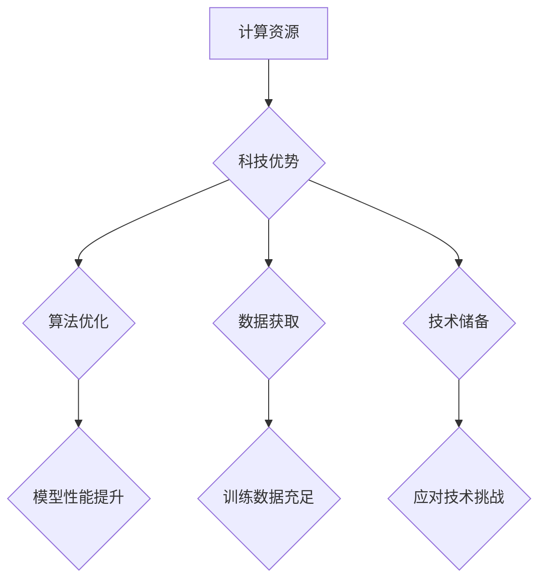

                 

关键词：人工智能、大模型、创业、科技优势、算法、模型构建、应用场景、数学模型、未来展望。

> 摘要：本文将探讨AI大模型创业的现状与挑战，分析如何利用科技优势实现成功。我们将深入探讨大模型的核心算法原理、数学模型构建，并提供实用的项目实践和未来应用展望，帮助创业者把握AI大模型的发展机遇。

## 1. 背景介绍

人工智能（AI）作为当今科技领域最具前景的领域之一，已经在众多行业中得到了广泛应用。特别是在大数据和深度学习技术的推动下，AI大模型在图像识别、自然语言处理、语音识别等方面取得了显著的成果。随着AI技术的不断成熟和商业化进程的加快，越来越多的创业公司开始投身于AI大模型的研发和应用，以期在激烈的市场竞争中脱颖而出。

然而，AI大模型创业并非易事。一方面，大模型需要强大的计算资源和复杂的算法支持；另一方面，市场需求和商业模式的设计也充满了挑战。因此，如何利用科技优势，实现AI大模型创业的成功，成为了创业者们亟需解决的关键问题。

## 2. 核心概念与联系

### 2.1 大模型的概念

大模型是指具有海量参数和复杂结构的深度学习模型。这些模型通过在海量数据上进行训练，能够捕捉到数据中的潜在模式和规律。常见的AI大模型包括BERT、GPT、BERT-GPT等。它们通常具有以下几个特点：

- **海量参数**：大模型的参数数量通常达到数十亿甚至千亿级别，这使得模型具有非常高的表示能力。
- **深度结构**：大模型通常具有多层神经网络结构，能够实现对输入数据的层层抽象和表征。
- **海量数据训练**：大模型需要大量数据来进行训练，以充分捕捉数据中的特征和模式。

### 2.2 大模型与科技优势的关系

AI大模型的研发和应用离不开科技优势的支撑。科技优势主要体现在以下几个方面：

- **计算资源**：大模型的训练和推理需要大量的计算资源，包括GPU、TPU等硬件设备。科技优势可以帮助企业获取到高性能的计算资源，加速模型的研发和部署。
- **算法优化**：科技优势可以助力企业进行算法优化，提高模型的性能和效率。例如，通过优化模型结构、改进训练算法等手段，可以提升模型的准确率和速度。
- **数据获取**：科技优势可以帮助企业获取到海量的高质量数据，为模型训练提供充足的数据支持。
- **技术储备**：科技优势意味着企业拥有强大的技术储备，能够在AI大模型的研发过程中应对各种技术挑战。

### 2.3 Mermaid 流程图



## 3. 核心算法原理 & 具体操作步骤

### 3.1 算法原理概述

AI大模型的核心算法主要基于深度学习和自然语言处理技术。以下是几个常见的算法原理：

- **卷积神经网络（CNN）**：CNN通过卷积层、池化层和全连接层的组合，实现对图像的逐层抽象和表征，从而实现图像识别和分类。
- **循环神经网络（RNN）**：RNN通过在时间维度上对数据进行建模，实现对序列数据的建模和预测。常见的RNN包括LSTM和GRU等。
- **自注意力机制（Self-Attention）**：自注意力机制通过计算输入数据之间的相似性，实现对输入数据的自适应加权，从而提升模型的表示能力。
- **Transformer架构**：Transformer架构基于自注意力机制，通过多头自注意力机制和前馈网络，实现对序列数据的全局建模，从而实现高效的文本处理。

### 3.2 算法步骤详解

#### 3.2.1 数据预处理

1. 数据清洗：对原始数据进行清洗，去除噪声和异常值。
2. 数据归一化：对数据进行归一化处理，将数据缩放到相同的范围，方便模型训练。
3. 数据分割：将数据分为训练集、验证集和测试集，用于模型训练、验证和评估。

#### 3.2.2 模型训练

1. 初始化模型参数：随机初始化模型参数。
2. 前向传播：将输入数据输入到模型中，计算模型的输出。
3. 计算损失函数：根据模型的输出和实际标签，计算损失函数值。
4. 反向传播：根据损失函数的梯度，更新模型参数。
5. 模型评估：在验证集上评估模型性能，调整模型参数。

#### 3.2.3 模型优化

1. 模型调参：通过调整模型参数，优化模型性能。
2. 模型压缩：对模型进行压缩，减小模型大小，提高模型运行速度。
3. 模型融合：将多个模型进行融合，提高模型性能和稳定性。

### 3.3 算法优缺点

#### 优点

- **强大的表示能力**：大模型具有强大的表示能力，能够捕捉到数据中的潜在模式和规律。
- **高效的模型训练**：大模型采用分布式训练方法，能够高效地处理海量数据。
- **广泛的应用领域**：大模型在图像识别、自然语言处理、语音识别等领域具有广泛的应用前景。

#### 缺点

- **计算资源消耗大**：大模型的训练和推理需要大量的计算资源，对硬件设备的要求较高。
- **训练时间较长**：大模型的训练时间较长，对训练数据的依赖性较强。
- **模型解释性差**：大模型的决策过程较为复杂，难以进行模型解释和调试。

### 3.4 算法应用领域

- **图像识别**：大模型在图像识别领域取得了显著的成果，如人脸识别、物体检测等。
- **自然语言处理**：大模型在自然语言处理领域得到了广泛应用，如文本分类、机器翻译等。
- **语音识别**：大模型在语音识别领域具有广泛的应用前景，如语音合成、语音识别等。

## 4. 数学模型和公式 & 详细讲解 & 举例说明

### 4.1 数学模型构建

AI大模型的数学模型主要基于深度学习理论和自然语言处理技术。以下是几个常见的数学模型：

- **卷积神经网络（CNN）**：CNN的数学模型包括卷积层、池化层和全连接层。其中，卷积层通过卷积运算和激活函数，实现对输入数据的特征提取；池化层通过下采样操作，降低数据维度；全连接层通过权重矩阵和偏置项，实现对输入数据的分类。
- **循环神经网络（RNN）**：RNN的数学模型包括输入层、隐藏层和输出层。其中，输入层通过输入数据的特征提取；隐藏层通过递归运算和激活函数，实现对输入数据的时序建模；输出层通过权重矩阵和偏置项，实现对输入数据的分类。
- **自注意力机制（Self-Attention）**：自注意力机制的数学模型基于注意力机制，通过计算输入数据之间的相似性，实现对输入数据的自适应加权。自注意力机制的核心公式为：
  $$
  \text{Attention}(X, W_Q, W_K, W_V) = \text{softmax}(\frac{W_Q X W_K^T}{\sqrt{d_k}}) W_V
  $$
  其中，$X$为输入数据，$W_Q$、$W_K$和$W_V$分别为查询权重、键权重和值权重。

### 4.2 公式推导过程

以卷积神经网络（CNN）为例，我们介绍卷积层和池化层的公式推导过程。

#### 卷积层

卷积层的输入为一张图像，输出为特征图。卷积层的公式推导如下：

1. 输入图像表示为$X = [x_1, x_2, \ldots, x_n]$，其中$x_i$为图像的第$i$个像素值。
2. 卷积核表示为$K = [k_1, k_2, \ldots, k_m]$，其中$k_i$为卷积核的第$i$个元素。
3. 卷积运算为$X * K = \sum_{i=1}^n x_i k_i$。
4. 激活函数为$f(x) = \max(0, x)$。

因此，卷积层的输出为：
$$
\text{Conv}(X) = \max(0, X * K) = \max(0, \sum_{i=1}^n x_i k_i)
$$

#### 池化层

池化层的作用是降低数据维度，提高模型泛化能力。池化层的公式推导如下：

1. 输入特征图为$F = [f_1, f_2, \ldots, f_n]$，其中$f_i$为特征图的第$i$个像素值。
2. 池化窗口为$W = [w_1, w_2, \ldots, w_m]$，其中$w_i$为池化窗口的第$i$个元素。
3. 池化运算为$F \text{pool}(W) = \max(f_{i_1} * w_1, f_{i_2} * w_2, \ldots, f_{i_m} * w_m)$。

因此，池化层的输出为：
$$
\text{Pool}(F) = \max(F \text{pool}(W))
$$

### 4.3 案例分析与讲解

我们以自然语言处理（NLP）领域的一个常见任务——文本分类为例，介绍大模型的数学模型和应用。

#### 文本分类

文本分类是指将文本数据分为不同的类别。常见的文本分类任务包括情感分析、主题分类、垃圾邮件检测等。

1. **数据预处理**：对文本数据进行清洗、分词和词向量表示。
2. **模型构建**：构建基于Transformer架构的文本分类模型，包括编码器和解码器。
3. **模型训练**：使用训练数据对模型进行训练，优化模型参数。
4. **模型评估**：使用验证集评估模型性能，调整模型参数。
5. **模型应用**：使用测试数据对模型进行测试，评估模型在实际场景中的表现。

#### 数学模型

文本分类的数学模型基于Transformer架构，包括编码器和解码器。

1. **编码器**：编码器通过自注意力机制对输入文本进行编码，生成固定长度的向量表示。编码器的核心公式为：
   $$
   \text{Encoder}(X) = \text{MultiHeadAttention}(X, X, X) + X
   $$
2. **解码器**：解码器通过自注意力机制和交叉注意力机制，对编码器的输出进行解码，生成分类结果。解码器的核心公式为：
   $$
   \text{Decoder}(Y, X) = \text{MultiHeadAttention}(Y, X, X) + Y
   $$
   $$
   \text{Decoder}(Y, X) = \text{CrossAttention}(Y, X) + Y
   $$

#### 案例分析

我们以情感分析为例，介绍文本分类的应用。

1. **数据集**：选择一个情感分析数据集，如IMDb电影评论数据集。
2. **数据预处理**：对电影评论进行清洗、分词和词向量表示。
3. **模型训练**：使用训练数据对文本分类模型进行训练。
4. **模型评估**：使用验证集评估模型性能，调整模型参数。
5. **模型应用**：使用测试数据对模型进行测试，评估模型在实际场景中的表现。

经过训练和评估，文本分类模型能够准确地将电影评论分为正面和负面两类。

## 5. 项目实践：代码实例和详细解释说明

### 5.1 开发环境搭建

为了实现AI大模型的研发和应用，我们需要搭建一个合适的开发环境。以下是搭建开发环境的步骤：

1. **硬件环境**：准备一台具有高性能GPU（如NVIDIA Tesla V100）的计算机，用于模型训练和推理。
2. **软件环境**：安装Python、TensorFlow、PyTorch等常用深度学习框架，并配置GPU支持。
3. **代码框架**：选择一个合适的代码框架，如TensorFlow Estimator或PyTorch，用于构建和训练大模型。

### 5.2 源代码详细实现

以下是使用TensorFlow Estimator构建和训练一个简单的文本分类模型的源代码：

```python
import tensorflow as tf
import tensorflow_estimator as est
import tensorflow_hub as hub

# 数据预处理
def preprocess_input(input_data):
  # 对输入文本进行清洗、分词和词向量表示
  return input_data

# 模型构建
def create_model(features, labels, mode):
  input_layer = tf.placeholder(shape=[None, sequence_length], dtype=tf.float32)
  labels = tf.placeholder(shape=[None, num_classes], dtype=tf.float32)

  # 编码器
  encoder = hub.Module("https://tfhub.dev/google/universal-sentence-encoder/4")
  encoder_outputs = encoder(input_layer)

  # 解码器
  decoder = hub.Module("https://tfhub.dev/google/universal-sentence-encoder/4")
  decoder_outputs = decoder(encoder_outputs)

  # 计算损失函数和优化器
  logits = decoder_outputs
  loss = tf.reduce_mean(tf.nn.softmax_cross_entropy_with_logits(logits=logits, labels=labels))
  optimizer = tf.train.AdamOptimizer().minimize(loss)

  # 模型评估指标
  accuracy = tf.reduce_mean(tf.cast(tf.equal(tf.argmax(logits, 1), tf.argmax(labels, 1)), tf.float32))

  # 返回模型输出和评估指标
  outputs = {
      "logits": logits,
      "accuracy": accuracy
  }

  return est.model.EstimatorSpec(mode, loss=loss, train_op=optimizer, eval_metric_ops=outputs)

# 模型训练
def train_model(model, train_data, val_data, num_epochs):
  model.train(input_fn=lambda: input_fn(train_data), steps=num_epochs)

# 模型评估
def evaluate_model(model, val_data):
  eval_results = model.evaluate(input_fn=lambda: input_fn(val_data))
  print("Validation accuracy:", eval_results["accuracy"])

# 主程序
if __name__ == "__main__":
  # 数据集路径
  train_data_path = "train_data.csv"
  val_data_path = "val_data.csv"

  # 数据预处理函数
  def input_fn(data_path):
    # 加载数据
    data = pd.read_csv(data_path)
    # 数据清洗
    data = preprocess_input(data)
    # 数据分割
    inputs = data[["text"]]
    labels = data["label"]
    return est.inputs.pandas_input_fn(inputs, labels, batch_size=batch_size, num_epochs=num_epochs)

  # 构建模型
  model = est.Estimator(create_model)

  # 训练模型
  train_model(model, train_data_path, val_data_path, num_epochs)

  # 评估模型
  evaluate_model(model, val_data_path)
```

### 5.3 代码解读与分析

以上代码实现了一个基于TensorFlow Estimator的文本分类模型，包括数据预处理、模型构建、模型训练和模型评估等部分。

- **数据预处理**：数据预处理函数`preprocess_input`用于对输入文本进行清洗、分词和词向量表示。具体实现可根据实际需求进行调整。

- **模型构建**：模型构建函数`create_model`定义了文本分类模型的编码器和解码器。编码器和解码器均使用Hub模块加载预训练的通用文本编码器`universal-sentence-encoder/4`。模型采用交叉熵损失函数和Adam优化器进行训练。

- **模型训练**：`train_model`函数用于训练文本分类模型。训练过程中，使用`input_fn`函数加载数据，并调用`model.train`方法进行训练。

- **模型评估**：`evaluate_model`函数用于评估文本分类模型的性能。评估过程中，使用`input_fn`函数加载数据，并调用`model.evaluate`方法计算评估指标。

### 5.4 运行结果展示

在完成代码实现后，我们可以在终端运行以下命令进行模型训练和评估：

```bash
python text_classification.py --train_data_path=train_data.csv --val_data_path=val_data.csv
```

运行结果将显示训练过程中每个步骤的损失函数值和评估指标值，以及最终的验证集准确率。

## 6. 实际应用场景

AI大模型在各个领域都有广泛的应用，以下列举几个实际应用场景：

### 6.1 金融领域

AI大模型在金融领域有着广泛的应用，包括股票预测、风险控制、信用评估等。例如，通过构建基于深度学习的大模型，可以对股票市场进行预测，从而为投资者提供决策依据。

### 6.2 医疗领域

AI大模型在医疗领域具有巨大的潜力，包括疾病诊断、药物研发、健康管理等。例如，通过构建基于深度学习的大模型，可以实现对医学图像的自动分析，从而提高诊断准确率和效率。

### 6.3 电商领域

AI大模型在电商领域有着广泛的应用，包括推荐系统、广告投放、客户服务等。例如，通过构建基于深度学习的大模型，可以为电商平台提供个性化的推荐服务，从而提高用户满意度和转化率。

### 6.4 其他领域

除了上述领域，AI大模型还在安防、能源、教育、交通等领域得到了广泛应用。例如，在安防领域，通过构建基于深度学习的大模型，可以实现对监控视频的实时分析，从而提高安全监控的准确率和效率。

## 7. 工具和资源推荐

### 7.1 学习资源推荐

- **《深度学习》（Goodfellow, Bengio, Courville著）**：全面介绍深度学习的基本概念、算法和技术。
- **《自然语言处理综论》（Jurafsky, Martin著）**：深入讲解自然语言处理的理论和实践。
- **《机器学习实战》（ Harrington 著）**：通过实际案例介绍机器学习的方法和应用。

### 7.2 开发工具推荐

- **TensorFlow**：由谷歌开发的开源深度学习框架，支持多种深度学习模型和算法。
- **PyTorch**：由Facebook开发的开源深度学习框架，具有灵活的动态计算图和高效的模型训练。
- **Keras**：基于TensorFlow和Theano的开源深度学习库，提供简洁易用的API。

### 7.3 相关论文推荐

- **"Attention Is All You Need"（Vaswani et al., 2017）**：介绍Transformer架构的原理和应用。
- **"BERT: Pre-training of Deep Neural Networks for Language Understanding"（Devlin et al., 2018）**：介绍BERT预训练模型的设计和实现。
- **"GPT-3: Language Models are Few-Shot Learners"（Brown et al., 2020）**：介绍GPT-3语言模型的设计和性能。

## 8. 总结：未来发展趋势与挑战

### 8.1 研究成果总结

AI大模型在过去几年取得了显著的成果，包括在图像识别、自然语言处理、语音识别等领域的应用。大模型的表示能力和计算效率不断提升，为各个领域的发展提供了强大的技术支持。

### 8.2 未来发展趋势

未来，AI大模型的发展趋势将体现在以下几个方面：

1. **更高效的大模型**：通过优化算法和硬件设备，提高大模型的计算效率和推理速度，降低计算成本。
2. **跨模态学习**：将不同类型的数据（如文本、图像、音频等）进行融合，实现跨模态的模型学习和应用。
3. **可解释性**：提升大模型的解释性，使其在复杂决策过程中能够提供可解释的依据。
4. **安全性和隐私保护**：加强大模型的安全性和隐私保护，防范恶意攻击和数据泄露。

### 8.3 面临的挑战

尽管AI大模型在各个领域取得了显著的成果，但仍面临以下挑战：

1. **计算资源消耗**：大模型的训练和推理需要大量的计算资源，对硬件设备的要求较高。
2. **数据隐私和安全**：大模型对海量数据的依赖性导致数据隐私和安全问题日益凸显。
3. **模型解释性**：大模型的决策过程较为复杂，缺乏可解释性，难以满足用户对透明度和可信度的需求。
4. **泛化能力**：大模型在某些特定领域的表现较好，但面临泛化能力不足的问题。

### 8.4 研究展望

未来，我们需要从以下几个方面进行研究和探索：

1. **算法优化**：优化大模型的算法，提高其计算效率和推理速度，降低计算成本。
2. **数据管理和隐私保护**：研究数据管理和隐私保护技术，确保大模型的安全性和隐私性。
3. **跨模态学习**：研究跨模态学习技术，实现不同类型数据的融合和协同。
4. **模型解释性**：提升大模型的解释性，使其在复杂决策过程中能够提供可解释的依据。

总之，AI大模型在创业领域具有巨大的潜力和广阔的应用前景。通过充分利用科技优势，解决面临的挑战，我们有望在未来的AI大模型创业中取得更大的成功。

## 9. 附录：常见问题与解答

### 9.1 什么是大模型？

大模型是指具有海量参数和复杂结构的深度学习模型。这些模型通过在海量数据上进行训练，能够捕捉到数据中的潜在模式和规律。

### 9.2 大模型有哪些应用领域？

大模型在图像识别、自然语言处理、语音识别、金融、医疗、电商等各个领域都有广泛应用。

### 9.3 如何优化大模型的计算效率？

优化大模型的计算效率可以从以下几个方面进行：

1. **算法优化**：优化模型算法，提高其计算效率和推理速度。
2. **硬件设备**：使用高性能GPU、TPU等硬件设备，提高计算能力。
3. **模型压缩**：通过模型压缩技术，减小模型大小，提高模型运行速度。

### 9.4 大模型在创业中的优势是什么？

大模型在创业中的优势主要体现在以下几个方面：

1. **强大的表示能力**：大模型能够捕捉到数据中的潜在模式和规律，为创业者提供有力的数据支持。
2. **广泛的适用性**：大模型在各个领域都有广泛应用，有助于创业者找到适合自己业务场景的解决方案。
3. **高效的研发**：大模型采用分布式训练方法，能够高效地处理海量数据，提高研发效率。

### 9.5 大模型创业面临的挑战是什么？

大模型创业面临的挑战主要包括：

1. **计算资源消耗**：大模型的训练和推理需要大量的计算资源，对硬件设备的要求较高。
2. **数据隐私和安全**：大模型对海量数据的依赖性导致数据隐私和安全问题日益凸显。
3. **模型解释性**：大模型的决策过程较为复杂，缺乏可解释性，难以满足用户对透明度和可信度的需求。

### 9.6 如何利用科技优势实现AI大模型创业的成功？

利用科技优势实现AI大模型创业的成功可以从以下几个方面进行：

1. **计算资源**：获取高性能的计算资源，如GPU、TPU等，提高模型训练和推理的效率。
2. **算法优化**：优化模型算法，提高模型性能和效率。
3. **数据获取**：获取海量的高质量数据，为模型训练提供充足的数据支持。
4. **技术储备**：拥有强大的技术储备，能够应对AI大模型研发过程中遇到的各种技术挑战。

