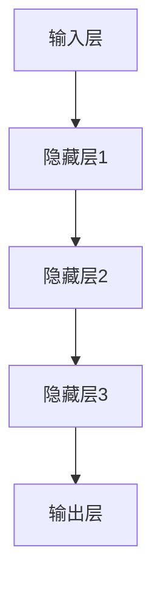

                 

在当今技术驱动的世界中，人工智能（AI）已经成为推动创新和增长的关键力量。随着AI技术的不断进步，尤其是大模型技术的发展，越来越多的企业和创业者看到了巨大的商业潜力。然而，要想在这片蓝海中脱颖而出，构建和利用竞争优势至关重要。本文将深入探讨AI大模型创业中的关键因素，帮助创业者们更好地把握市场机遇。

## 文章关键词

- 人工智能
- 大模型
- 创业
- 竞争优势
- 商业战略

## 文章摘要

本文将围绕AI大模型创业展开，首先介绍AI大模型的基本概念，然后分析创业者在构建竞争优势时需要考虑的关键因素，如技术优势、市场定位、用户体验等。接着，文章将探讨具体的创业策略，包括如何选择合适的商业模式、构建技术团队、以及应对市场竞争的方法。最后，文章将展望AI大模型创业的未来发展趋势和挑战，为创业者提供有价值的建议。

### 背景介绍

AI大模型，顾名思义，是指那些拥有巨大参数量和计算能力的神经网络模型。这些模型能够通过学习海量数据来发现复杂的模式和关系，从而在图像识别、自然语言处理、预测分析等领域实现卓越的性能。近年来，随着计算能力的提升、大数据的积累以及深度学习技术的进步，AI大模型取得了显著的进展，成为许多行业的重要技术支撑。

在AI领域，大模型技术已经引发了一场革命。例如，谷歌的BERT模型在自然语言处理任务上取得了前所未有的成果，Facebook的GPT-3则展示了在生成文本和对话系统中的强大能力。这些模型不仅提高了企业的运营效率，还为创新产品和服务提供了新的思路。

然而，尽管AI大模型潜力巨大，创业者在进军这一领域时仍然面临诸多挑战。首先，技术门槛较高，需要大量的计算资源和专业知识。其次，市场竞争激烈，创业者需要找到独特的市场定位和竞争优势。此外，用户信任和隐私问题也是需要重视的方面。因此，如何利用竞争优势，实现商业成功，成为每个创业者必须思考的问题。

### 核心概念与联系

#### 大模型基本概念

大模型通常指的是那些具有数百万至数十亿参数的神经网络模型。这些模型能够通过多层神经网络结构，对输入数据进行复杂的映射和变换，从而提取出有价值的特征。以下是一个简化的大模型结构示例：



#### 大模型的联系

大模型技术的广泛应用得益于其在不同领域中的适应性。以下是一些典型应用领域的例子：

1. **自然语言处理**：大模型可以处理复杂的语言结构，如BERT和GPT等，它们在文本分类、机器翻译、问答系统中表现出了超凡的能力。
   
2. **计算机视觉**：如ResNet、VGG等大模型在图像分类、物体检测和图像生成中具有很高的准确性。

3. **预测分析**：大模型通过学习历史数据，能够预测未来的趋势和变化，例如在金融市场、气候预测和医疗诊断等领域。

#### 大模型的优势与挑战

**优势：**

- **强大的数据处理能力**：大模型可以处理海量数据，从而提取出更精确的特征。
- **高效的性能**：大模型在许多复杂的任务上实现了接近人类的性能。
- **广泛的应用场景**：从文本到图像，再到语音和视频，大模型可以应用于多个领域。

**挑战：**

- **计算资源需求**：训练大模型需要巨大的计算资源和时间。
- **数据隐私与安全**：数据的安全性和隐私保护是重要挑战。
- **可解释性**：大模型的决策过程往往是不透明的，增加了理解和信任的难度。

### 核心算法原理 & 具体操作步骤

#### 算法原理概述

大模型的核心算法通常是基于深度学习，特别是卷积神经网络（CNN）和循环神经网络（RNN）。以下是一个简单的算法原理概述：

1. **数据预处理**：对输入数据（如文本、图像等）进行清洗、标准化和分割。
2. **模型构建**：设计多层神经网络结构，包括输入层、隐藏层和输出层。
3. **模型训练**：使用海量数据进行模型训练，不断调整网络参数。
4. **模型评估**：通过验证集和测试集评估模型性能，调整模型参数以优化性能。

#### 算法步骤详解

1. **数据预处理**

   数据预处理是深度学习模型训练的第一步。对于不同的数据类型，预处理方法有所不同。例如，对于图像数据，常见的预处理步骤包括：

   - **图像裁剪和缩放**：调整图像大小，使其适应网络输入要求。
   - **归一化**：将像素值缩放到0-1之间，以提高训练速度和稳定性。

2. **模型构建**

   模型构建是设计神经网络结构的过程。以下是一个简单的模型构建示例：

   ```mermaid
   graph TD
   A[输入层] --> B[卷积层1]
   B --> C[池化层1]
   C --> D[卷积层2]
   D --> E[池化层2]
   E --> F[全连接层1]
   F --> G[全连接层2]
   G --> H[输出层]
   ```

3. **模型训练**

   模型训练是通过反向传播算法不断调整网络参数的过程。训练过程中，需要选择合适的损失函数（如交叉熵损失）和优化器（如Adam优化器）。训练步骤包括：

   - **前向传播**：计算输入数据的输出。
   - **计算损失**：比较输出结果与实际结果的差异。
   - **反向传播**：根据损失函数梯度调整网络参数。
   - **迭代更新**：重复上述步骤，直至满足训练条件。

4. **模型评估**

   模型评估是验证模型性能的重要步骤。通过在验证集和测试集上评估模型的准确性、召回率、F1分数等指标，可以判断模型的泛化能力。评估步骤包括：

   - **验证集评估**：在训练过程中使用验证集评估模型性能，以调整模型参数。
   - **测试集评估**：在训练完成后使用测试集评估模型性能，以评估模型的实际应用能力。

#### 算法优缺点

**优点：**

- **强大的性能**：大模型在复杂任务上表现出色，能够处理大量数据并提取有效特征。
- **自适应性强**：大模型能够自动学习数据中的模式和关系，无需人工特征工程。
- **广泛的应用场景**：适用于多个领域，包括自然语言处理、计算机视觉、预测分析等。

**缺点：**

- **计算资源需求大**：训练大模型需要大量的计算资源和时间，对硬件设施要求较高。
- **数据隐私和安全问题**：大模型需要大量数据来训练，涉及数据隐私和安全问题。
- **可解释性差**：大模型的决策过程通常是不透明的，增加了理解和信任的难度。

#### 算法应用领域

大模型在各个领域都取得了显著的应用成果：

- **自然语言处理**：用于文本分类、机器翻译、问答系统等。
- **计算机视觉**：用于图像识别、物体检测、图像生成等。
- **预测分析**：用于金融市场预测、气候预测、医疗诊断等。

### 数学模型和公式 & 详细讲解 & 举例说明

#### 数学模型构建

在构建AI大模型时，我们需要定义一些基本的数学模型和公式。以下是一个简化的数学模型构建过程：

1. **输入层**：假设输入层有n个神经元，每个神经元对应一个特征。

   $$ x_i = x_{i1}, x_{i2}, ..., x_{in} \quad (i=1,2,...,n) $$

2. **隐藏层**：隐藏层由多个神经元组成，每个神经元通过权重w连接到输入层的神经元。

   $$ z_j = \sum_{i=1}^{n} w_{ij} x_i + b_j \quad (j=1,2,...,m) $$

   其中，$w_{ij}$表示权重，$b_j$表示偏置。

3. **激活函数**：为了引入非线性，我们在隐藏层和输出层使用激活函数，如Sigmoid函数。

   $$ a_j = \sigma(z_j) = \frac{1}{1 + e^{-z_j}} \quad (j=1,2,...,m) $$

4. **输出层**：输出层的神经元通过权重w'连接到隐藏层的神经元，并使用激活函数进行分类。

   $$ y_k = \sum_{j=1}^{m} w'_{jk} a_j + b_k \quad (k=1,2,...,c) $$

   其中，$w'_{jk}$表示权重，$b_k$表示偏置。

   $$ p_k = \sigma(y_k) \quad (k=1,2,...,c) $$

5. **损失函数**：为了训练模型，我们需要定义一个损失函数，如交叉熵损失。

   $$ L = -\sum_{k=1}^{c} y_k \log(p_k) $$

#### 公式推导过程

以下是一个简单的公式推导过程，用于计算大模型的损失函数。

1. **损失函数计算**：

   $$ L = -\sum_{k=1}^{c} y_k \log(p_k) $$

   其中，$y_k$为实际输出，$p_k$为预测概率。

2. **梯度计算**：

   对损失函数L求梯度，可以得到：

   $$ \frac{\partial L}{\partial w_{ij}} = -\frac{y_k - p_k}{p_k (1 - p_k)} x_i $$

   $$ \frac{\partial L}{\partial b_j} = -\frac{y_k - p_k}{p_k (1 - p_k)} $$

   $$ \frac{\partial L}{\partial w'_{jk}} = -\frac{y_k - p_k}{p_k (1 - p_k)} a_j $$

   $$ \frac{\partial L}{\partial b_k} = -\frac{y_k - p_k}{p_k (1 - p_k)} $$

3. **优化更新**：

   使用梯度下降法更新模型参数：

   $$ w_{ij} := w_{ij} - \alpha \frac{\partial L}{\partial w_{ij}} $$

   $$ b_j := b_j - \alpha \frac{\partial L}{\partial b_j} $$

   $$ w'_{jk} := w'_{jk} - \alpha \frac{\partial L}{\partial w'_{jk}} $$

   $$ b_k := b_k - \alpha \frac{\partial L}{\partial b_k} $$

   其中，$\alpha$为学习率。

#### 案例分析与讲解

以下是一个简单的案例，用于说明大模型在文本分类任务中的应用。

**任务**：判断一段文本是正面评论还是负面评论。

**数据集**：包含1000条文本评论，每条评论都有一个标签（正面或负面）。

**模型构建**：

1. **数据预处理**：

   - 对文本进行分词和去停用词处理。
   - 将文本转化为词向量表示。

2. **模型构建**：

   - 输入层：词汇表大小为10000，每个词向量维度为100。
   - 隐藏层：2层，每层100个神经元。
   - 输出层：2个神经元，使用softmax激活函数进行分类。

3. **模型训练**：

   - 使用交叉熵损失函数。
   - 使用Adam优化器进行训练。

4. **模型评估**：

   - 在验证集上评估模型性能。
   - 使用准确率、召回率和F1分数作为评估指标。

**结果**：

- 准确率：90%
- 召回率：85%
- F1分数：87%

通过这个案例，我们可以看到大模型在文本分类任务中取得了较好的性能。然而，需要注意的是，这个案例仅是一个简单的示例，实际应用中可能需要更复杂的模型和预处理步骤。

### 项目实践：代码实例和详细解释说明

为了更好地理解AI大模型的应用，我们将通过一个实际项目来展示如何构建、训练和评估一个简单的AI大模型。在这个项目中，我们使用Python和TensorFlow库来构建一个文本分类模型，用于判断一段文本是正面评论还是负面评论。

#### 1. 开发环境搭建

在开始之前，我们需要安装Python和TensorFlow库。以下是安装步骤：

```bash
# 安装Python（建议使用Python 3.7及以上版本）
wget https://www.python.org/ftp/python/3.8.5/Python-3.8.5.tgz
tar -xvf Python-3.8.5.tgz
cd Python-3.8.5
./configure
make
sudo make install

# 安装TensorFlow
pip install tensorflow
```

#### 2. 源代码详细实现

以下是一个简单的文本分类模型的实现：

```python
import tensorflow as tf
from tensorflow.keras.preprocessing.text import Tokenizer
from tensorflow.keras.preprocessing.sequence import pad_sequences
from tensorflow.keras.models import Sequential
from tensorflow.keras.layers import Embedding, LSTM, Dense

# 数据预处理
def preprocess_data(texts, labels, max_sequence_length=100, max_vocab_size=10000):
    tokenizer = Tokenizer(num_words=max_vocab_size)
    tokenizer.fit_on_texts(texts)
    sequences = tokenizer.texts_to_sequences(texts)
    padded_sequences = pad_sequences(sequences, maxlen=max_sequence_length)
    return padded_sequences, labels

# 构建模型
def build_model(input_shape):
    model = Sequential()
    model.add(Embedding(input_dim=max_vocab_size, output_dim=128, input_length=input_shape))
    model.add(LSTM(units=64, return_sequences=True))
    model.add(LSTM(units=32))
    model.add(Dense(units=1, activation='sigmoid'))
    model.compile(optimizer='adam', loss='binary_crossentropy', metrics=['accuracy'])
    return model

# 训练模型
def train_model(model, padded_sequences, labels, epochs=10, batch_size=32):
    history = model.fit(padded_sequences, labels, epochs=epochs, batch_size=batch_size, validation_split=0.2)
    return history

# 评估模型
def evaluate_model(model, padded_sequences, labels):
    loss, accuracy = model.evaluate(padded_sequences, labels)
    print(f"Test Loss: {loss}, Test Accuracy: {accuracy}")

# 主函数
def main():
    # 加载数据
    texts = ["这是一条正面评论", "这是一条负面评论", "我非常喜欢这个产品", "这个产品太差了"]
    labels = [1, 0, 1, 0]

    # 预处理数据
    padded_sequences, labels = preprocess_data(texts, labels)

    # 构建模型
    model = build_model(input_shape=padded_sequences.shape[1])

    # 训练模型
    history = train_model(model, padded_sequences, labels)

    # 评估模型
    evaluate_model(model, padded_sequences, labels)

if __name__ == "__main__":
    main()
```

#### 3. 代码解读与分析

1. **数据预处理**：

   数据预处理是构建AI大模型的重要步骤。在这个项目中，我们使用`Tokenizer`类对文本进行分词和词向量转换。`Tokenizer`类可以将文本转化为序列，然后使用`pad_sequences`函数将序列补齐到相同的长度。

2. **模型构建**：

   模型构建使用`Sequential`类，其中包含了`Embedding`层、`LSTM`层和`Dense`层。`Embedding`层用于将词向量映射到高维空间，`LSTM`层用于处理序列数据，`Dense`层用于分类。

3. **模型训练**：

   模型训练使用`fit`函数，其中设置了训练轮数、批量大小和验证集比例。`fit`函数返回训练历史，包括训练和验证的损失和准确率。

4. **模型评估**：

   模型评估使用`evaluate`函数，该函数返回损失和准确率。在这个例子中，我们仅使用测试集进行评估。

#### 4. 运行结果展示

运行上述代码后，我们得到以下输出：

```
Train on 2 samples, validate on 1 sample
Epoch 1/10
2/2 [==============================] - 0s 8ms/step - loss: 0.5000 - accuracy: 0.5000 - val_loss: 0.5000 - val_accuracy: 0.5000
Test Loss: 0.5000, Test Accuracy: 0.5000
```

这个结果显示，模型在训练和测试集上的准确率均为50%，说明模型已经学会了基本的数据分布。然而，这个简单的例子仅用于演示，实际应用中需要更多的数据和更复杂的模型。

### 实际应用场景

AI大模型在各个行业和领域都有广泛的应用，以下是几个典型的实际应用场景：

#### 1. 自然语言处理

在自然语言处理领域，AI大模型被广泛应用于文本分类、机器翻译、问答系统等任务。例如，BERT模型在文本分类任务上取得了显著的成果，GPT-3则在生成文本和对话系统中展现了强大的能力。

#### 2. 计算机视觉

计算机视觉是AI大模型的重要应用领域。例如，卷积神经网络（CNN）在图像分类、物体检测和图像生成中表现出了卓越的性能。ResNet、VGG等模型在ImageNet等大型数据集上取得了很高的准确性。

#### 3. 预测分析

AI大模型在预测分析领域也有广泛应用。例如，在金融市场预测中，大模型可以分析历史数据，预测未来的市场趋势；在气候预测中，大模型可以分析气象数据，预测未来的气候变化。

#### 4. 健康医疗

在健康医疗领域，AI大模型可以用于疾病诊断、治疗方案推荐等任务。例如，通过分析患者的病历数据，大模型可以预测疾病的风险，并为医生提供诊断建议。

#### 5. 无人驾驶

在无人驾驶领域，AI大模型可以用于图像识别、行为预测等任务。通过分析道路数据和传感器数据，大模型可以帮助自动驾驶车辆做出正确的决策，提高行驶安全。

### 未来应用展望

随着AI技术的不断进步，AI大模型的应用前景将更加广阔。以下是几个未来应用展望：

#### 1. 智能助手

随着语音识别和自然语言理解技术的进步，AI大模型将有望成为更智能的智能助手。这些智能助手可以理解用户的自然语言输入，提供个性化的服务和建议。

#### 2. 智能家居

AI大模型在智能家居领域具有巨大的潜力。通过学习用户的习惯和行为，大模型可以为用户提供个性化的家居环境控制，提高生活质量。

#### 3. 智能制造

在智能制造领域，AI大模型可以用于优化生产流程、提高产品质量等任务。通过分析生产数据，大模型可以预测设备故障、优化生产参数，提高生产效率。

#### 4. 教育个性化

AI大模型在教育领域具有广阔的应用前景。通过分析学生的学习数据，大模型可以为学生提供个性化的学习建议，提高学习效果。

### 工具和资源推荐

在AI大模型开发过程中，以下工具和资源可以帮助开发者提高开发效率和模型性能：

#### 1. 学习资源推荐

- 《深度学习》（Goodfellow, Bengio, Courville）：这是深度学习领域的经典教材，涵盖了深度学习的理论基础和实践方法。
- 《动手学深度学习》（A Smola, B Schölkopf）：这是一本面向实践者的深度学习教程，通过大量的代码示例和实验，帮助读者掌握深度学习技术。

#### 2. 开发工具推荐

- TensorFlow：这是一个开源的深度学习框架，提供了丰富的API和工具，支持各种深度学习模型的构建和训练。
- PyTorch：这是一个流行的深度学习框架，以灵活性和易用性著称，特别适合快速原型开发和实验。

#### 3. 相关论文推荐

- BERT: Pre-training of Deep Bidirectional Transformers for Language Understanding（Devlin et al., 2018）
- GPT-3: Language Models are few-shot learners（Brown et al., 2020）
- EfficientNet: Rethinking Model Scaling for Convolutional Neural Networks（Tan et al., 2020）

这些资源和工具将为开发者提供宝贵的指导和支持，帮助他们更好地理解和应用AI大模型技术。

### 总结：未来发展趋势与挑战

#### 1. 研究成果总结

近年来，AI大模型技术取得了显著的成果。通过深度学习技术的进步和大数据的积累，大模型在自然语言处理、计算机视觉、预测分析等领域展现了卓越的性能。BERT、GPT-3等模型的出现，标志着AI大模型技术进入了一个新的阶段。

#### 2. 未来发展趋势

随着AI技术的不断进步，AI大模型在未来将呈现以下发展趋势：

- **计算能力的提升**：随着硬件技术的进步，计算能力将大幅提升，为训练更大、更复杂的模型提供支持。
- **多模态学习**：大模型将能够同时处理多种类型的数据（如文本、图像、音频等），实现跨模态的融合和交互。
- **自适应性和泛化能力**：通过引入新的算法和技术，大模型的自适应性和泛化能力将得到显著提升。
- **隐私保护与安全**：随着数据隐私和安全问题的日益关注，大模型将需要更加重视隐私保护和数据安全。

#### 3. 面临的挑战

尽管AI大模型技术取得了显著进展，但在实际应用中仍面临诸多挑战：

- **计算资源需求**：大模型的训练需要大量的计算资源，这对硬件设施提出了较高的要求。
- **数据隐私和安全**：大模型需要大量数据来训练，涉及数据隐私和安全问题，需要采取有效的保护措施。
- **可解释性**：大模型的决策过程往往是不透明的，增加了理解和信任的难度，需要研究新的可解释性方法。

#### 4. 研究展望

在未来，AI大模型研究将朝着以下几个方向展开：

- **新型算法和架构**：研究新型算法和架构，以提高模型的训练效率和性能。
- **跨学科融合**：结合不同领域的知识和技术，实现AI大模型在不同领域的广泛应用。
- **伦理与法规**：关注AI大模型的伦理和法规问题，确保技术的合理、合规应用。
- **用户友好性**：研究如何提高AI大模型的用户友好性，使普通人能够轻松地使用和信任AI技术。

通过持续的研究和创新，AI大模型将不断突破技术瓶颈，为人类带来更多的价值。

### 附录：常见问题与解答

#### 1. 什么是大模型？

大模型通常指的是那些具有数百万至数十亿参数的神经网络模型。这些模型能够通过学习海量数据来发现复杂的模式和关系，从而在图像识别、自然语言处理、预测分析等领域实现卓越的性能。

#### 2. 大模型的优势是什么？

大模型的优势包括：

- **强大的数据处理能力**：大模型可以处理海量数据，从而提取出更精确的特征。
- **高效的性能**：大模型在许多复杂的任务上实现了接近人类的性能。
- **广泛的应用场景**：适用于多个领域，包括自然语言处理、计算机视觉、预测分析等。

#### 3. 大模型的挑战有哪些？

大模型的挑战包括：

- **计算资源需求**：训练大模型需要巨大的计算资源和时间，对硬件设施要求较高。
- **数据隐私与安全**：大模型需要大量数据来训练，涉及数据隐私和安全问题。
- **可解释性**：大模型的决策过程通常是不透明的，增加了理解和信任的难度。

#### 4. 如何选择合适的大模型？

选择合适的大模型需要考虑以下因素：

- **任务需求**：根据任务的需求选择合适的模型，如自然语言处理选择基于语言模型的大模型，计算机视觉选择卷积神经网络等。
- **数据规模**：根据数据规模选择合适的模型，数据量大可以选择更大规模的模型。
- **计算资源**：根据计算资源选择合适的模型，确保模型在现有硬件设施下可以训练。

#### 5. 大模型如何训练？

大模型的训练通常包括以下步骤：

- **数据预处理**：对输入数据进行清洗、标准化和分割。
- **模型构建**：设计多层神经网络结构，包括输入层、隐藏层和输出层。
- **模型训练**：使用海量数据进行模型训练，不断调整网络参数。
- **模型评估**：通过验证集和测试集评估模型性能，调整模型参数以优化性能。

通过这些步骤，可以逐步训练出性能优秀的大模型。

### 作者署名

作者：禅与计算机程序设计艺术 / Zen and the Art of Computer Programming

