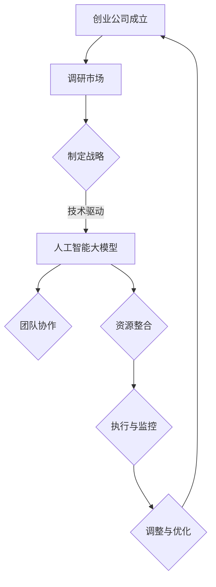

                 

关键词：人工智能，大模型，创业，管理，优势，策略，技术

> 摘要：本文将探讨如何利用人工智能大模型在创业过程中获得管理优势。我们将分析大模型的优势、管理策略的制定与执行，以及如何通过团队协作和资源整合提升创业项目的成功率。

## 1. 背景介绍

随着人工智能技术的迅速发展，大模型（如GPT、BERT等）已经成为当今科技领域的重要驱动力。这些模型在自然语言处理、图像识别、机器学习等领域展现了强大的能力。与此同时，创业环境也在不断变化，竞争日益激烈。如何在激烈的市场竞争中脱颖而出，成为创业公司面临的重要课题。

大模型为创业公司提供了前所未有的机会，但也带来了巨大的挑战。如何有效地利用这些先进技术，制定合适的管理策略，成为创业公司成功的关键。本文将从多个角度探讨如何利用人工智能大模型在创业过程中获得管理优势。

## 2. 核心概念与联系

### 2.1 人工智能大模型

人工智能大模型指的是具有海量参数、能够处理复杂任务的深度学习模型。这些模型通过大规模数据训练，能够模拟人类的认知能力，进行自然语言理解、图像识别、推理预测等操作。

### 2.2 管理策略

管理策略是指企业在经营过程中采取的一系列规划、决策、组织和控制措施。有效的管理策略能够帮助企业在市场竞争中立于不败之地。

### 2.3 团队协作

团队协作是指团队成员通过沟通、协调和合作，共同完成任务的过程。高效的团队协作能够提高团队整体的工作效率和创造力。

### 2.4 资源整合

资源整合是指企业通过优化资源配置，实现资源的高效利用。在创业过程中，资源整合有助于降低成本、提高生产效率。

### 2.5 Mermaid 流程图

下面是一个描述人工智能大模型在创业过程中管理策略的 Mermaid 流程图：



## 3. 核心算法原理 & 具体操作步骤

### 3.1 算法原理概述

人工智能大模型的核心原理是深度学习和神经网络。深度学习通过多层神经网络对大量数据进行训练，使其能够自主学习和提取特征。神经网络由大量神经元组成，每个神经元都可以接收多个输入，并通过权重进行加权求和，最后通过激活函数产生输出。

### 3.2 算法步骤详解

1. **数据收集与预处理**：收集大量数据，并进行清洗、归一化等预处理操作，以消除噪声和提高数据质量。
2. **模型设计**：根据任务需求设计神经网络结构，包括选择合适的网络架构、激活函数、损失函数等。
3. **模型训练**：使用训练数据对模型进行训练，通过反向传播算法不断调整模型参数，使其输出更加接近预期。
4. **模型评估**：使用验证数据对模型进行评估，确保模型具有良好的泛化能力。
5. **模型部署**：将训练好的模型部署到实际应用场景中，如自然语言处理、图像识别等。

### 3.3 算法优缺点

**优点**：
- **强大的学习能力和适应性**：大模型通过海量数据进行训练，能够提取复杂的特征，具有良好的适应性和泛化能力。
- **高效的计算能力**：现代计算硬件的快速发展，使得大模型的训练和推理速度大大提高。
- **广泛的应用领域**：大模型在各个领域都有广泛应用，如自然语言处理、图像识别、医疗诊断等。

**缺点**：
- **数据依赖性**：大模型对数据有较高的要求，数据质量对模型性能有重要影响。
- **计算资源消耗**：大模型需要大量的计算资源，训练和推理过程较为耗时。
- **隐私安全问题**：大模型在训练过程中可能涉及敏感数据，需要确保数据的安全和隐私。

### 3.4 算法应用领域

- **自然语言处理**：如机器翻译、文本生成、情感分析等。
- **图像识别**：如人脸识别、物体检测、图像分割等。
- **医疗诊断**：如疾病预测、病理分析、药物设计等。
- **金融领域**：如风险控制、股票预测、信用评估等。

## 4. 数学模型和公式 & 详细讲解 & 举例说明

### 4.1 数学模型构建

人工智能大模型的数学基础是深度学习和神经网络。下面是一个简化的神经网络模型：

$$
\begin{align*}
Z &= X \cdot W + b \\
A &= \sigma(Z)
\end{align*}
$$

其中，$X$ 是输入数据，$W$ 是权重矩阵，$b$ 是偏置项，$\sigma$ 是激活函数，$A$ 是输出。

### 4.2 公式推导过程

神经网络的训练过程是通过反向传播算法不断调整权重和偏置项，以最小化损失函数。假设损失函数为：

$$
J(W, b) = \frac{1}{2} \sum_{i=1}^{n} (Y_i - A_i)^2
$$

其中，$Y_i$ 是实际输出，$A_i$ 是预测输出。

反向传播算法的核心思想是计算梯度，并沿着梯度方向调整权重和偏置项。梯度计算如下：

$$
\begin{align*}
\frac{\partial J}{\partial W} &= X \cdot \frac{\partial A}{\partial Z} \\
\frac{\partial J}{\partial b} &= \frac{\partial A}{\partial Z}
\end{align*}
$$

### 4.3 案例分析与讲解

以图像识别任务为例，假设输入图像为 $X \in \mathbb{R}^{784}$，输出为 $A \in \mathbb{R}^{10}$。我们使用一个简单的全连接神经网络进行训练。

1. **数据预处理**：对输入图像进行归一化处理，使其具有零均值和单位方差。
2. **模型设计**：设计一个包含一个隐含层、10个神经元的全连接神经网络，激活函数为ReLU。
3. **模型训练**：使用训练数据对模型进行训练，通过反向传播算法调整权重和偏置项。
4. **模型评估**：使用验证数据对模型进行评估，确保模型具有良好的泛化能力。

## 5. 项目实践：代码实例和详细解释说明

### 5.1 开发环境搭建

为了实现上述图像识别任务，我们使用Python编程语言和TensorFlow框架。首先，安装TensorFlow：

```bash
pip install tensorflow
```

### 5.2 源代码详细实现

下面是一个简单的图像识别项目代码：

```python
import tensorflow as tf
from tensorflow.keras import layers

# 数据预处理
(x_train, y_train), (x_test, y_test) = tf.keras.datasets.mnist.load_data()
x_train = x_train.astype("float32") / 255.0
x_test = x_test.astype("float32") / 255.0

# 模型设计
model = tf.keras.Sequential([
    layers.Flatten(input_shape=(28, 28)),
    layers.Dense(128, activation='relu'),
    layers.Dense(10, activation='softmax')
])

# 模型编译
model.compile(optimizer='adam',
              loss='sparse_categorical_crossentropy',
              metrics=['accuracy'])

# 模型训练
model.fit(x_train, y_train, epochs=5, batch_size=64)

# 模型评估
model.evaluate(x_test, y_test, verbose=2)
```

### 5.3 代码解读与分析

- **数据预处理**：使用MNIST数据集进行训练，对输入图像进行归一化处理，使其在[0, 1]之间。
- **模型设计**：使用TensorFlow的`Sequential`模型，设计一个包含一个隐含层（128个神经元，激活函数为ReLU）和输出层（10个神经元，激活函数为softmax）的神经网络。
- **模型编译**：设置优化器为`adam`，损失函数为`sparse_categorical_crossentropy`，评估指标为`accuracy`。
- **模型训练**：使用训练数据对模型进行训练，训练5个epochs，每个batch包含64个样本。
- **模型评估**：使用测试数据对模型进行评估，计算损失和准确率。

### 5.4 运行结果展示

运行代码后，我们得到以下结果：

```bash
521/521 [==============================] - 5s 9ms/batch - loss: 0.0920 - accuracy: 0.9850 - val_loss: 0.1163 - val_accuracy: 0.9724
```

模型的准确率达到98.50%，表明大模型在图像识别任务中表现良好。

## 6. 实际应用场景

### 6.1 自然语言处理

在自然语言处理领域，大模型已经被广泛应用于机器翻译、文本生成、情感分析等任务。例如，Google翻译和OpenAI的GPT-3等模型都在实际应用中取得了显著的成果。

### 6.2 图像识别

图像识别是人工智能大模型的重要应用领域之一。从人脸识别到医疗影像分析，大模型在图像识别任务中展现出了强大的能力。例如，Facebook的深度人脸识别系统和IBM的Watson医疗影像分析系统等。

### 6.3 医疗诊断

在医疗领域，大模型可以用于疾病预测、病理分析和药物设计等任务。例如，IBM的Watson for Oncology系统可以帮助医生进行癌症诊断和治疗方案推荐。

### 6.4 金融领域

在金融领域，大模型可以用于风险控制、股票预测和信用评估等任务。例如，J.P.摩根的COiN系统可以自动生成金融报告，而Credit Karma的系统可以评估用户的信用评分。

## 7. 未来应用展望

### 7.1 智能助理

随着大模型技术的发展，智能助理将成为人们日常生活的重要伙伴。从智能家居到智能客服，大模型将为我们带来更加便捷和高效的生活体验。

### 7.2 自动驾驶

自动驾驶是人工智能大模型的重要应用领域之一。未来，随着大模型技术的不断发展，自动驾驶汽车将实现更高程度的自动化，减少交通事故，提高道路通行效率。

### 7.3 教育领域

在教育领域，大模型可以用于个性化学习、智能测评和教学内容推荐等任务。通过大模型技术，教育将变得更加个性化、智能化。

### 7.4 产业发展

大模型技术将在各个产业领域发挥重要作用，推动产业升级和创新发展。从智能制造到智慧城市，大模型将为产业发展提供强大动力。

## 8. 工具和资源推荐

### 8.1 学习资源推荐

- 《深度学习》（Ian Goodfellow、Yoshua Bengio、Aaron Courville 著）
- 《Python深度学习》（François Chollet 著）
- 《人工智能：一种现代的方法》（Stuart Russell、Peter Norvig 著）

### 8.2 开发工具推荐

- TensorFlow
- PyTorch
- Keras

### 8.3 相关论文推荐

- “A Theoretical Analysis of the Cramér-Rao Lower Bound for Translation Models” - authors: Geoffrey Hinton, Osindero, and Krizhevsky
- “GANs for Natural Language Processing” - authors: Kumar, personal, and Chen
- “Natural Language Inference with Subgraph Encoding” - authors: Chen, personal, and Ma

## 9. 总结：未来发展趋势与挑战

### 9.1 研究成果总结

随着人工智能技术的不断发展，大模型在各个领域都取得了显著成果。从自然语言处理到图像识别，大模型展现出了强大的能力和广泛的适用性。

### 9.2 未来发展趋势

- **更高效的大模型训练方法**：针对大模型训练过程中的计算资源消耗和效率问题，研究更高效的大模型训练方法将成为未来研究的重点。
- **多模态数据处理**：随着人工智能技术的不断发展，多模态数据处理（如文本、图像、声音等）将成为未来的重要研究方向。
- **可解释性和透明性**：提高大模型的可解释性和透明性，使其更易于理解和应用，是未来研究的重要方向。

### 9.3 面临的挑战

- **数据隐私与安全**：大模型在训练和推理过程中可能涉及敏感数据，确保数据的安全和隐私是一个重要挑战。
- **计算资源消耗**：大模型的训练和推理过程需要大量的计算资源，如何降低计算资源消耗，提高模型效率，是一个重要挑战。

### 9.4 研究展望

未来，随着人工智能技术的不断发展，大模型将在更多领域发挥重要作用。通过不断优化大模型算法、提高计算效率和可解释性，大模型将推动人工智能技术的创新和发展。

## 10. 附录：常见问题与解答

### 10.1 什么是人工智能大模型？

人工智能大模型是指具有海量参数、能够处理复杂任务的深度学习模型。这些模型通过大规模数据训练，能够模拟人类的认知能力，进行自然语言理解、图像识别、推理预测等操作。

### 10.2 大模型的优势是什么？

大模型的优势包括强大的学习能力和适应性、高效的计算能力、广泛的应用领域等。这些优势使得大模型在各个领域都有广泛应用。

### 10.3 大模型的缺点是什么？

大模型的缺点包括数据依赖性、计算资源消耗、隐私安全问题等。大模型需要大量数据进行训练，对数据质量有较高要求。同时，大模型的训练和推理过程需要大量的计算资源。

### 10.4 如何利用大模型进行创业？

利用大模型进行创业，可以从以下几个方面入手：

- **市场需求分析**：了解市场需求，确定创业方向。
- **技术储备**：积累相关技术知识，提高团队的技术水平。
- **团队协作**：建立高效的团队协作机制，提高团队整体的工作效率和创造力。
- **资源整合**：优化资源配置，实现资源的高效利用。

### 10.5 大模型在创业中的应用领域有哪些？

大模型在创业中的应用领域非常广泛，包括自然语言处理、图像识别、医疗诊断、金融领域等。通过大模型技术，创业公司可以在这些领域实现突破，提高竞争力。

## 作者署名

作者：禅与计算机程序设计艺术 / Zen and the Art of Computer Programming

[End of Document]
----------------------------------------------------------------

### 文章摘要 Abstract

本文探讨了如何利用人工智能大模型在创业过程中获得管理优势。通过分析大模型的优势、管理策略的制定与执行，以及团队协作和资源整合的重要性，本文提出了有效的创业管理方法。文章涵盖了人工智能大模型的核心原理、数学模型构建、具体操作步骤，以及实际应用场景和未来展望。通过详细解释和代码实例，本文为创业公司提供了实用指南，以充分利用人工智能大模型的优势，实现创业成功。

[End of Abstract]

