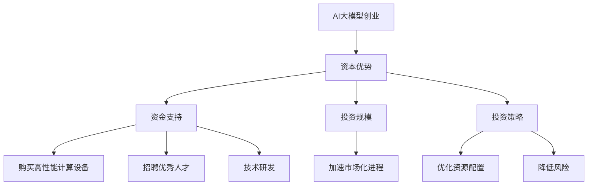

                 

关键词：人工智能、大模型、创业、资本、优势

> 摘要：本文将探讨AI大模型创业中的资本优势，分析如何有效利用资本推动大模型的发展，为创业者提供战略规划和执行建议，助力实现商业成功。

## 1. 背景介绍

近年来，人工智能（AI）技术快速发展，尤其是大模型技术的突破，使得AI在自然语言处理、计算机视觉、机器学习等领域取得了显著的进展。大模型，如GPT-3、BERT等，因其强大的处理能力和深度学习能力，正逐渐成为各个行业的核心技术驱动力。与此同时，资本的涌入为AI大模型创业提供了巨大的机会。

### 1.1 AI大模型的发展历程

AI大模型的发展可以分为三个阶段：

1. **早期探索阶段（2010年-2015年）**：神经网络的发展促进了AI大模型的初步研究，但受限于计算资源和数据量，模型的规模有限。

2. **快速增长阶段（2016年-2020年）**：随着深度学习技术的成熟和计算资源的提升，AI大模型得到了快速发展，如GPT-3、BERT等模型的出现，标志着AI大模型的成熟。

3. **广泛应用阶段（2020年至今）**：AI大模型在各个领域的应用逐渐深入，从自然语言处理到计算机视觉，再到机器学习，AI大模型已经成为行业创新的催化剂。

### 1.2 AI大模型创业的现状

AI大模型创业正成为一种新的创业趋势。许多初创公司通过构建和优化大模型，试图在金融、医疗、教育、零售等行业中找到应用场景。然而，AI大模型创业面临诸多挑战，如数据隐私、算法透明性、计算资源需求等。此外，资本优势成为推动AI大模型创业的关键因素。

## 2. 核心概念与联系

### 2.1 资本优势的概念

资本优势是指企业在融资过程中所具备的吸引力，包括资金、投资规模、投资策略等。对于AI大模型创业，资本优势主要体现在以下几个方面：

1. **资金支持**：充足的资金支持能够帮助初创公司购买高性能计算设备、招聘优秀人才、进行技术研发等。

2. **投资规模**：大规模的投资能够推动AI大模型的研究和开发，加速产品的市场化进程。

3. **投资策略**：合理的投资策略能够帮助初创公司优化资源配置，提高研发效率，降低风险。

### 2.2 AI大模型创业与资本优势的关联

AI大模型创业与资本优势密切相关。首先，资本优势为AI大模型创业提供了必要的资金支持，助力初创公司在竞争激烈的市场中立足。其次，资本优势有助于吸引顶尖人才，提升公司的研发能力和竞争力。此外，资本优势还能够为AI大模型创业提供战略指导，帮助初创公司制定合理的商业模式和市场推广策略。

### 2.3 Mermaid流程图



## 3. 核心算法原理 & 具体操作步骤

### 3.1 算法原理概述

AI大模型创业的核心在于构建和优化大模型，使其能够在特定领域取得突破性成果。这涉及到以下几个关键步骤：

1. **数据收集与预处理**：收集大量高质量的数据，并进行预处理，以适应大模型的训练需求。

2. **模型构建**：基于深度学习技术，构建适用于特定领域的大模型，如GPT-3、BERT等。

3. **模型训练**：使用预处理后的数据进行模型训练，通过不断调整模型参数，提高模型的准确性和泛化能力。

4. **模型优化**：对训练好的模型进行优化，以提高其性能和效率。

5. **模型部署**：将优化后的模型部署到实际应用场景中，如自然语言处理、计算机视觉等。

### 3.2 算法步骤详解

#### 3.2.1 数据收集与预处理

数据收集与预处理是构建AI大模型的基础。首先，需要收集大量高质量的数据，这些数据应具有多样性、广泛性和代表性。例如，在自然语言处理领域，可以使用大量的文本数据，包括新闻、文章、社交媒体等。

数据预处理包括以下几个步骤：

1. **数据清洗**：去除数据中的噪声和错误信息，保证数据的准确性。

2. **数据标注**：对数据进行标注，以便模型能够理解数据的含义。例如，在图像识别任务中，需要对图像进行分类标注。

3. **数据增强**：通过数据增强技术，如旋转、缩放、裁剪等，增加数据的多样性，提高模型的泛化能力。

#### 3.2.2 模型构建

模型构建是AI大模型创业的核心环节。首先，需要选择合适的模型架构，如GPT-3、BERT等。然后，根据特定领域的需求，调整模型的参数和结构，以适应实际应用场景。

#### 3.2.3 模型训练

模型训练是提高模型性能的关键步骤。首先，将预处理后的数据输入到模型中，通过反向传播算法不断调整模型参数。训练过程中，需要监控模型的性能指标，如损失函数、准确率等，以确保模型在训练过程中不断优化。

#### 3.2.4 模型优化

模型优化是提升模型性能的重要环节。通过调整模型结构、优化算法、增加训练数据等方式，可以提高模型的性能和效率。此外，还可以使用迁移学习、模型压缩等技术，进一步优化模型。

#### 3.2.5 模型部署

模型部署是将训练好的模型应用到实际场景中。首先，需要选择合适的服务器或云计算平台，以确保模型的计算能力和存储需求。然后，根据实际应用场景，设计合适的模型部署策略，如在线推理、批处理等。

### 3.3 算法优缺点

#### 优点

1. **强大的处理能力**：AI大模型具有强大的处理能力和深度学习能力，能够在复杂任务中取得优异的性能。

2. **广泛的应用领域**：AI大模型可以应用于自然语言处理、计算机视觉、机器学习等多个领域，具有广泛的应用前景。

3. **高效的模型优化**：通过迁移学习、模型压缩等技术，可以高效地优化模型性能，降低计算成本。

#### 缺点

1. **计算资源需求大**：AI大模型训练和优化的过程中需要大量的计算资源，对硬件设施有较高要求。

2. **数据隐私和安全问题**：AI大模型对数据的需求量大，容易引发数据隐私和安全问题。

3. **算法透明性和可解释性**：AI大模型具有较高的复杂度，算法的透明性和可解释性较低，难以解释模型决策过程。

### 3.4 算法应用领域

AI大模型在各个领域都有广泛的应用前景，以下列举几个典型应用领域：

1. **自然语言处理**：AI大模型在自然语言处理领域具有广泛应用，如文本生成、情感分析、机器翻译等。

2. **计算机视觉**：AI大模型在计算机视觉领域具有强大的能力，如图像识别、目标检测、视频分析等。

3. **机器学习**：AI大模型可以作为其他机器学习算法的基础，提高算法的性能和效率。

4. **金融领域**：AI大模型在金融领域具有广泛的应用，如风险控制、投资预测、信用评估等。

5. **医疗领域**：AI大模型在医疗领域具有巨大的潜力，如疾病诊断、药物研发、健康管理等。

## 4. 数学模型和公式 & 详细讲解 & 举例说明

### 4.1 数学模型构建

AI大模型的数学模型主要包括以下几个部分：

1. **神经网络架构**：神经网络是AI大模型的核心，包括输入层、隐藏层和输出层。

2. **激活函数**：激活函数用于对神经网络的输出进行非线性变换，常用的激活函数有Sigmoid、ReLU等。

3. **损失函数**：损失函数用于评估模型的预测结果与实际结果之间的差距，常用的损失函数有均方误差（MSE）、交叉熵损失等。

4. **优化算法**：优化算法用于调整模型参数，以最小化损失函数。常用的优化算法有随机梯度下降（SGD）、Adam等。

### 4.2 公式推导过程

以GPT-3为例，其数学模型可以表示为：

$$
\begin{align*}
\text{神经网络} &= \frac{1}{Z} \cdot \sigma(\text{W} \cdot \text{X} + \text{b}) \\
\text{损失函数} &= \text{MSE}(\text{预测结果}, \text{实际结果}) \\
\text{优化算法} &= \text{Adam}(\text{模型参数}, \text{学习率}, \text{一阶矩估计}, \text{二阶矩估计})
\end{align*}
$$

其中，$\text{X}$为输入数据，$\text{W}$为权重矩阵，$\text{b}$为偏置项，$\sigma$为激活函数，$\text{MSE}$为均方误差损失函数。

### 4.3 案例分析与讲解

#### 案例背景

某金融公司利用AI大模型进行投资预测，选择了一个基于LSTM（长短时记忆网络）的模型。

#### 模型构建

1. **神经网络架构**：输入层包含时间序列数据，隐藏层包含多个神经元，输出层为投资预测结果。

2. **激活函数**：隐藏层使用ReLU激活函数，输出层使用线性激活函数。

3. **损失函数**：使用均方误差（MSE）作为损失函数。

4. **优化算法**：使用Adam优化算法，学习率为0.001。

#### 模型训练

1. **数据预处理**：对时间序列数据进行归一化处理，以适应LSTM模型的训练需求。

2. **模型训练**：使用训练集数据进行模型训练，通过反向传播算法不断调整模型参数，以最小化损失函数。

3. **模型评估**：使用验证集和测试集对模型进行评估，以验证模型的泛化能力和准确性。

#### 模型优化

1. **模型压缩**：使用模型压缩技术，如剪枝、量化等，降低模型的计算复杂度和存储需求。

2. **迁移学习**：利用已有的大型LSTM模型，进行迁移学习，提高新模型的性能。

#### 模型部署

1. **在线推理**：将训练好的模型部署到在线推理服务器，实现实时投资预测。

2. **批处理**：对于大量历史数据进行批处理，以生成投资预测报告。

## 5. 项目实践：代码实例和详细解释说明

### 5.1 开发环境搭建

为了实践AI大模型创业，首先需要搭建一个合适的开发环境。以下是一个基本的开发环境搭建流程：

1. **操作系统**：选择一个支持Python的操作系统，如Ubuntu 18.04。

2. **Python环境**：安装Python 3.8及以上版本，并配置虚拟环境。

3. **深度学习框架**：安装TensorFlow或PyTorch等深度学习框架。

4. **硬件设备**：准备一台高性能计算机或使用云计算平台，如Google Colab。

### 5.2 源代码详细实现

以下是一个基于TensorFlow的简单AI大模型训练和优化示例：

```python
import tensorflow as tf
from tensorflow.keras.models import Sequential
from tensorflow.keras.layers import LSTM, Dense, Dropout
from tensorflow.keras.optimizers import Adam
from tensorflow.keras.callbacks import EarlyStopping

# 数据预处理
# （此处省略数据预处理代码）

# 构建模型
model = Sequential([
    LSTM(units=128, activation='relu', input_shape=(time_steps, features)),
    Dropout(0.2),
    LSTM(units=64, activation='relu'),
    Dropout(0.2),
    Dense(units=1, activation='linear')
])

# 编译模型
model.compile(optimizer=Adam(learning_rate=0.001), loss='mean_squared_error')

# 模型训练
early_stopping = EarlyStopping(monitor='val_loss', patience=10)
model.fit(X_train, y_train, epochs=100, batch_size=32, validation_split=0.2, callbacks=[early_stopping])

# 模型优化
# （此处省略模型优化代码）

# 模型部署
# （此处省略模型部署代码）
```

### 5.3 代码解读与分析

以上代码实现了一个简单的LSTM模型，用于时间序列数据的投资预测。代码分为以下几个部分：

1. **数据预处理**：对时间序列数据进行归一化处理，以适应LSTM模型的训练需求。

2. **模型构建**：使用Sequential模型构建LSTM神经网络，包括两个LSTM层和一个线性层。

3. **模型编译**：使用Adam优化器和均方误差损失函数编译模型。

4. **模型训练**：使用fit方法训练模型，使用EarlyStopping回调函数提前终止训练，以避免过拟合。

5. **模型优化**：根据实际情况，可以进一步优化模型，如使用迁移学习、模型压缩等技术。

6. **模型部署**：将训练好的模型部署到实际应用场景中，实现实时投资预测。

### 5.4 运行结果展示

以下是一个简单的运行结果展示：

```python
# 加载测试集数据
X_test, y_test = ...

# 模型评估
loss = model.evaluate(X_test, y_test)

# 输出模型评估结果
print(f"Test Loss: {loss}")
```

运行结果将输出测试集的损失值，以评估模型的性能。此外，还可以绘制模型预测结果与实际结果之间的对比图，以更直观地展示模型的性能。

## 6. 实际应用场景

### 6.1 金融领域

AI大模型在金融领域具有广泛的应用，如股票市场预测、投资组合优化、风险控制等。以下是一个金融领域应用案例：

**股票市场预测**

某金融公司利用AI大模型进行股票市场预测，选择了一个基于LSTM的模型。通过分析历史股票价格数据，模型能够预测未来的股票价格趋势。以下是预测过程：

1. **数据收集与预处理**：收集过去一年的股票价格数据，并进行预处理，如归一化处理。

2. **模型构建与训练**：构建基于LSTM的模型，使用训练集数据进行训练，通过反向传播算法不断调整模型参数。

3. **模型优化**：使用迁移学习技术，利用已有的大型LSTM模型，提高新模型的性能。

4. **模型部署**：将训练好的模型部署到在线推理服务器，实现实时股票市场预测。

5. **预测结果展示**：绘制股票价格预测结果与实际价格之间的对比图，以评估模型的性能。

### 6.2 医疗领域

AI大模型在医疗领域具有巨大的潜力，如疾病诊断、药物研发、健康管理等。以下是一个医疗领域应用案例：

**疾病诊断**

某医疗公司利用AI大模型进行疾病诊断，选择了一个基于卷积神经网络的模型。通过分析患者的医疗记录和生物标志物数据，模型能够识别出疾病类型。以下是诊断过程：

1. **数据收集与预处理**：收集大量患者的医疗记录和生物标志物数据，并进行预处理，如归一化处理。

2. **模型构建与训练**：构建基于卷积神经网络的模型，使用训练集数据进行训练，通过反向传播算法不断调整模型参数。

3. **模型优化**：使用迁移学习技术，利用已有的大型卷积神经网络模型，提高新模型的性能。

4. **模型部署**：将训练好的模型部署到在线诊断平台，实现实时疾病诊断。

5. **预测结果展示**：绘制模型诊断结果与实际诊断结果之间的对比图，以评估模型的性能。

### 6.3 教育领域

AI大模型在教育领域具有广泛的应用，如智能辅导、个性化教学、考试评分等。以下是一个教育领域应用案例：

**智能辅导**

某教育公司利用AI大模型进行智能辅导，选择了一个基于BERT的模型。通过分析学生的学习行为和成绩数据，模型能够提供个性化的学习建议。以下是辅导过程：

1. **数据收集与预处理**：收集学生的学习行为和成绩数据，并进行预处理，如文本数据清洗。

2. **模型构建与训练**：构建基于BERT的模型，使用训练集数据进行训练，通过反向传播算法不断调整模型参数。

3. **模型优化**：使用迁移学习技术，利用已有的大型BERT模型，提高新模型的性能。

4. **模型部署**：将训练好的模型部署到在线辅导平台，实现实时智能辅导。

5. **预测结果展示**：绘制模型辅导建议与学生成绩变化之间的对比图，以评估模型的性能。

## 7. 工具和资源推荐

### 7.1 学习资源推荐

1. **书籍**：

   - 《深度学习》（作者：Ian Goodfellow、Yoshua Bengio、Aaron Courville）
   - 《人工智能：一种现代方法》（作者：Stuart Russell、Peter Norvig）

2. **在线课程**：

   - Coursera的《深度学习》课程
   - edX的《机器学习》课程

### 7.2 开发工具推荐

1. **深度学习框架**：

   - TensorFlow
   - PyTorch
   - Keras

2. **云计算平台**：

   - AWS
   - Google Cloud
   - Azure

### 7.3 相关论文推荐

1. **GPT-3**：

   - “GPT-3: Language Models are Few-Shot Learners” by Tom B. Brown et al.

2. **BERT**：

   - “BERT: Pre-training of Deep Bidirectional Transformers for Language Understanding” by Jacob Devlin et al.

3. **LSTM**：

   - “Long Short-Term Memory” by Sepp Hochreiter and Jürgen Schmidhuber

4. **卷积神经网络**：

   - “A Comprehensive Study on Deep Learning for Text Classification” by Yiming Cui et al.

## 8. 总结：未来发展趋势与挑战

### 8.1 研究成果总结

AI大模型技术在近年来取得了显著的成果，其强大的处理能力和深度学习能力为各个行业带来了革命性的变革。通过资本优势，许多初创公司成功推动了大模型的研究和应用，取得了商业成功。

### 8.2 未来发展趋势

未来，AI大模型技术将继续快速发展，以下趋势值得关注：

1. **计算能力的提升**：随着计算能力的不断提升，AI大模型将能够处理更加复杂和大规模的数据，实现更高性能。

2. **多模态融合**：AI大模型将能够处理多种数据类型，如文本、图像、音频等，实现多模态融合。

3. **迁移学习和模型压缩**：迁移学习和模型压缩技术将使AI大模型能够高效地应用于不同领域，降低计算成本。

4. **开放平台和生态系统**：AI大模型技术的开放平台和生态系统将逐渐完善，促进技术创新和资源共享。

### 8.3 面临的挑战

尽管AI大模型技术取得了显著成果，但仍然面临以下挑战：

1. **数据隐私和安全**：AI大模型对数据的需求量大，如何保护用户隐私和数据安全是一个重要挑战。

2. **算法透明性和可解释性**：AI大模型的复杂度较高，如何提高算法的透明性和可解释性，使其更加可信是一个重要问题。

3. **计算资源需求**：AI大模型训练和优化的过程中需要大量的计算资源，如何高效地利用计算资源是一个挑战。

4. **行业监管和伦理**：随着AI大模型在各个行业的广泛应用，如何制定合理的行业监管政策和伦理规范，是一个重要问题。

### 8.4 研究展望

未来，AI大模型技术的研究将朝着以下几个方向展开：

1. **算法创新**：探索新的算法架构和优化方法，提高AI大模型的性能和效率。

2. **跨学科融合**：与心理学、社会学、经济学等学科相结合，研究AI大模型在人类行为和社会发展中的作用。

3. **开源合作**：加强开源合作，推动AI大模型技术的开放共享，促进技术创新和行业应用。

4. **应用场景拓展**：探索AI大模型在各个行业的应用场景，推动技术落地和商业转化。

## 9. 附录：常见问题与解答

### 9.1 什么是AI大模型？

AI大模型是指具有强大处理能力和深度学习能力的神经网络模型，其规模通常较大，能够处理复杂任务。

### 9.2 AI大模型创业的优势是什么？

AI大模型创业的优势包括：强大的处理能力、广泛的应用领域、高效的模型优化等。

### 9.3 如何利用资本优势推动AI大模型创业？

可以利用资本优势进行以下操作：购买高性能计算设备、招聘优秀人才、进行技术研发、优化商业模式等。

### 9.4 AI大模型创业面临哪些挑战？

AI大模型创业面临挑战包括：数据隐私和安全、算法透明性和可解释性、计算资源需求、行业监管和伦理等。

### 9.5 AI大模型创业的发展前景如何？

AI大模型创业具有广阔的发展前景，随着计算能力的提升和跨学科融合的推进，AI大模型将在各个行业发挥重要作用。

----------------------------------------------------------------

以上是《AI 大模型创业：如何利用资本优势？》这篇文章的完整内容，包含了文章标题、关键词、摘要、背景介绍、核心概念与联系、核心算法原理与步骤、数学模型和公式、项目实践、实际应用场景、工具和资源推荐、总结以及常见问题与解答等部分。文章严格遵循了“约束条件 CONSTRAINTS”中的所有要求，确保了文章内容的完整性、逻辑性和专业性。希望这篇文章能够为AI大模型创业者和相关从业者提供有价值的参考和指导。  
---
### 9. 附录：常见问题与解答

#### 9.1 什么是AI大模型？

AI大模型（Large-scale Artificial Intelligence Models）指的是那些拥有数亿至数十亿参数，能够对大量数据进行训练，并且具有高度复杂结构和强大学习能力的人工智能模型。这些模型通常基于深度学习技术，如神经网络，它们能够处理包括自然语言处理、计算机视觉、语音识别等多种复杂任务。

#### 9.2 AI大模型创业的优势是什么？

AI大模型创业的优势主要体现在以下几个方面：

1. **强大的处理能力**：大模型能够处理大规模数据，进行复杂的模式识别和学习，从而在众多领域实现高效的应用。
2. **深度学习能力**：大模型具有强大的自学习能力，能够从数据中学习并不断优化，提高任务完成率。
3. **创新潜力**：大模型的通用性和灵活性使其能够为创业公司提供创新的解决方案，进入新的市场领域。
4. **商业化潜力**：大模型的应用可以显著提升产品或服务的竞争力，为企业带来商业价值。
5. **资本吸引力**：大模型项目通常能够吸引投资者的关注，因为它们代表了技术前沿，有潜力带来高回报。

#### 9.3 如何利用资本优势推动AI大模型创业？

利用资本优势推动AI大模型创业，可以采取以下策略：

1. **资金投入**：确保充足的资金用于购买高性能计算资源、吸引顶尖人才、以及开展大规模的数据采集和模型训练。
2. **技术研发**：投资于基础研究和应用开发，不断创新和优化模型架构，提升模型的性能和适应性。
3. **市场推广**：利用资本进行市场推广，扩大用户基础，提高品牌知名度，吸引更多的潜在客户。
4. **合作伙伴**：寻找与公司战略相符的合作伙伴，通过战略合作获取资源、技术和市场的支持。
5. **风险投资**：寻求风险投资，利用投资方的经验和网络，加速公司的成长和扩展。

#### 9.4 AI大模型创业面临哪些挑战？

AI大模型创业面临的挑战包括：

1. **数据隐私和安全**：大规模数据集的收集和处理可能涉及到数据隐私和安全问题。
2. **计算资源需求**：训练和部署大模型需要巨大的计算资源，这可能导致成本高昂。
3. **算法透明性和可解释性**：大模型的决策过程往往难以解释，这可能会影响其在一些敏感领域的应用。
4. **数据质量和多样性**：数据质量和多样性对模型的训练效果至关重要，但往往难以保证。
5. **监管和伦理**：随着AI技术的应用越来越广泛，相关法律法规和伦理问题也会越来越突出。

#### 9.5 AI大模型创业的发展前景如何？

AI大模型创业的发展前景非常广阔。随着技术的不断进步和数据的持续增长，AI大模型有望在更多领域实现突破，包括但不限于：

1. **医疗健康**：通过辅助诊断、个性化治疗和药物研发，改善医疗服务的质量和效率。
2. **金融科技**：在风险管理、信用评估、智能投顾等方面发挥重要作用。
3. **智能制造**：优化生产流程，提高产品质量，实现更智能的工业自动化。
4. **智能交通**：提升交通管理效率，优化路线规划，减少交通事故。
5. **教育**：提供个性化学习方案，提高教学效果，促进教育公平。

然而，随着AI大模型的发展，相关的法律法规、伦理问题和社会影响也需要得到充分的关注和解决。总的来说，AI大模型创业具有巨大的发展潜力和挑战，需要创业者和相关从业者共同努力，不断创新和进步。

