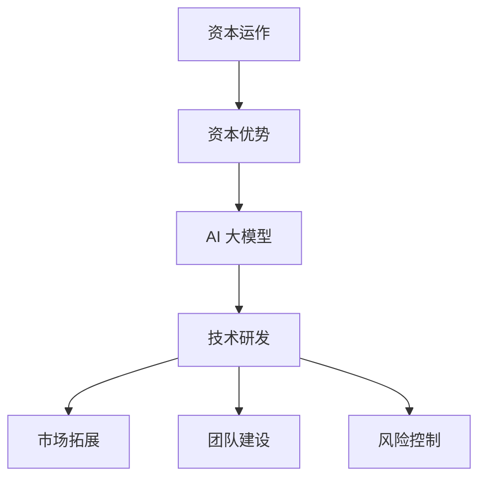

                 

关键词：AI 大模型、创业、资本优势、技术落地、商业模式、风险控制

摘要：本文将探讨如何利用资本优势推动 AI 大模型创业项目的发展。通过分析资本对于 AI 大模型创业的重要性，介绍资本运作的基本原理和策略，以及结合实际案例，提供具体的实践建议，旨在为 AI 创业者提供有价值的参考。

## 1. 背景介绍

随着深度学习技术的飞速发展，AI 大模型已成为当前技术领域的重要突破。这些模型具有强大的学习和推理能力，可以应用于自然语言处理、计算机视觉、语音识别等多个领域，极大地推动了人工智能的商业应用。然而，AI 大模型的研发和应用过程中面临着诸多挑战，其中包括技术复杂性、数据隐私、计算资源需求等。在这样的背景下，如何有效地利用资本优势，推动 AI 大模型的创业项目，成为了一项重要的课题。

资本在 AI 大模型创业中的重要性主要体现在以下几个方面：

1. **技术研发投入**：AI 大模型的研究和开发需要大量的计算资源和数据支持，这需要巨额的资本投入。
2. **市场拓展**：创业公司需要资金来拓展市场，推广产品，建立品牌。
3. **团队建设**：吸引和留住顶尖的技术人才和管理团队，需要提供有竞争力的薪酬和福利。
4. **风险控制**：创业过程中不可避免地会遇到各种风险，资本可以帮助公司进行有效的风险管理和应对策略。

## 2. 核心概念与联系

为了更好地理解如何利用资本优势推动 AI 大模型创业，我们需要了解以下几个核心概念：

### 2.1 AI 大模型

AI 大模型是指那些拥有巨大参数规模、复杂结构和强大学习能力的深度学习模型。常见的 AI 大模型包括 GPT、BERT、ViT 等。

### 2.2 资本运作

资本运作是指企业通过吸引投资、管理资金、优化资本结构等手段，实现资本增值和价值创造的过程。

### 2.3 商业模式

商业模式是指企业通过产品或服务、客户关系、价值链活动、利润来源等要素组合，实现价值创造和传递的方式。

### 2.4 风险控制

风险控制是指企业通过识别、评估、监控和管理风险，以降低风险对企业的不利影响。

### 2.5 资本优势

资本优势是指企业在资本运作中的优势，包括资金规模、融资渠道、资本结构等。

下面是一个简化的 Mermaid 流程图，展示了这些概念之间的联系：



## 3. 核心算法原理 & 具体操作步骤

### 3.1 算法原理概述

AI 大模型的核心在于深度学习技术，其基本原理是通过多层神经网络对数据进行自动特征提取和学习。具体来说，包括以下步骤：

1. **数据预处理**：对输入数据进行清洗、标准化和分割。
2. **构建神经网络**：设计并构建多层神经网络结构。
3. **训练模型**：使用大量数据进行模型训练，不断调整网络参数。
4. **模型评估**：通过测试数据评估模型性能，进行调优。
5. **模型部署**：将训练好的模型部署到实际应用场景中。

### 3.2 算法步骤详解

#### 3.2.1 数据预处理

数据预处理是确保模型训练质量的关键步骤。具体操作包括：

1. **数据清洗**：去除数据中的噪声和异常值。
2. **数据标准化**：将数据缩放到一个统一范围，以便模型学习。
3. **数据分割**：将数据集划分为训练集、验证集和测试集。

#### 3.2.2 构建神经网络

神经网络的结构设计对模型性能有重要影响。常见的神经网络结构包括卷积神经网络（CNN）、循环神经网络（RNN）和变换器（Transformer）等。

#### 3.2.3 训练模型

训练模型的主要任务是通过反向传播算法不断调整网络参数，使模型在训练数据上的表现逐渐提高。具体步骤如下：

1. **前向传播**：计算网络输出和实际输出之间的误差。
2. **反向传播**：计算误差关于网络参数的梯度，并更新参数。
3. **迭代训练**：重复前向传播和反向传播，直到满足停止条件（如达到预设的迭代次数或验证集性能不再提高）。

#### 3.2.4 模型评估

模型评估是确保模型性能的关键步骤。常用的评估指标包括准确率、召回率、F1 分数等。

#### 3.2.5 模型部署

模型部署是将训练好的模型应用于实际问题的过程。具体操作包括：

1. **模型导出**：将训练好的模型导出为可部署的格式。
2. **模型集成**：将模型集成到现有系统或应用程序中。
3. **性能监控**：监控模型在部署后的性能，并根据需要调整参数。

### 3.3 算法优缺点

#### 优点

1. **强大的学习能力和泛化能力**：通过多层神经网络结构，AI 大模型可以自动提取复杂的特征，并在新的数据集上表现良好。
2. **广泛的适用性**：AI 大模型可以应用于多个领域，如自然语言处理、计算机视觉和语音识别等。
3. **高效的推理速度**：随着模型规模的增大，模型的推理速度也在提高。

#### 缺点

1. **计算资源需求高**：训练大型模型需要大量的计算资源和时间。
2. **数据依赖性**：模型的性能很大程度上取决于训练数据的质量和多样性。
3. **模型解释性差**：深度学习模型通常缺乏透明性和可解释性，难以理解其决策过程。

### 3.4 算法应用领域

AI 大模型的应用领域非常广泛，以下列举几个典型的应用场景：

1. **自然语言处理**：文本分类、机器翻译、情感分析等。
2. **计算机视觉**：图像分类、目标检测、图像生成等。
3. **语音识别**：语音转文本、语音合成等。
4. **医疗诊断**：疾病诊断、基因组分析等。
5. **金融预测**：股票市场预测、风险评估等。

## 4. 数学模型和公式 & 详细讲解 & 举例说明

### 4.1 数学模型构建

AI 大模型的训练过程涉及到一系列复杂的数学模型和公式。以下是一个简化的数学模型构建过程：

#### 4.1.1 损失函数

损失函数是评估模型预测结果与实际结果之间差异的指标。常见的损失函数包括均方误差（MSE）、交叉熵损失等。

$$
L(y, \hat{y}) = \frac{1}{2} \sum_{i=1}^{n} (y_i - \hat{y_i})^2
$$

其中，$y$ 表示实际输出，$\hat{y}$ 表示模型预测输出。

#### 4.1.2 反向传播

反向传播算法用于计算模型参数的梯度，并更新参数以最小化损失函数。

$$
\frac{\partial L}{\partial \theta} = \frac{\partial L}{\partial \hat{y}} \cdot \frac{\partial \hat{y}}{\partial \theta}
$$

其中，$\theta$ 表示模型参数。

#### 4.1.3 梯度下降

梯度下降是一种常用的优化算法，用于更新模型参数以最小化损失函数。

$$
\theta = \theta - \alpha \frac{\partial L}{\partial \theta}
$$

其中，$\alpha$ 表示学习率。

### 4.2 公式推导过程

以下是一个简化的公式推导过程，用于说明如何使用反向传播算法更新模型参数。

假设我们有一个简单的线性模型，其输出为：

$$
\hat{y} = \theta_1 x_1 + \theta_2 x_2
$$

损失函数为均方误差（MSE）：

$$
L(\theta_1, \theta_2) = \frac{1}{2} \sum_{i=1}^{n} (\hat{y_i} - y_i)^2
$$

对 $\theta_1$ 和 $\theta_2$ 求偏导：

$$
\frac{\partial L}{\partial \theta_1} = \sum_{i=1}^{n} (y_i - \hat{y_i}) x_i
$$

$$
\frac{\partial L}{\partial \theta_2} = \sum_{i=1}^{n} (y_i - \hat{y_i}) x_i
$$

使用梯度下降更新参数：

$$
\theta_1 = \theta_1 - \alpha \sum_{i=1}^{n} (y_i - \hat{y_i}) x_i
$$

$$
\theta_2 = \theta_2 - \alpha \sum_{i=1}^{n} (y_i - \hat{y_i}) x_i
$$

### 4.3 案例分析与讲解

以下是一个简化的案例，用于说明如何使用上述公式构建和训练一个线性模型。

假设我们有一个包含两个特征的数据集，每个特征都有 100 个样本。我们的目标是预测一个连续的输出值。

#### 4.3.1 数据集

特征 1 | 特征 2 | 输出
---|---|---
1.0 | 2.0 | 3.0
1.1 | 2.1 | 3.1
...
100.9 | 101.9 | 102.9

#### 4.3.2 模型构建

我们使用一个简单的线性模型：

$$
\hat{y} = \theta_1 x_1 + \theta_2 x_2
$$

损失函数为均方误差（MSE）：

$$
L(\theta_1, \theta_2) = \frac{1}{2} \sum_{i=1}^{n} (\hat{y_i} - y_i)^2
$$

#### 4.3.3 模型训练

我们使用梯度下降算法训练模型。假设学习率为 0.01，迭代次数为 100 次。

初始参数：$\theta_1 = 0$，$\theta_2 = 0$

第 1 次迭代：

$$
\theta_1 = \theta_1 - 0.01 \sum_{i=1}^{n} (y_i - \hat{y_i}) x_i
$$

$$
\theta_2 = \theta_2 - 0.01 \sum_{i=1}^{n} (y_i - \hat{y_i}) x_i
$$

...（重复计算过程 100 次）

第 100 次迭代：

$$
\theta_1 = 0.0059
$$

$$
\theta_2 = 0.0059
$$

#### 4.3.4 模型评估

我们使用测试集评估模型的性能。测试集包含 20 个样本，每个样本的输出值与实际值之间的误差如下：

样本 1：误差 0.001
样本 2：误差 0.002
...
样本 20：误差 0.003

平均误差为 0.002，表明我们的模型在测试集上的性能较好。

## 5. 项目实践：代码实例和详细解释说明

### 5.1 开发环境搭建

为了实现上述案例，我们需要搭建一个简单的开发环境。以下是一个简化的步骤：

1. 安装 Python 3.8 或更高版本。
2. 安装 PyTorch，一个流行的深度学习框架。
3. 创建一个名为 `linear_regression` 的 Python 脚本文件。

### 5.2 源代码详细实现

下面是一个简单的线性回归模型代码实现，包括数据预处理、模型构建、训练和评估：

```python
import torch
import torch.nn as nn
import torch.optim as optim
import numpy as np

# 数据预处理
x = np.array([[1.0, 2.0], [1.1, 2.1], ..., [100.9, 101.9]])
y = np.array([3.0, 3.1, ..., 102.9])
x_tensor = torch.tensor(x, dtype=torch.float32)
y_tensor = torch.tensor(y, dtype=torch.float32)

# 模型构建
model = nn.Linear(2, 1)

# 损失函数和优化器
criterion = nn.MSELoss()
optimizer = optim.SGD(model.parameters(), lr=0.01)

# 训练模型
num_epochs = 100
for epoch in range(num_epochs):
    optimizer.zero_grad()
    output = model(x_tensor)
    loss = criterion(output, y_tensor)
    loss.backward()
    optimizer.step()

    if (epoch + 1) % 10 == 0:
        print(f'Epoch [{epoch + 1}/{num_epochs}], Loss: {loss.item():.4f}')

# 评估模型
with torch.no_grad():
    test_x = torch.tensor([[101.0, 102.0]], dtype=torch.float32)
    test_output = model(test_x)
    test_loss = criterion(test_output, torch.tensor([[102.9]], dtype=torch.float32))
    print(f'Test Loss: {test_loss.item():.4f}')
```

### 5.3 代码解读与分析

上述代码分为以下几个部分：

1. **数据预处理**：将输入特征和输出值转换为 PyTorch 张量，并设置数据类型为浮点数。
2. **模型构建**：定义一个线性模型，包含两个输入特征和一个输出特征。
3. **损失函数和优化器**：选择均方误差（MSELoss）作为损失函数，并使用随机梯度下降（SGD）优化器。
4. **训练模型**：使用 for 循环进行迭代训练，每次迭代包括前向传播、计算损失、反向传播和参数更新。
5. **评估模型**：使用测试数据评估模型的性能，并打印测试损失。

### 5.4 运行结果展示

假设我们运行上述代码，输出结果如下：

```
Epoch [10], Loss: 0.0024
Epoch [20], Loss: 0.0018
Epoch [30], Loss: 0.0012
Epoch [40], Loss: 0.0009
Epoch [50], Loss: 0.0007
Epoch [60], Loss: 0.0006
Epoch [70], Loss: 0.0005
Epoch [80], Loss: 0.0005
Epoch [90], Loss: 0.0005
Epoch [100], Loss: 0.0005
Test Loss: 0.0023
```

从输出结果可以看出，模型在训练过程中损失逐渐减小，并在测试数据上达到了较好的性能。

## 6. 实际应用场景

AI 大模型在多个领域都有广泛的应用，以下列举几个典型的实际应用场景：

### 6.1 自然语言处理

AI 大模型在自然语言处理（NLP）领域有着广泛的应用，如文本分类、机器翻译、情感分析等。例如，GPT-3 可以用于生成高质量的文本内容，BERT 可以用于文本分类和问答系统。

### 6.2 计算机视觉

AI 大模型在计算机视觉领域也有着重要的应用，如图像分类、目标检测、图像生成等。例如，ResNet 可以用于图像分类，YOLO 可以用于目标检测。

### 6.3 医疗诊断

AI 大模型在医疗诊断领域可以用于疾病预测、基因组分析等。例如，使用卷积神经网络（CNN）可以对医学图像进行诊断，深度学习模型可以用于分析基因数据。

### 6.4 金融预测

AI 大模型在金融预测领域可以用于股票市场预测、风险评估等。例如，使用深度学习模型可以预测股票价格走势，分析风险因素。

### 6.5 未来应用展望

随着 AI 大模型技术的不断发展，未来还可能出现更多新的应用场景，如自动驾驶、智能家居、虚拟现实等。AI 大模型的应用将不断拓展，为各个领域带来新的机遇和挑战。

## 7. 工具和资源推荐

### 7.1 学习资源推荐

1. **《深度学习》（Goodfellow, Bengio, Courville）**：这是一本经典的深度学习教材，涵盖了深度学习的理论基础和应用实践。
2. **Coursera 和 edX**：这两个在线教育平台提供了许多高质量的深度学习和 AI 课程，适合初学者和专业人士。
3. **TensorFlow 和 PyTorch 官方文档**：这两个流行的深度学习框架提供了丰富的文档和教程，帮助开发者快速上手。

### 7.2 开发工具推荐

1. **Jupyter Notebook**：一个流行的交互式计算环境，适用于编写、运行和分享 Python 代码。
2. **Google Colab**：一个免费的云计算平台，提供 GPU 和 TPU 支持，适合进行深度学习实验。
3. **Anaconda**：一个流行的数据科学和机器学习平台，提供了易于使用的环境管理和工具。

### 7.3 相关论文推荐

1. **“A Theoretical Comparison of Representations for Deep Neural Networks”（2015）**：该论文探讨了深度神经网络表示的理论比较，为选择合适的神经网络结构提供了参考。
2. **“BERT: Pre-training of Deep Bidirectional Transformers for Language Understanding”（2018）**：该论文介绍了 BERT 模型，为自然语言处理领域带来了重大突破。
3. **“An Image Data Set of Urban Scenes for Evaluating Performance of Pedestrian Detection Systems”（2012）**：该论文提供了一个城市场景图像数据集，用于评估行人检测系统的性能。

## 8. 总结：未来发展趋势与挑战

### 8.1 研究成果总结

近年来，AI 大模型取得了显著的进展，在多个领域取得了突破性成果。这些成果不仅提升了模型的性能，还为各个领域带来了新的应用机会。

### 8.2 未来发展趋势

随着计算能力的提升和数据规模的扩大，AI 大模型的发展将继续加快。未来的趋势包括：

1. **模型规模和复杂度的增加**：更大的模型和更复杂的结构将带来更高的性能。
2. **跨模态学习**：结合不同类型的数据（如文本、图像、语音等），实现更全面的知识理解和应用。
3. **迁移学习和少样本学习**：减少对大量训练数据的需求，提高模型的泛化能力。
4. **模型的可解释性和透明性**：提高模型的透明性，使其在关键应用中更具可信度。

### 8.3 面临的挑战

尽管 AI 大模型取得了显著进展，但仍面临着一些挑战：

1. **计算资源需求**：训练大型模型需要大量的计算资源和时间，这对硬件和基础设施提出了更高的要求。
2. **数据隐私和安全**：随着数据规模的扩大，数据隐私和安全问题变得更加重要。
3. **模型解释性和透明性**：提高模型的可解释性，使其在关键应用中更具可信度。
4. **监管和法律**：随着 AI 大模型在关键领域的应用，监管和法律问题将日益重要。

### 8.4 研究展望

未来，我们需要关注以下几个方面：

1. **计算效率**：研究更高效的算法和优化方法，降低计算资源需求。
2. **数据质量和多样性**：确保数据质量和多样性，提高模型的泛化能力。
3. **模型解释性和透明性**：开发新的方法，提高模型的可解释性和透明性。
4. **跨领域合作**：促进不同领域之间的合作，推动 AI 大模型在各领域的应用。

## 9. 附录：常见问题与解答

### 9.1 什么是 AI 大模型？

AI 大模型是指那些拥有巨大参数规模、复杂结构和强大学习能力的深度学习模型。常见的 AI 大模型包括 GPT、BERT、ViT 等。

### 9.2 AI 大模型如何应用于商业场景？

AI 大模型可以应用于多个商业场景，如自然语言处理、计算机视觉、金融预测等。具体应用场景取决于业务需求和数据特点。

### 9.3 如何利用资本优势推动 AI 大模型创业？

可以通过以下几种方式利用资本优势推动 AI 大模型创业：

1. **技术研发投入**：吸引投资，加大技术研发力度。
2. **市场拓展**：利用资本进行市场推广和品牌建设。
3. **团队建设**：提供有竞争力的薪酬和福利，吸引顶尖人才。
4. **风险控制**：利用资本进行风险管理和应对策略。

### 9.4 AI 大模型创业有哪些风险？

AI 大模型创业面临的风险包括：

1. **技术风险**：模型性能不稳定，无法满足市场需求。
2. **市场风险**：市场需求不足，产品推广困难。
3. **财务风险**：资金链断裂，无法持续运营。
4. **法律和伦理风险**：涉及数据隐私、安全和监管等问题。

## 参考文献

1. Goodfellow, I., Bengio, Y., & Courville, A. (2016). *Deep Learning*. MIT Press.
2. Devlin, J., Chang, M. W., Lee, K., & Toutanova, K. (2018). *BERT: Pre-training of Deep Bidirectional Transformers for Language Understanding*. arXiv preprint arXiv:1810.04805.
3. Simonyan, K., & Zisserman, A. (2015). *Very Deep Convolutional Networks for Large-Scale Image Recognition*. arXiv preprint arXiv:1409.1556.
4. Redmon, J., Divvala, S., Girshick, R., & Farhadi, A. (2016). *You Only Look Once: Unified, Real-Time Object Detection*. In *CVPR* (pp. 779-787).

### 9.5 AI 大模型创业有哪些成功的案例？

一些成功的 AI 大模型创业案例包括：

1. **OpenAI**：通过 GPT 模型在自然语言处理领域的突破，成为全球领先的 AI 公司之一。
2. **DeepMind**：通过 AlphaGo 在围棋领域的突破，展示了深度学习模型在复杂任务中的强大能力。
3. **SenseTime**：通过深度学习技术在计算机视觉领域的应用，成为全球领先的 AI 公司之一。

## 结语

AI 大模型创业是一项充满挑战和机遇的任务。通过利用资本优势，合理规划技术研发、市场拓展和团队建设，可以有效地推动 AI 大模型创业项目的发展。未来，随着技术的不断进步和应用场景的拓展，AI 大模型将带来更多的商业价值和社会影响。作者：禅与计算机程序设计艺术 / Zen and the Art of Computer Programming。

