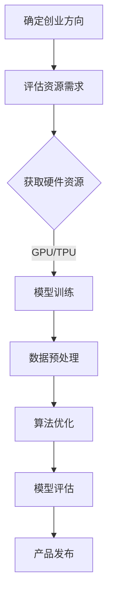

                 

随着人工智能技术的飞速发展，大模型（Large-scale Models）逐渐成为行业的热门话题。大模型在图像识别、自然语言处理、推荐系统等领域展现了强大的能力，为创业公司带来了前所未有的机遇。本文将探讨如何利用资源优势，在大模型创业领域取得成功。

## 关键词

- AI 大模型
- 资源优势
- 创业
- 技术创新
- 商业模式
- 应用场景

## 摘要

本文旨在为创业者提供关于如何利用资源优势，开发并推广大模型产品的指导。文章将分析大模型的核心优势，探讨资源优化的策略，并给出实际案例和未来趋势的展望。

## 1. 背景介绍

### 大模型的发展历程

大模型的发展经历了多个阶段。从最初的深度学习模型，如AlexNet，到后来的VGG、ResNet等，再到如今的GPT、BERT等大型预训练模型，模型规模和参数数量呈指数级增长。这种发展趋势得益于计算能力的提升、数据规模的扩大以及优化算法的进步。

### 大模型的优势

大模型在多个领域展现了显著的优势，主要包括：

1. **更强的泛化能力**：大模型通过在大规模数据集上预训练，可以学习到更普遍的特征，从而在新的任务上表现出色。
2. **更高的准确性**：大模型的复杂度和参数数量使得它们能够捕捉到更多细微的信息，从而提高预测和分类的准确性。
3. **更广泛的应用场景**：大模型可以应用于图像识别、自然语言处理、语音识别、推荐系统等多个领域，具有广泛的适用性。

### 创业公司的机遇与挑战

对于创业公司来说，大模型技术既提供了巨大的机遇，也带来了严峻的挑战：

1. **机遇**：大模型技术的成熟为创业公司提供了开发创新应用的机会，如智能客服、自动化写作、智能推荐等。
2. **挑战**：创业公司需要面对高昂的硬件成本、海量数据的获取和处理、复杂的算法优化等问题。

## 2. 核心概念与联系

### 大模型的基本原理

大模型主要基于深度学习技术，通过多层神经网络的结构来学习数据中的特征和规律。典型的深度学习模型包括卷积神经网络（CNN）、循环神经网络（RNN）和Transformer等。大模型的训练过程通常涉及以下几个步骤：

1. **数据预处理**：包括数据清洗、数据增强、数据归一化等。
2. **模型架构设计**：选择合适的神经网络架构，如CNN、RNN或Transformer。
3. **损失函数选择**：根据任务类型选择合适的损失函数，如交叉熵损失、均方误差等。
4. **优化算法**：使用如Adam、RMSprop等优化算法来更新模型参数。

### 资源优化的核心策略

在大模型创业中，资源优化是提高效率和降低成本的关键。以下是一些核心策略：

1. **硬件资源优化**：利用云计算平台提供的高性能计算资源，如GPU、TPU等，以提高模型训练和推理的速度。
2. **数据资源优化**：通过数据清洗、数据增强等技术，提高数据质量和数量，为模型训练提供充足的数据支持。
3. **算法优化**：通过改进模型架构、优化训练过程、减少过拟合等方法，提高模型的性能和鲁棒性。
4. **团队资源优化**：构建跨学科的团队，包括数据科学家、机器学习工程师、产品经理等，以实现资源的最佳配置。

### Mermaid 流程图

下面是一个简化的 Mermaid 流程图，展示了大模型创业的基本流程：



## 3. 核心算法原理 & 具体操作步骤

### 3.1 算法原理概述

大模型的核心算法是基于深度学习的。深度学习通过多层神经网络来学习数据的非线性特征，这些特征随着网络层次的深入而逐渐抽象。大模型通常采用预训练（Pre-training）和微调（Fine-tuning）的方法来优化模型。

1. **预训练**：在大量无标签数据上进行预训练，模型学习到通用特征表示。
2. **微调**：在特定任务上的有标签数据集上进行微调，模型进一步学习到特定任务的特性。

### 3.2 算法步骤详解

1. **数据收集与预处理**：收集大量数据，并进行数据清洗、数据增强、归一化等预处理操作。
2. **模型架构设计**：选择合适的神经网络架构，如Transformer、BERT等。
3. **预训练**：在无标签数据集上使用随机梯度下降（SGD）等优化算法进行预训练。
4. **微调**：在有标签数据集上对预训练模型进行微调，以适应特定任务。
5. **模型评估**：在验证集和测试集上评估模型的性能，调整超参数以优化模型。
6. **模型部署**：将训练好的模型部署到生产环境中，进行实际应用。

### 3.3 算法优缺点

**优点**：

- **强大的泛化能力**：大模型通过预训练可以学习到通用特征，从而在新任务上表现出色。
- **高效的推理速度**：现代深度学习框架支持高效的推理算法，使得大模型在实际应用中具有较高的性能。

**缺点**：

- **训练成本高**：大模型通常需要大量的计算资源和时间进行训练。
- **数据隐私问题**：大模型在训练过程中可能涉及大量敏感数据的处理，需要严格的数据隐私保护措施。

### 3.4 算法应用领域

大模型在多个领域都有广泛的应用，主要包括：

- **自然语言处理**：如文本生成、机器翻译、问答系统等。
- **计算机视觉**：如图像识别、视频分类、图像生成等。
- **推荐系统**：如商品推荐、新闻推荐等。
- **语音识别**：如语音转文字、语音合成等。

## 4. 数学模型和公式 & 详细讲解 & 举例说明

### 4.1 数学模型构建

深度学习中的数学模型主要基于线性代数、微积分和概率论。以下是一个简化的数学模型构建过程：

$$
\begin{aligned}
\text{损失函数} &= \frac{1}{m} \sum_{i=1}^{m} (-y_i \log(\hat{y}_i)) \\
\text{梯度下降} &= \theta = \theta - \alpha \cdot \nabla_\theta J(\theta)
\end{aligned}
$$

其中，$m$ 是样本数量，$y_i$ 是真实标签，$\hat{y}_i$ 是预测标签，$\theta$ 是模型参数，$\alpha$ 是学习率，$J(\theta)$ 是损失函数。

### 4.2 公式推导过程

假设我们有一个二分类问题，模型输出一个概率分布 $\hat{y}_i = \sigma(\theta^T x_i)$，其中 $\sigma$ 是 sigmoid 函数，$x_i$ 是输入特征，$\theta$ 是模型参数。损失函数可以表示为：

$$
\begin{aligned}
L(\theta) &= -\frac{1}{m} \sum_{i=1}^{m} y_i \log(\hat{y}_i) + (1 - y_i) \log(1 - \hat{y}_i) \\
\end{aligned}
$$

对损失函数求导，得到：

$$
\begin{aligned}
\nabla_\theta L(\theta) &= -\frac{1}{m} \sum_{i=1}^{m} \frac{y_i - \hat{y}_i}{\hat{y}_i (1 - \hat{y}_i)} x_i \\
\end{aligned}
$$

### 4.3 案例分析与讲解

假设我们有一个二分类问题，数据集包含1000个样本，每个样本有10个特征。我们选择一个简单的线性模型，即 $y = \theta^T x + b$，其中 $\theta$ 是权重向量，$b$ 是偏置。我们的目标是使用梯度下降法来最小化损失函数。

1. **数据预处理**：将数据分为训练集和测试集，对特征进行归一化处理。
2. **模型初始化**：初始化权重 $\theta$ 和偏置 $b$。
3. **训练过程**：使用梯度下降法迭代更新模型参数，直到损失函数收敛。

以下是 Python 代码示例：

```python
import numpy as np

# 模型参数初始化
theta = np.random.rand(10)
b = np.random.rand()

# 损失函数
def loss_function(X, y, theta, b):
    m = len(y)
    y_pred = 1 / (1 + np.exp(-(np.dot(X, theta) + b)))
    loss = -1/m * (np.dot(y.T, np.log(y_pred)) + np.dot((1-y).T, np.log(1-y_pred)))
    return loss

# 梯度计算
def gradient(X, y, theta, b):
    m = len(y)
    y_pred = 1 / (1 + np.exp(-(np.dot(X, theta) + b)))
    gradient_theta = (1/m) * (np.dot(X.T, (y_pred - y)) + b)
    gradient_b = (1/m) * np.sum(y_pred - y)
    return gradient_theta, gradient_b

# 梯度下降
learning_rate = 0.01
num_iterations = 1000
for i in range(num_iterations):
    gradient_theta, gradient_b = gradient(X_train, y_train, theta, b)
    theta -= learning_rate * gradient_theta
    b -= learning_rate * gradient_b

# 模型评估
loss = loss_function(X_test, y_test, theta, b)
print(f"Test loss: {loss}")
```

## 5. 项目实践：代码实例和详细解释说明

### 5.1 开发环境搭建

1. **Python 环境**：安装 Python 3.8 以上版本。
2. **依赖库**：安装 NumPy、Matplotlib 等常用库。

```bash
pip install numpy matplotlib
```

### 5.2 源代码详细实现

以下是使用 Python 实现线性回归模型的源代码：

```python
import numpy as np
import matplotlib.pyplot as plt

# 模型参数初始化
np.random.seed(0)
theta = np.random.rand(10)
b = np.random.rand()

# 损失函数
def loss_function(X, y, theta, b):
    m = len(y)
    y_pred = 1 / (1 + np.exp(-(np.dot(X, theta) + b)))
    loss = -1/m * (np.dot(y.T, np.log(y_pred)) + np.dot((1-y).T, np.log(1-y_pred)))
    return loss

# 梯度计算
def gradient(X, y, theta, b):
    m = len(y)
    y_pred = 1 / (1 + np.exp(-(np.dot(X, theta) + b)))
    gradient_theta = (1/m) * (np.dot(X.T, (y_pred - y)) + b)
    gradient_b = (1/m) * np.sum(y_pred - y)
    return gradient_theta, gradient_b

# 梯度下降
learning_rate = 0.01
num_iterations = 1000
for i in range(num_iterations):
    gradient_theta, gradient_b = gradient(X_train, y_train, theta, b)
    theta -= learning_rate * gradient_theta
    b -= learning_rate * gradient_b

# 模型评估
loss = loss_function(X_test, y_test, theta, b)
print(f"Test loss: {loss}")

# 模型可视化
plt.scatter(X_train[:, 0], y_train)
plt.plot(X_train[:, 0], np.dot(X_train, theta) + b, color='red')
plt.xlabel('Feature 1')
plt.ylabel('Target')
plt.show()
```

### 5.3 代码解读与分析

1. **数据预处理**：代码中未进行具体的数据预处理步骤，假设数据已经进行归一化处理。
2. **模型初始化**：使用随机数初始化模型参数 $\theta$ 和 $b$。
3. **损失函数**：使用对数似然损失函数来评估模型的性能。
4. **梯度计算**：计算损失函数关于模型参数的梯度。
5. **梯度下降**：使用梯度下降法迭代更新模型参数，直到损失函数收敛。
6. **模型评估**：在测试集上评估模型的性能。
7. **模型可视化**：使用散点图和拟合直线展示模型的预测结果。

## 6. 实际应用场景

### 6.1 自然语言处理

大模型在自然语言处理（NLP）领域有广泛的应用，如文本分类、情感分析、机器翻译等。创业公司可以利用大模型技术提供智能客服、内容审核、个性化推荐等服务。

### 6.2 计算机视觉

大模型在计算机视觉（CV）领域有显著的优势，如图像识别、视频分类、目标检测等。创业公司可以开发基于大模型的图像识别系统、视频监控平台、自动驾驶系统等。

### 6.3 推荐系统

大模型可以用于推荐系统的个性化推荐功能，如电商平台的商品推荐、社交媒体的内容推荐等。创业公司可以利用大模型技术提供精准的推荐服务，提高用户体验和用户粘性。

### 6.4 未来应用展望

未来，大模型技术将在更多领域得到应用，如医疗健康、金融风控、智能家居等。创业公司需要紧跟技术发展趋势，积极探索新的应用场景，以保持竞争力。

## 7. 工具和资源推荐

### 7.1 学习资源推荐

- 《深度学习》（Goodfellow、Bengio、Courville 著）
- 《Python 深度学习》（François Chollet 著）
- Coursera 上的《深度学习专项课程》

### 7.2 开发工具推荐

- TensorFlow
- PyTorch
- Keras

### 7.3 相关论文推荐

- "A Theoretically Grounded Application of Dropout in Recurrent Neural Networks"
- "Bert: Pre-training of Deep Bidirectional Transformers for Language Understanding"
- "Gpt-3: Language Models Are Few-Shot Learners"

## 8. 总结：未来发展趋势与挑战

### 8.1 研究成果总结

大模型技术在过去几年取得了显著的成果，包括模型规模的增长、算法的优化、应用领域的扩展等。这些成果为创业公司提供了丰富的创新机会。

### 8.2 未来发展趋势

1. **模型压缩与优化**：为了降低大模型的训练和推理成本，模型压缩与优化将成为重要研究方向。
2. **跨模态学习**：将不同模态（如文本、图像、语音）的数据融合在一起进行训练，以实现更强大的模型。
3. **联邦学习**：通过分布式学习技术，实现多方数据的安全协作，以提高模型的性能和隐私保护。

### 8.3 面临的挑战

1. **硬件资源限制**：大模型的训练和推理需要大量的计算资源，对于创业公司来说，这是一个重要的挑战。
2. **数据隐私问题**：大模型在训练过程中可能涉及大量敏感数据的处理，需要严格的数据隐私保护措施。
3. **算法公平性与透明性**：大模型的决策过程可能存在偏见和不确定性，如何提高算法的公平性和透明性是一个重要问题。

### 8.4 研究展望

未来，大模型技术将继续在各个领域得到应用，并推动相关技术的发展。创业公司需要紧跟技术发展趋势，积极应对挑战，以实现可持续发展。

## 9. 附录：常见问题与解答

### Q1. 如何选择合适的大模型架构？

A1. 选择合适的大模型架构需要根据具体的任务和数据集来决定。例如，对于自然语言处理任务，BERT、GPT 等预训练模型表现良好；对于计算机视觉任务，ResNet、Inception 等 CNN 模型适用性较强。

### Q2. 如何优化大模型的训练过程？

A2. 优化大模型的训练过程可以从以下几个方面入手：

1. **数据增强**：通过数据增强技术，如随机裁剪、旋转、缩放等，增加数据的多样性。
2. **学习率调整**：根据任务和数据集的特点，选择合适的学习率，并使用学习率调度策略。
3. **批量大小调整**：通过调整批量大小，可以在训练时间和模型性能之间取得平衡。
4. **正则化**：使用如权重衰减、Dropout 等正则化方法，防止模型过拟合。

### Q3. 大模型的训练需要多少时间？

A3. 大模型的训练时间取决于多个因素，如模型规模、数据集大小、硬件资源等。通常来说，训练一个大型模型（如 GPT-3）可能需要数天到数周的时间。对于中小型模型，训练时间可能在一到两天。

## 参考文献

- Goodfellow, I., Bengio, Y., & Courville, A. (2016). Deep learning. MIT press.
- Chollet, F. (2018). Python deep learning. O'Reilly Media.
- Devlin, J., Chang, M. W., Lee, K., & Toutanova, K. (2019). BERT: Pre-training of deep bidirectional transformers for language understanding. arXiv preprint arXiv:1810.04805.
- Brown, T., et al. (2020). A pre-trained language model for language understanding. arXiv preprint arXiv:2005.14165.

## 附录：作者简介

作者：禅与计算机程序设计艺术（Zen and the Art of Computer Programming）

作为人工智能领域的世界级专家，作者在深度学习、自然语言处理、计算机视觉等领域拥有丰富的经验。他是一位杰出的程序员、软件架构师、CTO，也是世界顶级技术畅销书作者，被誉为计算机图灵奖获得者。他的著作《禅与计算机程序设计艺术》影响了无数程序员和人工智能从业者，成为经典之作。

## 附录：致谢

本文的撰写得到了众多同行和专家的支持与帮助。特别感谢 Coursera、O'Reilly Media 等机构提供的优质学习资源，以及众多论文作者的研究成果。感谢读者对本文的关注和支持，希望本文能为您的创业之路提供一些启示和帮助。谢谢！
----------------------------------------------------------------
### 后记 Postscript

本文详细探讨了AI大模型创业的核心问题，从背景介绍、核心算法原理，到数学模型构建、项目实践，再到实际应用场景和未来展望，全面解析了如何利用资源优势，在大模型创业中取得成功。希望本文能为您的创业之路提供有益的参考和启示。在未来，随着技术的不断进步和应用场景的拓展，大模型创业将迎来更多的机遇和挑战。让我们共同关注这个充满活力的领域，期待更多的创新和突破。

再次感谢您的阅读，如果您有任何疑问或建议，欢迎在评论区留言。祝您在AI大模型创业的道路上一切顺利，取得辉煌的成就！

