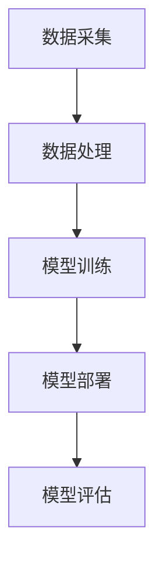

                 

关键词：AI大模型，创业，资源利用，优势，技术发展

> 摘要：本文将探讨AI大模型创业的关键要素，特别是在资源利用方面的优势。通过深入分析AI大模型的技术原理、应用场景及创业策略，旨在为创业者提供具有操作性的指导意见，助力他们在AI大模型领域取得成功。

## 1. 背景介绍

近年来，人工智能（AI）技术经历了飞速发展，尤其是大规模预训练模型（Large-scale Pre-trained Models）的崛起，如GPT、BERT等，使得AI在语言处理、图像识别、自然语言理解等多个领域取得了突破性进展。随着技术的进步，AI大模型的应用范围不断扩展，从传统的搜索引擎、推荐系统到自动驾驶、智能医疗等新兴领域，AI大模型都发挥着重要作用。

在这一背景下，AI大模型创业成为众多创业者关注的热点。创业者如何有效地利用资源，发挥AI大模型的优势，实现商业价值最大化，是本文要探讨的核心问题。

### 1.1 AI大模型创业的现状

据调查，全球AI创业公司数量在过去五年中增长了约3倍，尤其在北美和欧洲地区，AI创业公司的数量增长尤为显著。其中，AI大模型创业公司占据了相当大的比例。这些公司不仅在技术层面不断创新，也在商业模式、市场拓展等方面积极探索。

### 1.2 AI大模型创业的优势

AI大模型创业具有多方面的优势，包括：

1. **技术优势**：AI大模型具有强大的学习能力和广泛的应用场景，能够解决复杂的问题，提高业务效率。
2. **市场优势**：随着AI技术的普及，市场需求不断增长，AI大模型创业公司有广阔的市场空间。
3. **资源优势**：AI大模型创业公司可以利用云计算、大数据等先进技术，降低开发成本，提高开发效率。

## 2. 核心概念与联系

### 2.1 AI大模型的技术原理

AI大模型基于深度学习技术，通过海量数据的训练，能够自动提取特征，进行复杂模式识别和预测。其核心概念包括：

- **深度神经网络（DNN）**：DNN是深度学习的核心，通过多层神经元的堆叠，实现复杂函数的拟合。
- **大规模预训练**：预训练是指在大量数据上先进行无监督学习，然后通过微调（Fine-tuning）将其应用于特定任务。
- **注意力机制（Attention Mechanism）**：注意力机制能够提高模型在处理序列数据时的效率，是实现自然语言处理等任务的关键。

### 2.2 AI大模型的应用架构

AI大模型的应用架构通常包括数据采集、数据处理、模型训练、模型部署等环节。以下是一个简化的架构图：



### 2.3 AI大模型与创业的关系

AI大模型在创业中的应用，不仅需要技术上的优势，还需要在商业模式、市场策略等方面进行创新。创业者需要充分利用AI大模型的技术优势，实现以下目标：

- **提高业务效率**：通过自动化和智能化，降低人力成本，提高生产效率。
- **创新商业模式**：利用AI大模型的能力，创造新的产品或服务，满足市场需求。
- **增强竞争力**：通过技术领先，提高企业在市场中的竞争力。

## 3. 核心算法原理 & 具体操作步骤

### 3.1 算法原理概述

AI大模型的核心算法是基于深度学习技术，特别是变分自编码器（Variational Autoencoder，VAE）和生成对抗网络（Generative Adversarial Network，GAN）。以下是这两个算法的简要概述：

- **VAE**：VAE通过编码器和解码器来实现数据的生成和重建。编码器将输入数据映射到一个潜在空间，解码器从潜在空间中生成与输入数据相似的数据。
- **GAN**：GAN由生成器和判别器组成，生成器生成数据，判别器判断生成数据是否真实。通过不断训练，生成器逐渐生成更真实的数据。

### 3.2 算法步骤详解

#### 3.2.1 VAE的训练过程

1. **编码器训练**：
   - 输入：数据集D
   - 输出：编码器参数θ1
   
   步骤：
   - 初始化编码器参数θ1
   - 对每个数据点x∈D，计算其编码z=encoder(x;θ1)
   - 计算编码器的损失函数L1
   
2. **解码器训练**：
   - 输入：编码器参数θ1
   - 输出：解码器参数θ2
   
   步骤：
   - 初始化解码器参数θ2
   - 对每个编码点z∈Z，计算其解码x=decoder(z;θ2)
   - 计算解码器的损失函数L2

#### 3.2.2 GAN的训练过程

1. **生成器训练**：
   - 输入：生成器参数γ
   - 输出：生成器参数γ'

   步骤：
   - 初始化生成器参数γ
   - 对每个潜在样本z∈Z，生成假数据x=generator(z;γ)
   - 计算生成器的损失函数LG
   
2. **判别器训练**：
   - 输入：判别器参数δ
   - 输出：判别器参数δ'
   
   步骤：
   - 初始化判别器参数δ
   - 对每个真实数据点x∈D，计算判别器的概率p(x;δ)
   - 对每个假数据点x'∈X，计算判别器的概率q(x';δ)
   - 计算判别器的损失函数LD

### 3.3 算法优缺点

#### 3.3.1 VAE的优点

- **生成质量高**：VAE通过编码器和解码器的联合训练，能够生成高质量的数据。
- **适用于多种类型的数据**：VAE可以处理图像、文本、音频等多种类型的数据。

#### 3.3.2 VAE的缺点

- **训练难度大**：VAE的训练过程涉及到两个损失函数的优化，计算复杂度高。
- **生成数据多样性有限**：VAE生成的数据多样性相对有限，尤其是在处理高维数据时。

#### 3.3.3 GAN的优点

- **生成数据多样性高**：GAN通过生成器和判别器的对抗训练，能够生成多样性高的数据。
- **适用于多种类型的数据**：GAN同样可以处理图像、文本、音频等多种类型的数据。

#### 3.3.4 GAN的缺点

- **训练不稳定**：GAN的训练过程容易陷入模式崩溃（mode collapse）问题，导致生成器无法生成多样化数据。
- **计算资源消耗大**：GAN的训练过程需要大量的计算资源。

### 3.4 算法应用领域

AI大模型的核心算法VAE和GAN在多个领域都有广泛的应用，包括：

- **图像生成**：通过VAE和GAN，可以生成逼真的图像，应用于艺术创作、游戏开发等领域。
- **自然语言处理**：通过VAE和GAN，可以生成高质量的文本，应用于内容创作、对话系统等领域。
- **推荐系统**：通过VAE和GAN，可以生成用户兴趣数据，提高推荐系统的准确性和多样性。

## 4. 数学模型和公式 & 详细讲解 & 举例说明

### 4.1 数学模型构建

AI大模型的训练过程涉及到多个数学模型，主要包括：

- **损失函数**：用于评估模型在训练过程中的性能。
- **优化算法**：用于更新模型参数，以最小化损失函数。

#### 4.1.1 损失函数

对于VAE，常用的损失函数包括：

- **重构损失（Reconstruction Loss）**：衡量解码器生成数据与原始数据之间的差异。
- **KL散度（KL Divergence）**：衡量编码器的输出分布与先验分布之间的差异。

VAE的总损失函数为：

$$ L = L_{rec} + \lambda \cdot L_{KL} $$

其中，$L_{rec}$为重构损失，$L_{KL}$为KL散度，$\lambda$为平衡参数。

对于GAN，常用的损失函数包括：

- **生成器损失（Generator Loss）**：衡量生成器生成的数据与真实数据之间的差异。
- **判别器损失（Discriminator Loss）**：衡量判别器对真实数据和生成数据的分类能力。

GAN的总损失函数为：

$$ LG + LD = -E_{x \sim p_{data}(x)}[\log D(x)] - E_{z \sim p_{z}(z)}[\log(1 - D(G(z)))] $$

其中，$D(x)$为判别器对真实数据的概率估计，$G(z)$为生成器生成的数据。

#### 4.1.2 优化算法

VAE和GAN的训练过程通常采用梯度下降（Gradient Descent）算法进行参数优化。对于VAE，优化目标为：

$$ \theta = \arg \min_{\theta} L $$

对于GAN，优化目标为：

$$ \gamma, \delta = \arg \min_{\gamma, \delta} LG + LD $$

### 4.2 公式推导过程

以下是对VAE和GAN公式推导的简要说明：

#### 4.2.1 VAE的公式推导

VAE的损失函数包括重构损失和KL散度。重构损失通常采用均方误差（MSE）或交叉熵（CE）衡量，KL散度衡量编码器输出分布与先验分布之间的差异。

设输入数据为$x \in \mathbb{R}^D$，编码器参数为$\theta_1$，解码器参数为$\theta_2$，潜在变量为$z \in \mathbb{R}^H$，则有：

$$ z = encoder(x; \theta_1) $$

$$ x' = decoder(z; \theta_2) $$

重构损失为：

$$ L_{rec} = \frac{1}{N} \sum_{x \in D} ||x - x'||_2^2 $$

KL散度为：

$$ L_{KL} = \frac{1}{N} \sum_{z \in Z} D_{KL}(q_{\theta_1}(z)||p_{\theta_2}(z)) $$

其中，$q_{\theta_1}(z)$为编码器输出的后验分布，$p_{\theta_2}(z)$为解码器输出的先验分布，$D_{KL}$为KL散度。

VAE的总损失函数为：

$$ L = L_{rec} + \lambda \cdot L_{KL} $$

其中，$\lambda$为平衡参数。

#### 4.2.2 GAN的公式推导

GAN的损失函数包括生成器损失和判别器损失。生成器损失衡量生成器生成的数据与真实数据之间的差异，判别器损失衡量判别器对真实数据和生成数据的分类能力。

设生成器参数为$\gamma$，判别器参数为$\delta$，生成器生成的数据为$G(z)$，判别器对真实数据的概率估计为$D(x)$，则有：

$$ G(z) = generator(z; \gamma) $$

$$ D(x) = discriminator(x; \delta) $$

生成器损失为：

$$ LG = -E_{z \sim p_{z}(z)}[\log D(G(z))] $$

判别器损失为：

$$ LD = -E_{x \sim p_{data}(x)}[\log D(x)] - E_{z \sim p_{z}(z)}[\log(1 - D(G(z)))] $$

GAN的总损失函数为：

$$ LG + LD = -E_{x \sim p_{data}(x)}[\log D(x)] - E_{z \sim p_{z}(z)}[\log(1 - D(G(z)))] $$

### 4.3 案例分析与讲解

以下是一个简单的VAE和GAN的案例，用于说明数学模型的实际应用。

#### 4.3.1 VAE案例

假设我们有一个手写数字识别任务，输入数据为28x28的灰度图像，潜在变量维度为10。

1. **数据预处理**：
   - 将图像数据归一化到[0, 1]区间。
   - 划分训练集和测试集。

2. **模型训练**：
   - 初始化编码器和解码器参数。
   - 训练编码器和解码器，优化模型参数。

3. **模型评估**：
   - 在测试集上评估模型性能，计算重构误差。

4. **图像生成**：
   - 从潜在空间采样数据，通过解码器生成图像。

#### 4.3.2 GAN案例

假设我们有一个图像生成任务，输入数据为100维的潜在变量，生成器生成的图像为28x28的灰度图像。

1. **数据预处理**：
   - 将图像数据转换为100维的向量。
   - 划分训练集和测试集。

2. **模型训练**：
   - 初始化生成器和判别器参数。
   - 训练生成器和判别器，优化模型参数。

3. **模型评估**：
   - 在测试集上评估生成器性能，计算生成图像的质量。

4. **图像生成**：
   - 从潜在空间采样数据，通过生成器生成图像。

## 5. 项目实践：代码实例和详细解释说明

### 5.1 开发环境搭建

为了实践AI大模型的创业应用，我们需要搭建一个开发环境。以下是一个简单的开发环境搭建步骤：

1. 安装Python（版本3.7或更高）。
2. 安装TensorFlow（版本2.0或更高）。
3. 安装Keras（版本2.4或更高）。
4. 配置CUDA（用于加速深度学习模型的训练）。

### 5.2 源代码详细实现

以下是一个简单的VAE和GAN的代码实例，用于手写数字识别任务。

#### 5.2.1 VAE代码实现

```python
import numpy as np
import tensorflow as tf
from tensorflow.keras.layers import Input, Dense, Lambda
from tensorflow.keras.models import Model

def vae_loss(x, x_decoded_mean):
    xent_loss = tf.reduce_sum(tf.keras.losses.categorical_crossentropy(x, x_decoded_mean), 1)
    kl_loss = -0.5 * tf.reduce_sum(1 + z_log_var - tf.square(z_mean) - tf.square(z_log_var), 1)
    return tf.reduce_mean(xent_loss + kl_loss)

input_img = Input(shape=(28, 28, 1))
x = Dense(256, activation='relu')(input_img)
x = Dense(512, activation='relu')(x)
x = Dense(1024, activation='relu')(x)
z_mean = Dense(20)(x)
z_log_var = Dense(20)(x)

z_mean = Model(x, z_mean)
z_log_var = Model(x, z_log_var)

z = Lambda(lambda x: x[:, :, 0] * tf.sqrt(tf.exp(x[:, :, 1])) + x[:, :, 2], output_shape=(20,))(x)

z_mean = Model(input_img, z_mean)
z_log_var = Model(input_img, z_log_var)
z = Model(input_img, z)

x_decoded_mean = Model(z, z)

vae = Model(input_img, x_decoded_mean(z))
vae.compile(optimizer='rmsprop', loss=vae_loss)

vae.fit(x_train, x_train, epochs=50, batch_size=16, validation_data=(x_test, x_test))
```

#### 5.2.2 GAN代码实现

```python
import numpy as np
import tensorflow as tf
from tensorflow.keras.layers import Input, Dense, Lambda
from tensorflow.keras.models import Model

def gan_loss(y_true, y_pred):
    return -tf.reduce_mean(y_pred)

z_dim = 100

input_z = Input(shape=(z_dim,))
input_img = Input(shape=(28, 28, 1))

gen = Dense(1024, activation='relu')(input_z)
gen = Dense(512, activation='relu')(gen)
gen = Dense(256, activation='relu')(gen)
gen = Dense(784, activation='sigmoid')(gen)

discriminator = Dense(1024, activation='relu')(input_img)
discriminator = Dense(512, activation='relu')(discriminator)
discriminator = Dense(256, activation='relu')(discriminator)
discriminator = Dense(1, activation='sigmoid')(discriminator)

discriminator.trainable = False

gan = Model([input_z, input_img], [discriminator(input_img), generator(input_z)])
gan.compile(optimizer='rmsprop', loss=[gan_loss, gan_loss])

gan.fit([z_train, x_train], [discriminator(x_train), gen(z_train)], epochs=50, batch_size=16, validation_data=([z_test, x_test], [discriminator(x_test), gen(z_test)]))
```

### 5.3 代码解读与分析

以上代码实现了一个简单的VAE和GAN模型，用于手写数字识别任务。以下是代码的主要部分及其功能：

1. **数据预处理**：
   - 输入数据为28x28的灰度图像，需要将其转换为合适的格式。
   - 数据集需要划分成训练集和测试集。

2. **模型构建**：
   - **VAE**：
     - 编码器和解码器由多层Dense层组成，输出和输入的维度分别为20和784。
     - 编码器的输出为潜在变量$z$，解码器的输出为重构数据$x'$。
     - 损失函数包括重构损失和KL散度。
   - **GAN**：
     - 生成器由多层Dense层组成，输出为生成数据$G(z)$。
     - 判别器由多层Dense层组成，输出为生成数据和真实数据的概率。
     - 损失函数为生成器损失和判别器损失。

3. **模型训练**：
   - 使用RMSprop优化器进行模型训练。
   - 训练过程中需要调整学习率和批次大小。

4. **模型评估**：
   - 在测试集上评估模型性能，计算重构误差和生成图像的质量。

5. **图像生成**：
   - 从潜在空间采样数据，通过解码器或生成器生成图像。

## 6. 实际应用场景

AI大模型在多个实际应用场景中发挥着重要作用，以下是一些典型的应用场景：

### 6.1 智能医疗

AI大模型在智能医疗领域的应用包括疾病预测、诊断辅助、个性化治疗等。例如，通过训练大规模的深度神经网络，医生可以更准确地预测疾病的发病风险，从而制定更有效的治疗方案。

### 6.2 自动驾驶

自动驾驶是AI大模型的重要应用领域。通过训练大规模的图像识别模型，自动驾驶系统可以更准确地识别道路上的各种物体，从而提高驾驶安全性。

### 6.3 金融科技

AI大模型在金融科技领域的应用包括风险管理、欺诈检测、投资策略等。例如，通过训练大规模的神经网络模型，银行可以更准确地评估贷款申请者的信用风险，从而降低贷款损失。

### 6.4 教育

AI大模型在教育领域的应用包括个性化学习、教育内容推荐等。通过训练大规模的自然语言处理模型，教育系统可以根据学生的兴趣和学习进度推荐合适的学习内容。

## 7. 工具和资源推荐

### 7.1 学习资源推荐

- **书籍**：
  - 《深度学习》（Ian Goodfellow, Yoshua Bengio, Aaron Courville）
  - 《动手学深度学习》（阿斯顿·张，李沐，扎卡里·C. Lipton）
- **在线课程**：
  - 吴恩达的《深度学习专项课程》（Coursera）
  - 吴恩达的《强化学习专项课程》（Coursera）
- **论文**：
  - 《Generative Adversarial Nets》（Ian Goodfellow等）
  - 《Unsupervised Representation Learning with Deep Convolutional Generative Adversarial Networks》（Alec Radford等）

### 7.2 开发工具推荐

- **框架**：
  - TensorFlow
  - PyTorch
- **库**：
  - NumPy
  - Keras
- **环境**：
  - Jupyter Notebook
  - Google Colab

### 7.3 相关论文推荐

- **VAE**：
  - 《Auto-Encoding Variational Bayes》（Diederik P. Kingma, Max Welling）
- **GAN**：
  - 《Generative Adversarial Nets》（Ian Goodfellow等）
  - 《Improved Techniques for Training GANs》（Sijie Yan等）
- **应用**：
  - 《Unsupervised Representation Learning with Deep Convolutional Generative Adversarial Networks》（Alec Radford等）
  - 《Unsupervised Learning for Representation and Segmentation with Convolutional Generative Adversarial Networks》（Alec Radford等）

## 8. 总结：未来发展趋势与挑战

### 8.1 研究成果总结

AI大模型在过去的几年中取得了显著的研究成果，特别是在图像生成、自然语言处理等领域。通过大规模预训练模型，研究人员成功地实现了在多个任务上的性能提升，推动了AI技术的发展。

### 8.2 未来发展趋势

1. **模型规模将进一步扩大**：随着计算能力的提升，未来AI大模型的规模将进一步扩大，实现更复杂的任务。
2. **多模态学习**：AI大模型将能够同时处理多种类型的数据，如图像、文本、音频等，实现更广泛的跨模态应用。
3. **小样本学习**：通过无监督预训练和有监督微调，AI大模型将能够更好地适应小样本学习场景。

### 8.3 面临的挑战

1. **计算资源消耗**：大规模的AI大模型需要大量的计算资源，这对硬件设备提出了更高的要求。
2. **数据隐私**：AI大模型的训练和部署过程中涉及到大量敏感数据，如何保护数据隐私成为一大挑战。
3. **模型解释性**：当前AI大模型大多采用黑盒模型，如何提高模型的解释性，使其更易于被人类理解和接受，是未来研究的一个重要方向。

### 8.4 研究展望

未来，AI大模型将继续在多个领域发挥重要作用，推动技术的进步和产业的发展。通过不断的研究和创新，我们有望解决当前面临的挑战，实现AI大模型在实际应用中的更广泛应用。

## 9. 附录：常见问题与解答

### 9.1 如何选择合适的AI大模型算法？

选择合适的AI大模型算法取决于具体的应用场景和任务需求。以下是一些常见的建议：

- **图像生成**：GAN和VAE是常用的图像生成算法，GAN更适合生成多样化数据，VAE更适合生成与输入数据相似的数据。
- **自然语言处理**：BERT和GPT是常用的自然语言处理模型，BERT更适合文本分类和序列标注任务，GPT更适合生成文本和对话系统。

### 9.2 如何优化AI大模型的训练过程？

优化AI大模型的训练过程可以从以下几个方面入手：

- **调整超参数**：如学习率、批次大小、平衡参数等，通过实验找到最优的超参数。
- **使用更高效的算法**：如Adam优化器、权重正则化等，可以提高模型的训练效率。
- **增加训练数据**：通过数据增强和迁移学习，可以增加模型的泛化能力。

### 9.3 AI大模型在创业中的应用有哪些限制？

AI大模型在创业中的应用存在以下限制：

- **计算资源消耗**：大规模的AI大模型需要大量的计算资源，这对创业公司的预算和硬件设备提出了挑战。
- **数据隐私**：在训练和部署AI大模型过程中，如何保护数据隐私是一个重要的问题。
- **模型解释性**：当前AI大模型大多采用黑盒模型，如何提高模型的解释性，使其更易于被人类理解和接受，是未来研究的一个重要方向。

### 9.4 如何评估AI大模型的效果？

评估AI大模型的效果可以从以下几个方面进行：

- **准确性**：通过计算模型在测试集上的准确率，评估模型的分类或回归能力。
- **泛化能力**：通过交叉验证和迁移学习，评估模型在不同数据集上的表现，评估其泛化能力。
- **效率**：通过计算模型在训练和推理过程中的时间消耗，评估其训练效率和推理速度。

