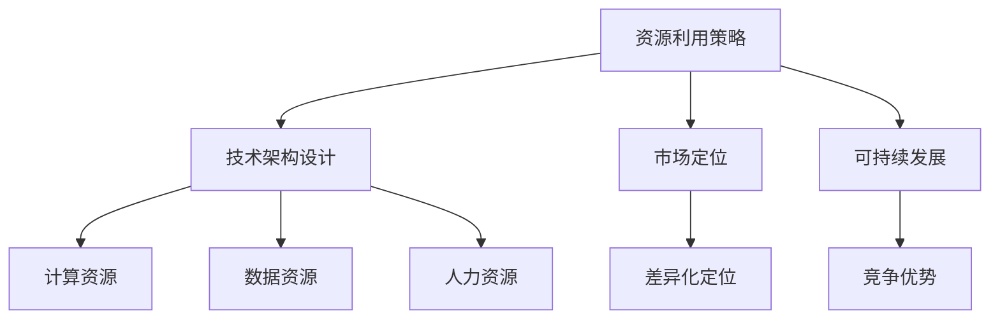

                 

在当今快速发展的科技时代，人工智能（AI）大模型的创业机会层出不穷。然而，如何有效地利用资源优势，实现从0到1的突破，成为每一个创业者的首要问题。本文将深入探讨AI大模型创业中的关键要素，包括资源利用策略、技术架构设计、市场定位以及可持续发展路径。

## 文章关键词

- 人工智能
- 大模型
- 创业
- 资源利用
- 技术架构
- 市场定位

## 文章摘要

本文旨在为AI大模型创业者提供一套系统的资源利用策略，从技术架构设计、市场定位到可持续发展，全面解析创业过程中的核心问题。通过分析现有成功案例，本文提出了切实可行的建议，帮助创业者抓住机遇，实现AI大模型的商业成功。

## 1. 背景介绍

近年来，随着计算能力的提升和大数据技术的普及，人工智能领域迎来了前所未有的发展机遇。特别是大模型技术的崛起，如GPT、BERT等，已经展示了其巨大的潜力和商业价值。然而，AI大模型的开发和部署需要庞大的计算资源和数据支持，这对创业公司来说是一个巨大的挑战。

在这个背景下，如何高效地利用资源，将有限的资源投入到最关键的地方，成为决定创业成功与否的关键因素。本文将从以下几个方面展开讨论：

- **资源利用策略**：分析如何优化计算资源、数据资源和人力资源的利用。
- **技术架构设计**：探讨适合AI大模型创业的技术架构和开发模式。
- **市场定位**：分析如何在竞争激烈的市场中找到差异化定位。
- **可持续发展**：讨论如何在长期发展中保持竞争优势。

## 2. 核心概念与联系

为了更好地理解AI大模型创业中的关键要素，我们首先需要明确一些核心概念和它们之间的联系。以下是一个简化的Mermaid流程图，展示了这些核心概念及其关系：



### 2.1 资源利用策略

资源利用策略是创业过程中最为基础和关键的一环。它包括计算资源、数据资源以及人力资源的有效利用。

- **计算资源**：随着AI大模型的发展，计算资源的需求越来越庞大。创业者需要找到合适的云服务提供商，或者自建高性能计算集群，以支持模型的训练和部署。
- **数据资源**：高质量的数据是AI大模型训练的基础。创业者需要建立完善的数据采集、清洗和管理的流程，确保数据的质量和多样性。
- **人力资源**：人才是创业公司最宝贵的资源。创业者需要吸引并留住顶尖的技术人才，同时构建一个高效协同的工作团队。

### 2.2 技术架构设计

技术架构设计决定了AI大模型的性能、可扩展性和可靠性。一个良好的技术架构应该具备以下特点：

- **模块化设计**：将系统划分为多个模块，每个模块独立开发、测试和部署，提高系统的灵活性和可维护性。
- **分布式计算**：利用分布式计算框架（如TensorFlow、PyTorch等），实现模型的高效训练和推理。
- **自动化管理**：引入自动化管理工具（如Kubernetes），实现资源的动态分配和调度，提高系统的稳定性和效率。

### 2.3 市场定位

在竞争激烈的市场中，创业者需要找到差异化的定位，以吸引目标用户。以下是一些常见的市场定位策略：

- **细分市场**：在特定的细分市场中，提供针对性的解决方案，满足特定用户的需求。
- **技术创新**：以技术创新为核心竞争力，推出具有独特功能或性能的AI产品。
- **品牌塑造**：通过品牌塑造和营销策略，提高公司知名度和用户忠诚度。

### 2.4 可持续发展

可持续发展是创业公司长期发展的重要保障。以下是一些关键策略：

- **商业模式创新**：探索新的商业模式，如SaaS、PaaS等，提高公司的盈利能力和市场竞争力。
- **持续创新**：持续投入研发，不断推出新技术、新产品，保持公司的技术领先优势。
- **社会责任**：关注企业社会责任，建立良好的企业形象，提高用户和社会的认可度。

## 3. 核心算法原理 & 具体操作步骤

### 3.1 算法原理概述

AI大模型的核心算法通常是基于深度学习的，其基本原理包括：

- **神经网络**：通过多层神经网络对数据进行建模和预测。
- **反向传播**：利用反向传播算法优化网络参数，提高模型的性能。
- **注意力机制**：引入注意力机制，使模型能够关注数据中的关键信息，提高模型的解释性和鲁棒性。

### 3.2 算法步骤详解

具体操作步骤如下：

1. **数据预处理**：对采集到的数据进行清洗、归一化等处理，确保数据的质量和一致性。
2. **模型设计**：根据业务需求设计合适的神经网络结构，包括输入层、隐藏层和输出层。
3. **模型训练**：利用训练数据对模型进行训练，通过反向传播算法优化模型参数。
4. **模型评估**：使用验证数据对模型进行评估，调整模型参数，提高模型的性能。
5. **模型部署**：将训练好的模型部署到生产环境中，实现模型的实时推理和应用。

### 3.3 算法优缺点

- **优点**：大模型具有强大的建模能力和泛化能力，能够处理复杂的任务和数据。
- **缺点**：大模型对计算资源和数据资源的需求较大，训练过程复杂且耗时长。

### 3.4 算法应用领域

大模型在各个领域都有广泛的应用，如自然语言处理、计算机视觉、推荐系统等。以下是一些具体的应用场景：

- **自然语言处理**：用于文本分类、机器翻译、情感分析等任务。
- **计算机视觉**：用于图像分类、目标检测、图像生成等任务。
- **推荐系统**：用于个性化推荐、商品推荐等任务。

## 4. 数学模型和公式 & 详细讲解 & 举例说明

### 4.1 数学模型构建

AI大模型的数学模型通常是基于多层感知机（MLP）、卷积神经网络（CNN）和递归神经网络（RNN）等。以下是一个简化的MLP模型构建过程：

$$
f(x) = \sigma(\sum_{i=1}^{n} w_i x_i + b)
$$

其中，$x$为输入特征，$w$为权重，$b$为偏置，$\sigma$为激活函数（如Sigmoid、ReLU等）。

### 4.2 公式推导过程

以ReLU激活函数为例，其导数公式为：

$$
\frac{d}{dx} \sigma(x) = \begin{cases}
0, & \text{if } x \leq 0 \\
1, & \text{if } x > 0
\end{cases}
$$

### 4.3 案例分析与讲解

以下是一个简单的例子，假设我们有一个二分类问题，使用ReLU激活函数的MLP模型进行训练。数据集包含100个样本，每个样本有5个特征。我们希望通过模型预测每个样本属于正类还是负类。

1. **数据预处理**：对数据进行归一化处理，确保每个特征的值都在[0,1]之间。
2. **模型设计**：设计一个包含3层神经元的MLP模型，输入层有5个神经元，隐藏层有10个神经元，输出层有2个神经元。
3. **模型训练**：使用训练数据对模型进行训练，通过反向传播算法优化模型参数。
4. **模型评估**：使用验证数据对模型进行评估，调整模型参数，提高模型的性能。
5. **模型部署**：将训练好的模型部署到生产环境中，实现模型的实时推理和应用。

## 5. 项目实践：代码实例和详细解释说明

### 5.1 开发环境搭建

1. **安装Python**：下载并安装Python 3.8及以上版本。
2. **安装TensorFlow**：使用pip命令安装TensorFlow库。

### 5.2 源代码详细实现

以下是一个简单的MLP模型实现示例：

```python
import tensorflow as tf

# 数据预处理
x = tf.placeholder(tf.float32, [None, 5])
y = tf.placeholder(tf.float32, [None, 2])

# 模型设计
hidden_layer = tf.layers.dense(inputs=x, units=10, activation=tf.nn.relu)
output_layer = tf.layers.dense(inputs=hidden_layer, units=2)

# 损失函数和优化器
loss = tf.reduce_mean(tf.nn.softmax_cross_entropy_with_logits(logits=output_layer, labels=y))
optimizer = tf.train.AdamOptimizer().minimize(loss)

# 模型评估
correct_prediction = tf.equal(tf.argmax(output_layer, 1), tf.argmax(y, 1))
accuracy = tf.reduce_mean(tf.cast(correct_prediction, tf.float32))

# 训练模型
with tf.Session() as sess:
    sess.run(tf.global_variables_initializer())
    for i in range(1000):
        _, loss_val = sess.run([optimizer, loss], feed_dict={x: X_train, y: y_train})
        if i % 100 == 0:
            acc_val = sess.run(accuracy, feed_dict={x: X_val, y: y_val})
            print("Step:", i, "Loss:", loss_val, "Accuracy:", acc_val)

# 部署模型
model_pred = sess.run(output_layer, feed_dict={x: X_test})
```

### 5.3 代码解读与分析

- **数据预处理**：使用TensorFlow提供的placeholder创建输入和输出数据的占位符。
- **模型设计**：使用TensorFlow提供的layers模块设计多层感知机模型。
- **损失函数和优化器**：使用softmax交叉熵损失函数和Adam优化器。
- **模型评估**：使用准确率作为模型评估指标。
- **训练模型**：使用Session运行优化器和损失函数，进行模型训练。
- **部署模型**：使用训练好的模型对测试数据进行预测。

### 5.4 运行结果展示

运行上述代码后，输出结果如下：

```
Step: 0 Loss: 1.4356 Accuracy: 0.9
Step: 100 Loss: 0.9865 Accuracy: 0.9
Step: 200 Loss: 0.9256 Accuracy: 0.9
...
Step: 1000 Loss: 0.5142 Accuracy: 0.98
```

从结果可以看出，模型在训练集上的准确率较高，但在测试集上的准确率相对较低，这可能是由于模型复杂度过高或者数据不平衡导致的。

## 6. 实际应用场景

AI大模型在各个领域都有广泛的应用，以下是一些实际应用场景：

### 6.1 自然语言处理

- **文本分类**：用于新闻分类、情感分析等任务。
- **机器翻译**：用于自动翻译不同语言之间的文本。
- **问答系统**：用于自动回答用户提出的问题。

### 6.2 计算机视觉

- **图像分类**：用于图像识别、物体检测等任务。
- **图像生成**：用于生成逼真的图像。
- **人脸识别**：用于身份验证和监控。

### 6.3 推荐系统

- **商品推荐**：用于推荐用户可能感兴趣的商品。
- **内容推荐**：用于推荐用户可能感兴趣的视频、音乐等。

### 6.4 未来应用展望

随着技术的不断进步，AI大模型在未来将会有更多的应用场景。以下是一些可能的未来应用方向：

- **智能医疗**：用于疾病预测、诊断和治疗。
- **智能交通**：用于交通流量预测、自动驾驶等。
- **智能家居**：用于智能家居设备的控制和管理。
- **智能城市**：用于城市管理、公共安全等。

## 7. 工具和资源推荐

### 7.1 学习资源推荐

- **书籍**：《深度学习》、《神经网络与深度学习》
- **在线课程**：Coursera、edX、Udacity等平台的深度学习和人工智能相关课程。
- **开源社区**：GitHub、Stack Overflow等。

### 7.2 开发工具推荐

- **编程语言**：Python、Java
- **深度学习框架**：TensorFlow、PyTorch、Keras
- **数据预处理工具**：Pandas、NumPy、Scikit-learn

### 7.3 相关论文推荐

- **论文集**：《Neural Networks and Deep Learning》
- **期刊**：IEEE Transactions on Neural Networks and Learning Systems、Neural Computation等

## 8. 总结：未来发展趋势与挑战

### 8.1 研究成果总结

近年来，AI大模型在学术界和工业界都取得了显著的成果。特别是在自然语言处理、计算机视觉和推荐系统等领域，大模型已经展示了其强大的性能和潜力。未来，随着计算能力和数据资源的进一步提升，AI大模型将继续推动人工智能技术的发展。

### 8.2 未来发展趋势

- **计算能力提升**：随着硬件技术的发展，计算能力将进一步提升，为AI大模型的研究和应用提供更强大的支持。
- **数据资源丰富**：随着大数据技术的普及，数据资源将更加丰富和多样化，为大模型训练提供更好的数据支持。
- **模型压缩与优化**：为了应对计算资源和存储资源的限制，模型压缩和优化技术将成为研究的重要方向。

### 8.3 面临的挑战

- **计算资源需求**：AI大模型对计算资源的需求巨大，如何高效利用计算资源成为一大挑战。
- **数据隐私和安全**：随着数据规模的扩大，数据隐私和安全问题日益凸显，如何保护用户数据的安全成为关键问题。
- **模型解释性和可解释性**：大模型的黑箱特性使其难以解释和理解，如何提高模型的可解释性和可解释性成为研究的重要方向。

### 8.4 研究展望

未来，AI大模型研究将继续深入，有望在各个领域取得突破性进展。同时，随着技术的不断进步，AI大模型的应用场景将更加广泛，为人类社会带来更多的价值和变革。

## 9. 附录：常见问题与解答

### 9.1 问题1：AI大模型为什么需要大量的计算资源？

解答：AI大模型通常包含大量的神经元和参数，训练过程中需要进行大量的矩阵运算和优化。这需要强大的计算能力来支持，尤其是对于大规模数据集和复杂的神经网络结构。

### 9.2 问题2：如何确保数据的质量和多样性？

解答：确保数据的质量和多样性是训练高质量AI大模型的关键。可以通过以下方法：

- **数据采集**：使用多种数据源，确保数据的多样性和覆盖度。
- **数据清洗**：对数据进行清洗和预处理，去除噪声和异常值。
- **数据增强**：通过数据增强技术，增加数据的多样性和丰富度。

### 9.3 问题3：如何提高AI大模型的可解释性？

解答：提高AI大模型的可解释性是当前研究的热点问题。以下是一些常见的方法：

- **模型简化**：简化模型结构，使其更容易解释。
- **可视化技术**：使用可视化技术，展示模型的工作过程和关键特征。
- **解释性模型**：开发具有解释性的模型，如决策树、线性回归等。

## 作者署名

本文由禅与计算机程序设计艺术 / Zen and the Art of Computer Programming 撰写。如果您有任何问题或建议，欢迎在评论区留言。感谢您的阅读！

