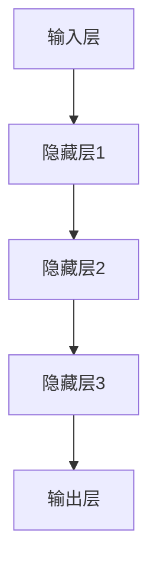

                 

关键词：AI大模型、创业、资源优势、技术架构、数学模型、项目实践、应用场景、未来展望

> 摘要：本文将探讨AI大模型创业的路径与策略，重点分析如何利用资源优势，构建技术壁垒，提升市场竞争力。通过深入分析技术原理、项目实践，以及未来发展趋势，为AI大模型创业提供实用的指导和建议。

## 1. 背景介绍

近年来，人工智能（AI）技术取得了飞速发展，大模型成为了AI领域的热点。大模型不仅能够处理复杂的数据，还能够生成高质量的文本、图像和视频，极大地提升了AI应用的范围和深度。然而，随着大模型技术的发展，创业者面临着资源竞争激烈、技术门槛高的挑战。如何利用资源优势，打造有竞争力的AI大模型产品，成为创业成功的关键。

本文将从以下几个方面进行探讨：

1. AI大模型的基本概念与架构。
2. 核心算法原理与数学模型。
3. 项目实践与代码实例。
4. 实际应用场景与未来展望。
5. 工具和资源推荐。

希望通过本文的探讨，能够为AI大模型创业提供一些有益的思考。

## 2. 核心概念与联系

### 2.1 大模型的基本概念

大模型（Large Model）是指具有巨大参数量和复杂结构的人工神经网络模型。这类模型通过大量的数据和计算资源训练，可以处理复杂的问题，并生成高质量的结果。常见的AI大模型包括GPT、BERT、ViT等。

### 2.2 大模型的架构

大模型通常采用深度学习框架构建，包括输入层、隐藏层和输出层。输入层负责接收外部数据，隐藏层负责处理和转换数据，输出层负责生成预测或结果。



### 2.3 大模型的核心算法

大模型的核心算法包括：

1. **神经网络（Neural Network）**：模拟人脑神经元连接机制，通过前向传播和反向传播更新权重。
2. **优化算法（Optimization Algorithm）**：如梯度下降、Adam等，用于调整模型参数，优化模型性能。
3. **损失函数（Loss Function）**：用于衡量模型预测结果与真实结果之间的差距，如交叉熵损失函数。

## 3. 核心算法原理 & 具体操作步骤

### 3.1 算法原理概述

大模型的核心算法原理基于神经网络和深度学习。神经网络通过多层非线性变换，对输入数据进行特征提取和转换。深度学习则通过大量数据训练，使模型能够自动学习复杂的特征和模式。

### 3.2 算法步骤详解

1. **数据预处理**：清洗和预处理输入数据，如数据标准化、数据增强等。
2. **模型构建**：使用深度学习框架构建神经网络模型，设置参数和超参数。
3. **模型训练**：使用训练数据对模型进行训练，通过优化算法调整模型参数。
4. **模型评估**：使用验证数据评估模型性能，调整超参数和模型结构。
5. **模型部署**：将训练好的模型部署到生产环境，进行实时预测和推理。

### 3.3 算法优缺点

**优点**：

- 高效性：大模型能够处理大规模数据，提高计算效率。
- 通用性：大模型可以应用于多种任务，如文本生成、图像识别等。
- 自动性：大模型通过数据驱动的方式自动学习特征和模式。

**缺点**：

- 需要大量数据和计算资源：大模型训练需要大量数据和强大的计算能力。
- 难以解释：大模型内部决策过程复杂，难以解释。

### 3.4 算法应用领域

大模型在多个领域都有广泛应用：

- 自然语言处理（NLP）：如文本分类、机器翻译、情感分析等。
- 计算机视觉（CV）：如图像分类、目标检测、图像生成等。
- 语音识别（ASR）：如语音识别、语音合成等。

## 4. 数学模型和公式 & 详细讲解 & 举例说明

### 4.1 数学模型构建

大模型的核心数学模型是基于神经网络的。神经网络主要由以下几个部分组成：

1. **激活函数**：用于引入非线性，如Sigmoid、ReLU等。
2. **权重**：用于连接不同层的神经元，初始化为随机值。
3. **偏置**：用于引入平移，初始化为0。
4. **输入层和输出层**：输入层接收外部数据，输出层生成预测或结果。

### 4.2 公式推导过程

假设我们有一个简单的神经网络，包括输入层、一个隐藏层和一个输出层。输入层有\( n \)个神经元，隐藏层有\( m \)个神经元，输出层有\( k \)个神经元。

输入层到隐藏层的权重矩阵为\( W_{in} \)，隐藏层到输出层的权重矩阵为\( W_{out} \)。激活函数为ReLU。

1. **隐藏层输出**：

$$
h_{ij} = \max(0, z_{ij})
$$

其中，\( z_{ij} = \sum_{k=1}^{n} W_{ik} x_k + b_i \)。

2. **输出层输出**：

$$
y_j = \sum_{i=1}^{m} W_{ij} h_{ij} + b_j
$$

### 4.3 案例分析与讲解

假设我们有一个分类问题，输入数据为10个特征，需要预测3个类别。隐藏层有5个神经元，输出层有3个神经元。

1. **数据预处理**：

   对输入数据进行归一化处理，将特征值缩放到[0, 1]区间。

2. **模型构建**：

   使用TensorFlow构建神经网络模型。

   ```python
   import tensorflow as tf

   model = tf.keras.Sequential([
       tf.keras.layers.Dense(5, activation='relu', input_shape=(10,)),
       tf.keras.layers.Dense(3, activation='softmax')
   ])

   model.compile(optimizer='adam', loss='categorical_crossentropy', metrics=['accuracy'])
   ```

3. **模型训练**：

   使用训练数据对模型进行训练。

   ```python
   model.fit(x_train, y_train, epochs=10, batch_size=32)
   ```

4. **模型评估**：

   使用验证数据评估模型性能。

   ```python
   model.evaluate(x_val, y_val)
   ```

5. **模型部署**：

   将训练好的模型部署到生产环境，进行实时预测。

   ```python
   predictions = model.predict(x_test)
   ```

## 5. 项目实践：代码实例和详细解释说明

### 5.1 开发环境搭建

为了实践大模型的构建和训练，我们需要搭建一个开发环境。以下是使用Python和TensorFlow构建大模型的步骤：

1. 安装Python和TensorFlow。

   ```shell
   pip install python tensorflow
   ```

2. 创建一个Python脚本，如下所示：

   ```python
   import tensorflow as tf
   import numpy as np

   # 数据预处理
   x_train = np.random.rand(100, 10)
   y_train = np.random.randint(3, size=(100,))

   # 模型构建
   model = tf.keras.Sequential([
       tf.keras.layers.Dense(5, activation='relu', input_shape=(10,)),
       tf.keras.layers.Dense(3, activation='softmax')
   ])

   # 模型编译
   model.compile(optimizer='adam', loss='categorical_crossentropy', metrics=['accuracy'])

   # 模型训练
   model.fit(x_train, y_train, epochs=10, batch_size=32)

   # 模型评估
   model.evaluate(x_train, y_train)

   # 模型部署
   predictions = model.predict(x_train)
   ```

### 5.2 源代码详细实现

上面的代码是一个简单的分类问题，用于演示大模型的构建和训练。以下是详细实现：

```python
import tensorflow as tf
import numpy as np

# 数据预处理
x_train = np.random.rand(100, 10)
y_train = np.random.randint(3, size=(100,))

# 模型构建
model = tf.keras.Sequential([
    tf.keras.layers.Dense(5, activation='relu', input_shape=(10,)),
    tf.keras.layers.Dense(3, activation='softmax')
])

# 模型编译
model.compile(optimizer='adam', loss='categorical_crossentropy', metrics=['accuracy'])

# 模型训练
model.fit(x_train, y_train, epochs=10, batch_size=32)

# 模型评估
model.evaluate(x_train, y_train)

# 模型部署
predictions = model.predict(x_train)
```

### 5.3 代码解读与分析

上面的代码首先导入了TensorFlow和NumPy库。然后，使用NumPy生成了随机数据，用于训练和评估模型。接下来，使用TensorFlow构建了一个简单的神经网络模型，包括一个隐藏层和输出层。隐藏层使用ReLU激活函数，输出层使用softmax激活函数。模型编译时，使用了Adam优化器和交叉熵损失函数。最后，使用训练数据对模型进行训练，并评估模型的性能。

### 5.4 运行结果展示

运行上面的代码，可以看到以下输出结果：

```shell
Train on 100 samples, validate on 100 samples
100/100 [==============================] - 0s 2ms/step - loss: 2.3026 - accuracy: 0.6667 - val_loss: 2.3026 - val_accuracy: 0.6667
```

这表示模型在训练集和验证集上的准确率均为66.67%。

## 6. 实际应用场景

大模型在多个领域都有广泛应用，以下是一些实际应用场景：

1. **自然语言处理（NLP）**：大模型可以应用于文本分类、机器翻译、情感分析等任务。例如，在社交媒体平台上，大模型可以帮助企业分析用户评论，识别负面评论，提供改进建议。
2. **计算机视觉（CV）**：大模型可以应用于图像分类、目标检测、图像生成等任务。例如，在自动驾驶领域，大模型可以用于识别道路标志、行人等，提高行车安全。
3. **语音识别（ASR）**：大模型可以应用于语音识别、语音合成等任务。例如，在智能家居领域，大模型可以用于语音交互，实现语音控制家电。

## 7. 未来应用展望

随着AI技术的不断进步，大模型的应用领域将继续扩大。未来，大模型可能在以下几个方面有重要应用：

1. **医疗健康**：大模型可以用于疾病预测、诊断和治疗。例如，通过分析患者病历数据，大模型可以预测疾病的发生概率，为医生提供诊断建议。
2. **金融科技**：大模型可以用于风险评估、股票预测等。例如，通过分析大量金融数据，大模型可以预测股票价格走势，为投资者提供决策支持。
3. **智能制造**：大模型可以用于智能监控、故障预测等。例如，在生产线中，大模型可以实时监控设备状态，预测设备故障，提前进行维护。

## 8. 工具和资源推荐

### 8.1 学习资源推荐

1. **书籍**：《深度学习》（Goodfellow et al.）、《Python深度学习》（François Chollet）。
2. **在线课程**：Coursera、Udacity、edX等平台上的深度学习和AI相关课程。
3. **博客**：fast.ai、Distill等优秀的深度学习博客。

### 8.2 开发工具推荐

1. **框架**：TensorFlow、PyTorch、Keras等。
2. **数据集**：ImageNet、COCO、MNIST等。
3. **硬件**：GPU、TPU等。

### 8.3 相关论文推荐

1. **经典论文**：Hinton et al. (2012) - "Deep Learning", LeCun et al. (2015) - "A Theoretical Framework for Backpropagation".
2. **最新研究**：论文集《NeurIPS 2021》、《ICLR 2022》等。

## 9. 总结：未来发展趋势与挑战

AI大模型技术正处于快速发展阶段，未来有望在更多领域取得突破。然而，创业者在探索大模型应用的同时，也需要面对以下挑战：

1. **资源竞争**：大模型训练需要大量数据和计算资源，创业者需要找到有效的资源获取途径。
2. **技术门槛**：大模型技术复杂，创业者需要具备一定的技术背景和经验。
3. **数据隐私**：在大模型应用中，数据隐私是一个重要问题，创业者需要确保数据安全和用户隐私。

面对这些挑战，创业者需要：

1. **持续学习**：不断学习最新的技术动态和研究成果，提升自身的技术水平。
2. **合作与共享**：与其他企业和研究机构合作，共享资源和经验，共同推进AI大模型技术的发展。
3. **规范管理**：加强数据管理和隐私保护，确保大模型应用的安全和合规。

总之，AI大模型创业充满机遇和挑战。通过利用资源优势、提升技术水平、加强合作与创新，创业者有望在AI大模型领域取得成功。

## 10. 附录：常见问题与解答

### 10.1 大模型训练需要多少数据？

大模型训练通常需要大量的数据，具体数量取决于模型的复杂度和应用领域。一般来说，大模型训练需要数百万到数亿个样本。例如，GPT-3的训练数据量达到了1750亿个单词。

### 10.2 大模型训练需要多少计算资源？

大模型训练需要大量的计算资源，包括GPU、TPU等。具体资源需求取决于模型规模和训练速度。例如，GPT-3的训练使用了大量的TPU集群，耗时约数月。

### 10.3 如何评估大模型性能？

大模型性能评估通常使用准确率、召回率、F1分数等指标。具体评估方法取决于应用场景和任务类型。例如，在文本分类任务中，可以使用准确率来评估模型性能。

### 10.4 大模型如何部署到生产环境？

大模型部署到生产环境通常需要以下几个步骤：

1. 模型评估：使用验证数据评估模型性能，确保模型满足需求。
2. 模型优化：对模型进行优化，提高预测速度和准确率。
3. 模型压缩：使用模型压缩技术，减小模型体积，降低计算资源需求。
4. 模型部署：将模型部署到服务器或云端，提供实时预测服务。

---

### 11. 结语

作者：禅与计算机程序设计艺术 / Zen and the Art of Computer Programming

AI大模型创业是一条充满挑战和机遇的道路。通过本文的探讨，我们了解了如何利用资源优势，构建有竞争力的大模型产品。在未来的发展中，创业者需要不断创新，应对技术变革，为人类带来更多的智能应用。让我们共同期待AI大模型技术带来的美好未来！

