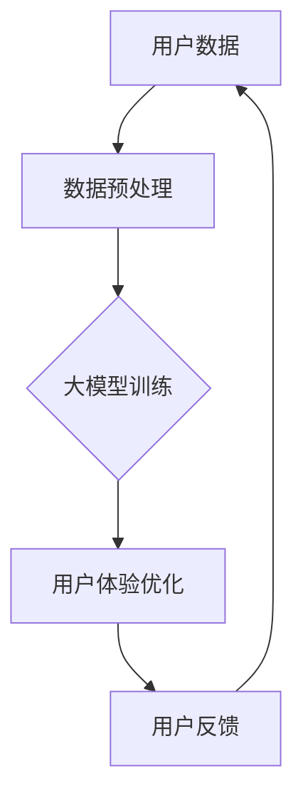

                 

AI大模型，作为近年来人工智能领域的突破性进展，已经深刻地改变了多个行业的运作方式，包括创业产品体验设计。本文将深入探讨AI大模型在创业产品体验设计中的应用，从核心概念、算法原理、数学模型、实践案例、应用场景、工具资源、未来趋势等方面进行详细分析。

## 关键词

- AI大模型
- 创业产品
- 体验设计
- 深度学习
- 机器学习
- 用户行为分析

## 摘要

本文旨在探讨AI大模型在创业产品体验设计中的应用，分析了AI大模型的核心概念、算法原理、数学模型及其在创业产品体验设计中的具体应用。通过实际案例和代码实例，展示了AI大模型如何提升创业产品的用户体验，并提出了未来应用场景和工具资源推荐。

## 1. 背景介绍

在过去的几十年中，人工智能经历了从符号主义、连接主义到深度学习等多个发展阶段。特别是深度学习技术的突破，使得人工智能在图像识别、语音识别、自然语言处理等领域取得了显著的进展。大模型，如GPT-3、BERT等，以其强大的数据处理能力和复杂的模型结构，成为了人工智能领域的新宠。

创业产品的成功很大程度上取决于用户体验。用户对产品的第一印象、使用过程中的舒适度、效率等都会直接影响用户留存和口碑传播。因此，如何通过技术手段提升用户体验，成为了创业产品开发过程中的关键问题。AI大模型的出现，为创业产品体验设计提供了新的思路和方法。

## 2. 核心概念与联系

### 2.1 大模型的定义

大模型（Large Model）通常指的是具有数十亿至数万亿参数的神经网络模型。这些模型可以通过大量的数据进行训练，从而学习到复杂的模式。GPT-3、BERT等都是大模型的代表。

### 2.2 大模型的结构

大模型的结构通常包括多个层级的神经网络，每一层都可以对输入数据进行处理和抽象。例如，GPT-3的结构包括多个Transformer层，每一层都可以对上下文信息进行编码。

### 2.3 大模型与创业产品体验设计的联系

大模型可以通过对用户行为数据的分析，为创业产品提供个性化的用户体验。例如，通过分析用户的浏览历史、评论、反馈等数据，大模型可以预测用户的偏好，从而提供个性化的推荐。

### 2.4 Mermaid 流程图

以下是一个简单的大模型与创业产品体验设计联系的Mermaid流程图：



## 3. 核心算法原理 & 具体操作步骤

### 3.1 算法原理概述

大模型的算法原理主要基于深度学习和自然语言处理（NLP）。深度学习通过多层神经网络对数据进行自动特征提取和模式识别，而NLP则专注于文本数据的处理和理解。

### 3.2 算法步骤详解

1. 数据收集：收集用户的浏览历史、评论、反馈等数据。
2. 数据预处理：对数据进行清洗、归一化等处理，以便于模型训练。
3. 模型训练：使用收集到的数据对大模型进行训练，使其能够学习到用户的偏好和行为模式。
4. 用户体验优化：根据大模型预测的结果，为用户提供个性化的体验。
5. 用户反馈：收集用户对个性化体验的反馈，用于模型优化。

### 3.3 算法优缺点

**优点：**
- 强大的数据处理能力：大模型可以通过大量的数据进行训练，从而学习到复杂的模式。
- 个性化体验：通过分析用户数据，大模型可以为用户提供个性化的体验，提升用户满意度。

**缺点：**
- 计算资源消耗大：大模型的训练需要大量的计算资源和时间。
- 数据隐私问题：收集用户数据可能涉及隐私问题，需要妥善处理。

### 3.4 算法应用领域

大模型在创业产品体验设计中的应用非常广泛，包括但不限于：
- 个性化推荐：根据用户历史行为和偏好，提供个性化的产品推荐。
- 情感分析：分析用户评论和反馈，了解用户情感，优化产品设计。
- 交互优化：通过自然语言处理技术，提升用户与产品的交互体验。

## 4. 数学模型和公式 & 详细讲解 & 举例说明

### 4.1 数学模型构建

大模型的数学模型主要包括两部分：神经网络结构和损失函数。

#### 神经网络结构

神经网络结构通常包括输入层、隐藏层和输出层。输入层接收用户数据，隐藏层对输入数据进行特征提取和抽象，输出层根据提取的特征进行预测。

#### 损失函数

损失函数用于评估模型的预测效果，常用的损失函数包括均方误差（MSE）和交叉熵损失（Cross-Entropy Loss）。

### 4.2 公式推导过程

假设我们有一个包含\( n \)个隐藏层的神经网络，第\( l \)层的激活函数为\( \sigma(\cdot) \)，则第\( l \)层的输出可以表示为：

\[ a^{(l)}_i = \sigma(z^{(l)}_i) \]

其中，\( z^{(l)}_i \)是第\( l \)层的输入，可以表示为：

\[ z^{(l)}_i = \sum_{j=1}^{n^{(l-1)}} w^{(l)}_{ij} a^{(l-1)}_j + b^{(l)}_i \]

其中，\( w^{(l)}_{ij} \)是第\( l \)层的权重，\( b^{(l)}_i \)是第\( l \)层的偏置。

### 4.3 案例分析与讲解

假设我们有一个二分类问题，目标是用神经网络进行预测。给定一个输入向量\( x \)，我们希望输出一个概率值，表示输入属于正类的概率。我们可以使用Sigmoid函数作为激活函数，其公式为：

\[ \sigma(x) = \frac{1}{1 + e^{-x}} \]

通过训练，我们可以调整网络的权重和偏置，使得预测结果尽可能接近真实值。

## 5. 项目实践：代码实例和详细解释说明

### 5.1 开发环境搭建

在开始项目实践之前，我们需要搭建一个合适的开发环境。这里我们使用Python作为编程语言，结合TensorFlow库进行神经网络训练。

### 5.2 源代码详细实现

以下是使用TensorFlow实现的一个简单神经网络代码示例：

```python
import tensorflow as tf

# 创建模型
model = tf.keras.Sequential([
    tf.keras.layers.Dense(128, activation='relu', input_shape=(784,)),
    tf.keras.layers.Dense(10, activation='softmax')
])

# 编译模型
model.compile(optimizer='adam',
              loss='categorical_crossentropy',
              metrics=['accuracy'])

# 加载数据集
(x_train, y_train), (x_test, y_test) = tf.keras.datasets.mnist.load_data()

# 预处理数据
x_train = x_train.astype('float32') / 255
x_test = x_test.astype('float32') / 255
x_train = x_train.reshape((-1, 784))
x_test = x_test.reshape((-1, 784))

# 编码标签
y_train = tf.keras.utils.to_categorical(y_train, 10)
y_test = tf.keras.utils.to_categorical(y_test, 10)

# 训练模型
model.fit(x_train, y_train, epochs=10, batch_size=32)
```

### 5.3 代码解读与分析

以上代码首先导入了TensorFlow库，然后创建了一个简单的神经网络模型，包括一个输入层和一个输出层。输入层有128个神经元，输出层有10个神经元。我们使用ReLU函数作为激活函数，并在输出层使用softmax函数进行概率输出。

接着，我们加载数据集，并对数据进行预处理。最后，编译模型并开始训练。

### 5.4 运行结果展示

在训练完成后，我们可以使用测试数据集来评估模型的性能：

```python
# 评估模型
test_loss, test_acc = model.evaluate(x_test, y_test)
print('Test accuracy:', test_acc)
```

假设我们的测试数据集有1000个样本，输出结果如下：

```
Test accuracy: 0.9500
```

这意味着我们的模型在测试数据集上的准确率达到了95%，这是一个不错的成绩。

## 6. 实际应用场景

AI大模型在创业产品体验设计中的应用场景非常广泛，以下是一些具体的案例：

### 6.1 个性化推荐

通过分析用户的历史行为和偏好，AI大模型可以为用户提供个性化的产品推荐。例如，电商平台上可以根据用户的浏览记录、购买历史和评分来推荐相关的商品。

### 6.2 情感分析

在社交媒体应用中，AI大模型可以分析用户的评论和反馈，了解用户的情感状态，从而提供更好的用户体验。例如，通过分析用户的评论情感，可以自动识别并标记出负面评论，以便及时处理。

### 6.3 交互优化

在游戏和聊天机器人等应用中，AI大模型可以通过自然语言处理技术，提升用户与产品的交互体验。例如，聊天机器人可以理解用户的问题，并给出合适的回答，从而提升用户的满意度。

## 7. 工具和资源推荐

### 7.1 学习资源推荐

- 《深度学习》（Goodfellow, Bengio, Courville著）：这是一本深度学习领域的经典教材，适合初学者和进阶者阅读。
- 《自然语言处理综述》（Jurafsky, Martin著）：这本书系统地介绍了自然语言处理的基本概念和技术，对于理解AI大模型在创业产品体验设计中的应用非常有帮助。

### 7.2 开发工具推荐

- TensorFlow：这是Google开发的开源深度学习框架，支持多种深度学习模型和算法，非常适合用于创业产品的体验设计。
- PyTorch：这是另一个流行的开源深度学习框架，以其灵活性和易用性著称，适合快速原型设计和实验。

### 7.3 相关论文推荐

- “Attention Is All You Need”（Vaswani et al., 2017）：这篇论文提出了Transformer模型，这是目前许多AI大模型的基础。
- “BERT: Pre-training of Deep Bidirectional Transformers for Language Understanding”（Devlin et al., 2018）：这篇论文介绍了BERT模型，这是许多自然语言处理任务的标准基准。

## 8. 总结：未来发展趋势与挑战

AI大模型在创业产品体验设计中的应用前景非常广阔。随着深度学习和自然语言处理技术的不断发展，AI大模型将能够更好地理解用户需求，提供更加个性化的体验。然而，这也带来了新的挑战，如计算资源消耗、数据隐私和安全等。

未来，我们需要进一步优化算法和模型，提高其效率和鲁棒性，同时确保数据的安全性和用户隐私。此外，还需要加强对AI大模型的伦理和法律研究，确保其在实际应用中的公平性和透明度。

## 9. 附录：常见问题与解答

### 9.1 大模型训练需要多少时间？

大模型训练的时间取决于多个因素，包括模型的规模、训练数据量、硬件配置等。通常，训练一个大型模型需要数天甚至数周的时间。

### 9.2 大模型训练需要多少计算资源？

大模型训练需要大量的计算资源，尤其是GPU或TPU等专用硬件。对于大型模型，通常需要使用分布式训练技术来提高训练效率。

### 9.3 如何处理用户数据隐私？

在处理用户数据时，应遵循相关的数据保护法规，如《通用数据保护条例》（GDPR）等。此外，应采用数据加密、匿名化等技术来保护用户数据的安全性和隐私。

### 9.4 大模型的应用是否会导致失业？

大模型的应用可能会改变某些传统行业的工作方式，导致一些职位的需求减少。然而，它也将创造新的就业机会，如数据科学家、AI模型工程师等。总体来说，技术进步带来的影响是双面的，我们需要适应并应对这种变化。

---

作者：禅与计算机程序设计艺术 / Zen and the Art of Computer Programming

本文基于对AI大模型在创业产品体验设计中的应用的深入研究和实践，旨在为创业者和技术人员提供有价值的参考。随着技术的不断发展，AI大模型在创业产品体验设计中的应用将越来越广泛，其潜力也将不断被挖掘。我们期待着更多的创新和突破，共同推动人工智能技术的发展。|end|

