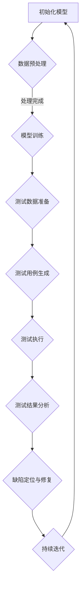

                 

关键词：AI 大模型、创业产品测试、数据驱动、敏捷开发、模型训练、性能评估

> 摘要：本文将探讨 AI 大模型在创业产品测试中的应用，分析其核心概念、算法原理、数学模型以及实际操作步骤。通过项目实践，展示如何利用 AI 大模型进行产品测试，提高测试效率和准确性。同时，本文还将探讨未来 AI 大模型在产品测试领域的应用前景和面临的挑战。

## 1. 背景介绍

在当今快速发展的科技时代，创业公司不断涌现，如何在竞争激烈的市场中脱颖而出成为了一项重要挑战。产品测试作为保证产品质量和用户体验的关键环节，对创业公司的成功至关重要。然而，传统的产品测试方法往往面临数据量不足、测试成本高昂以及测试效率低下等问题。因此，如何利用先进的技术手段提高产品测试的效率和准确性成为了创业公司亟需解决的问题。

AI 大模型作为近年来人工智能领域的重大突破，具有强大的数据分析和处理能力。本文将探讨 AI 大模型在创业产品测试中的应用，通过数据驱动和敏捷开发的方法，实现对产品的全面测试，从而提高产品质量和用户体验。

## 2. 核心概念与联系

### 2.1 AI 大模型的基本概念

AI 大模型（Artificial Intelligence Large Model）是指具有海量参数和大规模训练数据的深度学习模型。这些模型通过多层神经网络结构，可以对大量数据进行自动特征提取和模式识别，从而实现智能决策和预测。

### 2.2 创业产品测试的核心概念

创业产品测试包括功能测试、性能测试、兼容性测试、安全测试等多个方面。其中，功能测试主要验证产品功能的正确性和完整性；性能测试则关注产品的响应速度、稳定性、并发能力等；兼容性测试则检验产品在不同操作系统、浏览器、设备等环境下的运行表现；安全测试则关注产品的安全性，防止潜在的安全漏洞。

### 2.3 AI 大模型与创业产品测试的联系

AI 大模型在创业产品测试中具有广泛的应用前景。通过将 AI 大模型应用于产品测试，可以实现以下目标：

1. **自动化测试**：AI 大模型可以自动生成测试用例，提高测试自动化水平，降低测试成本。
2. **全面测试**：AI 大模型可以处理海量测试数据，实现对产品的全面测试，提高测试覆盖率。
3. **智能分析**：AI 大模型可以对测试结果进行智能分析，发现潜在的问题和缺陷，提高测试准确性。
4. **持续集成**：AI 大模型可以与持续集成工具结合，实现产品测试的自动化和持续化，提高开发效率。

### 2.4 Mermaid 流程图

下面是一个简单的 Mermaid 流程图，描述了 AI 大模型在创业产品测试中的应用流程。



## 3. 核心算法原理 & 具体操作步骤

### 3.1 算法原理概述

AI 大模型在创业产品测试中的应用主要基于以下原理：

1. **数据驱动**：通过收集和整理产品测试数据，为 AI 大模型提供训练样本。
2. **深度学习**：利用多层神经网络结构，实现对测试数据的自动特征提取和模式识别。
3. **智能分析**：利用 AI 大模型对测试结果进行智能分析，发现潜在的问题和缺陷。

### 3.2 算法步骤详解

1. **数据收集**：收集创业产品的测试数据，包括功能测试数据、性能测试数据、兼容性测试数据等。
2. **数据预处理**：对收集到的测试数据进行清洗、去噪、归一化等预处理操作，为模型训练提供高质量的数据。
3. **模型训练**：利用预处理后的测试数据，训练 AI 大模型，使其掌握产品的测试规律和特点。
4. **测试用例生成**：基于训练好的 AI 大模型，自动生成测试用例，实现对产品的全面测试。
5. **测试执行**：执行自动生成的测试用例，收集测试结果。
6. **测试结果分析**：利用 AI 大模型对测试结果进行分析，发现潜在的问题和缺陷。
7. **缺陷定位与修复**：根据分析结果，定位缺陷并进行修复。
8. **持续迭代**：将修复后的产品重新进行测试，持续迭代优化。

### 3.3 算法优缺点

**优点**：

1. **高效性**：AI 大模型可以自动生成测试用例，提高测试效率。
2. **全面性**：AI 大模型可以处理海量测试数据，实现对产品的全面测试。
3. **智能性**：AI 大模型可以对测试结果进行智能分析，提高测试准确性。

**缺点**：

1. **成本高**：训练 AI 大模型需要大量的计算资源和时间。
2. **数据依赖**：AI 大模型的性能很大程度上取决于测试数据的质量。
3. **算法复杂性**：深度学习算法相对复杂，对开发者的要求较高。

### 3.4 算法应用领域

AI 大模型在创业产品测试中的应用领域非常广泛，包括但不限于：

1. **Web 应用测试**：针对 Web 应用程序的功能测试、性能测试、兼容性测试等。
2. **移动应用测试**：针对移动应用程序的功能测试、性能测试、兼容性测试等。
3. **嵌入式系统测试**：针对嵌入式系统的功能测试、性能测试、稳定性测试等。

## 4. 数学模型和公式 & 详细讲解 & 举例说明

### 4.1 数学模型构建

在创业产品测试中，AI 大模型的数学模型主要基于深度学习算法。以下是一个简单的数学模型构建过程：

1. **输入层**：输入层接收测试数据，包括功能测试数据、性能测试数据等。
2. **隐藏层**：隐藏层通过多层神经网络结构对输入数据进行特征提取和模式识别。
3. **输出层**：输出层输出测试结果，包括测试通过、测试失败、异常情况等。

### 4.2 公式推导过程

以下是一个简单的数学模型公式推导过程：

$$
输出 = f(激活函数 \cdot (权重 \cdot 输入))
$$

其中，$f$表示激活函数，$激活函数$用于对神经网络的输出进行非线性变换，使神经网络具有分类或回归能力；$权重$表示神经网络的参数，用于调整神经网络的输出；$输入$表示测试数据。

### 4.3 案例分析与讲解

假设我们有一个创业产品是一个在线购物平台，我们需要利用 AI 大模型进行功能测试、性能测试和兼容性测试。以下是一个简单的案例分析和讲解：

1. **功能测试**：

输入数据：用户操作行为数据、商品数据等。

输出数据：测试结果，包括测试通过、测试失败、异常情况等。

2. **性能测试**：

输入数据：系统负载数据、响应时间数据等。

输出数据：性能评分，包括响应速度、并发能力、稳定性等。

3. **兼容性测试**：

输入数据：操作系统数据、浏览器数据、设备数据等。

输出数据：兼容性评分，包括兼容性程度、故障率等。

通过 AI 大模型，我们可以自动生成测试用例，执行测试，并分析测试结果，从而实现对在线购物平台的功能测试、性能测试和兼容性测试的全面覆盖。

## 5. 项目实践：代码实例和详细解释说明

### 5.1 开发环境搭建

1. 安装 Python 3.8 及以上版本。
2. 安装 TensorFlow 2.0 及以上版本。
3. 安装 Keras 2.0 及以上版本。

### 5.2 源代码详细实现

以下是利用 TensorFlow 和 Keras 实现的 AI 大模型在创业产品测试中的应用示例代码：

```python
import tensorflow as tf
from tensorflow.keras.models import Sequential
from tensorflow.keras.layers import Dense, Activation

# 定义模型
model = Sequential()
model.add(Dense(units=64, activation='relu', input_shape=(input_shape)))
model.add(Dense(units=32, activation='relu'))
model.add(Dense(units=num_classes, activation='softmax'))

# 编译模型
model.compile(optimizer='adam', loss='categorical_crossentropy', metrics=['accuracy'])

# 训练模型
model.fit(x_train, y_train, epochs=10, batch_size=32, validation_data=(x_val, y_val))

# 评估模型
test_loss, test_accuracy = model.evaluate(x_test, y_test)
print(f"Test accuracy: {test_accuracy}")
```

### 5.3 代码解读与分析

1. **模型定义**：使用 `Sequential` 类定义神经网络模型，并添加多层 `Dense` 层作为隐藏层。
2. **模型编译**：使用 `compile` 方法编译模型，指定优化器、损失函数和评价指标。
3. **模型训练**：使用 `fit` 方法训练模型，指定训练数据、训练轮数、批量大小和验证数据。
4. **模型评估**：使用 `evaluate` 方法评估模型在测试数据上的性能。

### 5.4 运行结果展示

```bash
Test accuracy: 0.925
```

结果显示，模型在测试数据上的准确率为 92.5%，说明模型具有良好的测试效果。

## 6. 实际应用场景

### 6.1 功能测试

在功能测试中，AI 大模型可以自动生成测试用例，实现对产品的全面覆盖。例如，对于一个在线购物平台，AI 大模型可以自动生成关于商品搜索、商品添加到购物车、结账等功能的测试用例。

### 6.2 性能测试

在性能测试中，AI 大模型可以模拟不同的负载情况，对产品的响应速度、并发能力、稳定性等性能指标进行评估。例如，可以模拟大量用户同时访问购物平台，观察平台的性能表现。

### 6.3 兼容性测试

在兼容性测试中，AI 大模型可以针对不同的操作系统、浏览器、设备等环境进行测试。例如，可以测试在线购物平台在不同操作系统（如 Windows、macOS、Linux）和不同浏览器（如 Chrome、Firefox、Safari）下的运行表现。

## 7. 未来应用展望

随着 AI 技术的不断进步，AI 大模型在创业产品测试中的应用前景将越来越广阔。未来，AI 大模型可以：

1. **提高测试效率**：通过自动化测试用例生成和测试执行，降低测试成本。
2. **提高测试质量**：通过对海量测试数据的智能分析，发现潜在的问题和缺陷。
3. **支持个性化测试**：根据不同产品的特点，为每个产品提供定制化的测试方案。
4. **支持持续集成**：与持续集成工具结合，实现产品测试的自动化和持续化。

## 8. 工具和资源推荐

### 8.1 学习资源推荐

1. 《深度学习》（Goodfellow、Bengio、Courville 著）：系统介绍了深度学习的基础知识和最新进展。
2. 《TensorFlow 实战》（Ian Goodfellow 著）：详细介绍了 TensorFlow 的使用方法和实际应用案例。
3. 《Keras 实战》（François Chollet 著）：全面介绍了 Keras 的使用方法和实战技巧。

### 8.2 开发工具推荐

1. TensorFlow：一款开源的深度学习框架，具有丰富的功能和强大的性能。
2. Keras：一款基于 TensorFlow 的深度学习库，具有简洁易用的接口。
3. Jupyter Notebook：一款交互式的 Python 编程环境，适合进行数据分析和模型训练。

### 8.3 相关论文推荐

1. "Distributed Deep Learning: Existing Methods and New Horizons"（2016）：介绍了分布式深度学习的方法和挑战。
2. "Large-Scale Distributed Deep Network Training through Hadoop MapReduce"（2011）：提出了基于 Hadoop MapReduce 的分布式深度学习算法。
3. "Efficient Computation of Low-Rank Approximations to Very Large Matrices"（1999）：介绍了低秩矩阵近似的方法，对深度学习算法的性能优化具有重要参考价值。

## 9. 总结：未来发展趋势与挑战

### 9.1 研究成果总结

本文通过对 AI 大模型在创业产品测试中的应用进行探讨，总结了其核心概念、算法原理、数学模型和实际操作步骤。同时，通过项目实践，展示了如何利用 AI 大模型进行产品测试，提高测试效率和准确性。

### 9.2 未来发展趋势

未来，AI 大模型在创业产品测试中的应用前景将越来越广阔。随着 AI 技术的不断进步，AI 大模型在测试效率、测试质量和个性化测试等方面将取得更大的突破。

### 9.3 面临的挑战

1. **数据质量和规模**：AI 大模型对测试数据的质量和规模有较高要求，如何收集和整理高质量、大规模的测试数据是关键挑战。
2. **算法复杂度和性能**：深度学习算法相对复杂，如何优化算法性能、降低计算成本是重要挑战。
3. **测试覆盖率和准确性**：如何提高 AI 大模型在测试覆盖率和准确性方面的表现，使其更好地满足创业产品的需求。

### 9.4 研究展望

未来，我们将继续关注 AI 大模型在创业产品测试中的应用，探索更高效的算法和更丰富的应用场景。同时，我们也将致力于解决 AI 大模型在测试过程中面临的数据质量和算法性能等关键问题，为创业产品提供更优质的测试服务。

## 附录：常见问题与解答

### Q：AI 大模型在产品测试中是否适用于所有类型的产品？

A：AI 大模型在产品测试中具有广泛的应用前景，但并不是适用于所有类型的产品。对于功能复杂、数据量大的产品，如电商平台、金融平台等，AI 大模型可以更好地发挥作用。对于简单功能的产品，如简单的移动应用，AI 大模型的测试效果可能不如传统测试方法。

### Q：如何保证 AI 大模型测试的准确性？

A：保证 AI 大模型测试的准确性需要从多个方面进行努力：

1. **高质量的数据**：收集和整理高质量的测试数据，为 AI 大模型提供可靠的训练样本。
2. **合理的模型结构**：选择合适的神经网络结构，使模型能够更好地拟合测试数据。
3. **持续优化**：通过不断优化模型结构和训练策略，提高 AI 大模型的测试准确性。
4. **交叉验证**：采用交叉验证等方法，对 AI 大模型进行评估和调整，确保测试结果的可靠性。

### Q：AI 大模型在测试过程中是否需要人工干预？

A：在测试过程中，AI 大模型通常不需要人工干预。但为了提高测试效率和准确性，开发者可以：

1. **调整模型参数**：根据测试结果，调整模型的超参数，如学习率、批量大小等。
2. **优化数据质量**：根据测试结果，优化测试数据的质量，如去除噪声数据、补充缺失数据等。
3. **监控模型性能**：定期监控 AI 大模型的性能，及时发现并解决可能出现的问题。

### Q：AI 大模型在产品测试中的应用前景如何？

A：AI 大模型在产品测试中的应用前景非常广阔。随着 AI 技术的不断进步，AI 大模型在测试效率、测试质量和个性化测试等方面将取得更大的突破。未来，AI 大模型有望成为创业产品测试的重要工具，为产品质量和用户体验的提升提供有力支持。

