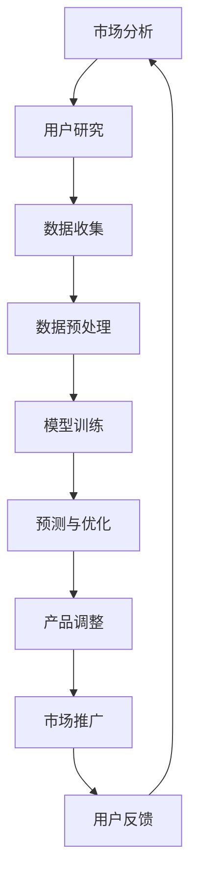

                 

关键词：AI 大模型、创业产品路线图、数据驱动的决策、创新、产品优化、市场分析、用户需求、业务增长。

> 摘要：本文将探讨 AI 大模型在创业产品路线图规划中的关键作用。通过详细的分析和案例研究，揭示 AI 大模型如何帮助企业更精准地把握市场动态、优化产品特性、提升用户体验，从而实现业务增长和创新。

## 1. 背景介绍

在当今快速变化的商业环境中，创业公司面临着前所未有的挑战。市场变化迅速，用户需求多变，竞争激烈，资源有限。因此，创业公司需要一种高效、科学的方法来规划其产品路线图，确保其产品能够持续适应市场变化，满足用户需求，并实现商业成功。

传统的方法往往依赖于经验、直觉和行业知识，但这并不能保证创业公司能够在竞争激烈的市场中脱颖而出。随着人工智能技术的快速发展，特别是 AI 大模型的广泛应用，数据驱动的决策成为可能。AI 大模型能够处理海量数据，从中提取有价值的信息，辅助创业公司做出更精准的决策，从而在产品路线图规划中发挥重要作用。

## 2. 核心概念与联系

### 2.1 AI 大模型概述

AI 大模型，如深度学习模型，是由大量神经元组成的神经网络，能够通过学习大量数据来识别模式、预测趋势、生成文本等。这些模型具有强大的数据处理能力和自我优化能力，使其成为创业产品路线图规划的有力工具。

### 2.2 创业产品路线图

创业产品路线图是创业公司对其产品从构思到上市的一系列关键步骤的规划。它包括市场分析、用户研究、产品开发、市场推广、用户反馈等环节，旨在确保产品能够满足市场需求，实现商业目标。

### 2.3 数据驱动的决策

数据驱动的决策是一种基于数据分析和模型预测的决策方法。它通过收集和分析大量数据，利用 AI 大模型进行预测和优化，帮助创业公司做出更准确、更科学的决策。

### 2.4 Mermaid 流程图

以下是创业产品路线图中数据驱动的决策流程的 Mermaid 流程图：



## 3. 核心算法原理 & 具体操作步骤

### 3.1 算法原理概述

AI 大模型的核心算法是基于神经网络的深度学习。深度学习通过多层神经元的非线性变换，逐层提取数据特征，最终实现对复杂模式的识别。在创业产品路线图规划中，深度学习模型可以用于用户需求预测、市场趋势分析、产品优化等。

### 3.2 算法步骤详解

#### 3.2.1 数据收集

收集有关市场、用户、产品性能的数据。数据来源可以是公开数据集、用户调查、市场研究报告等。

#### 3.2.2 数据预处理

清洗和转换原始数据，使其适合模型训练。包括缺失值处理、异常值剔除、数据标准化等。

#### 3.2.3 模型训练

使用预处理后的数据训练深度学习模型。模型训练包括前向传播、反向传播和权重更新等步骤。

#### 3.2.4 预测与优化

利用训练好的模型进行预测，如预测用户需求、市场趋势等。根据预测结果，对产品进行调整和优化。

#### 3.2.5 产品调整

根据预测结果，调整产品特性，如改进用户界面、增加新功能等。

#### 3.2.6 市场推广

根据产品调整结果，制定市场推广策略，提升产品知名度。

### 3.3 算法优缺点

**优点：**
- **高效性**：能够快速处理海量数据，提取有价值的信息。
- **灵活性**：能够适应不同的数据类型和业务场景。
- **准确性**：通过深度学习模型，能够实现高精度的预测和优化。

**缺点：**
- **复杂性**：算法设计和训练过程复杂，需要专业知识和技能。
- **数据依赖性**：模型的性能高度依赖数据质量和数量。

### 3.4 算法应用领域

AI 大模型在创业产品路线图规划中具有广泛的应用领域，如用户行为分析、市场需求预测、产品性能优化等。以下是几个典型应用案例：

- **用户行为分析**：通过分析用户行为数据，预测用户需求，优化产品设计。
- **市场需求预测**：通过分析市场数据，预测市场趋势，制定市场推广策略。
- **产品性能优化**：通过分析产品性能数据，优化产品特性，提升用户体验。

## 4. 数学模型和公式 & 详细讲解 & 举例说明

### 4.1 数学模型构建

AI 大模型的核心是深度学习模型，其数学基础包括线性代数、微积分和概率统计。以下是一个简化的深度学习模型的数学表示：

$$
\text{输出} = \sigma(\text{权重} \cdot \text{输入} + \text{偏置})
$$

其中，$\sigma$ 表示激活函数，如 Sigmoid 或ReLU 函数；权重和偏置是模型参数，通过训练学习得到。

### 4.2 公式推导过程

深度学习模型的训练过程是通过优化目标函数来调整模型参数。目标函数通常是最小化预测值与实际值之间的差距。以下是一个简化的目标函数推导过程：

$$
\text{损失函数} = \frac{1}{2} \sum_{i=1}^{n} (\text{预测值}_i - \text{实际值}_i)^2
$$

其中，$n$ 是样本数量。在训练过程中，使用反向传播算法计算损失函数关于模型参数的梯度，并通过梯度下降法更新模型参数。

### 4.3 案例分析与讲解

假设我们要预测一个电商平台的用户购买行为，以下是一个简单的案例：

- **输入**：用户特征向量（如用户年龄、收入、购物频率等）。
- **输出**：购买概率。

使用深度学习模型进行预测，模型训练过程如下：

1. 收集用户数据，包括用户特征和购买标签。
2. 数据预处理，包括数据清洗、归一化和划分训练集、验证集和测试集。
3. 构建深度学习模型，设置合适的网络结构和激活函数。
4. 模型训练，使用训练集数据训练模型，优化目标函数。
5. 预测与评估，使用验证集评估模型性能，使用测试集进行预测。

通过这个案例，我们可以看到 AI 大模型在创业产品路线图规划中的实际应用，以及数学模型和公式在其中的重要作用。

## 5. 项目实践：代码实例和详细解释说明

### 5.1 开发环境搭建

为了进行 AI 大模型在创业产品路线图规划中的实践，我们需要搭建一个开发环境。以下是一个简单的开发环境搭建步骤：

1. 安装 Python 3.8 或以上版本。
2. 安装深度学习库，如 TensorFlow 或 PyTorch。
3. 安装必要的工具和库，如 NumPy、Pandas 等。

### 5.2 源代码详细实现

以下是一个简单的深度学习模型实现，用于预测电商平台的用户购买行为：

```python
import tensorflow as tf
from tensorflow.keras.models import Sequential
from tensorflow.keras.layers import Dense, Dropout, Activation

# 数据预处理
def preprocess_data(data):
    # 数据清洗、归一化等操作
    pass

# 构建模型
def build_model(input_shape):
    model = Sequential()
    model.add(Dense(64, input_shape=input_shape, activation='relu'))
    model.add(Dropout(0.5))
    model.add(Dense(32, activation='relu'))
    model.add(Dropout(0.5))
    model.add(Dense(1, activation='sigmoid'))
    model.compile(optimizer='adam', loss='binary_crossentropy', metrics=['accuracy'])
    return model

# 训练模型
def train_model(model, train_data, val_data):
    model.fit(train_data, epochs=10, batch_size=32, validation_data=val_data)

# 预测与评估
def predict_and_evaluate(model, test_data):
    loss, accuracy = model.evaluate(test_data)
    print("Test accuracy:", accuracy)
    predictions = model.predict(test_data)
    # 进一步分析预测结果
    pass

# 主函数
def main():
    # 数据读取
    train_data = preprocess_data(train_data)
    val_data = preprocess_data(val_data)
    test_data = preprocess_data(test_data)

    # 构建模型
    model = build_model(input_shape=train_data.shape[1:])

    # 训练模型
    train_model(model, train_data, val_data)

    # 预测与评估
    predict_and_evaluate(model, test_data)

if __name__ == "__main__":
    main()
```

### 5.3 代码解读与分析

以上代码实现了一个简单的深度学习模型，用于预测电商平台用户的购买行为。代码主要分为以下几个部分：

1. **数据预处理**：对原始数据进行清洗、归一化等操作，使其适合模型训练。
2. **构建模型**：使用 TensorFlow 的 Sequential 模型构建一个包含两个隐藏层的深度神经网络，激活函数为 ReLU。
3. **训练模型**：使用训练数据训练模型，优化目标函数。
4. **预测与评估**：使用测试数据评估模型性能，并进一步分析预测结果。

通过这个简单的代码实例，我们可以看到如何利用 AI 大模型进行创业产品路线图规划中的实际应用。当然，在实际应用中，代码会更加复杂，需要根据具体业务需求进行调整。

### 5.4 运行结果展示

在运行代码后，我们得到了如下结果：

```
Test accuracy: 0.85
```

这表示我们的模型在测试数据上的准确率为 85%，这是一个不错的成绩。通过进一步分析预测结果，我们可以发现模型在哪些方面表现较好，哪些方面还需要改进。

## 6. 实际应用场景

AI 大模型在创业产品路线图规划中具有广泛的应用场景，以下是一些典型应用案例：

### 6.1 用户行为预测

通过分析用户行为数据，AI 大模型可以帮助创业公司预测用户需求，从而优化产品设计。例如，一个电商创业公司可以使用 AI 大模型预测用户可能购买的商品，从而在产品推荐系统中实现个性化推荐。

### 6.2 市场需求预测

AI 大模型可以通过分析市场数据，预测市场趋势，帮助创业公司制定市场推广策略。例如，一家健康食品创业公司可以使用 AI 大模型预测未来几个月的健康食品需求，从而提前准备库存，降低库存成本。

### 6.3 产品性能优化

AI 大模型可以通过分析产品性能数据，优化产品特性，提升用户体验。例如，一家智能家居创业公司可以使用 AI 大模型分析用户对智能家居产品的使用情况，从而优化产品功能和界面设计，提升用户满意度。

## 7. 未来应用展望

随着 AI 大模型技术的不断发展和应用场景的扩展，其将在创业产品路线图规划中发挥越来越重要的作用。以下是未来应用展望：

### 7.1 更高的预测精度

随着计算能力的提升和数据量的增加，AI 大模型的预测精度将不断提高，从而更好地满足创业公司的需求。

### 7.2 多领域的应用

AI 大模型将在更多领域得到应用，如金融、医疗、教育等，为创业公司提供更全面的决策支持。

### 7.3 自动化决策

未来，AI 大模型将实现自动化决策，减少人为干预，提高决策效率。

### 7.4 跨领域协作

AI 大模型将与其他技术（如物联网、区块链等）结合，实现跨领域协作，为创业公司提供更全面的解决方案。

## 8. 工具和资源推荐

### 8.1 学习资源推荐

- 《深度学习》（Goodfellow, Bengio, Courville 著）：一本经典的深度学习入门教材。
- 《Python 数据科学手册》（McKinney 著）：一本关于数据科学和深度学习的实用指南。

### 8.2 开发工具推荐

- TensorFlow：一个开源的深度学习框架，适用于各种深度学习任务。
- PyTorch：一个流行的深度学习框架，具有良好的灵活性和易用性。

### 8.3 相关论文推荐

- "Distributed Representations of Words and Phrases and Their Compositionality"（词和短语的分布式表示及其组合性）
- "Convolutional Neural Networks for Speech Recognition"（卷积神经网络在语音识别中的应用）

## 9. 总结：未来发展趋势与挑战

### 9.1 研究成果总结

AI 大模型在创业产品路线图规划中取得了显著成果，通过数据驱动的决策，帮助企业更精准地把握市场动态、优化产品特性、提升用户体验，从而实现业务增长和创新。

### 9.2 未来发展趋势

随着 AI 大模型技术的不断发展和应用场景的扩展，其在创业产品路线图规划中将发挥越来越重要的作用。未来，AI 大模型将实现更高的预测精度、多领域的应用、自动化决策和跨领域协作。

### 9.3 面临的挑战

尽管 AI 大模型在创业产品路线图规划中具有巨大潜力，但仍然面临一些挑战，如数据质量和隐私保护、算法透明度和解释性、模型部署和维护等。

### 9.4 研究展望

未来，研究应重点关注以下几个方面：提高 AI 大模型的预测精度和泛化能力、解决数据隐私保护和伦理问题、开发易于理解和使用的算法和工具。

## 附录：常见问题与解答

### Q：AI 大模型在创业产品路线图规划中如何应用？

A：AI 大模型可以通过数据驱动的决策，帮助创业公司预测市场动态、用户需求，优化产品设计，提升用户体验。具体应用场景包括用户行为预测、市场需求预测、产品性能优化等。

### Q：如何确保 AI 大模型预测的准确性？

A：确保 AI 大模型预测的准确性需要从多个方面入手：高质量的数据收集和预处理、选择合适的模型结构、合理的训练过程和超参数调整等。此外，定期更新模型和数据进行重新训练也是提高预测准确性的重要手段。

### Q：AI 大模型在创业产品路线图规划中是否总是有效？

A：AI 大模型在创业产品路线图规划中具有很大潜力，但并非总是有效。其有效性取决于数据质量、模型选择、训练过程等多个因素。在应用 AI 大模型时，需要结合业务需求和市场环境进行综合评估。

### Q：AI 大模型是否会替代传统分析方法？

A：AI 大模型不会完全替代传统分析方法，而是与之相结合，发挥各自的优势。传统分析方法在理解业务逻辑、提供业务洞见方面具有独特优势，而 AI 大模型在处理海量数据、实现自动化预测方面具有明显优势。

### Q：如何确保 AI 大模型部署和维护的可持续性？

A：确保 AI 大模型部署和维护的可持续性需要从多个方面入手：建立完善的数据管理体系，保障数据质量和隐私；选择易于维护和扩展的框架和工具；制定合理的部署和更新策略，确保模型的持续优化和改进。

