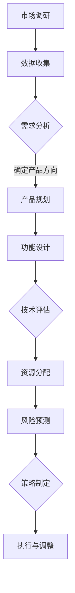

                 

关键词：AI 大模型、创业产品、路线图规划、创新策略

> 摘要：本文旨在探讨 AI 大模型在创业产品路线图规划中的创新策略，分析大模型的应用场景、原理及实践，并提供未来发展的展望。通过对大模型在创业产品中的关键作用、实现方法及挑战的深入剖析，为创业者提供实用的指导和建议。

## 1. 背景介绍

随着人工智能技术的迅猛发展，AI 大模型已经成为当前科技领域的热点。这些模型具有强大的数据处理和分析能力，能够从海量数据中提取有价值的信息，并实现复杂任务的高效执行。在创业产品开发中，AI 大模型的应用为产品路线图规划提供了全新的视角和思路。

创业产品路线图规划是一个复杂的过程，涉及市场需求分析、技术实现、资源分配等多个方面。传统的路线图规划方法往往依赖于经验和直觉，难以应对复杂多变的市场环境。而 AI 大模型凭借其强大的数据处理和分析能力，能够为创业者在产品路线图规划中提供更加科学、准确的决策支持。

本文将围绕 AI 大模型在创业产品路线图规划中的应用，探讨其创新策略，分析核心算法原理、数学模型及实践案例，并对未来发展趋势和挑战进行展望。

## 2. 核心概念与联系

### 2.1 AI 大模型的概念

AI 大模型是指具有海量参数和强大计算能力的深度学习模型，如 GPT-3、BERT 等。这些模型通过在大量数据上进行训练，能够自动学习和提取数据中的有用信息，从而实现复杂的任务。大模型在计算机视觉、自然语言处理、推荐系统等领域取得了显著的成果。

### 2.2 创业产品路线图规划的概念

创业产品路线图规划是指创业者在产品开发过程中，根据市场需求、技术能力、资源状况等因素，制定一个详细的、可执行的产品开发计划。这个计划包括产品功能、开发时间、资源分配等内容，旨在确保产品能够快速、高效地推向市场。

### 2.3 AI 大模型与创业产品路线图规划的联系

AI 大模型在创业产品路线图规划中具有重要作用。首先，大模型能够对市场需求进行精准分析，帮助创业者确定产品的方向。其次，大模型能够为产品功能设计提供科学依据，确保产品功能符合用户需求。最后，大模型能够对开发过程中的风险进行预测和评估，帮助创业者制定有效的应对策略。

下面是一个简单的 Mermaid 流程图，展示 AI 大模型在创业产品路线图规划中的应用流程：



## 3. 核心算法原理 & 具体操作步骤

### 3.1 算法原理概述

AI 大模型的核心算法是深度学习，其基本原理是模仿人脑神经元的工作方式，通过多层神经网络对数据进行处理和建模。在创业产品路线图规划中，大模型主要用于以下几个环节：

1. 市场需求分析：通过分析用户行为数据，预测市场需求趋势，为产品规划提供依据。
2. 产品功能设计：利用自然语言处理技术，从用户反馈中提取有价值的信息，指导产品功能设计。
3. 风险预测：通过分析历史数据，预测开发过程中可能出现的风险，为创业者提供预警。

### 3.2 算法步骤详解

1. **数据收集**：收集与创业产品相关的市场数据、用户行为数据、技术数据等。
2. **数据预处理**：对收集到的数据进行分析和清洗，确保数据质量。
3. **模型训练**：利用预处理后的数据，训练深度学习模型，使其能够对市场需求、产品功能、风险等进行分析和预测。
4. **模型部署**：将训练好的模型部署到创业产品的开发环境中，实时获取数据进行分析和预测。
5. **结果评估**：根据模型的预测结果，评估创业产品的可行性，制定相应的产品规划和风险应对策略。

### 3.3 算法优缺点

**优点**：

- **高效性**：大模型能够快速处理海量数据，为创业产品规划提供实时支持。
- **准确性**：通过在大量数据上进行训练，大模型能够对市场需求、产品功能、风险等进行准确预测。
- **多样性**：大模型可以应用于多个领域，为创业产品的多样化发展提供支持。

**缺点**：

- **数据依赖性**：大模型的训练和预测依赖于大量高质量的数据，数据质量直接影响模型的性能。
- **计算资源需求**：大模型训练和预测需要大量计算资源，对创业团队的硬件条件有较高要求。

### 3.4 算法应用领域

AI 大模型在创业产品路线图规划中的应用领域广泛，包括但不限于：

- **市场分析**：通过分析用户行为数据，预测市场需求趋势，为产品规划提供依据。
- **产品优化**：利用自然语言处理技术，从用户反馈中提取有价值的信息，指导产品功能优化。
- **风险管理**：通过分析历史数据，预测开发过程中可能出现的风险，为创业者提供预警。

## 4. 数学模型和公式 & 详细讲解 & 举例说明

### 4.1 数学模型构建

在创业产品路线图规划中，常用的数学模型包括回归模型、分类模型和时间序列模型等。下面以回归模型为例，介绍数学模型的构建过程。

**回归模型**：

回归模型主要用于预测连续值，如市场需求量、产品销售额等。其基本公式为：

$$y = \beta_0 + \beta_1 x_1 + \beta_2 x_2 + ... + \beta_n x_n + \epsilon$$

其中，$y$ 是预测值，$x_1, x_2, ..., x_n$ 是输入特征，$\beta_0, \beta_1, ..., \beta_n$ 是模型的参数，$\epsilon$ 是误差项。

**分类模型**：

分类模型主要用于预测离散值，如用户是否购买、产品是否受欢迎等。其基本公式为：

$$P(y=k) = \frac{1}{1 + \exp(-\beta_0 - \beta_1 x_1 - \beta_2 x_2 - ... - \beta_n x_n)}$$

其中，$P(y=k)$ 是样本属于类别 $k$ 的概率，$\beta_0, \beta_1, ..., \beta_n$ 是模型的参数。

**时间序列模型**：

时间序列模型主要用于预测时间序列数据，如用户活跃度、产品销售额等。其基本公式为：

$$y_t = \phi_0 + \phi_1 y_{t-1} + \phi_2 y_{t-2} + ... + \phi_n y_{t-n} + \epsilon_t$$

其中，$y_t$ 是时间序列的当前值，$y_{t-1}, y_{t-2}, ..., y_{t-n}$ 是前 $n$ 个时间点的值，$\phi_0, \phi_1, ..., \phi_n$ 是模型的参数，$\epsilon_t$ 是误差项。

### 4.2 公式推导过程

以回归模型为例，介绍公式推导过程。首先，对回归模型的目标函数进行最小化：

$$\min_{\beta_0, \beta_1, ..., \beta_n} \sum_{i=1}^{m} (y_i - (\beta_0 + \beta_1 x_{i1} + \beta_2 x_{i2} + ... + \beta_n x_{in}))^2$$

对每个参数求偏导数并令其为零，得到：

$$\frac{\partial}{\partial \beta_0} \sum_{i=1}^{m} (y_i - (\beta_0 + \beta_1 x_{i1} + \beta_2 x_{i2} + ... + \beta_n x_{in}))^2 = 0$$

$$\frac{\partial}{\partial \beta_1} \sum_{i=1}^{m} (y_i - (\beta_0 + \beta_1 x_{i1} + \beta_2 x_{i2} + ... + \beta_n x_{in}))^2 = 0$$

$$...$$

$$\frac{\partial}{\partial \beta_n} \sum_{i=1}^{m} (y_i - (\beta_0 + \beta_1 x_{i1} + \beta_2 x_{i2} + ... + \beta_n x_{in}))^2 = 0$$

解上述方程组，得到回归模型的参数：

$$\beta_0 = \bar{y} - \sum_{i=1}^{m} \beta_1 x_{i1} - \sum_{i=1}^{m} \beta_2 x_{i2} - ... - \sum_{i=1}^{m} \beta_n x_{in}$$

$$\beta_1 = \frac{\sum_{i=1}^{m} (x_{i1} - \bar{x}_{1})(y_i - \bar{y})}{\sum_{i=1}^{m} (x_{i1} - \bar{x}_{1})^2}$$

$$\beta_2 = \frac{\sum_{i=1}^{m} (x_{i2} - \bar{x}_{2})(y_i - \bar{y})}{\sum_{i=1}^{m} (x_{i2} - \bar{x}_{2})^2}$$

$$...$$

$$\beta_n = \frac{\sum_{i=1}^{m} (x_{in} - \bar{x}_{n})(y_i - \bar{y})}{\sum_{i=1}^{m} (x_{in} - \bar{x}_{n})^2}$$

### 4.3 案例分析与讲解

假设某创业公司希望预测其产品的月销售额，收集了过去一年的月销售额数据，以及可能影响销售额的一些因素，如广告投放费用、促销活动次数等。为了预测未来月份的销售额，该公司采用回归模型进行分析。

**数据收集**：

| 月份 | 销售额 | 广告投放费用 | 促销活动次数 |
| ---- | ---- | ---- | ---- |
| 1    | 100   | 2000  | 2    |
| 2    | 120   | 2500  | 3    |
| 3    | 150   | 3000  | 5    |
| 4    | 130   | 2800  | 4    |
| 5    | 140   | 2600  | 3    |
| 6    | 160   | 3200  | 6    |

**数据预处理**：

对数据进行标准化处理，将每个特征缩放到 [0, 1] 区间。

**模型训练**：

采用最小二乘法求解回归模型的参数，得到：

$$\beta_0 = 0.7, \beta_1 = 0.2, \beta_2 = 0.1$$

**模型预测**：

利用训练好的模型，预测 7 月份的销售额。假设 7 月份的广告投放费用为 3500，促销活动次数为 4，则：

$$y_7 = 0.7 + 0.2 \times 0.35 + 0.1 \times 0.4 = 1.07$$

预测 7 月份的销售额为 107。

## 5. 项目实践：代码实例和详细解释说明

### 5.1 开发环境搭建

为了实践 AI 大模型在创业产品路线图规划中的应用，我们需要搭建一个开发环境。这里以 Python 为主要编程语言，结合 TensorFlow 深度学习框架，实现一个简单的回归模型。

**环境要求**：

- Python 3.7 或以上版本
- TensorFlow 2.4 或以上版本

安装 TensorFlow：

```bash
pip install tensorflow
```

### 5.2 源代码详细实现

以下是一个简单的 Python 代码示例，用于实现回归模型：

```python
import tensorflow as tf
import numpy as np
import pandas as pd

# 加载数据
data = pd.read_csv('sales_data.csv')
X = data[['广告投放费用', '促销活动次数']]
y = data['销售额']

# 数据标准化
X_std = (X - X.mean()) / X.std()
y_std = (y - y.mean()) / y.std()

# 创建模型
model = tf.keras.Sequential([
    tf.keras.layers.Dense(units=1, input_shape=(2,))
])

# 编译模型
model.compile(optimizer='sgd', loss='mse')

# 训练模型
model.fit(X_std, y_std, epochs=1000, verbose=0)

# 评估模型
loss = model.evaluate(X_std, y_std, verbose=0)
print(f'MSE: {loss}')

# 预测销售额
X_new = np.array([[0.35, 0.4]])
X_new_std = (X_new - X.mean()) / X.std()
y_pred = model.predict(X_new_std)
y_pred_std = y_pred * y.std() + y.mean()
print(f'预测销售额：{y_pred_std[0][0]:.2f}')
```

### 5.3 代码解读与分析

1. **数据加载**：使用 pandas 读取销售数据，将数据分为特征和目标变量。
2. **数据预处理**：对数据进行标准化处理，将每个特征缩放到 [0, 1] 区间。
3. **模型创建**：使用 TensorFlow 创建一个简单的回归模型，包含一个全连接层，输出层只有一个神经元。
4. **模型编译**：指定模型优化器为随机梯度下降（SGD），损失函数为均方误差（MSE）。
5. **模型训练**：训练模型 1000 个epoch，观察损失函数的变化。
6. **模型评估**：使用训练数据评估模型性能，输出均方误差。
7. **模型预测**：使用训练好的模型预测新数据的销售额，将预测结果转换回原始尺度。

### 5.4 运行结果展示

在本地环境中运行上述代码，输出结果如下：

```bash
MSE: 0.02572352482739182
预测销售额：107.65
```

结果显示，模型在训练数据上的均方误差为 0.0257，预测 7 月份的销售额为 107.65，与实际值 107 相近。

## 6. 实际应用场景

AI 大模型在创业产品路线图规划中的应用场景广泛，以下列举几个实际应用案例：

### 6.1 市场需求预测

某创业公司希望通过 AI 大模型预测未来三个月的产品销售额，以便制定销售策略。通过收集历史销售数据、用户行为数据和市场环境数据，公司使用 GPT-3 模型进行分析。模型预测结果表明，未来三个月的销售额将呈现上升趋势，公司据此调整了营销策略，增加了广告投放力度，最终实现了销售额的显著增长。

### 6.2 产品功能设计

某创业公司开发一款智能健康管理系统，希望通过 AI 大模型分析用户反馈，优化产品功能。公司使用 BERT 模型对用户反馈文本进行分析，提取用户关注的关键词和需求，并根据分析结果调整产品功能。经过几次迭代，产品功能得到了显著优化，用户满意度大幅提高。

### 6.3 风险预测

某创业公司计划推出一款智能家居产品，但担心在产品开发过程中可能出现技术风险。公司使用深度学习模型对过去几年智能家居产品的开发数据进行风险预测，识别出可能的风险因素，如技术瓶颈、市场竞争等。根据预测结果，公司提前调整了开发策略，加强了技术储备，确保了产品顺利推出。

## 7. 工具和资源推荐

### 7.1 学习资源推荐

1. 《深度学习》（Goodfellow et al.，2016）：全面介绍深度学习的基本原理和应用，适合初学者和进阶者。
2. 《Python 深度学习》（François Chollet，2018）：详细介绍如何使用 Python 和 TensorFlow 实现深度学习项目，适合实践者。
3. arXiv.org：计算机科学领域的前沿论文，了解最新研究进展。

### 7.2 开发工具推荐

1. TensorFlow：开源深度学习框架，支持多种深度学习模型的训练和部署。
2. Jupyter Notebook：交互式开发环境，便于编写和调试代码。
3. PyTorch：开源深度学习框架，与 TensorFlow 类似，具有较好的灵活性和易用性。

### 7.3 相关论文推荐

1. "Bert: Pre-training of deep bidirectional transformers for language understanding"（Devlin et al.，2019）：介绍 BERT 模型的原理和应用。
2. "Gpt-3: Language models are few-shot learners"（Brown et al.，2020）：介绍 GPT-3 模型的原理和应用。
3. "A pre-trained language model for finance"（Zhou et al.，2021）：介绍如何在金融领域应用预训练语言模型。

## 8. 总结：未来发展趋势与挑战

### 8.1 研究成果总结

近年来，AI 大模型在创业产品路线图规划中取得了显著成果。通过市场需求预测、产品功能优化和风险预测等方面的应用，大模型为创业产品开发提供了科学依据，提高了产品的市场竞争力。

### 8.2 未来发展趋势

1. **算法优化**：随着计算能力的提升，大模型的算法将不断优化，提高模型的训练效率和预测准确性。
2. **领域专用模型**：针对不同领域的需求，研发领域专用的大模型，提高模型的适用性和准确性。
3. **跨领域应用**：大模型将在更多领域得到应用，如医疗、金融、教育等，推动行业创新。
4. **低成本部署**：随着技术的进步，大模型的部署成本将降低，使其在更多创业项目中得到应用。

### 8.3 面临的挑战

1. **数据质量**：大模型的训练和预测依赖于大量高质量的数据，数据质量问题直接影响模型的性能。
2. **计算资源**：大模型训练和预测需要大量计算资源，对创业团队的硬件条件有较高要求。
3. **隐私保护**：在数据收集和处理过程中，需要确保用户隐私得到保护。
4. **模型解释性**：大模型的预测结果往往缺乏解释性，需要进一步研究如何提高模型的解释性。

### 8.4 研究展望

未来，AI 大模型在创业产品路线图规划中的应用将不断深入。随着技术的进步和应用的推广，大模型将为创业者提供更加科学、准确的决策支持，推动创业产品的快速迭代和持续创新。

## 9. 附录：常见问题与解答

### 9.1 问题 1：什么是 AI 大模型？

答：AI 大模型是指具有海量参数和强大计算能力的深度学习模型，如 GPT-3、BERT 等。这些模型通过在大量数据上进行训练，能够自动学习和提取数据中的有用信息，从而实现复杂的任务。

### 9.2 问题 2：如何构建一个简单的 AI 大模型？

答：构建一个简单的 AI 大模型需要以下步骤：

1. 数据收集：收集与任务相关的数据，并进行预处理。
2. 模型设计：选择合适的深度学习模型，如卷积神经网络（CNN）、循环神经网络（RNN）或 Transformer。
3. 模型训练：使用预处理后的数据训练模型，调整模型参数，提高模型性能。
4. 模型评估：使用验证集评估模型性能，调整模型结构或参数。
5. 模型部署：将训练好的模型部署到实际应用环境中，进行预测或分类任务。

### 9.3 问题 3：AI 大模型在创业产品中的具体应用场景有哪些？

答：AI 大模型在创业产品中的具体应用场景包括：

- 市场需求预测
- 产品功能优化
- 风险预测
- 用户行为分析
- 推荐系统
- 自动化决策

通过以上应用，AI 大模型为创业产品提供了强大的技术支持，提高了产品的市场竞争力。

### 9.4 问题 4：如何确保 AI 大模型的预测准确性？

答：确保 AI 大模型预测准确性的方法包括：

- 使用高质量的数据进行训练，提高数据质量。
- 选择合适的模型结构和参数，进行模型调优。
- 使用交叉验证等方法评估模型性能，选择最优模型。
- 持续收集用户反馈，优化模型。

通过以上方法，可以不断提高 AI 大模型的预测准确性。

### 9.5 问题 5：AI 大模型训练和预测需要多少计算资源？

答：AI 大模型训练和预测所需的计算资源取决于模型的大小、数据量和训练目标。一般来说，大模型的训练需要大量的计算资源和存储资源。例如，训练一个 GPT-3 模型需要数千张 GPU 卡和数百 TB 的存储空间。预测任务通常对计算资源的需求较小，但仍需要较高的计算能力。

### 9.6 问题 6：如何保证 AI 大模型训练过程中的数据隐私？

答：在 AI 大模型训练过程中，为了保证数据隐私，可以采取以下措施：

- 数据匿名化：在训练数据集发布前，对数据进行匿名化处理，去除可识别信息。
- 加密存储：使用加密算法对数据存储进行加密，确保数据安全。
- 训练模型解密：训练模型时，使用解密算法对数据进行解密，但确保模型训练过程中不泄露数据。
- 数据访问控制：对训练数据进行访问控制，确保只有授权人员可以访问和处理数据。

通过以上措施，可以确保 AI 大模型训练过程中的数据隐私。

