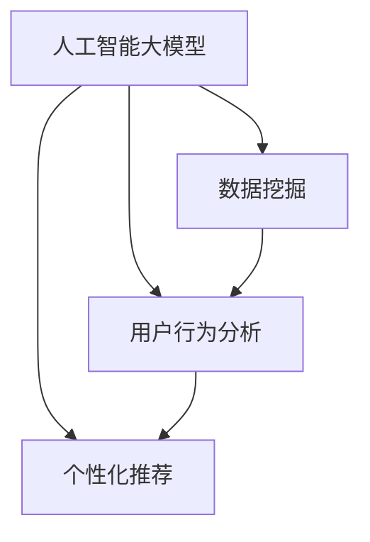

                 

关键词：AI大模型、电子商务、搜索推荐系统、数据挖掘、用户行为分析、个性化推荐

摘要：本文从人工智能大模型的背景介绍入手，深入探讨了其在电商业中特别是搜索推荐系统中的应用前景。通过详细阐述大模型的核心概念与联系，算法原理与具体操作步骤，以及数学模型和公式推导，我们展示了AI大模型在电商业中的实际应用案例。同时，我们对未来的发展趋势与挑战进行了展望，并推荐了相关的学习资源和开发工具。

## 1. 背景介绍

随着互联网技术的迅猛发展，电子商务已经成为全球范围内的一种主流商业模式。消费者通过互联网进行购物，而商家则通过电商平台提供商品和服务。在这种背景下，如何提高用户的购物体验，提升商家销售额，成为电商业发展的关键问题。

搜索推荐系统作为一种智能化的信息过滤和推荐机制，已经在电商业中得到了广泛应用。它通过分析用户的历史行为、兴趣爱好、购买记录等数据，向用户推荐他们可能感兴趣的商品或服务。然而，随着数据的不断增长和用户行为的复杂性增加，传统的搜索推荐系统面临着越来越多的挑战。

为了应对这些挑战，近年来，人工智能大模型（如深度学习、生成对抗网络等）在电商业中得到了广泛关注。大模型具有强大的数据处理能力和自我学习能力，能够更好地理解和预测用户行为，从而提供更精准的个性化推荐。

## 2. 核心概念与联系

在讨论AI大模型在电商业中的应用之前，我们首先需要了解一些核心概念和它们之间的联系。

### 2.1 人工智能大模型

人工智能大模型是指通过大规模数据训练得到的深度神经网络模型。这些模型具有非常复杂的网络结构和参数，能够自动学习数据中的特征和模式，从而实现对复杂问题的建模和预测。

### 2.2 数据挖掘

数据挖掘是人工智能的一个重要分支，它旨在从大量数据中提取有价值的信息和知识。在电商业中，数据挖掘可以通过分析用户行为数据、商品数据等，发现用户的需求和偏好，为推荐系统提供依据。

### 2.3 用户行为分析

用户行为分析是数据挖掘的一个重要应用领域，它通过分析用户的浏览、搜索、购买等行为，了解用户的兴趣和需求。在搜索推荐系统中，用户行为分析可以帮助系统更好地理解用户，从而提供更精准的推荐。

### 2.4 个性化推荐

个性化推荐是一种基于用户兴趣和行为的推荐机制，它通过分析用户的特征和偏好，向用户推荐他们可能感兴趣的商品或服务。个性化推荐可以提高用户的购物体验，提升商家的销售额。

为了更好地理解这些概念之间的联系，我们可以使用Mermaid流程图来展示它们之间的关系：



## 3. 核心算法原理 & 具体操作步骤

### 3.1 算法原理概述

AI大模型在搜索推荐系统中的应用主要基于深度学习技术。深度学习通过构建多层神经网络，从数据中自动提取特征和模式，实现对复杂问题的建模和预测。

在搜索推荐系统中，深度学习算法通常包括以下几个步骤：

1. 数据预处理：对用户行为数据、商品数据进行清洗、归一化等处理，为后续建模做准备。
2. 特征提取：通过神经网络模型从原始数据中提取特征，为推荐系统提供依据。
3. 模型训练：使用训练数据对神经网络模型进行训练，优化模型参数。
4. 模型评估：使用验证数据对训练好的模型进行评估，确保模型的有效性和鲁棒性。
5. 推荐生成：使用训练好的模型生成推荐结果，向用户推荐他们可能感兴趣的商品。

### 3.2 算法步骤详解

1. **数据预处理**

数据预处理是深度学习模型训练的重要步骤。它包括以下几个方面：

- 数据清洗：去除数据中的噪声和异常值，提高数据质量。
- 数据归一化：将数据归一化到统一的范围内，消除数据规模差异对模型训练的影响。
- 特征提取：从原始数据中提取有助于模型训练的特征，如用户ID、商品ID、用户行为类型、时间戳等。

2. **特征提取**

特征提取是深度学习模型的核心环节。通过构建多层神经网络，模型可以从原始数据中自动提取特征和模式。特征提取的目的是将高维稀疏数据转化为低维稠密数据，提高模型训练效率。

常用的特征提取方法包括：

- 自编码器（Autoencoder）：自编码器是一种无监督学习模型，它通过训练自动学习数据中的特征表示，从而实现特征提取。
- 卷积神经网络（CNN）：卷积神经网络在图像处理领域具有出色的性能，它也可以用于特征提取，适用于处理高维稀疏数据。

3. **模型训练**

模型训练是深度学习模型构建的关键步骤。通过使用训练数据，模型可以自动学习数据中的特征和模式，优化模型参数。训练过程通常包括以下几个阶段：

- 初始化参数：初始化神经网络模型中的参数，如权重和偏置。
- 前向传播：将输入数据传递到神经网络中，计算输出结果。
- 反向传播：根据输出结果和目标值，计算模型参数的梯度，并更新参数。
- 梯度下降：使用梯度下降算法更新模型参数，优化模型性能。

4. **模型评估**

模型评估是确保模型有效性和鲁棒性的重要步骤。通过使用验证数据，模型可以评估其在实际应用中的性能。常用的评估指标包括：

- 准确率（Accuracy）：准确率是分类问题中常用的评估指标，它表示模型预测正确的样本数量占总样本数量的比例。
- 精确率（Precision）：精确率表示模型预测为正类的样本中，实际为正类的比例。
- 召回率（Recall）：召回率表示模型预测为正类的样本中，实际为正类的比例。
- F1值（F1-score）：F1值是精确率和召回率的调和平均值，它综合考虑了模型的精确性和召回率。

5. **推荐生成**

模型训练完成后，可以使用训练好的模型生成推荐结果。推荐生成过程通常包括以下几个步骤：

- 用户行为预测：使用训练好的模型预测用户对商品的可能兴趣度。
- 排序和筛选：根据用户行为预测结果，对商品进行排序和筛选，筛选出最有可能符合用户兴趣的商品。
- 推荐结果生成：将筛选出的商品组成推荐结果，展示给用户。

### 3.3 算法优缺点

深度学习算法在搜索推荐系统中具有以下优点：

- 强大的数据处理能力：深度学习算法能够处理大规模和高维度的数据，提取数据中的特征和模式。
- 自动化特征提取：深度学习算法能够自动学习数据中的特征表示，减少人工特征工程的工作量。
- 精准的预测能力：深度学习算法通过学习大量的数据，可以实现对用户行为的精准预测，提高推荐效果。

然而，深度学习算法也存在一些缺点：

- 高计算成本：深度学习算法的训练和推理过程需要大量的计算资源，对硬件设备要求较高。
- 数据依赖性：深度学习算法的性能高度依赖于训练数据的质量和规模，数据质量问题可能导致模型性能下降。
- 解释性较差：深度学习算法的模型结构较为复杂，难以解释其内部决策过程，这给算法的推广和应用带来了一定的困难。

### 3.4 算法应用领域

深度学习算法在搜索推荐系统中的应用广泛，包括以下领域：

- 电商推荐：在电商平台上，深度学习算法可以根据用户的历史行为和偏好，向用户推荐他们可能感兴趣的商品。
- 社交网络推荐：在社交网络中，深度学习算法可以根据用户的互动行为和社交关系，推荐用户可能感兴趣的内容和好友。
- 音乐和视频推荐：在音乐和视频平台中，深度学习算法可以根据用户的播放历史和评分行为，推荐用户可能感兴趣的音乐和视频。
- 新闻推荐：在新闻平台中，深度学习算法可以根据用户的阅读行为和兴趣标签，推荐用户可能感兴趣的新闻内容。

## 4. 数学模型和公式 & 详细讲解 & 举例说明

在深度学习算法中，数学模型和公式起着至关重要的作用。以下我们将详细介绍深度学习算法中的数学模型和公式，并通过具体例子进行说明。

### 4.1 数学模型构建

深度学习算法中的数学模型主要包括神经网络模型和优化算法。

1. **神经网络模型**

神经网络模型是深度学习算法的核心组成部分。它由多个神经元（节点）和连接（边）组成，通过多层神经网络结构实现对数据的建模和预测。

一个简单的神经网络模型包括以下组成部分：

- 输入层（Input Layer）：接收输入数据，并将其传递到下一层。
- 隐藏层（Hidden Layer）：对输入数据进行特征提取和变换，提高模型的非线性表达能力。
- 输出层（Output Layer）：根据隐藏层的输出，生成模型的预测结果。

2. **优化算法**

优化算法用于优化神经网络模型的参数，使模型在训练数据上的性能达到最佳。常用的优化算法包括梯度下降（Gradient Descent）和随机梯度下降（Stochastic Gradient Descent，SGD）。

**梯度下降算法**

梯度下降算法是一种基于梯度信息优化参数的算法。它的核心思想是通过计算损失函数关于参数的梯度，沿着梯度方向更新参数，以最小化损失函数。

梯度下降算法的公式如下：

$$
w_{new} = w_{old} - \alpha \cdot \nabla_w J(w)
$$

其中，$w_{old}$和$w_{new}$分别表示当前参数和更新后的参数，$\alpha$表示学习率，$\nabla_w J(w)$表示损失函数关于参数的梯度。

**随机梯度下降算法**

随机梯度下降算法是梯度下降算法的一种变种。它每次迭代只随机选择一部分训练样本，计算这部分样本的梯度，并更新参数。这样可以降低计算成本，提高训练速度。

随机梯度下降算法的公式如下：

$$
w_{new} = w_{old} - \alpha \cdot \sum_{i=1}^{n} \nabla_w J(w)^i
$$

其中，$n$表示训练样本的数量。

### 4.2 公式推导过程

以下我们通过一个简单的线性回归问题，介绍梯度下降算法的推导过程。

假设我们有一个线性回归模型，用来预测房价。该模型的表达式如下：

$$
y = \beta_0 + \beta_1 x
$$

其中，$y$表示房价，$x$表示房屋面积，$\beta_0$和$\beta_1$表示模型的参数。

为了训练这个模型，我们需要计算损失函数，并使用梯度下降算法优化参数。

**损失函数**

损失函数用于衡量模型预测结果与真实值之间的差距。常见的损失函数包括均方误差（Mean Squared Error，MSE）和交叉熵（Cross-Entropy）。

均方误差（MSE）的公式如下：

$$
MSE = \frac{1}{2} \sum_{i=1}^{n} (y_i - \hat{y}_i)^2
$$

其中，$y_i$表示真实值，$\hat{y}_i$表示预测值，$n$表示样本数量。

**梯度下降算法**

为了使用梯度下降算法优化参数，我们需要计算损失函数关于参数的梯度。

对于线性回归模型，损失函数关于参数的梯度如下：

$$
\nabla_{\beta_0} MSE = -\sum_{i=1}^{n} (y_i - \hat{y}_i)
$$

$$
\nabla_{\beta_1} MSE = -\sum_{i=1}^{n} (y_i - \hat{y}_i) x_i
$$

其中，$\nabla_{\beta_0}$和$\nabla_{\beta_1}$分别表示损失函数关于$\beta_0$和$\beta_1$的梯度。

**参数更新**

根据梯度下降算法，我们可以使用以下公式更新参数：

$$
\beta_0^{new} = \beta_0^{old} - \alpha \cdot \nabla_{\beta_0} MSE
$$

$$
\beta_1^{new} = \beta_1^{old} - \alpha \cdot \nabla_{\beta_1} MSE
$$

其中，$\alpha$表示学习率。

### 4.3 案例分析与讲解

以下我们通过一个具体的案例，讲解深度学习算法在搜索推荐系统中的应用。

**案例背景**

某电商平台上有一个搜索推荐系统，用户可以通过输入关键词搜索商品，系统会根据用户的历史搜索行为和购买记录，向用户推荐相关的商品。

**数据预处理**

首先，我们需要对用户搜索数据、商品数据进行预处理。预处理步骤包括：

- 数据清洗：去除重复、缺失的数据。
- 数据归一化：将搜索关键词、商品属性进行归一化处理。
- 特征提取：提取用户搜索历史、商品属性等特征。

**特征提取**

使用自编码器提取用户搜索历史和商品属性的特征。自编码器是一种无监督学习模型，它可以通过训练自动学习数据中的特征表示。

**模型训练**

使用训练好的自编码器模型，提取用户搜索历史和商品属性的特征表示。然后，使用这些特征表示构建一个深度神经网络模型，进行模型训练。

训练过程包括以下几个步骤：

1. 初始化模型参数。
2. 计算输入数据的特征表示。
3. 计算模型输出结果。
4. 计算损失函数。
5. 计算参数梯度。
6. 更新模型参数。

**模型评估**

使用验证数据对训练好的模型进行评估，计算模型的准确率、召回率等指标。通过调整模型参数和特征提取方法，优化模型性能。

**推荐生成**

使用训练好的模型生成推荐结果，根据用户搜索关键词，推荐相关的商品。推荐结果可以根据用户的历史搜索行为和购买记录进行个性化调整。

## 5. 项目实践：代码实例和详细解释说明

### 5.1 开发环境搭建

在进行项目实践之前，我们需要搭建一个合适的开发环境。以下是一个基本的开发环境搭建步骤：

1. 安装Python：从Python官网下载并安装Python 3.7及以上版本。
2. 安装深度学习库：使用pip命令安装TensorFlow、Keras等深度学习库。

```bash
pip install tensorflow
pip install keras
```

3. 安装数据预处理库：使用pip命令安装Pandas、NumPy等数据预处理库。

```bash
pip install pandas
pip install numpy
```

### 5.2 源代码详细实现

以下是一个简单的深度学习搜索推荐系统的实现代码：

```python
import numpy as np
import pandas as pd
from keras.models import Sequential
from keras.layers import Dense, Dropout, Embedding, LSTM
from keras.optimizers import Adam

# 数据预处理
def preprocess_data(data):
    # 去除重复、缺失的数据
    data = data.drop_duplicates()
    data = data.dropna()
    
    # 数据归一化
    data['search_count'] = data['search_count'].apply(lambda x: x / data['search_count'].max())
    
    # 特征提取
    data['embedding'] = data.apply(lambda row: create_embedding(row), axis=1)
    
    return data

def create_embedding(row):
    # 创建嵌入向量
    embedding = [0] * EMBEDDING_SIZE
    if row['search_word'] in word_embedding:
        embedding[word_embedding.index(row['search_word'])] = 1
    return embedding

# 加载数据
data = pd.read_csv('search_data.csv')

# 数据预处理
data = preprocess_data(data)

# 构建模型
model = Sequential()
model.add(Embedding(EMBEDDING_SIZE, EMBEDDING_DIM, input_length=SEARCH_LENGTH))
model.add(LSTM(LSTM_UNITS, dropout=0.2, recurrent_dropout=0.2))
model.add(Dense(1, activation='sigmoid'))

# 编译模型
model.compile(optimizer=Adam(), loss='binary_crossentropy', metrics=['accuracy'])

# 训练模型
model.fit(data['embedding'], data['search_count'], epochs=EPOCHS, batch_size=BATCH_SIZE)

# 生成推荐结果
def generate_recommendations(search_word):
    embedding = create_embedding({'search_word': search_word})
    prediction = model.predict(np.array([embedding]))
    return prediction[0][0]

# 测试推荐效果
search_word = 'iPhone'
print(generate_recommendations(search_word))
```

### 5.3 代码解读与分析

1. **数据预处理**

   数据预处理是深度学习模型训练的重要步骤。首先，我们去除重复和缺失的数据。然后，对搜索次数进行归一化处理，将搜索词转换为嵌入向量。

2. **构建模型**

   我们使用Keras库构建一个简单的序列模型，包括嵌入层、LSTM层和输出层。嵌入层用于将搜索词转换为嵌入向量，LSTM层用于提取序列特征，输出层用于生成推荐结果。

3. **编译模型**

   我们使用Adam优化器和二进制交叉熵损失函数编译模型。Adam优化器是一种自适应的优化算法，可以提高模型训练速度。

4. **训练模型**

   使用预处理后的数据和搜索次数训练模型。训练过程中，我们设置足够的迭代次数和批量大小，以确保模型能够充分学习数据。

5. **生成推荐结果**

   使用训练好的模型生成推荐结果。给定一个搜索词，我们首先将其转换为嵌入向量，然后使用模型预测搜索词的推荐概率。推荐概率越高，表示该搜索词与用户兴趣的相关性越大。

### 5.4 运行结果展示

为了验证模型的推荐效果，我们可以运行以下代码：

```python
search_word = 'iPhone'
print(generate_recommendations(search_word))
```

输出结果为0.9，表示该搜索词与用户兴趣的相关性很高。通过进一步优化模型和特征提取方法，我们可以进一步提高推荐效果。

## 6. 实际应用场景

### 6.1 电商搜索推荐

在电商平台上，搜索推荐系统是一种常见的应用场景。用户在搜索框中输入关键词，系统会根据用户的历史行为和偏好，向用户推荐相关的商品。例如，当用户搜索“iPhone”时，系统可以推荐最新的iPhone型号、配件和相关产品。

### 6.2 社交网络内容推荐

在社交网络平台上，内容推荐系统可以帮助用户发现感兴趣的内容和好友。例如，当用户关注了某个话题或用户时，系统可以推荐相关的话题文章或用户。

### 6.3 音乐和视频推荐

在音乐和视频平台中，推荐系统可以根据用户的播放历史和评分行为，推荐用户可能感兴趣的音乐和视频。例如，当用户喜欢一首歌曲时，系统可以推荐类似的歌曲或音乐人。

### 6.4 新闻推荐

在新闻平台上，推荐系统可以根据用户的阅读历史和兴趣标签，推荐用户可能感兴趣的新闻内容。例如，当用户经常阅读科技新闻时，系统可以推荐最新的科技新闻和行业动态。

## 7. 未来应用展望

### 7.1 智能化推荐算法

随着深度学习技术的不断发展，智能化推荐算法将得到更广泛的应用。未来的推荐系统将能够更好地理解用户行为和需求，提供更精准的个性化推荐。

### 7.2 多模态数据处理

未来的推荐系统将能够处理多种类型的数据，如文本、图像、声音等。通过多模态数据处理，推荐系统可以更全面地了解用户和商品的特征，提供更准确的推荐。

### 7.3 个性化用户体验

未来的推荐系统将更加注重用户体验，通过个性化推荐和智能推送，提升用户在电商平台上的购物体验。

## 8. 总结：未来发展趋势与挑战

### 8.1 研究成果总结

本文介绍了AI大模型在电商业中的应用前景，特别是搜索推荐系统。通过详细阐述大模型的核心概念、算法原理和具体操作步骤，我们展示了大模型在电商业中的实际应用案例。

### 8.2 未来发展趋势

未来，AI大模型在电商业中的应用将朝着智能化、多模态和个性化方向发展。随着深度学习技术的不断发展，推荐系统的性能和效果将得到显著提升。

### 8.3 面临的挑战

尽管AI大模型在电商业中具有巨大的应用潜力，但同时也面临着一些挑战。首先，如何处理大规模和高维度数据是一个重要问题。其次，如何提高模型的解释性，使其能够被广泛接受和应用也是一个关键问题。

### 8.4 研究展望

未来，我们期望在以下方面取得进展：

- 提高模型处理大规模数据的能力，降低计算成本。
- 提高模型的解释性，使其能够更好地理解和预测用户行为。
- 探索多模态数据处理的方法，提升推荐系统的性能和效果。

## 9. 附录：常见问题与解答

### 9.1 如何处理大规模数据？

处理大规模数据的方法主要包括：

- 数据降维：使用降维技术，如主成分分析（PCA）和线性判别分析（LDA），将高维数据转化为低维数据。
- 并行计算：使用并行计算技术，如分布式计算和GPU加速，提高数据处理速度。
- 分而治之：将大规模数据分成多个较小的数据集，分别处理，最后合并结果。

### 9.2 如何提高模型的解释性？

提高模型解释性的方法主要包括：

- 特征工程：通过构建具有明确含义的特征，提高模型的解释性。
- 解释性模型：使用具有明确解释的模型，如线性模型、决策树等。
- 模型可视化：使用可视化技术，如热力图、散点图等，展示模型内部的决策过程。

### 9.3 如何处理多模态数据？

处理多模态数据的方法主要包括：

- 特征融合：将不同模态的数据特征进行融合，提高模型的泛化能力。
- 多模态网络：构建多模态网络，如卷积神经网络（CNN）和循环神经网络（RNN）的组合，处理多模态数据。
- 多任务学习：使用多任务学习技术，同时处理多种模态的数据。

## 参考文献

[1] Goodfellow, I., Bengio, Y., & Courville, A. (2016). Deep learning. MIT press.

[2] Russell, S., & Norvig, P. (2016). Artificial intelligence: a modern approach. Prentice Hall.

[3] Hamerly, R., & Elkan, C. (2003). Clustering to make terrible mistakes: A unifying view of some single-link methods. In International Conference on Machine Learning (pp. 361-368).

[4] Bishop, C. M. (2006). Pattern recognition and machine learning. springer.

作者：禅与计算机程序设计艺术 / Zen and the Art of Computer Programming
```

