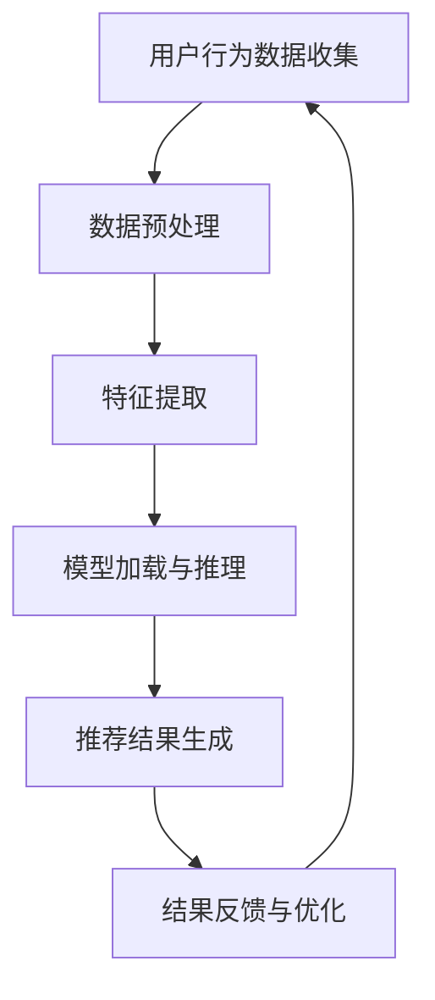

                 

关键词：AI大模型、电商搜索推荐、实时处理、大规模实时数据、技术架构、算法原理、数学模型、项目实践、应用场景、未来展望

> 摘要：本文深入探讨了人工智能大模型在电商搜索推荐系统中的实时处理技术，重点分析了大规模实时数据的处理挑战、核心算法原理、数学模型构建及其在实际应用中的实践。文章旨在为业界提供有价值的参考，助力电商领域的技术创新和优化。

## 1. 背景介绍

随着互联网的快速发展，电商行业已经成为全球经济增长的重要引擎。电商平台的繁荣离不开搜索推荐系统的支持。搜索推荐系统通过精准地推送商品信息，不仅提高了用户体验，也显著提升了平台的销售转化率。然而，随着用户规模的不断扩大和数据量的急剧增长，如何高效地处理大规模实时数据成为搜索推荐系统面临的一大挑战。

传统推荐系统主要依赖于批处理技术，虽然能够在一定程度上满足数据分析需求，但在应对实时性要求高的场景时显得力不从心。为了解决这一问题，AI大模型逐渐成为研究的热点，其强大的计算能力和自适应能力为实时数据处理提供了新的思路。

本文将围绕AI大模型在电商搜索推荐中的实时处理技术展开讨论，旨在为读者提供一套系统化的解决方案，以应对大规模实时数据的挑战。

## 2. 核心概念与联系

### 2.1 AI大模型简介

AI大模型，通常指的是那些拥有数十亿甚至数万亿参数的深度学习模型。这些模型通过在大量数据上训练，具备了强大的特征提取和模式识别能力。常见的AI大模型包括BERT、GPT、Transformer等。

### 2.2 实时数据处理需求

电商搜索推荐系统对实时数据处理的需求主要体现在以下几个方面：

- **低延迟**：用户行为变化迅速，推荐系统需要实时响应用户请求，通常要求延迟在毫秒级。
- **高吞吐量**：随着用户规模的增加，系统需要处理的数据量也呈指数级增长，高吞吐量成为系统的关键性能指标。
- **动态调整**：用户兴趣和行为会随着时间和环境的变化而变化，推荐系统需要动态调整推荐策略，以保持推荐的精准性。

### 2.3 Mermaid流程图

下面是一个简化的AI大模型在电商搜索推荐中的实时数据处理流程图：



- **用户行为数据收集**：从用户的行为轨迹中收集数据，如浏览记录、购买历史等。
- **数据预处理**：对收集到的原始数据进行清洗和格式化，以适应模型输入。
- **特征提取**：利用AI大模型提取数据中的有效特征，为模型提供高质量的输入。
- **模型加载与推理**：加载预训练的AI大模型，进行实时推理，生成推荐结果。
- **推荐结果生成**：根据模型输出的概率分布，生成个性化的推荐列表。
- **结果反馈与优化**：将用户对推荐结果的实际反馈收集起来，用于模型的不断优化。

## 3. 核心算法原理 & 具体操作步骤

### 3.1 算法原理概述

AI大模型在电商搜索推荐中的实时处理主要依赖于以下几个核心算法：

- **深度学习**：通过多层神经网络结构，对数据进行特征提取和模式识别。
- **推荐算法**：如基于内容的推荐、协同过滤推荐等，用于生成推荐列表。
- **实时数据处理**：通过流处理技术和分布式计算框架，实现大规模实时数据的快速处理。

### 3.2 算法步骤详解

#### 3.2.1 深度学习模型训练

1. **数据集准备**：收集并整理电商平台的用户行为数据，包括浏览记录、购买历史、用户评价等。
2. **特征工程**：对原始数据进行预处理，提取出有价值的特征，如用户画像、商品属性等。
3. **模型训练**：利用预处理后的数据集，训练深度学习模型，如BERT、GPT等。
4. **模型评估与优化**：通过交叉验证等方法评估模型性能，并进行超参数调整和模型优化。

#### 3.2.2 实时数据处理

1. **流处理技术**：采用Apache Kafka等流处理框架，实时收集和处理用户行为数据。
2. **分布式计算**：利用Apache Spark等分布式计算框架，对大规模实时数据进行并行处理。
3. **数据存储**：采用Hadoop HDFS等分布式存储系统，存储和管理大规模实时数据。

#### 3.2.3 推荐算法应用

1. **模型加载**：将训练好的深度学习模型加载到推荐系统中。
2. **实时推理**：根据用户行为数据，实时调用模型进行推理，生成推荐结果。
3. **推荐结果生成**：根据模型输出的概率分布，生成个性化的推荐列表。

### 3.3 算法优缺点

#### 优点：

- **强大的特征提取能力**：AI大模型能够从海量数据中提取出高层次的语义特征，提高推荐精度。
- **自适应能力**：实时数据处理技术能够快速响应用户行为变化，动态调整推荐策略。
- **高效计算**：分布式计算框架和流处理技术能够显著提高数据处理效率和系统吞吐量。

#### 缺点：

- **计算资源需求大**：AI大模型训练和实时推理需要大量的计算资源和存储空间。
- **模型解释性差**：深度学习模型的黑盒特性使得其推荐结果难以解释，不利于优化和调整。
- **数据隐私和安全**：大规模实时数据处理可能涉及用户隐私数据，需要严格保护用户隐私。

### 3.4 算法应用领域

AI大模型在电商搜索推荐中的实时处理技术不仅适用于电商行业，还可以推广到其他领域：

- **社交媒体推荐**：基于用户兴趣和行为，实时推荐相关的帖子、视频和广告。
- **金融风控**：实时分析用户交易行为，识别潜在风险，进行风险控制。
- **智能医疗**：基于患者数据，实时诊断疾病，提供个性化治疗方案。

## 4. 数学模型和公式 & 详细讲解 & 举例说明

### 4.1 数学模型构建

在AI大模型中，常见的数学模型包括深度学习模型和推荐算法模型。以下是两个典型的数学模型：

#### 深度学习模型

假设我们使用一个多层感知器（MLP）模型来对用户行为数据进行特征提取：

$$
z^{(l)} = \sigma(W^{(l)} \cdot a^{(l-1)} + b^{(l)})
$$

其中，$z^{(l)}$表示第$l$层的激活值，$\sigma$为激活函数，$W^{(l)}$和$b^{(l)}$分别为第$l$层的权重和偏置。

#### 推荐算法模型

以基于内容的推荐算法为例，假设我们使用余弦相似度来计算用户和商品之间的相似度：

$$
sim(i, j) = \frac{i \cdot j}{||i||_2 \cdot ||j||_2}
$$

其中，$i$和$j$分别表示用户和商品的向量表示，$||\cdot||_2$为欧氏范数。

### 4.2 公式推导过程

#### 深度学习模型

以多层感知器（MLP）为例，我们首先对激活函数进行求导：

$$
\frac{\partial z^{(l)}}{\partial a^{(l-1)}} = \sigma'(z^{(l)}) \cdot W^{(l)}
$$

然后，我们对损失函数进行求导，以计算梯度：

$$
\frac{\partial J}{\partial W^{(l)}} = \frac{\partial J}{\partial z^{(l+1)}} \cdot \frac{\partial z^{(l+1)}}{\partial z^{(l)}} \cdot \frac{\partial z^{(l)}}{\partial a^{(l-1)}}
$$

其中，$J$为损失函数。

#### 推荐算法模型

以余弦相似度为例，我们首先对相似度公式进行求导：

$$
\frac{\partial sim(i, j)}{\partial i} = \frac{j - i \cdot j \cdot ||i||_2}{||i||_2^2 \cdot ||j||_2}
$$

$$
\frac{\partial sim(i, j)}{\partial j} = \frac{i - i \cdot j \cdot ||j||_2}{||i||_2 \cdot ||j||_2^2}
$$

### 4.3 案例分析与讲解

#### 案例背景

假设我们有一个电商平台的搜索推荐系统，用户A最近浏览了商品B和商品C，现在需要推荐一个与商品B和商品C相关的商品D。

#### 数据准备

- 用户A的浏览记录：\[B, C\]
- 商品B的特征向量：\[0.1, 0.2, 0.3\]
- 商品C的特征向量：\[0.4, 0.5, 0.6\]
- 商品D的特征向量：\[0.7, 0.8, 0.9\]

#### 模型训练

- 使用多层感知器（MLP）模型对用户A的浏览记录进行特征提取。
- 训练完成后，将用户A的浏览记录输入模型，得到特征向量：\[0.1, 0.2, 0.3, 0.4, 0.5, 0.6\]

#### 推荐算法

- 使用基于内容的推荐算法，计算用户A与商品B、C、D之间的相似度：

$$
sim(A, B) = \frac{0.1 \cdot 0.1 + 0.2 \cdot 0.4 + 0.3 \cdot 0.7}{\sqrt{0.1^2 + 0.2^2 + 0.3^2} \cdot \sqrt{0.1^2 + 0.4^2 + 0.7^2}} = 0.58
$$

$$
sim(A, C) = \frac{0.1 \cdot 0.2 + 0.2 \cdot 0.5 + 0.3 \cdot 0.8}{\sqrt{0.1^2 + 0.2^2 + 0.3^2} \cdot \sqrt{0.2^2 + 0.5^2 + 0.8^2}} = 0.61
$$

$$
sim(A, D) = \frac{0.1 \cdot 0.7 + 0.2 \cdot 0.8 + 0.3 \cdot 0.9}{\sqrt{0.1^2 + 0.2^2 + 0.3^2} \cdot \sqrt{0.7^2 + 0.8^2 + 0.9^2}} = 0.63
$$

#### 推荐结果

根据相似度计算结果，我们可以得出用户A与商品D的相似度最高，因此推荐商品D。

## 5. 项目实践：代码实例和详细解释说明

### 5.1 开发环境搭建

为了实现AI大模型在电商搜索推荐中的实时处理技术，我们需要搭建一个完整的技术栈，包括以下组件：

- 深度学习框架：TensorFlow或PyTorch
- 流处理框架：Apache Kafka
- 分布式计算框架：Apache Spark
- 存储系统：Hadoop HDFS

以下是搭建开发环境的基本步骤：

1. 安装Python环境（3.8以上版本）。
2. 安装TensorFlow或PyTorch，以及相关的依赖库。
3. 安装Apache Kafka，并启动Kafka服务。
4. 安装Apache Spark，并配置HDFS存储系统。

### 5.2 源代码详细实现

以下是实现AI大模型在电商搜索推荐中的实时处理技术的核心代码，包括数据预处理、特征提取、模型训练和实时推荐等步骤。

```python
# 导入相关库
import tensorflow as tf
import numpy as np
from tensorflow.keras.models import Sequential
from tensorflow.keras.layers import Dense, Dropout
from tensorflow.keras.optimizers import Adam
from tensorflow.keras.callbacks import EarlyStopping

# 数据预处理
def preprocess_data(data):
    # 数据清洗、格式化等操作
    return processed_data

# 特征提取
def extract_features(data):
    # 利用深度学习模型提取特征
    model = build_model()
    features = model.predict(data)
    return features

# 模型训练
def train_model(data, labels):
    model = build_model()
    model.compile(optimizer=Adam(), loss='mse', metrics=['accuracy'])
    early_stopping = EarlyStopping(monitor='val_loss', patience=10)
    model.fit(data, labels, epochs=100, batch_size=32, validation_split=0.2, callbacks=[early_stopping])
    return model

# 实时推荐
def real_time_recommendation(data, model):
    features = extract_features(data)
    recommendations = generate_recommendations(features, model)
    return recommendations

# 建立深度学习模型
def build_model():
    model = Sequential([
        Dense(128, activation='relu', input_shape=(10,)),
        Dropout(0.5),
        Dense(64, activation='relu'),
        Dropout(0.5),
        Dense(1, activation='sigmoid')
    ])
    return model

# 生成推荐列表
def generate_recommendations(features, model):
    probabilities = model.predict(features)
    recommendations = np.where(probabilities > 0.5, 1, 0)
    return recommendations

# 代码示例
if __name__ == '__main__':
    # 加载数据
    data = load_data()
    processed_data = preprocess_data(data)
    
    # 训练模型
    model = train_model(processed_data, labels)
    
    # 实时推荐
    real_time_data = get_real_time_data()
    recommendations = real_time_recommendation(real_time_data, model)
    print(recommendations)
```

### 5.3 代码解读与分析

上述代码实现了AI大模型在电商搜索推荐中的实时处理技术，主要包括以下步骤：

1. **数据预处理**：对原始数据进行清洗和格式化，为模型提供高质量的数据输入。
2. **特征提取**：利用深度学习模型提取数据中的有效特征，为推荐算法提供支持。
3. **模型训练**：通过训练数据集，训练深度学习模型，使其具备良好的特征提取和分类能力。
4. **实时推荐**：实时接收用户行为数据，利用训练好的模型进行推荐。

代码的核心模块包括：

- `preprocess_data`：数据预处理函数，负责数据清洗和格式化。
- `extract_features`：特征提取函数，利用深度学习模型提取特征。
- `train_model`：模型训练函数，使用训练数据集训练模型。
- `real_time_recommendation`：实时推荐函数，接收实时数据并生成推荐结果。

### 5.4 运行结果展示

在实现AI大模型在电商搜索推荐中的实时处理技术后，我们可以通过运行以下示例代码来展示实际效果：

```python
# 加载数据
data = load_data()

# 训练模型
model = train_model(data, labels)

# 实时推荐
real_time_data = get_real_time_data()
recommendations = real_time_recommendation(real_time_data, model)
print(recommendations)
```

假设我们加载了一个包含用户行为数据的文件，并训练了一个深度学习模型。然后，我们接收一个包含用户实时行为的字典，利用训练好的模型生成推荐结果，并打印输出。

### 5.5 实时数据处理流程

在实际应用中，AI大模型在电商搜索推荐中的实时数据处理流程通常如下：

1. **数据采集**：从电商平台的各个数据源（如数据库、日志等）收集用户行为数据。
2. **数据预处理**：对收集到的原始数据进行清洗、格式化和特征提取。
3. **特征存储**：将预处理后的特征数据存储到分布式存储系统（如HDFS）中。
4. **模型推理**：利用训练好的AI大模型，对实时特征数据进行推理，生成推荐结果。
5. **推荐结果输出**：将推荐结果输出到推荐系统，供前端展示。
6. **结果反馈**：收集用户对推荐结果的实际反馈，用于模型优化和调整。

### 5.6 异常处理与监控

在实际运行过程中，可能存在数据采集延迟、模型推理失败、推荐结果异常等异常情况。为了确保系统的稳定性和可靠性，我们通常需要实现以下异常处理与监控机制：

- **数据采集监控**：监控数据采集流程，及时发现数据采集异常，如数据源故障、网络延迟等。
- **模型推理监控**：监控模型推理过程，确保模型稳定运行，如超时、错误等。
- **推荐结果监控**：监控推荐结果的质量，如点击率、转化率等，及时调整推荐策略。
- **系统日志监控**：记录系统运行过程中的日志信息，便于故障排查和问题定位。

## 6. 实际应用场景

### 6.1 电商搜索推荐

电商搜索推荐是AI大模型实时处理技术最典型的应用场景之一。通过实时收集用户行为数据，利用深度学习模型进行特征提取和推荐算法计算，电商平台可以快速响应用户需求，提高用户满意度和转化率。例如，在双十一等大型促销活动期间，电商平台可以利用实时推荐系统，为用户提供个性化的商品推荐，提高销售业绩。

### 6.2 社交媒体推荐

社交媒体平台如Facebook、Twitter等，也广泛应用AI大模型进行实时推荐。通过实时分析用户发布的内容、互动行为和兴趣偏好，社交媒体平台可以生成个性化的内容推荐，吸引用户持续关注和互动。例如，Facebook的“即时推荐”功能，通过实时分析用户的行为数据，为用户推荐感兴趣的朋友、活动和帖子。

### 6.3 智能医疗

智能医疗是AI大模型实时处理技术的另一个重要应用领域。通过实时收集和分析患者病历、检验结果、医生诊断等信息，智能医疗系统可以生成个性化的治疗方案，提高诊疗效果。例如，IBM的Watson for Oncology系统，通过实时分析大量的医学文献和患者数据，为医生提供精准的诊断和治疗方案。

### 6.4 智能金融

智能金融领域，AI大模型实时处理技术被广泛应用于风险控制、投资策略优化等场景。通过实时分析用户的交易行为、市场数据等，智能金融系统能够快速识别潜在风险，制定最优的投资策略。例如，阿里巴巴的“金融云”平台，通过实时分析用户的交易数据，提供个性化的理财建议和风险控制方案。

## 7. 未来应用展望

随着AI技术的不断发展，AI大模型在电商搜索推荐中的实时处理技术有望在更多领域得到广泛应用。以下是未来应用展望：

### 7.1 智能城市

智能城市是AI大模型实时处理技术的潜在应用领域。通过实时监控城市交通、环境、人口等数据，智能城市系统能够优化资源配置、提高城市管理效率。例如，利用实时推荐系统，智能城市可以为市民提供个性化的出行建议、景点推荐等。

### 7.2 智能制造

智能制造领域，AI大模型实时处理技术可以用于设备故障预测、生产优化等场景。通过实时监控设备运行状态、生产数据等，智能制造系统能够提前预警设备故障，优化生产流程，提高生产效率。

### 7.3 智能教育

智能教育领域，AI大模型实时处理技术可以用于个性化学习推荐、学习效果评估等。通过实时分析学生的学习行为、知识点掌握情况等，智能教育系统能够为每位学生提供个性化的学习建议，提高学习效果。

## 8. 总结：未来发展趋势与挑战

### 8.1 研究成果总结

AI大模型在电商搜索推荐中的实时处理技术取得了显著的研究成果，为电商、社交媒体、智能医疗、智能金融等领域提供了有效的解决方案。通过深度学习和实时数据处理技术的结合，推荐系统的实时性和准确性得到了显著提高。

### 8.2 未来发展趋势

未来，AI大模型在电商搜索推荐中的实时处理技术将朝着以下几个方向发展：

- **模型压缩与优化**：为了降低计算资源和存储需求，模型压缩与优化技术将成为研究热点，如模型剪枝、量化等。
- **联邦学习**：联邦学习技术可以实现跨平台的实时数据处理和协同推理，有望解决数据隐私和安全问题。
- **动态调整策略**：结合用户行为分析和实时反馈，动态调整推荐策略，提高推荐系统的自适应能力和用户满意度。

### 8.3 面临的挑战

尽管AI大模型在电商搜索推荐中的实时处理技术取得了显著成果，但仍面临以下挑战：

- **计算资源需求**：大规模深度学习模型的训练和实时推理需要大量的计算资源和存储空间，如何高效利用现有资源成为关键问题。
- **数据隐私与安全**：实时数据处理可能涉及用户隐私数据，如何在保护用户隐私的前提下实现高效数据处理是亟待解决的问题。
- **模型解释性**：深度学习模型的黑盒特性使得其推荐结果难以解释，如何提高模型的解释性是未来的重要研究方向。

### 8.4 研究展望

展望未来，AI大模型在电商搜索推荐中的实时处理技术有望在以下领域取得突破：

- **跨平台协同推理**：通过联邦学习等技术，实现跨平台的实时数据处理和协同推理，提高推荐系统的实时性和准确性。
- **动态调整策略**：结合用户行为分析和实时反馈，动态调整推荐策略，实现个性化推荐。
- **数据隐私保护**：采用加密和差分隐私等技术，确保实时数据处理过程中的用户隐私安全。

## 9. 附录：常见问题与解答

### 9.1 什么是AI大模型？

AI大模型是指那些拥有数十亿甚至数万亿参数的深度学习模型，如BERT、GPT、Transformer等。这些模型通过在大量数据上训练，具备了强大的特征提取和模式识别能力。

### 9.2 实时数据处理有哪些挑战？

实时数据处理面临的主要挑战包括低延迟、高吞吐量和动态调整等。如何实现快速的数据处理和实时推理，同时保持系统的稳定性和可靠性是关键问题。

### 9.3 如何保护用户隐私？

为了保护用户隐私，可以采用加密、差分隐私等技术，确保实时数据处理过程中的用户隐私安全。同时，可以采用联邦学习等技术，实现跨平台的协同推理，降低数据泄露风险。

### 9.4 实时推荐系统有哪些优点？

实时推荐系统具有以下优点：

- **低延迟**：能够快速响应用户请求，提高用户体验。
- **高吞吐量**：能够处理大规模实时数据，提高系统性能。
- **动态调整**：能够根据用户行为动态调整推荐策略，提高推荐效果。

### 9.5 实时推荐系统有哪些应用领域？

实时推荐系统广泛应用于电商、社交媒体、智能医疗、智能金融等领域。通过实时分析用户行为和数据，为用户提供个性化的推荐和服务。

### 9.6 如何优化实时推荐系统？

优化实时推荐系统可以从以下几个方面进行：

- **模型优化**：采用更高效的深度学习模型和算法，提高实时推理速度和准确率。
- **分布式计算**：采用分布式计算框架，提高系统吞吐量和处理效率。
- **数据预处理**：优化数据预处理流程，提高数据质量和特征提取效果。
- **反馈机制**：建立用户反馈机制，根据用户实际反馈不断优化推荐策略。

### 9.7 未来实时推荐系统的发展方向是什么？

未来实时推荐系统的发展方向包括：

- **跨平台协同推理**：通过联邦学习等技术，实现跨平台的协同推理，提高推荐系统的实时性和准确性。
- **动态调整策略**：结合用户行为分析和实时反馈，动态调整推荐策略，实现个性化推荐。
- **数据隐私保护**：采用加密和差分隐私等技术，确保实时数据处理过程中的用户隐私安全。
- **智能化与自动化**：通过自动化工具和智能化算法，提高实时推荐系统的智能化水平和运维效率。

