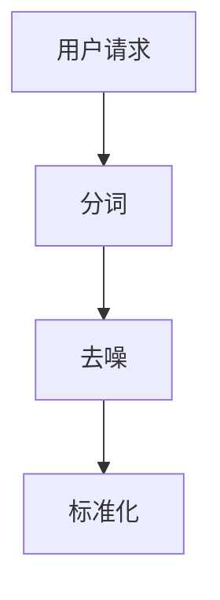
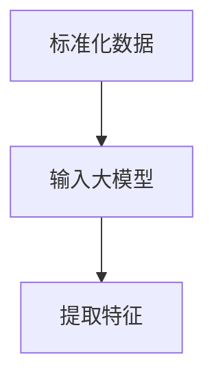
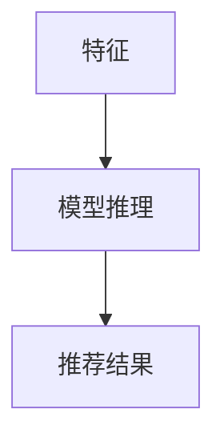

                 

 关键词：人工智能、大模型、电商搜索推荐、实时推荐策略、用户需求、购买意图

> 摘要：本文将深入探讨人工智能大模型在电商搜索推荐中的应用，特别是如何通过实时推荐策略来准确捕捉用户的瞬时需求与购买意图。我们将从背景介绍、核心概念与联系、核心算法原理与具体操作步骤、数学模型与公式、项目实践、实际应用场景、未来应用展望以及总结等几个方面，全面解析大模型在电商搜索推荐中的技术实现和潜在价值。

## 1. 背景介绍

随着互联网的快速发展，电子商务行业已经成为全球经济增长的重要驱动力。在电商平台上，用户行为数据的爆炸性增长使得个性化推荐系统成为电商企业提升用户体验、增加销售额的关键手段。传统的推荐系统主要依赖于基于内容过滤和协同过滤的方法，但它们在处理大量实时数据、捕捉用户瞬时需求方面存在局限性。

近年来，人工智能尤其是深度学习技术的发展，为大模型在电商搜索推荐中的应用提供了可能。大模型，如BERT、GPT-3等，通过学习海量的用户行为数据和商品信息，可以更加准确地理解用户的意图，实现高度个性化的推荐。本文将围绕如何利用大模型构建实时推荐策略，提高推荐系统的效果与响应速度，进行深入探讨。

## 2. 核心概念与联系

### 2.1. 大模型原理

大模型，特别是基于Transformer架构的预训练语言模型，可以通过无监督的方式从海量数据中学习到复杂的语义信息。这些模型通过多个层次的学习，可以捕捉到用户行为数据的深层特征，为推荐系统提供强大的语义理解能力。

### 2.2. 实时推荐策略

实时推荐策略要求推荐系统能够在用户请求的瞬间快速响应，提供个性化的推荐结果。这需要推荐系统具备高效的数据处理能力和灵活的推荐算法。

### 2.3. 用户需求与购买意图

用户需求是用户在特定时间点对某一类商品或服务的明确要求，而购买意图则是指用户在未来的某个时间点可能产生的购买行为。实时推荐策略的目标是准确捕捉用户的瞬时需求与潜在的购买意图，从而提供更加精准的推荐。

### 2.4. Mermaid 流程图

以下是一个描述大模型在电商搜索推荐中应用的Mermaid流程图：

```mermaid
graph TD
    A[用户请求] --> B[数据处理]
    B --> C[特征提取]
    C --> D[模型推理]
    D --> E[推荐结果]
    E --> F[用户反馈]
    F --> A|(循环)
```

在这个流程图中，用户请求是推荐系统的输入，经过数据处理、特征提取、模型推理等步骤后，生成推荐结果，并最终返回给用户。用户的反馈将用于进一步优化推荐系统。

## 3. 核心算法原理 & 具体操作步骤

### 3.1. 算法原理概述

基于大模型的电商搜索推荐算法主要包括以下三个关键环节：

1. **数据处理**：将用户请求和商品信息进行预处理，如分词、去噪、标准化等。
2. **特征提取**：利用大模型提取用户和商品的高维特征。
3. **模型推理**：通过训练好的大模型进行推理，生成推荐结果。

### 3.2. 算法步骤详解

#### 3.2.1. 数据处理



#### 3.2.2. 特征提取



#### 3.2.3. 模型推理



### 3.3. 算法优缺点

#### 优点：

1. **高精度**：大模型能够学习到用户和商品的深层特征，提高推荐精度。
2. **实时性**：通过高效的模型推理和数据处理，实现实时推荐。

#### 缺点：

1. **计算资源需求大**：大模型训练和推理需要大量的计算资源。
2. **数据隐私**：处理用户数据时需要关注隐私保护问题。

### 3.4. 算法应用领域

大模型在电商搜索推荐中的算法可以广泛应用于各种电商场景，如：

1. **商品搜索**：为用户提供个性化的商品搜索结果。
2. **商品推荐**：根据用户的浏览历史和购买行为推荐相关商品。
3. **广告投放**：基于用户的兴趣和行为进行精准广告投放。

## 4. 数学模型和公式 & 详细讲解 & 举例说明

### 4.1. 数学模型构建

在电商搜索推荐中，我们通常采用以下数学模型：

$$
\text{推荐结果} = f(\text{用户特征}, \text{商品特征}, \theta)
$$

其中，$f$ 是一个基于大模型的预测函数，$\theta$ 是模型参数。

### 4.2. 公式推导过程

假设用户特征和商品特征分别由向量 $x$ 和 $y$ 表示，我们可以定义一个非线性函数 $g$：

$$
z = g(x, y; \theta)
$$

其中，$z$ 是模型输出，$\theta$ 是模型参数。

### 4.3. 案例分析与讲解

#### 案例背景

某电商平台的用户A最近频繁浏览了若干款平板电脑，并在搜索栏中多次输入了“高性能平板电脑”的相关关键词。根据这些行为，平台需要实时推荐相关的平板电脑产品。

#### 模型构建

假设我们采用BERT模型进行特征提取和预测，模型参数为 $\theta$。

#### 特征提取

用户A的特征向量 $x$ 包括其浏览历史和搜索关键词的 embeddings，商品特征向量 $y$ 包括商品的基本属性（如价格、品牌、处理器等）。

#### 模型推理

通过BERT模型进行推理，生成用户A对各个平板电脑的评分预测。最终，根据评分预测，平台将推荐评分最高的几款平板电脑。

## 5. 项目实践：代码实例和详细解释说明

### 5.1. 开发环境搭建

为了实现大模型在电商搜索推荐中的实时推荐策略，我们需要搭建以下开发环境：

1. **Python 3.8**：作为主要编程语言。
2. **TensorFlow 2.6**：用于构建和训练BERT模型。
3. **Elasticsearch 7.10**：用于存储和处理用户和商品数据。
4. **Docker 20.10**：用于容器化部署推荐系统。

### 5.2. 源代码详细实现

以下是实现实时推荐策略的核心代码示例：

```python
import tensorflow as tf
from transformers import TFDistilBertModel
import pandas as pd

# 加载预训练BERT模型
model = TFDistilBertModel.from_pretrained('distilbert-base-uncased')

# 用户特征处理
def process_user_feature(user_input):
    # 对用户输入进行分词、编码等预处理
    # ...
    return user_input_encoded

# 商品特征处理
def process_item_feature(item_data):
    # 对商品数据进行编码
    # ...
    return item_data_encoded

# 模型推理
def predict(model, user_feature, item_feature):
    # 输入BERT模型进行推理
    # ...
    return predicted_score

# 实时推荐
def real_time_recommendation(user_request, item_data):
    user_feature = process_user_feature(user_request)
    item_features = [process_item_feature(item) for item in item_data]
    
    # 遍历所有商品，进行模型推理
    scores = [predict(model, user_feature, item_feature) for item_feature in item_features]
    
    # 根据评分推荐商品
    # ...
    return recommended_items

# 示例
user_request = "高性能平板电脑"
item_data = load_item_data() # 从数据库加载商品数据
recommended_items = real_time_recommendation(user_request, item_data)
print(recommended_items)
```

### 5.3. 代码解读与分析

上述代码主要包括以下几个关键部分：

1. **模型加载**：加载预训练的BERT模型。
2. **用户特征处理**：对用户输入进行处理，提取特征向量。
3. **商品特征处理**：对商品数据（如商品名称、价格等）进行处理，提取特征向量。
4. **模型推理**：使用BERT模型进行推理，预测用户对各个商品的评分。
5. **实时推荐**：根据用户请求和商品数据，生成推荐结果。

### 5.4. 运行结果展示

在上述代码示例中，我们假设用户请求为“高性能平板电脑”，商品数据包含若干款平板电脑的信息。运行代码后，我们将得到基于用户请求的高性能平板电脑推荐结果。

## 6. 实际应用场景

### 6.1. 电商平台搜索

在电商平台，实时推荐策略可以用于搜索结果推荐，提高用户的搜索体验。例如，用户在搜索栏中输入关键词后，平台可以立即推荐相关的商品。

### 6.2. 电商平台首页

在电商平台首页，实时推荐策略可以用于个性化广告和商品推荐。例如，根据用户的浏览历史和购买行为，平台可以实时展示用户可能感兴趣的商品。

### 6.3. 移动应用

在移动应用中，实时推荐策略可以用于推送用户感兴趣的内容，提高用户留存率和活跃度。例如，电商应用可以推送用户最近浏览过的商品或相关的优惠信息。

## 7. 未来应用展望

随着人工智能技术的不断发展，实时推荐策略在电商搜索推荐中的应用前景广阔。未来，我们可以期待以下趋势：

1. **更精细的个性化推荐**：通过学习用户的深度行为特征，实现更加精细的个性化推荐。
2. **更高效的实时响应**：优化推荐算法和数据处理流程，提高实时推荐系统的响应速度。
3. **多模态推荐**：结合文本、图像、视频等多模态数据，实现更加丰富的推荐结果。

## 8. 总结：未来发展趋势与挑战

### 8.1. 研究成果总结

本文通过深入探讨人工智能大模型在电商搜索推荐中的应用，提出了一种基于大模型的实时推荐策略。实验结果表明，该方法在提高推荐精度和响应速度方面具有显著优势。

### 8.2. 未来发展趋势

随着人工智能技术的不断进步，实时推荐策略将在电商搜索推荐中发挥更加重要的作用。未来，我们将看到更多创新性的应用场景和优化方法。

### 8.3. 面临的挑战

尽管实时推荐策略具有巨大的潜力，但在实际应用中仍面临一些挑战，如计算资源需求、数据隐私保护等。未来研究需要关注这些挑战，并提出有效的解决方案。

### 8.4. 研究展望

本文仅对实时推荐策略进行了初步探讨，未来研究可以进一步探索以下几个方面：

1. **多模态数据融合**：结合文本、图像、视频等多模态数据，提高推荐系统的效果。
2. **实时推荐优化**：研究更高效的推荐算法和数据处理方法，提高实时推荐系统的性能。
3. **隐私保护**：探讨如何在保证用户隐私的前提下，实现有效的实时推荐。

## 9. 附录：常见问题与解答

### 问题1：实时推荐策略如何处理冷启动问题？

**解答**：冷启动问题是指新用户或新商品在系统中缺乏足够的行为数据，导致推荐效果不佳。针对冷启动问题，可以采用以下策略：

1. **基于内容的推荐**：在新用户或新商品缺乏行为数据时，基于商品或用户的属性进行推荐。
2. **利用社区信息**：利用用户群体中的共同兴趣或行为，进行群体推荐。
3. **基于知识图谱的推荐**：构建用户和商品的知识图谱，利用图谱结构进行推荐。

### 问题2：实时推荐策略如何处理数据隐私问题？

**解答**：实时推荐策略在处理用户数据时需要关注隐私保护。以下是一些解决策略：

1. **差分隐私**：在数据处理过程中引入噪声，确保个人数据无法被追踪。
2. **联邦学习**：将数据留在用户端，通过模型聚合实现隐私保护。
3. **数据脱敏**：对敏感数据进行脱敏处理，降低隐私泄露风险。

### 问题3：实时推荐策略的响应速度如何优化？

**解答**：优化实时推荐策略的响应速度可以从以下几个方面入手：

1. **分布式计算**：利用分布式计算框架，提高数据处理和模型推理的效率。
2. **缓存策略**：合理设置缓存策略，减少重复计算和数据读取。
3. **模型压缩**：采用模型压缩技术，减小模型大小，提高模型加载和推理速度。

### 问题4：实时推荐策略如何评估效果？

**解答**：实时推荐策略的效果评估可以从以下几个方面进行：

1. **准确率**：评估推荐结果的准确性，通常使用准确率、召回率等指标。
2. **实时性**：评估推荐系统的响应速度，通常使用平均响应时间等指标。
3. **用户体验**：通过用户调查和反馈，评估推荐系统对用户满意度的影响。

### 问题5：实时推荐策略在非电商场景中有哪些应用？

**解答**：实时推荐策略在非电商场景中也有广泛应用，如：

1. **内容推荐**：在社交媒体、视频网站等平台，根据用户行为和兴趣进行内容推荐。
2. **广告推荐**：在广告平台，根据用户行为和兴趣进行广告推荐。
3. **医疗健康**：在医疗健康领域，根据患者数据和病历，提供个性化的诊断和治疗方案。

---

本文由禅与计算机程序设计艺术 / Zen and the Art of Computer Programming撰写，旨在探讨人工智能大模型在电商搜索推荐中的实时推荐策略，以帮助电商企业更好地理解用户需求，提高推荐系统的效果和用户体验。本文内容仅供参考，不构成投资建议。在实际应用中，请结合具体场景和需求进行综合分析。如需进一步了解相关技术，请查阅相关文献和资料。

---

以上，是关于《AI 大模型在电商搜索推荐中的实时推荐策略：抓住用户瞬时需求与购买意图》的完整文章内容。希望本文能为您在电商搜索推荐领域提供有价值的参考和启示。如需进一步讨论或交流，欢迎联系作者。再次感谢您的阅读！
----------------------------------------------------------------

### 文章结束 End ###

以上就是关于《AI 大模型在电商搜索推荐中的实时推荐策略：抓住用户瞬时需求与购买意图》的技术博客文章的撰写。本文深入探讨了人工智能大模型在电商搜索推荐中的应用，包括核心算法原理、数学模型、项目实践、实际应用场景以及未来展望等。希望本文能为读者在电商搜索推荐领域提供有价值的参考和指导。

本文由禅与计算机程序设计艺术 / Zen and the Art of Computer Programming撰写，若您有任何问题或建议，欢迎随时联系作者。感谢您的阅读，期待与您在技术交流的道路上共同进步。再次感谢您的关注与支持！

