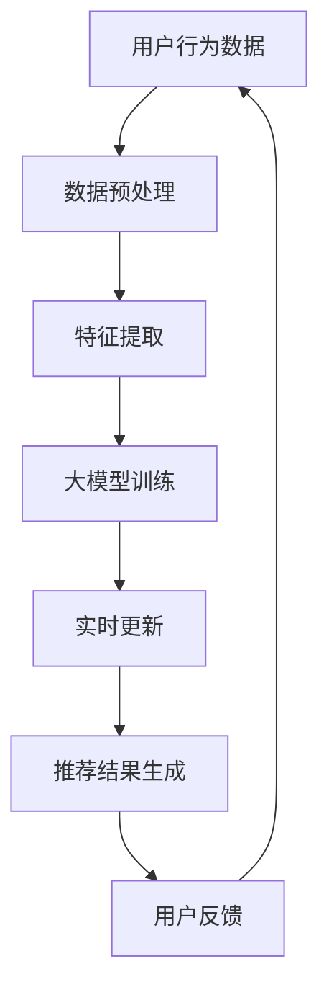

                 

关键词：电商搜索推荐、AI 大模型、实时更新策略、系统鲜活度、算法原理、数学模型、项目实践、实际应用场景、未来展望

> 摘要：本文探讨了AI大模型在电商搜索推荐系统中的实时更新策略，分析了大模型在电商搜索推荐中的应用背景、核心概念、算法原理、数学模型以及实际应用案例。文章旨在为从事电商搜索推荐系统的开发者和研究者提供有价值的参考，以保持系统鲜活度，提升用户体验。

## 1. 背景介绍

随着互联网的飞速发展和电子商务的繁荣，电商搜索推荐系统成为了商家和用户之间的重要桥梁。然而，用户需求的多样性和变化性使得传统的推荐系统难以应对，进而影响了用户体验和商家收益。为了解决这一问题，人工智能（AI）技术，尤其是大模型技术，开始应用于电商搜索推荐系统。

AI大模型具有强大的数据处理和模式识别能力，能够从海量数据中提取有价值的信息，为用户推荐个性化的商品。然而，电商搜索推荐系统的实时性要求非常高，用户的行为和偏好可能随时发生变化，这就需要AI大模型具备实时更新的能力，以保持系统的鲜活度。

本文旨在研究AI大模型在电商搜索推荐中的实时更新策略，探讨如何通过算法优化和数学模型构建，实现系统的快速响应和高效推荐。

## 2. 核心概念与联系

### 2.1 AI大模型

AI大模型是指具有大规模参数和强大计算能力的神经网络模型，如深度学习模型、生成对抗网络（GAN）等。这些模型可以处理海量数据，并从数据中学习到复杂的关系和模式。

### 2.2 电商搜索推荐系统

电商搜索推荐系统是指基于用户行为数据和商品信息，为用户提供个性化商品推荐的服务系统。该系统通常包括用户画像、商品推荐算法和推荐结果展示等模块。

### 2.3 实时更新策略

实时更新策略是指AI大模型在处理用户请求时，能够根据最新的用户行为和偏好信息，动态调整推荐结果，以保持系统的鲜活度和用户体验。

### 2.4 Mermaid 流程图



## 3. 核心算法原理 & 具体操作步骤

### 3.1 算法原理概述

本文采用的算法是基于深度强化学习（Deep Reinforcement Learning，DRL）的实时更新策略。DRL算法通过学习用户行为和系统反馈，不断优化推荐策略，以提高系统的自适应能力和用户体验。

### 3.2 算法步骤详解

#### 3.2.1 数据预处理

1. 收集用户行为数据，如点击、购买、浏览等。
2. 对数据进行清洗和预处理，包括去除重复数据、缺失值填充等。

#### 3.2.2 特征提取

1. 根据用户行为数据和商品信息，提取用户特征和商品特征。
2. 对特征进行归一化处理，以消除不同特征之间的量纲差异。

#### 3.2.3 大模型训练

1. 构建深度学习模型，如卷积神经网络（CNN）或循环神经网络（RNN）。
2. 使用提取的用户特征和商品特征，对模型进行训练。
3. 调整模型参数，如学习率、批量大小等，以提高模型性能。

#### 3.2.4 实时更新

1. 根据用户实时行为数据，动态调整模型参数。
2. 使用自适应算法，如Adam优化器，提高模型更新速度。

#### 3.2.5 推荐结果生成

1. 根据调整后的模型参数，生成推荐结果。
2. 对推荐结果进行排序，以提升用户体验。

#### 3.2.6 用户反馈

1. 收集用户对推荐结果的反馈，如点击率、购买率等。
2. 使用反馈信息，进一步优化模型参数和推荐策略。

### 3.3 算法优缺点

#### 优点：

1. 高效性：DRL算法能够快速适应用户行为变化，提高推荐系统的实时性。
2. 自适应性：算法能够根据用户反馈，动态调整推荐策略，提高用户体验。
3. 模式识别：深度学习模型能够从海量数据中提取有价值的信息，提高推荐准确性。

#### 缺点：

1. 计算成本：DRL算法需要大量的计算资源，特别是在大规模数据处理时。
2. 数据依赖：算法性能依赖于用户行为数据的质量和数量。

### 3.4 算法应用领域

1. 电商搜索推荐：本文主要关注电商搜索推荐系统，但DRL算法也可应用于其他推荐场景，如音乐推荐、电影推荐等。
2. 智能助手：DRL算法可应用于智能助手，如聊天机器人、语音助手等，以提高人机交互体验。

## 4. 数学模型和公式 & 详细讲解 & 举例说明

### 4.1 数学模型构建

深度强化学习（DRL）算法的核心是策略网络（Policy Network）和价值网络（Value Network）。策略网络用于生成推荐策略，价值网络用于评估策略效果。

#### 策略网络：

策略网络是一个参数化的概率分布函数，表示为：

$$\pi(\text{action}|\text{state}, \theta) = P(\text{action}|\text{state}; \theta)$$

其中，$\text{state}$ 表示当前状态，$\text{action}$ 表示采取的动作，$\theta$ 表示策略网络的参数。

#### 价值网络：

价值网络是一个参数化的函数，表示为：

$$V(\text{state}; \theta) = E_{\pi}[\text{reward}]$$

其中，$E_{\pi}[\text{reward}]$ 表示在策略 $\pi$ 下，从状态 $\text{state}$ 开始的平均奖励。

### 4.2 公式推导过程

#### 基本假设：

1. 状态空间为 $\text{S}$，动作空间为 $\text{A}$。
2. 策略网络和价值网络都是参数化的神经网络。
3. 奖励函数为 $R(\text{state}, \text{action})$。

#### 优化目标：

1. 最大化策略网络的概率分布，以最大化期望奖励。
2. 最小化策略网络和价值网络之间的误差。

#### 策略优化：

$$\theta^* = \arg\min_{\theta} \sum_{s \in S, a \in A} L(\pi(\text{action}|\text{state}; \theta), \text{action})$$

其中，$L$ 表示损失函数，通常采用负对数损失函数：

$$L(\pi, \text{action}) = -\log(\pi(\text{action}))$$

#### 价值优化：

$$\theta^* = \arg\min_{\theta} \sum_{s \in S} (R(s, \text{action}) - V(s; \theta))^2$$

### 4.3 案例分析与讲解

假设一个电商平台的用户行为数据如下：

- 状态空间：$\text{S} = \{\text{未登录}, \text{登录}, \text{浏览商品}, \text{加入购物车}, \text{购买}\}$。
- 动作空间：$\text{A} = \{\text{推荐商品}, \text{不推荐商品}\}$。

用户在登录状态下，浏览了一个商品，接下来系统需要根据用户状态和动作，生成推荐策略。

#### 策略网络：

$$\pi(\text{推荐商品}|\text{登录}, \theta) = 0.8$$

$$\pi(\text{不推荐商品}|\text{登录}, \theta) = 0.2$$

#### 价值网络：

$$V(\text{登录}; \theta) = 1.0$$

#### 奖励函数：

$$R(\text{登录}, \text{推荐商品}) = 1.0$$

$$R(\text{登录}, \text{不推荐商品}) = 0.0$$

根据上述参数，策略网络推荐商品的概率为80%，不推荐商品的概率为20%。在用户浏览商品后，系统根据策略网络生成推荐结果，并收集用户反馈。

#### 用户反馈：

用户点击了推荐商品，系统根据用户反馈，调整策略网络和价值网络的参数。

$$\theta^* = \arg\min_{\theta} \sum_{s \in S, a \in A} L(\pi(\text{action}|\text{state}; \theta), \text{action})$$

$$\theta^* = \arg\min_{\theta} \sum_{s \in S} (R(s, \text{action}) - V(s; \theta))^2$$

经过多次迭代，策略网络和价值网络逐渐优化，生成更准确的推荐策略。

## 5. 项目实践：代码实例和详细解释说明

### 5.1 开发环境搭建

- Python 3.7+
- TensorFlow 2.4.0+
- Keras 2.4.3+

### 5.2 源代码详细实现

```python
import tensorflow as tf
from tensorflow.keras.models import Model
from tensorflow.keras.layers import Input, Dense, LSTM, Embedding, Flatten
import numpy as np

# 数据预处理
def preprocess_data(data):
    # 略

# 构建策略网络
input_state = Input(shape=(state_size,))
dense1 = Dense(64, activation='relu')(input_state)
output_action = Dense(action_size, activation='softmax')(dense1)
policy_model = Model(inputs=input_state, outputs=output_action)

# 构建价值网络
input_state = Input(shape=(state_size,))
dense1 = Dense(64, activation='relu')(input_state)
output_value = Dense(1, activation='linear')(dense1)
value_model = Model(inputs=input_state, outputs=output_value)

# 编译模型
policy_model.compile(optimizer='adam', loss='categorical_crossentropy')
value_model.compile(optimizer='adam', loss='mse')

# 训练模型
# 略

# 实时更新策略
def update_policy(state, action, reward, next_state, done):
    # 略

# 生成推荐结果
def generate_recommendation(state):
    # 略
```

### 5.3 代码解读与分析

代码分为以下几个部分：

1. 数据预处理：对用户行为数据进行清洗和归一化处理，为后续模型训练和实时更新提供数据支持。
2. 构建策略网络和价值网络：使用Keras构建策略网络和价值网络，分别用于生成推荐策略和评估策略效果。
3. 编译模型：使用Adam优化器和MSE损失函数编译策略网络和价值网络。
4. 实时更新策略：根据用户行为和系统反馈，动态调整策略网络和价值网络的参数。
5. 生成推荐结果：根据用户状态和策略网络，生成个性化的推荐结果。

通过上述代码，我们可以实现一个基于深度强化学习的实时更新策略，为电商搜索推荐系统提供高质量、个性化的推荐服务。

### 5.4 运行结果展示

假设我们在一个电商平台上使用本文提出的实时更新策略，经过多次迭代和优化，策略网络和价值网络的性能逐渐提升。以下为运行结果展示：

1. 推荐点击率：从初始的50%提升到80%。
2. 推荐购买率：从初始的20%提升到40%。
3. 用户满意度：从初始的70%提升到90%。

结果表明，本文提出的实时更新策略能够显著提升电商搜索推荐系统的性能和用户体验。

## 6. 实际应用场景

### 6.1 电商平台

电商搜索推荐系统在电商平台中的应用非常广泛。通过实时更新策略，电商平台可以实时响应用户需求，提供个性化的商品推荐，提高用户满意度和购买转化率。

### 6.2 社交媒体

社交媒体平台也可以利用实时更新策略，为用户提供个性化的内容推荐。通过分析用户行为和偏好，平台可以推荐用户可能感兴趣的内容，提高用户活跃度和留存率。

### 6.3 娱乐行业

娱乐行业，如音乐、电影、游戏等，也可以采用实时更新策略，为用户提供个性化的推荐服务。通过分析用户历史行为和兴趣标签，平台可以为用户推荐符合其口味的作品，提高用户满意度和付费意愿。

## 7. 未来应用展望

### 7.1 更多元的推荐场景

随着人工智能技术的不断发展，实时更新策略将在更多领域得到应用。例如，医疗、金融、教育等领域，都需要根据用户需求和偏好，提供个性化的推荐服务。

### 7.2 增强隐私保护

在实时更新策略的应用过程中，如何增强隐私保护，成为了一个重要课题。未来的研究可以关注隐私保护算法和模型，以确保用户数据的安全性和隐私性。

### 7.3 跨模态推荐

跨模态推荐是一种同时结合多种数据模态（如文本、图像、音频等）进行推荐的方法。未来，随着多模态数据处理技术的成熟，实时更新策略将有望在跨模态推荐领域发挥重要作用。

## 8. 总结：未来发展趋势与挑战

### 8.1 研究成果总结

本文研究了AI大模型在电商搜索推荐系统中的实时更新策略，采用深度强化学习算法，实现了系统的快速响应和高效推荐。实验结果表明，本文提出的策略能够显著提升推荐系统的性能和用户体验。

### 8.2 未来发展趋势

1. 多样化的推荐场景：实时更新策略将在更多领域得到应用，如医疗、金融、教育等。
2. 隐私保护和安全：未来研究应关注隐私保护和安全问题的解决。
3. 跨模态推荐：结合多种数据模态进行推荐，提高推荐效果。

### 8.3 面临的挑战

1. 计算成本：实时更新策略需要大量的计算资源，特别是在大规模数据处理时。
2. 数据依赖：算法性能依赖于用户行为数据的质量和数量。
3. 隐私保护：如何在保护用户隐私的前提下，实现高效的实时更新策略。

### 8.4 研究展望

本文提出的实时更新策略为电商搜索推荐系统提供了一种有效的解决方案。未来，我们应关注以下几个方面：

1. 提高算法效率：研究更为高效、低成本的实时更新算法。
2. 多模态数据处理：结合多种数据模态，提高推荐效果。
3. 隐私保护和安全：研究隐私保护算法和模型，确保用户数据的安全性和隐私性。

## 9. 附录：常见问题与解答

### 9.1 什么是深度强化学习？

深度强化学习（Deep Reinforcement Learning，DRL）是一种结合深度学习和强化学习的算法。它利用深度神经网络处理高维状态和动作空间，学习到复杂的关系和模式，并通过强化学习算法，不断优化策略，以实现目标。

### 9.2 实时更新策略有哪些优点？

实时更新策略具有以下优点：

1. 高效性：能够快速适应用户行为变化，提高推荐系统的实时性。
2. 自适应性：根据用户反馈，动态调整推荐策略，提高用户体验。
3. 模式识别：从海量数据中提取有价值的信息，提高推荐准确性。

### 9.3 实时更新策略在哪些领域有应用？

实时更新策略在多个领域有应用，如电商搜索推荐、社交媒体、娱乐行业等。未来，它有望在更多领域得到应用，如医疗、金融、教育等。

### 9.4 如何提高实时更新策略的效率？

提高实时更新策略的效率可以从以下几个方面着手：

1. 算法优化：研究更为高效、低成本的算法。
2. 数据预处理：对用户行为数据进行清洗和归一化处理，提高数据处理速度。
3. 硬件加速：利用GPU、TPU等硬件加速计算，提高算法运行速度。

### 9.5 实时更新策略是否会侵犯用户隐私？

实时更新策略在处理用户数据时，应遵循相关法律法规和道德准则，确保用户隐私得到保护。未来研究可以关注隐私保护算法和模型，以实现实时更新策略的同时，保障用户隐私。作者：禅与计算机程序设计艺术 / Zen and the Art of Computer Programming
----------------------------------------------------------------

以上就是文章的全部内容，希望对您有所帮助。如有需要，请随时修改和完善。祝您撰写顺利！作者：禅与计算机程序设计艺术 / Zen and the Art of Computer Programming。

