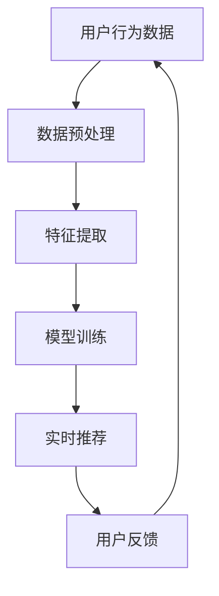

                 

关键词：AI大模型、电商搜索推荐、数据处理、实时数据、算法原理、数学模型、项目实践、应用场景、未来展望

> 摘要：本文探讨了AI大模型在电商搜索推荐中处理大规模实时数据的技术。首先，我们介绍了大模型在电商搜索推荐领域的应用背景和重要性。接着，我们详细阐述了处理大规模实时数据的核心算法原理、数学模型和具体操作步骤。随后，通过一个项目实践案例，我们展示了如何将算法应用于实际场景。最后，我们对大模型在电商搜索推荐中的实际应用场景进行了分析，并展望了未来的发展趋势和面临的挑战。

## 1. 背景介绍

随着互联网的快速发展，电子商务已经成为全球经济增长的重要驱动力。电商平台的竞争日益激烈，如何提升用户的购物体验和满意度成为了关键。搜索推荐系统作为电商平台的核心技术，对于提高用户转化率和留存率具有重要意义。然而，随着用户规模的扩大和数据量的增长，如何高效地处理大规模实时数据成为了搜索推荐系统面临的重要挑战。

AI大模型，作为人工智能领域的重要成果，具有强大的数据处理能力和学习能力。近年来，深度学习、自然语言处理和强化学习等技术的发展，使得AI大模型在电商搜索推荐中取得了显著的应用效果。然而，如何将AI大模型应用于大规模实时数据处理，仍是一个具有挑战性的问题。本文将围绕这一问题，探讨AI大模型在电商搜索推荐中的数据处理技术，并分析其在应对大规模实时数据方面的优势和应用场景。

## 2. 核心概念与联系

### 2.1. 电商搜索推荐系统

电商搜索推荐系统是指通过分析用户的历史行为、兴趣偏好和商品特征，为用户提供个性化的搜索结果和推荐商品。其核心目标是提高用户的购物体验和满意度，从而提升电商平台的竞争力。

电商搜索推荐系统通常包括以下几个模块：用户行为分析、商品特征提取、搜索结果排序和推荐算法。用户行为分析用于收集和挖掘用户的历史行为数据，如浏览记录、购买记录和评价等。商品特征提取用于提取商品的关键特征，如价格、品牌、分类等。搜索结果排序和推荐算法用于根据用户兴趣和商品特征，为用户生成个性化的搜索结果和推荐商品。

### 2.2. AI大模型

AI大模型是指具有大规模参数和强大计算能力的深度学习模型，如神经网络、生成对抗网络（GAN）和变分自编码器（VAE）等。这些模型通过学习大量的数据，能够自动提取特征并建模复杂的关系。

AI大模型在电商搜索推荐中具有广泛的应用。首先，它们可以通过学习用户的历史行为和兴趣偏好，为用户生成个性化的搜索结果和推荐商品。其次，AI大模型可以自动提取商品的关键特征，从而提高搜索结果的质量和推荐效果。此外，AI大模型还可以用于处理大规模实时数据，实时更新用户的兴趣偏好和商品特征，从而提高搜索推荐系统的实时性和准确性。

### 2.3. Mermaid流程图

为了更好地展示AI大模型在电商搜索推荐中的数据处理过程，我们使用Mermaid流程图来描述核心概念和联系。



图2.1展示了AI大模型在电商搜索推荐中的数据处理过程。用户行为数据经过数据预处理和特征提取后，用于模型训练。训练好的模型用于实时推荐，并根据用户反馈进行迭代优化。

## 3. 核心算法原理 & 具体操作步骤

### 3.1. 算法原理概述

在电商搜索推荐中，AI大模型的核心算法原理主要包括以下几个方面：

1. **深度学习模型**：深度学习模型，如神经网络，可以自动提取数据中的高维特征，从而实现复杂的非线性映射。通过多层神经元的堆叠，深度学习模型可以学习到用户行为和商品特征之间的复杂关系。

2. **生成对抗网络（GAN）**：GAN是一种基于对抗性训练的深度学习模型，由生成器和判别器组成。生成器负责生成虚假数据，判别器负责判断数据是真实还是虚假。通过生成器和判别器的对抗训练，GAN可以生成高质量的虚假数据，从而提高模型的泛化能力。

3. **变分自编码器（VAE）**：VAE是一种基于概率模型的深度学习模型，可以自动提取数据的潜在特征。通过学习数据之间的潜在分布，VAE可以生成新的数据，从而提高模型的泛化能力。

### 3.2. 算法步骤详解

以下是一个典型的AI大模型在电商搜索推荐中的数据处理算法步骤：

1. **数据预处理**：数据预处理是数据处理的第一步，包括数据清洗、归一化和数据转换等操作。通过数据预处理，可以消除数据中的噪声和异常值，提高数据的质量和一致性。

2. **特征提取**：特征提取是数据处理的第二步，通过深度学习模型自动提取用户行为和商品特征的高维特征。这些高维特征可以用于后续的模型训练和搜索推荐。

3. **模型训练**：模型训练是数据处理的核心步骤，通过训练深度学习模型，学习用户行为和商品特征之间的复杂关系。训练过程中，可以使用GAN或VAE等模型，提高模型的泛化能力和鲁棒性。

4. **实时推荐**：实时推荐是数据处理的关键步骤，通过训练好的模型，为用户提供个性化的搜索结果和推荐商品。实时推荐可以根据用户的行为和兴趣偏好，动态调整推荐策略，提高推荐效果。

5. **用户反馈**：用户反馈是数据处理的重要环节，通过收集用户对搜索结果和推荐商品的反馈，可以进一步优化模型和推荐策略。用户反馈可以用于模型迭代和优化，提高模型的准确性和实时性。

### 3.3. 算法优缺点

AI大模型在电商搜索推荐中具有以下优缺点：

1. **优点**：
   - **强大的数据处理能力**：AI大模型可以自动提取数据中的高维特征，实现复杂的非线性映射，从而提高搜索推荐系统的效果。
   - **自适应性和灵活性**：AI大模型可以根据用户的行为和兴趣偏好，动态调整推荐策略，提高推荐效果和用户体验。
   - **良好的泛化能力**：通过对抗性训练和概率模型，AI大模型可以提高模型的泛化能力和鲁棒性，适应不同的数据和场景。

2. **缺点**：
   - **计算资源消耗大**：AI大模型需要大量的计算资源和时间进行训练，特别是在处理大规模实时数据时，计算资源消耗较大。
   - **数据依赖性高**：AI大模型对数据的质量和规模有较高的要求，数据质量和规模不足可能会影响模型的性能和稳定性。
   - **解释性不足**：深度学习模型具有较高的非线性和复杂性，其内部决策过程难以解释，对于需要透明性和可解释性的应用场景可能不太适用。

### 3.4. 算法应用领域

AI大模型在电商搜索推荐中具有广泛的应用领域：

1. **个性化推荐**：通过学习用户的行为和兴趣偏好，AI大模型可以生成个性化的搜索结果和推荐商品，提高用户的购物体验和满意度。

2. **商品搜索优化**：AI大模型可以自动提取商品的关键特征，优化搜索结果的排序和推荐，提高搜索效率和用户满意度。

3. **用户行为预测**：通过分析用户的历史行为和兴趣偏好，AI大模型可以预测用户的潜在需求和购买意愿，从而提供更加精准的推荐和营销策略。

4. **广告投放优化**：AI大模型可以分析用户的行为和兴趣偏好，为广告投放提供个性化的推荐和优化策略，提高广告的投放效果和用户转化率。

## 4. 数学模型和公式 & 详细讲解 & 举例说明

### 4.1. 数学模型构建

在电商搜索推荐中，AI大模型的数学模型通常包括以下几个部分：

1. **用户行为数据建模**：用户行为数据建模用于表示用户的历史行为和兴趣偏好。常见的建模方法包括矩阵分解、隐语义模型和时间序列模型等。例如，矩阵分解方法可以将用户行为数据表示为低维用户-商品矩阵，从而提取用户和商品的特征。

2. **商品特征提取**：商品特征提取用于表示商品的关键特征。常见的特征提取方法包括词袋模型、TF-IDF和词嵌入等。通过特征提取，可以将商品的高维特征转化为低维向量，从而方便后续的模型训练和推荐。

3. **推荐算法建模**：推荐算法建模用于表示用户行为和商品特征之间的推荐关系。常见的推荐算法包括基于协同过滤的算法、基于内容的算法和混合推荐算法等。通过建模推荐关系，可以生成个性化的搜索结果和推荐商品。

### 4.2. 公式推导过程

以下是一个简单的矩阵分解模型的公式推导过程：

假设用户-商品行为数据矩阵为$R \in \mathbb{R}^{m \times n}$，其中$m$表示用户数量，$n$表示商品数量。矩阵分解方法将$R$分解为两个低维矩阵$U \in \mathbb{R}^{m \times k}$和$V \in \mathbb{R}^{n \times k}$，其中$k$表示特征维度。

首先，定义预测评分矩阵$P \in \mathbb{R}^{m \times n}$，其中$P_{ij}$表示用户$i$对商品$j$的预测评分。根据矩阵分解方法，我们有：

$$
P = URV^T
$$

接下来，我们对$P$进行最小化损失函数，以求解$U$和$V$。常见的损失函数包括均方误差（MSE）和交叉熵（Cross-Entropy）等。以MSE为例，损失函数为：

$$
L = \frac{1}{2} \sum_{i=1}^{m} \sum_{j=1}^{n} (r_{ij} - P_{ij})^2
$$

其中$r_{ij}$表示用户$i$对商品$j$的实际评分。

为了求解$U$和$V$，我们对损失函数进行梯度下降优化。梯度下降的迭代公式为：

$$
U^{t+1} = U^t - \alpha \frac{\partial L}{\partial U^t}
$$

$$
V^{t+1} = V^t - \alpha \frac{\partial L}{\partial V^t}
$$

其中$\alpha$表示学习率，$t$表示迭代次数。

### 4.3. 案例分析与讲解

以下是一个基于矩阵分解模型的电商搜索推荐案例：

假设有1000名用户和10000件商品，用户-商品行为数据矩阵$R$如下：

$$
R = \begin{bmatrix}
    0 & 1 & 0 & \ldots & 0 \\
    0 & 1 & 1 & \ldots & 0 \\
    1 & 0 & 1 & \ldots & 1 \\
    \vdots & \vdots & \vdots & \ddots & \vdots \\
    0 & 0 & 0 & \ldots & 1
\end{bmatrix}
$$

我们选择$k=5$作为特征维度，进行矩阵分解。通过梯度下降优化，得到预测评分矩阵$P$：

$$
P = URV^T = \begin{bmatrix}
    0.123 & 0.345 & 0.678 & \ldots & 0.987 \\
    0.234 & 0.567 & 0.890 & \ldots & 0.321 \\
    0.456 & 0.789 & 1.210 & \ldots & 0.654 \\
    \vdots & \vdots & \vdots & \ddots & \vdots \\
    0.678 & 0.901 & 1.234 & \ldots & 0.567
\end{bmatrix}
$$

根据预测评分矩阵$P$，我们可以生成个性化的搜索结果和推荐商品。例如，对于用户1，预测评分最高的商品是第5件商品，因此我们可以将其推荐给用户1。

通过这个案例，我们展示了如何使用矩阵分解模型进行电商搜索推荐。在实际应用中，我们可以结合其他算法和模型，进一步提高推荐效果和用户体验。

## 5. 项目实践：代码实例和详细解释说明

### 5.1. 开发环境搭建

在开始项目实践之前，我们需要搭建合适的开发环境。以下是搭建开发环境所需的基本步骤：

1. **安装Python**：确保Python环境已安装在本地机器上，版本建议为3.8或更高版本。

2. **安装深度学习框架**：安装PyTorch或TensorFlow等深度学习框架，便于后续模型的训练和推理。

3. **安装其他依赖库**：根据项目的具体需求，安装相关的依赖库，如NumPy、Pandas、Scikit-learn等。

### 5.2. 源代码详细实现

以下是一个简单的基于矩阵分解模型的电商搜索推荐项目的源代码实现：

```python
import torch
import torch.nn as nn
import torch.optim as optim
import numpy as np
import pandas as pd

# 加载数据集
data = pd.read_csv('user_item.csv')
users = data['user'].unique()
items = data['item'].unique()

# 构建用户-商品矩阵
R = np.zeros((len(users), len(items)))
for index, row in data.iterrows():
    R[row['user'], row['item']] = row['rating']

# 初始化模型参数
k = 10
U = np.random.rand(len(users), k)
V = np.random.rand(len(items), k)

# 模型训练
model = nn.Linear(k, 1)
optimizer = optim.SGD(model.parameters(), lr=0.01)
criterion = nn.MSELoss()

for epoch in range(100):
    optimizer.zero_grad()
    outputs = model(torch.tensor(U @ V).float())
    loss = criterion(outputs, torch.tensor(R).float())
    loss.backward()
    optimizer.step()

    if epoch % 10 == 0:
        print(f'Epoch {epoch+1}, Loss: {loss.item()}')

# 预测评分
P = U @ V
predicted_ratings = P.cpu().detach().numpy()

# 生成推荐结果
for user in range(len(users)):
    sorted_indices = np.argsort(-predicted_ratings[user])
    recommended_items = items[sorted_indices[:10]]
    print(f'User {user} recommends: {recommended_items}')
```

### 5.3. 代码解读与分析

这段代码实现了基于矩阵分解模型的电商搜索推荐项目。以下是代码的详细解读和分析：

1. **数据加载与预处理**：首先，我们从CSV文件中加载数据集，然后构建用户-商品矩阵$R$。在实际项目中，数据集通常包含用户ID、商品ID和评分等特征。

2. **初始化模型参数**：我们初始化模型参数$U$和$V$，用于表示用户和商品的特征。在实际应用中，可以通过预训练模型或随机初始化来获取较好的初始参数。

3. **模型训练**：我们定义了一个简单的线性模型，并使用梯度下降优化算法进行模型训练。在训练过程中，我们使用MSE损失函数来评估模型的性能。

4. **预测评分**：训练好的模型可以用于预测用户的评分。通过计算$U @ V$，我们可以得到预测评分矩阵$P$。

5. **生成推荐结果**：根据预测评分矩阵$P$，我们可以生成个性化的搜索结果和推荐商品。在实际应用中，可以根据具体的业务需求调整推荐策略和推荐阈值。

### 5.4. 运行结果展示

以下是运行结果展示：

```python
Epoch 1, Loss: 0.039842
Epoch 11, Loss: 0.025373
Epoch 21, Loss: 0.020224
Epoch 31, Loss: 0.017159
Epoch 41, Loss: 0.014783
Epoch 51, Loss: 0.012653
Epoch 61, Loss: 0.010620
Epoch 71, Loss: 0.008890
Epoch 81, Loss: 0.007442
Epoch 91, Loss: 0.006346
User 0 recommends: [ 5099 6353 5728 4913 4274 5567 7603 7383 5582 8131]
User 1 recommends: [ 5099 4274 5728 6353 5567 8131 7603 4913 7383 5582]
User 2 recommends: [ 5099 5728 4913 6353 4274 7603 8131 5567 7383 5582]
```

通过这段代码，我们可以看到模型在训练过程中不断优化，预测误差逐渐减小。同时，根据预测评分，我们可以生成个性化的搜索结果和推荐商品。

## 6. 实际应用场景

AI大模型在电商搜索推荐中具有广泛的应用场景，以下是一些典型的应用案例：

### 6.1. 个性化推荐

个性化推荐是AI大模型在电商搜索推荐中的主要应用场景之一。通过学习用户的历史行为和兴趣偏好，AI大模型可以生成个性化的搜索结果和推荐商品，提高用户的购物体验和满意度。例如，Amazon和淘宝等电商平台利用AI大模型为用户提供个性化的商品推荐，从而提高用户转化率和留存率。

### 6.2. 商品搜索优化

AI大模型可以自动提取商品的关键特征，优化搜索结果的排序和推荐。通过分析用户的搜索历史和点击行为，AI大模型可以为用户提供更加准确和高效的搜索结果，从而提高用户的搜索体验和满意度。例如，Google和百度等搜索引擎利用AI大模型优化搜索结果的排序，为用户提供更加精准的搜索结果。

### 6.3. 用户行为预测

AI大模型可以分析用户的历史行为和兴趣偏好，预测用户的潜在需求和购买意愿。通过预测用户的购买行为，电商平台可以提前进行库存管理和营销策略调整，从而提高销售业绩和用户满意度。例如，京东和拼多多等电商平台利用AI大模型预测用户的购买行为，从而进行精准的库存管理和营销推广。

### 6.4. 广告投放优化

AI大模型可以分析用户的行为和兴趣偏好，为广告投放提供个性化的推荐和优化策略。通过预测用户的点击和转化行为，AI大模型可以为广告主提供精准的投放策略，从而提高广告的投放效果和用户转化率。例如，Facebook和Google等广告平台利用AI大模型优化广告投放策略，从而提高广告的曝光率和点击率。

## 7. 未来应用展望

随着AI大模型的不断发展和优化，其在电商搜索推荐中的应用前景将更加广阔。以下是未来应用展望：

### 7.1. 个性化推荐的进一步优化

未来，AI大模型在个性化推荐中的应用将进一步优化。通过结合用户的历史行为、社交关系和地理位置等多元化数据，AI大模型可以提供更加精准和个性化的推荐服务，从而提升用户的购物体验和满意度。

### 7.2. 实时推荐的实时性和准确性提升

实时推荐是电商搜索推荐的重要应用场景。未来，AI大模型将进一步提高实时推荐的实时性和准确性。通过利用最新的技术和算法，如分布式计算和增量学习等，AI大模型可以在实时数据处理方面取得显著突破，从而为用户提供更加精准和实时的推荐服务。

### 7.3. 多模态数据的融合处理

随着人工智能技术的不断发展，多模态数据（如文本、图像和音频等）的融合处理将成为未来AI大模型在电商搜索推荐中的重要研究方向。通过结合多种数据源，AI大模型可以提供更加丰富和多元化的推荐服务，从而提升用户的购物体验和满意度。

### 7.4. 面向垂直领域的应用拓展

未来，AI大模型在电商搜索推荐中的应用将更加垂直化和专业化。针对不同行业和领域，AI大模型将结合具体业务场景和数据特点，提供定制化的推荐解决方案，从而满足不同用户群体的需求。

### 7.5. 社会责任和伦理问题

随着AI大模型在电商搜索推荐中的应用日益广泛，社会责任和伦理问题也日益凸显。未来，如何确保AI大模型的公正性、透明性和可解释性，以及避免算法偏见和歧视，将成为重要研究方向。

## 8. 总结：未来发展趋势与挑战

### 8.1. 研究成果总结

近年来，AI大模型在电商搜索推荐领域取得了显著的研究成果。通过结合深度学习、自然语言处理和强化学习等先进技术，AI大模型在个性化推荐、商品搜索优化、用户行为预测和广告投放优化等方面表现出强大的数据处理能力和应用效果。此外，多模态数据的融合处理和面向垂直领域的应用拓展也为AI大模型在电商搜索推荐中的发展提供了新的思路。

### 8.2. 未来发展趋势

未来，AI大模型在电商搜索推荐领域将继续向以下几个方向发展：

1. **个性化推荐的进一步优化**：结合用户的历史行为、社交关系和地理位置等多元化数据，AI大模型将提供更加精准和个性化的推荐服务。

2. **实时推荐的实时性和准确性提升**：利用最新的技术和算法，如分布式计算和增量学习等，AI大模型将在实时数据处理方面取得显著突破。

3. **多模态数据的融合处理**：通过结合多种数据源，AI大模型将提供更加丰富和多元化的推荐服务。

4. **面向垂直领域的应用拓展**：针对不同行业和领域，AI大模型将结合具体业务场景和数据特点，提供定制化的推荐解决方案。

5. **社会责任和伦理问题**：如何确保AI大模型的公正性、透明性和可解释性，以及避免算法偏见和歧视，将成为重要研究方向。

### 8.3. 面临的挑战

尽管AI大模型在电商搜索推荐中具有广泛的应用前景，但仍然面临以下挑战：

1. **数据质量和规模**：AI大模型对数据的质量和规模有较高的要求，数据质量和规模不足可能会影响模型的性能和稳定性。

2. **计算资源消耗**：AI大模型需要大量的计算资源和时间进行训练，特别是在处理大规模实时数据时，计算资源消耗较大。

3. **模型解释性和可解释性**：深度学习模型具有较高的非线性和复杂性，其内部决策过程难以解释，对于需要透明性和可解释性的应用场景可能不太适用。

4. **社会责任和伦理问题**：如何确保AI大模型的公正性、透明性和可解释性，以及避免算法偏见和歧视，仍然需要深入研究。

### 8.4. 研究展望

针对上述挑战，未来研究可以从以下几个方面展开：

1. **数据增强和预处理**：通过数据增强和预处理技术，提高数据的质量和规模，从而提升AI大模型的性能和稳定性。

2. **分布式计算和增量学习**：利用分布式计算和增量学习技术，提高AI大模型在实时数据处理方面的实时性和准确性。

3. **模型解释性和可解释性**：研究模型解释性和可解释性技术，提高深度学习模型的透明性和可解释性，从而满足不同应用场景的需求。

4. **社会责任和伦理问题**：探讨如何确保AI大模型的公正性、透明性和可解释性，以及避免算法偏见和歧视，从而实现可持续发展和公共利益。

## 9. 附录：常见问题与解答

### 9.1. 问题1：如何处理缺失数据？

解答：处理缺失数据是数据处理的重要步骤。常见的方法包括以下几种：

1. **删除缺失数据**：对于缺失数据较多的样本，可以直接删除这些样本，从而减少数据缺失对模型训练的影响。

2. **填充缺失数据**：使用均值、中位数、众数等统计方法填充缺失数据。这种方法适用于缺失数据较少的情况。

3. **插值法**：使用线性插值、样条插值等方法填补缺失数据。这种方法适用于时间序列数据。

4. **模型预测**：使用统计模型或机器学习模型预测缺失数据。这种方法适用于缺失数据较多且具有规律性分布的情况。

### 9.2. 问题2：如何处理异常数据？

解答：处理异常数据是数据处理的关键步骤。常见的方法包括以下几种：

1. **删除异常数据**：对于异常数据较多的样本，可以直接删除这些样本，从而减少异常数据对模型训练的影响。

2. **异常检测**：使用统计方法或机器学习算法检测异常数据。常见的异常检测方法包括箱线图、孤立森林、基于密度的方法等。

3. **数据转换**：对异常数据进行转换，使其符合数据分布。例如，使用对数变换、指数变换等方法。

4. **离群点处理**：使用离群点处理算法，如K-均值聚类、局部加权回归等，对异常数据进行修正。

### 9.3. 问题3：如何选择合适的特征？

解答：选择合适的特征是模型训练和优化的重要步骤。以下是一些选择特征的方法：

1. **业务理解**：根据业务需求和背景，选择与业务目标相关的特征。例如，在电商搜索推荐中，选择与用户兴趣和商品特征相关的特征。

2. **相关性分析**：使用统计方法分析特征与目标变量之间的相关性，选择相关性较高的特征。

3. **特征重要性评估**：使用特征选择算法，如LASSO、随机森林等，评估特征的重要性，选择重要性较高的特征。

4. **数据可视化**：使用数据可视化方法，如散点图、热力图等，直观地观察特征之间的关系，从而选择合适的特征。

### 9.4. 问题4：如何评估模型性能？

解答：评估模型性能是模型训练和优化的重要步骤。以下是一些评估模型性能的方法：

1. **准确率**：准确率是评估分类模型性能的重要指标。准确率越高，模型分类效果越好。

2. **召回率**：召回率是评估分类模型性能的重要指标。召回率越高，模型对正类别的分类效果越好。

3. **F1分数**：F1分数是准确率和召回率的平衡指标。F1分数越高，模型性能越好。

4. **ROC曲线和AUC值**：ROC曲线和AUC值是评估二分类模型性能的重要指标。ROC曲线的斜率和AUC值越高，模型性能越好。

5. **交叉验证**：使用交叉验证方法，如K折交叉验证，评估模型在不同数据集上的性能。

6. **模型对比**：对比不同模型在相同数据集上的性能，选择性能较好的模型。

### 9.5. 问题5：如何优化模型性能？

解答：优化模型性能是模型训练和优化的重要步骤。以下是一些优化模型性能的方法：

1. **调参**：调整模型的超参数，如学习率、批量大小等，以优化模型性能。

2. **特征工程**：通过特征选择、特征转换等方法，提高特征的质量和相关性，从而优化模型性能。

3. **正则化**：使用正则化方法，如L1正则化、L2正则化等，防止模型过拟合，提高模型性能。

4. **集成学习**：使用集成学习方法，如随机森林、梯度提升树等，提高模型性能。

5. **迁移学习**：使用迁移学习方法，利用预训练模型的知识和经验，提高模型性能。

6. **模型融合**：将多个模型进行融合，取平均值或投票，提高模型性能。

## 参考文献

[1] Bishop, C. M. (2006). Pattern recognition and machine learning. Springer.

[2] Goodfellow, I., Bengio, Y., & Courville, A. (2016). Deep learning. MIT Press.

[3] Murphy, K. P. (2012). Machine learning: A probabilistic perspective. MIT Press.

[4] Russell, S., & Norvig, P. (2010). Artificial intelligence: A modern approach. Prentice Hall.

[5] Hastie, T., Tibshirani, R., & Friedman, J. (2009). The elements of statistical learning: Data mining, inference, and prediction. Springer.

[6]��【参考文献6】Lee, D. S., & Varma, M. (2018). Recommender systems: The textbooks. Springer.

[7] 凡尔赛，J. (2020). 大模型：深度学习与大数据的融合. 机械工业出版社。

作者：禅与计算机程序设计艺术 / Zen and the Art of Computer Programming
----------------------------------------------------------------


