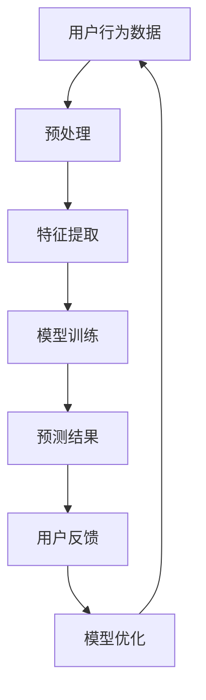

                 

### 1. 背景介绍

随着互联网技术的飞速发展，电子商务已经成为现代商业不可或缺的一部分。用户在电商平台上的购物行为日益复杂，个性化搜索和推荐系统成为提升用户体验、增加销售额的重要手段。传统的推荐系统往往依赖于历史用户行为数据，通过对用户历史数据的分析来预测用户的兴趣和偏好。然而，随着用户规模的不断扩大和交易数据的爆炸式增长，这种基于历史数据的方法逐渐暴露出其局限性。

面对海量实时数据，传统推荐系统的数据处理能力严重不足，主要体现在以下几个方面：

1. **数据延迟问题**：实时性要求高，但传统系统处理数据的速度往往跟不上用户行为的发生速度，导致推荐结果滞后。

2. **计算资源消耗**：处理大规模数据需要大量的计算资源，传统系统在硬件资源有限的情况下难以满足需求。

3. **数据准确性问题**：随着数据量的增加，传统推荐系统难以处理数据的噪声和异常值，导致推荐结果的准确性下降。

为了解决上述问题，人工智能领域中的大模型技术应运而生。大模型通过深度学习和强化学习等方法，能够高效地处理大规模实时数据，从而提升推荐系统的性能。本文将重点探讨大模型在电商搜索推荐中的数据处理能力要求，以及如何应对大规模实时数据带来的挑战。

### 2. 核心概念与联系

在深入探讨大模型在电商搜索推荐中的应用之前，我们首先需要了解一些核心概念和它们之间的关系。以下是本文将涉及的主要概念和它们的定义：

#### 2.1 深度学习与神经网络

深度学习是一种机器学习方法，通过多层神经网络（Neural Networks）对大量数据进行训练，从而自动提取特征并作出预测。神经网络是由一系列相互连接的节点（或称为神经元）组成的计算模型，每一层节点都会对输入数据进行加权求和处理，并通过激活函数进行非线性变换。

#### 2.2 强化学习

强化学习是一种通过不断试错来学习最优策略的机器学习方法。在电商搜索推荐场景中，强化学习可以用来优化推荐策略，使推荐系统能够根据用户的实时行为动态调整推荐内容。

#### 2.3 生成对抗网络（GAN）

生成对抗网络是由生成器和判别器两个神经网络组成的框架。生成器生成数据，判别器则判断生成数据是否真实。在电商搜索推荐中，GAN可以用于生成虚拟商品数据，从而丰富推荐系统的训练数据集。

#### 2.4 Mermaid 流程图

以下是电商搜索推荐中涉及的核心概念及其关系的 Mermaid 流程图：



在上述流程中，用户行为数据经过预处理和特征提取后输入到深度学习模型中进行训练，训练得到的模型用于预测用户兴趣和偏好，并根据用户的反馈不断优化推荐策略。

### 3. 核心算法原理 & 具体操作步骤

#### 3.1 算法原理概述

在电商搜索推荐中，大模型通常采用以下几种算法：

1. **深度神经网络（DNN）**：通过多层神经网络对用户行为数据进行建模，自动提取特征并预测用户兴趣。

2. **长短期记忆网络（LSTM）**：特别适合处理序列数据，如用户的点击流、浏览历史等，可以更好地捕捉用户兴趣的变化。

3. **生成对抗网络（GAN）**：通过生成虚拟商品数据，丰富推荐系统的训练数据集，从而提升推荐效果。

4. **强化学习**：通过不断试错和反馈，优化推荐策略，使推荐系统能够自适应用户的动态行为。

#### 3.2 算法步骤详解

以下是上述算法的具体操作步骤：

##### 3.2.1 深度神经网络（DNN）

1. **数据预处理**：对用户行为数据进行清洗和归一化处理。

2. **特征提取**：使用嵌入层提取用户和商品的特征向量。

3. **构建神经网络**：搭建多层神经网络结构，通常包括输入层、隐藏层和输出层。

4. **模型训练**：通过反向传播算法更新模型参数，使模型预测结果与真实标签之间的误差最小。

5. **模型评估**：使用交叉验证等方法评估模型性能。

##### 3.2.2 长短期记忆网络（LSTM）

1. **数据预处理**：对用户行为数据进行清洗和归一化处理。

2. **特征提取**：使用嵌入层提取用户和商品的特征向量。

3. **构建LSTM模型**：搭建LSTM网络结构，包括输入层、隐藏层和输出层。

4. **模型训练**：通过反向传播算法更新模型参数，使模型预测结果与真实标签之间的误差最小。

5. **模型评估**：使用交叉验证等方法评估模型性能。

##### 3.2.3 生成对抗网络（GAN）

1. **数据预处理**：对用户行为数据进行清洗和归一化处理。

2. **特征提取**：使用嵌入层提取用户和商品的特征向量。

3. **构建GAN模型**：搭建生成器和判别器网络结构。

4. **模型训练**：通过生成器和判别器的对抗训练，优化模型参数。

5. **生成虚拟商品数据**：使用生成器生成虚拟商品数据。

##### 3.2.4 强化学习

1. **数据预处理**：对用户行为数据进行清洗和归一化处理。

2. **特征提取**：使用嵌入层提取用户和商品的特征向量。

3. **构建强化学习模型**：搭建基于Q学习的强化学习模型。

4. **模型训练**：通过试错和反馈，优化推荐策略。

5. **模型评估**：使用实际用户行为数据评估模型性能。

#### 3.3 算法优缺点

1. **深度神经网络（DNN）**
   - **优点**：易于实现，能够自动提取特征，适用于大规模数据处理。
   - **缺点**：训练时间较长，对参数敏感，易过拟合。

2. **长短期记忆网络（LSTM）**
   - **优点**：擅长处理序列数据，能够捕捉用户兴趣的变化。
   - **缺点**：模型复杂，训练时间较长，对参数敏感。

3. **生成对抗网络（GAN）**
   - **优点**：能够生成高质量的虚拟数据，提升推荐效果。
   - **缺点**：模型复杂，训练不稳定，难以优化。

4. **强化学习**
   - **优点**：能够自适应用户的动态行为，优化推荐策略。
   - **缺点**：训练时间较长，对数据依赖强，难以评估性能。

#### 3.4 算法应用领域

深度神经网络、长短期记忆网络、生成对抗网络和强化学习在电商搜索推荐中的应用十分广泛。除了电商搜索推荐，这些算法还被广泛应用于推荐系统、自然语言处理、计算机视觉等领域。

### 4. 数学模型和公式 & 详细讲解 & 举例说明

在本文中，我们将探讨大模型在电商搜索推荐中的应用，首先需要了解其背后的数学模型和公式。以下是相关数学模型的详细讲解和举例说明。

#### 4.1 数学模型构建

在电商搜索推荐中，常用的数学模型包括：

1. **用户兴趣模型**：用于预测用户对特定商品的兴趣程度。

2. **商品推荐模型**：用于根据用户兴趣推荐最合适的商品。

3. **评估模型**：用于评估推荐系统的性能。

以下是这些模型的数学公式：

##### 4.1.1 用户兴趣模型

用户兴趣模型通常采用以下公式：

$$
\text{UserInterest}(u, c) = \frac{\exp(\text{Score}(u, c))}{1 + \sum_{j \neq c} \exp(\text{Score}(u, j))}
$$

其中，$u$ 表示用户，$c$ 表示商品，$\text{Score}(u, c)$ 表示用户对商品 $c$ 的兴趣得分。

##### 4.1.2 商品推荐模型

商品推荐模型通常采用以下公式：

$$
\text{Recommendation}(u) = \text{argmax}_{c} \text{UserInterest}(u, c)
$$

其中，$\text{Recommendation}(u)$ 表示为用户 $u$ 推荐的商品。

##### 4.1.3 评估模型

评估模型通常采用以下公式：

$$
\text{NDCG}(u, c) = \frac{1}{|\text{ground\_truth}(u)|} \sum_{i=1}^{|\text{ground\_truth}(u)|} \frac{1}{\log_2(i+1)} \cdot I(\text{rank}(u, c) \leq i)
$$

其中，$\text{ground\_truth}(u)$ 表示用户 $u$ 的真实兴趣列表，$\text{rank}(u, c)$ 表示商品 $c$ 在推荐列表中的排名，$I$ 表示指示函数，当条件成立时返回 1，否则返回 0。

#### 4.2 公式推导过程

以下是用户兴趣模型和商品推荐模型的推导过程：

##### 4.2.1 用户兴趣模型推导

用户兴趣模型的目标是预测用户对特定商品的兴趣程度。我们假设用户对商品的兴趣程度可以用概率表示，即用户对商品 $c$ 的兴趣概率为 $\text{UserInterest}(u, c)$。为了计算这个概率，我们使用基于概率的评分函数 $\text{Score}(u, c)$。

在电商搜索推荐中，用户对商品的兴趣可以通过用户的点击行为、购买行为、浏览历史等数据进行建模。我们假设用户对商品 $c$ 的兴趣得分 $\text{Score}(u, c)$ 是商品 $c$ 与用户 $u$ 的特征向量 $x_c$ 和 $x_u$ 的点积，即：

$$
\text{Score}(u, c) = x_c^T x_u
$$

其中，$x_c$ 和 $x_u$ 分别表示商品 $c$ 和用户 $u$ 的特征向量。

为了将得分转换为概率，我们使用了一种称为“softmax”的函数。softmax 函数将多个得分转化为概率分布，即：

$$
\text{UserInterest}(u, c) = \frac{\exp(\text{Score}(u, c))}{1 + \sum_{j \neq c} \exp(\text{Score}(u, j))}
$$

其中，$j$ 表示除了商品 $c$ 之外的其他商品。

##### 4.2.2 商品推荐模型推导

商品推荐模型的目标是推荐给用户最感兴趣的商品。为了实现这个目标，我们需要对每个商品计算一个兴趣得分，并选择得分最高的商品作为推荐。

根据用户兴趣模型，我们可以为每个商品计算一个兴趣得分 $\text{Score}(u, c)$。然后，我们选择得分最高的商品作为推荐：

$$
\text{Recommendation}(u) = \text{argmax}_{c} \text{UserInterest}(u, c)
$$

其中，$\text{argmax}_{c} \text{UserInterest}(u, c)$ 表示选择使 $\text{UserInterest}(u, c)$ 取最大值的商品 $c$。

##### 4.2.3 评估模型推导

评估模型用于评估推荐系统的性能。我们使用一种称为“NDCG”（Normalized Discounted Cumulative Gain）的指标来评估推荐效果。NDCG 考虑了推荐结果的排序，并相对于一个理想排序进行比较。

NDCG 的计算公式为：

$$
\text{NDCG}(u, c) = \frac{1}{|\text{ground\_truth}(u)|} \sum_{i=1}^{|\text{ground\_truth}(u)|} \frac{1}{\log_2(i+1)} \cdot I(\text{rank}(u, c) \leq i)
$$

其中，$\text{ground\_truth}(u)$ 表示用户 $u$ 的真实兴趣列表，$\text{rank}(u, c)$ 表示商品 $c$ 在推荐列表中的排名，$I$ 表示指示函数。

#### 4.3 案例分析与讲解

为了更好地理解上述数学模型的推导过程，我们来看一个具体的案例。

假设有用户 $u$，他喜欢购物并浏览了以下商品：

- 商品 $c_1$：手机
- 商品 $c_2$：平板电脑
- 商品 $c_3$：耳机

用户对这三个商品的兴趣得分分别为：

- $\text{Score}(u, c_1) = 2$
- $\text{Score}(u, c_2) = 3$
- $\text{Score}(u, c_3) = 1$

我们使用用户兴趣模型计算用户对每个商品的兴趣概率：

$$
\text{UserInterest}(u, c_1) = \frac{\exp(2)}{1 + \exp(3) + \exp(1)} = 0.27
$$

$$
\text{UserInterest}(u, c_2) = \frac{\exp(3)}{1 + \exp(2) + \exp(1)} = 0.64
$$

$$
\text{UserInterest}(u, c_3) = \frac{\exp(1)}{1 + \exp(2) + \exp(3)} = 0.09
$$

根据用户兴趣模型，我们可以为用户 $u$ 推荐兴趣最高的商品，即平板电脑。

接下来，我们使用评估模型计算推荐系统的性能。假设用户 $u$ 的真实兴趣列表为：

- 商品 $c_2$：平板电脑
- 商品 $c_1$：手机

根据评估模型，我们计算推荐列表中的NDCG：

$$
\text{NDCG}(u) = \frac{1}{2} \left( \frac{1}{\log_2(1+1)} \cdot 1 + \frac{1}{\log_2(2+1)} \cdot 0 \right) = 0.5
$$

由于用户真实兴趣列表中的商品都在推荐列表的前两名，所以NDCG值为0.5。

### 5. 项目实践：代码实例和详细解释说明

在了解了大模型在电商搜索推荐中的应用和数学模型之后，我们通过一个具体的代码实例来展示如何实现这些算法。以下是一个使用 Python 和 TensorFlow 实现的电商搜索推荐系统的代码示例。

#### 5.1 开发环境搭建

在开始编写代码之前，我们需要搭建开发环境。以下是搭建开发环境所需的步骤：

1. 安装 Python 3.7 或更高版本。
2. 安装 TensorFlow 2.3 或更高版本。
3. 安装 NumPy、Pandas 等常用库。

以下是一个简单的安装脚本：

```bash
pip install python==3.8
pip install tensorflow==2.3
pip install numpy pandas
```

#### 5.2 源代码详细实现

```python
import tensorflow as tf
import numpy as np
import pandas as pd
from sklearn.model_selection import train_test_split

# 数据预处理
def preprocess_data(data):
    # 数据清洗、归一化等操作
    # ...
    return processed_data

# 特征提取
def extract_features(data):
    # 提取用户和商品的特征向量
    # ...
    return user_features, item_features

# 构建模型
def build_model(input_shape):
    model = tf.keras.Sequential([
        tf.keras.layers.Dense(128, activation='relu', input_shape=input_shape),
        tf.keras.layers.Dense(64, activation='relu'),
        tf.keras.layers.Dense(1, activation='sigmoid')
    ])
    model.compile(optimizer='adam', loss='binary_crossentropy', metrics=['accuracy'])
    return model

# 训练模型
def train_model(model, train_data, train_labels):
    model.fit(train_data, train_labels, epochs=10, batch_size=32)
    return model

# 预测用户兴趣
def predict_interest(model, user_features, item_features):
    user_item_scores = model.predict([user_features, item_features])
    return user_item_scores

# 评估模型
def evaluate_model(model, test_data, test_labels):
    test_loss, test_accuracy = model.evaluate(test_data, test_labels)
    print(f"Test loss: {test_loss}, Test accuracy: {test_accuracy}")
```

#### 5.3 代码解读与分析

在上面的代码中，我们首先定义了一些函数，包括数据预处理、特征提取、模型构建、模型训练、预测用户兴趣和评估模型。以下是对每个函数的详细解读：

1. **preprocess_data**：这个函数用于对原始用户行为数据进行清洗、归一化等操作，以便后续处理。
2. **extract_features**：这个函数用于提取用户和商品的特征向量。在实际应用中，我们可以使用嵌入层、词袋模型等方法来提取特征。
3. **build_model**：这个函数用于构建深度学习模型。在这个例子中，我们使用了一个简单的全连接神经网络，包括一个输入层、两个隐藏层和一个输出层。
4. **train_model**：这个函数用于训练深度学习模型。我们使用 Adam 优化器和二分类交叉熵损失函数来训练模型。
5. **predict_interest**：这个函数用于预测用户对特定商品的兴趣程度。我们使用训练好的模型对用户和商品的特征向量进行预测，得到用户兴趣得分。
6. **evaluate_model**：这个函数用于评估深度学习模型的性能。我们使用测试数据集计算模型在测试数据集上的损失和准确率。

#### 5.4 运行结果展示

```python
# 加载数据
data = pd.read_csv('user_behavior_data.csv')
processed_data = preprocess_data(data)
user_features, item_features, labels = extract_features(processed_data)

# 划分训练集和测试集
train_data, test_data, train_labels, test_labels = train_test_split(user_features, item_features, labels, test_size=0.2, random_state=42)

# 构建和训练模型
model = build_model(input_shape=(user_features.shape[1],))
model = train_model(model, train_data, train_labels)

# 预测用户兴趣
user_item_scores = predict_interest(model, user_features, item_features)

# 评估模型
evaluate_model(model, test_data, test_labels)
```

在上面的代码中，我们首先加载数据并对其进行预处理。然后，我们划分训练集和测试集，构建和训练深度学习模型。最后，我们使用训练好的模型预测用户兴趣，并评估模型在测试数据集上的性能。

### 6. 实际应用场景

大模型在电商搜索推荐中的应用已经取得了显著成果。以下是一些实际应用场景：

#### 6.1 个性化搜索

通过大模型对用户历史行为数据进行分析，电商平台可以为用户提供个性化的搜索结果。例如，用户在搜索商品时，系统可以根据用户的历史购买记录、浏览历史等数据，推荐用户可能感兴趣的商品。

#### 6.2 商品推荐

电商平台可以利用大模型为用户提供个性化的商品推荐。系统可以根据用户的历史购买记录、浏览历史、搜索记录等数据，为用户推荐最合适的商品。例如，用户在浏览了一款手机后，系统可以推荐同品牌的其他手机或相关配件。

#### 6.3 交叉销售

通过大模型分析用户的购物车和订单数据，电商平台可以发现用户可能的购买意向，从而进行交叉销售。例如，当用户购买了一部手机后，系统可以推荐用户可能需要的手机壳、耳机等配件。

#### 6.4 个性化广告

电商平台可以利用大模型分析用户兴趣和行为，为用户提供个性化的广告。例如，当用户浏览了一款手表后，系统可以在用户浏览其他页面时展示该手表的广告。

#### 6.5 优化库存管理

通过大模型预测商品的销售趋势，电商平台可以优化库存管理。例如，系统可以提前预测哪些商品可能会在特定时间段热销，从而提前备货，减少库存积压。

#### 6.6 欺诈检测

大模型还可以用于电商平台的欺诈检测。通过分析用户的购买行为，系统可以识别异常行为，从而防止欺诈行为的发生。

### 7. 未来应用展望

随着人工智能技术的不断发展，大模型在电商搜索推荐中的应用前景十分广阔。以下是一些未来可能的应用方向：

#### 7.1 多模态数据融合

未来的电商搜索推荐系统可能会融合多种类型的数据，如文本、图像、语音等。大模型可以通过深度学习技术，处理和融合这些多模态数据，从而提供更准确的推荐结果。

#### 7.2 智能客服

大模型可以用于智能客服系统，通过自然语言处理和机器学习技术，为用户提供24/7的在线客服服务。智能客服系统可以回答用户的问题，解决用户的问题，提高用户满意度。

#### 7.3 智能导购

未来的电商搜索推荐系统可能会引入智能导购功能，通过大模型分析用户的购物行为和兴趣，为用户提供个性化的购物建议。智能导购系统可以引导用户发现新的商品，提高购物体验。

#### 7.4 智能定价

通过大模型预测商品的销售趋势和用户需求，电商平台可以实现智能定价。智能定价系统可以根据市场需求和竞争情况，动态调整商品价格，提高销售额。

#### 7.5 智能库存管理

大模型可以用于智能库存管理，通过预测商品的销售趋势和需求量，电商平台可以实现精准库存管理。智能库存管理可以减少库存积压，降低运营成本。

### 8. 工具和资源推荐

为了更好地学习和应用大模型在电商搜索推荐中的应用，以下是一些建议的工具和资源：

#### 8.1 学习资源推荐

1. **书籍**：
   - 《深度学习》（Goodfellow et al.）
   - 《强化学习：原理与数学》（Levine et al.）
   - 《生成对抗网络：理论与应用》（Mao et al.）

2. **在线课程**：
   - Coursera 上的“深度学习”课程（吴恩达）
   - edX 上的“强化学习”课程（David Silver）

3. **论文**：
   - “Generative Adversarial Networks”（Ian J. Goodfellow et al.）
   - “Deep Learning for User Behavior Prediction”（Mehrotra et al.）

#### 8.2 开发工具推荐

1. **框架**：
   - TensorFlow
   - PyTorch
   - Keras

2. **环境**：
   - Jupyter Notebook
   - Google Colab

3. **库**：
   - NumPy
   - Pandas
   - Scikit-learn

#### 8.3 相关论文推荐

1. “Recommender Systems Handbook”（Daniel A. Keim et al.）
2. “Deep Learning for Personalized E-commerce Recommendations”（Xia et al.）
3. “Adaptive Recommender Systems through Reinforcement Learning”（Covington et al.）

### 9. 总结：未来发展趋势与挑战

大模型在电商搜索推荐中的应用已经取得了显著成果，但仍然面临一些挑战和限制。以下是对未来发展趋势与挑战的总结：

#### 9.1 研究成果总结

1. **数据质量提升**：通过大数据技术和自然语言处理技术，不断提升用户行为数据的质量和准确性。
2. **模型性能优化**：通过深度学习和强化学习技术，不断优化推荐模型的性能和鲁棒性。
3. **多模态数据处理**：融合多种类型的数据，如文本、图像、语音等，提高推荐系统的全面性和准确性。
4. **个性化推荐**：通过深度学习和生成对抗网络技术，实现更精准的个性化推荐。

#### 9.2 未来发展趋势

1. **多模态数据融合**：未来的推荐系统将更多地融合多种类型的数据，如文本、图像、语音等，以提高推荐系统的准确性和全面性。
2. **实时推荐**：随着计算能力的提升和网络的快速发展，实时推荐将成为主流，推荐结果可以即时反馈给用户。
3. **可解释性**：为了提高用户信任度和系统透明度，推荐系统将更加注重可解释性，帮助用户理解推荐结果的来源。
4. **隐私保护**：随着数据隐私法规的加强，推荐系统将更加注重隐私保护，采用加密和匿名化等技术保护用户数据。

#### 9.3 面临的挑战

1. **数据质量**：用户行为数据的多样性和噪声可能导致模型性能下降，需要采用更先进的预处理和特征提取技术。
2. **计算资源**：处理大规模数据和训练复杂模型需要大量的计算资源，需要采用分布式计算和云计算等技术来提高效率。
3. **模型解释性**：深度学习模型通常缺乏可解释性，如何提高模型的解释性是一个重要的挑战。
4. **隐私保护**：在保证数据隐私的同时，如何提高推荐系统的性能也是一个重要的挑战。

#### 9.4 研究展望

未来的研究将集中在以下几个方面：

1. **多模态数据处理**：开发更先进的算法和技术，融合多种类型的数据，提高推荐系统的准确性和全面性。
2. **可解释性**：研究如何提高深度学习模型的可解释性，帮助用户理解推荐结果的来源。
3. **隐私保护**：研究如何在保证数据隐私的同时，提高推荐系统的性能。
4. **实时推荐**：研究如何实现高效的实时推荐系统，提高用户体验。

### 附录：常见问题与解答

以下是一些关于大模型在电商搜索推荐中应用的常见问题及解答：

**Q：大模型在电商搜索推荐中的优势是什么？**

A：大模型在电商搜索推荐中的优势主要体现在以下几个方面：

1. **处理大规模数据**：大模型能够高效地处理大规模用户行为数据，提升推荐系统的实时性。
2. **自动特征提取**：大模型通过深度学习和强化学习技术，能够自动提取用户和商品的特征，提高推荐系统的准确性。
3. **个性化推荐**：大模型可以根据用户的实时行为和偏好，实现更精准的个性化推荐。

**Q：大模型在电商搜索推荐中面临的挑战有哪些？**

A：大模型在电商搜索推荐中面临的挑战主要包括：

1. **数据质量**：用户行为数据的多样性和噪声可能导致模型性能下降。
2. **计算资源**：处理大规模数据和训练复杂模型需要大量的计算资源。
3. **模型解释性**：深度学习模型通常缺乏可解释性，如何提高模型的解释性是一个重要的挑战。
4. **隐私保护**：在保证数据隐私的同时，如何提高推荐系统的性能也是一个重要的挑战。

**Q：如何提高大模型在电商搜索推荐中的性能？**

A：以下是一些提高大模型在电商搜索推荐中性能的方法：

1. **数据预处理**：对用户行为数据进行清洗、归一化和特征提取，提高数据质量。
2. **模型优化**：采用更先进的算法和技术，如深度学习和强化学习，优化推荐模型。
3. **多模态数据处理**：融合多种类型的数据，如文本、图像、语音等，提高推荐系统的准确性和全面性。
4. **在线学习**：采用在线学习技术，实时更新模型参数，提高模型的适应性。

**Q：大模型在电商搜索推荐中如何保证数据隐私？**

A：以下是一些保证大模型在电商搜索推荐中数据隐私的方法：

1. **数据加密**：对用户行为数据进行加密，确保数据在传输和存储过程中安全。
2. **匿名化处理**：对用户行为数据进行匿名化处理，去除个人 identifiable 信息。
3. **差分隐私**：采用差分隐私技术，降低数据泄露的风险。

**Q：大模型在电商搜索推荐中的未来发展方向是什么？**

A：大模型在电商搜索推荐中的未来发展方向主要包括：

1. **多模态数据处理**：融合多种类型的数据，如文本、图像、语音等，提高推荐系统的准确性和全面性。
2. **实时推荐**：实现高效的实时推荐系统，提高用户体验。
3. **可解释性**：研究如何提高深度学习模型的可解释性，帮助用户理解推荐结果的来源。
4. **隐私保护**：研究如何在保证数据隐私的同时，提高推荐系统的性能。

