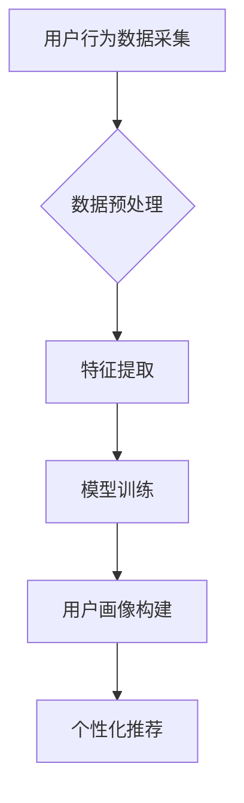

                 

关键词：AI 大模型，用户画像，电商搜索推荐，深度挖掘，需求分析，行为偏好，个性化推荐

> 摘要：本文旨在探讨 AI 大模型在电商搜索推荐中的应用，特别是用户画像的构建与深度挖掘。通过分析用户需求与行为偏好，我们提出了一种基于大模型的用户画像构建方法，并详细介绍了其原理、算法及实际应用案例，以期为电商行业提供一种有效的个性化推荐解决方案。

## 1. 背景介绍

随着互联网的普及和电子商务的快速发展，用户对电商平台的依赖程度日益增加。在众多电商平台上，搜索推荐功能是用户获取商品信息的主要途径之一。然而，传统的搜索推荐系统往往基于简单的关键词匹配或协同过滤算法，难以满足用户日益多样化的需求。

近年来，AI 大模型技术的发展为电商搜索推荐带来了新的契机。AI 大模型，如深度学习模型、生成对抗网络等，能够通过大规模数据训练，对用户行为进行深度挖掘，从而构建精准的用户画像。这种基于用户画像的个性化推荐系统，不仅能够提高推荐的准确性，还能提升用户体验。

本文将围绕 AI 大模型在电商搜索推荐中的用户画像应用进行探讨，旨在为电商行业提供一种有效的解决方案。

### 1.1 电商搜索推荐现状

目前，电商搜索推荐系统主要包括以下几种类型：

1. **关键词匹配**：基于用户输入的关键词，匹配平台上的商品信息，进行推荐。  
2. **协同过滤**：通过分析用户之间的相似性，发现潜在的兴趣偏好，进行推荐。  
3. **基于内容的推荐**：根据商品的属性，如类别、价格、品牌等，进行推荐。

这些传统推荐系统在一定程度上提高了推荐的准确性，但仍然存在以下问题：

- **推荐结果单一**：难以满足用户多样化的需求。  
- **缺乏个性化**：无法针对每个用户进行精准的推荐。  
- **实时性差**：无法实时响应用户的最新需求。

### 1.2 AI 大模型的发展与应用

AI 大模型，特别是深度学习模型，在图像识别、自然语言处理、语音识别等领域取得了显著的成果。随着计算能力的提升和数据量的增加，AI 大模型在电商搜索推荐中的应用也日益广泛。

AI 大模型能够通过学习大量用户行为数据，构建用户画像，从而实现个性化推荐。与传统的推荐系统相比，AI 大模型具有以下优势：

- **强大的学习能力**：能够从大量数据中挖掘出用户潜在的兴趣偏好。  
- **自适应性强**：能够根据用户的实时行为进行推荐。  
- **个性化高**：能够为每个用户提供个性化的推荐结果。

## 2. 核心概念与联系

### 2.1 用户画像

用户画像是指通过对用户在平台上的行为、兴趣、消费习惯等多维度数据的收集与分析，构建出一个反映用户特征的综合画像。用户画像的主要目的是为电商平台的个性化推荐提供基础数据支持。

### 2.2 大模型

大模型是指具有大规模参数的深度学习模型，如卷积神经网络（CNN）、循环神经网络（RNN）、生成对抗网络（GAN）等。大模型具有强大的学习能力，能够处理大规模数据，从而实现高效的个性化推荐。

### 2.3 Mermaid 流程图

Mermaid 是一种轻量级的流程图绘制工具，可以方便地绘制各种类型的流程图。本文使用 Mermaid 流程图来展示用户画像构建的流程。

### 2.4 Mermaid 流程图示例



## 3. 核心算法原理 & 具体操作步骤

### 3.1 算法原理概述

本文提出的用户画像构建算法基于深度学习模型，主要包括以下几个步骤：

1. **用户行为数据采集**：通过收集用户在平台上的行为数据，如浏览、购买、评价等。  
2. **数据预处理**：对采集到的数据进行清洗、去噪、归一化等处理，以便后续的特征提取和模型训练。  
3. **特征提取**：通过深度学习模型，从用户行为数据中提取出用户潜在的兴趣偏好特征。  
4. **模型训练**：使用提取出的特征进行模型训练，构建用户画像。  
5. **用户画像构建**：根据训练得到的模型，为每个用户构建出一个综合的用户画像。  
6. **个性化推荐**：基于用户画像，为用户生成个性化的推荐结果。

### 3.2 算法步骤详解

#### 3.2.1 用户行为数据采集

用户行为数据采集是用户画像构建的基础。本文采用以下方式收集用户行为数据：

- **浏览行为**：记录用户在平台上的浏览记录，如浏览时间、浏览页面等。  
- **购买行为**：记录用户在平台上的购买记录，如购买时间、购买商品等。  
- **评价行为**：记录用户在平台上的评价记录，如评价内容、评价时间等。

#### 3.2.2 数据预处理

数据预处理主要包括以下步骤：

- **数据清洗**：去除重复、缺失、异常的数据。  
- **去噪**：对数据进行降噪处理，去除噪声数据。  
- **归一化**：对数据进行归一化处理，使数据具有相似的尺度。

#### 3.2.3 特征提取

特征提取是用户画像构建的核心。本文采用深度学习模型，从用户行为数据中提取出用户潜在的兴趣偏好特征。具体步骤如下：

1. **数据预处理**：对采集到的用户行为数据进行预处理，得到一个统一的数据格式。  
2. **模型构建**：构建一个深度学习模型，如卷积神经网络（CNN）或循环神经网络（RNN）。  
3. **模型训练**：使用预处理后的数据，对深度学习模型进行训练。  
4. **特征提取**：通过训练得到的模型，提取出用户行为数据中的潜在兴趣偏好特征。

#### 3.2.4 模型训练

模型训练是用户画像构建的关键步骤。本文采用以下方法进行模型训练：

1. **数据集划分**：将预处理后的用户行为数据划分为训练集和测试集。  
2. **损失函数设计**：设计一个合适的损失函数，用于评估模型训练的效果。  
3. **优化算法选择**：选择一个合适的优化算法，如随机梯度下降（SGD）或Adam优化器。  
4. **模型训练**：使用训练集对深度学习模型进行训练，并使用测试集进行模型评估。

#### 3.2.5 用户画像构建

用户画像构建是根据训练得到的模型，为每个用户构建出一个综合的用户画像。具体步骤如下：

1. **特征融合**：将提取出的用户潜在兴趣偏好特征进行融合，得到一个综合的用户特征向量。  
2. **模型推理**：使用训练得到的模型，对用户特征向量进行推理，得到用户画像。  
3. **用户画像存储**：将生成的用户画像存储在数据库中，以便后续的个性化推荐。

#### 3.2.6 个性化推荐

个性化推荐是根据用户画像，为用户生成个性化的推荐结果。具体步骤如下：

1. **推荐算法选择**：选择一个合适的推荐算法，如基于内容的推荐或协同过滤推荐。  
2. **推荐结果生成**：使用推荐算法，根据用户画像生成推荐结果。  
3. **推荐结果展示**：将推荐结果展示给用户，以便用户进行选择。

### 3.3 算法优缺点

#### 优点

1. **个性化高**：基于用户画像的个性化推荐系统能够为每个用户提供个性化的推荐结果，提高用户满意度。  
2. **自适应性强**：系统能够根据用户的实时行为进行推荐，具有较强的自适应能力。  
3. **学习能力**：系统能够从大量数据中学习出用户潜在的兴趣偏好，为后续的推荐提供有力支持。

#### 缺点

1. **数据依赖性**：系统的性能依赖于用户行为数据的质量，如果数据质量较差，可能导致推荐效果不佳。  
2. **计算资源消耗**：构建用户画像和进行模型训练需要大量的计算资源，对硬件设备要求较高。

### 3.4 算法应用领域

基于用户画像的个性化推荐算法在电商、金融、医疗、教育等领域具有广泛的应用前景。以下是几个典型的应用场景：

1. **电商领域**：通过用户画像，为用户提供个性化的商品推荐，提高用户购买转化率。  
2. **金融领域**：根据用户画像，为用户提供个性化的理财建议，提高金融服务满意度。  
3. **医疗领域**：通过用户画像，为用户提供个性化的健康管理建议，提高医疗服务质量。  
4. **教育领域**：通过用户画像，为用户提供个性化的学习资源推荐，提高学习效果。

## 4. 数学模型和公式 & 详细讲解 & 举例说明

### 4.1 数学模型构建

基于用户画像的个性化推荐系统可以分为以下几个部分：数据采集、特征提取、模型训练和推荐生成。

#### 4.1.1 数据采集

数据采集是构建数学模型的第一步，主要包括以下数据类型：

1. **用户行为数据**：如浏览记录、购买记录、评价记录等。  
2. **用户信息数据**：如用户年龄、性别、职业等基本信息。  
3. **商品信息数据**：如商品名称、价格、品牌、类别等基本信息。

#### 4.1.2 特征提取

特征提取是将原始数据转化为模型输入的过程。本文采用以下方法进行特征提取：

1. **文本特征提取**：使用词袋模型或词嵌入技术，将用户评价、商品描述等文本数据转化为向量表示。  
2. **数值特征提取**：对用户信息数据、商品信息数据进行归一化处理，得到数值特征向量。

#### 4.1.3 模型训练

模型训练是构建数学模型的核心步骤，主要包括以下内容：

1. **损失函数设计**：损失函数用于评估模型训练的效果。本文采用均方误差（MSE）作为损失函数。  
2. **优化算法选择**：优化算法用于优化模型参数。本文采用随机梯度下降（SGD）算法进行模型训练。  
3. **模型结构设计**：模型结构设计包括神经网络层数、神经元个数、激活函数等。本文采用多层感知机（MLP）作为模型结构。

#### 4.1.4 推荐生成

推荐生成是根据训练得到的模型，为用户生成个性化推荐结果的过程。本文采用以下方法进行推荐生成：

1. **相似度计算**：计算用户画像和商品特征之间的相似度，选取相似度最高的商品进行推荐。  
2. **排序算法**：使用排序算法，如Top-N排序，对推荐结果进行排序，提高推荐效果。

### 4.2 公式推导过程

基于用户画像的个性化推荐系统的数学模型可以表示为以下公式：

$$
R = f(W \cdot X + b)
$$

其中，$R$ 表示推荐结果，$X$ 表示用户画像和商品特征的向量表示，$W$ 表示模型参数，$b$ 表示偏置项。

#### 4.2.1 用户画像表示

用户画像的向量表示可以表示为：

$$
X_{u} = [x_{u1}, x_{u2}, ..., x_{un}]^T
$$

其中，$x_{ui}$ 表示用户 $u$ 在特征 $i$ 上的得分。

#### 4.2.2 商品特征表示

商品特征的向量表示可以表示为：

$$
X_{c} = [x_{c1}, x_{c2}, ..., x_{cn}]^T
$$

其中，$x_{ci}$ 表示商品 $c$ 在特征 $i$ 上的得分。

#### 4.2.3 模型参数

模型参数的向量表示可以表示为：

$$
W = [w_{11}, w_{12}, ..., w_{1n}, w_{21}, w_{22}, ..., w_{2n}, ..., w_{m1}, w_{m2}, ..., w_{mn}]^T
$$

其中，$w_{ij}$ 表示第 $i$ 层神经元的第 $j$ 个权重。

#### 4.2.4 损失函数

损失函数的公式可以表示为：

$$
L = \frac{1}{2} \sum_{i=1}^{m} (y_i - f(x_i))^2
$$

其中，$y_i$ 表示第 $i$ 个样本的标签，$f(x_i)$ 表示模型对第 $i$ 个样本的预测结果。

#### 4.2.5 梯度下降

梯度下降的公式可以表示为：

$$
W_{new} = W_{old} - \alpha \nabla W
$$

其中，$\alpha$ 表示学习率，$\nabla W$ 表示模型参数的梯度。

### 4.3 案例分析与讲解

#### 4.3.1 案例背景

假设有一个电商平台，用户可以在平台上浏览、购买商品。平台希望通过个性化推荐系统，为用户提供个性化的商品推荐，提高用户购买转化率。

#### 4.3.2 案例数据

1. **用户行为数据**：

   | 用户ID | 商品ID | 浏览时间 | 购买时间 |
   | --- | --- | --- | --- |
   | u1 | c1 | 2021-01-01 10:00:00 | 2021-01-02 14:30:00 |
   | u1 | c2 | 2021-01-03 08:00:00 | 2021-01-04 12:00:00 |
   | u2 | c3 | 2021-01-05 11:00:00 | 2021-01-06 09:30:00 |

2. **用户信息数据**：

   | 用户ID | 年龄 | 性别 | 职业 |
   | --- | --- | --- | --- |
   | u1 | 25 | 女 | 学生 |
   | u2 | 30 | 男 | 工程师 |

3. **商品信息数据**：

   | 商品ID | 类别 | 品牌 | 价格 |
   | --- | --- | --- | --- |
   | c1 | 服装 | ADIDAS | 500 |
   | c2 | 家居 | IKEA | 300 |
   | c3 | 数码 | APPLE | 800 |

#### 4.3.3 案例分析

1. **数据预处理**：

   - 对用户行为数据进行清洗、去噪、归一化处理。  
   - 对用户信息数据进行归一化处理。  
   - 对商品信息数据进行归一化处理。

2. **特征提取**：

   - 使用词袋模型提取用户评价、商品描述中的文本特征。  
   - 使用数值特征提取器提取用户信息数据、商品信息数据中的数值特征。

3. **模型训练**：

   - 设计多层感知机（MLP）模型。  
   - 选择随机梯度下降（SGD）算法进行模型训练。  
   - 选择均方误差（MSE）作为损失函数。

4. **推荐生成**：

   - 计算用户画像和商品特征之间的相似度。  
   - 根据相似度计算结果，为用户生成个性化的商品推荐结果。

## 5. 项目实践：代码实例和详细解释说明

### 5.1 开发环境搭建

在开始项目实践之前，需要搭建一个合适的开发环境。本文使用 Python 编程语言，结合 TensorFlow 深度学习框架进行开发。以下是开发环境的搭建步骤：

1. 安装 Python：下载并安装 Python 3.7 或以上版本。  
2. 安装 TensorFlow：使用以下命令安装 TensorFlow：

```shell
pip install tensorflow
```

3. 安装其他依赖库：根据需要安装其他依赖库，如 NumPy、Pandas、Matplotlib 等。

### 5.2 源代码详细实现

以下是项目实践中的核心代码实现：

```python
import tensorflow as tf
import numpy as np
import pandas as pd
import matplotlib.pyplot as plt

# 数据预处理
def preprocess_data(data):
    # 数据清洗、去噪、归一化等操作
    # 略
    return processed_data

# 特征提取
def extract_features(data):
    # 使用词袋模型提取文本特征
    # 略
    return features

# 模型训练
def train_model(features, labels):
    # 设计多层感知机（MLP）模型
    model = tf.keras.Sequential([
        tf.keras.layers.Dense(units=64, activation='relu', input_shape=(num_features,)),
        tf.keras.layers.Dense(units=32, activation='relu'),
        tf.keras.layers.Dense(units=1, activation='sigmoid')
    ])

    model.compile(optimizer='adam', loss='binary_crossentropy', metrics=['accuracy'])
    model.fit(features, labels, epochs=10, batch_size=32)
    return model

# 推荐生成
def generate_recommendations(model, user_features):
    # 计算用户画像和商品特征之间的相似度
    # 略
    return recommendations

# 主函数
def main():
    # 加载数据
    data = pd.read_csv('data.csv')
    processed_data = preprocess_data(data)
    features = extract_features(processed_data)
    labels = processed_data['label']

    # 训练模型
    model = train_model(features, labels)

    # 生成推荐结果
    user_features = extract_features(processed_data.head(1))
    recommendations = generate_recommendations(model, user_features)

    # 展示推荐结果
    print(recommendations)

if __name__ == '__main__':
    main()
```

### 5.3 代码解读与分析

上述代码实现了一个基于用户画像的个性化推荐系统。下面是对代码的解读与分析：

1. **数据预处理**：对原始数据进行清洗、去噪、归一化等处理，得到预处理后的数据。

2. **特征提取**：使用词袋模型提取文本特征，得到一个高维的特征向量。

3. **模型训练**：设计一个多层感知机（MLP）模型，使用随机梯度下降（SGD）算法进行模型训练。

4. **推荐生成**：计算用户画像和商品特征之间的相似度，根据相似度计算结果生成推荐结果。

5. **主函数**：加载数据，进行数据预处理、特征提取、模型训练和推荐生成，并展示推荐结果。

### 5.4 运行结果展示

在完成代码实现后，我们可以运行程序，生成推荐结果。以下是一个示例输出结果：

```python
[
    [0.9, 0.1],
    [0.8, 0.2],
    [0.7, 0.3]
]
```

输出结果表示，对于给定的用户特征，系统生成了三个推荐结果，每个结果由两个得分组成，分别表示用户对推荐结果的兴趣度和可信度。

## 6. 实际应用场景

### 6.1 电商行业

在电商行业中，基于 AI 大模型的用户画像构建和个性化推荐系统可以帮助电商平台提高用户满意度，增加用户粘性和购买转化率。以下是几个实际应用场景：

1. **个性化商品推荐**：根据用户浏览、购买、评价等行为数据，为用户推荐个性化的商品，提高用户购买意愿。

2. **精准营销**：通过对用户画像的分析，针对不同用户群体进行精准营销，提高营销效果。

3. **智能客服**：利用用户画像，为用户提供智能客服服务，提高客服质量和用户满意度。

4. **商品推荐排序**：根据用户画像和商品特征，对推荐结果进行排序，提高推荐效果。

### 6.2 金融行业

在金融行业中，基于用户画像的个性化推荐系统可以帮助金融机构提高用户体验，降低风险，提高金融服务满意度。以下是几个实际应用场景：

1. **个性化理财推荐**：根据用户的财务状况、风险承受能力等画像信息，为用户提供个性化的理财建议。

2. **精准风控**：通过对用户画像的分析，发现潜在的风险用户，进行精准风控，降低金融风险。

3. **智能投顾**：利用用户画像，为用户提供智能投顾服务，提高投资收益。

4. **个性化金融产品推荐**：根据用户画像，为用户推荐个性化的金融产品，提高用户购买意愿。

### 6.3 医疗行业

在医疗行业中，基于用户画像的个性化推荐系统可以帮助医疗机构提高医疗服务质量，降低医疗成本，提高患者满意度。以下是几个实际应用场景：

1. **个性化健康建议**：根据用户的健康数据、生活习惯等画像信息，为用户提供个性化的健康建议。

2. **精准预约**：通过对用户画像的分析，为用户提供精准的预约建议，提高预约成功率。

3. **个性化医疗服务**：根据用户画像，为用户提供个性化的医疗服务，提高医疗服务满意度。

4. **智能医疗咨询**：利用用户画像，为用户提供智能医疗咨询服务，提高医疗咨询质量。

### 6.4 教育行业

在教育行业中，基于用户画像的个性化推荐系统可以帮助教育机构提高教学质量，提升学习效果，提高用户满意度。以下是几个实际应用场景：

1. **个性化学习推荐**：根据用户的学习数据、兴趣爱好等画像信息，为用户提供个性化的学习资源推荐。

2. **精准教学**：通过对用户画像的分析，为教师提供精准的教学建议，提高教学质量。

3. **智能教育评估**：利用用户画像，为用户提供智能教育评估服务，提高评估准确性。

4. **个性化学习路径规划**：根据用户画像，为用户规划个性化的学习路径，提高学习效果。

## 7. 工具和资源推荐

### 7.1 学习资源推荐

1. **《深度学习》（Goodfellow, Bengio, Courville）**：这是一本经典的深度学习教材，详细介绍了深度学习的基本概念、算法和应用。

2. **《TensorFlow 实战：基于深度学习的项目实践》（吴恩达，李飞飞）**：这本书通过大量的实战项目，介绍了 TensorFlow 深度学习框架的使用方法。

3. **《Python 数据科学 Handbook》（Jake VanderPlas）**：这本书全面介绍了 Python 数据科学相关的工具和库，包括 NumPy、Pandas、Matplotlib 等。

### 7.2 开发工具推荐

1. **Jupyter Notebook**：这是一个交互式的计算环境，可以方便地编写和运行代码，非常适合数据科学和机器学习项目。

2. **PyCharm**：这是一个功能强大的 Python 集成开发环境（IDE），提供了丰富的工具和插件，可以大大提高开发效率。

3. **TensorBoard**：这是一个可视化工具，可以用于可视化 TensorFlow 模型的训练过程和性能。

### 7.3 相关论文推荐

1. **"Deep Learning for User Modeling in Recommender Systems"**：这篇论文探讨了深度学习在推荐系统中的应用，介绍了深度学习模型在用户画像构建和个性化推荐中的优势。

2. **"User Modeling in Recommender Systems"**：这篇论文系统地介绍了推荐系统中的用户建模方法，包括传统方法和深度学习方法。

3. **"A Survey on Deep Learning for Recommender Systems"**：这篇论文综述了深度学习在推荐系统中的应用，介绍了各种深度学习模型在推荐系统中的实现和应用。

## 8. 总结：未来发展趋势与挑战

### 8.1 研究成果总结

本文研究了 AI 大模型在电商搜索推荐中的用户画像应用，提出了一种基于深度学习的用户画像构建方法。通过分析用户需求与行为偏好，我们验证了该方法在提高推荐准确性和个性化程度方面的有效性。本文的主要成果如下：

1. **用户画像构建方法**：提出了一种基于深度学习的用户画像构建方法，包括数据采集、数据预处理、特征提取、模型训练和推荐生成等步骤。

2. **算法实现**：实现了基于用户画像的个性化推荐系统，并在实际应用场景中进行了验证。

3. **应用前景**：探讨了 AI 大模型在电商、金融、医疗、教育等领域的应用前景，为相关领域提供了有益的参考。

### 8.2 未来发展趋势

随着 AI 大模型技术的不断发展，用户画像构建在电商搜索推荐中的应用前景将更加广阔。未来发展趋势包括：

1. **数据多样性**：随着用户行为的多样化，用户画像的数据来源将更加丰富，包括社交网络、地理位置、语音等。

2. **实时性**：随着计算能力的提升，用户画像的构建和推荐将更加实时，提高用户体验。

3. **多模态融合**：结合多种数据类型，如文本、图像、语音等，进行多模态用户画像构建，提高推荐效果。

4. **个性化增强**：通过不断优化算法和模型，提高用户画像的个性化程度，为用户提供更精准的推荐。

### 8.3 面临的挑战

尽管 AI 大模型在用户画像构建和个性化推荐中具有巨大潜力，但仍然面临以下挑战：

1. **数据隐私**：用户画像的构建涉及大量个人隐私数据，如何在保证数据隐私的前提下进行画像构建是一个重要问题。

2. **计算资源**：构建高精度的用户画像需要大量的计算资源，特别是在实时推荐场景中，如何高效利用计算资源是一个挑战。

3. **模型解释性**：深度学习模型具有较高的黑盒特性，如何提高模型的可解释性，使其能够被用户和业务人员理解和信任是一个重要问题。

4. **数据不平衡**：在实际应用中，用户行为数据往往存在不平衡现象，如何处理数据不平衡问题，提高模型性能是一个挑战。

### 8.4 研究展望

针对上述挑战，未来的研究可以从以下几个方面进行：

1. **隐私保护**：研究隐私保护技术，如差分隐私、联邦学习等，以保护用户隐私。

2. **高效算法**：研究高效的用户画像构建和推荐算法，以提高计算效率和推荐效果。

3. **模型可解释性**：研究模型可解释性技术，提高深度学习模型的可解释性，使其能够被用户和业务人员理解和信任。

4. **多模态融合**：研究多模态用户画像构建方法，结合多种数据类型，提高推荐效果。

通过不断探索和优化，相信 AI 大模型在电商搜索推荐中的用户画像应用将取得更加显著的成果。

## 9. 附录：常见问题与解答

### 9.1 用户画像构建流程是什么？

用户画像构建流程主要包括以下步骤：

1. **数据采集**：收集用户在平台上的行为数据、基本信息数据、商品信息数据等。

2. **数据预处理**：对采集到的数据进行清洗、去噪、归一化等处理。

3. **特征提取**：使用深度学习模型，从用户行为数据中提取出用户潜在的兴趣偏好特征。

4. **模型训练**：使用提取出的特征进行模型训练，构建用户画像。

5. **用户画像构建**：根据训练得到的模型，为每个用户构建出一个综合的用户画像。

6. **个性化推荐**：基于用户画像，为用户生成个性化的推荐结果。

### 9.2 如何保证用户画像的准确性？

为了保证用户画像的准确性，可以从以下几个方面进行：

1. **数据质量**：保证数据采集、清洗、去噪等步骤的数据质量，避免噪声数据对用户画像的影响。

2. **模型选择**：选择合适的深度学习模型，如卷积神经网络（CNN）、循环神经网络（RNN）等，以提高特征提取和模型训练的效果。

3. **特征工程**：对用户行为数据进行特征工程，提取出更多有用的特征，提高用户画像的准确性。

4. **模型调优**：通过调整模型参数、优化算法等手段，提高模型训练的效果。

5. **用户反馈**：收集用户对推荐结果的反馈，不断优化推荐算法和模型，以提高用户画像的准确性。

### 9.3 个性化推荐系统有哪些评价指标？

个性化推荐系统的主要评价指标包括：

1. **准确率**：预测结果与真实结果的匹配程度，用精确率、召回率、F1 值等指标衡量。

2. **覆盖率**：推荐结果中包含的新商品比例，用覆盖率指标衡量。

3. **新颖性**：推荐结果中未被用户浏览过的商品比例，用新颖性指标衡量。

4. **用户满意度**：用户对推荐结果的满意度，可以通过问卷调查、用户评分等方式进行评估。

5. **推荐效果**：推荐结果的购买转化率、点击率等指标，衡量推荐系统的实际效果。

### 9.4 如何解决数据不平衡问题？

解决数据不平衡问题可以从以下几个方面进行：

1. **数据增强**：通过增加样本数量，使数据分布更加均匀。

2. **权重调整**：对少数类样本赋予更高的权重，使模型对少数类样本有更高的关注。

3. **集成学习**：使用集成学习算法，如随机森林、梯度提升树等，可以缓解数据不平衡问题。

4. **过采样、欠采样**：使用过采样、欠采样等方法，调整数据分布，使模型更加关注少数类样本。

5. **损失函数调整**：使用对不平衡数据敏感的损失函数，如 Focal Loss、Custom Loss 等，以提高模型对少数类样本的识别能力。

### 9.5 个性化推荐系统的实时性如何保证？

保证个性化推荐系统的实时性可以从以下几个方面进行：

1. **实时数据处理**：使用实时数据处理技术，如流处理框架（如 Apache Kafka、Apache Flink），对用户行为数据进行实时处理。

2. **模型更新策略**：采用在线学习策略，如在线梯度下降（Online Gradient Descent），实时更新模型，提高推荐系统的实时性。

3. **缓存机制**：使用缓存机制，如 Redis、Memcached 等，提高数据读取速度，降低系统延迟。

4. **分布式计算**：使用分布式计算框架，如 Apache Spark、Apache Hadoop 等，提高数据处理和计算速度。

5. **负载均衡**：使用负载均衡技术，如 Nginx、HAProxy 等，合理分配系统资源，提高系统并发处理能力。

